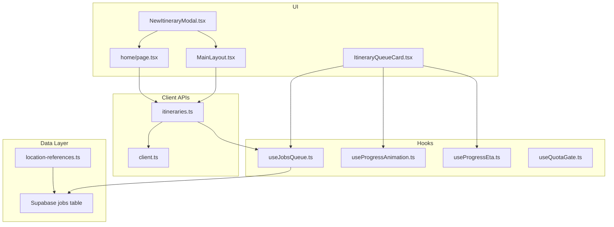
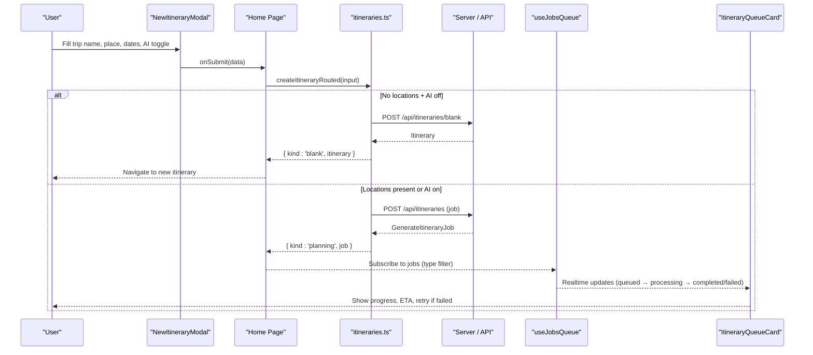
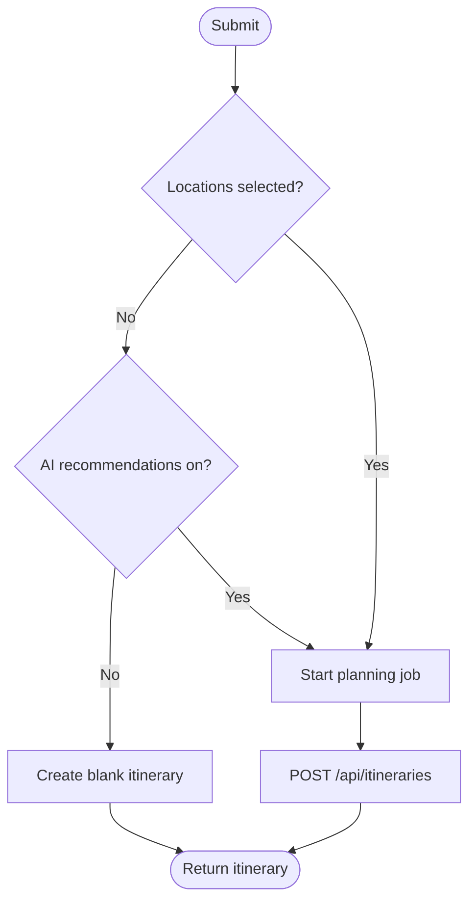
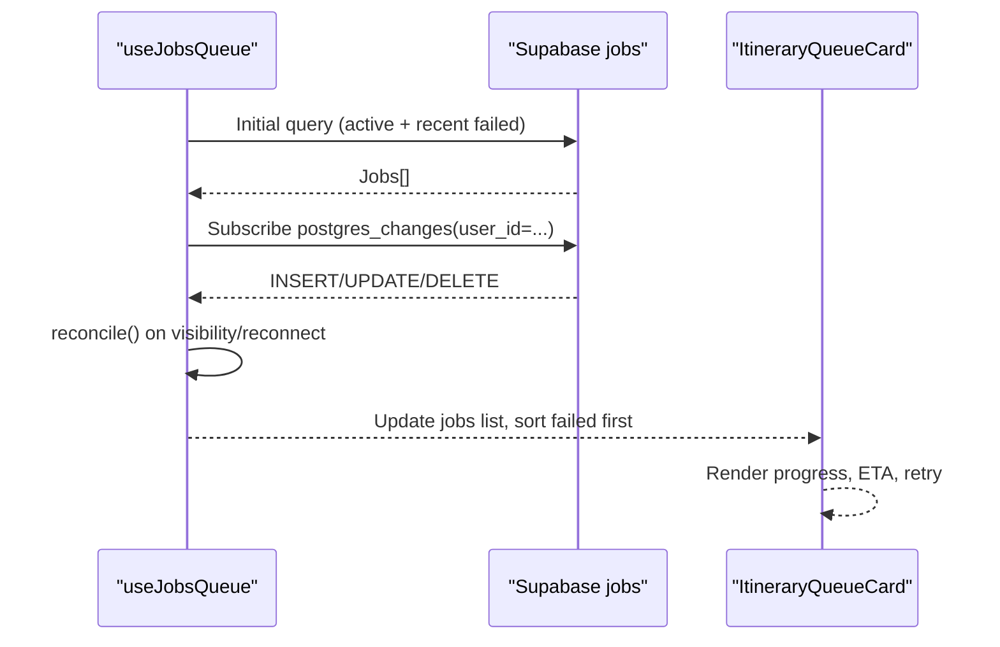
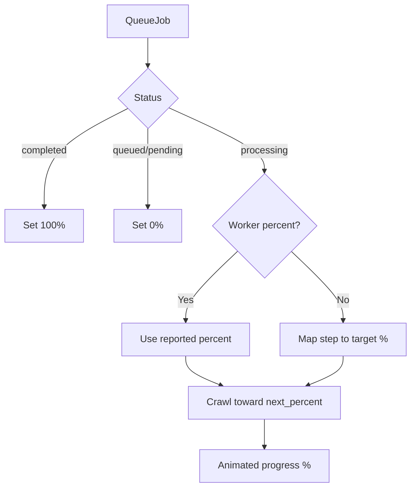
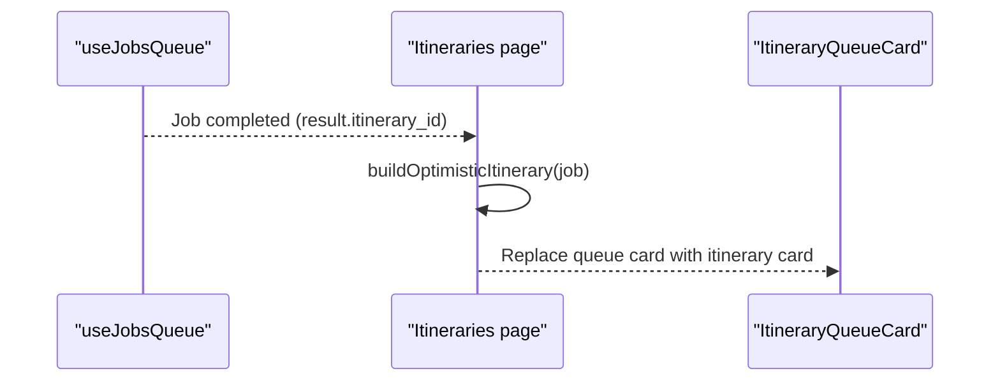
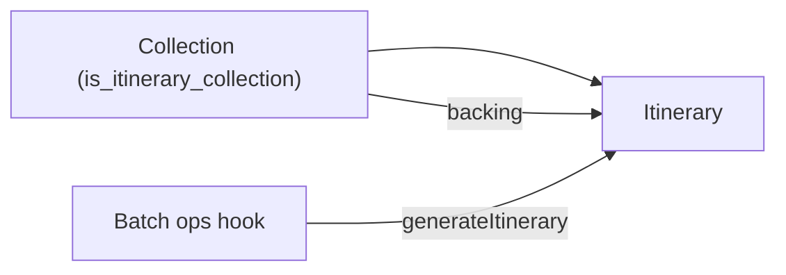
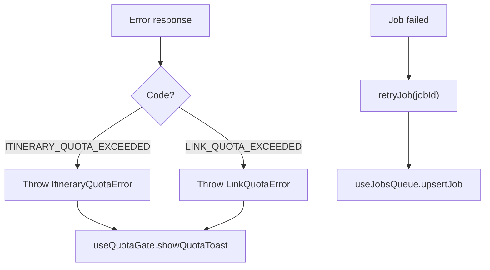
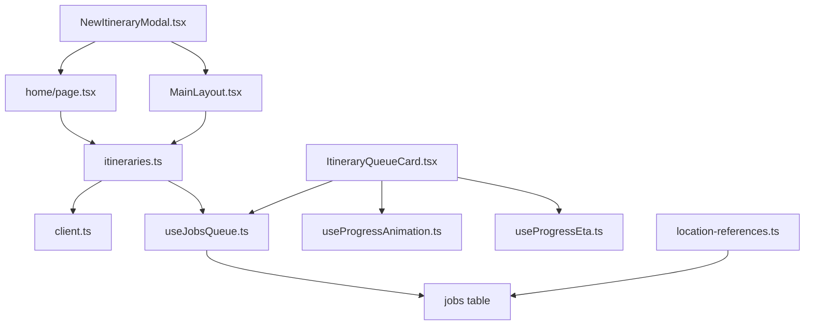

# Itinerary Generation & Planning

<cite>
**Referenced Files in This Document**
- [itineraries.ts](file://src/lib/api/itineraries.ts)
- [NewItineraryModal.tsx](file://src/components/ui/modals/NewItineraryModal.tsx)
- [useJobsQueue.ts](file://src/hooks/useJobsQueue.ts)
- [useProgressAnimation.ts](file://src/hooks/useProgressAnimation.ts)
- [useProgressEta.ts](file://src/hooks/useProgressEta.ts)
- [useQuotaGate.ts](file://src/hooks/useQuotaGate.ts)
- [client.ts](file://src/lib/api/client.ts)
- [page.tsx (Home)](file://src/app/home/page.tsx)
- [MainLayout.tsx](file://src/components/ui/layout/MainLayout.tsx)
- [ItineraryQueueCard.tsx](file://src/components/ui/itinerary/ItineraryQueueCard.tsx)
- [page.tsx (Itineraries list)](file://src/app/itineraries/page.tsx)
- [location-references.ts](file://src/lib/supabase/queries/location-references.ts)
- [useCollectionLocationBatchOperations.ts](file://src/hooks/useCollectionLocationBatchOperations.ts)
</cite>

## Table of Contents
1. Introduction
2. Project Structure
3. Core Components
4. Architecture Overview
5. Detailed Component Analysis
6. Dependency Analysis
7. Performance Considerations
8. Troubleshooting Guide
9. Conclusion

## Introduction
This document explains how the application generates itineraries from collections and user selections, including AI-powered route optimization, quota enforcement, background job processing, real-time progress updates, and completion handling. It also covers the generate modal interface, trip naming, error scenarios (quota exceeded, job failures), retry mechanisms, and the relationship between collections and itineraries, including automatic collection creation for generated itineraries.

## Project Structure
The itinerary generation flow spans UI components, API clients, hooks for queue management and progress, and Supabase-backed queries that link collections to itineraries.

**Diagram sources**
- [NewItineraryModal.tsx:16-43](file://src/components/ui/modals/NewItineraryModal.tsx#L16-L43)
- [page.tsx (Home):492-516](file://src/app/home/page.tsx#L492-L516)
- [MainLayout.tsx:181-216](file://src/components/ui/layout/MainLayout.tsx#L181-L216)
- [itineraries.ts:59-120](file://src/lib/api/itineraries.ts#L59-L120)
- [client.ts:130-155](file://src/lib/api/client.ts#L130-L155)
- [useJobsQueue.ts:45-159](file://src/hooks/useJobsQueue.ts#L45-L159)
- [ItineraryQueueCard.tsx:35-84](file://src/components/ui/itinerary/ItineraryQueueCard.tsx#L35-L84)
- [useProgressAnimation.ts:18-31](file://src/hooks/useProgressAnimation.ts#L18-L31)
- [useProgressEta.ts:30-59](file://src/hooks/useProgressEta.ts#L30-L59)
- [location-references.ts:110-145](file://src/lib/supabase/queries/location-references.ts#L110-L145)

**Section sources**
- [NewItineraryModal.tsx:16-43](file://src/components/ui/modals/NewItineraryModal.tsx#L16-L43)
- [itineraries.ts:59-120](file://src/lib/api/itineraries.ts#L59-L120)
- [useJobsQueue.ts:45-159](file://src/hooks/useJobsQueue.ts#L45-L159)

## Core Components
- New Itinerary Modal: Collects trip name, region/place, date range, and AI recommendations toggle; validates inputs and submits via a routed create function.
- Create Router: Decides whether to create a blank itinerary or start an async planning job based on location selection and AI toggle state.
- Job Queue: Realtime subscription to the jobs table with reconciliation, status transitions, and optimistic updates.
- Progress UI: Animated progress bar and ETA label derived from worker-reported progress and step data.
- Quota Gate: Centralized error messaging when users exceed plan limits.
- Collection-to-Itinerary Linking: Itinerary-linked collections are resolved to their corresponding itineraries for display and reference.

**Section sources**
- [NewItineraryModal.tsx:118-160](file://src/components/ui/modals/NewItineraryModal.tsx#L118-L160)
- [itineraries.ts:394-439](file://src/lib/api/itineraries.ts#L394-L439)
- [useJobsQueue.ts:45-159](file://src/hooks/useJobsQueue.ts#L45-L159)
- [useProgressAnimation.ts:18-31](file://src/hooks/useProgressAnimation.ts#L18-L31)
- [useProgressEta.ts:30-59](file://src/hooks/useProgressEta.ts#L30-L59)
- [useQuotaGate.ts:16-40](file://src/hooks/useQuotaGate.ts#L16-L40)
- [location-references.ts:110-145](file://src/lib/supabase/queries/location-references.ts#L110-L145)

## Architecture Overview
The system routes user actions through a modal into a create router that either creates a blank itinerary or enqueues an AI planning job. The job runs asynchronously, publishing realtime updates to the jobs table. The UI subscribes to these updates, renders progress, and replaces the queue card with the finished itinerary once complete.

**Diagram sources**
- [NewItineraryModal.tsx:118-160](file://src/components/ui/modals/NewItineraryModal.tsx#L118-L160)
- [page.tsx (Home):492-516](file://src/app/home/page.tsx#L492-L516)
- [itineraries.ts:394-439](file://src/lib/api/itineraries.ts#L394-L439)
- [useJobsQueue.ts:167-249](file://src/hooks/useJobsQueue.ts#L167-L249)
- [ItineraryQueueCard.tsx:81-84](file://src/components/ui/itinerary/ItineraryQueueCard.tsx#L81-L84)

## Detailed Component Analysis

### Itinerary Creation Flow and Routing
- Modal collects required fields and passes them to a submit handler.
- The create router decides:
  - Blank itinerary when no locations and AI is off.
  - Async planning job otherwise (with or without locations).
- Quota errors are thrown by the client layer and surfaced via a centralized quota gate.

**Diagram sources**
- [itineraries.ts:394-439](file://src/lib/api/itineraries.ts#L394-L439)
- [page.tsx (Home):492-516](file://src/app/home/page.tsx#L492-L516)
- [MainLayout.tsx:181-216](file://src/components/ui/layout/MainLayout.tsx#L181-L216)

**Section sources**
- [itineraries.ts:394-439](file://src/lib/api/itineraries.ts#L394-L439)
- [page.tsx (Home):492-516](file://src/app/home/page.tsx#L492-L516)
- [MainLayout.tsx:181-216](file://src/components/ui/layout/MainLayout.tsx#L181-L216)

### Background Job Processing and Realtime Updates
- useJobsQueue subscribes to the jobs table for the current user, filters by type, and reconciles missed updates on visibility changes or reconnects.
- It tracks last known statuses per job, emits terminal transition callbacks, and keeps only visible jobs (active states or recent failures).
- Optimistic upsert supports immediate UI feedback after retries.

**Diagram sources**
- [useJobsQueue.ts:105-159](file://src/hooks/useJobsQueue.ts#L105-L159)
- [useJobsQueue.ts:167-249](file://src/hooks/useJobsQueue.ts#L167-L249)
- [ItineraryQueueCard.tsx:150-188](file://src/components/ui/itinerary/ItineraryQueueCard.tsx#L150-L188)

**Section sources**
- [useJobsQueue.ts:105-159](file://src/hooks/useJobsQueue.ts#L105-L159)
- [useJobsQueue.ts:167-249](file://src/hooks/useJobsQueue.ts#L167-L249)

### Progress and ETA Visualization
- useProgressAnimation maps job steps and worker-reported percentages to a smooth progress value, crawling forward during long stages.
- useProgressEta computes a human-friendly countdown using worker-provided ETA and local ticking.

**Diagram sources**
- [useProgressAnimation.ts:18-31](file://src/hooks/useProgressAnimation.ts#L18-L31)
- [useProgressAnimation.ts:59-100](file://src/hooks/useProgressAnimation.ts#L59-L100)
- [useProgressEta.ts:30-59](file://src/hooks/useProgressEta.ts#L30-L59)

**Section sources**
- [useProgressAnimation.ts:18-31](file://src/hooks/useProgressAnimation.ts#L18-L31)
- [useProgressAnimation.ts:59-100](file://src/hooks/useProgressAnimation.ts#L59-L100)
- [useProgressEta.ts:30-59](file://src/hooks/useProgressEta.ts#L30-L59)

### Completion Handling and Itinerary Card Handover
- When a job completes, the itineraries list builds an optimistic itinerary from the job result so the grid slot fills immediately without refetch flicker.
- The queue card is removed as the finished itinerary card takes its place.

**Diagram sources**
- [page.tsx (Itineraries list):32-72](file://src/app/itineraries/page.tsx#L32-L72)
- [ItineraryQueueCard.tsx:55-84](file://src/components/ui/itinerary/ItineraryQueueCard.tsx#L55-L84)

**Section sources**
- [page.tsx (Itineraries list):32-72](file://src/app/itineraries/page.tsx#L32-L72)

### Relationship Between Collections and Itineraries
- Itinerary-linked collections resolve to their associated itineraries for display and references.
- Batch operations can trigger itinerary generation from selected locations within a collection context.

**Diagram sources**
- [location-references.ts:110-145](file://src/lib/supabase/queries/location-references.ts#L110-L145)
- [useCollectionLocationBatchOperations.ts:67-96](file://src/hooks/useCollectionLocationBatchOperations.ts#L67-L96)

**Section sources**
- [location-references.ts:110-145](file://src/lib/supabase/queries/location-references.ts#L110-L145)
- [useCollectionLocationBatchOperations.ts:67-96](file://src/hooks/useCollectionLocationBatchOperations.ts#L67-L96)

### Error Handling and Retry Mechanisms
- Quota exceeded: Client throws typed errors for itinerary quotas; a centralized hook shows upgrade prompts.
- Job failures: Failed jobs remain visible for one day; users can retry via a dedicated endpoint and optimistic merge.

**Diagram sources**
- [itineraries.ts:89-120](file://src/lib/api/itineraries.ts#L89-L120)
- [client.ts:130-155](file://src/lib/api/client.ts#L130-L155)
- [useQuotaGate.ts:16-40](file://src/hooks/useQuotaGate.ts#L16-L40)
- [useJobsQueue.ts:274-292](file://src/hooks/useJobsQueue.ts#L274-L292)

**Section sources**
- [itineraries.ts:89-120](file://src/lib/api/itineraries.ts#L89-L120)
- [client.ts:130-155](file://src/lib/api/client.ts#L130-L155)
- [useQuotaGate.ts:16-40](file://src/hooks/useQuotaGate.ts#L16-L40)
- [useJobsQueue.ts:274-292](file://src/hooks/useJobsQueue.ts#L274-L292)

## Dependency Analysis
- UI depends on the modal and pages to initiate creation.
- API client functions encapsulate endpoints and error mapping.
- Hooks manage realtime queue state and progress visualization.
- Data layer resolves collection-to-itinerary relationships.

**Diagram sources**
- [NewItineraryModal.tsx:16-43](file://src/components/ui/modals/NewItineraryModal.tsx#L16-L43)
- [page.tsx (Home):492-516](file://src/app/home/page.tsx#L492-L516)
- [MainLayout.tsx:181-216](file://src/components/ui/layout/MainLayout.tsx#L181-L216)
- [itineraries.ts:59-120](file://src/lib/api/itineraries.ts#L59-L120)
- [client.ts:130-155](file://src/lib/api/client.ts#L130-L155)
- [useJobsQueue.ts:45-159](file://src/hooks/useJobsQueue.ts#L45-L159)
- [ItineraryQueueCard.tsx:35-84](file://src/components/ui/itinerary/ItineraryQueueCard.tsx#L35-L84)
- [useProgressAnimation.ts:18-31](file://src/hooks/useProgressAnimation.ts#L18-L31)
- [useProgressEta.ts:30-59](file://src/hooks/useProgressEta.ts#L30-L59)
- [location-references.ts:110-145](file://src/lib/supabase/queries/location-references.ts#L110-L145)

**Section sources**
- [itineraries.ts:59-120](file://src/lib/api/itineraries.ts#L59-L120)
- [useJobsQueue.ts:45-159](file://src/hooks/useJobsQueue.ts#L45-L159)

## Performance Considerations
- Realtime updates are filtered by user and job type to minimize noise.
- Reconciliation prevents stale or missing updates when tabs are backgrounded or connections drop.
- Progress animation avoids backward jumps and uses worker-reported percentages where available to reduce unnecessary recalculations.
- ETA countdown ticks locally to avoid excessive server writes.

[No sources needed since this section provides general guidance]

## Troubleshooting Guide
- Quota Exceeded:
  - Symptom: Submitting a new itinerary fails with a quota error.
  - Behavior: Throws a typed error; centralized toast guides users to billing.
  - Resolution: Delete existing itineraries or upgrade plan.
- Job Failure:
  - Symptom: Queue card shows error message and “Try Again”.
  - Behavior: Recent failed jobs stay visible for 24 hours; retry endpoint re-enqueues.
  - Resolution: Click “Try Again”; UI optimistically merges retry result.
- Stalled Progress:
  - Symptom: Progress bar not moving.
  - Behavior: useJobsQueue reconciles on visibility change; useProgressAnimation crawls between steps.
  - Resolution: Switch tab focus or wait for next worker update.

**Section sources**
- [itineraries.ts:89-120](file://src/lib/api/itineraries.ts#L89-L120)
- [client.ts:130-155](file://src/lib/api/client.ts#L130-L155)
- [useQuotaGate.ts:16-40](file://src/hooks/useQuotaGate.ts#L16-L40)
- [useJobsQueue.ts:105-159](file://src/hooks/useJobsQueue.ts#L105-L159)
- [ItineraryQueueCard.tsx:150-188](file://src/components/ui/itinerary/ItineraryQueueCard.tsx#L150-L188)

## Conclusion
The itinerary generation pipeline combines a guided modal, intelligent routing, robust background job processing, and responsive real-time UI. It handles quota constraints, provides clear progress and ETA, and ensures a seamless handover from queued jobs to finished itineraries. Collections integrate tightly with itineraries, enabling batch-driven generation and unified references across the app.