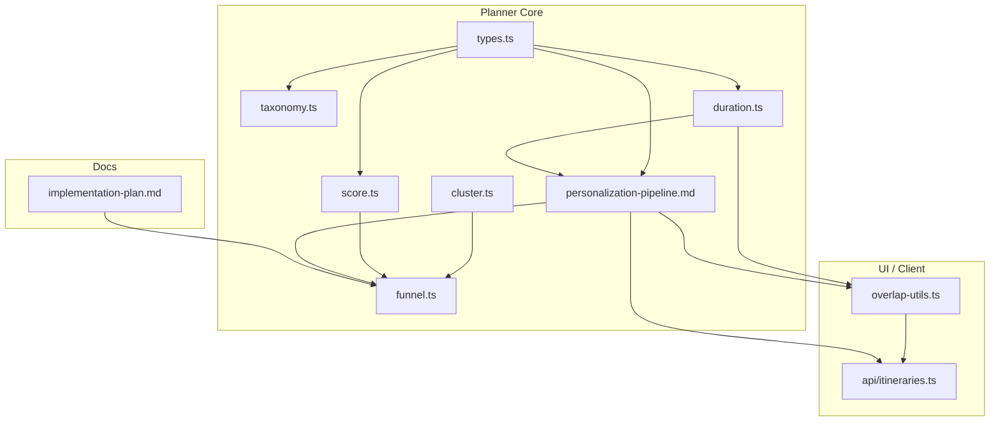
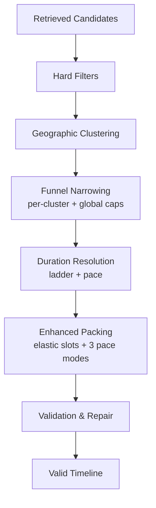
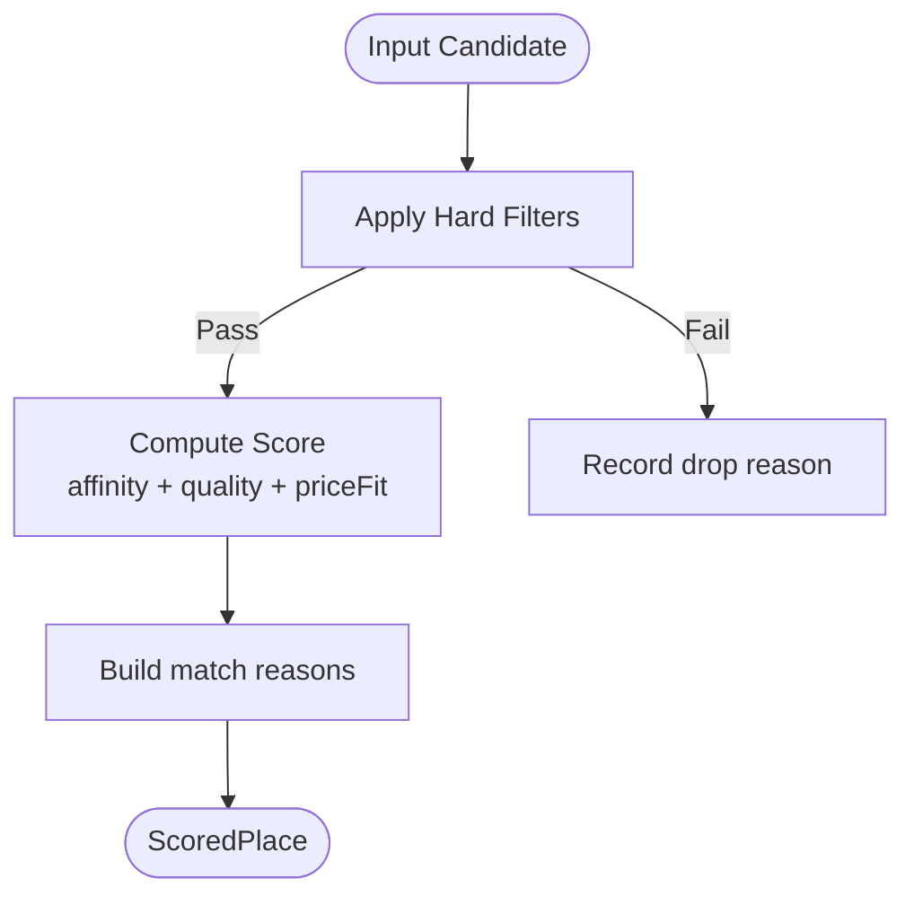
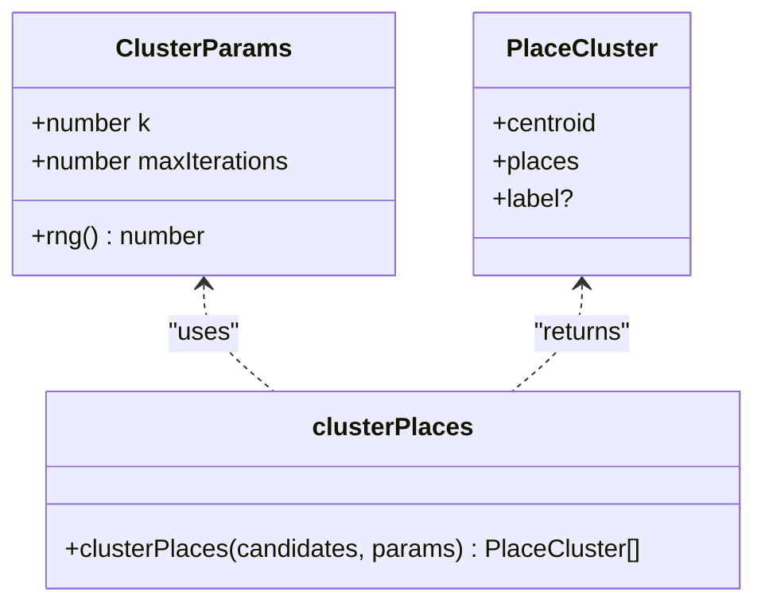
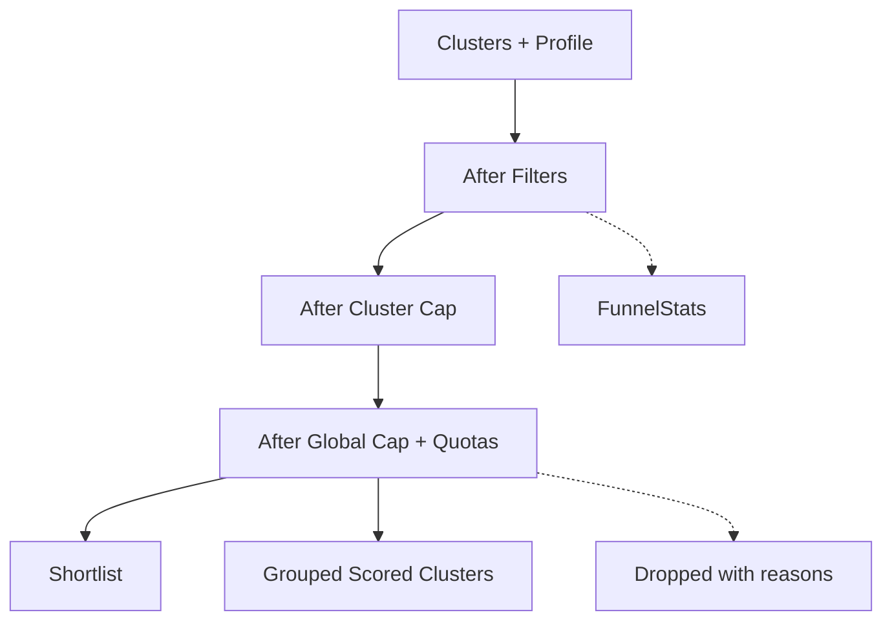
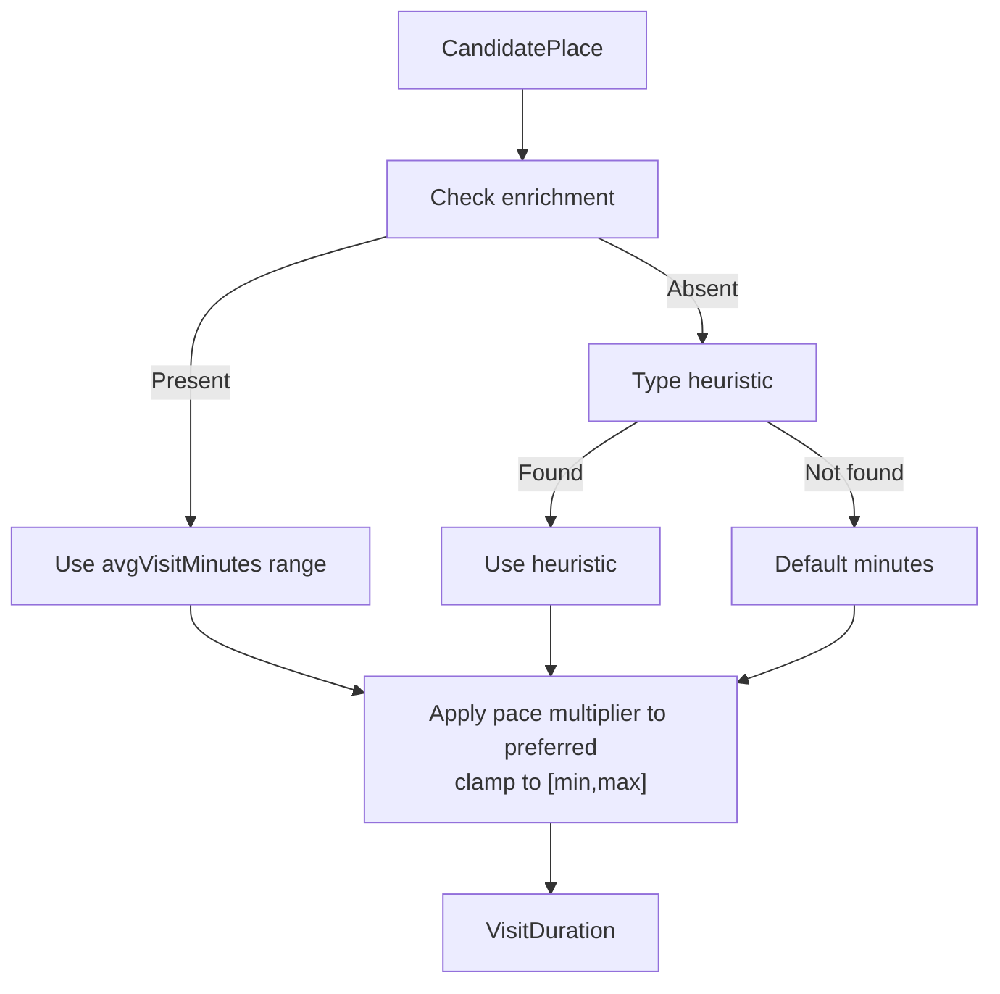
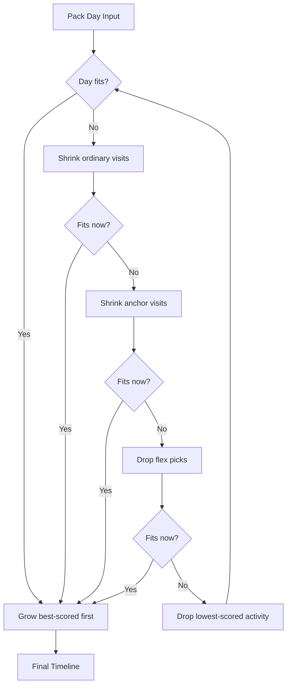
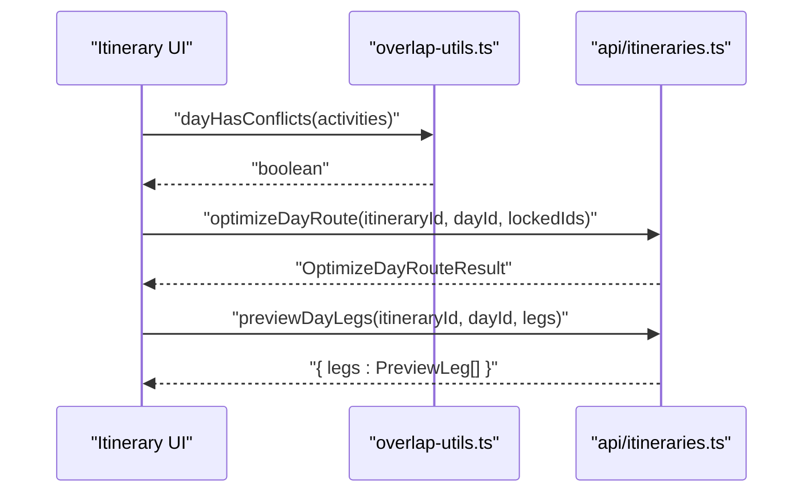
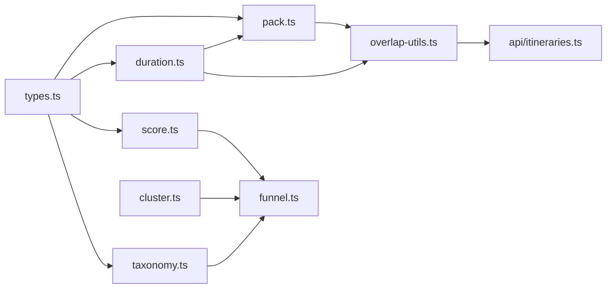

# Deterministic Planning Core

<cite>
**Referenced Files in This Document**
- [package.json](file://package.json)
- [src/lib/domain-types.ts](file://src/lib/domain-types.ts)
- [src/lib/planner/types.ts](file://src/lib/planner/types.ts)
- [src/lib/planner/taxonomy.ts](file://src/lib/planner/taxonomy.ts)
- [src/lib/planner/score.ts](file://src/lib/planner/score.ts)
- [src/lib/planner/cluster.ts](file://src/lib/planner/cluster.ts)
- [src/lib/planner/funnel.ts](file://src/lib/planner/funnel.ts)
- [src/lib/planner/duration.ts](file://src/lib/planner/duration.ts)
- [src/lib/planner/pack.ts](file://src/lib/planner/pack.ts)
- [src/components/ui/itinerary/overlap-utils.ts](file://src/components/ui/itinerary/overlap-utils.ts)
- [src/lib/api/itineraries.ts](file://src/lib/api/itineraries.ts)
- [docs/personalization-pipeline.md](file://docs/personalization-pipeline.md)
- [docs/implementation-plan.md](file://docs/implementation-plan.md)
</cite>

## Update Summary
**Changes Made**
- Added comprehensive documentation for the new elastic-slot packing algorithm with sophisticated geographic distance optimization
- Enhanced scoring mechanism documentation with Bayesian averaging and improved affinity calculations
- Expanded test coverage section highlighting the three pace modes (relaxed, balanced, packed)
- Updated architecture diagrams to reflect the new packing pipeline stages
- Added detailed analysis of the degradation ladder system for handling over-budget scenarios

## Table of Contents
1. [Introduction](#introduction)
2. [Project Structure](#project-structure)
3. [Core Components](#core-components)
4. [Architecture Overview](#architecture-overview)
5. [Detailed Component Analysis](#detailed-component-analysis)
6. [Dependency Analysis](#dependency-analysis)
7. [Performance Considerations](#performance-considerations)
8. [Test Coverage and Validation](#test-coverage-and-validation)
9. [Troubleshooting Guide](#troubleshooting-guide)
10. [Conclusion](#conclusion)

## Introduction
This document explains the Enhanced Deterministic Planning Core that powers itinerary generation. The core is a pure, test-first pipeline that turns user preferences and retrieved places into a valid, time-bounded daily schedule without relying on AI for scheduling or time math. It emphasizes reproducibility, explainability, and graceful degradation through staged narrowing, scoring, clustering, duration resolution, and sophisticated elastic-slot packing.

The system separates traveler profile from scheduler options, enforces hard constraints before any ranking, and keeps randomness explicit via injected sources so runs are deterministic under fixed inputs. **Updated**: The core now features advanced geographic packing with distance optimization and three distinct pace modes (relaxed, balanced, packed) that provide different scheduling strategies based on user preferences.

## Project Structure
At a high level:
- Planner modules live under src/lib/planner and implement retrieval-to-schedule logic as pure functions.
- The new packing module provides sophisticated elastic-slot scheduling with travel mode optimization.
- UI components provide route optimization previews and conflict detection around existing activities.
- API helpers call backend endpoints to optimize routes and preview travel legs.
- Documentation defines the pipeline stages and implementation plan.

**Diagram sources**
- [src/lib/planner/types.ts:1-126](file://src/lib/planner/types.ts#L1-L126)
- [src/lib/planner/taxonomy.ts:1-98](file://src/lib/planner/taxonomy.ts#L1-L98)
- [src/lib/planner/score.ts:1-237](file://src/lib/planner/score.ts#L1-L237)
- [src/lib/planner/cluster.ts:1-166](file://src/lib/planner/cluster.ts#L1-L166)
- [src/lib/planner/funnel.ts:1-503](file://src/lib/planner/funnel.ts#L1-L503)
- [src/lib/planner/duration.ts:1-105](file://src/lib/planner/duration.ts#L1-L105)
- [src/lib/planner/pack.ts:1-575](file://src/lib/planner/pack.ts#L1-L575)
- [src/components/ui/itinerary/overlap-utils.ts:288-302](file://src/components/ui/itinerary/overlap-utils.ts#L288-L302)
- [src/lib/api/itineraries.ts:298-337](file://src/lib/api/itineraries.ts#L298-L337)
- [docs/personalization-pipeline.md:389-577](file://docs/personalization-pipeline.md#L389-L577)
- [docs/implementation-plan.md:335-416](file://docs/implementation-plan.md#L335-L416)

**Section sources**
- [package.json:1-51](file://package.json#L1-L51)
- [src/lib/domain-types.ts:1-20](file://src/lib/domain-types.ts#L1-L20)

## Core Components
- Types and profiles: PreferenceProfile and SchedulerOptions define what describes the traveler versus how the scheduler behaves.
- Taxonomy bridge: Maps interests and dietary needs to Google types and text queries used during retrieval and affinity scoring.
- Scoring: Applies hard filters first, then computes a weighted score combining interest affinity, quality (Bayesian average), and price fit.
- Clustering: Groups candidates geographically using k-means++ with an injected RNG for determinism; k equals total days.
- Funnel: Staged narrowing with per-cluster caps, global cap, restaurant/cuisine quotas, serendipity selection, and dietary/budget ladders.
- Duration resolution: Resolves visit durations via a ladder (place data, enrichment, type heuristics, default) and applies pace multipliers safely within min/max bounds.
- **Enhanced Packing**: Sophisticated elastic-slot packing with three pace modes, travel mode optimization (walk vs transit), and comprehensive degradation ladder for handling over-budget scenarios.
- Route optimization and conflict detection: UI-level utilities detect conflicts and trigger Google-backed route optimization previews.

**Section sources**
- [src/lib/planner/types.ts:1-126](file://src/lib/planner/types.ts#L1-L126)
- [src/lib/planner/taxonomy.ts:1-98](file://src/lib/planner/taxonomy.ts#L1-L98)
- [src/lib/planner/score.ts:1-237](file://src/lib/planner/score.ts#L1-L237)
- [src/lib/planner/cluster.ts:1-166](file://src/lib/planner/cluster.ts#L1-L166)
- [src/lib/planner/funnel.ts:1-503](file://src/lib/planner/funnel.ts#L1-L503)
- [src/lib/planner/duration.ts:1-105](file://src/lib/planner/duration.ts#L1-L105)
- [src/lib/planner/pack.ts:1-575](file://src/lib/planner/pack.ts#L1-L575)
- [src/components/ui/itinerary/overlap-utils.ts:288-302](file://src/components/ui/itinerary/overlap-utils.ts#L288-L302)
- [src/lib/api/itineraries.ts:298-337](file://src/lib/api/itineraries.ts#L298-L337)

## Architecture Overview
The enhanced deterministic planning pipeline proceeds in stages:
1. Retrieval produces CandidatePlace objects.
2. Hard filters remove invalid candidates (closed, dietary violations for meals, extreme budget mismatches).
3. Geographic clustering groups nearby candidates by day.
4. Funnel narrows to a shortlist per cluster and globally with quotas.
5. Duration resolution assigns elastic visit windows based on place signals and pace.
6. **Enhanced Packing**: Elastic-slot packing schedules activities into contiguous timeline segments with meal anchors, travel leg optimization, and three pace modes.
7. Validation ensures feasibility; repairs swap in alternates from ranked lists.
8. Optional narration enriches content after scheduling.

**Diagram sources**
- [docs/personalization-pipeline.md:389-577](file://docs/personalization-pipeline.md#L389-L577)
- [docs/implementation-plan.md:335-416](file://docs/implementation-plan.md#L335-L416)

## Detailed Component Analysis

### Types and Profiles
- PreferenceProfile captures traveler intent: interests, dietary constraints, pace, optional budget, and learned affinities.
- SchedulerOptions capture algorithm knobs like clustering method, iteration limits, and day boundaries.
- CandidatePlace models normalized place data consumed by the planner.
- PlaceEnrichment carries cached LLM-derived metadata such as tags, visit duration ranges, signature dishes, and crowd profiles.

Key design rule: profile describes the traveler; options describe the scheduler. They are never merged.

**Section sources**
- [src/lib/planner/types.ts:1-126](file://src/lib/planner/types.ts#L1-L126)

### Taxonomy Bridge
- Maps each Interest to Google Places types and text queries with city interpolation.
- Provides deduplicated type sets across interests to minimize billed queries.
- Supports dietary bridges for known needs; unknown needs fall back to filtering.

**Section sources**
- [src/lib/planner/taxonomy.ts:1-98](file://src/lib/planner/taxonomy.ts#L1-L98)

### Enhanced Scoring and Hard Filters
- Hard filters run first: permanently closed places, dietary conflicts for meal slots, and extreme budget mismatches are removed immediately.
- Score combines:
  - Affinity: fraction of matched interests.
  - Quality: Bayesian average rating to stabilize low-review places.
  - Price fit: asymmetric penalty only above budget; unknown price levels score neutral.
- Match reasons are always non-empty for survivors to power "why this place" UX.

**Diagram sources**
- [src/lib/planner/score.ts:1-237](file://src/lib/planner/score.ts#L1-L237)

**Section sources**
- [src/lib/planner/score.ts:1-237](file://src/lib/planner/score.ts#L1-L237)

### Geographic Clustering
- Implements k-means++ seeding with an injected RNG for deterministic runs.
- Ensures no empty clusters; re-seeds emptied centroids with the farthest point.
- Returns clusters with centroids and member places; labels are filled later.

**Diagram sources**
- [src/lib/planner/cluster.ts:1-166](file://src/lib/planner/cluster.ts#L1-L166)

**Section sources**
- [src/lib/planner/cluster.ts:1-166](file://src/lib/planner/cluster.ts#L1-L166)

### Candidate Funnel
- Stages:
  - Hard filters (cluster-agnostic).
  - Per-cluster cap by score to prevent one district starving others.
  - Global cap with restaurant share and cuisine diversity quotas.
- Outputs:
  - Stage histories for stats.
  - Shortlist scored best-first.
  - Grouped clusters ordered by cluster_score (mean top-N scores plus small coverage/variety bonuses).
  - Every dropped candidate recorded with stage and reason.
- Serendipity slot picks a high-scoring, lower-review place matching at least one interest.
- Dietary and budget ladders degrade gracefully when strict rules yield no candidates.

**Diagram sources**
- [src/lib/planner/funnel.ts:1-503](file://src/lib/planner/funnel.ts#L1-L503)

**Section sources**
- [src/lib/planner/funnel.ts:1-503](file://src/lib/planner/funnel.ts#L1-L503)

### Duration Resolution
- Ladder order:
  1. Explicit stay_duration if present.
  2. Enrichment avgVisitMinutes range.
  3. Type-based heuristic table.
  4. Global default minutes.
- Pace multiplier adjusts preferred duration but never violates min/max bounds.
- Produces VisitDuration with min, preferred, max for elastic packing.

**Diagram sources**
- [src/lib/planner/duration.ts:1-105](file://src/lib/planner/duration.ts#L1-L105)

**Section sources**
- [src/lib/planner/duration.ts:1-105](file://src/lib/planner/duration.ts#L1-L105)

### Enhanced Elastic-Slot Packing Algorithm
**New Feature**: The packing algorithm implements sophisticated elastic-slot scheduling with three distinct pace modes and comprehensive distance optimization.

#### Three Pace Modes
- **Relaxed**: Longer buffers (25 min), earlier day end (20:00), builds at max durations, shrinks toward preferred minimum
- **Balanced**: Medium buffers (15 min), standard day end (21:00), builds at preferred durations, flexible shrinking
- **Packed**: Short buffers (10 min), full day utilization, builds at minimum durations, maximizes activity count

#### Distance Optimization
- Automatic travel mode selection: walk under 1.2km, transit beyond
- Travel leg provider integration for real-time distance calculations
- Optimized packing considers actual distances between locations

#### Degradation Ladder
When a day doesn't fit, the algorithm follows a strict priority order:
1. Shrink ordinary visits proportionally toward minimum
2. Shrink anchor visits (long activities >180 min)
3. Drop flex picks (lowest score first)
4. Drop lowest-scored activities (meals protected until last)

**Diagram sources**
- [src/lib/planner/pack.ts:296-315](file://src/lib/planner/pack.ts#L296-L315)
- [src/lib/planner/pack.ts:374-405](file://src/lib/planner/pack.ts#L374-L405)

**Section sources**
- [src/lib/planner/pack.ts:1-575](file://src/lib/planner/pack.ts#L1-L575)

### Route Optimization and Conflict Detection
- Detects activity overlaps and transport overflow within a day.
- Triggers Google-backed route optimization to reorder activities while respecting locked items.
- Can preview travel legs for hypothetical adjacencies without persisting changes.

**Diagram sources**
- [src/components/ui/itinerary/overlap-utils.ts:288-302](file://src/components/ui/itinerary/overlap-utils.ts#L288-L302)
- [src/lib/api/itineraries.ts:298-337](file://src/lib/api/itineraries.ts#L298-L337)

**Section sources**
- [src/components/ui/itinerary/overlap-utils.ts:288-302](file://src/components/ui/itinerary/overlap-utils.ts#L288-L302)
- [src/lib/api/itineraries.ts:298-337](file://src/lib/api/itineraries.ts#L298-L337)

## Dependency Analysis
- score.ts depends on taxonomy.ts for interest mapping and price-level utilities.
- funnel.ts composes cluster.ts outputs and score.ts functions; it also uses taxonomy for dietary bridging.
- duration.ts consumes CandidatePlace and PlaceEnrichment shapes defined in types.ts.
- **pack.ts** integrates with all core components and provides the final scheduling layer.
- UI overlap utilities depend on domain types and integrate with API calls for route optimization.

**Diagram sources**
- [src/lib/planner/types.ts:1-126](file://src/lib/planner/types.ts#L1-L126)
- [src/lib/planner/taxonomy.ts:1-98](file://src/lib/planner/taxonomy.ts#L1-L98)
- [src/lib/planner/score.ts:1-237](file://src/lib/planner/score.ts#L1-L237)
- [src/lib/planner/cluster.ts:1-166](file://src/lib/planner/cluster.ts#L1-L166)
- [src/lib/planner/funnel.ts:1-503](file://src/lib/planner/funnel.ts#L1-L503)
- [src/lib/planner/duration.ts:1-105](file://src/lib/planner/duration.ts#L1-L105)
- [src/lib/planner/pack.ts:1-575](file://src/lib/planner/pack.ts#L1-L575)
- [src/components/ui/itinerary/overlap-utils.ts:288-302](file://src/components/ui/itinerary/overlap-utils.ts#L288-L302)
- [src/lib/api/itineraries.ts:298-337](file://src/lib/api/itineraries.ts#L298-L337)

**Section sources**
- [src/lib/planner/funnel.ts:1-503](file://src/lib/planner/funnel.ts#L1-L503)
- [src/lib/planner/score.ts:1-237](file://src/lib/planner/score.ts#L1-L237)
- [src/lib/planner/cluster.ts:1-166](file://src/lib/planner/cluster.ts#L1-L166)
- [src/lib/planner/duration.ts:1-105](file://src/lib/planner/duration.ts#L1-L105)
- [src/lib/planner/pack.ts:1-575](file://src/lib/planner/pack.ts#L1-L575)

## Performance Considerations
- Deterministic algorithms avoid randomness leaks by injecting RNG sources; this enables reproducible tests and stable runs.
- Funnel caps limit LLM input size and reduce downstream cost; per-cluster and global quotas keep shortlists manageable.
- Duration resolution uses efficient heuristics and avoids expensive calls until necessary.
- **Enhanced packing performance**: The elastic-slot algorithm uses proportional shrinking rather than worst-case dropping, optimizing for maximum activity inclusion.
- Travel mode optimization reduces unnecessary transit usage for short distances.
- Route optimization is invoked only when needed and can preview legs without persisting changes.

## Test Coverage and Validation
**Expanded Coverage**: The testing suite comprehensively validates all aspects of the enhanced planning core:

### Packing Algorithm Tests
- **Timeline structure validation**: Ensures contiguous timelines with no gaps or overlaps across all pace modes
- **Anchor behavior**: Validates that long activities (>180 min) become anchors and maintain their preferred duration
- **Travel mode optimization**: Tests automatic walk/transit selection based on distance thresholds
- **Degradation ladder**: Comprehensive testing of the strict priority order for handling over-budget scenarios
- **Pace mode differences**: Validates that relaxed, balanced, and packed modes produce distinctly different results

### Scoring Mechanism Tests
- **Bayesian averaging**: Tests that places with more reviews rank higher than those with fewer reviews at similar ratings
- **Affinity calculation**: Validates interest matching and scoring proportions
- **Price fit asymmetry**: Confirms that under-budget places aren't penalized while over-budget places are appropriately discounted
- **Hard filter guarantees**: Extensive testing of dietary restrictions, closure status, and budget constraints

### Integration Tests
- **End-to-end pipeline**: Full workflow testing from retrieval through packing
- **Deterministic behavior**: Verification that identical inputs produce identical outputs
- **Edge case handling**: Testing thin cities, dense areas, and mixed venue types

**Section sources**
- [src/lib/planner/pack.test.ts:1-413](file://src/lib/planner/pack.test.ts#L1-L413)
- [src/lib/planner/score.test.ts:1-227](file://src/lib/planner/score.test.ts#L1-L227)

## Troubleshooting Guide
Common issues and where to look:
- Overlaps or transport overflow: Use conflict detection to identify problematic activities and consider route optimization.
- Closed or unavailable places: Ensure validation swaps in alternates; check hard filters and opening hours integration.
- Budget or dietary mismatches: Review hard filter context and degradation ladders to understand why candidates were excluded or widened.
- Non-deterministic results: Verify RNG injection and ensure no ambient randomness is used in clustering or other stochastic steps.
- **Packing issues**: Check the degradation ladder output to understand why specific activities were dropped or shortened.
- **Pace mode problems**: Verify that the selected pace mode aligns with user expectations for buffer times and day length.

**Section sources**
- [src/components/ui/itinerary/overlap-utils.ts:288-302](file://src/components/ui/itinerary/overlap-utils.ts#L288-L302)
- [src/lib/planner/score.ts:1-237](file://src/lib/planner/score.ts#L1-L237)
- [src/lib/planner/funnel.ts:1-503](file://src/lib/planner/funnel.ts#L1-L503)
- [src/lib/planner/pack.ts:1-575](file://src/lib/planner/pack.ts#L1-L575)
- [docs/implementation-plan.md:335-416](file://docs/implementation-plan.md#L335-L416)

## Conclusion
The Enhanced Deterministic Planning Core delivers a robust, auditable itinerary engine grounded in pure functions, staged narrowing, and strict constraints. By separating traveler preferences from scheduler options, enforcing hard filters early, and keeping randomness explicit, it produces consistent, explainable plans that scale gracefully and integrate smoothly with UI-driven optimizations.

**Enhanced Features**: The addition of sophisticated elastic-slot packing with three pace modes, comprehensive distance optimization, and extensive test coverage provides users with more flexible and reliable itinerary generation. The degradation ladder ensures that even challenging scenarios result in sensible schedules with clear explanations for any compromises made.

The system now handles complex urban environments with diverse venue types, varying distances, and tight time constraints while maintaining the core principles of determinism, transparency, and user control.