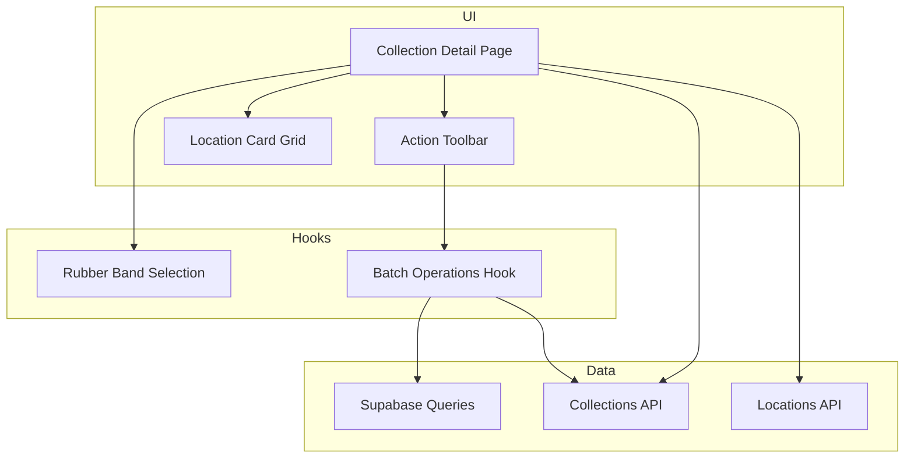
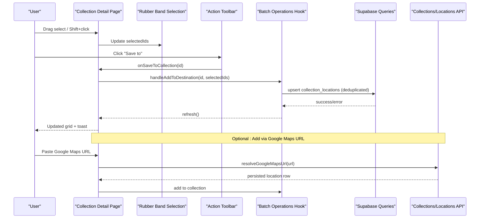
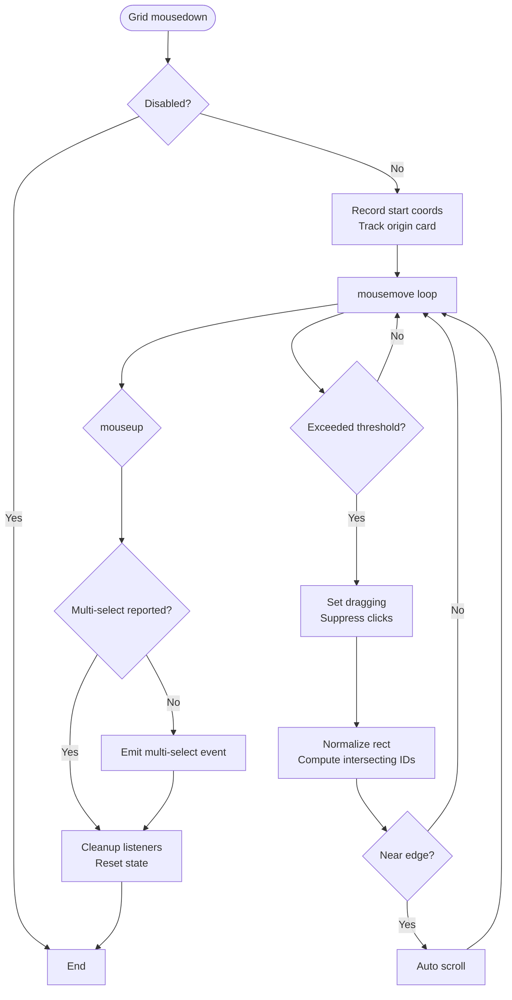
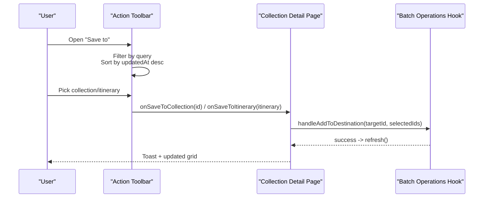
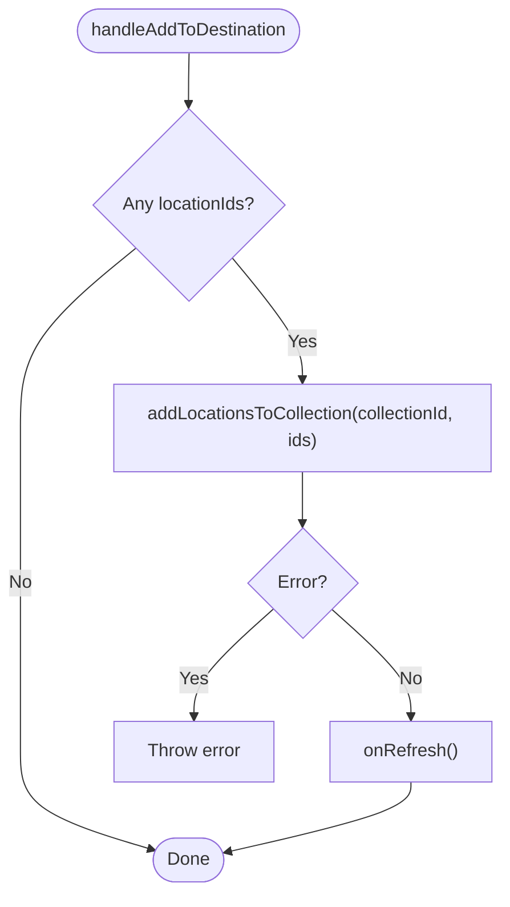
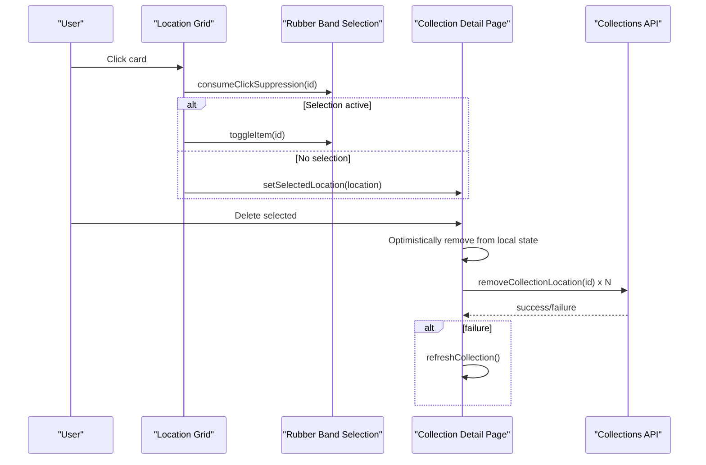
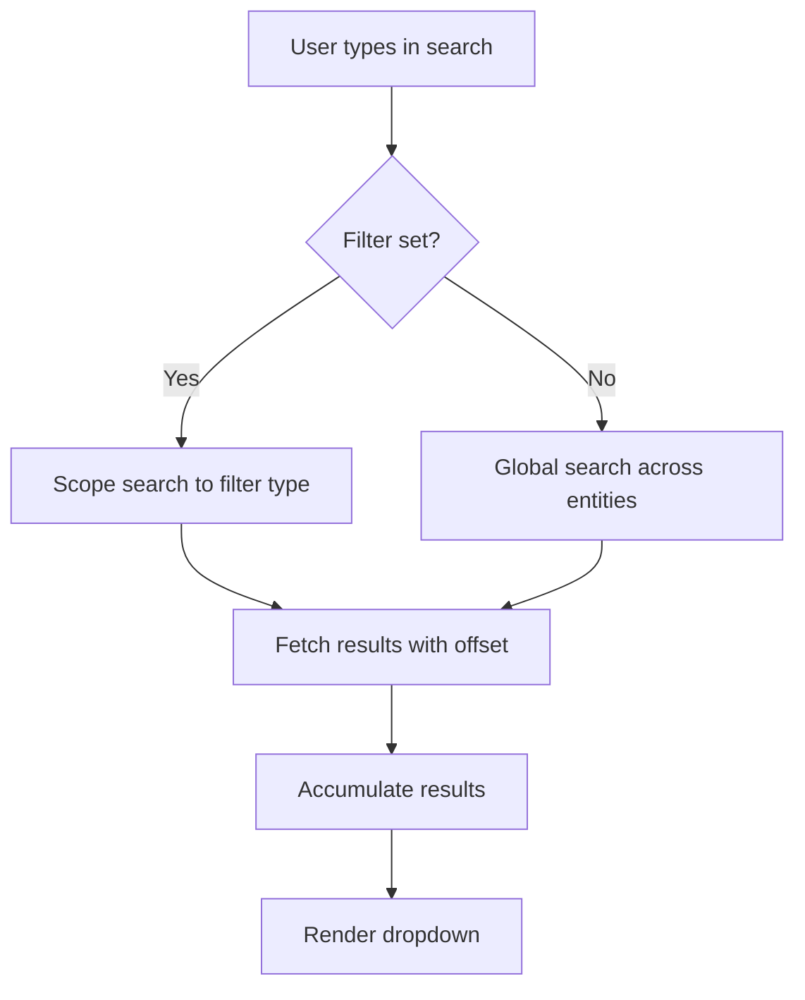
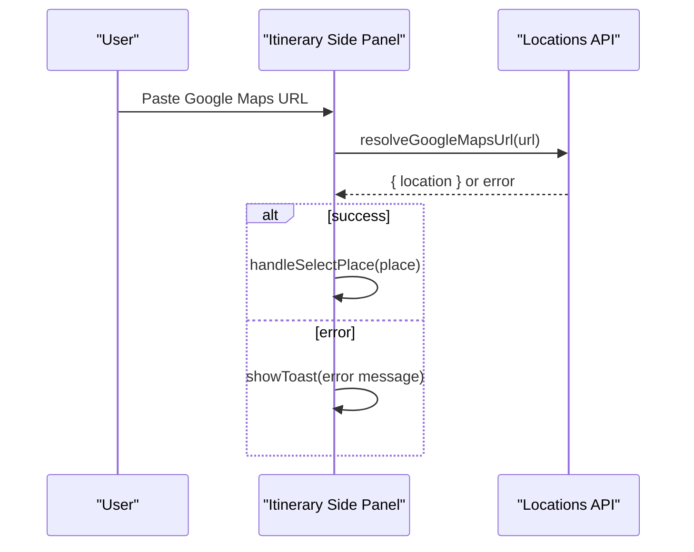
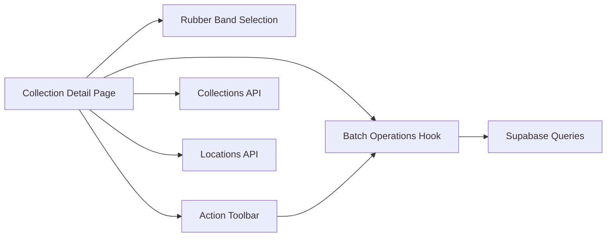

# Location Management & Organization

<cite>
**Referenced Files in This Document**
- [useCollectionLocationBatchOperations.ts](file://src/hooks/useCollectionLocationBatchOperations.ts)
- [useRubberBandSelection.ts](file://src/hooks/useRubberBandSelection.ts)
- [ActionToolbar.tsx](file://src/components/ui/dashboard/ActionToolbar.tsx)
- [LocationCard.tsx](file://src/components/ui/cards/LocationCard.tsx)
- [page.tsx (collection detail)](file://src/app/collections/[id]/page.tsx)
- [queries.ts](file://src/lib/supabase/queries.ts)
- [collections.ts](file://src/lib/api/collections.ts)
- [locations.ts](file://src/lib/api/locations.ts)
- [domain-types.ts](file://src/lib/domain-types.ts)
- [ItinerarySidePanel.tsx](file://src/components/ui/itinerary/ItinerarySidePanel.tsx)
- [page.tsx (itinerary detail)](file://src/app/itineraries/[id]/page.tsx)
</cite>

## Table of Contents
1. Introduction
2. Project Structure
3. Core Components
4. Architecture Overview
5. Detailed Component Analysis
6. Dependency Analysis
7. Performance Considerations
8. Troubleshooting Guide
9. Conclusion

## Introduction
This document explains how locations are managed within collections, focusing on batch operations, individual location management, search and filtering, rubber band selection, bulk actions toolbar, and the location grid view. It also covers deduplication during add operations, sorting behavior, optimistic updates, Google Maps URL processing, and pending location states. The goal is to help both technical and non-technical users understand the end-to-end workflows for organizing discovered places, managing large collections, and performing mass operations efficiently.

## Project Structure
The location management system spans UI components, hooks, and API layers:
- UI layer: Collection detail page renders a responsive card grid with selection and bulk actions.
- Selection layer: A rubber band selection hook manages multi-select state and interactions.
- Batch operations: A hook encapsulates adding locations to collections and generating itineraries from selections.
- Data layer: Supabase queries handle upserts and collection preview images; API modules wrap server endpoints for collections and Google Maps link resolution.

**Diagram sources**
- [page.tsx (collection detail):114-124](file://src/app/collections/[id]/page.tsx#L114-L124)
- [ActionToolbar.tsx:226-304](file://src/components/ui/dashboard/ActionToolbar.tsx#L226-L304)
- [useRubberBandSelection.ts:76-123](file://src/hooks/useRubberBandSelection.ts#L76-L123)
- [useCollectionLocationBatchOperations.ts:32-65](file://src/hooks/useCollectionLocationBatchOperations.ts#L32-L65)
- [queries.ts:103-114](file://src/lib/supabase/queries.ts#L103-L114)
- [collections.ts:116-125](file://src/lib/api/collections.ts#L116-L125)
- [locations.ts:39-47](file://src/lib/api/locations.ts#L39-L47)

**Section sources**
- [page.tsx (collection detail):114-124](file://src/app/collections/[id]/page.tsx#L114-L124)
- [ActionToolbar.tsx:226-304](file://src/components/ui/dashboard/ActionToolbar.tsx#L226-L304)
- [useRubberBandSelection.ts:76-123](file://src/hooks/useRubberBandSelection.ts#L76-L123)
- [useCollectionLocationBatchOperations.ts:32-65](file://src/hooks/useCollectionLocationBatchOperations.ts#L32-L65)
- [queries.ts:103-114](file://src/lib/supabase/queries.ts#L103-L114)
- [collections.ts:116-125](file://src/lib/api/collections.ts#L116-L125)
- [locations.ts:39-47](file://src/lib/api/locations.ts#L39-L47)

## Core Components
- Rubber band selection: Provides multi-select via drag, shift+click, context menu, and keyboard support. Tracks selected IDs, dragging state, and intersection logic against registered cards.
- Action toolbar: Floating toolbar shown when multiple items are selected. Offers “Save to” (collections and itineraries), generate itinerary, delete selected, and clear selection. Includes inline creation of new collections.
- Batch operations hook: Encapsulates adding locations to a destination (collection or itinerary backing collection) and generating an itinerary job from selected locations.
- Collection detail page: Orchestrates selection, toolbar, grid rendering, saving to destinations, deleting selected, and handling Google Maps link adds.
- Supabase queries: Provide upsert-based add-to-collection with deduplication and helper functions for collection previews.
- Collections API: Wraps endpoints for creating collections, adding locations via Google Maps URLs, and fetching lists.
- Locations API: Resolves Google Maps share links into persisted location rows for rich display and linking.

**Section sources**
- [useRubberBandSelection.ts:76-123](file://src/hooks/useRubberBandSelection.ts#L76-L123)
- [ActionToolbar.tsx:83-95](file://src/components/ui/dashboard/ActionToolbar.tsx#L83-L95)
- [useCollectionLocationBatchOperations.ts:32-65](file://src/hooks/useCollectionLocationBatchOperations.ts#L32-L65)
- [page.tsx (collection detail):237-302](file://src/app/collections/[id]/page.tsx#L237-L302)
- [queries.ts:103-114](file://src/lib/supabase/queries.ts#L103-L114)
- [collections.ts:116-125](file://src/lib/api/collections.ts#L116-L125)
- [locations.ts:39-47](file://src/lib/api/locations.ts#L39-L47)

## Architecture Overview
The flow begins with user interaction in the collection detail page’s card grid. Rubber band selection captures multiple location IDs. The action toolbar triggers batch operations that call the batch hook, which uses Supabase queries to upsert junction records with deduplication. For Google Maps integration, the page can resolve a shared URL to a persisted location row before adding it to the collection.

**Diagram sources**
- [page.tsx (collection detail):237-302](file://src/app/collections/[id]/page.tsx#L237-L302)
- [useCollectionLocationBatchOperations.ts:32-65](file://src/hooks/useCollectionLocationBatchOperations.ts#L32-L65)
- [queries.ts:103-114](file://src/lib/supabase/queries.ts#L103-L114)
- [locations.ts:39-47](file://src/lib/api/locations.ts#L39-L47)

## Detailed Component Analysis

### Rubber Band Selection System
- Multi-select modes: rubber-band drag, shift+click, context menu, and select-all.
- Intersection detection: Computes bounding rectangles against registered card elements to determine intersecting IDs.
- Scroll-assisted selection: Auto-scrolls near edges while dragging to expand selection area.
- Keyboard support: Escape clears selection and closes context menu.
- Click suppression: Prevents double-toggle when starting a drag or using shift+click.

**Diagram sources**
- [useRubberBandSelection.ts:225-352](file://src/hooks/useRubberBandSelection.ts#L225-L352)

**Section sources**
- [useRubberBandSelection.ts:76-123](file://src/hooks/useRubberBandSelection.ts#L76-L123)
- [useRubberBandSelection.ts:148-186](file://src/hooks/useRubberBandSelection.ts#L148-L186)
- [useRubberBandSelection.ts:201-223](file://src/hooks/useRubberBandSelection.ts#L201-L223)
- [useRubberBandSelection.ts:225-352](file://src/hooks/useRubberBandSelection.ts#L225-L352)

### Bulk Actions Toolbar
- Displays count of selected items and provides:
  - Save to: Popover with merged list of collections and itineraries, sorted by most recently updated.
  - Generate itinerary: Opens generation flow if enabled.
  - Delete selected: Removes current selection from this collection.
  - Clear selection: Dismisses toolbar and clears selection.
- Inline create-new-collection flow seeds name from picker search and saves selection immediately after creation.

**Diagram sources**
- [ActionToolbar.tsx:164-195](file://src/components/ui/dashboard/ActionToolbar.tsx#L164-L195)
- [ActionToolbar.tsx:226-304](file://src/components/ui/dashboard/ActionToolbar.tsx#L226-L304)
- [page.tsx (collection detail):237-277](file://src/app/collections/[id]/page.tsx#L237-L277)
- [useCollectionLocationBatchOperations.ts:32-65](file://src/hooks/useCollectionLocationBatchOperations.ts#L32-L65)

**Section sources**
- [ActionToolbar.tsx:83-95](file://src/components/ui/dashboard/ActionToolbar.tsx#L83-L95)
- [ActionToolbar.tsx:164-195](file://src/components/ui/dashboard/ActionToolbar.tsx#L164-L195)
- [ActionToolbar.tsx:226-304](file://src/components/ui/dashboard/ActionToolbar.tsx#L226-L304)
- [page.tsx (collection detail):237-277](file://src/app/collections/[id]/page.tsx#L237-L277)

### Batch Operations Hook
- Adds multiple locations to a target (collection or itinerary backing collection).
- Uses Supabase upsert with ignoreDuplicates to avoid duplicates.
- Triggers refresh callback to update UI after successful operation.
- Supports itinerary generation job creation from selected locations.

**Diagram sources**
- [useCollectionLocationBatchOperations.ts:32-65](file://src/hooks/useCollectionLocationBatchOperations.ts#L32-L65)
- [queries.ts:103-114](file://src/lib/supabase/queries.ts#L103-L114)

**Section sources**
- [useCollectionLocationBatchOperations.ts:32-65](file://src/hooks/useCollectionLocationBatchOperations.ts#L32-L65)
- [queries.ts:103-114](file://src/lib/supabase/queries.ts#L103-L114)

### Location Grid View and Individual Management
- Grid renders LocationCard instances with selection-aware styling and data attributes for selection registration.
- Individual location management:
  - Click opens detail view; if selection active, toggles item instead.
  - Right-click context menu supports quick selection and actions.
  - Optimistic removal: Deleting selected items removes them from local state immediately, then calls server; on failure, refetches to reconcile.

**Diagram sources**
- [page.tsx (collection detail):435-467](file://src/app/collections/[id]/page.tsx#L435-L467)
- [page.tsx (collection detail):945-970](file://src/app/collections/[id]/page.tsx#L945-L970)
- [page.tsx (collection detail):279-302](file://src/app/collections/[id]/page.tsx#L279-L302)
- [LocationCard.tsx:30-49](file://src/components/ui/cards/LocationCard.tsx#L30-L49)

**Section sources**
- [page.tsx (collection detail):435-467](file://src/app/collections/[id]/page.tsx#L435-L467)
- [page.tsx (collection detail):945-970](file://src/app/collections/[id]/page.tsx#L945-L970)
- [page.tsx (collection detail):279-302](file://src/app/collections/[id]/page.tsx#L279-L302)
- [LocationCard.tsx:30-49](file://src/components/ui/cards/LocationCard.tsx#L30-L49)

### Search and Filtering Capabilities
- Navbar search dropdown supports filtering by type (link, collection, itinerary) and accumulates results with pagination.
- Entity-specific filters: When viewing a specific entity (e.g., collection), searches scope accordingly.
- Action toolbar “Save to” menu includes a search bar to quickly find target collections/itineraries.

**Diagram sources**
- [Navbar.tsx:78-116](file://src/components/ui/navbar/Navbar.tsx#L78-L116)
- [SearchDropdown.tsx:72-102](file://src/components/ui/navbar/SearchDropdown.tsx#L72-L102)
- [ActionToolbar.tsx:238-245](file://src/components/ui/dashboard/ActionToolbar.tsx#L238-L245)

**Section sources**
- [Navbar.tsx:78-116](file://src/components/ui/navbar/Navbar.tsx#L78-L116)
- [SearchDropdown.tsx:72-102](file://src/components/ui/navbar/SearchDropdown.tsx#L72-L102)
- [ActionToolbar.tsx:238-245](file://src/components/ui/dashboard/ActionToolbar.tsx#L238-L245)

### Deduplication Logic
- Adding locations to a collection uses an upsert with conflict constraints on collection_id and location_id, ignoring duplicates. This ensures no duplicate entries even if the same location is added multiple times.

**Section sources**
- [queries.ts:103-114](file://src/lib/supabase/queries.ts#L103-L114)

### Sorting by Added Timestamp
- In the “Save to” menu, collections and itineraries are merged and sorted by updatedAt descending using ISO string comparison, ensuring most recently updated targets appear first.

**Section sources**
- [ActionToolbar.tsx:164-195](file://src/components/ui/dashboard/ActionToolbar.tsx#L164-L195)

### Optimistic Updates During Operations
- Deletion of selected locations is performed optimistically: local state removes items immediately, then server calls are made. On failure, the collection is refetched to reconcile state.
- Pending states: While generating itineraries, jobs queue tracks progress and updates UI accordingly.

**Section sources**
- [page.tsx (collection detail):279-302](file://src/app/collections/[id]/page.tsx#L279-L302)
- [page.tsx (collection detail):126-147](file://src/app/collections/[id]/page.tsx#L126-L147)

### Google Maps URL Processing and Pending States
- Pasting a Google Maps share link triggers asynchronous resolution to a persisted location row via the locations API. Errors surface friendly messages; successful resolution selects the place for further actions.
- In itineraries, resolving maps links follows similar patterns with robust error handling and run-id guards to prevent stale updates.

**Diagram sources**
- [ItinerarySidePanel.tsx:493-524](file://src/components/ui/itinerary/ItinerarySidePanel.tsx#L493-L524)
- [locations.ts:39-47](file://src/lib/api/locations.ts#L39-L47)
- [page.tsx (itinerary detail):603-618](file://src/app/itineraries/[id]/page.tsx#L603-L618)

**Section sources**
- [ItinerarySidePanel.tsx:493-524](file://src/components/ui/itinerary/ItinerarySidePanel.tsx#L493-L524)
- [locations.ts:39-47](file://src/lib/api/locations.ts#L39-L47)
- [page.tsx (itinerary detail):603-618](file://src/app/itineraries/[id]/page.tsx#L603-L618)

## Dependency Analysis
- Collection detail page depends on:
  - Rubber band selection hook for multi-select state and interactions.
  - Action toolbar for bulk actions and save-to flows.
  - Batch operations hook for server-side mutations and job creation.
  - Collections API for listing and creating collections, adding via Google Maps.
  - Locations API for resolving Google Maps URLs.
- Batch operations depend on Supabase queries for upserting junction records.
- Domain types define surfaces used for analytics and routing contexts.

**Diagram sources**
- [page.tsx (collection detail):114-124](file://src/app/collections/[id]/page.tsx#L114-L124)
- [useCollectionLocationBatchOperations.ts:32-65](file://src/hooks/useCollectionLocationBatchOperations.ts#L32-L65)
- [queries.ts:103-114](file://src/lib/supabase/queries.ts#L103-L114)
- [collections.ts:116-125](file://src/lib/api/collections.ts#L116-L125)
- [locations.ts:39-47](file://src/lib/api/locations.ts#L39-L47)

**Section sources**
- [domain-types.ts:1-20](file://src/lib/domain-types.ts#L1-L20)
- [page.tsx (collection detail):114-124](file://src/app/collections/[id]/page.tsx#L114-L124)
- [useCollectionLocationBatchOperations.ts:32-65](file://src/hooks/useCollectionLocationBatchOperations.ts#L32-L65)
- [queries.ts:103-114](file://src/lib/supabase/queries.ts#L103-L114)
- [collections.ts:116-125](file://src/lib/api/collections.ts#L116-L125)
- [locations.ts:39-47](file://src/lib/api/locations.ts#L39-L47)

## Performance Considerations
- Rubber band selection uses requestAnimationFrame loops for smooth updates and auto-scrolling, minimizing layout thrash.
- Intersection checks iterate only over registered card elements, keeping selection computation efficient.
- Supabase upsert with ignoreDuplicates avoids redundant writes and reduces network overhead.
- Optimistic deletions improve perceived performance; failures trigger targeted refetches rather than full re-renders.
- Sorting in toolbar uses simple string comparison on ISO timestamps, which is fast and stable.

[No sources needed since this section provides general guidance]

## Troubleshooting Guide
- Adding locations fails:
  - Check network errors and ensure valid collection/itinerary target IDs.
  - Verify Supabase upsert constraints and permissions.
- Deleting selected items fails:
  - Local state will be rolled back by refetching the collection.
  - Inspect toast messages for friendly error details.
- Google Maps URL resolution fails:
  - Ensure the URL is a valid share link; errors show friendly messages.
  - Confirm server endpoint availability and rate limits.
- Rubber band selection not working:
  - Ensure cards register via the selection hook’s registerCard callback.
  - Check that modals are not disabling selection unintentionally.

**Section sources**
- [page.tsx (collection detail):237-302](file://src/app/collections/[id]/page.tsx#L237-L302)
- [ItinerarySidePanel.tsx:493-524](file://src/components/ui/itinerary/ItinerarySidePanel.tsx#L493-L524)
- [useRubberBandSelection.ts:225-352](file://src/hooks/useRubberBandSelection.ts#L225-L352)

## Conclusion
The location management system combines intuitive multi-select interactions, robust batch operations, and seamless Google Maps integration to streamline organizing and curating places within collections. Deduplication, optimistic updates, and thoughtful sorting enhance reliability and performance. Users can efficiently manage large collections, perform mass operations, and leverage search/filtering to keep their curated content organized and actionable.

[No sources needed since this section summarizes without analyzing specific files]