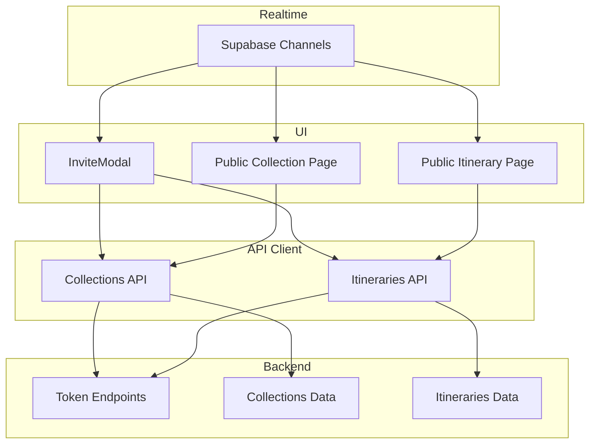
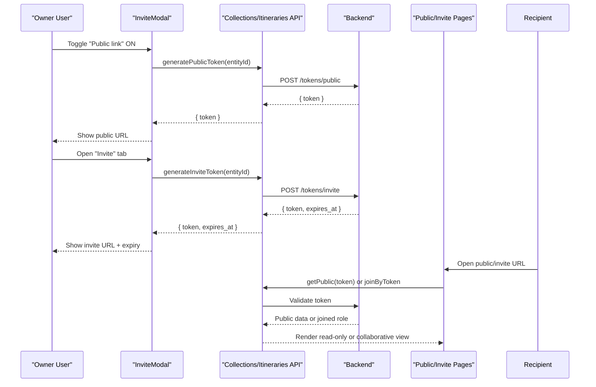
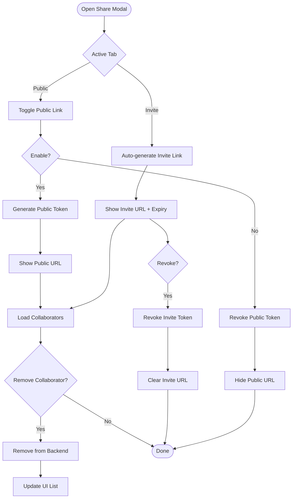
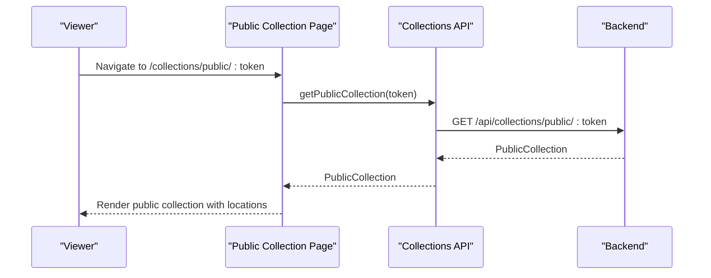
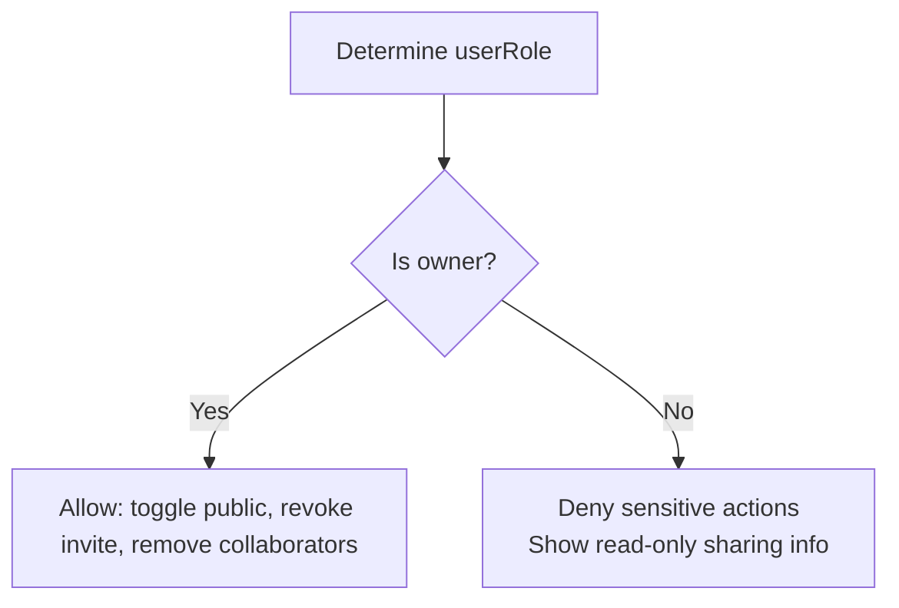
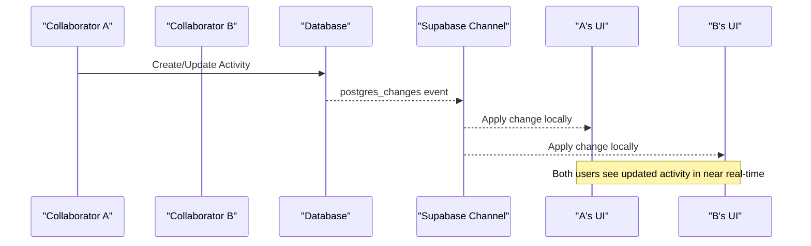
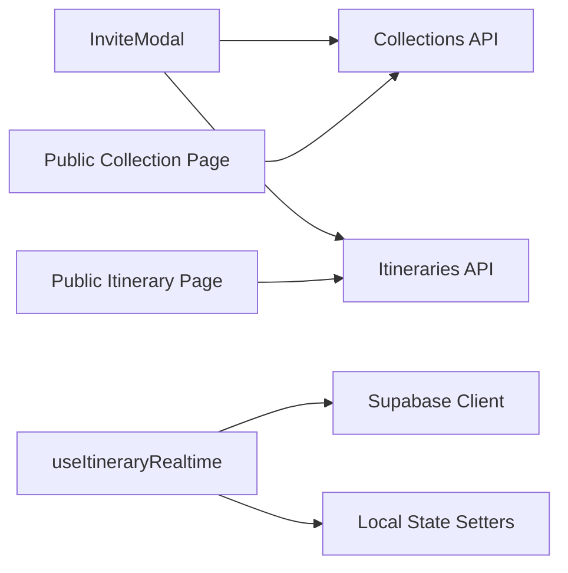

# Sharing & Collaboration Features

<cite>
**Referenced Files in This Document**
- [InviteModal.tsx](file://src/components/ui/modals/InviteModal.tsx)
- [collections.ts](file://src/lib/api/collections.ts)
- [itineraries.ts](file://src/lib/api/itineraries.ts)
- [Public Collection Page](file://src/app/collections/public/[token]/page.tsx)
- [Public Itinerary Page](file://src/app/itineraries/public/[token]/page.tsx)
- [Collection Detail Page](file://src/app/collections/[id]/page.tsx)
- [useItineraryRealtime.ts](file://src/hooks/useItineraryRealtime.ts)
- [useCollaboratorProfilesQuery.ts](file://src/hooks/queries/useCollaboratorProfilesQuery.ts)
</cite>

## Table of Contents
1. Introduction
2. Project Structure
3. Core Components
4. Architecture Overview
5. Detailed Component Analysis
6. Dependency Analysis
7. Performance Considerations
8. Troubleshooting Guide
9. Conclusion

## Introduction
This document explains the collection sharing and collaboration features implemented in the application. It covers:
- Public sharing via tokens for read-only access to collections and itineraries
- Invite modal functionality for generating invite links, managing collaborators, and toggling public links
- Role-based access control (owner vs collaborator) and how it gates actions
- Public page rendering for collections and itineraries
- Real-time synchronization for collaborative editing on itineraries
- Security considerations, token management, and privacy controls
- Practical examples for sharing with travel groups, family members, or colleagues

## Project Structure
The sharing and collaboration features span UI components, API clients, pages, and hooks:
- UI: Invite modal for sharing and collaboration management
- API: Token generation/revoke, collaborator listing/removal, public data retrieval
- Pages: Public views for collections and itineraries using tokens
- Hooks: Realtime subscriptions for collaborative edits and profile resolution



**Diagram sources**
- [InviteModal.tsx:194-256](file://src/components/ui/modals/InviteModal.tsx#L194-L256)
- [collections.ts:134-199](file://src/lib/api/collections.ts#L134-L199)
- [itineraries.ts:1-50](file://src/lib/api/itineraries.ts#L1-L50)
- [Public Collection Page:22-32](file://src/app/collections/public/[token]/page.tsx#L22-L32)
- [Public Itinerary Page:36-46](file://src/app/itineraries/public/[token]/page.tsx#L36-L46)
- [useItineraryRealtime.ts:39-333](file://src/hooks/useItineraryRealtime.ts#L39-L333)

**Section sources**
- [InviteModal.tsx:1-109](file://src/components/ui/modals/InviteModal.tsx#L1-L109)
- [collections.ts:1-214](file://src/lib/api/collections.ts#L1-L214)
- [itineraries.ts:1-52](file://src/lib/api/itineraries.ts#L1-L52)
- [Public Collection Page:1-152](file://src/app/collections/public/[token]/page.tsx#L1-L152)
- [Public Itinerary Page:1-211](file://src/app/itineraries/public/[token]/page.tsx#L1-L211)
- [useItineraryRealtime.ts:1-534](file://src/hooks/useItineraryRealtime.ts#L1-L534)

## Core Components
- Invite Modal: Central UI for enabling public links, generating invite links, viewing collaborators, and removing collaborators. It abstracts entity-specific APIs for both collections and itineraries.
- Collections API: Provides functions to generate/revoke public and invite tokens, list/remove collaborators, fetch public collection data, and join by invite token.
- Itineraries API: Defines shareable fields (public_token, invite_token, is_public) and supports similar sharing endpoints for itineraries.
- Public Pages: Render read-only views for a given token, showing curated data and calls to sign-in CTAs.
- Realtime Hook: Subscribes to database changes to synchronize collaborative edits across users in real time.

**Section sources**
- [InviteModal.tsx:111-537](file://src/components/ui/modals/InviteModal.tsx#L111-L537)
- [collections.ts:127-199](file://src/lib/api/collections.ts#L127-L199)
- [itineraries.ts:7-52](file://src/lib/api/itineraries.ts#L7-L52)
- [Public Collection Page:13-49](file://src/app/collections/public/[token]/page.tsx#L13-L49)
- [Public Itinerary Page:27-63](file://src/app/itineraries/public/[token]/page.tsx#L27-L63)
- [useItineraryRealtime.ts:39-533](file://src/hooks/useItineraryRealtime.ts#L39-L533)

## Architecture Overview
The sharing system uses two primary flows:
- Public link flow: Owner enables public sharing; backend generates a token; frontend renders a public URL that serves read-only data.
- Invite flow: Owner generates an invite token with optional expiry; recipients use the invite link to join as collaborators; owner can revoke invites and remove collaborators.



**Diagram sources**
- [InviteModal.tsx:194-256](file://src/components/ui/modals/InviteModal.tsx#L194-L256)
- [collections.ts:134-173](file://src/lib/api/collections.ts#L134-L173)
- [Public Collection Page:22-32](file://src/app/collections/public/[token]/page.tsx#L22-L32)
- [Public Itinerary Page:36-46](file://src/app/itineraries/public/[token]/page.tsx#L36-L46)

## Detailed Component Analysis

### Invite Modal: Public Link and Invite Tabs
- Public link toggle: Generates or revokes a public token for the entity. Only owners can toggle.
- Invite tab: Auto-generates an invite link when the owner opens the tab; shows expiry countdown; allows revocation.
- Collaborators list: Fetches current collaborators; owner can remove them.
- Copy-to-clipboard: Copies public or invite URLs with visual feedback.



**Diagram sources**
- [InviteModal.tsx:194-256](file://src/components/ui/modals/InviteModal.tsx#L194-L256)
- [InviteModal.tsx:246-270](file://src/components/ui/modals/InviteModal.tsx#L246-L270)
- [InviteModal.tsx:272-283](file://src/components/ui/modals/InviteModal.tsx#L272-L283)
- [InviteModal.tsx:285-307](file://src/components/ui/modals/InviteModal.tsx#L285-L307)

**Section sources**
- [InviteModal.tsx:111-537](file://src/components/ui/modals/InviteModal.tsx#L111-L537)

### Collections API: Token Management and Collaborators
- Public tokens: Generate and revoke public tokens for read-only access.
- Invite tokens: Generate and revoke invite tokens with expiration metadata.
- Collaborators: List and remove collaborators per collection.
- Public data: Retrieve a sanitized public collection payload for unauthenticated viewers.
- Join by token: Allow users to join a collection using an invite token.

```mermaid
classDiagram
class CollectionsAPI {
+generateCollectionPublicToken(id) Promise~{token}~
+revokeCollectionPublicToken(id) Promise~void~
+generateCollectionInviteToken(id) Promise~{token, expires_at}~
+revokeCollectionInviteToken(id) Promise~void~
+getCollectionCollaborators(id) Promise~Collaborator[]~
+removeCollectionCollaborator(id, userId) Promise~void~
+getPublicCollection(token) Promise~PublicCollection~
+joinCollectionByToken(token) Promise~Collection~
}
class Collaborator {
+string id
+string email
+string role
+string joined_at
}
class PublicCollection {
+string id
+string name
+string? country
+string? region
+string? thumbnail_url
+PublicCollectionLocation[] locations
}
CollectionsAPI --> Collaborator : "returns"
CollectionsAPI --> PublicCollection : "returns"
```

**Diagram sources**
- [collections.ts:127-199](file://src/lib/api/collections.ts#L127-L199)

**Section sources**
- [collections.ts:127-199](file://src/lib/api/collections.ts#L127-L199)

### Public Collection Page Rendering
- Loads public collection data by token and displays a read-only view with location cards.
- Shows a banner indicating public mode and provides a CTA to sign in.
- Handles loading and error states gracefully.



**Diagram sources**
- [Public Collection Page:22-32](file://src/app/collections/public/[token]/page.tsx#L22-L32)
- [collections.ts:195-199](file://src/lib/api/collections.ts#L195-L199)

**Section sources**
- [Public Collection Page:13-152](file://src/app/collections/public/[token]/page.tsx#L13-L152)

### Public Itinerary Page Rendering
- Similar to collections but renders itinerary days and activities in a read-only format.
- Displays date ranges, activity counts, and times.

**Section sources**
- [Public Itinerary Page:27-211](file://src/app/itineraries/public/[token]/page.tsx#L27-L211)

### Role-Based Access Control (RBAC)
- Owner vs collaborator roles are passed into the Invite Modal to gate actions like toggling public links, revoking invites, and removing collaborators.
- The collection detail page determines user role based on ownership and sets modal state accordingly.



**Diagram sources**
- [Collection Detail Page:1102-1133](file://src/app/collections/[id]/page.tsx#L1102-L1133)
- [InviteModal.tsx:134-170](file://src/components/ui/modals/InviteModal.tsx#L134-L170)

**Section sources**
- [Collection Detail Page:1102-1133](file://src/app/collections/[id]/page.tsx#L1102-L1133)
- [InviteModal.tsx:134-170](file://src/components/ui/modals/InviteModal.tsx#L134-L170)

### Real-Time Synchronization for Collaborative Editing
- Subscribes to Supabase channels for activities, days, flights, lodgings, and member changes.
- Updates local state immediately upon INSERT/UPDATE/DELETE events, ensuring all collaborators see consistent data.
- Hydrates activity locations asynchronously after inserts to enrich UI.



**Diagram sources**
- [useItineraryRealtime.ts:39-333](file://src/hooks/useItineraryRealtime.ts#L39-L333)
- [useItineraryRealtime.ts:335-440](file://src/hooks/useItineraryRealtime.ts#L335-L440)
- [useItineraryRealtime.ts:442-533](file://src/hooks/useItineraryRealtime.ts#L442-L533)

**Section sources**
- [useItineraryRealtime.ts:39-533](file://src/hooks/useItineraryRealtime.ts#L39-L533)

### Collaborator Profiles Resolution
- Resolves collaborator profiles by user IDs using a query hook that leverages Supabase queries.
- Useful for displaying avatars and names in the UI alongside collaborator lists.

**Section sources**
- [useCollaboratorProfilesQuery.ts:7-17](file://src/hooks/queries/useCollaboratorProfilesQuery.ts#L7-L17)

## Dependency Analysis
- InviteModal depends on:
  - Collections API for token and collaborator operations
  - Itineraries API for itinerary-specific sharing
  - Toast context for user feedback
  - Motion primitives for animations
- Public pages depend on:
  - Collections/Itineraries API for fetching public data by token
  - Error utilities for friendly messages
- Realtime hook depends on:
  - Supabase client for channel subscriptions
  - Local state setters for calendar, itinerary, flights, and lodgings



**Diagram sources**
- [InviteModal.tsx:25-43](file://src/components/ui/modals/InviteModal.tsx#L25-L43)
- [collections.ts:134-199](file://src/lib/api/collections.ts#L134-L199)
- [itineraries.ts:1-52](file://src/lib/api/itineraries.ts#L1-L52)
- [Public Collection Page:10-11](file://src/app/collections/public/[token]/page.tsx#L10-L11)
- [Public Itinerary Page:10-11](file://src/app/itineraries/public/[token]/page.tsx#L10-L11)
- [useItineraryRealtime.ts:1-14](file://src/hooks/useItineraryRealtime.ts#L1-L14)

**Section sources**
- [InviteModal.tsx:25-43](file://src/components/ui/modals/InviteModal.tsx#L25-L43)
- [collections.ts:134-199](file://src/lib/api/collections.ts#L134-L199)
- [itineraries.ts:1-52](file://src/lib/api/itineraries.ts#L1-L52)
- [Public Collection Page:10-11](file://src/app/collections/public/[token]/page.tsx#L10-L11)
- [Public Itinerary Page:10-11](file://src/app/itineraries/public/[token]/page.tsx#L10-L11)
- [useItineraryRealtime.ts:1-14](file://src/hooks/useItineraryRealtime.ts#L1-L14)

## Performance Considerations
- Public pages load minimal data suitable for read-only display, reducing payload size.
- Realtime subscriptions are scoped to specific entities (e.g., itinerary ID), limiting noise and improving efficiency.
- Invite modal auto-generates invite links only when needed (on tab open), avoiding unnecessary API calls.
- Use of toast notifications prevents blocking UI during async operations.

[No sources needed since this section provides general guidance]

## Troubleshooting Guide
- Public link not working:
  - Ensure the public token exists and has not been revoked.
  - Verify the public page endpoint returns data for the token.
- Invite link expired:
  - Check the invite token’s expiration timestamp and regenerate if necessary.
- Collaborator removal fails:
  - Confirm the user has owner permissions and the backend accepts the removal request.
- Realtime updates not appearing:
  - Verify Supabase channel subscriptions are active and not disconnected.
  - Check that the correct entity ID filters are applied to channels.

**Section sources**
- [InviteModal.tsx:194-256](file://src/components/ui/modals/InviteModal.tsx#L194-L256)
- [collections.ts:134-173](file://src/lib/api/collections.ts#L134-L173)
- [useItineraryRealtime.ts:39-533](file://src/hooks/useItineraryRealtime.ts#L39-L533)

## Conclusion
The application provides robust sharing and collaboration capabilities:
- Public links enable read-only access to collections and itineraries via secure tokens.
- Invite links allow controlled collaboration with expiration and revocation support.
- Role-based access ensures only owners can manage sharing settings and collaborators.
- Real-time synchronization keeps collaborative edits consistent across users.
- Public pages present clean, focused views with clear CTAs to encourage sign-ups.

Security and privacy are enforced through token-based access and server-side validation. Owners retain full control over who can view or edit shared content, while collaborators gain appropriate access without exposing sensitive data to unauthenticated users.

[No sources needed since this section summarizes without analyzing specific files]