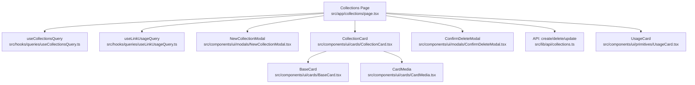
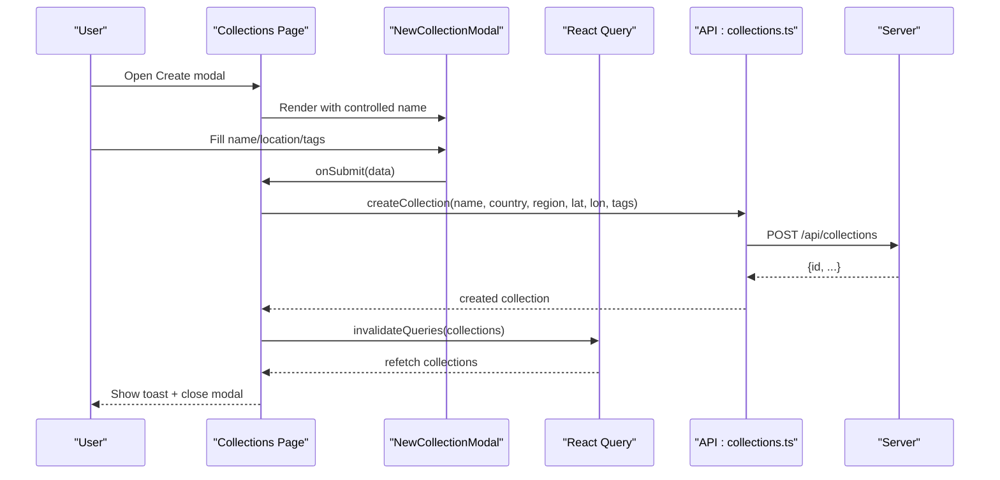
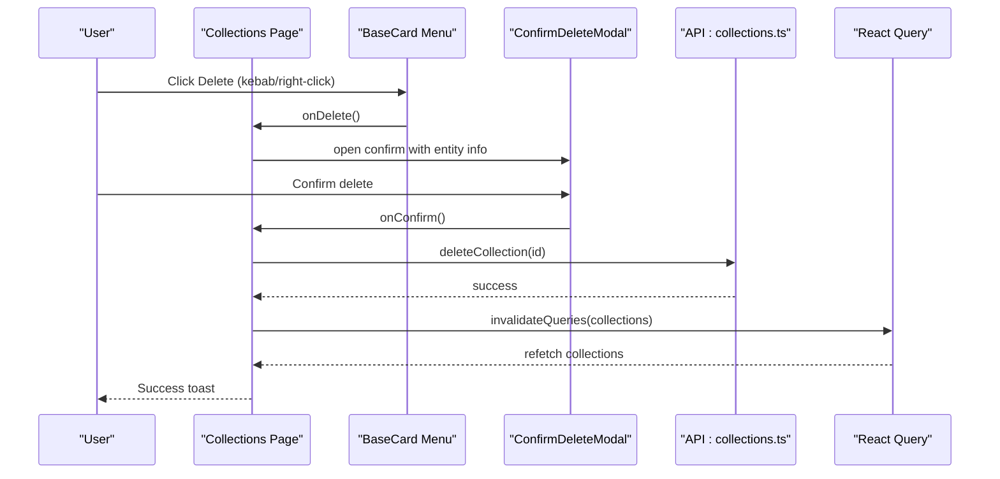
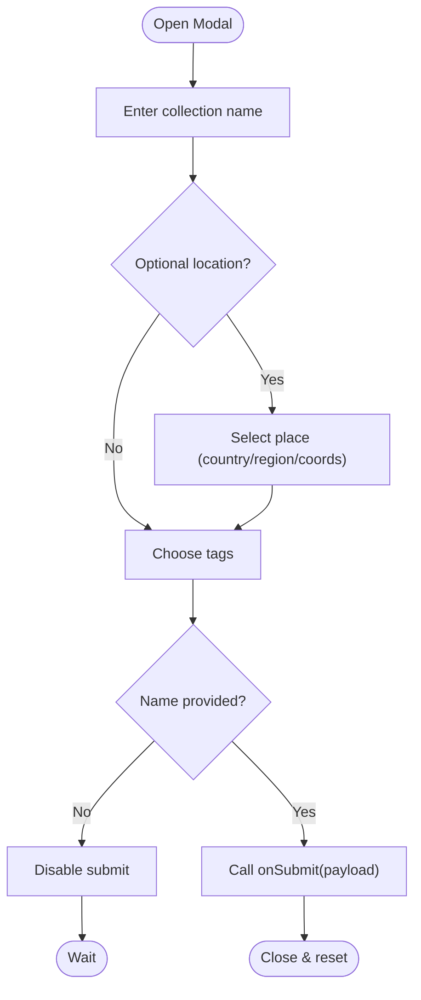
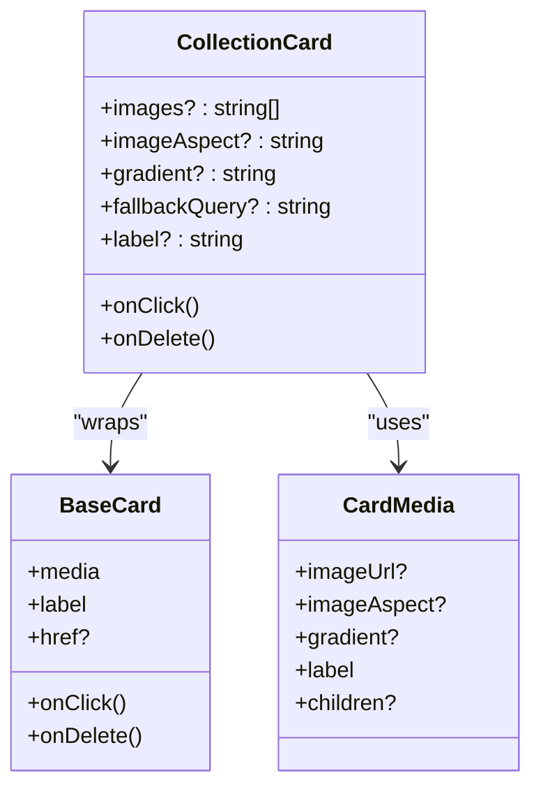
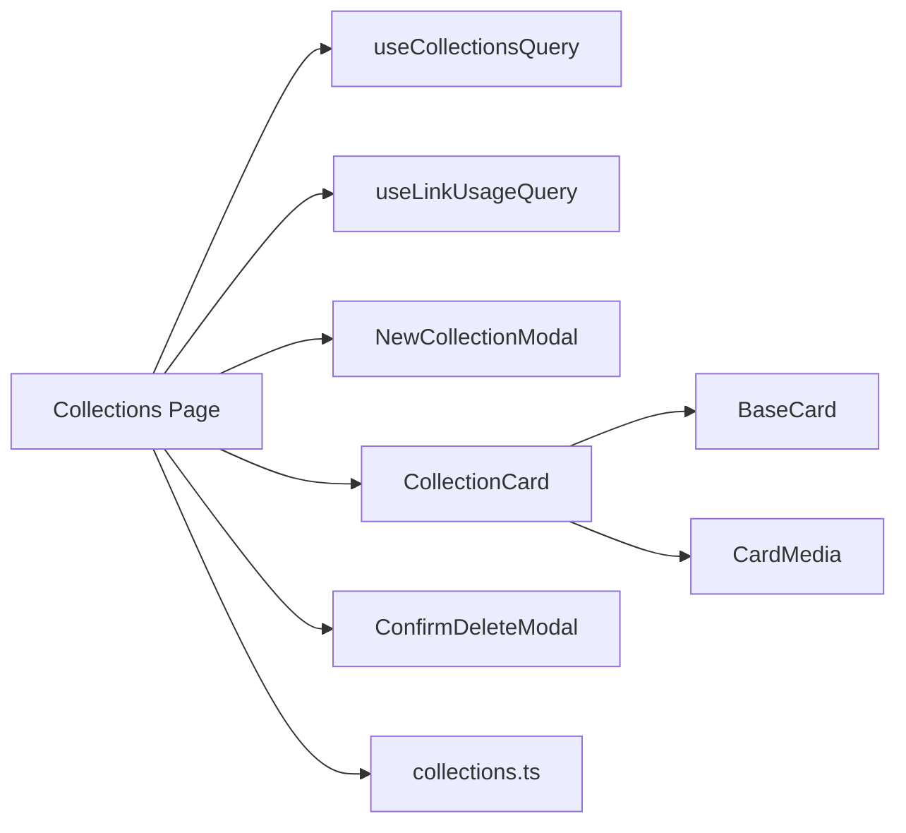

# Collection Management

<cite>
**Referenced Files in This Document**
- [page.tsx](file://src/app/collections/page.tsx)
- [NewCollectionModal.tsx](file://src/components/ui/modals/NewCollectionModal.tsx)
- [CollectionCard.tsx](file://src/components/ui/cards/CollectionCard.tsx)
- [BaseCard.tsx](file://src/components/ui/cards/BaseCard.tsx)
- [CardMedia.tsx](file://src/components/ui/cards/CardMedia.tsx)
- [collections.ts](file://src/lib/api/collections.ts)
- [useCollectionsQuery.ts](file://src/hooks/queries/useCollectionsQuery.ts)
- [useLinkUsageQuery.ts](file://src/hooks/queries/useLinkUsageQuery.ts)
- [ConfirmDeleteModal.tsx](file://src/components/ui/modals/ConfirmDeleteModal.tsx)
- [UsageCard.tsx](file://src/components/ui/primitives/UsageCard.tsx)
- [useRecordView.ts](file://src/hooks/useRecordView.ts)
</cite>

## Table of Contents
1. Introduction
2. Project Structure
3. Core Components
4. Architecture Overview
5. Detailed Component Analysis
6. Dependency Analysis
7. Performance Considerations
8. Troubleshooting Guide
9. Conclusion

## Introduction
This document explains Argo’s collection management system with a focus on:
- Creating collections with metadata (country, region, tags, coordinates)
- Thumbnail generation from preview images and gradient fallbacks when no images are available
- Responsive bento grid display, sorting by recency, and filtering archived collections
- Lifecycle operations: create, delete (with collaborator awareness), and state management via React Query
- NewCollectionModal form handling, validation, and error states
- Usage tracking integration and quota management for link submissions
- CollectionCard props, click handlers, and delete actions

## Project Structure
The collection feature spans pages, components, hooks, and API layers:
- Page orchestrates data fetching, user interactions, and UI composition
- Modal handles creation form inputs and submission
- Cards render media grids, gradients, and actions
- Hooks manage queries and usage metrics
- API layer defines types and endpoints for CRUD and collaborators

**Diagram sources**
- [page.tsx:24-248](file://src/app/collections/page.tsx#L24-L248)
- [useCollectionsQuery.ts:10-16](file://src/hooks/queries/useCollectionsQuery.ts#L10-L16)
- [useLinkUsageQuery.ts:20-35](file://src/hooks/queries/useLinkUsageQuery.ts#L20-L35)
- [NewCollectionModal.tsx:42-135](file://src/components/ui/modals/NewCollectionModal.tsx#L42-L135)
- [CollectionCard.tsx:79-108](file://src/components/ui/cards/CollectionCard.tsx#L79-L108)
- [BaseCard.tsx:57-204](file://src/components/ui/cards/BaseCard.tsx#L57-L204)
- [CardMedia.tsx:30-62](file://src/components/ui/cards/CardMedia.tsx#L30-L62)
- [ConfirmDeleteModal.tsx:18-105](file://src/components/ui/modals/ConfirmDeleteModal.tsx#L18-L105)
- [collections.ts:65-109](file://src/lib/api/collections.ts#L65-L109)
- [UsageCard.tsx:51-93](file://src/components/ui/primitives/UsageCard.tsx#L51-L93)

**Section sources**
- [page.tsx:24-248](file://src/app/collections/page.tsx#L24-L248)

## Core Components
- Collections page: fetches collections and link usage, filters out archived items, sorts by updated_at desc, renders bento grid, and wires create/delete flows.
- NewCollectionModal: controlled name input, optional location autocomplete (country/region/coordinates), tag selection with custom tags, submit validation, and loading state.
- CollectionCard: renders multi-image grid or single image; falls back to Unsplash image via useLocationPhoto, then gradient, then placeholder.
- BaseCard: shared card shell with kebab menu and right-click context menu for delete/add actions.
- CardMedia: unified media slot with image, gradient, and placeholder fallbacks.
- ConfirmDeleteModal: warns about collaborators before deletion.
- UsageCard: displays link usage progress and upgrade link when at limit.

**Section sources**
- [page.tsx:44-195](file://src/app/collections/page.tsx#L44-L195)
- [NewCollectionModal.tsx:22-135](file://src/components/ui/modals/NewCollectionModal.tsx#L22-L135)
- [CollectionCard.tsx:10-108](file://src/components/ui/cards/CollectionCard.tsx#L10-L108)
- [BaseCard.tsx:20-204](file://src/components/ui/cards/BaseCard.tsx#L20-L204)
- [CardMedia.tsx:7-62](file://src/components/ui/cards/CardMedia.tsx#L7-L62)
- [ConfirmDeleteModal.tsx:9-105](file://src/components/ui/modals/ConfirmDeleteModal.tsx#L9-L105)
- [UsageCard.tsx:9-93](file://src/components/ui/primitives/UsageCard.tsx#L9-L93)

## Architecture Overview
End-to-end flows for creating and deleting collections, including data fetching and caching.

**Diagram sources**
- [page.tsx:53-88](file://src/app/collections/page.tsx#L53-L88)
- [NewCollectionModal.tsx:118-135](file://src/components/ui/modals/NewCollectionModal.tsx#L118-L135)
- [collections.ts:78-93](file://src/lib/api/collections.ts#L78-L93)
- [useCollectionsQuery.ts:10-16](file://src/hooks/queries/useCollectionsQuery.ts#L10-L16)

**Diagram sources**
- [BaseCard.tsx:90-159](file://src/components/ui/cards/BaseCard.tsx#L90-L159)
- [page.tsx:99-111](file://src/app/collections/page.tsx#L99-L111)
- [ConfirmDeleteModal.tsx:18-105](file://src/components/ui/modals/ConfirmDeleteModal.tsx#L18-L105)
- [collections.ts:201-206](file://src/lib/api/collections.ts#L201-L206)

## Detailed Component Analysis

### Collections Page
- Data fetching: uses useCollectionsQuery to load collections with role and preview images; uses useLinkUsageQuery to show quota.
- Filtering and sorting: excludes archived collections and sorts by updated_at descending.
- Creation flow: opens NewCollectionModal, calls createCollection, invalidates query cache, shows toast, resets form.
- Deletion flow: opens ConfirmDeleteModal, calls deleteCollection, invalidates cache, shows toast.
- Grid layout: responsive bento grid using CSS container queries and variables; includes a CreateCard tile.
- Media mapping: maps preview_images or thumbnail_url to images prop; otherwise sets gradient fallback.

**Section sources**
- [page.tsx:24-248](file://src/app/collections/page.tsx#L24-L248)

### NewCollectionModal
- Props: controlled name, optional default value, callbacks for change/submit/cancel, loading flag.
- Metadata support: optional PlaceAutocomplete provides country, region, latitude, longitude.
- Tags: predefined tags plus custom tags; supports add/remove and keyboard shortcuts.
- Validation: requires non-empty name; disables submit while busy.
- Submission: builds payload with name, optional location fields, and tags array; calls onSubmit and manages submitting state.

**Diagram sources**
- [NewCollectionModal.tsx:22-135](file://src/components/ui/modals/NewCollectionModal.tsx#L22-L135)

**Section sources**
- [NewCollectionModal.tsx:22-135](file://src/components/ui/modals/NewCollectionModal.tsx#L22-L135)

### CollectionCard and Media Rendering
- Multi-image grid: up to four images arranged in a responsive grid; single image fills the card.
- Fallback chain: if no images, attempts Unsplash image via useLocationPhoto using region or name; if still unavailable, applies gradient; finally shows placeholder.
- Props: images, imageAspect, gradient, fallbackQuery, label, and standard BaseCard props (onClick, onDelete, etc.).
- Integration: passes media slot to CardMedia; when images exist, renders CollectionImageGrid inside CardMedia.

**Diagram sources**
- [CollectionCard.tsx:57-108](file://src/components/ui/cards/CollectionCard.tsx#L57-L108)
- [BaseCard.tsx:20-204](file://src/components/ui/cards/BaseCard.tsx#L20-L204)
- [CardMedia.tsx:7-62](file://src/components/ui/cards/CardMedia.tsx#L7-L62)

**Section sources**
- [CollectionCard.tsx:10-108](file://src/components/ui/cards/CollectionCard.tsx#L10-L108)
- [CardMedia.tsx:30-62](file://src/components/ui/cards/CardMedia.tsx#L30-L62)

### BaseCard Actions and Menus
- Provides consistent card shell with header, label, and optional trailing menu.
- Kebab menu and right-click context menu trigger actions like delete.
- Supports Link-based navigation or interactive div with keyboard support.

**Section sources**
- [BaseCard.tsx:57-204](file://src/components/ui/cards/BaseCard.tsx#L57-L204)

### ConfirmDeleteModal (Collaborator Awareness)
- Displays warning when collaborators exist; otherwise standard confirmation.
- Calls onConfirm to perform deletion and closes itself.

**Section sources**
- [ConfirmDeleteModal.tsx:18-105](file://src/components/ui/modals/ConfirmDeleteModal.tsx#L18-L105)

### Usage Tracking and Quota Management
- UsageCard shows current link usage vs monthly limit and can link to billing when at cap.
- useLinkUsageQuery fetches quota and computes reset date for display.
- Quota gate hook centralizes upgrade messaging for hitting limits.

**Section sources**
- [UsageCard.tsx:51-93](file://src/components/ui/primitives/UsageCard.tsx#L51-L93)
- [useLinkUsageQuery.ts:20-35](file://src/hooks/queries/useLinkUsageQuery.ts#L20-L35)
- [useQuotaGate.ts:16-40](file://src/hooks/useQuotaGate.ts#L16-L40)

### View Tracking Integration
- useRecordView records views for entities (including collections) once per session and invalidates recently viewed queries.

**Section sources**
- [useRecordView.ts:9-30](file://src/hooks/useRecordView.ts#L9-L30)

## Dependency Analysis
- Collections Page depends on:
  - useCollectionsQuery for cached list of collections
  - useLinkUsageQuery for quota display
  - NewCollectionModal for creation UX
  - CollectionCard for rendering tiles
  - ConfirmDeleteModal for safe deletion
  - API functions for create/delete/update
- CollectionCard depends on BaseCard and CardMedia for presentation and fallbacks.
- ConfirmDeleteModal is independent but invoked by page logic.

**Diagram sources**
- [page.tsx:24-248](file://src/app/collections/page.tsx#L24-L248)
- [useCollectionsQuery.ts:10-16](file://src/hooks/queries/useCollectionsQuery.ts#L10-L16)
- [useLinkUsageQuery.ts:20-35](file://src/hooks/queries/useLinkUsageQuery.ts#L20-L35)
- [NewCollectionModal.tsx:42-135](file://src/components/ui/modals/NewCollectionModal.tsx#L42-L135)
- [CollectionCard.tsx:79-108](file://src/components/ui/cards/CollectionCard.tsx#L79-L108)
- [BaseCard.tsx:57-204](file://src/components/ui/cards/BaseCard.tsx#L57-L204)
- [CardMedia.tsx:30-62](file://src/components/ui/cards/CardMedia.tsx#L30-L62)
- [ConfirmDeleteModal.tsx:18-105](file://src/components/ui/modals/ConfirmDeleteModal.tsx#L18-L105)
- [collections.ts:65-109](file://src/lib/api/collections.ts#L65-L109)

**Section sources**
- [page.tsx:24-248](file://src/app/collections/page.tsx#L24-L248)

## Performance Considerations
- Use React Query caching with staleTime to reduce network requests for collections and link usage.
- Invalidate only necessary queries after mutations to avoid full re-renders.
- Prefer client-side filtering and sorting for small datasets; consider server-side pagination for large lists.
- Avoid unnecessary re-renders by memoizing derived lists and passing stable callbacks.
- Image fallbacks prevent layout shifts and improve perceived performance.

[No sources needed since this section provides general guidance]

## Troubleshooting Guide
- Creation fails: check network errors and ensure name is provided; review toast messages and console logs.
- Deletion issues: verify collaborator count and permissions; confirm that delete endpoint returns success.
- Missing thumbnails: ensure preview_images or thumbnail_url are present; fallback to gradient or Unsplash image.
- Quota exceeded: usage card will indicate plan limits; guide users to billing page via action link.

**Section sources**
- [page.tsx:53-111](file://src/app/collections/page.tsx#L53-L111)
- [collections.ts:78-109](file://src/lib/api/collections.ts#L78-L109)
- [collections.ts:201-206](file://src/lib/api/collections.ts#L201-L206)
- [UsageCard.tsx:51-93](file://src/components/ui/primitives/UsageCard.tsx#L51-L93)

## Conclusion
Argo’s collection management integrates a robust creation workflow with rich metadata, flexible media rendering, and a responsive bento grid. State is managed through React Query for efficient caching and updates. Deletions are safeguarded with collaborator awareness. Usage tracking and quota management provide clear feedback and upgrade paths. The modular component design ensures consistency and maintainability across the feature.

[No sources needed since this section summarizes without analyzing specific files]