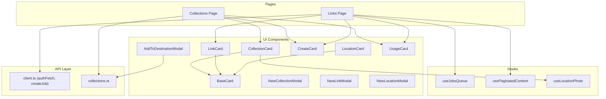
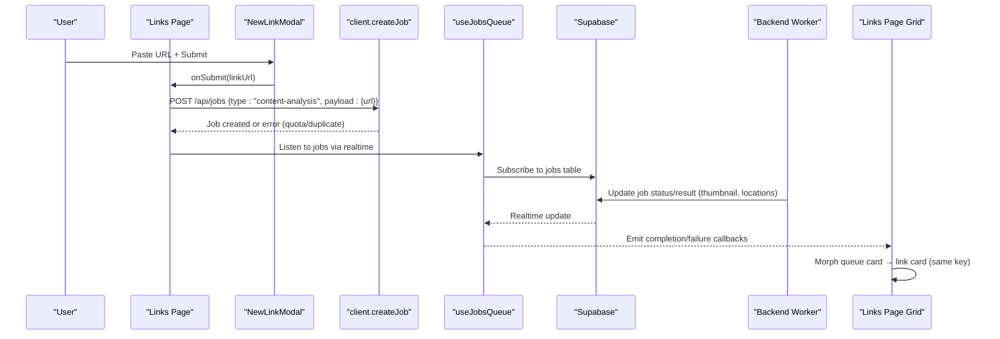
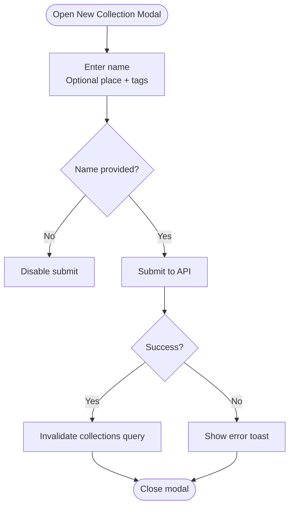
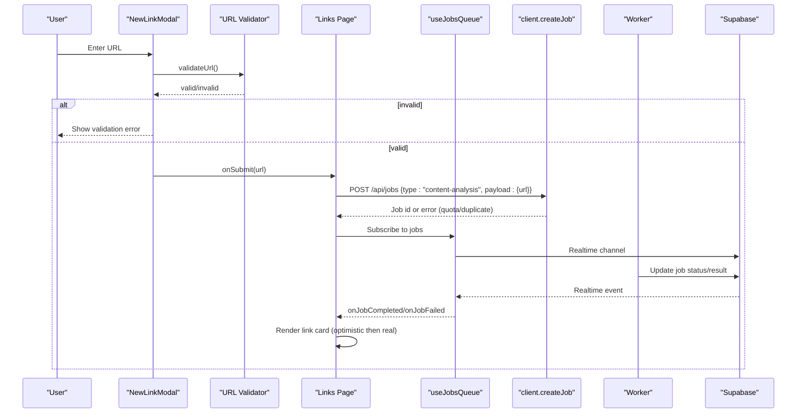
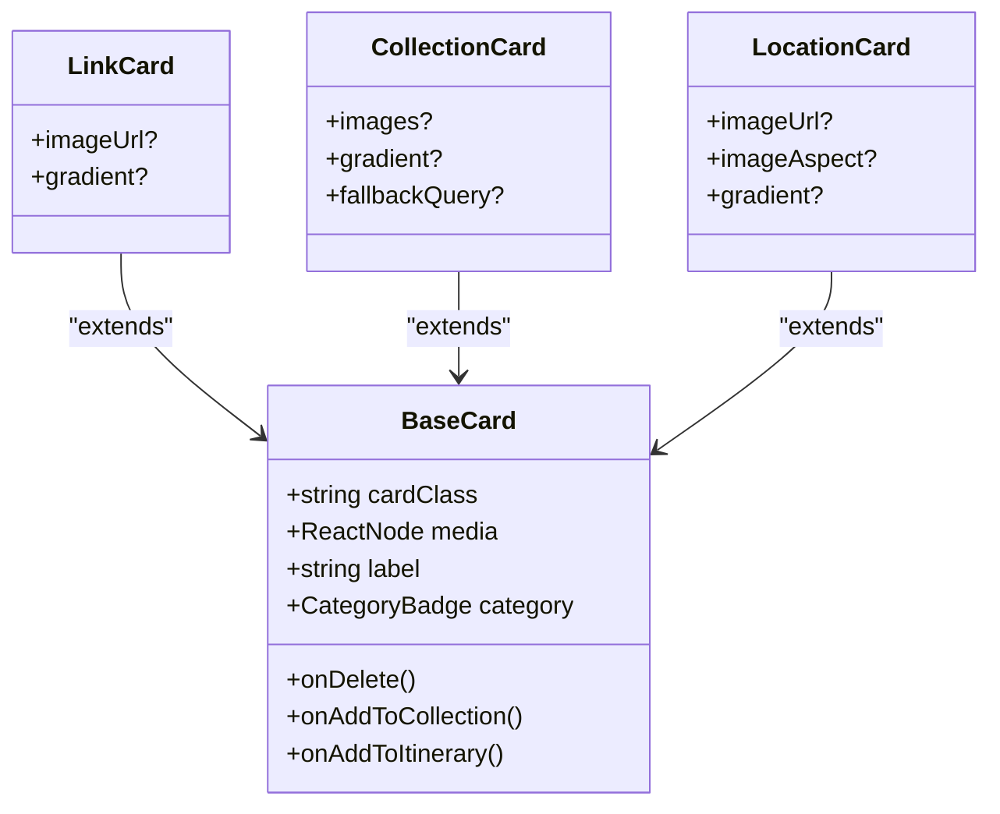
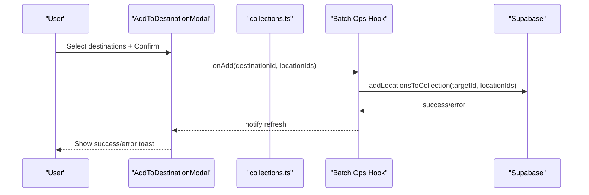
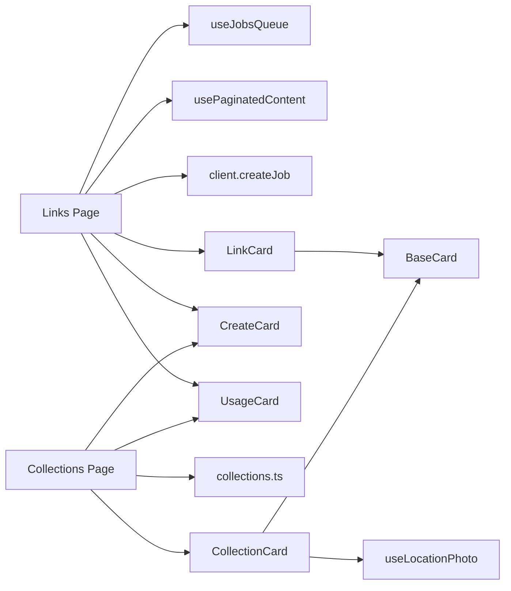

# Content Management System

<cite>
**Referenced Files in This Document**
- [page.tsx](file://src/app/collections/page.tsx)
- [page.tsx](file://src/app/links/page.tsx)
- [CollectionCard.tsx](file://src/components/ui/cards/CollectionCard.tsx)
- [LinkCard.tsx](file://src/components/ui/cards/LinkCard.tsx)
- [LocationCard.tsx](file://src/components/ui/cards/LocationCard.tsx)
- [BaseCard.tsx](file://src/components/ui/cards/BaseCard.tsx)
- [NewCollectionModal.tsx](file://src/components/ui/modals/NewCollectionModal.tsx)
- [NewLinkModal.tsx](file://src/components/ui/modals/NewLinkModal.tsx)
- [NewLocationModal.tsx](file://src/components/ui/modals/NewLocationModal.tsx)
- [collections.ts](file://src/lib/api/collections.ts)
- [client.ts](file://src/lib/api/client.ts)
- [usePaginatedContent.ts](file://src/hooks/usePaginatedContent.ts)
- [useJobsQueue.ts](file://src/hooks/useJobsQueue.ts)
- [CreateCard.tsx](file://src/components/ui/dashboard/CreateCard.tsx)
- [AddToDestinationModal.tsx](file://src/components/ui/modals/AddToDestinationModal.tsx)
- [url-validation.ts](file://src/lib/utils/url-validation.ts)
- [UsageCard.tsx](file://src/components/ui/primitives/UsageCard.tsx)
- [useLocationPhoto.ts](file://src/hooks/useLocationPhoto.ts)
</cite>

## Table of Contents
1. Introduction
2. Project Structure
3. Core Components
4. Architecture Overview
5. Detailed Component Analysis
6. Dependency Analysis
7. Performance Considerations
8. Troubleshooting Guide
9. Conclusion

## Introduction
This document explains Argo’s content management system with a focus on:
- Collection organization and creation (metadata, tags, thumbnails, preview images)
- Link submission and analysis pipeline (URL validation, domain extraction, AI-powered analysis, automatic location extraction)
- Content grid display (link cards, collection cards, location cards) and interactive actions (add-to-collection/itinerary)
- Batch operations, search/filtering, and relationships between links, locations, and collections
- Error handling for quota limits, duplicate content detection, and network failures during processing

## Project Structure
The system is organized around Next.js pages for collections and links, reusable card components for the content grid, modals for creating and submitting items, hooks for queue and pagination, and an API layer that communicates with the backend and Supabase.

**Diagram sources**
- [page.tsx](file://src/app/collections/page.tsx)
- [page.tsx](file://src/app/links/page.tsx)
- [BaseCard.tsx](file://src/components/ui/cards/BaseCard.tsx)
- [LinkCard.tsx](file://src/components/ui/cards/LinkCard.tsx)
- [CollectionCard.tsx](file://src/components/ui/cards/CollectionCard.tsx)
- [LocationCard.tsx](file://src/components/ui/cards/LocationCard.tsx)
- [CreateCard.tsx](file://src/components/ui/dashboard/CreateCard.tsx)
- [AddToDestinationModal.tsx](file://src/components/ui/modals/AddToDestinationModal.tsx)
- [NewCollectionModal.tsx](file://src/components/ui/modals/NewCollectionModal.tsx)
- [NewLinkModal.tsx](file://src/components/ui/modals/NewLinkModal.tsx)
- [NewLocationModal.tsx](file://src/components/ui/modals/NewLocationModal.tsx)
- [useJobsQueue.ts](file://src/hooks/useJobsQueue.ts)
- [usePaginatedContent.ts](file://src/hooks/usePaginatedContent.ts)
- [client.ts](file://src/lib/api/client.ts)
- [collections.ts](file://src/lib/api/collections.ts)
- [useLocationPhoto.ts](file://src/hooks/useLocationPhoto.ts)

**Section sources**
- [page.tsx](file://src/app/collections/page.tsx)
- [page.tsx](file://src/app/links/page.tsx)

## Core Components
- Collections page: lists collections, supports creation with metadata (country, region, latitude, longitude, tags), displays usage, and handles delete flows.
- Links page: manages link submissions, shows queued jobs, renders completed link cards, and integrates infinite scroll and realtime updates.
- Cards: shared base card with action menu; specialized link, collection, and location cards render media and labels consistently.
- Modals: NewCollectionModal supports name, optional place selection, and tag selection; NewLinkModal validates URLs and submits to job queue; NewLocationModal accepts Google Maps share links.
- Hooks: useJobsQueue tracks background jobs (queued/processing/completed/failed); usePaginatedContent fetches completed content with filtering/sorting and realtime sync; useLocationPhoto resolves destination photos from cache or Unsplash.
- API: client.ts centralizes auth, error mapping (quota/duplicate), and job creation; collections.ts provides CRUD and public endpoints.

**Section sources**
- [page.tsx](file://src/app/collections/page.tsx)
- [page.tsx](file://src/app/links/page.tsx)
- [BaseCard.tsx](file://src/components/ui/cards/BaseCard.tsx)
- [LinkCard.tsx](file://src/components/ui/cards/LinkCard.tsx)
- [CollectionCard.tsx](file://src/components/ui/cards/CollectionCard.tsx)
- [LocationCard.tsx](file://src/components/ui/cards/LocationCard.tsx)
- [NewCollectionModal.tsx](file://src/components/ui/modals/NewCollectionModal.tsx)
- [NewLinkModal.tsx](file://src/components/ui/modals/NewLinkModal.tsx)
- [NewLocationModal.tsx](file://src/components/ui/modals/NewLocationModal.tsx)
- [useJobsQueue.ts](file://src/hooks/useJobsQueue.ts)
- [usePaginatedContent.ts](file://src/hooks/usePaginatedContent.ts)
- [useLocationPhoto.ts](file://src/hooks/useLocationPhoto.ts)
- [client.ts](file://src/lib/api/client.ts)
- [collections.ts](file://src/lib/api/collections.ts)

## Architecture Overview
The content flow spans UI interactions, job queuing, backend processing, and realtime updates.

**Diagram sources**
- [page.tsx](file://src/app/links/page.tsx)
- [NewLinkModal.tsx](file://src/components/ui/modals/NewLinkModal.tsx)
- [client.ts](file://src/lib/api/client.ts)
- [useJobsQueue.ts](file://src/hooks/useJobsQueue.ts)

## Detailed Component Analysis

### Collection Creation and Metadata
- The collections page opens a modal to create a new collection. Users can provide a name, optional location (country, region, coordinates), and tags. On submit, it calls the API to create the collection and refreshes the list.
- Collection cards support multi-image grids or fallback to a single thumbnail or gradient. They also resolve a destination photo via a hook when no images are present.

**Diagram sources**
- [NewCollectionModal.tsx](file://src/components/ui/modals/NewCollectionModal.tsx)
- [page.tsx](file://src/app/collections/page.tsx)
- [collections.ts](file://src/lib/api/collections.ts)

**Section sources**
- [page.tsx](file://src/app/collections/page.tsx)
- [NewCollectionModal.tsx](file://src/components/ui/modals/NewCollectionModal.tsx)
- [collections.ts](file://src/lib/api/collections.ts)
- [CollectionCard.tsx](file://src/components/ui/cards/CollectionCard.tsx)
- [useLocationPhoto.ts](file://src/hooks/useLocationPhoto.ts)

### Link Submission and Analysis Pipeline
- URL validation occurs in the modal before submission. Validated URLs are sent to the job queue.
- The backend worker performs AI-powered content analysis, extracts locations, and generates thumbnails. The frontend listens to job updates and morphs queue cards into link cards upon completion.

**Diagram sources**
- [NewLinkModal.tsx](file://src/components/ui/modals/NewLinkModal.tsx)
- [url-validation.ts](file://src/lib/utils/url-validation.ts)
- [page.tsx](file://src/app/links/page.tsx)
- [client.ts](file://src/lib/api/client.ts)
- [useJobsQueue.ts](file://src/hooks/useJobsQueue.ts)

**Section sources**
- [NewLinkModal.tsx](file://src/components/ui/modals/NewLinkModal.tsx)
- [url-validation.ts](file://src/lib/utils/url-validation.ts)
- [page.tsx](file://src/app/links/page.tsx)
- [client.ts](file://src/lib/api/client.ts)
- [useJobsQueue.ts](file://src/hooks/useJobsQueue.ts)

### Content Grid and Card Types
- BaseCard provides consistent layout, hover states, keyboard navigation, and a kebab menu for actions (delete, add-to-collection, add-to-itinerary).
- LinkCard renders a phone-frame style thumbnail with optional gradient fallback.
- CollectionCard supports image grids, Unsplash fallback via destination photo, and gradient fallback.
- LocationCard uses standard media with aspect ratio control.

**Diagram sources**
- [BaseCard.tsx](file://src/components/ui/cards/BaseCard.tsx)
- [LinkCard.tsx](file://src/components/ui/cards/LinkCard.tsx)
- [CollectionCard.tsx](file://src/components/ui/cards/CollectionCard.tsx)
- [LocationCard.tsx](file://src/components/ui/cards/LocationCard.tsx)

**Section sources**
- [BaseCard.tsx](file://src/components/ui/cards/BaseCard.tsx)
- [LinkCard.tsx](file://src/components/ui/cards/LinkCard.tsx)
- [CollectionCard.tsx](file://src/components/ui/cards/CollectionCard.tsx)
- [LocationCard.tsx](file://src/components/ui/cards/LocationCard.tsx)

### Add-to-Destination Actions and Batch Operations
- The AddToDestinationModal lets users select one or more destinations (collections or itineraries) and batch-add locations. It supports searching, creating new destinations inline, and confirming multiple selections.
- Batch operations hook adds locations to a target collection and can trigger itinerary generation workflows.

**Diagram sources**
- [AddToDestinationModal.tsx](file://src/components/ui/modals/AddToDestinationModal.tsx)
- [collections.ts](file://src/lib/api/collections.ts)
- [useCollectionLocationBatchOperations.ts](file://src/hooks/useCollectionLocationBatchOperations.ts)

**Section sources**
- [AddToDestinationModal.tsx](file://src/components/ui/modals/AddToDestinationModal.tsx)
- [useCollectionLocationBatchOperations.ts](file://src/hooks/useCollectionLocationBatchOperations.ts)
- [collections.ts](file://src/lib/api/collections.ts)

### Search and Filtering
- Collections page filters out archived collections and sorts by recency.
- Links page supports filter types (links, favorites, archived) and sort options (modified, alphabetical) via the paginated content hook.
- Add-to-destination modal includes a search bar to filter available destinations.

**Section sources**
- [page.tsx](file://src/app/collections/page.tsx)
- [usePaginatedContent.ts](file://src/hooks/usePaginatedContent.ts)
- [AddToDestinationModal.tsx](file://src/components/ui/modals/AddToDestinationModal.tsx)

### Relationships: Links, Locations, Collections
- Links are processed into content rows with associated locations stored in a junction table.
- Collections contain locations and can be tagged and geotagged at creation.
- Public collections expose a subset of data for sharing.

**Section sources**
- [collections.ts](file://src/lib/api/collections.ts)
- [usePaginatedContent.ts](file://src/hooks/usePaginatedContent.ts)

## Dependency Analysis
Key dependencies and coupling:
- Pages depend on UI components (cards, modals) and hooks (jobs, pagination).
- Hooks rely on Supabase realtime channels and queries.
- API layer centralizes authentication, error mapping, and job lifecycle methods.
- Cards depend on BaseCard for consistent behavior and on media utilities for images/placeholders.

**Diagram sources**
- [page.tsx](file://src/app/links/page.tsx)
- [page.tsx](file://src/app/collections/page.tsx)
- [useJobsQueue.ts](file://src/hooks/useJobsQueue.ts)
- [usePaginatedContent.ts](file://src/hooks/usePaginatedContent.ts)
- [client.ts](file://src/lib/api/client.ts)
- [collections.ts](file://src/lib/api/collections.ts)
- [BaseCard.tsx](file://src/components/ui/cards/BaseCard.tsx)
- [LinkCard.tsx](file://src/components/ui/cards/LinkCard.tsx)
- [CollectionCard.tsx](file://src/components/ui/cards/CollectionCard.tsx)
- [useLocationPhoto.ts](file://src/hooks/useLocationPhoto.ts)

**Section sources**
- [page.tsx](file://src/app/links/page.tsx)
- [page.tsx](file://src/app/collections/page.tsx)
- [useJobsQueue.ts](file://src/hooks/useJobsQueue.ts)
- [usePaginatedContent.ts](file://src/hooks/usePaginatedContent.ts)
- [client.ts](file://src/lib/api/client.ts)
- [collections.ts](file://src/lib/api/collections.ts)
- [BaseCard.tsx](file://src/components/ui/cards/BaseCard.tsx)
- [LinkCard.tsx](file://src/components/ui/cards/LinkCard.tsx)
- [CollectionCard.tsx](file://src/components/ui/cards/CollectionCard.tsx)
- [useLocationPhoto.ts](file://src/hooks/useLocationPhoto.ts)

## Performance Considerations
- Optimistic UI: Completed jobs are rendered immediately using job results, then replaced seamlessly by canonical rows to avoid flicker.
- Infinite scroll: Paginated content loads additional pages only when needed, reducing initial payload.
- Realtime efficiency: Unique channel names per instance prevent subscription conflicts; visibility change triggers reconciliation to recover missed updates.
- Image loading: Destination photos are cached locally; Unsplash requests occur only when necessary.

[No sources needed since this section provides general guidance]

## Troubleshooting Guide
Common issues and how they are handled:
- Quota limits: When monthly link allowance is exceeded, a typed error is thrown and surfaced via a dedicated toast prompting upgrade.
- Duplicate content: If a link has already been analyzed, a specific error is raised with existing content details; the UI guides the user to view the existing item.
- Network failures: Transport errors bypass normal response parsing; realtime subscriptions reconnect on errors/timeouts, and stale jobs are reconciled on tab visibility changes.
- Failed/stuck jobs: Queue cards show retry/remove actions; stuck-in-flight jobs beyond a threshold become retriable.

**Section sources**
- [client.ts](file://src/lib/api/client.ts)
- [page.tsx](file://src/app/links/page.tsx)
- [useJobsQueue.ts](file://src/hooks/useJobsQueue.ts)

## Conclusion
Argo’s content management system combines robust UI components, resilient job queues, and efficient data fetching to deliver a seamless experience for organizing travel content. Collections support rich metadata and visuals; links are analyzed asynchronously with immediate feedback; and batch operations streamline adding locations to destinations. Clear error handling ensures users remain informed and guided through quotas, duplicates, and transient failures.