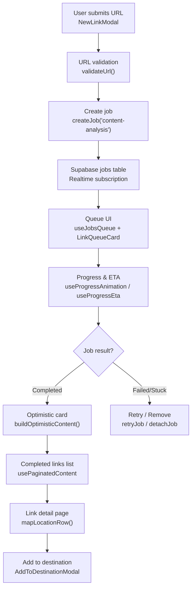
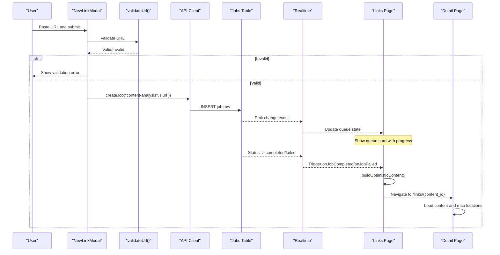
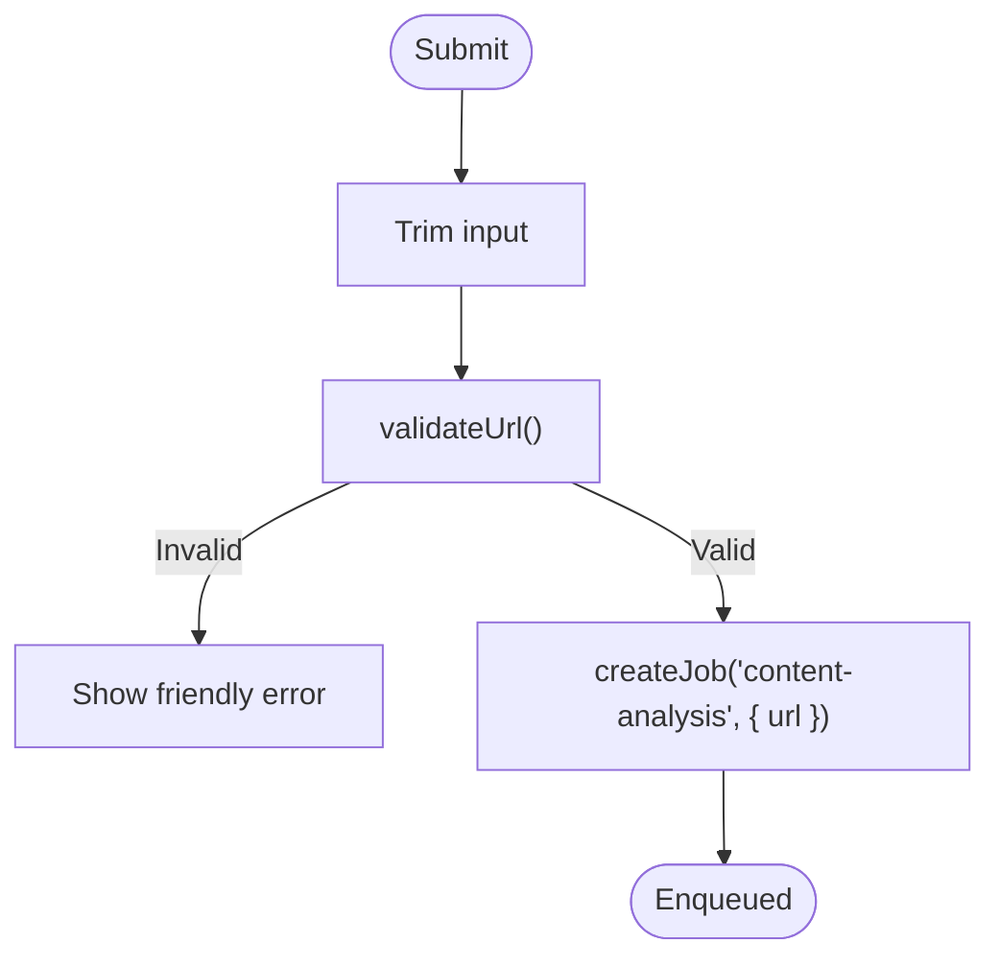
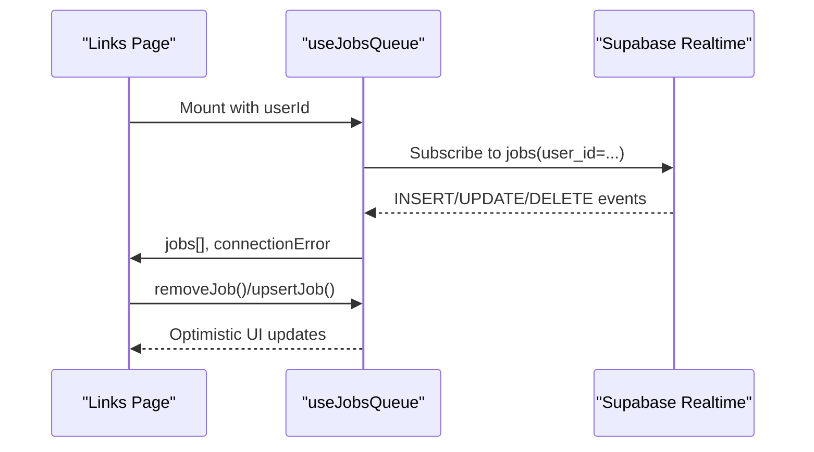
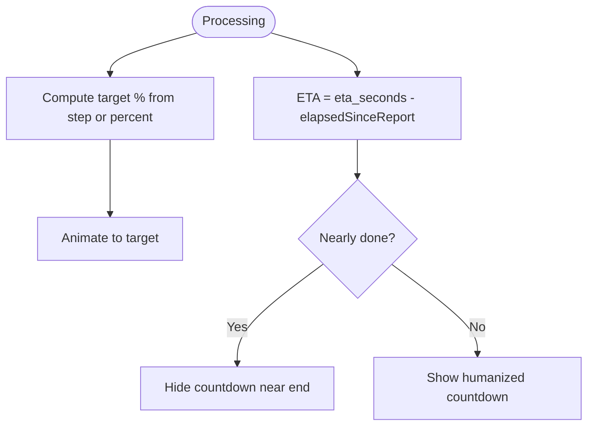
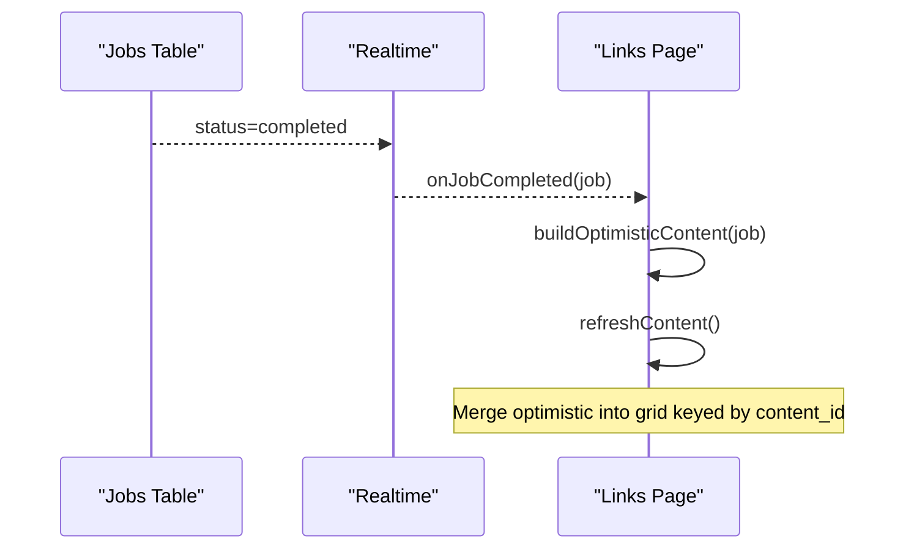
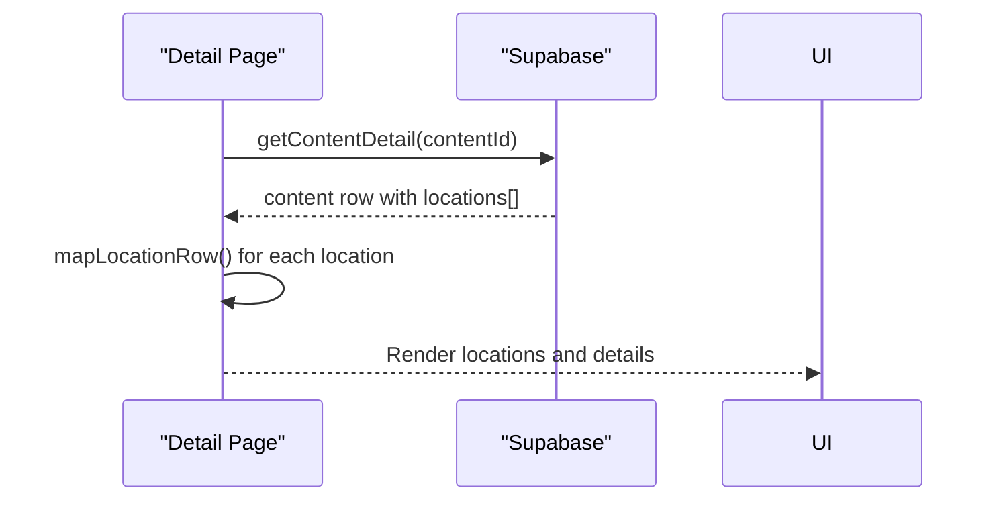
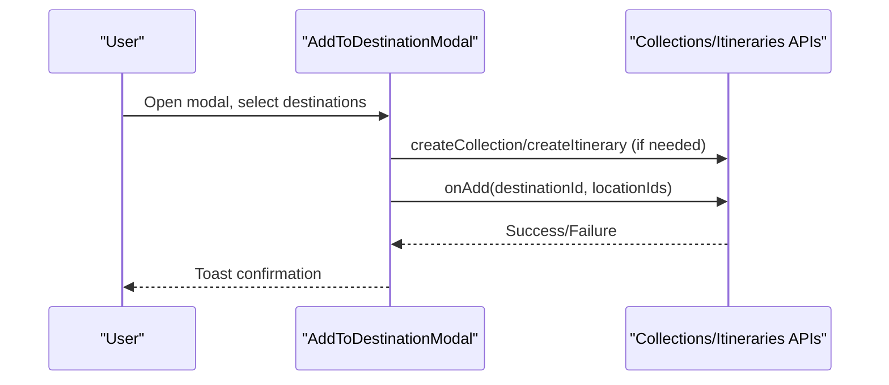
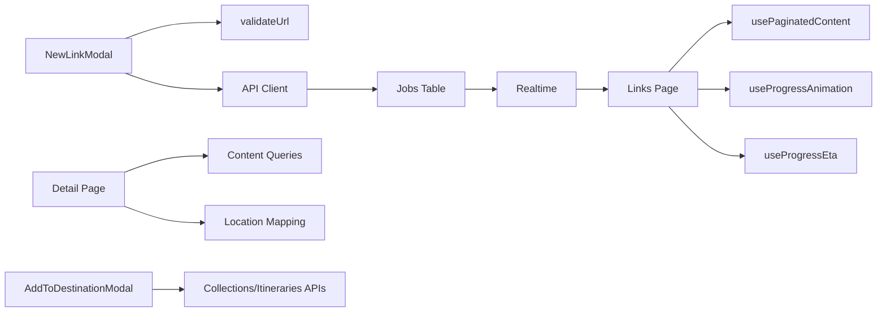

# Link Analysis Pipeline

<cite>
**Referenced Files in This Document**
- [page.tsx](file://src/app/links/page.tsx)
- [page.tsx](file://src/app/home/page.tsx)
- [client.ts](file://src/lib/api/client.ts)
- [useJobsQueue.ts](file://src/hooks/useJobsQueue.ts)
- [useProgressAnimation.ts](file://src/hooks/useProgressAnimation.ts)
- [useProgressEta.ts](file://src/hooks/useProgressEta.ts)
- [LinkCard.tsx](file://src/components/ui/cards/LinkCard.tsx)
- [AddToDestinationModal.tsx](file://src/components/ui/modals/AddToDestinationModal.tsx)
- [NewLinkModal.tsx](file://src/components/ui/modals/NewLinkModal.tsx)
- [url-validation.ts](file://src/lib/utils/url-validation.ts)
- [userMessages.ts](file://src/lib/errors/userMessages.ts)
- [home.ts](file://src/lib/supabase/queries/home.ts)
- [page.tsx](file://src/app/links/[id]/page.tsx)
</cite>

## Table of Contents
1. Introduction
2. Project Structure
3. Core Components
4. Architecture Overview
5. Detailed Component Analysis
6. Dependency Analysis
7. Performance Considerations
8. Troubleshooting Guide
9. Conclusion

## Introduction
This document explains Argo’s AI-powered link analysis pipeline: how a submitted URL is validated, queued for background processing, monitored in real time, and transformed into enriched content with travel-related locations and metadata. It covers the job queue system, progress tracking, error handling (network failures, quota limits, invalid URLs), and UI interactions such as the LinkCard and Add-to-Destination flows.

## Project Structure
The link analysis feature spans several layers:
- User input and validation via modals and utilities
- Job creation through an authenticated API client
- Real-time job queue monitoring using Supabase realtime
- Rendering of queue cards and completed link cards with smooth handoff
- Destination add flows to collections or itineraries

**Diagram sources**
- [NewLinkModal.tsx:56-80](file://src/components/ui/modals/NewLinkModal.tsx#L56-L80)
- [url-validation.ts:1-18](file://src/lib/utils/url-validation.ts#L1-L18)
- [client.ts:109-155](file://src/lib/api/client.ts#L109-L155)
- [useJobsQueue.ts:138-260](file://src/hooks/useJobsQueue.ts#L138-L260)
- [useProgressAnimation.ts:1-41](file://src/hooks/useProgressAnimation.ts#L1-L41)
- [useProgressEta.ts:22-59](file://src/hooks/useProgressEta.ts#L22-L59)
- [page.tsx:222-261](file://src/app/links/page.tsx#L222-L261)
- [page.tsx:99-118](file://src/app/links/page.tsx#L99-L118)
- [page.tsx:171-182](file://src/app/links/page.tsx#L171-L182)
- [page.tsx:287-333](file://src/app/links/[id]/page.tsx#L287-L333)
- [AddToDestinationModal.tsx:99-127](file://src/components/ui/modals/AddToDestinationModal.tsx#L99-L127)

**Section sources**
- [NewLinkModal.tsx:56-80](file://src/components/ui/modals/NewLinkModal.tsx#L56-L80)
- [url-validation.ts:1-18](file://src/lib/utils/url-validation.ts#L1-L18)
- [client.ts:109-155](file://src/lib/api/client.ts#L109-L155)
- [useJobsQueue.ts:138-260](file://src/hooks/useJobsQueue.ts#L138-L260)
- [useProgressAnimation.ts:1-41](file://src/hooks/useProgressAnimation.ts#L1-L41)
- [useProgressEta.ts:22-59](file://src/hooks/useProgressEta.ts#L22-L59)
- [page.tsx:222-261](file://src/app/links/page.tsx#L222-L261)
- [page.tsx:99-118](file://src/app/links/page.tsx#L99-L118)
- [page.tsx:171-182](file://src/app/links/page.tsx#L171-L182)
- [page.tsx:287-333](file://src/app/links/[id]/page.tsx#L287-L333)
- [AddToDestinationModal.tsx:99-127](file://src/components/ui/modals/AddToDestinationModal.tsx#L99-L127)

## Core Components
- NewLinkModal: Validates user input and submits the URL to the queue.
- API Client: Authenticates requests, creates jobs, handles quota and duplicate errors.
- Job Queue Hook: Subscribes to job changes, reconciles missed updates, exposes retry/remove.
- Progress Hooks: Provide animated percentage and countdown ETA for long-running tasks.
- Links Page: Merges queue items and completed links, shows optimistic completion, and manages retries/removals.
- Link Detail Page: Loads analyzed content and maps extracted locations for display.
- Add-to-Destination Modal: Adds extracted locations to collections or itineraries.

**Section sources**
- [NewLinkModal.tsx:56-80](file://src/components/ui/modals/NewLinkModal.tsx#L56-L80)
- [client.ts:109-155](file://src/lib/api/client.ts#L109-L155)
- [useJobsQueue.ts:45-295](file://src/hooks/useJobsQueue.ts#L45-L295)
- [useProgressAnimation.ts:1-41](file://src/hooks/useProgressAnimation.ts#L1-L41)
- [useProgressEta.ts:22-59](file://src/hooks/useProgressEta.ts#L22-L59)
- [page.tsx:120-300](file://src/app/links/page.tsx#L120-L300)
- [page.tsx:287-333](file://src/app/links/[id]/page.tsx#L287-L333)
- [AddToDestinationModal.tsx:99-127](file://src/components/ui/modals/AddToDestinationModal.tsx#L99-L127)

## Architecture Overview
End-to-end flow from submission to enriched results:

**Diagram sources**
- [NewLinkModal.tsx:56-80](file://src/components/ui/modals/NewLinkModal.tsx#L56-L80)
- [url-validation.ts:1-18](file://src/lib/utils/url-validation.ts#L1-L18)
- [client.ts:109-155](file://src/lib/api/client.ts#L109-L155)
- [useJobsQueue.ts:138-260](file://src/hooks/useJobsQueue.ts#L138-L260)
- [page.tsx:99-118](file://src/app/links/page.tsx#L99-L118)
- [page.tsx:287-333](file://src/app/links/[id]/page.tsx#L287-L333)

## Detailed Component Analysis

### URL Submission and Validation
- The modal validates the URL format and protocol before submission.
- On success, it calls the API to enqueue a content-analysis job.
- Errors are surfaced as friendly messages; backend-friendly messages are whitelisted.

**Diagram sources**
- [NewLinkModal.tsx:56-80](file://src/components/ui/modals/NewLinkModal.tsx#L56-L80)
- [url-validation.ts:1-18](file://src/lib/utils/url-validation.ts#L1-L18)
- [client.ts:109-155](file://src/lib/api/client.ts#L109-L155)
- [userMessages.ts:94-106](file://src/lib/errors/userMessages.ts#L94-L106)

**Section sources**
- [NewLinkModal.tsx:56-80](file://src/components/ui/modals/NewLinkModal.tsx#L56-L80)
- [url-validation.ts:1-18](file://src/lib/utils/url-validation.ts#L1-L18)
- [userMessages.ts:94-106](file://src/lib/errors/userMessages.ts#L94-L106)

### Job Queue System and Real-Time Updates
- Jobs are created via the API and stored in the jobs table.
- The hook subscribes to postgres_changes for the current user and reconciles missed updates when visibility changes or channels reconnect.
- Failed jobs under one day remain visible for retry; completed jobs trigger callbacks.

**Diagram sources**
- [useJobsQueue.ts:138-260](file://src/hooks/useJobsQueue.ts#L138-L260)
- [useJobsQueue.ts:269-295](file://src/hooks/useJobsQueue.ts#L269-L295)
- [page.tsx:138-170](file://src/app/links/page.tsx#L138-L170)

**Section sources**
- [useJobsQueue.ts:45-295](file://src/hooks/useJobsQueue.ts#L45-L295)
- [page.tsx:138-170](file://src/app/links/page.tsx#L138-L170)

### Progress Tracking and ETA
- Visual progress animates toward target percentages derived from worker step or reported percent.
- ETA countdown runs locally between worker updates to avoid per-tick writes.

**Diagram sources**
- [useProgressAnimation.ts:1-41](file://src/hooks/useProgressAnimation.ts#L1-L41)
- [useProgressEta.ts:22-59](file://src/hooks/useProgressEta.ts#L22-L59)

**Section sources**
- [useProgressAnimation.ts:1-41](file://src/hooks/useProgressAnimation.ts#L1-L41)
- [useProgressEta.ts:22-59](file://src/hooks/useProgressEta.ts#L22-L59)

### Content Completion and Optimistic Handoff
- When a job completes, the page builds an optimistic content item keyed by content_id so the queue card morphs into the link card without flicker.
- Once the real content row arrives, the optimistic entry is pruned.

**Diagram sources**
- [page.tsx:99-118](file://src/app/links/page.tsx#L99-L118)
- [page.tsx:138-170](file://src/app/links/page.tsx#L138-L170)
- [page.tsx:188-197](file://src/app/links/page.tsx#L188-L197)

**Section sources**
- [page.tsx:99-118](file://src/app/links/page.tsx#L99-L118)
- [page.tsx:138-170](file://src/app/links/page.tsx#L138-L170)
- [page.tsx:188-197](file://src/app/links/page.tsx#L188-L197)

### Link Detail and Location Extraction Display
- The detail page loads content and maps extracted locations to rich location objects for rendering.
- Recent links are filtered by processing_status=completed to ensure only finished analyses appear in lists.

**Diagram sources**
- [page.tsx:287-333](file://src/app/links/[id]/page.tsx#L287-L333)
- [home.ts:402-439](file://src/lib/supabase/queries/home.ts#L402-L439)

**Section sources**
- [page.tsx:287-333](file://src/app/links/[id]/page.tsx#L287-L333)
- [home.ts:402-439](file://src/lib/supabase/queries/home.ts#L402-L439)

### Add-to-Destination Integration
- Users can add extracted locations to existing or new collections/itineraries via a modal that fetches destinations, supports search, and confirms batch adds.

**Diagram sources**
- [AddToDestinationModal.tsx:99-127](file://src/components/ui/modals/AddToDestinationModal.tsx#L99-L127)
- [AddToDestinationModal.tsx:134-156](file://src/components/ui/modals/AddToDestinationModal.tsx#L134-L156)

**Section sources**
- [AddToDestinationModal.tsx:99-127](file://src/components/ui/modals/AddToDestinationModal.tsx#L99-L127)
- [AddToDestinationModal.tsx:134-156](file://src/components/ui/modals/AddToDestinationModal.tsx#L134-L156)

### LinkCard Interactions
- LinkCard renders thumbnails and delegates actions (delete, view) to parent handlers.
- It integrates with selection modes and context menus provided by BaseCard.

**Section sources**
- [LinkCard.tsx:1-79](file://src/components/ui/cards/LinkCard.tsx#L1-L79)

## Dependency Analysis
Key dependencies and coupling:
- NewLinkModal depends on URL validation and the API client for job creation.
- Links Page depends on the job queue hook, paginated content, and progress hooks.
- Detail Page depends on content queries and location mapping.
- Add-to-Destination Modal depends on collection/itinerary APIs.

**Diagram sources**
- [NewLinkModal.tsx:56-80](file://src/components/ui/modals/NewLinkModal.tsx#L56-L80)
- [client.ts:109-155](file://src/lib/api/client.ts#L109-L155)
- [useJobsQueue.ts:138-260](file://src/hooks/useJobsQueue.ts#L138-L260)
- [page.tsx:171-182](file://src/app/links/page.tsx#L171-L182)
- [page.tsx:287-333](file://src/app/links/[id]/page.tsx#L287-L333)
- [AddToDestinationModal.tsx:99-127](file://src/components/ui/modals/AddToDestinationModal.tsx#L99-L127)

**Section sources**
- [NewLinkModal.tsx:56-80](file://src/components/ui/modals/NewLinkModal.tsx#L56-L80)
- [client.ts:109-155](file://src/lib/api/client.ts#L109-L155)
- [useJobsQueue.ts:138-260](file://src/hooks/useJobsQueue.ts#L138-L260)
- [page.tsx:171-182](file://src/app/links/page.tsx#L171-L182)
- [page.tsx:287-333](file://src/app/links/[id]/page.tsx#L287-L333)
- [AddToDestinationModal.tsx:99-127](file://src/components/ui/modals/AddToDestinationModal.tsx#L99-L127)

## Performance Considerations
- Realtime reconciliation prevents stale “stuck” queue cards by re-fetching active jobs on visibility change or channel reconnect.
- Optimistic UI reduces perceived latency by immediately showing completed cards keyed by content_id before the canonical row arrives.
- ETA countdown runs locally to avoid excessive writes while keeping the UI responsive.
- Pagination and infinite scroll keep the links feed performant as content grows.

[No sources needed since this section provides general guidance]

## Troubleshooting Guide
Common issues and remedies:
- Invalid URL: Use the built-in validator to catch malformed inputs early.
- Quota exceeded: The client throws a typed quota error; show upgrade prompt and refresh usage data.
- Already analyzed: Duplicate submissions return a structured error with the existing content; navigate to the existing link instead of reprocessing.
- Network failures: Transport errors surface as status 0; wrap calls with friendly message mapping and retry options.
- Stuck jobs: If a job remains in processing/pending beyond a threshold, offer retry; failed jobs within 24 hours remain visible for retry.
- Retry mechanism: Call retry endpoint and optimistically upsert the returned job row to leave the failed state immediately.

**Section sources**
- [url-validation.ts:1-18](file://src/lib/utils/url-validation.ts#L1-L18)
- [client.ts:109-155](file://src/lib/api/client.ts#L109-L155)
- [userMessages.ts:94-106](file://src/lib/errors/userMessages.ts#L94-L106)
- [page.tsx:209-220](file://src/app/links/page.tsx#L209-L220)
- [page.tsx:222-261](file://src/app/links/page.tsx#L222-L261)

## Conclusion
Argo’s link analysis pipeline combines robust input validation, a resilient job queue with real-time updates, and a polished UI that smoothly transitions from queue to completed content. It handles quotas, duplicates, and network issues gracefully, while providing clear progress signals and actionable recovery paths. Extracted locations are presented in detail views and can be added to destinations, completing the workflow from URL to itinerary-ready insights.