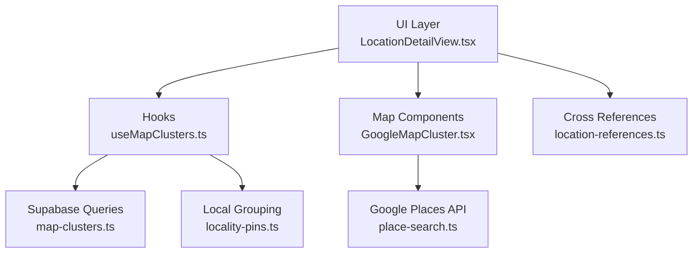
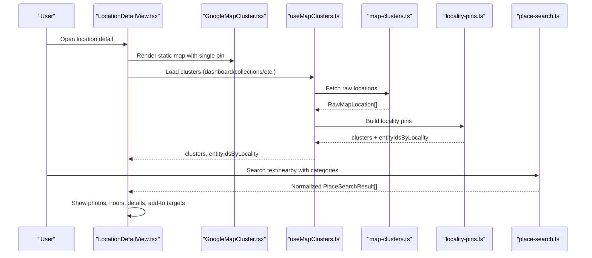
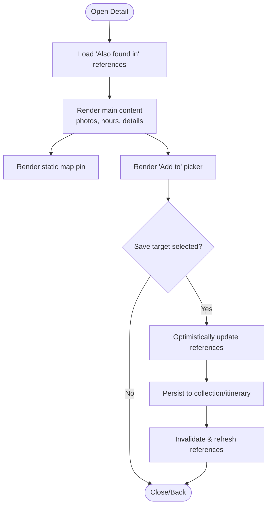
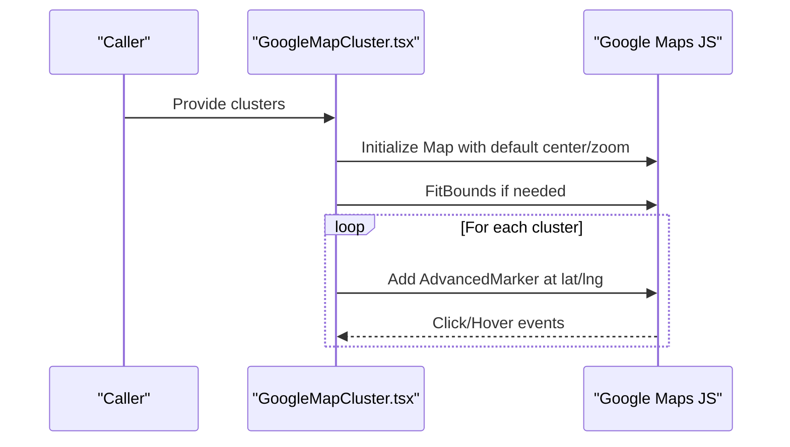
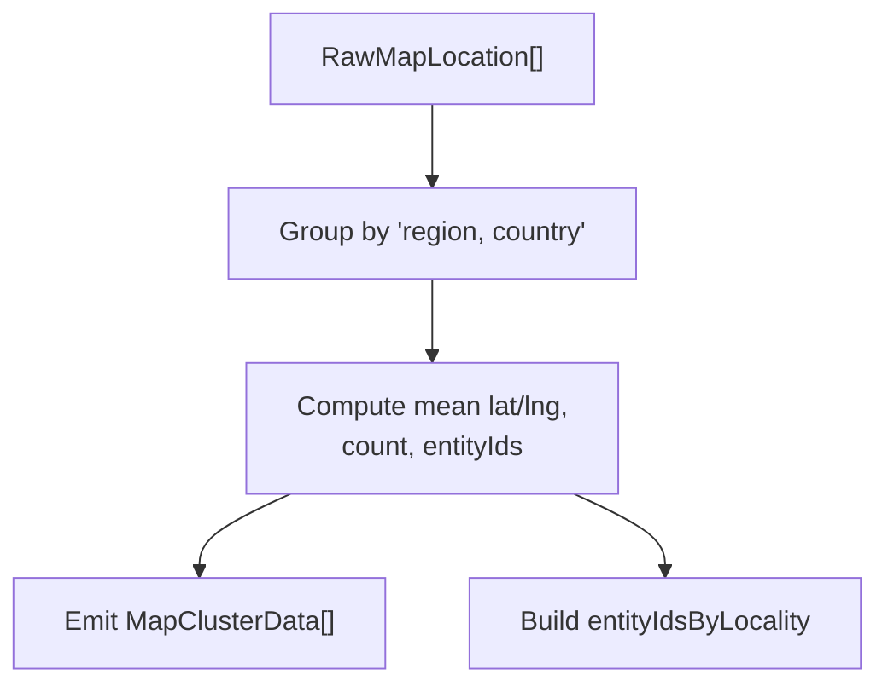
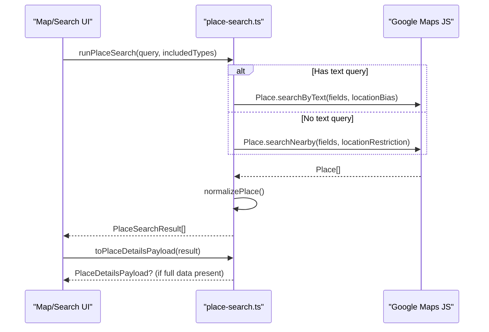
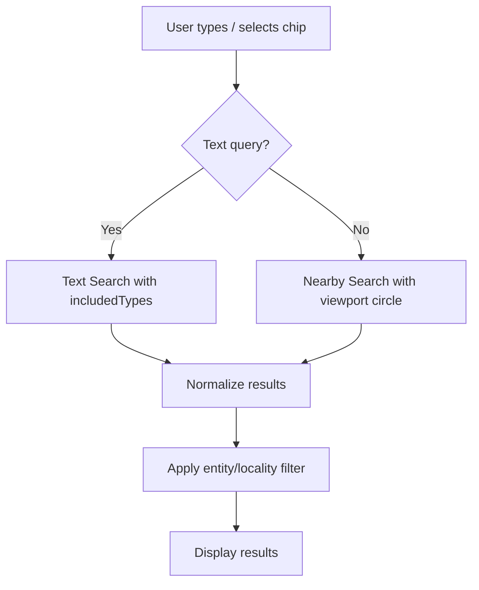
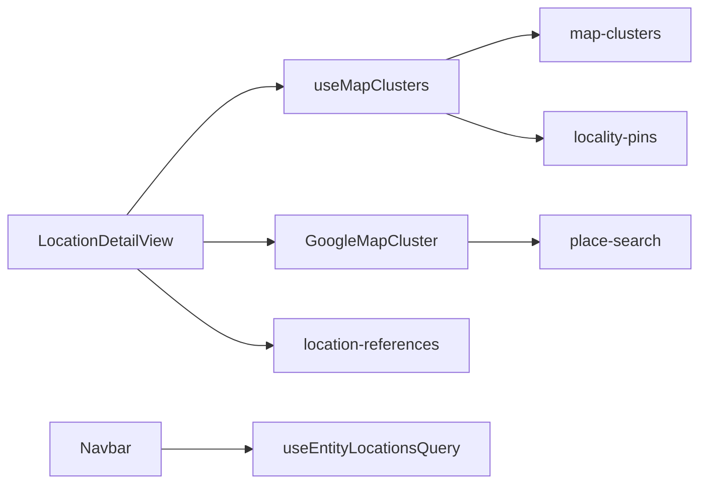
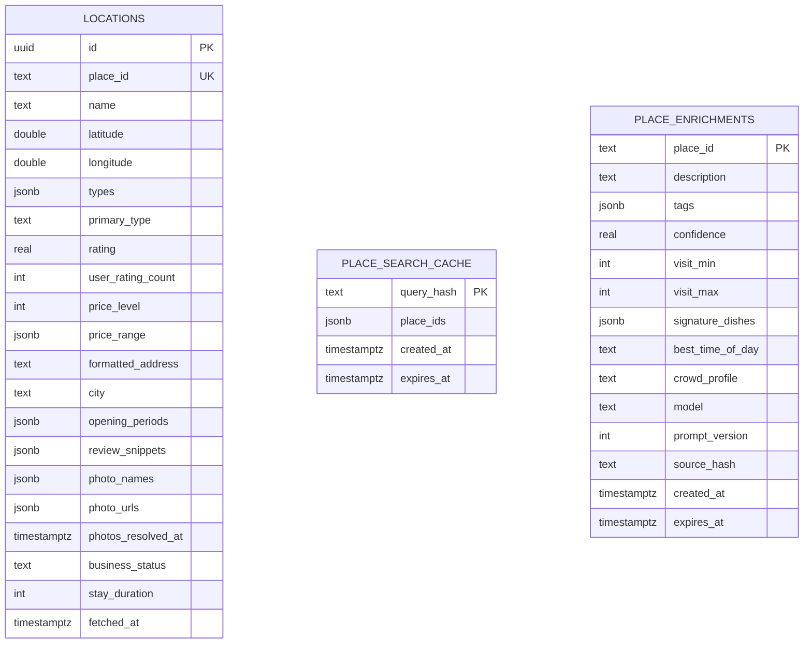

# Location Discovery

<cite>
**Referenced Files in This Document**
- [LocationDetailView.tsx](file://src/components/ui/detail-views/LocationDetailView.tsx)
- [GoogleMapCluster.tsx](file://src/components/ui/map/GoogleMapCluster.tsx)
- [useMapClusters.ts](file://src/hooks/useMapClusters.ts)
- [locality-pins.ts](file://src/lib/maps/locality-pins.ts)
- [place-search.ts](file://src/lib/maps/place-search.ts)
- [map-clusters.ts](file://src/lib/supabase/queries/map-clusters.ts)
- [SearchBar.tsx](file://src/components/ui/primitives/SearchBar.tsx)
- [Navbar.tsx](file://src/components/ui/navbar/Navbar.tsx)
- [useEntityLocationsQuery.ts](file://src/hooks/queries/useEntityLocationsQuery.ts)
- [location-references.ts](file://src/lib/supabase/queries/location-references.ts)
- [personalization-pipeline.md](file://docs/personalization-pipeline.md)
</cite>

## Table of Contents
1. Introduction
2. Project Structure
3. Core Components
4. Architecture Overview
5. Detailed Component Analysis
6. Dependency Analysis
7. Performance Considerations
8. Troubleshooting Guide
9. Conclusion
10. Appendices

## Introduction
This document explains Argo’s location discovery system: how geographic entities are extracted from analyzed content, deduplicated and clustered for efficient display, integrated with Google Maps APIs for search and details, and presented through the LocationDetailView component. It also covers search and filtering by category and proximity, plus performance optimizations and caching strategies for large datasets.

## Project Structure
The location discovery system spans UI components, hooks, map utilities, and Supabase queries:
- UI layer: LocationDetailView renders place info, photos, opening hours, and a small static map; GoogleMapCluster renders interactive clusters on Google Maps.
- Hooks: useMapClusters fetches and aggregates locations into locality-based clusters; useEntityLocationsQuery retrieves locations tied to an entity (link/collection/itinerary).
- Map utilities: place-search implements Google Places Text/Nearby Search and normalization; locality-pins groups entities by region/country for clustering.
- Data layer: map-clusters queries collections/content/itineraries for cluster data; location-references powers “Also found in” cross-references.

**Diagram sources**
- [LocationDetailView.tsx:189-776](file://src/components/ui/detail-views/LocationDetailView.tsx#L189-L776)
- [GoogleMapCluster.tsx:1-181](file://src/components/ui/map/GoogleMapCluster.tsx#L1-L181)
- [useMapClusters.ts:1-61](file://src/hooks/useMapClusters.ts#L1-L61)
- [map-clusters.ts:1-96](file://src/lib/supabase/queries/map-clusters.ts#L1-L96)
- [place-search.ts:1-467](file://src/lib/maps/place-search.ts#L1-L467)
- [locality-pins.ts:1-77](file://src/lib/maps/locality-pins.ts#L1-L77)
- [location-references.ts:1-45](file://src/lib/supabase/queries/location-references.ts#L1-L45)

**Section sources**
- [LocationDetailView.tsx:189-776](file://src/components/ui/detail-views/LocationDetailView.tsx#L189-L776)
- [GoogleMapCluster.tsx:1-181](file://src/components/ui/map/GoogleMapCluster.tsx#L1-L181)
- [useMapClusters.ts:1-61](file://src/hooks/useMapClusters.ts#L1-L61)
- [map-clusters.ts:1-96](file://src/lib/supabase/queries/map-clusters.ts#L1-L96)
- [place-search.ts:1-467](file://src/lib/maps/place-search.ts#L1-L467)
- [locality-pins.ts:1-77](file://src/lib/maps/locality-pins.ts#L1-L77)
- [location-references.ts:1-45](file://src/lib/supabase/queries/location-references.ts#L1-L45)

## Core Components
- LocationDetailView: Displays name, address, photos, opening hours, phone, website, stay duration, price range, and a small static map. Supports adding to collections/itineraries and shows “Also found in” references.
- GoogleMapCluster: Renders interactive markers/clusters with auto-fit bounds and hover states.
- useMapClusters: Fetches raw locations via Supabase and builds locality pins for clustering.
- place-search: Implements Google Places Text/Nearby Search, normalizes results, and prepares payloads for server persistence.
- locality-pins: Groups entities by region/country and computes mean coordinates for cluster pins.
- map-clusters: Retrieves locations across collections, content, and itineraries for dashboard and list views.
- SearchBar: Debounced search input used within detail view and navbar flows.
- Navbar integration: Applies filters (entity-scoped or locality-scoped) and composes search results.

**Section sources**
- [LocationDetailView.tsx:189-776](file://src/components/ui/detail-views/LocationDetailView.tsx#L189-L776)
- [GoogleMapCluster.tsx:1-181](file://src/components/ui/map/GoogleMapCluster.tsx#L1-L181)
- [useMapClusters.ts:1-61](file://src/hooks/useMapClusters.ts#L1-L61)
- [place-search.ts:1-467](file://src/lib/maps/place-search.ts#L1-L467)
- [locality-pins.ts:1-77](file://src/lib/maps/locality-pins.ts#L1-L77)
- [map-clusters.ts:1-96](file://src/lib/supabase/queries/map-clusters.ts#L1-L96)
- [SearchBar.tsx:1-215](file://src/components/ui/primitives/SearchBar.tsx#L1-L215)
- [Navbar.tsx:78-258](file://src/components/ui/navbar/Navbar.tsx#L78-L258)

## Architecture Overview
The system combines client-side search and enrichment with server-side storage and cross-reference lookups.

**Diagram sources**
- [LocationDetailView.tsx:189-776](file://src/components/ui/detail-views/LocationDetailView.tsx#L189-L776)
- [GoogleMapCluster.tsx:1-181](file://src/components/ui/map/GoogleMapCluster.tsx#L1-L181)
- [useMapClusters.ts:1-61](file://src/hooks/useMapClusters.ts#L1-L61)
- [map-clusters.ts:1-96](file://src/lib/supabase/queries/map-clusters.ts#L1-L96)
- [locality-pins.ts:1-77](file://src/lib/maps/locality-pins.ts#L1-L77)
- [place-search.ts:1-467](file://src/lib/maps/place-search.ts#L1-L467)

## Detailed Component Analysis

### LocationDetailView
- Purpose: Present discovered location information, images, opening hours, contact details, and related activities; enable saving to collections/itineraries and show “Also found in”.
- Key behaviors:
  - Renders a small static map with a single cluster pin derived from latitude/longitude.
  - Shows photo gallery with lightbox and “more images” indicator.
  - Displays structured rows for address, opening hours, phone, website, stay duration, and price range.
  - Provides an “Add to” picker that searches available collections/itineraries and supports creating a new collection inline.
  - Optimistically updates “Also found in” references and reconciles after save.
- Integration points:
  - Uses StaticMap for embedded map visualization.
  - Uses query keys and React Query to cache and invalidate reference lists.
  - Opens Google Maps externally using stored URI or computed URL.

**Diagram sources**
- [LocationDetailView.tsx:214-330](file://src/components/ui/detail-views/LocationDetailView.tsx#L214-L330)
- [LocationDetailView.tsx:339-358](file://src/components/ui/detail-views/LocationDetailView.tsx#L339-L358)
- [LocationDetailView.tsx:519-776](file://src/components/ui/detail-views/LocationDetailView.tsx#L519-L776)

**Section sources**
- [LocationDetailView.tsx:189-776](file://src/components/ui/detail-views/LocationDetailView.tsx#L189-L776)

### GoogleMapCluster
- Purpose: Render interactive Google Maps with clustered markers, auto-fitting bounds, and hover interactions.
- Key behaviors:
  - Computes center and zoom based on cluster spread.
  - Fits bounds when multiple clusters exist; centers on single cluster.
  - Wraps map rendering in APIProvider with theme-aware map IDs.
  - Exposes click/hover callbacks for drill-down and detail panels.

**Diagram sources**
- [GoogleMapCluster.tsx:13-67](file://src/components/ui/map/GoogleMapCluster.tsx#L13-L67)
- [GoogleMapCluster.tsx:80-136](file://src/components/ui/map/GoogleMapCluster.tsx#L80-L136)
- [GoogleMapCluster.tsx:174-181](file://src/components/ui/map/GoogleMapCluster.tsx#L174-L181)

**Section sources**
- [GoogleMapCluster.tsx:1-181](file://src/components/ui/map/GoogleMapCluster.tsx#L1-L181)

### useMapClusters and locality-pins
- Purpose: Aggregate saved entities into locality-based clusters for maps and lists.
- Algorithm:
  - Fetch raw locations per source (collections, content, itineraries, dashboard).
  - Group by “region, country” label; compute mean lat/lng and count unique entity IDs.
  - Return clusters and a mapping from locality label to entity IDs for filtering.

**Diagram sources**
- [useMapClusters.ts:1-61](file://src/hooks/useMapClusters.ts#L1-L61)
- [locality-pins.ts:1-77](file://src/lib/maps/locality-pins.ts#L1-L77)
- [map-clusters.ts:1-96](file://src/lib/supabase/queries/map-clusters.ts#L1-L96)

**Section sources**
- [useMapClusters.ts:1-61](file://src/hooks/useMapClusters.ts#L1-L61)
- [locality-pins.ts:1-77](file://src/lib/maps/locality-pins.ts#L1-L77)
- [map-clusters.ts:1-96](file://src/lib/supabase/queries/map-clusters.ts#L1-L96)

### Google Places Integration (Search and Details)
- Purpose: Discover places via Google Places API (Text/Nearby), normalize results, and prepare payloads for server persistence.
- Key behaviors:
  - Text Search: uses current viewport bias and optional included types.
  - Nearby Search: derives circle from viewport with capped radius; supports included types.
  - Normalization: extracts photos, address components, opening hours periods, price level/range, and metadata.
  - Enrichment path: detects missing Enterprise fields and triggers Place Details fetch when needed.
  - Payload builder: serializes normalized result for server-side storage without redundant calls.

**Diagram sources**
- [place-search.ts:145-174](file://src/lib/maps/place-search.ts#L145-L174)
- [place-search.ts:176-263](file://src/lib/maps/place-search.ts#L176-L263)
- [place-search.ts:332-383](file://src/lib/maps/place-search.ts#L332-L383)
- [place-search.ts:391-467](file://src/lib/maps/place-search.ts#L391-L467)

**Section sources**
- [place-search.ts:1-467](file://src/lib/maps/place-search.ts#L1-L467)

### Search and Filtering
- Category-based organization:
  - Chips define included Types for Places API (restaurants, cafes, attractions, etc.).
  - Applied during Text/Nearby Search to narrow results.
- Proximity searches:
  - Nearby mode derives a circle from the map viewport and caps radius to service limits.
- Entity-scoped filtering:
  - useEntityLocationsQuery loads locations associated with a specific entity (link/collection/itinerary).
  - Navbar applies either entity-scoped or locality-scoped filters to compose final results.
- Debounced input:
  - SearchBar debounces user input to reduce unnecessary re-renders and requests.

**Diagram sources**
- [place-search.ts:71-89](file://src/lib/maps/place-search.ts#L71-L89)
- [place-search.ts:154-174](file://src/lib/maps/place-search.ts#L154-L174)
- [place-search.ts:391-467](file://src/lib/maps/place-search.ts#L391-L467)
- [useEntityLocationsQuery.ts:1-22](file://src/hooks/queries/useEntityLocationsQuery.ts#L1-L22)
- [Navbar.tsx:78-258](file://src/components/ui/navbar/Navbar.tsx#L78-L258)
- [SearchBar.tsx:1-215](file://src/components/ui/primitives/SearchBar.tsx#L1-L215)

**Section sources**
- [place-search.ts:71-89](file://src/lib/maps/place-search.ts#L71-L89)
- [place-search.ts:154-174](file://src/lib/maps/place-search.ts#L154-L174)
- [place-search.ts:391-467](file://src/lib/maps/place-search.ts#L391-L467)
- [useEntityLocationsQuery.ts:1-22](file://src/hooks/queries/useEntityLocationsQuery.ts#L1-L22)
- [Navbar.tsx:78-258](file://src/components/ui/navbar/Navbar.tsx#L78-L258)
- [SearchBar.tsx:1-215](file://src/components/ui/primitives/SearchBar.tsx#L1-L215)

### Cross-References (“Also found in”)
- Purpose: Show other collections/itineraries containing the same location, excluding the current container.
- Behavior:
  - Loads references scoped by RLS to user-accessible items.
  - Optimistically inserts new references on save and invalidates to reconcile with server state.

**Section sources**
- [location-references.ts:1-45](file://src/lib/supabase/queries/location-references.ts#L1-L45)
- [LocationDetailView.tsx:214-330](file://src/components/ui/detail-views/LocationDetailView.tsx#L214-L330)

## Dependency Analysis
- UI depends on hooks for data fetching and map utilities for rendering.
- Hooks depend on Supabase queries for raw data and locality grouping logic.
- Map components depend on Google Maps JS library and environment configuration.
- Place search depends on Google Places API and normalizes results for consistent consumption.

**Diagram sources**
- [LocationDetailView.tsx:189-776](file://src/components/ui/detail-views/LocationDetailView.tsx#L189-L776)
- [useMapClusters.ts:1-61](file://src/hooks/useMapClusters.ts#L1-L61)
- [map-clusters.ts:1-96](file://src/lib/supabase/queries/map-clusters.ts#L1-L96)
- [locality-pins.ts:1-77](file://src/lib/maps/locality-pins.ts#L1-L77)
- [GoogleMapCluster.tsx:1-181](file://src/components/ui/map/GoogleMapCluster.tsx#L1-L181)
- [place-search.ts:1-467](file://src/lib/maps/place-search.ts#L1-L467)
- [useEntityLocationsQuery.ts:1-22](file://src/hooks/queries/useEntityLocationsQuery.ts#L1-L22)
- [location-references.ts:1-45](file://src/lib/supabase/queries/location-references.ts#L1-L45)

**Section sources**
- [LocationDetailView.tsx:189-776](file://src/components/ui/detail-views/LocationDetailView.tsx#L189-L776)
- [useMapClusters.ts:1-61](file://src/hooks/useMapClusters.ts#L1-L61)
- [map-clusters.ts:1-96](file://src/lib/supabase/queries/map-clusters.ts#L1-L96)
- [locality-pins.ts:1-77](file://src/lib/maps/locality-pins.ts#L1-L77)
- [GoogleMapCluster.tsx:1-181](file://src/components/ui/map/GoogleMapCluster.tsx#L1-L181)
- [place-search.ts:1-467](file://src/lib/maps/place-search.ts#L1-L467)
- [useEntityLocationsQuery.ts:1-22](file://src/hooks/queries/useEntityLocationsQuery.ts#L1-L22)
- [location-references.ts:1-45](file://src/lib/supabase/queries/location-references.ts#L1-L45)

## Performance Considerations
- Client-side caching:
  - React Query caches map clusters and entity locations with staleTime to avoid frequent refetches.
  - Debounced search input reduces churn during typing.
- Efficient API usage:
  - Places search requests a rich field set in one call; avoids extra Place Details unless necessary.
  - Nearby search caps radius to service limits and uses viewport-derived circles.
- Aggregation and clustering:
  - Locality grouping reduces marker count and improves map performance.
  - Auto-fit bounds minimize unnecessary panning/zooming.
- Server-side caching strategy:
  - Place search cache with TTL keeps retrieval fast and compliant with content-caching terms.
  - AI enrichment cached per place with expiration to reuse insights.
  - Structured tables store normalized place data and media URLs for fast reads.

[No sources needed since this section provides general guidance]

## Troubleshooting Guide
- Missing coordinates:
  - Place normalization skips results without lat/lng; ensure valid Places responses before rendering.
- Empty clusters:
  - Verify userId is provided and enabled for queries; check Supabase filters for non-null country/latitude.
- Stale or incorrect references:
  - After saving to a collection/itinerary, ensure query invalidation runs to reconcile optimistic updates.
- Search not returning results:
  - Confirm viewport bounds exist for Nearby mode; validate includedTypes mapping to supported Places types.
- Photo attribution:
  - Ensure author attributions are displayed per platform requirements when showing photos.

**Section sources**
- [place-search.ts:176-263](file://src/lib/maps/place-search.ts#L176-L263)
- [map-clusters.ts:19-39](file://src/lib/supabase/queries/map-clusters.ts#L19-L39)
- [LocationDetailView.tsx:260-290](file://src/components/ui/detail-views/LocationDetailView.tsx#L260-L290)
- [place-search.ts:391-467](file://src/lib/maps/place-search.ts#L391-L467)

## Conclusion
Argo’s location discovery integrates robust client-side search and enrichment with efficient clustering and presentation. The system leverages Google Places APIs judiciously, caches aggressively, and provides a clear user experience through LocationDetailView and interactive maps. Category and proximity filters, along with entity-scoped navigation, make discovering and organizing locations intuitive and performant.

[No sources needed since this section summarizes without analyzing specific files]

## Appendices

### Data Model Overview

**Diagram sources**
- [personalization-pipeline.md:802-925](file://docs/personalization-pipeline.md#L802-L925)