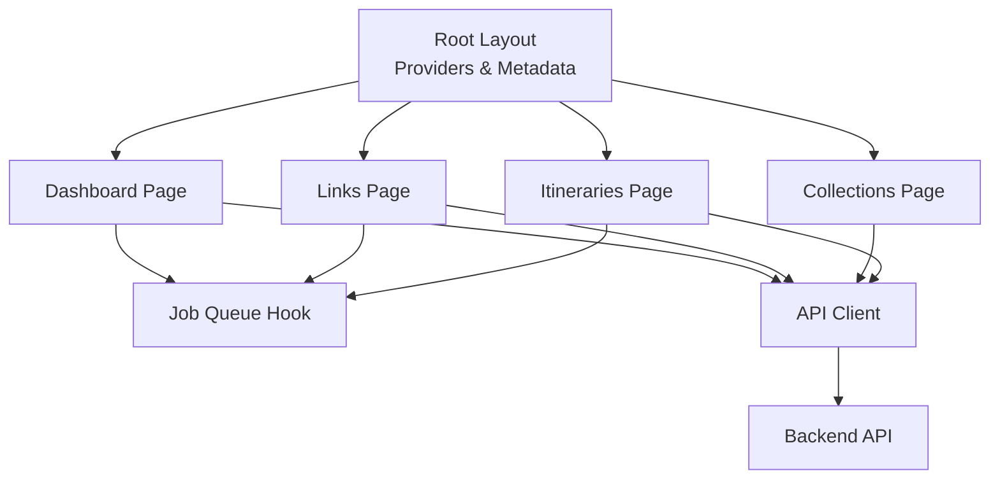
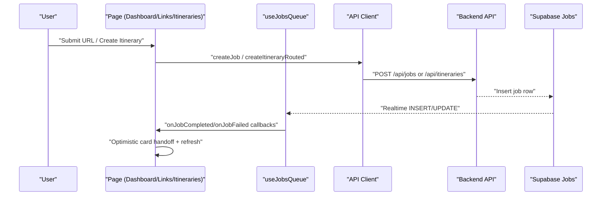
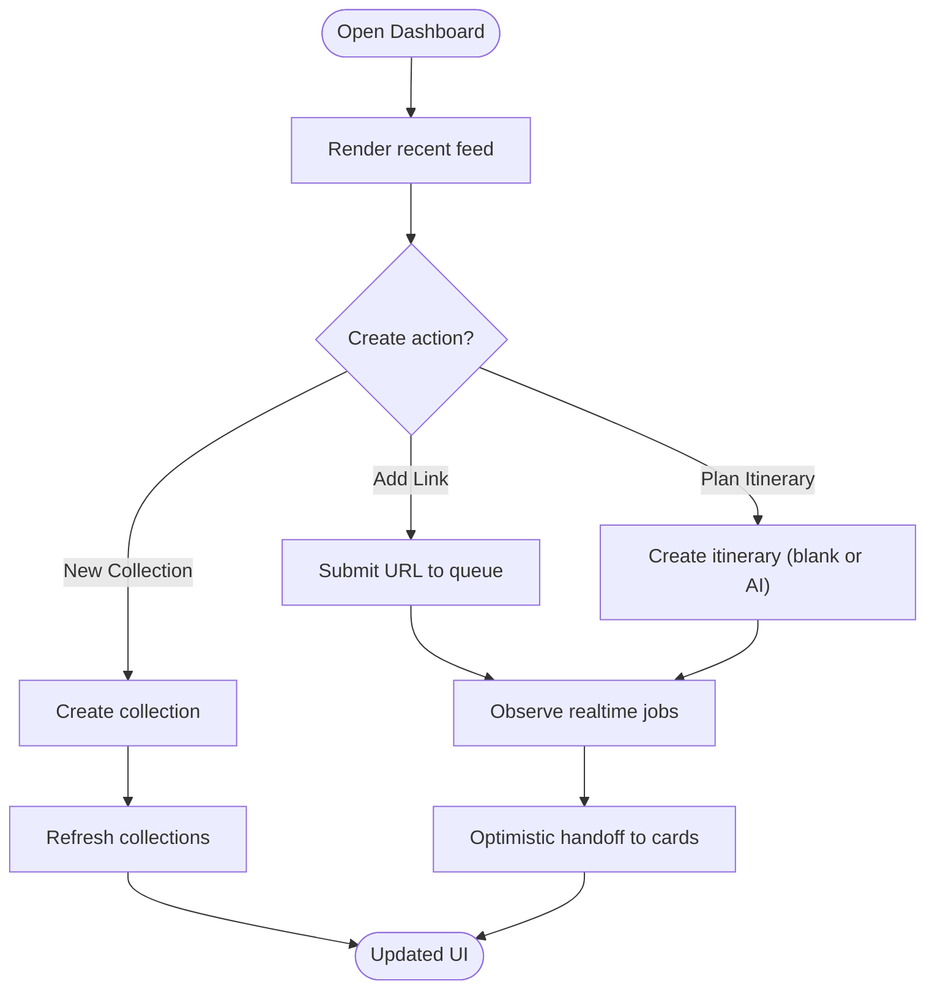
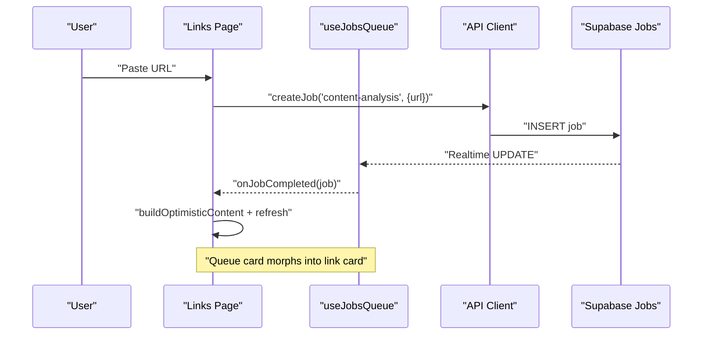
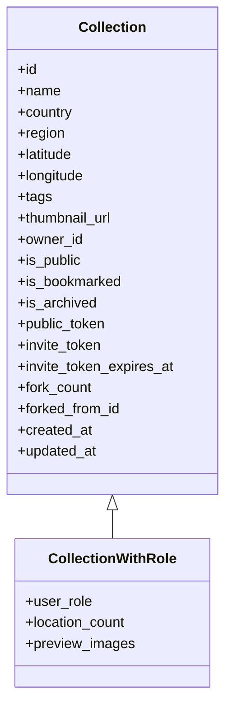
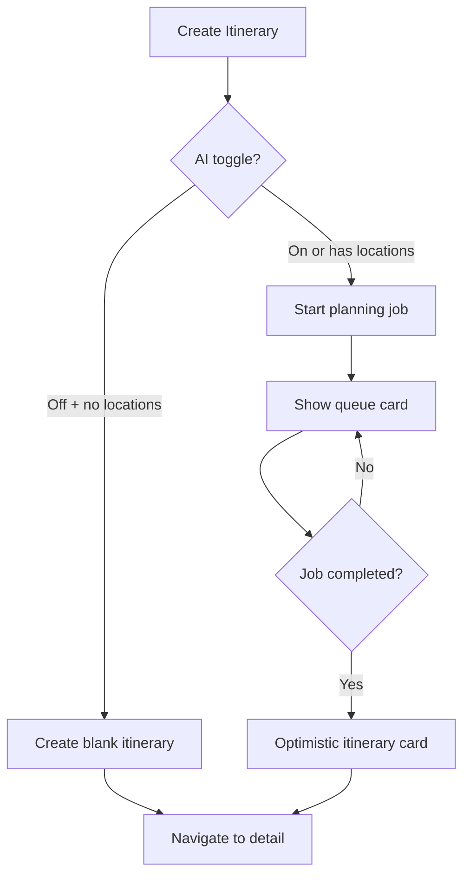
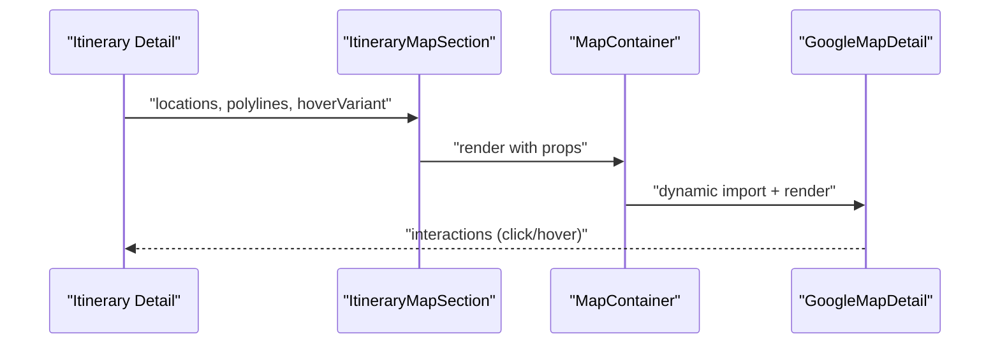
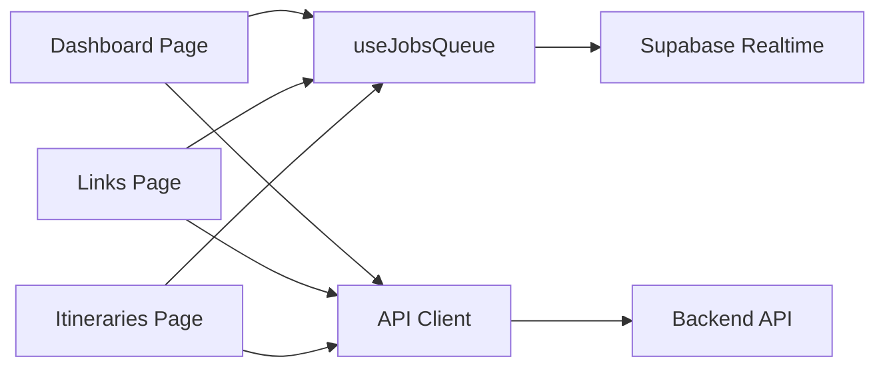

# Core Features

<cite>
**Referenced Files in This Document**
- [package.json](file://package.json)
- [src/app/layout.tsx](file://src/app/layout.tsx)
- [src/app/page.tsx](file://src/app/page.tsx)
- [src/app/home/page.tsx](file://src/app/home/page.tsx)
- [src/app/links/page.tsx](file://src/app/links/page.tsx)
- [src/app/collections/page.tsx](file://src/app/collections/page.tsx)
- [src/app/itineraries/page.tsx](file://src/app/itineraries/page.tsx)
- [src/hooks/useJobsQueue.ts](file://src/hooks/useJobsQueue.ts)
- [src/lib/api/client.ts](file://src/lib/api/client.ts)
- [src/lib/api/itineraries.ts](file://src/lib/api/itineraries.ts)
- [src/lib/api/collections.ts](file://src/lib/api/collections.ts)
- [src/components/ui/itinerary/ItineraryPageHeader.tsx](file://src/components/ui/itinerary/ItineraryPageHeader.tsx)
- [src/components/ui/itinerary/ItineraryMapSection.tsx](file://src/components/ui/itinerary/ItineraryMapSection.tsx)
- [src/components/ui/map/MapContainer.tsx](file://src/components/ui/map/MapContainer.tsx)
- [src/components/ui/itinerary/ItineraryControls.tsx](file://src/components/ui/itinerary/ItineraryControls.tsx)
- [src/lib/planner/types.ts](file://src/lib/planner/types.ts)
</cite>

## Table of Contents
1. Introduction
2. Project Structure
3. Core Components
4. Architecture Overview
5. Detailed Component Analysis
6. Dependency Analysis
7. Performance Considerations
8. Troubleshooting Guide
9. Conclusion

## Introduction
This document explains the core features of the Argo itinerary planner with a focus on user journeys, key components, data models, and integrations. It covers:
- Dashboard interface for creating links, collections, and itineraries
- Link processing pipeline (asynchronous analysis)
- Collection management
- Itinerary planning (AI-assisted or blank)
- Map visualization within itineraries

The goal is to help both new users and advanced users understand how to use and customize the system effectively.

## Project Structure
Argo is a Next.js application with client-side React components, hooks for real-time job queues and queries, and API clients that call a backend service. The root layout wires global providers (theme, toast, query client), and the app routes organize feature pages for home/dashboard, links, collections, and itineraries.

**Diagram sources**
- [src/app/layout.tsx:1-85](file://src/app/layout.tsx#L1-L85)
- [src/app/home/page.tsx:1-1004](file://src/app/home/page.tsx#L1-L1004)
- [src/app/links/page.tsx:1-430](file://src/app/links/page.tsx#L1-L430)
- [src/app/collections/page.tsx:1-248](file://src/app/collections/page.tsx#L1-L248)
- [src/app/itineraries/page.tsx:1-400](file://src/app/itineraries/page.tsx#L1-L400)
- [src/hooks/useJobsQueue.ts:1-296](file://src/hooks/useJobsQueue.ts#L1-L296)
- [src/lib/api/client.ts:1-156](file://src/lib/api/client.ts#L1-L156)

**Section sources**
- [package.json:1-50](file://package.json#L1-L50)
- [src/app/layout.tsx:1-85](file://src/app/layout.tsx#L1-L85)
- [src/app/page.tsx:1-6](file://src/app/page.tsx#L1-L6)

## Core Components
- Dashboard: Central hub to create and manage links, collections, and itineraries; shows recent content and running jobs.
- Links: Submit URLs for analysis; view queued, processing, completed, and failed states; retry or remove.
- Collections: Create, list, and delete location collections; add locations from links or maps.
- Itineraries: Create blank or AI-generated plans; view cards; manage queue for async generation; navigate to detail views.
- Job Queue: Realtime tracking of background tasks (content-analysis, itinerary-planning) with optimistic UI handoff.
- Map Visualization: Google Maps integration for itinerary day routes and location clusters.

Key implementation highlights:
- Realtime job updates via Supabase channels with reconciliation for missed events.
- Optimistic UI transitions from queue cards to final cards upon completion.
- Quota-aware flows for link and itinerary creation.

**Section sources**
- [src/app/home/page.tsx:1-1004](file://src/app/home/page.tsx#L1-L1004)
- [src/app/links/page.tsx:1-430](file://src/app/links/page.tsx#L1-L430)
- [src/app/collections/page.tsx:1-248](file://src/app/collections/page.tsx#L1-L248)
- [src/app/itineraries/page.tsx:1-400](file://src/app/itineraries/page.tsx#L1-L400)
- [src/hooks/useJobsQueue.ts:1-296](file://src/hooks/useJobsQueue.ts#L1-L296)

## Architecture Overview
The frontend orchestrates user actions into API calls and subscribes to realtime job updates. Completed jobs are merged optimistically into lists to avoid flicker.

**Diagram sources**
- [src/app/links/page.tsx:120-261](file://src/app/links/page.tsx#L120-L261)
- [src/app/itineraries/page.tsx:74-247](file://src/app/itineraries/page.tsx#L74-L247)
- [src/hooks/useJobsQueue.ts:78-267](file://src/hooks/useJobsQueue.ts#L78-L267)
- [src/lib/api/client.ts:109-155](file://src/lib/api/client.ts#L109-L155)
- [src/lib/api/itineraries.ts:406-439](file://src/lib/api/itineraries.ts#L406-L439)

## Detailed Component Analysis

### Dashboard Interface
- User journey:
  - Open dashboard to see recent items and usage stats.
  - Use mobile carousel or desktop cards to add a link, create a collection, or plan an itinerary.
  - Monitor in-flight jobs via queue cards; finished items appear seamlessly.
  - Filter by locality using map clusters; quick actions to add locations to destinations.
- Key components:
  - Recent feed with infinite scroll and optimistic merges.
  - Job queue subscriptions for content-analysis and itinerary-planning.
  - Usage cards and quota gating.
- Data models:
  - Recent content items (link, collection, itinerary, location).
  - Queue jobs with progress and thumbnails.
- Integration points:
  - API client for job creation and deletion.
  - Query invalidation to keep lists consistent.
  - Map cluster filtering integrated with navbar filter context.

**Diagram sources**
- [src/app/home/page.tsx:123-551](file://src/app/home/page.tsx#L123-L551)
- [src/hooks/useJobsQueue.ts:45-296](file://src/hooks/useJobsQueue.ts#L45-L296)

**Section sources**
- [src/app/home/page.tsx:1-1004](file://src/app/home/page.tsx#L1-L1004)

### Link Processing Pipeline
- User journey:
  - Add a link via modal; if already analyzed, view existing result.
  - If quota exceeded, upgrade prompt appears.
  - Watch queue status; retry failed/stuck jobs; dismiss when done.
  - Completed links morph into link cards without flicker.
- Key components:
  - New link modal and submit handler.
  - Job queue hook with optimistic completion.
  - Paginated content list with infinite scroll.
- Data models:
  - QueueJob with payload/result/progress.
  - CompletedContent derived from job result.
- Integration points:
  - Backend job endpoints for create/retry/detach.
  - Supabase realtime channel for live updates.

**Diagram sources**
- [src/app/links/page.tsx:120-261](file://src/app/links/page.tsx#L120-L261)
- [src/hooks/useJobsQueue.ts:78-267](file://src/hooks/useJobsQueue.ts#L78-L267)
- [src/lib/api/client.ts:109-155](file://src/lib/api/client.ts#L109-L155)

**Section sources**
- [src/app/links/page.tsx:1-430](file://src/app/links/page.tsx#L1-L430)
- [src/hooks/useJobsQueue.ts:1-296](file://src/hooks/useJobsQueue.ts#L1-L296)
- [src/lib/api/client.ts:1-156](file://src/lib/api/client.ts#L1-L156)

### Collection Management
- User journey:
  - Create a collection with name, region, tags.
  - View grid of collections; open details to manage locations.
  - Delete collections with confirmation.
- Key components:
  - Collections page with bento grid and usage card.
  - New collection modal and delete confirmation.
- Data models:
  - Collection and CollectionWithRole including preview images and location counts.
- Integration points:
  - API client for CRUD operations and tokens.
  - Query invalidation after mutations.

**Diagram sources**
- [src/lib/api/collections.ts:3-30](file://src/lib/api/collections.ts#L3-L30)

**Section sources**
- [src/app/collections/page.tsx:1-248](file://src/app/collections/page.tsx#L1-L248)
- [src/lib/api/collections.ts:1-214](file://src/lib/api/collections.ts#L1-L214)

### Itinerary Planning
- User journey:
  - From itineraries page or dashboard, choose to create a blank itinerary or generate one with AI recommendations.
  - For AI-only or location-based plans, a background job runs; queue cards show progress and ETA.
  - On completion, the itinerary appears immediately; navigate to detail view.
- Key components:
  - Itineraries page with queue cards and optimistic handoff.
  - Routed creation logic selecting endpoint based on inputs.
  - Itinerary detail header and controls for view/edit modes and tabs.
- Data models:
  - ItineraryWithRole, GenerateItineraryParams, SchedulerOptions, PreferenceProfile.
- Integration points:
  - API client for generating itineraries, managing activities, route optimization, and public tokens.
  - Realtime job queue for planning progress.

**Diagram sources**
- [src/app/itineraries/page.tsx:74-247](file://src/app/itineraries/page.tsx#L74-L247)
- [src/lib/api/itineraries.ts:406-439](file://src/lib/api/itineraries.ts#L406-L439)

**Section sources**
- [src/app/itineraries/page.tsx:1-400](file://src/app/itineraries/page.tsx#L1-L400)
- [src/lib/api/itineraries.ts:1-532](file://src/lib/api/itineraries.ts#L1-L532)
- [src/lib/planner/types.ts:1-93](file://src/lib/planner/types.ts#L1-L93)

### Map Visualization
- User journey:
  - In itinerary detail, view a map showing locations and travel legs.
  - Hover variants and clustering support rich interactions.
- Key components:
  - ItineraryMapSection wraps MapContainer with dynamic loading.
  - MapContainer lazy-loads GoogleMapDetail and tracks load events.
- Data models:
  - MapLocation and MapPolylineSegment define markers and routes.
- Integration points:
  - Itinerary detail provides locations and polylines computed by the planner.

**Diagram sources**
- [src/components/ui/itinerary/ItineraryMapSection.tsx:1-54](file://src/components/ui/itinerary/ItineraryMapSection.tsx#L1-L54)
- [src/components/ui/map/MapContainer.tsx:1-99](file://src/components/ui/map/MapContainer.tsx#L1-L99)

**Section sources**
- [src/components/ui/itinerary/ItineraryMapSection.tsx:1-54](file://src/components/ui/itinerary/ItineraryMapSection.tsx#L1-L54)
- [src/components/ui/map/MapContainer.tsx:1-99](file://src/components/ui/map/MapContainer.tsx#L1-L99)

## Dependency Analysis
- Pages depend on:
  - useJobsQueue for realtime job state.
  - API clients for authenticated requests and typed errors.
  - Query invalidation to synchronize lists.
- Components depend on:
  - Primitives (buttons, menus, avatars) and shared utilities.
  - Dynamic imports for heavy map libraries to reduce initial bundle.
- External services:
  - Backend API for jobs and domain operations.
  - Supabase for realtime channels and storage.

**Diagram sources**
- [src/app/home/page.tsx:1-1004](file://src/app/home/page.tsx#L1-L1004)
- [src/app/links/page.tsx:1-430](file://src/app/links/page.tsx#L1-L430)
- [src/app/itineraries/page.tsx:1-400](file://src/app/itineraries/page.tsx#L1-L400)
- [src/hooks/useJobsQueue.ts:1-296](file://src/hooks/useJobsQueue.ts#L1-L296)
- [src/lib/api/client.ts:1-156](file://src/lib/api/client.ts#L1-L156)

**Section sources**
- [src/hooks/useJobsQueue.ts:1-296](file://src/hooks/useJobsQueue.ts#L1-L296)
- [src/lib/api/client.ts:1-156](file://src/lib/api/client.ts#L1-L156)

## Performance Considerations
- Lazy-loading maps reduces initial bundle size and defers heavy work until needed.
- Optimistic UI handoff prevents layout shifts and improves perceived performance during job completion.
- Infinite scroll and pagination keep feeds responsive at scale.
- Reconciliation in job queue handles missed realtime events and reconnect scenarios.
- Prefetching itinerary detail on hover reduces navigation latency.

[No sources needed since this section provides general guidance]

## Troubleshooting Guide
Common issues and resolutions:
- Job stuck in processing:
  - Visibility change triggers reconciliation; if still stuck, retry via UI.
  - Check connection error flag and network connectivity.
- Failed jobs:
  - Retry button available; ensure backend is reachable.
  - Detach job to hide from queue if necessary.
- Quota exceeded:
  - Upgrade flow triggered via quota gate; refresh usage metrics after resolution.
- Already analyzed link:
  - Redirect to existing link with thumbnail and action to view.

**Section sources**
- [src/hooks/useJobsQueue.ts:105-164](file://src/hooks/useJobsQueue.ts#L105-L164)
- [src/app/links/page.tsx:29-79](file://src/app/links/page.tsx#L29-L79)
- [src/lib/api/client.ts:109-155](file://src/lib/api/client.ts#L109-L155)

## Conclusion
Argo’s core features provide a cohesive workflow from saving links to planning trips and visualizing them on maps. The system leverages realtime job queues, optimistic UI updates, and robust API abstractions to deliver a smooth experience. Users can start simple with blank itineraries or leverage AI assistance for richer plans, while maintaining control through collections and detailed editing modes.

[No sources needed since this section summarizes without analyzing specific files]