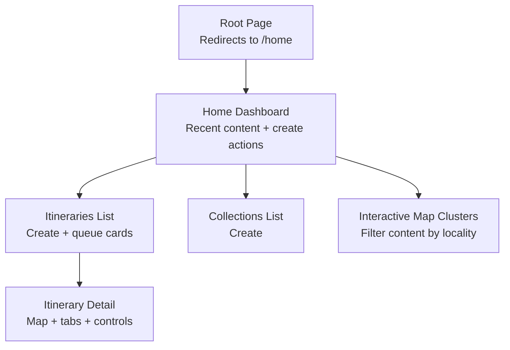
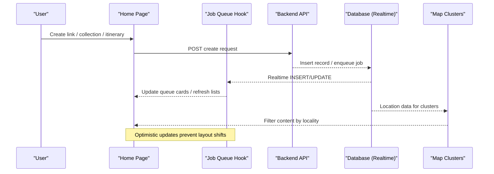
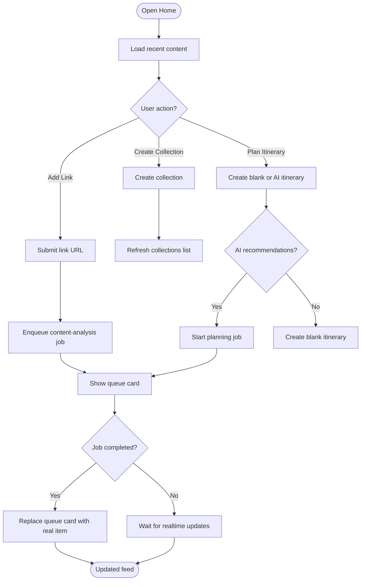
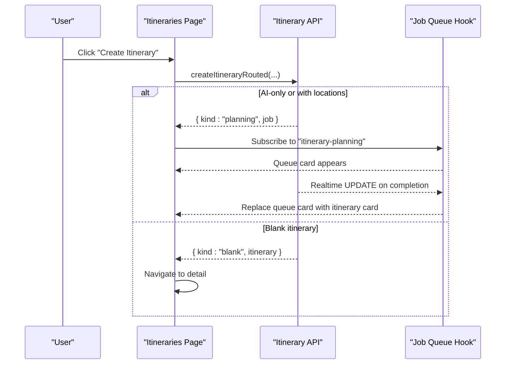
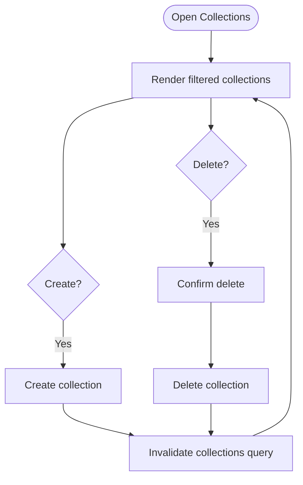
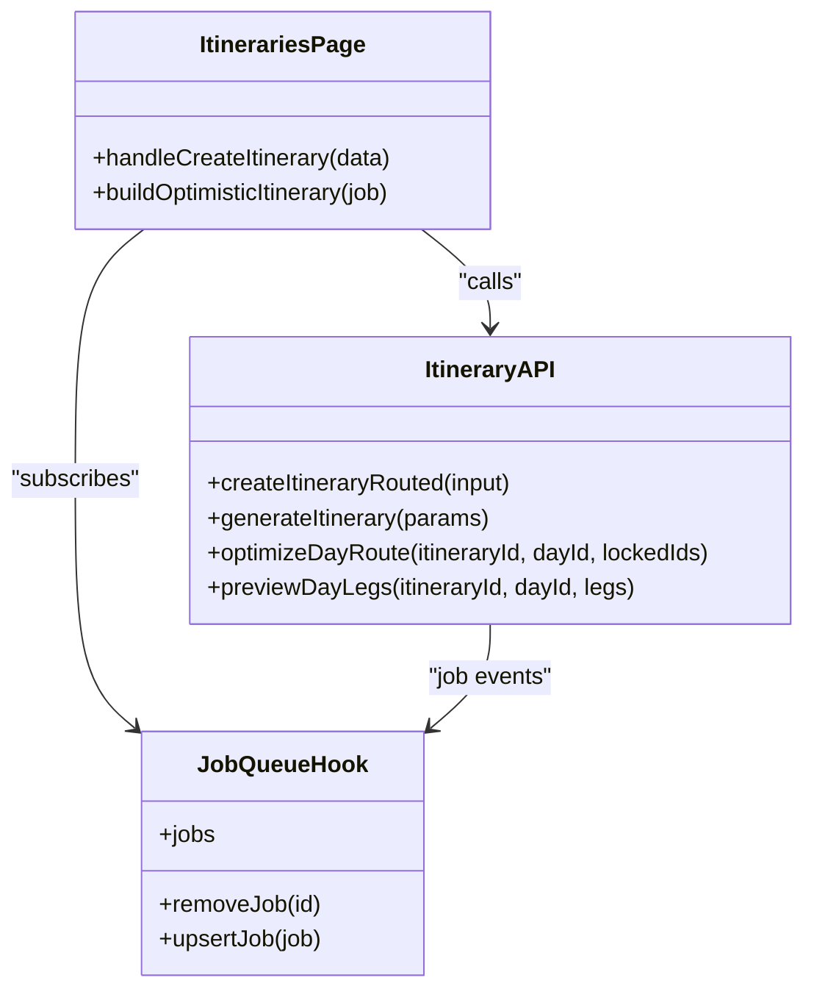
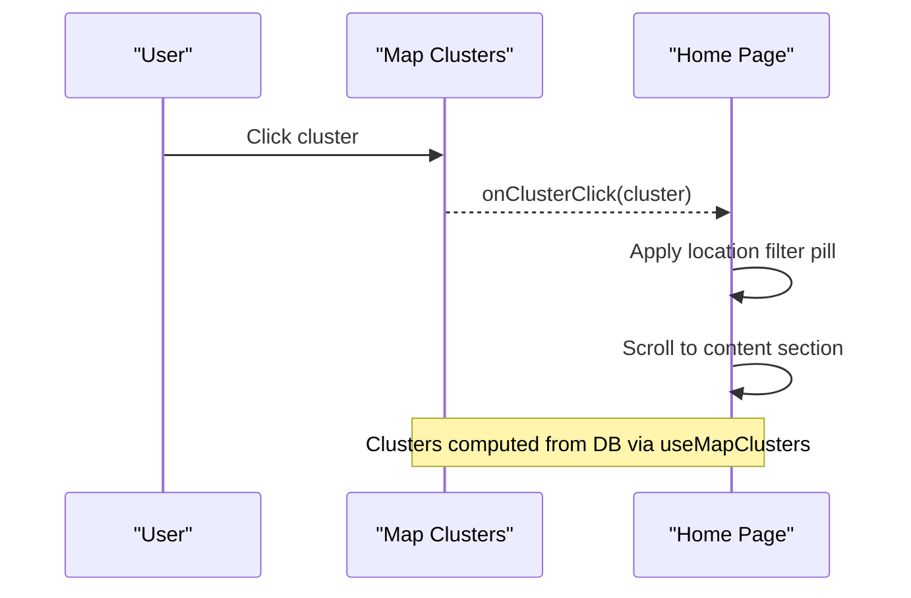
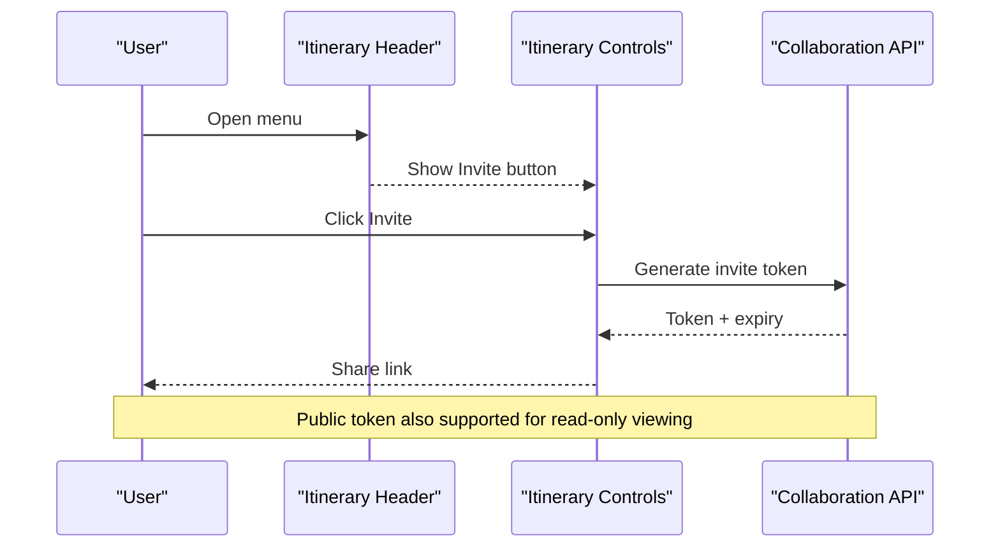
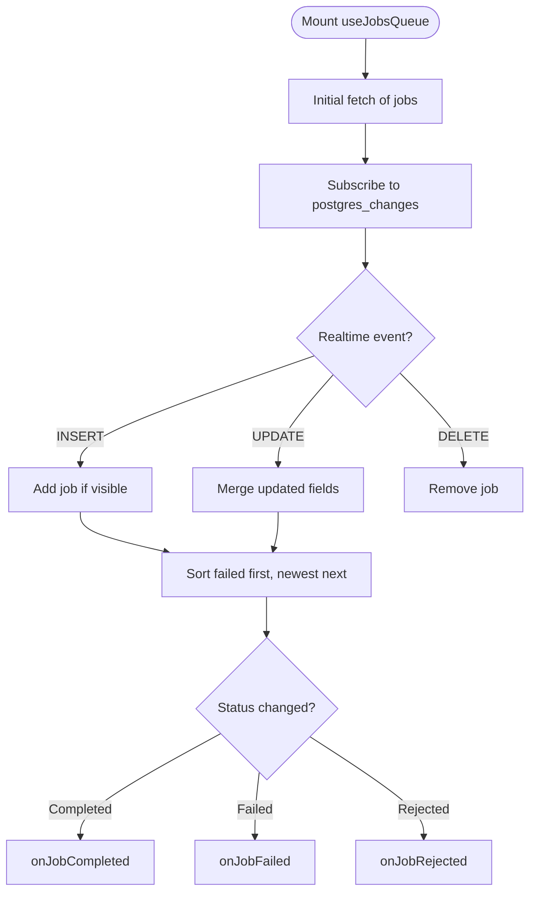
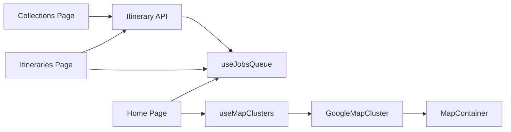

# Core Features

<cite>
**Referenced Files in This Document**
- [page.tsx](file://src/app/page.tsx)
- [home/page.tsx](file://src/app/home/page.tsx)
- [itineraries/page.tsx](file://src/app/itineraries/page.tsx)
- [collections/page.tsx](file://src/app/collections/page.tsx)
- [package.json](file://package.json)
- [useJobsQueue.ts](file://src/hooks/useJobsQueue.ts)
- [itineraries.ts](file://src/lib/api/itineraries.ts)
- [ItineraryPageHeader.tsx](file://src/components/ui/itinerary/ItineraryPageHeader.tsx)
- [ItineraryControls.tsx](file://src/components/ui/itinerary/ItineraryControls.tsx)
- [NewItineraryModal.tsx](file://src/components/ui/modals/NewItineraryModal.tsx)
- [GoogleMapCluster.tsx](file://src/components/ui/map/GoogleMapCluster.tsx)
- [MapContainer.tsx](file://src/components/ui/map/MapContainer.tsx)
- [ItineraryMapSection.tsx](file://src/components/ui/itinerary/ItineraryMapSection.tsx)
- [useMapClusters.ts](file://src/hooks/useMapClusters.ts)
</cite>

## Table of Contents
1. [Introduction](#introduction)
2. [Project Structure](#project-structure)
3. [Core Components](#core-components)
4. [Architecture Overview](#architecture-overview)
5. [Detailed Component Analysis](#detailed-component-analysis)
6. [Dependency Analysis](#dependency-analysis)
7. [Performance Considerations](#performance-considerations)
8. [Troubleshooting Guide](#troubleshooting-guide)
9. [Conclusion](#conclusion)

## Introduction
This document explains Argo’s core features end-to-end: the dashboard and home page, content management for discovered locations, AI-powered itinerary generation with schedule optimization, interactive map integration with location clustering, collaboration features for shared planning, and the job queue system that powers background processing. It covers user workflows, technical implementation details, component interactions, data flows, and how features integrate to deliver a seamless journey from content discovery to final itinerary sharing.

## Project Structure
Argo is a Next.js application organized by feature-based routes under src/app and reusable UI components under src/components/ui. Key entry points include:
- Root redirect to Home
- Home (dashboard) for recent content, creation actions, and live job status
- Itineraries listing and creation
- Collections listing and creation
- Map and itinerary detail views via dynamic imports

**Diagram sources**
- [page.tsx:1-6](file://src/app/page.tsx#L1-L6)
- [home/page.tsx:1-120](file://src/app/home/page.tsx#L1-L120)
- [itineraries/page.tsx:1-120](file://src/app/itineraries/page.tsx#L1-L120)
- [collections/page.tsx:1-60](file://src/app/collections/page.tsx#L1-L60)

**Section sources**
- [page.tsx:1-6](file://src/app/page.tsx#L1-L6)
- [package.json:1-45](file://package.json#L1-L45)

## Core Components
- Home Dashboard: Displays recent links, collections, itineraries; supports creating new items; integrates with job queues for async tasks; provides map-driven filtering by locality.
- Itineraries Listing: Shows existing itineraries, creates new ones (blank or AI-generated), and surfaces in-flight planning jobs as queue cards.
- Collections Listing: Lists and creates collections used to organize discovered locations.
- Job Queue Hook: Subscribes to realtime job updates, reconciles missed updates, and exposes optimistic upsert/remove helpers.
- API Layer: Itinerary CRUD, route optimization, activity management, public tokens, collaborators, and routing logic for different creation paths.
- Map Integration: Clustered markers for content discovery and detailed maps for itinerary editing/viewing.

**Section sources**
- [home/page.tsx:120-560](file://src/app/home/page.tsx#L120-L560)
- [itineraries/page.tsx:74-272](file://src/app/itineraries/page.tsx#L74-L272)
- [collections/page.tsx:24-112](file://src/app/collections/page.tsx#L24-L112)
- [useJobsQueue.ts:45-295](file://src/hooks/useJobsQueue.ts#L45-L295)
- [itineraries.ts:54-439](file://src/lib/api/itineraries.ts#L54-L439)
- [GoogleMapCluster.tsx:13-181](file://src/components/ui/map/GoogleMapCluster.tsx#L13-L181)
- [MapContainer.tsx:10-99](file://src/components/ui/map/MapContainer.tsx#L10-L99)

## Architecture Overview
The system combines client-side React state, server APIs, and realtime database subscriptions to provide responsive experiences:
- User actions trigger API calls (create link, collection, itinerary).
- Long-running tasks are queued as jobs; the frontend subscribes to changes and renders progress.
- Completed jobs update lists optimistically and then reconcile with canonical data.
- Maps render clusters for discovery and detailed polylines/routes for itineraries.

**Diagram sources**
- [home/page.tsx:172-240](file://src/app/home/page.tsx#L172-L240)
- [useJobsQueue.ts:138-260](file://src/hooks/useJobsQueue.ts#L138-L260)
- [itineraries.ts:406-439](file://src/lib/api/itineraries.ts#L406-L439)
- [useMapClusters.ts:35-61](file://src/hooks/useMapClusters.ts#L35-L61)

## Detailed Component Analysis

### Home Dashboard and Content Management
- Recent content grid shows links, collections, and itineraries with type-specific cards.
- Creation actions open modals to add links, create collections, or plan itineraries.
- Link analysis and itinerary planning run asynchronously; queue cards appear at the top and hand off to real cards upon completion.
- Map clusters allow filtering content by locality; clicking a cluster applies a filter pill and scrolls to the content section.

**Diagram sources**
- [home/page.tsx:172-240](file://src/app/home/page.tsx#L172-L240)
- [home/page.tsx:417-551](file://src/app/home/page.tsx#L417-L551)
- [useJobsQueue.ts:138-260](file://src/hooks/useJobsQueue.ts#L138-L260)

**Section sources**
- [home/page.tsx:120-680](file://src/app/home/page.tsx#L120-L680)

### Itineraries Listing and Creation
- The itineraries page lists all active itineraries and always shows a “Create” card first.
- In-flight planning jobs render as queue cards before being replaced by real itinerary cards.
- Quota checks gate creation; errors surface via toasts and usage cards.
- Hovering an itinerary prefetches its detail to speed navigation.

**Diagram sources**
- [itineraries/page.tsx:74-272](file://src/app/itineraries/page.tsx#L74-L272)
- [itineraries.ts:406-439](file://src/lib/api/itineraries.ts#L406-L439)
- [useJobsQueue.ts:138-260](file://src/hooks/useJobsQueue.ts#L138-L260)

**Section sources**
- [itineraries/page.tsx:74-399](file://src/app/itineraries/page.tsx#L74-L399)
- [itineraries.ts:54-120](file://src/lib/api/itineraries.ts#L54-L120)

### Collections Listing and Organization
- Collections list displays non-archived items sorted by recency.
- Creating a collection triggers a refresh and optional toast feedback.
- Deletions are confirmed via modal and invalidate queries to keep UI consistent.

**Diagram sources**
- [collections/page.tsx:24-112](file://src/app/collections/page.tsx#L24-L112)

**Section sources**
- [collections/page.tsx:24-248](file://src/app/collections/page.tsx#L24-L248)

### AI-Powered Itinerary Generation and Schedule Optimization
- Creation routes decide between blank itineraries and async planning based on AI toggle and selected locations.
- Planning jobs run server-side; the frontend listens for progress and completion via the job queue hook.
- Route optimization endpoints compute travel legs and reorder activities to minimize overlap and improve flow.

**Diagram sources**
- [itineraries.ts:54-439](file://src/lib/api/itineraries.ts#L54-L439)
- [useJobsQueue.ts:45-295](file://src/hooks/useJobsQueue.ts#L45-L295)
- [itineraries/page.tsx:74-272](file://src/app/itineraries/page.tsx#L74-L272)

**Section sources**
- [itineraries.ts:54-439](file://src/lib/api/itineraries.ts#L54-L439)
- [useJobsQueue.ts:45-295](file://src/hooks/useJobsQueue.ts#L45-L295)
- [itineraries/page.tsx:74-272](file://src/app/itineraries/page.tsx#L74-L272)

### Interactive Map Integration with Location Clustering
- Clustered markers aggregate nearby locations across dashboards, collections, content, and itineraries.
- Clicking a cluster filters content by locality and scrolls to the relevant section.
- Itinerary detail maps render locations and polylines representing travel routes, with lazy loading for performance.

**Diagram sources**
- [home/page.tsx:294-303](file://src/app/home/page.tsx#L294-L303)
- [useMapClusters.ts:35-61](file://src/hooks/useMapClusters.ts#L35-L61)
- [GoogleMapCluster.tsx:13-181](file://src/components/ui/map/GoogleMapCluster.tsx#L13-L181)

**Section sources**
- [GoogleMapCluster.tsx:13-181](file://src/components/ui/map/GoogleMapCluster.tsx#L13-L181)
- [MapContainer.tsx:10-99](file://src/components/ui/map/MapContainer.tsx#L10-L99)
- [ItineraryMapSection.tsx:1-54](file://src/components/ui/itinerary/ItineraryMapSection.tsx#L1-L54)
- [useMapClusters.ts:35-61](file://src/hooks/useMapClusters.ts#L35-L61)

### Collaboration Features for Shared Planning
- Itinerary headers expose collaborator avatars, invite button, and view/edit mode toggles.
- Public and invite tokens enable sharing and joining itineraries without full authentication.
- Collaborators can be listed and removed via API endpoints.

**Diagram sources**
- [ItineraryPageHeader.tsx:50-137](file://src/components/ui/itinerary/ItineraryPageHeader.tsx#L50-L137)
- [ItineraryControls.tsx:47-166](file://src/components/ui/itinerary/ItineraryControls.tsx#L47-L166)
- [itineraries.ts:448-487](file://src/lib/api/itineraries.ts#L448-L487)

**Section sources**
- [ItineraryPageHeader.tsx:50-137](file://src/components/ui/itinerary/ItineraryPageHeader.tsx#L50-L137)
- [ItineraryControls.tsx:47-166](file://src/components/ui/itinerary/ItineraryControls.tsx#L47-L166)
- [itineraries.ts:448-487](file://src/lib/api/itineraries.ts#L448-L487)

### Job Queue System for Background Processing
- The hook subscribes to realtime job updates, reconciles missed transitions when visibility changes, and sorts failed jobs to the front.
- Pages subscribe to specific job types (e.g., content-analysis, itinerary-planning) and handle completion/failure/rejection callbacks.
- Optimistic upsert/remove ensures immediate UI responsiveness while waiting for realtime updates.

**Diagram sources**
- [useJobsQueue.ts:78-260](file://src/hooks/useJobsQueue.ts#L78-L260)
- [useJobsQueue.ts:269-295](file://src/hooks/useJobsQueue.ts#L269-L295)

**Section sources**
- [useJobsQueue.ts:45-295](file://src/hooks/useJobsQueue.ts#L45-L295)

## Dependency Analysis
Key dependencies and relationships:
- Next.js app routes depend on UI components and hooks for state and data fetching.
- Itinerary creation depends on API routing logic to choose blank vs. planning paths.
- Job queue hook depends on Supabase realtime channels and reconciliation logic.
- Map clusters depend on locality pin builders and source-specific queries.

**Diagram sources**
- [home/page.tsx:172-240](file://src/app/home/page.tsx#L172-L240)
- [itineraries/page.tsx:74-272](file://src/app/itineraries/page.tsx#L74-L272)
- [collections/page.tsx:24-112](file://src/app/collections/page.tsx#L24-L112)
- [useJobsQueue.ts:138-260](file://src/hooks/useJobsQueue.ts#L138-L260)
- [useMapClusters.ts:35-61](file://src/hooks/useMapClusters.ts#L35-L61)
- [GoogleMapCluster.tsx:13-181](file://src/components/ui/map/GoogleMapCluster.tsx#L13-L181)
- [MapContainer.tsx:10-99](file://src/components/ui/map/MapContainer.tsx#L10-L99)

**Section sources**
- [home/page.tsx:172-240](file://src/app/home/page.tsx#L172-L240)
- [itineraries/page.tsx:74-272](file://src/app/itineraries/page.tsx#L74-L272)
- [collections/page.tsx:24-112](file://src/app/collections/page.tsx#L24-L112)
- [useJobsQueue.ts:138-260](file://src/hooks/useJobsQueue.ts#L138-L260)
- [useMapClusters.ts:35-61](file://src/hooks/useMapClusters.ts#L35-L61)
- [GoogleMapCluster.tsx:13-181](file://src/components/ui/map/GoogleMapCluster.tsx#L13-L181)
- [MapContainer.tsx:10-99](file://src/components/ui/map/MapContainer.tsx#L10-L99)

## Performance Considerations
- Lazy-loading maps reduces initial bundle size and improves perceived performance.
- Optimistic updates prevent layout shifts during async operations.
- Query caching and prefetching reduce network requests on hover/navigation.
- Reconciliation handles missed realtime updates to avoid stale states.

[No sources needed since this section provides general guidance]

## Troubleshooting Guide
Common issues and resolutions:
- Stuck queue cards: Visibility change triggers reconciliation; ensure channel subscription succeeds and no connection errors persist.
- Duplicate toasts: Global notifier owns certain notifications; avoid duplicating handlers in multiple places.
- Quota limits: Usage cards and quota gates inform users when limits are reached; guide to billing or deletion.

**Section sources**
- [useJobsQueue.ts:250-260](file://src/hooks/useJobsQueue.ts#L250-L260)
- [home/page.tsx:192-240](file://src/app/home/page.tsx#L192-L240)
- [itineraries/page.tsx:191-247](file://src/app/itineraries/page.tsx#L191-L247)

## Conclusion
Argo integrates a responsive dashboard, robust content management, AI-driven itinerary planning, interactive mapping, collaboration tools, and a resilient job queue system. Together, these features enable users to discover locations, organize them into collections, generate optimized itineraries, collaborate with others, and share plans seamlessly. The architecture emphasizes optimistic UI, realtime synchronization, and clear error handling to deliver a smooth user experience from start to finish.