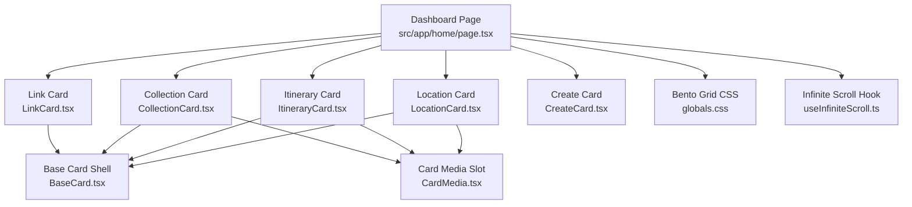
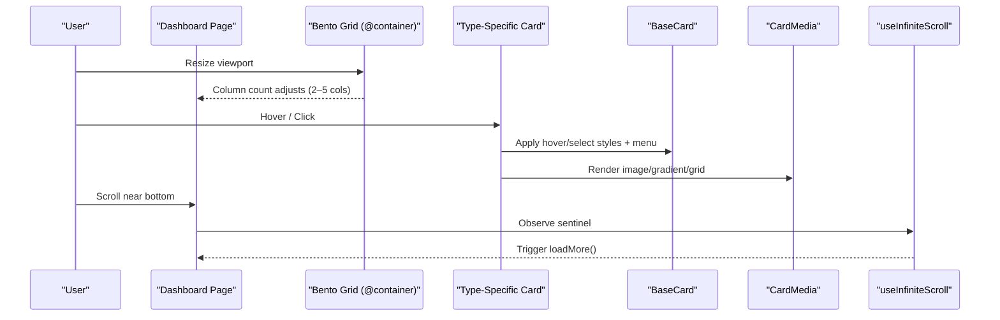
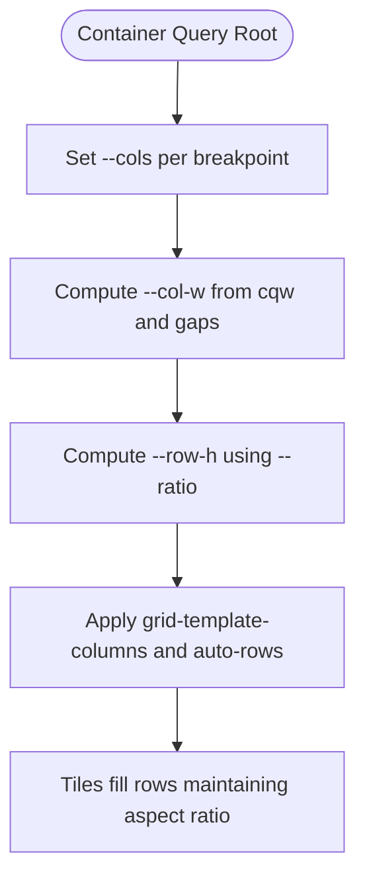
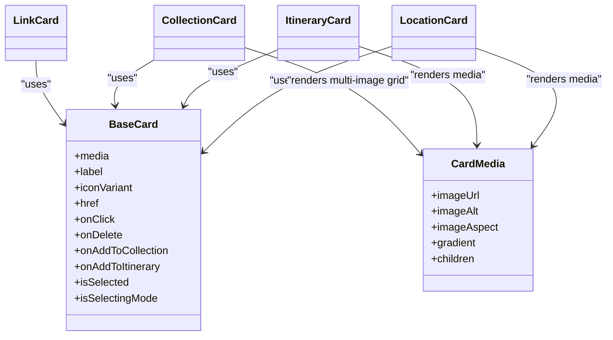
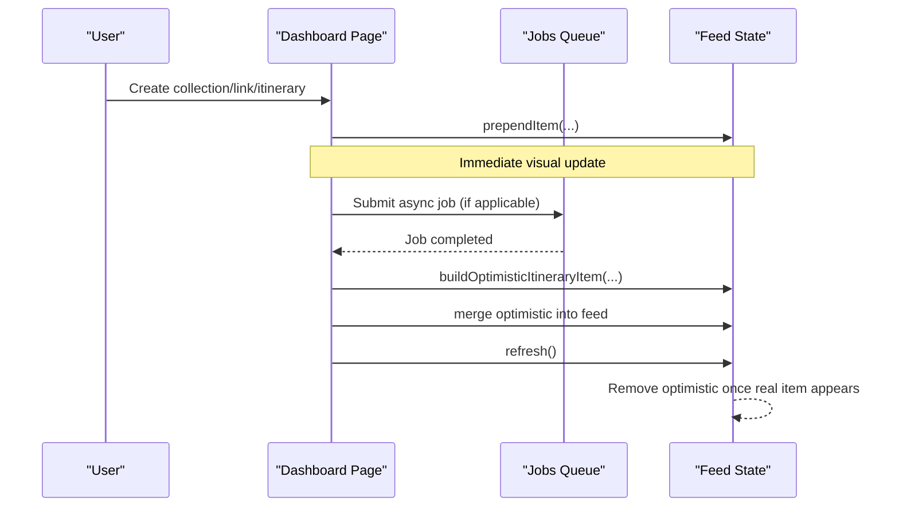
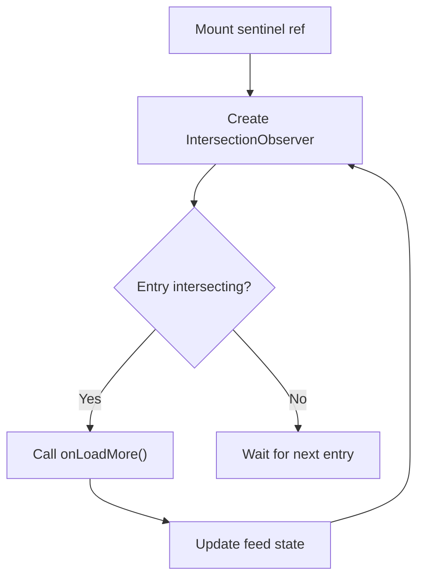
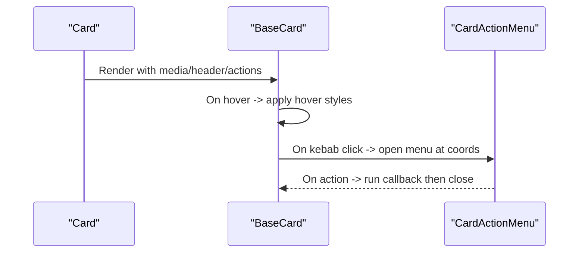
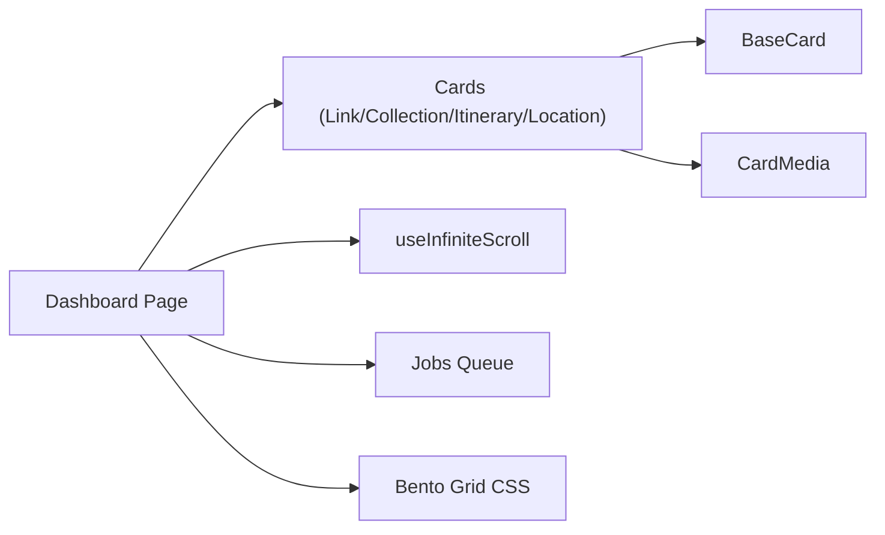

# Content Grid & Bento Layout

<cite>
**Referenced Files in This Document**
- [home/page.tsx](file://src/app/home/page.tsx)
- [BaseCard.tsx](file://src/components/ui/cards/BaseCard.tsx)
- [CardMedia.tsx](file://src/components/ui/cards/CardMedia.tsx)
- [CollectionCard.tsx](file://src/components/ui/cards/CollectionCard.tsx)
- [ItineraryCard.tsx](file://src/components/ui/cards/ItineraryCard.tsx)
- [LinkCard.tsx](file://src/components/ui/cards/LinkCard.tsx)
- [LocationCard.tsx](file://src/components/ui/cards/LocationCard.tsx)
- [CreateCard.tsx](file://src/components/ui/dashboard/CreateCard.tsx)
- [useInfiniteScroll.ts](file://src/hooks/useInfiniteScroll.ts)
- [useIntersectionObserver.ts](file://src/hooks/useIntersectionObserver.ts)
- [globals.css](file://src/app/globals.css)
</cite>

## Table of Contents
1. [Introduction](#introduction)
2. [Project Structure](#project-structure)
3. [Core Components](#core-components)
4. [Architecture Overview](#architecture-overview)
5. [Detailed Component Analysis](#detailed-component-analysis)
6. [Dependency Analysis](#dependency-analysis)
7. [Performance Considerations](#performance-considerations)
8. [Troubleshooting Guide](#troubleshooting-guide)
9. [Conclusion](#conclusion)

## Introduction
This document explains the dashboard’s content grid system built with a bento layout pattern and CSS container queries. It covers how responsive card grids adapt from 2 to 5 columns, how different content types (links, collections, itineraries, locations) are rendered with appropriate visuals and gradients, optimistic UI updates when new items are created, and infinite scroll powered by intersection observers. It also includes examples of card composition patterns, hover interactions, and responsive behavior across devices.

## Project Structure
The dashboard page composes a bento grid that mixes create cards, a map tile, an “Latest Viewed” slot, in-flight itinerary queue cards, and a feed of content cards. The grid is ratio-locked so tiles keep a consistent aspect ratio regardless of screen size. Cards share a common base shell and media slot for consistent styling and interaction.

**Diagram sources**
- [home/page.tsx:795-916](file://src/app/home/page.tsx#L795-L916)
- [BaseCard.tsx:13-203](file://src/components/ui/cards/BaseCard.tsx#L13-L203)
- [CardMedia.tsx:7-62](file://src/components/ui/cards/CardMedia.tsx#L7-L62)
- [CollectionCard.tsx:10-115](file://src/components/ui/cards/CollectionCard.tsx#L10-L115)
- [ItineraryCard.tsx:8-55](file://src/components/ui/cards/ItineraryCard.tsx#L8-L55)
- [LinkCard.tsx:8-79](file://src/components/ui/cards/LinkCard.tsx#L8-L79)
- [LocationCard.tsx:8-55](file://src/components/ui/cards/LocationCard.tsx#L8-L55)
- [CreateCard.tsx:15-99](file://src/components/ui/dashboard/CreateCard.tsx#L15-L99)
- [globals.css:1080-1102](file://src/app/globals.css#L1080-L1102)
- [useInfiniteScroll.ts:17-76](file://src/hooks/useInfiniteScroll.ts#L17-L76)

**Section sources**
- [home/page.tsx:795-916](file://src/app/home/page.tsx#L795-L916)
- [globals.css:1080-1102](file://src/app/globals.css#L1080-L1102)

## Core Components
- BaseCard: Shared card shell providing header, media area, selection state, hover effects, and action menu integration.
- CardMedia: Centralized media slot handling images, gradients, placeholders, and custom children (e.g., multi-image grids).
- Type-specific cards: LinkCard, CollectionCard, ItineraryCard, LocationCard compose BaseCard and CardMedia with type-appropriate visuals.
- CreateCard: Promotional card for creating links, collections, or itineraries; used both on mobile carousel and desktop bento slots.
- Dashboard page: Orchestrates grid layout, filters, optimistic updates, and infinite scroll.

**Section sources**
- [BaseCard.tsx:20-203](file://src/components/ui/cards/BaseCard.tsx#L20-L203)
- [CardMedia.tsx:7-62](file://src/components/ui/cards/CardMedia.tsx#L7-L62)
- [LinkCard.tsx:8-79](file://src/components/ui/cards/LinkCard.tsx#L8-L79)
- [CollectionCard.tsx:10-115](file://src/components/ui/cards/CollectionCard.tsx#L10-L115)
- [ItineraryCard.tsx:8-55](file://src/components/ui/cards/ItineraryCard.tsx#L8-L55)
- [LocationCard.tsx:8-55](file://src/components/ui/cards/LocationCard.tsx#L8-L55)
- [CreateCard.tsx:15-99](file://src/components/ui/dashboard/CreateCard.tsx#L15-L99)
- [home/page.tsx:795-916](file://src/app/home/page.tsx#L795-L916)

## Architecture Overview
The dashboard uses a container-query-driven bento grid where column count changes at breakpoints while preserving tile aspect ratios. Cards render via a shared base and media layer, enabling consistent hover states, selection, and actions. Optimistic UI ensures immediate feedback during creation and job completion, while infinite scroll loads more content as the user scrolls.

**Diagram sources**
- [home/page.tsx:795-916](file://src/app/home/page.tsx#L795-L916)
- [BaseCard.tsx:111-147](file://src/components/ui/cards/BaseCard.tsx#L111-L147)
- [CardMedia.tsx:30-62](file://src/components/ui/cards/CardMedia.tsx#L30-L62)
- [useInfiniteScroll.ts:29-76](file://src/hooks/useInfiniteScroll.ts#L29-L76)
- [globals.css:1080-1102](file://src/app/globals.css#L1080-L1102)

## Detailed Component Analysis

### Bento Grid and Responsive Columns
- Container queries: The grid wrapper uses `@container` so child elements can read `100cqw`.
- Ratio-locked tiles: CSS variables compute column width and row height to preserve a fixed aspect ratio.
- Breakpoint-driven columns: Utilities override `--cols` at sm/md/lg/xl to switch between 2–5 columns.

**Diagram sources**
- [globals.css:1080-1102](file://src/app/globals.css#L1080-L1102)
- [home/page.tsx:795-801](file://src/app/home/page.tsx#L795-L801)

**Section sources**
- [globals.css:1080-1102](file://src/app/globals.css#L1080-L1102)
- [home/page.tsx:795-801](file://src/app/home/page.tsx#L795-L801)

### Card Rendering Logic and Visual Treatments
- BaseCard provides consistent structure: media area, header with category badge, label, and optional kebab menu.
- CardMedia handles precedence: custom children > image > gradient > placeholder.
- Type-specific cards:
  - LinkCard: phone-frame thumbnail with optional gradient fallback; subtle tilt on hover/selection.
  - CollectionCard: multi-image grid (up to 4 tiles) or single image/Unsplash fallback; supports gradient.
  - ItineraryCard and LocationCard: standard image/gradient/placeholder via CardMedia.
- Gradients: Per-type gradients applied in the dashboard page to provide visual identity when no image exists.

**Diagram sources**
- [BaseCard.tsx:20-203](file://src/components/ui/cards/BaseCard.tsx#L20-L203)
- [CardMedia.tsx:7-62](file://src/components/ui/cards/CardMedia.tsx#L7-L62)
- [LinkCard.tsx:8-79](file://src/components/ui/cards/LinkCard.tsx#L8-L79)
- [CollectionCard.tsx:10-115](file://src/components/ui/cards/CollectionCard.tsx#L10-L115)
- [ItineraryCard.tsx:8-55](file://src/components/ui/cards/ItineraryCard.tsx#L8-L55)
- [LocationCard.tsx:8-55](file://src/components/ui/cards/LocationCard.tsx#L8-L55)

**Section sources**
- [BaseCard.tsx:111-147](file://src/components/ui/cards/BaseCard.tsx#L111-L147)
- [CardMedia.tsx:30-62](file://src/components/ui/cards/CardMedia.tsx#L30-L62)
- [LinkCard.tsx:29-71](file://src/components/ui/cards/LinkCard.tsx#L29-L71)
- [CollectionCard.tsx:79-107](file://src/components/ui/cards/CollectionCard.tsx#L79-L107)
- [ItineraryCard.tsx:30-48](file://src/components/ui/cards/ItineraryCard.tsx#L30-L48)
- [LocationCard.tsx:30-48](file://src/components/ui/cards/LocationCard.tsx#L30-L48)
- [home/page.tsx:116-121](file://src/app/home/page.tsx#L116-L121)

### Optimistic UI Updates for New Items
- Creation flows prepend new items immediately to the feed without waiting for server round-trips.
- For async itinerary planning jobs, an optimistic item is synthesized from job results to avoid flicker until refresh completes.
- A dedicated effect merges real items with optimistic ones and removes optimistic entries once they appear in the refreshed list.

**Diagram sources**
- [home/page.tsx:178-190](file://src/app/home/page.tsx#L178-L190)
- [home/page.tsx:219-254](file://src/app/home/page.tsx#L219-L254)
- [home/page.tsx:458-551](file://src/app/home/page.tsx#L458-L551)
- [home/page.tsx:92-114](file://src/app/home/page.tsx#L92-L114)

**Section sources**
- [home/page.tsx:92-114](file://src/app/home/page.tsx#L92-L114)
- [home/page.tsx:178-190](file://src/app/home/page.tsx#L178-L190)
- [home/page.tsx:219-254](file://src/app/home/page.tsx#L219-L254)
- [home/page.tsx:458-551](file://src/app/home/page.tsx#L458-L551)

### Infinite Scroll Implementation
- useInfiniteScroll attaches an IntersectionObserver to a sentinel element at the bottom of the list.
- It finds the nearest scrollable ancestor to ensure correct rootMargin behavior inside custom containers.
- The dashboard enables loading only when there are more pages and not currently loading.

**Diagram sources**
- [useInfiniteScroll.ts:17-76](file://src/hooks/useInfiniteScroll.ts#L17-L76)
- [home/page.tsx:281-283](file://src/app/home/page.tsx#L281-L283)
- [home/page.tsx:940-946](file://src/app/home/page.tsx#L940-L946)

**Section sources**
- [useInfiniteScroll.ts:17-76](file://src/hooks/useInfiniteScroll.ts#L17-L76)
- [home/page.tsx:281-283](file://src/app/home/page.tsx#L281-L283)
- [home/page.tsx:940-946](file://src/app/home/page.tsx#L940-L946)

### Card Composition Patterns and Interactions
- Composition: Each card composes BaseCard and CardMedia, passing type-specific props like imageUrl, gradient, and imageAspect.
- Hover interactions: BaseCard applies hover background/border transitions; LinkCard adds a subtle rotation on hover/selection.
- Selection mode: BaseCard highlights selected cards with a brand border and alternate surface.
- Action menu: Kebab button opens a context menu anchored to the button or cursor position; actions close the menu before execution.

**Diagram sources**
- [BaseCard.tsx:85-109](file://src/components/ui/cards/BaseCard.tsx#L85-L109)
- [BaseCard.tsx:111-147](file://src/components/ui/cards/BaseCard.tsx#L111-L147)
- [LinkCard.tsx:31-58](file://src/components/ui/cards/LinkCard.tsx#L31-L58)

**Section sources**
- [BaseCard.tsx:111-147](file://src/components/ui/cards/BaseCard.tsx#L111-L147)
- [LinkCard.tsx:31-58](file://src/components/ui/cards/LinkCard.tsx#L31-L58)

### Responsive Behavior Across Devices
- Mobile: Horizontal carousel for create actions; content filter chips to narrow by type.
- Desktop: Fixed bento slots for create cards and map tile; latest viewed occupies a prominent tile; feed fills remaining space.
- Breakpoints: Column count increases from 2 to 5 as viewport grows, keeping tile aspect ratio constant.

**Section sources**
- [home/page.tsx:713-793](file://src/app/home/page.tsx#L713-L793)
- [home/page.tsx:802-829](file://src/app/home/page.tsx#L802-L829)
- [home/page.tsx:795-801](file://src/app/home/page.tsx#L795-L801)

## Dependency Analysis
- The dashboard page depends on:
  - Card components for rendering content.
  - Infinite scroll hook for pagination.
  - Jobs queue for asynchronous processing and optimistic updates.
  - Map clusters for location-based filtering.
- Cards depend on BaseCard and CardMedia for consistent UI and behavior.
- Global CSS defines the bento grid rules and theme tokens.

**Diagram sources**
- [home/page.tsx:795-916](file://src/app/home/page.tsx#L795-L916)
- [BaseCard.tsx:20-203](file://src/components/ui/cards/BaseCard.tsx#L20-L203)
- [CardMedia.tsx:7-62](file://src/components/ui/cards/CardMedia.tsx#L7-L62)
- [useInfiniteScroll.ts:17-76](file://src/hooks/useInfiniteScroll.ts#L17-L76)
- [globals.css:1080-1102](file://src/app/globals.css#L1080-L1102)

**Section sources**
- [home/page.tsx:795-916](file://src/app/home/page.tsx#L795-L916)
- [globals.css:1080-1102](file://src/app/globals.css#L1080-L1102)

## Performance Considerations
- Ratio-locked tiles reduce layout thrashing by computing dimensions from container width and a fixed ratio.
- IntersectionObserver-based infinite scroll avoids polling and efficiently triggers loading only when needed.
- Optimistic updates minimize perceived latency by updating UI immediately and reconciling with server data later.
- CardMedia centralizes image error handling and fallbacks to prevent reflows due to missing assets.

[No sources needed since this section provides general guidance]

## Troubleshooting Guide
- Infinite scroll not triggering:
  - Ensure the sentinel is placed inside the same scroll container observed by the hook.
  - Verify enabled flag is true and isLoadingMore is false.
- Optimistic items not disappearing:
  - Confirm the refresh logic runs after job completion and that optimistic IDs match real item IDs.
- Card visuals incorrect:
  - Check precedence in CardMedia: children > image > gradient > placeholder.
  - Validate type-specific props (imageUrl, gradient, imageAspect) passed to each card.

**Section sources**
- [useInfiniteScroll.ts:29-76](file://src/hooks/useInfiniteScroll.ts#L29-L76)
- [home/page.tsx:219-254](file://src/app/home/page.tsx#L219-L254)
- [CardMedia.tsx:30-62](file://src/components/ui/cards/CardMedia.tsx#L30-L62)

## Conclusion
The dashboard’s bento grid leverages container queries and CSS variables to deliver a responsive, ratio-locked card layout that adapts from 2 to 5 columns. A shared BaseCard and CardMedia layer ensure consistent interactions and visuals across content types. Optimistic UI updates and intersection observer-based infinite scroll provide a smooth, performant experience as users create and browse content.

[No sources needed since this section summarizes without analyzing specific files]