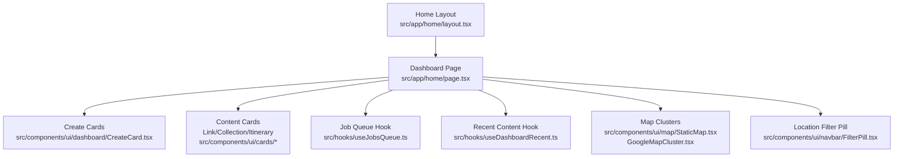
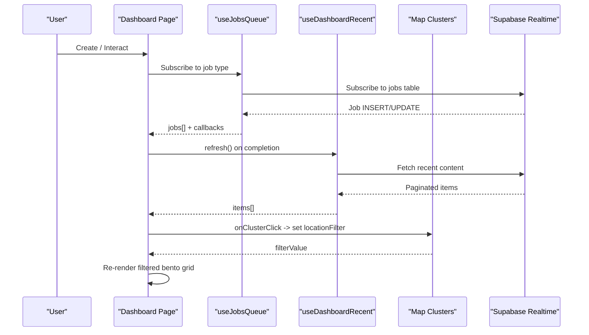
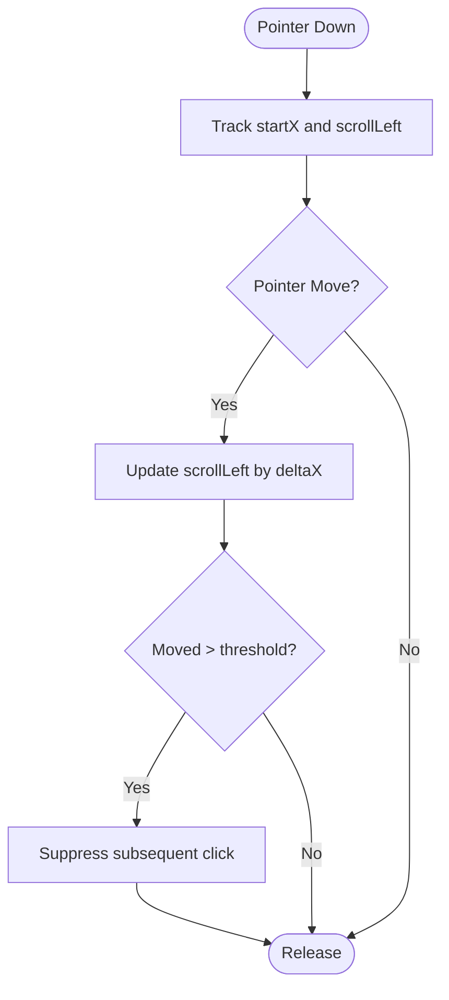
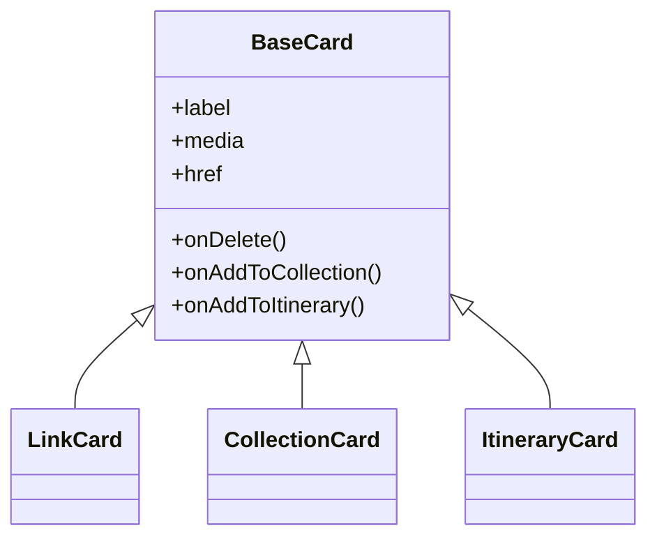
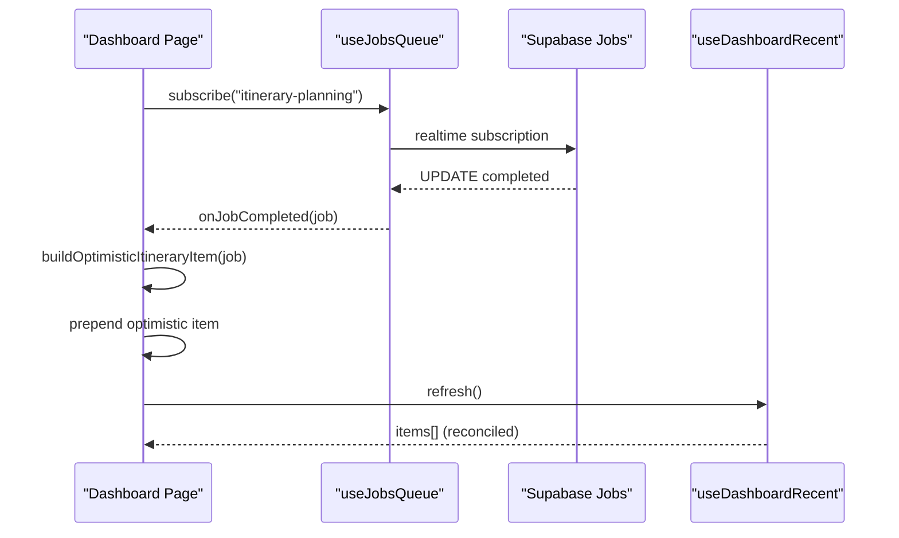
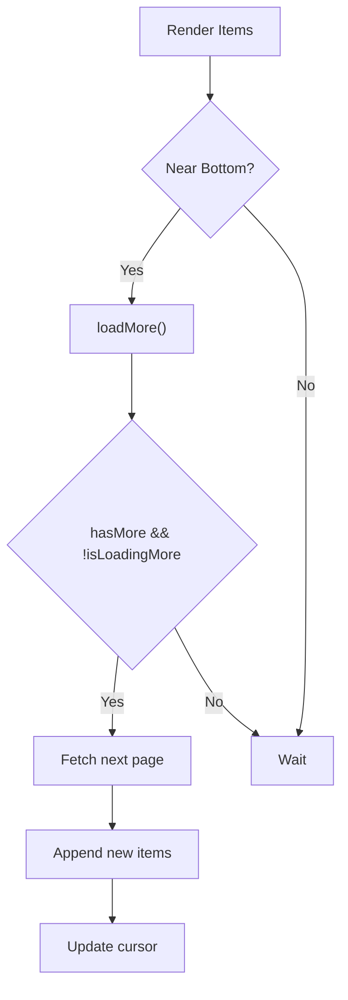
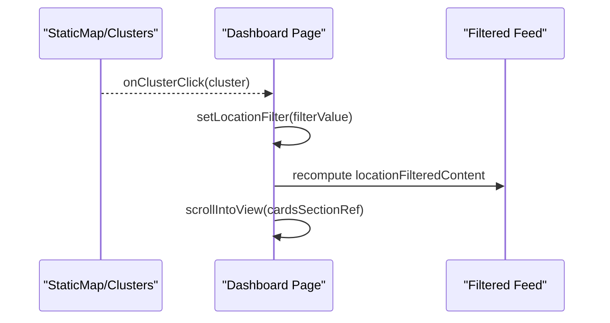
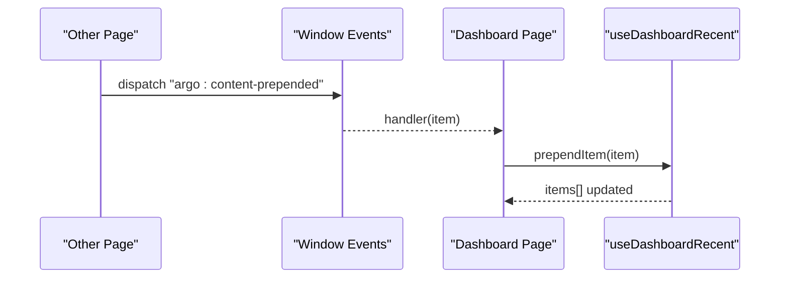
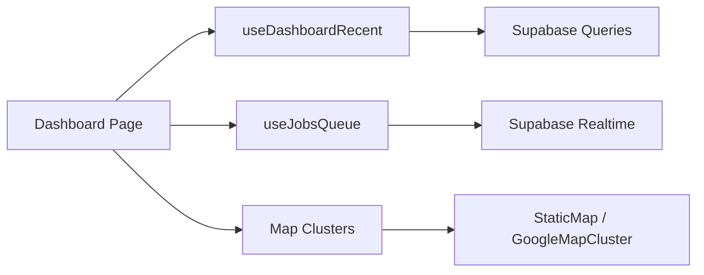

# Dashboard & Home Page

<cite>
**Referenced Files in This Document**
- [page.tsx](file://src/app/home/page.tsx)
- [layout.tsx](file://src/app/home/layout.tsx)
- [CreateCard.tsx](file://src/components/ui/dashboard/CreateCard.tsx)
- [LinkCard.tsx](file://src/components/ui/cards/LinkCard.tsx)
- [CollectionCard.tsx](file://src/components/ui/cards/CollectionCard.tsx)
- [ItineraryCard.tsx](file://src/components/ui/cards/ItineraryCard.tsx)
- [FilterPill.tsx](file://src/components/ui/navbar/FilterPill.tsx)
- [StaticMap.tsx](file://src/components/ui/map/StaticMap.tsx)
- [GoogleMapCluster.tsx](file://src/components/ui/map/GoogleMapCluster.tsx)
- [useDashboardRecent.ts](file://src/hooks/useDashboardRecent.ts)
- [useJobsQueue.ts](file://src/hooks/useJobsQueue.ts)
- [home.ts](file://src/lib/supabase/queries/home.ts)
</cite>

## Table of Contents
1. Introduction
2. Project Structure
3. Core Components
4. Architecture Overview
5. Detailed Component Analysis
6. Dependency Analysis
7. Performance Considerations
8. Troubleshooting Guide
9. Conclusion

## Introduction
This document explains the Argo dashboard and home page functionality with a focus on:
- The welcome section, usage tracking cards, location filter pills, and mobile create carousel
- The bento grid layout that displays recent content items (links, collections, itineraries, locations) with different card types and behaviors
- Job queue integration for in-flight itinerary planning jobs, optimistic UI updates, and real-time content refresh
- Mobile-responsive design patterns including horizontal scrolling create options, content type filters, and touch interactions
- Implementation details of infinite scroll loading, map cluster integration for location filtering, and cross-component event handling for content creation workflows

## Project Structure
The home page is rendered by a client component under the Next.js app router and wrapped by a shared layout. It composes reusable UI primitives, cards, modals, hooks, and map components to deliver a responsive, interactive experience.

**Diagram sources**
- [layout.tsx:1-12](file://src/app/home/layout.tsx#L1-L12)
- [page.tsx:123-800](file://src/app/home/page.tsx#L123-L800)
- [CreateCard.tsx:1-99](file://src/components/ui/dashboard/CreateCard.tsx#L1-L99)
- [LinkCard.tsx:1-79](file://src/components/ui/cards/LinkCard.tsx#L1-L79)
- [CollectionCard.tsx:1-115](file://src/components/ui/cards/CollectionCard.tsx#L1-L115)
- [ItineraryCard.tsx:1-55](file://src/components/ui/cards/ItineraryCard.tsx#L1-L55)
- [useJobsQueue.ts:1-296](file://src/hooks/useJobsQueue.ts#L1-L296)
- [useDashboardRecent.ts:1-132](file://src/hooks/useDashboardRecent.ts#L1-L132)
- [StaticMap.tsx:1-53](file://src/components/ui/map/StaticMap.tsx#L1-L53)
- [GoogleMapCluster.tsx:27-180](file://src/components/ui/map/GoogleMapCluster.tsx#L27-L180)
- [FilterPill.tsx:1-28](file://src/components/ui/navbar/FilterPill.tsx#L1-L28)

**Section sources**
- [layout.tsx:1-12](file://src/app/home/layout.tsx#L1-L12)
- [page.tsx:123-800](file://src/app/home/page.tsx#L123-L800)

## Core Components
- Welcome row and usage tracking: Displays a personalized greeting and a usage card showing link quota status.
- Location filter pill: Shows an active location filter with dismiss action; integrates with map clusters to scope content.
- Mobile create carousel: Horizontal, snap-scrolling carousel with three create actions (link, collection, itinerary), dot indicators, and pointer-based drag support.
- Bento grid: Responsive grid container using CSS custom properties for columns and aspect ratio; renders create cards and recent content tiles.
- Content cards: Type-specific cards (Link, Collection, Itinerary, Location) with consistent base behavior, media slots, and context menu actions.
- Job queue integration: In-flight itinerary planning jobs are shown as queue cards; completion triggers optimistic UI updates and data refresh.
- Infinite scroll: Loads more recent content when the user scrolls near the bottom.
- Map cluster integration: Clicking a cluster sets a location filter and smooth-scrolls to the content area.

**Section sources**
- [page.tsx:123-800](file://src/app/home/page.tsx#L123-L800)
- [CreateCard.tsx:1-99](file://src/components/ui/dashboard/CreateCard.tsx#L1-L99)
- [LinkCard.tsx:1-79](file://src/components/ui/cards/LinkCard.tsx#L1-L79)
- [CollectionCard.tsx:1-115](file://src/components/ui/cards/CollectionCard.tsx#L1-L115)
- [ItineraryCard.tsx:1-55](file://src/components/ui/cards/ItineraryCard.tsx#L1-L55)
- [FilterPill.tsx:1-28](file://src/components/ui/navbar/FilterPill.tsx#L1-L28)
- [StaticMap.tsx:1-53](file://src/components/ui/map/StaticMap.tsx#L1-L53)
- [GoogleMapCluster.tsx:27-180](file://src/components/ui/map/GoogleMapCluster.tsx#L27-L180)
- [useDashboardRecent.ts:1-132](file://src/hooks/useDashboardRecent.ts#L1-L132)
- [useJobsQueue.ts:1-296](file://src/hooks/useJobsQueue.ts#L1-L296)

## Architecture Overview
The dashboard orchestrates several layers:
- UI layer: Home page composes header, mobile carousel, filters, and bento grid with cards.
- Data layer: useDashboardRecent fetches paginated recent content; useJobsQueue subscribes to job changes via realtime.
- Integration layer: Map clusters drive location filtering; cross-component events prepend newly created items into the feed.
- State synchronization: Optimistic updates fill gaps between job completion and data refresh to avoid layout shifts.

**Diagram sources**
- [page.tsx:172-240](file://src/app/home/page.tsx#L172-L240)
- [useJobsQueue.ts:138-267](file://src/hooks/useJobsQueue.ts#L138-L267)
- [useDashboardRecent.ts:59-97](file://src/hooks/useDashboardRecent.ts#L59-L97)
- [StaticMap.tsx:21-53](file://src/components/ui/map/StaticMap.tsx#L21-L53)

## Detailed Component Analysis

### Welcome Section, Usage Card, and Location Filter
- Personalized greeting uses profile data; usage card shows quota metrics and upgrade path.
- Location filter pill appears when a cluster is selected; dismissing clears the filter and restores full feed.

**Section sources**
- [page.tsx:688-711](file://src/app/home/page.tsx#L688-L711)
- [FilterPill.tsx:1-28](file://src/components/ui/navbar/FilterPill.tsx#L1-L28)

### Mobile Create Carousel
- Horizontal, snap-enabled carousel with three slides: Add Link, Create Collection, Plan Itinerary.
- Pointer events implement drag-to-scroll with click suppression after dragging.
- Dot indicators reflect the active slide based on scroll position.

**Diagram sources**
- [page.tsx:305-379](file://src/app/home/page.tsx#L305-L379)

**Section sources**
- [page.tsx:713-763](file://src/app/home/page.tsx#L713-L763)
- [page.tsx:305-379](file://src/app/home/page.tsx#L305-L379)

### Bento Grid and Content Cards
- Grid uses CSS custom properties for columns and aspect ratios to keep tiles proportional across breakpoints.
- Create cards are fixed in place on desktop; mobile uses the carousel instead.
- Recent content items render as type-specific cards:
  - LinkCard: phone-frame thumbnail or gradient fallback
  - CollectionCard: multi-image grid or single image/Unsplash fallback
  - ItineraryCard: media slot with optional gradient
  - LocationCard: supports add-to-collection/itinerary actions

**Diagram sources**
- [LinkCard.tsx:1-79](file://src/components/ui/cards/LinkCard.tsx#L1-L79)
- [CollectionCard.tsx:1-115](file://src/components/ui/cards/CollectionCard.tsx#L1-L115)
- [ItineraryCard.tsx:1-55](file://src/components/ui/cards/ItineraryCard.tsx#L1-L55)

**Section sources**
- [page.tsx:635-679](file://src/app/home/page.tsx#L635-L679)
- [page.tsx:795-811](file://src/app/home/page.tsx#L795-L811)
- [LinkCard.tsx:1-79](file://src/components/ui/cards/LinkCard.tsx#L1-L79)
- [CollectionCard.tsx:1-115](file://src/components/ui/cards/CollectionCard.tsx#L1-L115)
- [ItineraryCard.tsx:1-55](file://src/components/ui/cards/ItineraryCard.tsx#L1-L55)

### Job Queue Integration and Optimistic Updates
- Two job subscriptions:
  - content-analysis: completes link analysis; shows toast and refreshes feed.
  - itinerary-planning: builds an optimistic itinerary item immediately upon completion, then refreshes to reconcile with server data.
- Failed jobs are pinned at the top; users can retry or detach them.

**Diagram sources**
- [page.tsx:192-240](file://src/app/home/page.tsx#L192-L240)
- [page.tsx:98-114](file://src/app/home/page.tsx#L98-L114)
- [useJobsQueue.ts:138-267](file://src/hooks/useJobsQueue.ts#L138-L267)
- [useDashboardRecent.ts:114-123](file://src/hooks/useDashboardRecent.ts#L114-L123)

**Section sources**
- [page.tsx:192-240](file://src/app/home/page.tsx#L192-L240)
- [page.tsx:242-279](file://src/app/home/page.tsx#L242-L279)
- [useJobsQueue.ts:1-296](file://src/hooks/useJobsQueue.ts#L1-L296)

### Infinite Scroll Loading
- Sentinel-based infinite scroll loads more items when hasMore is true and not currently loading.
- Pagination uses a cursor based on updated_at to fetch the next page without duplicates.

**Diagram sources**
- [page.tsx:281-283](file://src/app/home/page.tsx#L281-L283)
- [useDashboardRecent.ts:81-97](file://src/hooks/useDashboardRecent.ts#L81-L97)

**Section sources**
- [page.tsx:281-283](file://src/app/home/page.tsx#L281-L283)
- [useDashboardRecent.ts:1-132](file://src/hooks/useDashboardRecent.ts#L1-L132)

### Map Cluster Integration for Location Filtering
- Clusters provide filter values keyed by locality; clicking a cluster sets the location filter and scrolls to the content area.
- The dashboard computes entity IDs per locality and filters the merged items accordingly.

**Diagram sources**
- [page.tsx:294-303](file://src/app/home/page.tsx#L294-L303)
- [page.tsx:387-392](file://src/app/home/page.tsx#L387-L392)
- [StaticMap.tsx:21-53](file://src/components/ui/map/StaticMap.tsx#L21-L53)
- [GoogleMapCluster.tsx:27-180](file://src/components/ui/map/GoogleMapCluster.tsx#L27-L180)

**Section sources**
- [page.tsx:294-303](file://src/app/home/page.tsx#L294-L303)
- [page.tsx:387-392](file://src/app/home/page.tsx#L387-L392)

### Cross-Component Event Handling for Content Creation
- On successful creation from other pages, a custom event prepends the new item into the dashboard feed without a full refresh.
- Local creation flows also prepend items directly for immediate feedback.

**Diagram sources**
- [page.tsx:178-190](file://src/app/home/page.tsx#L178-L190)

**Section sources**
- [page.tsx:178-190](file://src/app/home/page.tsx#L178-L190)

## Dependency Analysis
- Home page depends on:
  - useDashboardRecent for paginated recent content
  - useJobsQueue for job state and transitions
  - Map cluster hook for location filtering
  - UI components for cards, modals, and navigation elements
- Data flows:
  - Supabase queries populate recent content and job rows
  - Realtime updates drive job UI and trigger refreshes
  - Optimistic items bridge the gap until refresh reconciles

**Diagram sources**
- [page.tsx:172-240](file://src/app/home/page.tsx#L172-L240)
- [useDashboardRecent.ts:1-132](file://src/hooks/useDashboardRecent.ts#L1-L132)
- [useJobsQueue.ts:1-296](file://src/hooks/useJobsQueue.ts#L1-L296)
- [StaticMap.tsx:1-53](file://src/components/ui/map/StaticMap.tsx#L1-L53)
- [GoogleMapCluster.tsx:27-180](file://src/components/ui/map/GoogleMapCluster.tsx#L27-L180)

**Section sources**
- [page.tsx:172-240](file://src/app/home/page.tsx#L172-L240)
- [useDashboardRecent.ts:1-132](file://src/hooks/useDashboardRecent.ts#L1-L132)
- [useJobsQueue.ts:1-296](file://src/hooks/useJobsQueue.ts#L1-L296)

## Performance Considerations
- Avoid unnecessary re-renders by memoizing computed lists and using stable keys for grid items.
- Use optimistic updates to reduce perceived latency during job completion.
- Defer heavy operations (e.g., map initialization) to intersection observers or dynamic imports where appropriate.
- Limit realtime payload processing by filtering on job type and visibility rules.

[No sources needed since this section provides general guidance]

## Troubleshooting Guide
- Job stuck mid-progress:
  - Visibility change reconciliation re-reads running jobs to settle state.
  - Check connectionError flag and ensure realtime channel is subscribed.
- Duplicate toasts:
  - Global notifier owns itinerary completion notifications; avoid duplicating in multiple places.
- Quota errors:
  - Handle specific quota errors to show upgrade prompts and invalidate usage queries.
- Infinite scroll not loading:
  - Verify hasMore and isLoadingMore flags; ensure sentinel is within viewport.

**Section sources**
- [useJobsQueue.ts:105-136](file://src/hooks/useJobsQueue.ts#L105-L136)
- [useJobsQueue.ts:250-267](file://src/hooks/useJobsQueue.ts#L250-L267)
- [page.tsx:417-456](file://src/app/home/page.tsx#L417-L456)
- [page.tsx:281-283](file://src/app/home/page.tsx#L281-L283)

## Conclusion
The dashboard combines a responsive bento grid, mobile-first create flows, robust job queue integration, and map-driven filtering to deliver a fast, intuitive experience. Optimistic updates and realtime synchronization minimize latency and keep the interface aligned with backend state. The modular architecture allows easy extension of content types and filters while maintaining performance and clarity.

[No sources needed since this section summarizes without analyzing specific files]