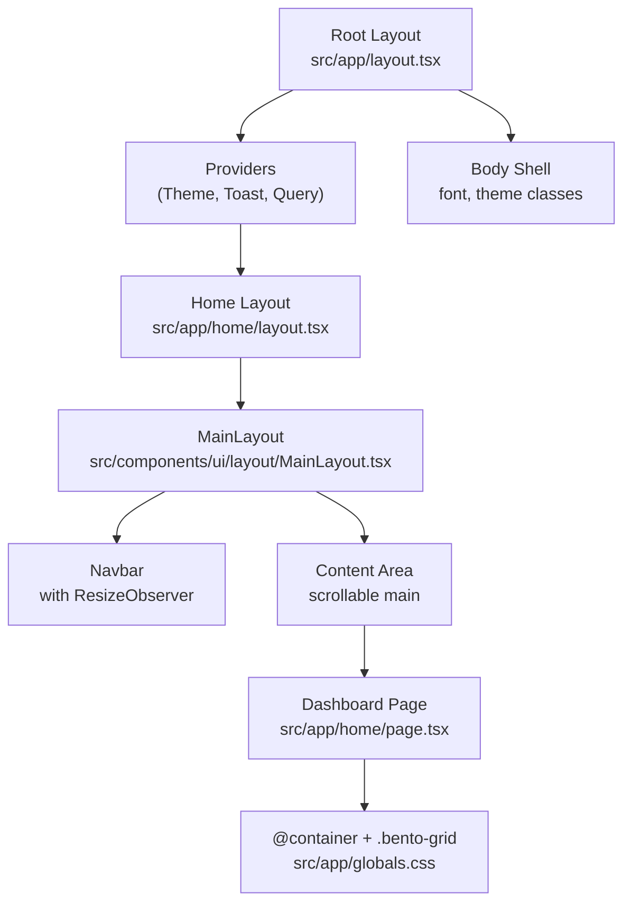
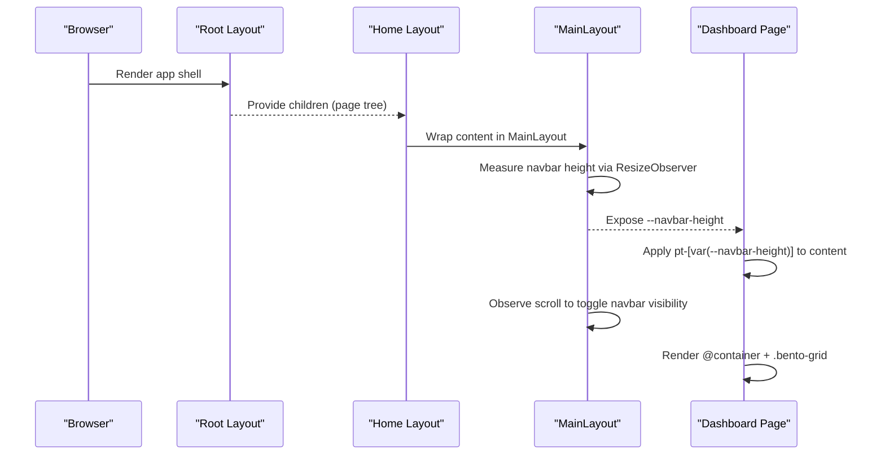
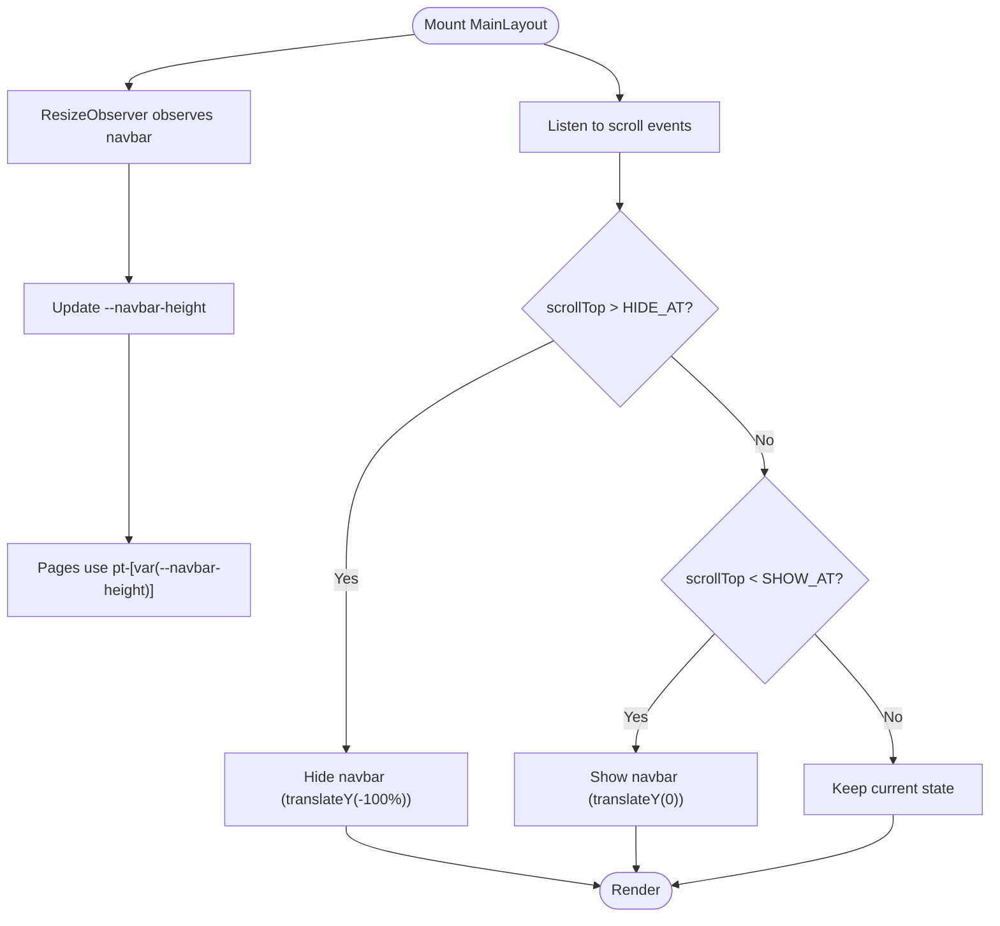
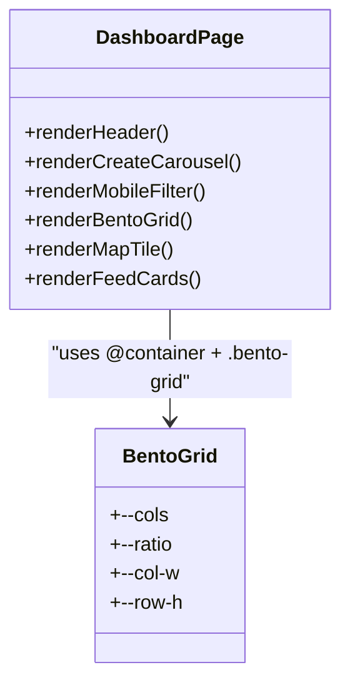
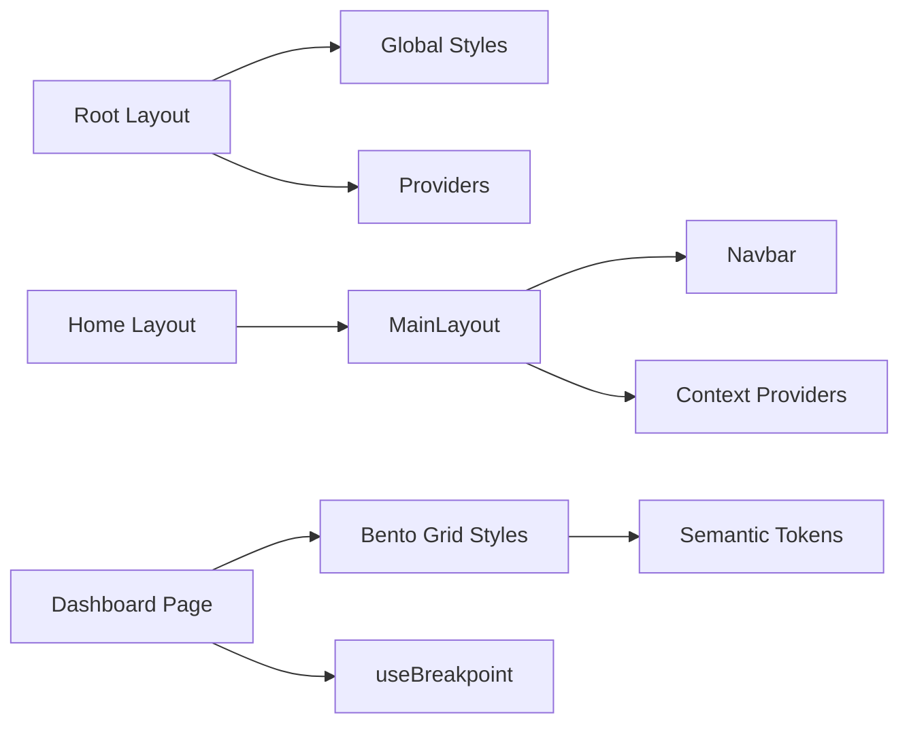

# Dashboard Layout & Structure

<cite>
**Referenced Files in This Document**
- [layout.tsx](file://src/app/layout.tsx)
- [home layout.tsx](file://src/app/home/layout.tsx)
- [home page.tsx](file://src/app/home/page.tsx)
- [MainLayout.tsx](file://src/components/ui/layout/MainLayout.tsx)
- [globals.css](file://src/app/globals.css)
- [useMediaQuery.ts](file://src/hooks/useMediaQuery.ts)
</cite>

## Table of Contents
1. [Introduction](#introduction)
2. [Project Structure](#project-structure)
3. [Core Components](#core-components)
4. [Architecture Overview](#architecture-overview)
5. [Detailed Component Analysis](#detailed-component-analysis)
6. [Dependency Analysis](#dependency-analysis)
7. [Performance Considerations](#performance-considerations)
8. [Troubleshooting Guide](#troubleshooting-guide)
9. [Conclusion](#conclusion)

## Introduction
This document explains the dashboard layout system and page structure built with the Next.js App Router. It covers the root layout, the home page layout that wraps content in a consistent shell, responsive container setup, viewport configuration, mobile-first design patterns, and the bento grid implementation using CSS container queries. It also details how the main layout computes navbar height, manages the content area, and coordinates responsive breakpoints to maintain visual consistency across devices.

## Project Structure
The dashboard layout is composed of:
- Root layout for global providers, metadata, and viewport settings
- Home layout that delegates to a shared MainLayout component
- Home page implementing the dashboard UI with a responsive bento grid
- Global styles defining semantic tokens, typography, and the bento grid
- A media query hook for JS-driven responsive behavior

**Diagram sources**
- [layout.tsx:57-81](file://src/app/layout.tsx#L57-L81)
- [home layout.tsx:5-10](file://src/app/home/layout.tsx#L5-L10)
- [MainLayout.tsx:33-379](file://src/components/ui/layout/MainLayout.tsx#L33-L379)
- [home page.tsx:681-947](file://src/app/home/page.tsx#L681-L947)
- [globals.css:1089-1101](file://src/app/globals.css#L1089-L1101)

**Section sources**
- [layout.tsx:1-85](file://src/app/layout.tsx#L1-L85)
- [home layout.tsx:1-12](file://src/app/home/layout.tsx#L1-L12)
- [MainLayout.tsx:1-397](file://src/components/ui/layout/MainLayout.tsx#L1-L397)
- [home page.tsx:1-1004](file://src/app/home/page.tsx#L1-L1004)
- [globals.css:1-1134](file://src/app/globals.css#L1-L1134)

## Core Components
- Root layout sets metadata, fonts, providers, and viewport configuration for safe-area support on notched devices.
- Home layout wraps all dashboard pages in a shared MainLayout to ensure consistent spacing, padding, alignment, and responsive behavior.
- MainLayout provides:
  - A sticky navbar whose height is measured via ResizeObserver and exposed as a CSS custom property for content offsetting.
  - A scrollable main content area that drives navbar visibility based on scroll position thresholds.
  - A right sidebar that renders inline at larger screens or as an overlay sheet on smaller screens.
- Home page implements the dashboard shell and bento grid, including mobile create carousel, content filters, map tile placement, and feed cards.

**Section sources**
- [layout.tsx:19-55](file://src/app/layout.tsx#L19-L55)
- [home layout.tsx:5-10](file://src/app/home/layout.tsx#L5-L10)
- [MainLayout.tsx:49-91](file://src/components/ui/layout/MainLayout.tsx#L49-L91)
- [MainLayout.tsx:273-379](file://src/components/ui/layout/MainLayout.tsx#L273-L379)
- [home page.tsx:681-947](file://src/app/home/page.tsx#L681-L947)

## Architecture Overview
The layout architecture follows a layered approach:
- Root layout establishes global context and viewport behavior.
- Home layout composes the MainLayout shell around page content.
- MainLayout measures the navbar height and exposes it as a CSS variable so child pages can offset their top padding accordingly.
- The dashboard page uses a container-query-based bento grid to keep tiles ratio-locked and responsive without hard-coded heights.

**Diagram sources**
- [layout.tsx:57-81](file://src/app/layout.tsx#L57-L81)
- [home layout.tsx:5-10](file://src/app/home/layout.tsx#L5-L10)
- [MainLayout.tsx:49-91](file://src/components/ui/layout/MainLayout.tsx#L49-L91)
- [home page.tsx:681-687](file://src/app/home/page.tsx#L681-L687)
- [globals.css:1089-1101](file://src/app/globals.css#L1089-L1101)

## Detailed Component Analysis

### Root Layout and Viewport Configuration
- Metadata and fonts are configured globally.
- Viewport is set to cover to resolve safe-area insets for notched devices, enabling accurate padding for sheets and shells.
- Providers wrap the application to enable theming, toast notifications, tooltips, and data fetching contexts.

**Section sources**
- [layout.tsx:19-55](file://src/app/layout.tsx#L19-L55)
- [layout.tsx:57-81](file://src/app/layout.tsx#L57-L81)

### Home Layout Delegation to MainLayout
- The home layout is minimal and delegates to MainLayout to provide consistent spacing, navbar behavior, and responsive shell.

**Section sources**
- [home layout.tsx:5-10](file://src/app/home/layout.tsx#L5-L10)

### MainLayout Shell: Navbar Height, Visibility, and Sidebar
- Navbar height measurement:
  - A ResizeObserver tracks the navbar’s content height and updates a CSS custom property used by child pages to offset content from the top.
- Navbar visibility:
  - Scroll hysteresis hides/shows the navbar based on thresholds to avoid flicker during small scroll adjustments.
- Right sidebar:
  - Renders inline at larger breakpoints; below that, it appears as a slide-in sheet.
- Content area:
  - The main content is scrollable and wrapped with a provider to coordinate navbar visibility state.

**Diagram sources**
- [MainLayout.tsx:49-91](file://src/components/ui/layout/MainLayout.tsx#L49-L91)
- [MainLayout.tsx:273-288](file://src/components/ui/layout/MainLayout.tsx#L273-L288)

**Section sources**
- [MainLayout.tsx:49-91](file://src/components/ui/layout/MainLayout.tsx#L49-L91)
- [MainLayout.tsx:273-379](file://src/components/ui/layout/MainLayout.tsx#L273-L379)

### Dashboard Page: Responsive Container Setup and Bento Grid
- Responsive container:
  - The dashboard page wraps its card grid in a container with Tailwind’s container query support so tiles can size themselves relative to container width.
- Bento grid:
  - Uses CSS custom properties to compute column count and aspect ratio per breakpoint.
  - Column width is derived from container query units, ensuring tiles remain ratio-locked regardless of screen size.
- Mobile-first patterns:
  - On small screens, a horizontal carousel presents creation options with snap scrolling and pagination controls.
  - A mobile-only filter bar lets users narrow content by type.
  - The map tile adapts from full-width banner on mobile to a multi-column span at larger breakpoints.
- Visual consistency:
  - Consistent spacing and padding are applied via utility classes and semantic tokens.
  - The header row aligns greeting and usage metrics responsively.

**Diagram sources**
- [home page.tsx:681-947](file://src/app/home/page.tsx#L681-L947)
- [globals.css:1089-1101](file://src/app/globals.css#L1089-L1101)

**Section sources**
- [home page.tsx:681-947](file://src/app/home/page.tsx#L681-L947)
- [globals.css:1089-1101](file://src/app/globals.css#L1089-L1101)

### CSS Custom Properties and Semantic Tokens
- Global CSS defines semantic tokens for surfaces, content, glyphs, edges, actions, categories, and typography scales.
- These tokens are mapped into Tailwind theme variables for consistent usage across components.
- The bento grid relies on custom properties to compute dimensions dynamically based on container width and breakpoint overrides.

**Section sources**
- [globals.css:12-254](file://src/app/globals.css#L12-L254)
- [globals.css:494-784](file://src/app/globals.css#L494-L784)
- [globals.css:1089-1101](file://src/app/globals.css#L1089-L1101)

### Breakpoints and Media Queries
- The useBreakpoint hook provides SSR-safe detection of current breakpoint buckets aligned with Tailwind v4 defaults.
- Components use these flags to adjust behavior (e.g., showing mobile-only filters or switching sidebar presentation).

**Section sources**
- [useMediaQuery.ts:12-67](file://src/hooks/useMediaQuery.ts#L12-L67)

## Dependency Analysis
- Root layout depends on global styles and providers to establish environment and UX primitives.
- Home layout depends on MainLayout to standardize shell behavior.
- MainLayout depends on Navbar and context providers to manage visibility and sidebar state.
- Dashboard page depends on the bento grid styles and container queries to render responsive layouts.
- All layers rely on semantic tokens for consistent styling.

**Diagram sources**
- [layout.tsx:57-81](file://src/app/layout.tsx#L57-L81)
- [home layout.tsx:5-10](file://src/app/home/layout.tsx#L5-L10)
- [MainLayout.tsx:33-379](file://src/components/ui/layout/MainLayout.tsx#L33-L379)
- [home page.tsx:681-947](file://src/app/home/page.tsx#L681-L947)
- [globals.css:1089-1101](file://src/app/globals.css#L1089-L1101)
- [useMediaQuery.ts:53-67](file://src/hooks/useMediaQuery.ts#L53-L67)

**Section sources**
- [layout.tsx:57-81](file://src/app/layout.tsx#L57-L81)
- [home layout.tsx:5-10](file://src/app/home/layout.tsx#L5-L10)
- [MainLayout.tsx:33-379](file://src/components/ui/layout/MainLayout.tsx#L33-L379)
- [home page.tsx:681-947](file://src/app/home/page.tsx#L681-L947)
- [globals.css:1089-1101](file://src/app/globals.css#L1089-L1101)
- [useMediaQuery.ts:53-67](file://src/hooks/useMediaQuery.ts#L53-L67)

## Performance Considerations
- Navbar visibility uses hysteresis thresholds to prevent frequent toggling during minor scroll movements.
- Container-query-based sizing avoids recalculating complex layouts via JavaScript; CSS handles responsive tile sizing efficiently.
- Providers are scoped to minimize re-renders and keep context updates localized.
- Reduced motion preferences are respected for animations and transitions.

[No sources needed since this section provides general guidance]

## Troubleshooting Guide
- If content overlaps the navbar:
  - Ensure the page applies top padding using the navbar height variable.
  - Verify the root layout sets viewport fit to cover for safe-area handling.
- If the bento grid tiles do not resize correctly:
  - Confirm the grid is inside a container with container query support.
  - Check that breakpoint utilities override column counts and ratios as intended.
- If the navbar does not hide/show on scroll:
  - Verify the main content element is scrollable and the event listener is attached.
  - Check threshold values and ensure no parent containers intercept scroll events.

**Section sources**
- [layout.tsx:51-55](file://src/app/layout.tsx#L51-L55)
- [home page.tsx:681-687](file://src/app/home/page.tsx#L681-L687)
- [globals.css:1089-1101](file://src/app/globals.css#L1089-L1101)
- [MainLayout.tsx:69-91](file://src/components/ui/layout/MainLayout.tsx#L69-L91)

## Conclusion
The dashboard layout system combines a robust root layout, a shared MainLayout shell, and a container-query-driven bento grid to deliver a responsive, consistent user experience across devices. Semantic tokens and CSS custom properties ensure cohesive spacing and alignment, while media queries and hooks enable adaptive behavior in both CSS and JavaScript. This architecture supports scalable growth and maintains visual integrity as features evolve.

[No sources needed since this section summarizes without analyzing specific files]