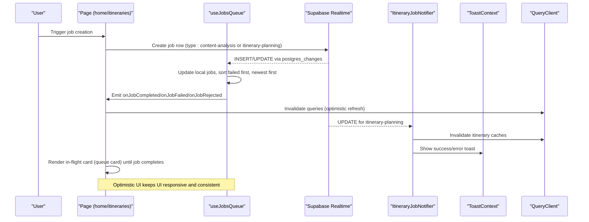
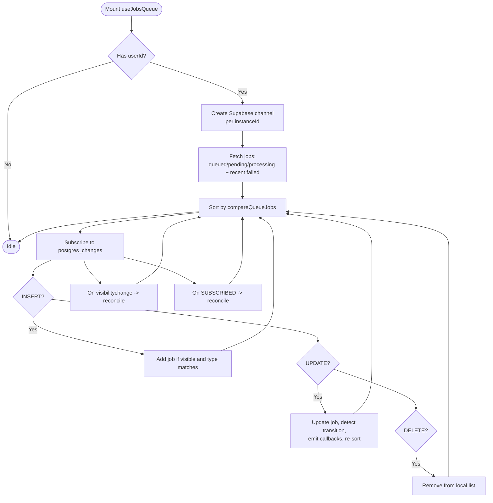
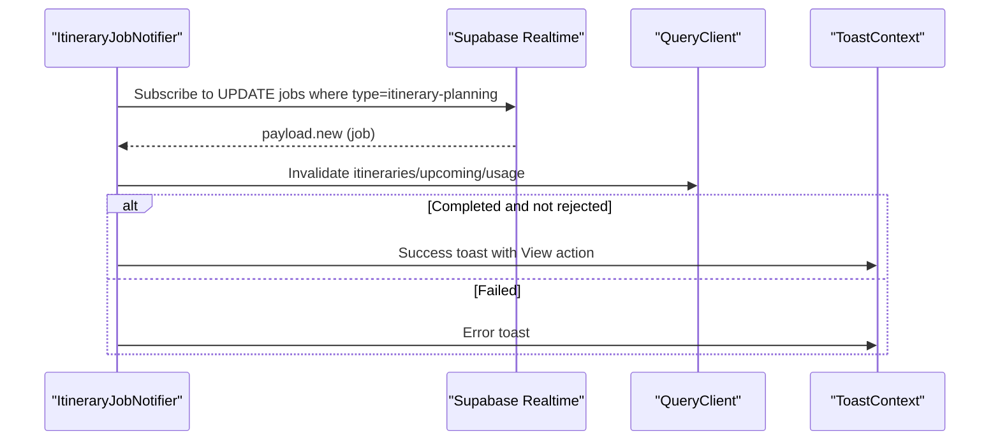
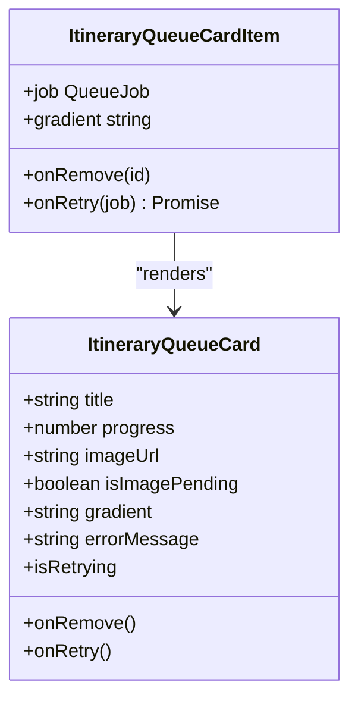
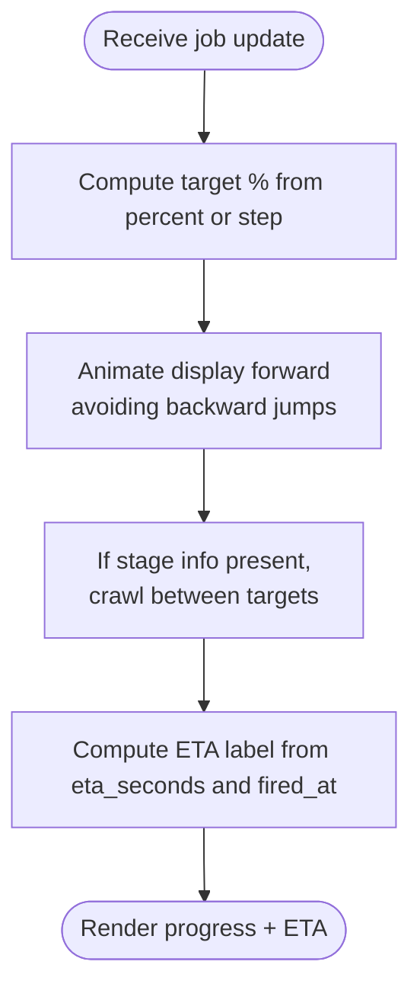
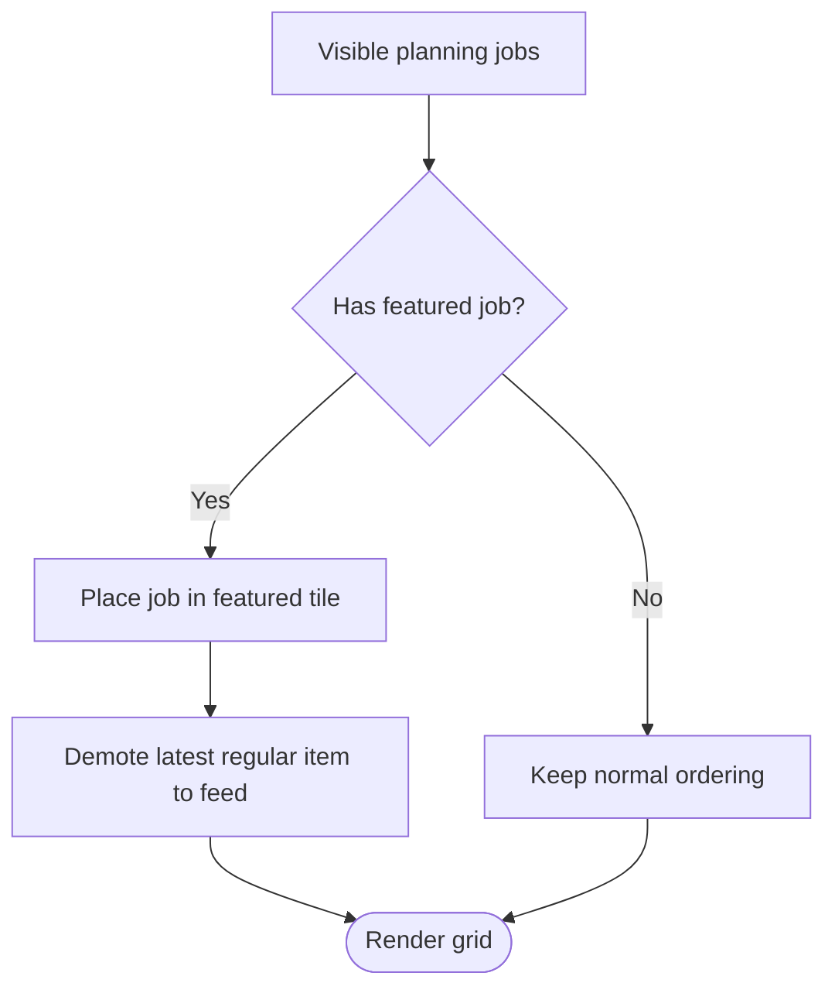
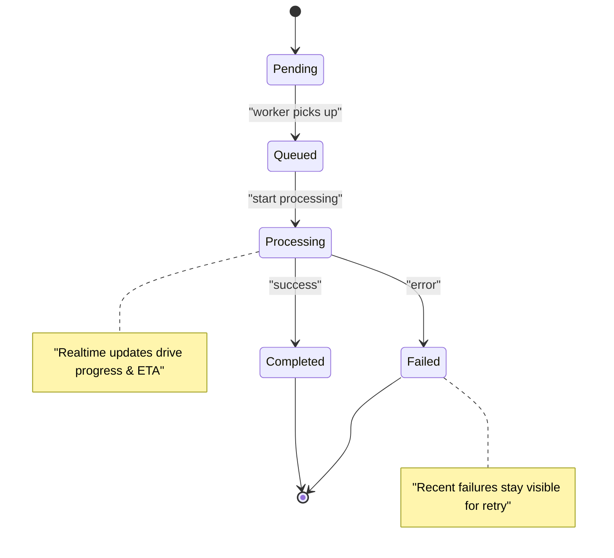

# Job Queue Integration

<cite>
**Referenced Files in This Document**
- [useJobsQueue.ts](file://src/hooks/useJobsQueue.ts)
- [ItineraryJobNotifier.tsx](file://src/components/notifications/ItineraryJobNotifier.tsx)
- [ItineraryQueueCard.tsx](file://src/components/ui/itinerary/ItineraryQueueCard.tsx)
- [ItineraryQueueCardItem.tsx](file://src/components/ui/itinerary/ItineraryQueueCardItem.tsx)
- [useProgressAnimation.ts](file://src/hooks/useProgressAnimation.ts)
- [useProgressEta.ts](file://src/hooks/useProgressEta.ts)
- [home/page.tsx](file://src/app/home/page.tsx)
- [itineraries/page.tsx](file://src/app/itineraries/page.tsx)
- [client.ts](file://src/lib/api/client.ts)
</cite>

## Table of Contents
1. [Introduction](#introduction)
2. [Project Structure](#project-structure)
3. [Core Components](#core-components)
4. [Architecture Overview](#architecture-overview)
5. [Detailed Component Analysis](#detailed-component-analysis)
6. [Dependency Analysis](#dependency-analysis)
7. [Performance Considerations](#performance-considerations)
8. [Troubleshooting Guide](#troubleshooting-guide)
9. [Conclusion](#conclusion)

## Introduction
This document explains how the dashboard integrates a job queue to manage background processing tasks such as content analysis and itinerary planning. It focuses on the useJobsQueue hook, optimistic UI patterns for in-flight jobs, featured job positioning logic, lifecycle management (creation through completion), error handling and retries, cleanup, and cross-component communication via the global ItineraryJobNotifier for toast notifications. It also covers progress tracking and user feedback mechanisms that keep users informed while long-running operations execute.

## Project Structure
The job queue integration spans hooks, UI components, pages, and a global notifier:
- Hook layer: useJobsQueue manages real-time job state, transitions, and optimistic updates.
- UI layer: ItineraryQueueCard and ItineraryQueueCardItem render in-flight jobs as cards with progress and retry actions.
- Progress utilities: useProgressAnimation and useProgressEta provide smooth progress bars and ETA countdowns.
- Pages: home and itineraries pages consume the hook to display jobs and handle completion events.
- Global notifier: ItineraryJobNotifier listens for itinerary job changes and shows toasts and cache invalidation.
- API client: retry and detach endpoints are used by UI interactions.

```mermaid
graph TB
subgraph "Hooks"
UJQ["useJobsQueue"]
UPA["useProgressAnimation"]
UETA["useProgressEta"]
end
subgraph "UI"
IQC["ItineraryQueueCard"]
IQCI["ItineraryQueueCardItem"]
end
subgraph "Pages"
HOME["home/page.tsx"]
ITIN["itineraries/page.tsx"]
end
subgraph "Notifications"
NOTIF["ItineraryJobNotifier.tsx"]
end
subgraph "API"
API["lib/api/client.ts"]
end
HOME --> UJQ
ITIN --> UJQ
UJQ --> UPA
UJQ --> UETA
IQCI --> UPA
IQCI --> UETA
IQCI --> IQC
NOTIF --> API
IQCI --> API
```

**Diagram sources**
- [useJobsQueue.ts:45-295](file://src/hooks/useJobsQueue.ts#L45-L295)
- [ItineraryQueueCard.tsx:55-199](file://src/components/ui/itinerary/ItineraryQueueCard.tsx#L55-L199)
- [ItineraryQueueCardItem.tsx:34-101](file://src/components/ui/itinerary/ItineraryQueueCardItem.tsx#L34-L101)
- [useProgressAnimation.ts:1-104](file://src/hooks/useProgressAnimation.ts#L1-L104)
- [useProgressEta.ts:1-60](file://src/hooks/useProgressEta.ts#L1-L60)
- [home/page.tsx:192-240](file://src/app/home/page.tsx#L192-L240)
- [itineraries/page.tsx:102-122](file://src/app/itineraries/page.tsx#L102-L122)
- [ItineraryJobNotifier.tsx:10-91](file://src/components/notifications/ItineraryJobNotifier.tsx#L10-L91)
- [client.ts:147-155](file://src/lib/api/client.ts#L147-L155)

**Section sources**
- [useJobsQueue.ts:45-295](file://src/hooks/useJobsQueue.ts#L45-L295)
- [ItineraryJobNotifier.tsx:10-91](file://src/components/notifications/ItineraryJobNotifier.tsx#L10-L91)
- [ItineraryQueueCard.tsx:55-199](file://src/components/ui/itinerary/ItineraryQueueCard.tsx#L55-L199)
- [ItineraryQueueCardItem.tsx:34-101](file://src/components/ui/itinerary/ItineraryQueueCardItem.tsx#L34-L101)
- [useProgressAnimation.ts:1-104](file://src/hooks/useProgressAnimation.ts#L1-L104)
- [useProgressEta.ts:1-60](file://src/hooks/useProgressEta.ts#L1-L60)
- [home/page.tsx:192-240](file://src/app/home/page.tsx#L192-L240)
- [itineraries/page.tsx:102-122](file://src/app/itineraries/page.tsx#L102-L122)
- [client.ts:147-155](file://src/lib/api/client.ts#L147-L155)

## Core Components
- useJobsQueue: Subscribes to Supabase realtime changes for the jobs table, maintains an in-memory list of visible jobs, reconciles missed updates, emits transition callbacks, and exposes upsert/remove helpers for optimistic UI.
- ItineraryJobNotifier: A global component that subscribes to itinerary-planning job updates, invalidates relevant caches, and shows success/error toasts.
- ItineraryQueueCard / ItineraryQueueCardItem: Render in-flight jobs as cards with progress, ETA, retry, and removal; compute retry eligibility based on failure or stuck-in-flight thresholds.
- useProgressAnimation / useProgressEta: Provide smooth progress bar animation and human-friendly ETA countdowns using worker-reported metrics and local timers.
- Pages (home, itineraries): Consume useJobsQueue to show jobs, handle completion optimistically, and integrate with query caching.

**Section sources**
- [useJobsQueue.ts:6-34](file://src/hooks/useJobsQueue.ts#L6-L34)
- [useJobsQueue.ts:45-295](file://src/hooks/useJobsQueue.ts#L45-L295)
- [ItineraryJobNotifier.tsx:10-91](file://src/components/notifications/ItineraryJobNotifier.tsx#L10-L91)
- [ItineraryQueueCard.tsx:55-199](file://src/components/ui/itinerary/ItineraryQueueCard.tsx#L55-L199)
- [ItineraryQueueCardItem.tsx:34-101](file://src/components/ui/itinerary/ItineraryQueueCardItem.tsx#L34-L101)
- [useProgressAnimation.ts:1-104](file://src/hooks/useProgressAnimation.ts#L1-L104)
- [useProgressEta.ts:1-60](file://src/hooks/useProgressEta.ts#L1-L60)
- [home/page.tsx:192-240](file://src/app/home/page.tsx#L192-L240)
- [itineraries/page.tsx:102-122](file://src/app/itineraries/page.tsx#L102-L122)

## Architecture Overview
The system uses a combination of realtime database subscriptions, optimistic UI, and global notification to deliver responsive experiences during long-running background tasks.



**Diagram sources**
- [useJobsQueue.ts:167-260](file://src/hooks/useJobsQueue.ts#L167-L260)
- [ItineraryJobNotifier.tsx:29-88](file://src/components/notifications/ItineraryJobNotifier.tsx#L29-L88)
- [home/page.tsx:192-240](file://src/app/home/page.tsx#L192-L240)
- [itineraries/page.tsx:102-122](file://src/app/itineraries/page.tsx#L102-L122)

## Detailed Component Analysis

### useJobsQueue: Realtime Job State Management
- Responsibilities:
  - Subscribe to Supabase realtime channel per user and instance to avoid channel deduplication conflicts.
  - Fetch initial jobs including recent failures for visibility and retry opportunities.
  - Reconcile missed updates when tab becomes visible or after reconnect.
  - Maintain a status map to detect transitions and emit terminal callbacks only once per transition.
  - Sort jobs so failed jobs pin to the front and newest jobs appear first within groups.
  - Expose removeJob and upsertJob for optimistic UI updates without waiting for realtime lag.

- Key behaviors:
  - Visibility change triggers reconciliation to settle jobs stuck mid-progress due to missed realtime messages.
  - Type filtering allows separate queues for content-analysis and itinerary-planning.
  - Detached flag hides jobs from the queue UI when appropriate.



**Diagram sources**
- [useJobsQueue.ts:78-164](file://src/hooks/useJobsQueue.ts#L78-L164)
- [useJobsQueue.ts:167-260](file://src/hooks/useJobsQueue.ts#L167-L260)
- [useJobsQueue.ts:109-136](file://src/hooks/useJobsQueue.ts#L109-L136)

**Section sources**
- [useJobsQueue.ts:6-34](file://src/hooks/useJobsQueue.ts#L6-L34)
- [useJobsQueue.ts:36-43](file://src/hooks/useJobsQueue.ts#L36-L43)
- [useJobsQueue.ts:78-164](file://src/hooks/useJobsQueue.ts#L78-L164)
- [useJobsQueue.ts:167-260](file://src/hooks/useJobsQueue.ts#L167-L260)
- [useJobsQueue.ts:269-295](file://src/hooks/useJobsQueue.ts#L269-L295)

### ItineraryJobNotifier: Global Notifications and Cache Invalidation
- Responsibilities:
  - Track current session user and subscribe to itinerary-planning job updates.
  - Invalidate relevant query caches when itinerary jobs complete or fail.
  - Show success toast with action link to view the new itinerary, or error toast on failure.
  - Avoid duplicate toasts by comparing previous status per job.



**Diagram sources**
- [ItineraryJobNotifier.tsx:29-88](file://src/components/notifications/ItineraryJobNotifier.tsx#L29-L88)

**Section sources**
- [ItineraryJobNotifier.tsx:10-91](file://src/components/notifications/ItineraryJobNotifier.tsx#L10-L91)

### ItineraryQueueCard and ItineraryQueueCardItem: Optimistic UI Cards
- Responsibilities:
  - Render in-flight jobs as cards that visually match finished itinerary cards to prevent layout shifts.
  - Display progress percentage and ETA, with “Waiting...” for queued/pending states.
  - Offer retry for failed or stuck-in-flight jobs (threshold-based).
  - Resolve destination photo to maintain media slot consistency.

- Retry logic:
  - Stuck threshold: jobs remaining in queued/pending/processing beyond a fixed duration can be retried even if not formally failed.
  - Clear retry spinner when backend acknowledges retry (job leaves failed).



**Diagram sources**
- [ItineraryQueueCard.tsx:35-53](file://src/components/ui/itinerary/ItineraryQueueCard.tsx#L35-L53)
- [ItineraryQueueCard.tsx:55-199](file://src/components/ui/itinerary/ItineraryQueueCard.tsx#L55-L199)
- [ItineraryQueueCardItem.tsx:34-101](file://src/components/ui/itinerary/ItineraryQueueCardItem.tsx#L34-L101)

**Section sources**
- [ItineraryQueueCard.tsx:55-199](file://src/components/ui/itinerary/ItineraryQueueCard.tsx#L55-L199)
- [ItineraryQueueCardItem.tsx:34-101](file://src/components/ui/itinerary/ItineraryQueueCardItem.tsx#L34-L101)

### Progress Tracking and ETA
- useProgressAnimation:
  - Computes target percentage from worker-reported percent or step mapping.
  - Animates forward smoothly between steps, avoiding backward movement to prevent perceived regressions.
  - Uses stage metadata (next_percent, stage_ms, fired_at) to crawl progress realistically.

- useProgressEta:
  - Produces human-friendly time-left labels based on eta_seconds and fired_at.
  - Counts down locally every second without requiring frequent server updates.
  - Handles overrun gracefully near completion to avoid misleading promises.



**Diagram sources**
- [useProgressAnimation.ts:18-104](file://src/hooks/useProgressAnimation.ts#L18-L104)
- [useProgressEta.ts:30-59](file://src/hooks/useProgressEta.ts#L30-L59)

**Section sources**
- [useProgressAnimation.ts:1-104](file://src/hooks/useProgressAnimation.ts#L1-L104)
- [useProgressEta.ts:1-60](file://src/hooks/useProgressEta.ts#L1-L60)

### Featured Job Positioning Logic
- The home page prioritizes the most recent in-flight itinerary job as the featured item, ensuring “newest first” holds for running jobs too.
- If a featured job exists, it occupies the prominent tile position and pushes the latest regular item into the feed, preventing older content from overshadowing active work.



**Diagram sources**
- [home/page.tsx:387-415](file://src/app/home/page.tsx#L387-L415)

**Section sources**
- [home/page.tsx:387-415](file://src/app/home/page.tsx#L387-L415)

### Job Lifecycle Management: Creation Through Completion
- Creation:
  - Pages trigger job creation via API calls (e.g., creating links or itineraries).
  - Realtime INSERT adds the job to the queue immediately.

- Processing:
  - Realtime UPDATE updates status and progress; useJobsQueue emits transitions and updates UI.
  - Cards animate progress and show ETA; users see immediate feedback.

- Completion:
  - onJobCompleted triggers optimistic UI updates and cache invalidation.
  - For itineraries, buildOptimisticItinerary creates a placeholder card to prevent layout shift before refetch lands.

- Failure:
  - onJobFailed surfaces errors via queue card messaging and global notifier toasts.
  - Recent failures remain visible for retry.

- Cleanup:
  - Jobs marked detached or completed beyond visibility windows are removed from the queue UI.
  - Channels are unsubscribed on unmount; reconcile ensures no stale in-flight jobs persist.



**Diagram sources**
- [useJobsQueue.ts:6-34](file://src/hooks/useJobsQueue.ts#L6-L34)
- [useJobsQueue.ts:167-260](file://src/hooks/useJobsQueue.ts#L167-L260)
- [itineraries/page.tsx:32-72](file://src/app/itineraries/page.tsx#L32-L72)

**Section sources**
- [useJobsQueue.ts:78-164](file://src/hooks/useJobsQueue.ts#L78-L164)
- [useJobsQueue.ts:167-260](file://src/hooks/useJobsQueue.ts#L167-L260)
- [itineraries/page.tsx:32-72](file://src/app/itineraries/page.tsx#L32-L72)

### Cross-Component Communication Patterns
- Realtime channels:
  - useJobsQueue and ItineraryJobNotifier both subscribe to Supabase postgres_changes for jobs, enabling decoupled updates across components.
- Callbacks:
  - useJobsQueue emits onJobCompleted/onJobFailed/onJobRejected to consumers (pages) for tailored reactions like cache invalidation and optimistic inserts.
- Global notifier:
  - ItineraryJobNotifier centralizes toast notifications for itinerary jobs, avoiding duplicate announcements when multiple components listen.

**Section sources**
- [useJobsQueue.ts:167-260](file://src/hooks/useJobsQueue.ts#L167-L260)
- [ItineraryJobNotifier.tsx:29-88](file://src/components/notifications/ItineraryJobNotifier.tsx#L29-L88)
- [home/page.tsx:192-240](file://src/app/home/page.tsx#L192-L240)

### Examples of Status Updates, Progress Tracking, and User Feedback
- Status updates:
  - INSERT adds new jobs; UPDATE modifies status/progress; DELETE removes jobs.
  - compareQueueJobs ensures failed jobs are pinned at the top and newest jobs appear first.

- Progress tracking:
  - useProgressAnimation animates progress bars using worker percent or step mapping.
  - useProgressEta provides countdown labels based on eta_seconds and fired_at.

- User feedback:
  - Queue cards show “Waiting...”, percentages, and ETA.
  - Failed states include error messages and Try Again buttons.
  - ItineraryJobNotifier shows success/toast with action links and error toasts.

**Section sources**
- [useJobsQueue.ts:36-43](file://src/hooks/useJobsQueue.ts#L36-L43)
- [useJobsQueue.ts:182-247](file://src/hooks/useJobsQueue.ts#L182-L247)
- [ItineraryQueueCard.tsx:81-189](file://src/components/ui/itinerary/ItineraryQueueCard.tsx#L81-L189)
- [ItineraryQueueCardItem.tsx:63-99](file://src/components/ui/itinerary/ItineraryQueueCardItem.tsx#L63-L99)
- [useProgressAnimation.ts:18-104](file://src/hooks/useProgressAnimation.ts#L18-L104)
- [useProgressEta.ts:30-59](file://src/hooks/useProgressEta.ts#L30-L59)
- [ItineraryJobNotifier.tsx:63-82](file://src/components/notifications/ItineraryJobNotifier.tsx#L63-L82)

## Dependency Analysis
- useJobsQueue depends on Supabase client and realtime channels; it coordinates with pages via callbacks and exposes helpers for optimistic UI.
- ItineraryJobNotifier depends on Supabase client, QueryClient, and ToastContext to invalidate caches and notify users.
- UI components depend on progress hooks to render accurate and smooth progress visuals.
- Pages depend on useJobsQueue to render jobs and handle completion events; they also build optimistic items to prevent layout shifts.

```mermaid
graph LR
UJQ["useJobsQueue"] --> PAGES["home/page.tsx", "itineraries/page.tsx"]
UJQ --> UI["ItineraryQueueCardItem"]
UI --> PROGRESS["useProgressAnimation", "useProgressEta"]
NOTIF["ItineraryJobNotifier"] --> CACHE["QueryClient"]
NOTIF --> TOAST["ToastContext"]
UI --> API["retry/detach endpoints"]
```

**Diagram sources**
- [useJobsQueue.ts:45-295](file://src/hooks/useJobsQueue.ts#L45-L295)
- [ItineraryJobNotifier.tsx:29-88](file://src/components/notifications/ItineraryJobNotifier.tsx#L29-L88)
- [ItineraryQueueCardItem.tsx:34-101](file://src/components/ui/itinerary/ItineraryQueueCardItem.tsx#L34-L101)
- [client.ts:147-155](file://src/lib/api/client.ts#L147-L155)

**Section sources**
- [useJobsQueue.ts:45-295](file://src/hooks/useJobsQueue.ts#L45-L295)
- [ItineraryJobNotifier.tsx:29-88](file://src/components/notifications/ItineraryJobNotifier.tsx#L29-L88)
- [ItineraryQueueCardItem.tsx:34-101](file://src/components/ui/itinerary/ItineraryQueueCardItem.tsx#L34-L101)
- [client.ts:147-155](file://src/lib/api/client.ts#L147-L155)

## Performance Considerations
- Realtime efficiency:
  - Per-instance channels avoid deduplication conflicts and reduce redundant listeners.
  - Reconciliation minimizes stale state after connectivity issues or backgrounding.

- UI responsiveness:
  - Optimistic updates ensure immediate visual feedback without waiting for realtime lag.
  - Smooth progress animations prevent jarring jumps and improve perceived performance.

- Memory and rendering:
  - Sorting and filtering limit visible jobs to relevant types and recent failures.
  - Detached jobs are hidden to reduce clutter.

[No sources needed since this section provides general guidance]

## Troubleshooting Guide
- Jobs stuck in flight:
  - Use stuck threshold detection to offer retry even if not formally failed.
  - Verify reconcile runs on visibility change and reconnect to settle missed updates.

- Duplicate toasts:
  - Ensure ItineraryJobNotifier owns itinerary toasts; avoid duplicating in pages.
  - Compare previous status per job to prevent repeated notifications.

- Progress anomalies:
  - Confirm worker reports percent and stage metadata; fallback to step mapping when absent.
  - Avoid backward progress jumps; rely on max(prev, target) logic.

- Channel errors:
  - Handle CHANNEL_ERROR/TIMED_OUT by setting connectionError and reconciling on SUBSCRIBED.

**Section sources**
- [ItineraryQueueCardItem.tsx:63-73](file://src/components/ui/itinerary/ItineraryQueueCardItem.tsx#L63-L73)
- [useJobsQueue.ts:250-260](file://src/hooks/useJobsQueue.ts#L250-L260)
- [ItineraryJobNotifier.tsx:54-82](file://src/components/notifications/ItineraryJobNotifier.tsx#L54-L82)
- [useProgressAnimation.ts:43-52](file://src/hooks/useProgressAnimation.ts#L43-L52)

## Conclusion
The job queue integration delivers a responsive, informative experience for background tasks like content analysis and itinerary planning. The useJobsQueue hook orchestrates realtime updates, optimistic UI, and robust lifecycle management, while ItineraryQueueCard components provide clear progress and retry options. The global ItineraryJobNotifier centralizes notifications and cache invalidation, ensuring consistent user feedback across the app. Together, these pieces create a resilient, user-centric workflow that handles errors gracefully and keeps users engaged throughout long-running processes.