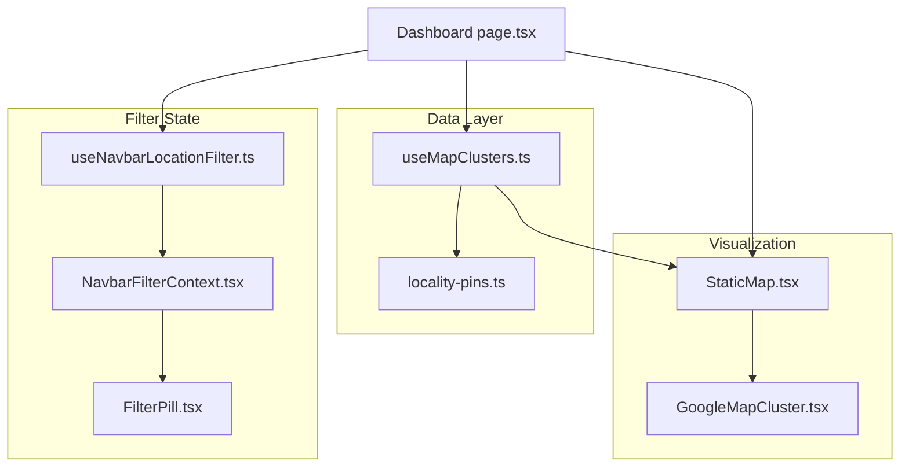
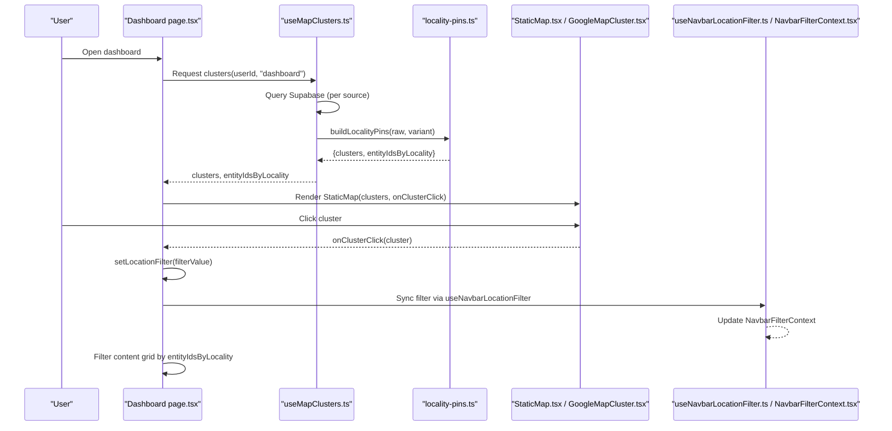
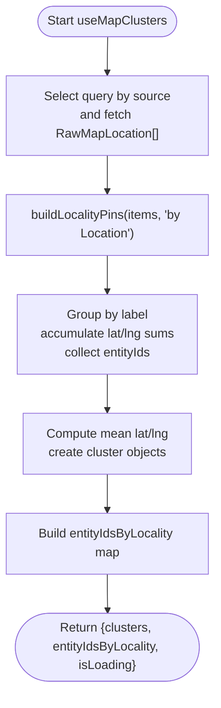
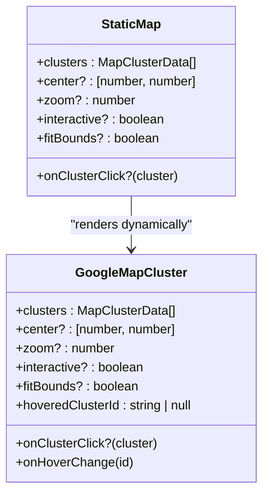
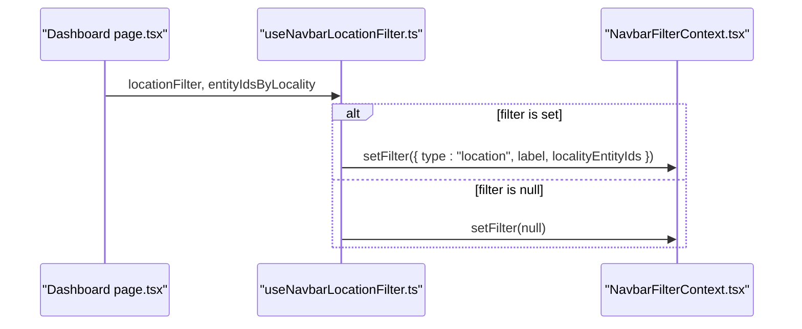
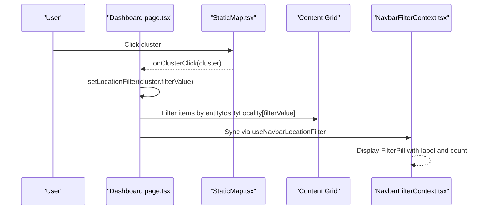
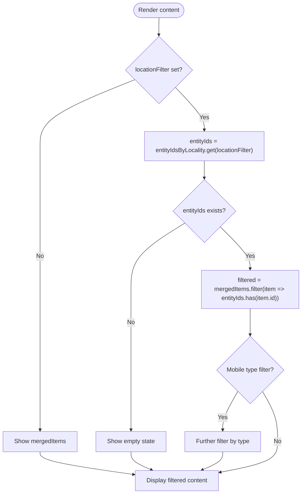
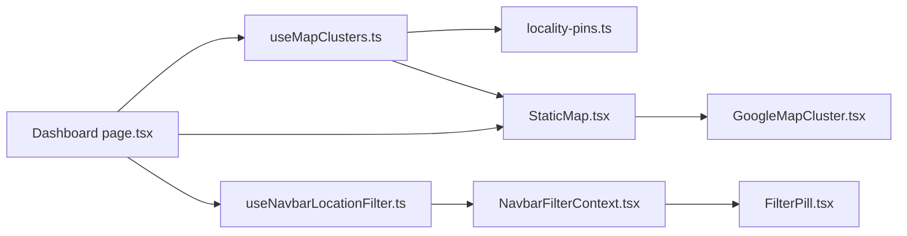

# Map Cluster Integration

<cite>
**Referenced Files in This Document**
- [useMapClusters.ts](file://src/hooks/useMapClusters.ts)
- [StaticMap.tsx](file://src/components/ui/map/StaticMap.tsx)
- [GoogleMapCluster.tsx](file://src/components/ui/map/GoogleMapCluster.tsx)
- [locality-pins.ts](file://src/lib/maps/locality-pins.ts)
- [useNavbarLocationFilter.ts](file://src/hooks/useNavbarLocationFilter.ts)
- [NavbarFilterContext.tsx](file://src/contexts/NavbarFilterContext.tsx)
- [FilterPill.tsx](file://src/components/ui/navbar/FilterPill.tsx)
- [page.tsx (Dashboard)](file://src/app/home/page.tsx)
</cite>

## Table of Contents
1. Introduction
2. Project Structure
3. Core Components
4. Architecture Overview
5. Detailed Component Analysis
6. Dependency Analysis
7. Performance Considerations
8. Troubleshooting Guide
9. Conclusion

## Introduction
This document explains the map cluster integration that enables location-based filtering of dashboard content. It covers how geographic clusters are fetched and transformed, how the StaticMap component renders interactive clusters, and how clicking a cluster applies a location filter to the content grid. It also documents the bidirectional relationship between map interactions and dashboard filtering, including state management for active filters, filter pill display, and reset behavior.

## Project Structure
The integration spans hooks, UI components, context, and a dashboard page:
- Data fetching and transformation: useMapClusters hook and locality-pins utility
- Visualization: StaticMap and GoogleMapCluster components
- Filter state: NavbarFilterContext and useNavbarLocationFilter hook
- Page integration: Dashboard page wiring map clicks to filter state and content grid

**Diagram sources**
- [useMapClusters.ts:1-61](file://src/hooks/useMapClusters.ts#L1-L61)
- [locality-pins.ts:1-78](file://src/lib/maps/locality-pins.ts#L1-L78)
- [StaticMap.tsx:1-103](file://src/components/ui/map/StaticMap.tsx#L1-L103)
- [GoogleMapCluster.tsx:1-181](file://src/components/ui/map/GoogleMapCluster.tsx#L1-L181)
- [NavbarFilterContext.tsx:1-46](file://src/contexts/NavbarFilterContext.tsx#L1-L46)
- [useNavbarLocationFilter.ts:1-29](file://src/hooks/useNavbarLocationFilter.ts#L1-L29)
- [FilterPill.tsx:1-73](file://src/components/ui/navbar/FilterPill.tsx#L1-L73)
- [page.tsx (Dashboard):123-303](file://src/app/home/page.tsx#L123-L303)

**Section sources**
- [useMapClusters.ts:1-61](file://src/hooks/useMapClusters.ts#L1-L61)
- [StaticMap.tsx:1-103](file://src/components/ui/map/StaticMap.tsx#L1-L103)
- [GoogleMapCluster.tsx:1-181](file://src/components/ui/map/GoogleMapCluster.tsx#L1-L181)
- [locality-pins.ts:1-78](file://src/lib/maps/locality-pins.ts#L1-L78)
- [useNavbarLocationFilter.ts:1-29](file://src/hooks/useNavbarLocationFilter.ts#L1-L29)
- [NavbarFilterContext.tsx:1-46](file://src/contexts/NavbarFilterContext.tsx#L1-L46)
- [FilterPill.tsx:1-73](file://src/components/ui/navbar/FilterPill.tsx#L1-L73)
- [page.tsx (Dashboard):123-303](file://src/app/home/page.tsx#L123-L303)

## Core Components
- useMapClusters: Fetches raw locations per source (dashboard/collections/content/itineraries), transforms them into map clusters and a locality-to-entity-id mapping, and caches results with React Query.
- StaticMap: Renders a container that lazily loads the Google map implementation, tracks visibility, and forwards cluster data and click handlers.
- GoogleMapCluster: Implements the actual map view, auto-fits bounds, renders markers, and wires hover and click events.
- useNavbarLocationFilter: Syncs the active location filter into the shared navbar filter pill using the locality-to-entity-id mapping.
- NavbarFilterContext + FilterPill: Provide global filter state and a dismissible pill UI for active filters.
- Dashboard page: Wires map cluster clicks to local filter state, updates the content grid, and scrolls to the filtered section.

**Section sources**
- [useMapClusters.ts:1-61](file://src/hooks/useMapClusters.ts#L1-L61)
- [StaticMap.tsx:1-103](file://src/components/ui/map/StaticMap.tsx#L1-L103)
- [GoogleMapCluster.tsx:1-181](file://src/components/ui/map/GoogleMapCluster.tsx#L1-L181)
- [useNavbarLocationFilter.ts:1-29](file://src/hooks/useNavbarLocationFilter.ts#L1-L29)
- [NavbarFilterContext.tsx:1-46](file://src/contexts/NavbarFilterContext.tsx#L1-L46)
- [FilterPill.tsx:1-73](file://src/components/ui/navbar/FilterPill.tsx#L1-L73)
- [page.tsx (Dashboard):123-303](file://src/app/home/page.tsx#L123-L303)

## Architecture Overview
The system fetches user content locations, groups them by locality, and displays them as map clusters. Clicking a cluster sets an active location filter, which is reflected in both the content grid and the navbar filter pill.

**Diagram sources**
- [useMapClusters.ts:1-61](file://src/hooks/useMapClusters.ts#L1-L61)
- [locality-pins.ts:1-78](file://src/lib/maps/locality-pins.ts#L1-L78)
- [StaticMap.tsx:1-103](file://src/components/ui/map/StaticMap.tsx#L1-L103)
- [GoogleMapCluster.tsx:1-181](file://src/components/ui/map/GoogleMapCluster.tsx#L1-L181)
- [useNavbarLocationFilter.ts:1-29](file://src/hooks/useNavbarLocationFilter.ts#L1-L29)
- [NavbarFilterContext.tsx:1-46](file://src/contexts/NavbarFilterContext.tsx#L1-L46)
- [page.tsx (Dashboard):123-303](file://src/app/home/page.tsx#L123-L303)

## Detailed Component Analysis

### Data Fetching and Transformation: useMapClusters and locality-pins
- useMapClusters selects a query function based on source (dashboard/collections/content/itineraries), executes it with a Supabase client, and transforms raw locations into clusters and a locality-to-entity-id map.
- locality-pins groups items by "{region}, {country}" or "{country}", computes mean coordinates, counts unique entities, and builds the mapping used for filtering.

Key behaviors:
- StaleTime caching reduces redundant network calls.
- Placeholder data prevents layout shifts before first load.
- Variant is set to "by Location" for all sources in this integration.

**Diagram sources**
- [useMapClusters.ts:1-61](file://src/hooks/useMapClusters.ts#L1-L61)
- [locality-pins.ts:1-78](file://src/lib/maps/locality-pins.ts#L1-L78)

**Section sources**
- [useMapClusters.ts:1-61](file://src/hooks/useMapClusters.ts#L1-L61)
- [locality-pins.ts:1-78](file://src/lib/maps/locality-pins.ts#L1-L78)

### Visualization: StaticMap and GoogleMapCluster
- StaticMap provides a lightweight container with intersection observation to defer loading the heavy Google Maps module until visible. It passes clusters and onClusterClick to the dynamic GoogleMapCluster.
- GoogleMapCluster computes default center/zoom from cluster distribution, fits bounds when needed, renders markers with hover states, and invokes onClusterClick on marker click.

Interaction highlights:
- Hover state is managed locally to avoid unnecessary re-renders.
- Gesture handling toggles based on interactive mode.
- Zoom controls appear conditionally.

**Diagram sources**
- [StaticMap.tsx:1-103](file://src/components/ui/map/StaticMap.tsx#L1-L103)
- [GoogleMapCluster.tsx:1-181](file://src/components/ui/map/GoogleMapCluster.tsx#L1-L181)

**Section sources**
- [StaticMap.tsx:1-103](file://src/components/ui/map/StaticMap.tsx#L1-L103)
- [GoogleMapCluster.tsx:1-181](file://src/components/ui/map/GoogleMapCluster.tsx#L1-L181)

### Filter State Synchronization: useNavbarLocationFilter and NavbarFilterContext
- useNavbarLocationFilter listens to changes in the page’s locationFilter and pushes a corresponding filter object into NavbarFilterContext, including the localityEntityIds resolved from entityIdsByLocality.
- When the filter is cleared or the component unmounts, the context is reset to null.

**Diagram sources**
- [useNavbarLocationFilter.ts:1-29](file://src/hooks/useNavbarLocationFilter.ts#L1-L29)
- [NavbarFilterContext.tsx:1-46](file://src/contexts/NavbarFilterContext.tsx#L1-L46)

**Section sources**
- [useNavbarLocationFilter.ts:1-29](file://src/hooks/useNavbarLocationFilter.ts#L1-L29)
- [NavbarFilterContext.tsx:1-46](file://src/contexts/NavbarFilterContext.tsx#L1-L46)

### Dashboard Integration: Click-to-Filter Flow
- The dashboard page obtains clusters and entityIdsByLocality via useMapClusters and renders StaticMap with onClusterClick.
- Clicking a cluster sets a local locationFilter state; the page then filters its merged content list using entityIdsByLocality and scrolls to the content section.
- useNavbarLocationFilter keeps the navbar filter pill in sync with the active location filter.

**Diagram sources**
- [page.tsx (Dashboard):123-303](file://src/app/home/page.tsx#L123-L303)
- [StaticMap.tsx:1-103](file://src/components/ui/map/StaticMap.tsx#L1-L103)
- [useNavbarLocationFilter.ts:1-29](file://src/hooks/useNavbarLocationFilter.ts#L1-L29)
- [NavbarFilterContext.tsx:1-46](file://src/contexts/NavbarFilterContext.tsx#L1-L46)

**Section sources**
- [page.tsx (Dashboard):123-303](file://src/app/home/page.tsx#L123-L303)

### Cluster Data Structures and Filtering Logic
- Cluster object includes id, count, label, latitude, longitude, variant, size, state, and filterValue. These drive marker rendering and filter application.
- Filtering logic:
  - If no locationFilter is active, show all merged items.
  - If a locationFilter is active, retrieve entityIds for that locality and show only matching items.
  - On mobile, an additional type filter can be applied on top of the location filter.

**Diagram sources**
- [page.tsx (Dashboard):381-397](file://src/app/home/page.tsx#L381-L397)
- [locality-pins.ts:1-78](file://src/lib/maps/locality-pins.ts#L1-L78)

**Section sources**
- [page.tsx (Dashboard):381-397](file://src/app/home/page.tsx#L381-L397)
- [locality-pins.ts:1-78](file://src/lib/maps/locality-pins.ts#L1-L78)

## Dependency Analysis
- useMapClusters depends on:
  - Supabase queries (per source)
  - locality-pins for grouping and mapping
  - React Query for caching and lifecycle
- StaticMap depends on:
  - IntersectionObserver to defer map loading
  - Dynamic import of GoogleMapCluster
- GoogleMapCluster depends on:
  - Google Maps API via @vis.gl/react-google-maps
  - Theme-aware map IDs
- useNavbarLocationFilter depends on:
  - NavbarFilterContext for global filter state
- Dashboard page depends on:
  - All above to wire interaction to filtering

**Diagram sources**
- [useMapClusters.ts:1-61](file://src/hooks/useMapClusters.ts#L1-L61)
- [locality-pins.ts:1-78](file://src/lib/maps/locality-pins.ts#L1-L78)
- [StaticMap.tsx:1-103](file://src/components/ui/map/StaticMap.tsx#L1-L103)
- [GoogleMapCluster.tsx:1-181](file://src/components/ui/map/GoogleMapCluster.tsx#L1-L181)
- [useNavbarLocationFilter.ts:1-29](file://src/hooks/useNavbarLocationFilter.ts#L1-L29)
- [NavbarFilterContext.tsx:1-46](file://src/contexts/NavbarFilterContext.tsx#L1-L46)
- [FilterPill.tsx:1-73](file://src/components/ui/navbar/FilterPill.tsx#L1-L73)
- [page.tsx (Dashboard):123-303](file://src/app/home/page.tsx#L123-L303)

**Section sources**
- [useMapClusters.ts:1-61](file://src/hooks/useMapClusters.ts#L1-L61)
- [StaticMap.tsx:1-103](file://src/components/ui/map/StaticMap.tsx#L1-L103)
- [GoogleMapCluster.tsx:1-181](file://src/components/ui/map/GoogleMapCluster.tsx#L1-L181)
- [useNavbarLocationFilter.ts:1-29](file://src/hooks/useNavbarLocationFilter.ts#L1-L29)
- [NavbarFilterContext.tsx:1-46](file://src/contexts/NavbarFilterContext.tsx#L1-L46)
- [FilterPill.tsx:1-73](file://src/components/ui/navbar/FilterPill.tsx#L1-L73)
- [page.tsx (Dashboard):123-303](file://src/app/home/page.tsx#L123-L303)

## Performance Considerations
- Lazy map loading: StaticMap defers Google Maps initialization until the component is in view, reducing initial bundle cost and render time.
- Caching: useMapClusters uses React Query with staleTime to minimize repeated network requests for clusters.
- Efficient filtering: entityIdsByLocality is a Map of Sets, enabling O(1) membership checks during content filtering.
- Auto-fit bounds: GoogleMapCluster calculates optimal zoom and center based on cluster spread, improving first-view performance and UX.

[No sources needed since this section provides general guidance]

## Troubleshooting Guide
Common issues and resolutions:
- No clusters displayed:
  - Ensure userId is available; useMapClusters disables the query when userId is null.
  - Verify Supabase queries return data for the selected source.
- Clicking a cluster does not filter content:
  - Confirm cluster.filterValue matches a key in entityIdsByLocality.
  - Check that the dashboard page’s locationFilter state is being set and passed into filtering logic.
- Filter pill not updating:
  - Verify useNavbarLocationFilter runs with the correct locationFilter and entityIdsByLocality.
  - Ensure NavbarFilterProvider wraps the app so the context is available.
- Map not loading:
  - Check environment variables for Google Maps API key and map IDs.
  - Confirm the component is visible (intersection observer) to trigger lazy load.

**Section sources**
- [useMapClusters.ts:1-61](file://src/hooks/useMapClusters.ts#L1-L61)
- [StaticMap.tsx:1-103](file://src/components/ui/map/StaticMap.tsx#L1-L103)
- [GoogleMapCluster.tsx:1-181](file://src/components/ui/map/GoogleMapCluster.tsx#L1-L181)
- [useNavbarLocationFilter.ts:1-29](file://src/hooks/useNavbarLocationFilter.ts#L1-L29)
- [NavbarFilterContext.tsx:1-46](file://src/contexts/NavbarFilterContext.tsx#L1-L46)
- [page.tsx (Dashboard):123-303](file://src/app/home/page.tsx#L123-L303)

## Conclusion
The map cluster integration provides a seamless way to discover and filter content by location. Clusters are computed from user content, rendered interactively, and linked to dashboard filtering through a clear state flow. The design balances performance (lazy loading, caching, efficient filtering) with usability (auto-fit bounds, hover states, filter pills). This architecture supports multiple sources (dashboard, collections, content, itineraries) and can be extended to other pages while maintaining consistent behavior.

[No sources needed since this section summarizes without analyzing specific files]