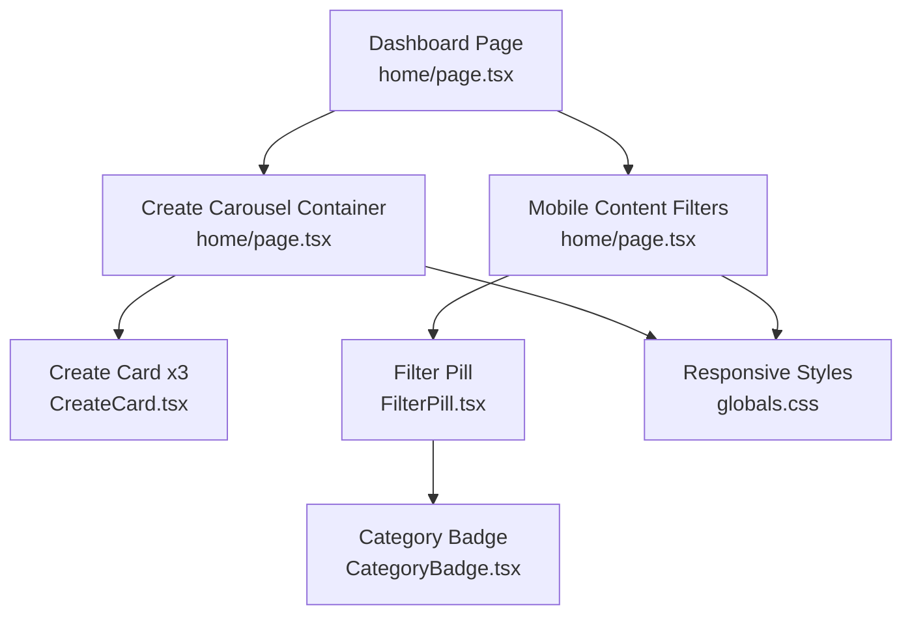
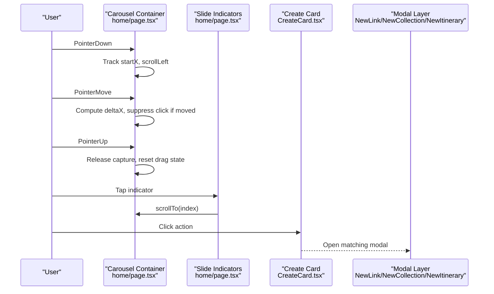
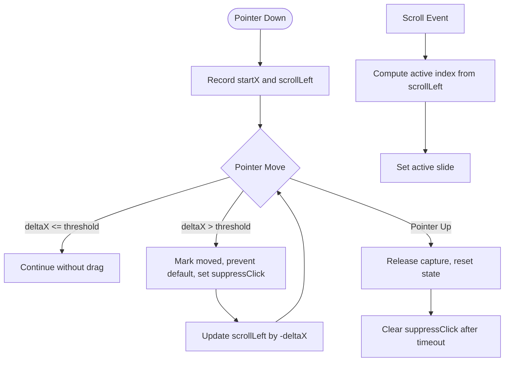
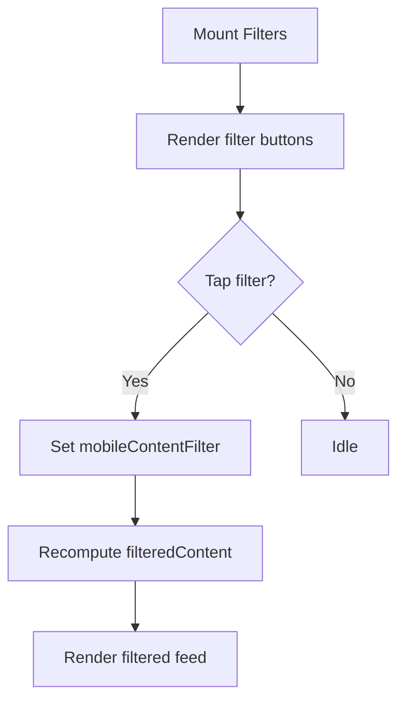
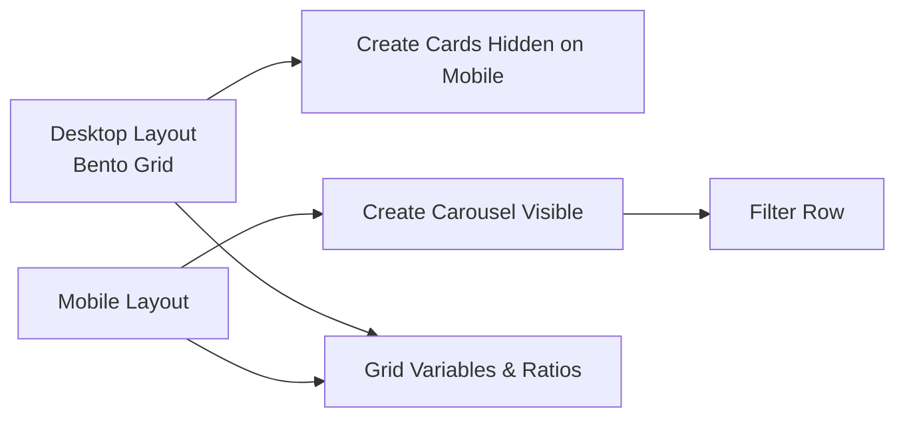
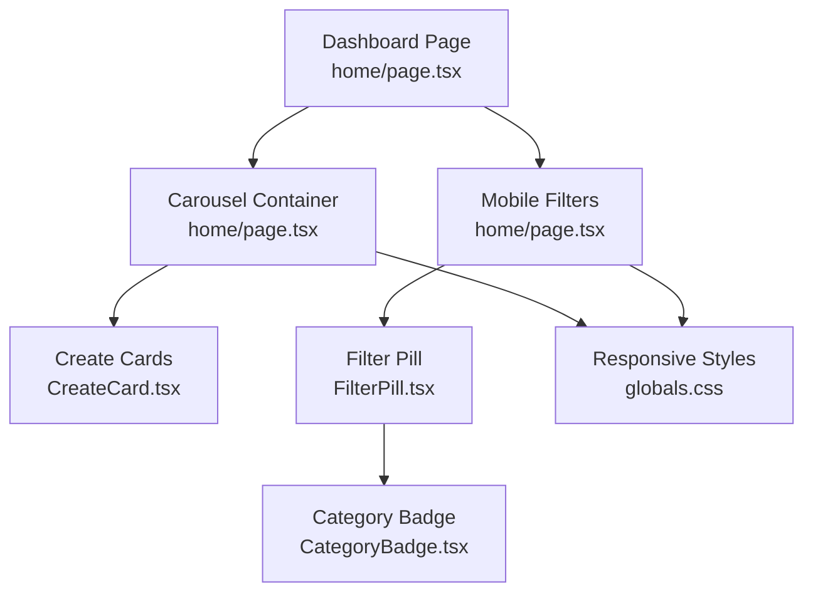

# Mobile Interactions & Carousel

<cite>
**Referenced Files in This Document**
- [page.tsx](file://src/app/home/page.tsx)
- [CreateCard.tsx](file://src/components/ui/dashboard/CreateCard.tsx)
- [FilterPill.tsx](file://src/components/ui/navbar/FilterPill.tsx)
- [CategoryBadge.tsx](file://src/components/ui/primitives/CategoryBadge.tsx)
- [useMediaQuery.ts](file://src/hooks/useMediaQuery.ts)
- [globals.css](file://src/app/globals.css)
</cite>

## Table of Contents
1. Introduction
2. Project Structure
3. Core Components
4. Architecture Overview
5. Detailed Component Analysis
6. Dependency Analysis
7. Performance Considerations
8. Troubleshooting Guide
9. Conclusion

## Introduction
This document explains the mobile-specific interactions and the create carousel functionality on the dashboard. It covers:
- A touch-enabled horizontal scrolling carousel for create actions (link, collection, itinerary) with snap scrolling, drag gestures, and active slide indicators.
- Pointer event handling for smooth drag interactions, including gesture detection, scroll suppression, and click prevention during drags.
- The mobile content filter system using category badges and pill-style filters to filter dashboard content by type.
- Responsive design patterns that adapt the desktop bento grid to mobile layouts, including transitions between grid views and carousel navigation.
- Touch interaction examples, accessibility considerations, and performance optimizations for mobile devices.

## Project Structure
The mobile create carousel and filters live primarily in the dashboard page and supporting UI components:
- Dashboard page orchestrates the carousel, pointer events, scroll-based active slide tracking, and mobile-only filters.
- Create cards render the three create flows and are reused across pages.
- Filter pills and category badges provide visual filtering affordances.
- CSS defines responsive behaviors such as snap scrolling and the bento grid layout.

**Diagram sources**
- [page.tsx:713-763](file://src/app/home/page.tsx#L713-L763)
- [CreateCard.tsx:50-95](file://src/components/ui/dashboard/CreateCard.tsx#L50-L95)
- [FilterPill.tsx:20-68](file://src/components/ui/navbar/FilterPill.tsx#L20-L68)
- [CategoryBadge.tsx:88-113](file://src/components/ui/primitives/CategoryBadge.tsx#L88-L113)
- [globals.css:1080-1102](file://src/app/globals.css#L1080-L1102)

**Section sources**
- [page.tsx:713-763](file://src/app/home/page.tsx#L713-L763)
- [CreateCard.tsx:50-95](file://src/components/ui/dashboard/CreateCard.tsx#L50-L95)
- [FilterPill.tsx:20-68](file://src/components/ui/navbar/FilterPill.tsx#L20-L68)
- [CategoryBadge.tsx:88-113](file://src/components/ui/primitives/CategoryBadge.tsx#L88-L113)
- [globals.css:1080-1102](file://src/app/globals.css#L1080-L1102)

## Core Components
- Create Carousel Container: A horizontally scrollable container with CSS snap behavior and custom pointer event handlers for dragging. It tracks the active slide based on scroll position and exposes an indicator bar for direct navigation.
- Create Cards: Reusable cards representing link, collection, and itinerary creation flows. Each card opens a corresponding modal via its action handler.
- Mobile Content Filters: A horizontal row of filter buttons that toggle between All, Links, Collections, and Itineraries on mobile. They use CategoryBadge icons and pill-style styling.
- Filter Pill: A dismissible chip used elsewhere to show an active location filter; it uses CategoryBadge when no thumbnail is present.
- Category Badge: A small circular icon with category-specific colors and default icons.

Key responsibilities:
- Carousel: Manage pointer down/move/up/cancel, prevent clicks after drags, update active slide on scroll, and smooth-scroll to selected slides.
- Filters: Maintain current filter state and apply client-side filtering to the dashboard feed on mobile.
- Cards: Present consistent UI for each create flow and delegate modals to parent state.

**Section sources**
- [page.tsx:305-379](file://src/app/home/page.tsx#L305-L379)
- [page.tsx:713-763](file://src/app/home/page.tsx#L713-L763)
- [page.tsx:765-793](file://src/app/home/page.tsx#L765-L793)
- [CreateCard.tsx:50-95](file://src/components/ui/dashboard/CreateCard.tsx#L50-L95)
- [FilterPill.tsx:20-68](file://src/components/ui/navbar/FilterPill.tsx#L20-L68)
- [CategoryBadge.tsx:88-113](file://src/components/ui/primitives/CategoryBadge.tsx#L88-L113)

## Architecture Overview
The dashboard composes mobile-first interactions around a central carousel and filter row. On mobile, the create options appear as a swipeable carousel; on larger screens, they are embedded into the bento grid. The filter row toggles visibility of feed items by type.

**Diagram sources**
- [page.tsx:305-379](file://src/app/home/page.tsx#L305-L379)
- [page.tsx:713-763](file://src/app/home/page.tsx#L713-L763)
- [CreateCard.tsx:50-95](file://src/components/ui/dashboard/CreateCard.tsx#L50-L95)

## Detailed Component Analysis

### Create Carousel: Touch, Drag, Snap, and Active Slide
- Horizontal scroll with CSS snap ensures discrete slide alignment.
- Pointer events implement drag:
  - PointerDown captures pointer and records start coordinates and scroll offset.
  - PointerMove computes delta; once a small threshold is exceeded, it marks the drag as moved, prevents default scrolling behavior, and sets a flag to suppress subsequent clicks.
  - PointerUp releases pointer capture and resets state; click suppression is cleared asynchronously to avoid accidental clicks immediately after drag.
- Active slide calculation derives from scrollLeft divided by slide width plus gap, clamped to available slides.
- Indicators call scrollTo to navigate smoothly to the chosen slide.

**Diagram sources**
- [page.tsx:305-379](file://src/app/home/page.tsx#L305-L379)
- [page.tsx:713-763](file://src/app/home/page.tsx#L713-L763)

**Section sources**
- [page.tsx:305-379](file://src/app/home/page.tsx#L305-L379)
- [page.tsx:713-763](file://src/app/home/page.tsx#L713-L763)

### Mobile Content Filter System
- A horizontal row of filter buttons renders on mobile only.
- Each button toggles a filter value among All, Links, Collections, and Itineraries.
- Filtering logic applies client-side to the dashboard feed, hiding non-matching items when a specific type is selected.
- CategoryBadge provides consistent icons per filter type.

**Diagram sources**
- [page.tsx:765-793](file://src/app/home/page.tsx#L765-L793)
- [CategoryBadge.tsx:88-113](file://src/components/ui/primitives/CategoryBadge.tsx#L88-L113)

**Section sources**
- [page.tsx:765-793](file://src/app/home/page.tsx#L765-L793)
- [FilterPill.tsx:20-68](file://src/components/ui/navbar/FilterPill.tsx#L20-L68)
- [CategoryBadge.tsx:88-113](file://src/components/ui/primitives/CategoryBadge.tsx#L88-L113)

### Responsive Design Patterns: Bento Grid to Mobile Carousel
- Desktop: Create cards are placed within the bento grid at specific columns/rows, hidden on mobile.
- Mobile: A dedicated carousel section appears above the filter row, providing discoverable create actions.
- The bento grid uses CSS variables and container queries to maintain tile aspect ratios across breakpoints.

**Diagram sources**
- [page.tsx:802-811](file://src/app/home/page.tsx#L802-L811)
- [page.tsx:713-763](file://src/app/home/page.tsx#L713-L763)
- [globals.css:1080-1102](file://src/app/globals.css#L1080-L1102)

**Section sources**
- [page.tsx:802-811](file://src/app/home/page.tsx#L802-L811)
- [page.tsx:713-763](file://src/app/home/page.tsx#L713-L763)
- [globals.css:1080-1102](file://src/app/globals.css#L1080-L1102)

### Accessibility Considerations
- Carousel container has an aria-label describing its purpose.
- Indicators use role="group" and aria-current to indicate the active slide.
- Filter buttons use aria-pressed to reflect selection state.
- Images inside cards use alt="" and aria-hidden where appropriate to avoid redundant announcements.
- Reduced motion preferences are respected via motion utilities and CSS media queries.

**Section sources**
- [page.tsx:713-763](file://src/app/home/page.tsx#L713-L763)
- [page.tsx:765-793](file://src/app/home/page.tsx#L765-L793)
- [CreateCard.tsx:63-71](file://src/components/ui/dashboard/CreateCard.tsx#L63-L71)

### Performance Optimizations for Mobile
- Snap scrolling reduces jank by leveraging native CSS snapping.
- Overscroll containment prevents unwanted scroll propagation beyond the carousel.
- Pointer capture ensures reliable drag behavior across devices.
- Client-side filtering avoids unnecessary re-renders of heavy components.
- Reduced motion settings disable animations for users who prefer less motion.

**Section sources**
- [page.tsx:713-763](file://src/app/home/page.tsx#L713-L763)
- [page.tsx:765-793](file://src/app/home/page.tsx#L765-L793)
- [globals.css:1080-1102](file://src/app/globals.css#L1080-L1102)

## Dependency Analysis
The following diagram shows how the dashboard page composes the carousel, filters, and cards, and how styles influence behavior.

**Diagram sources**
- [page.tsx:713-763](file://src/app/home/page.tsx#L713-L763)
- [CreateCard.tsx:50-95](file://src/components/ui/dashboard/CreateCard.tsx#L50-L95)
- [FilterPill.tsx:20-68](file://src/components/ui/navbar/FilterPill.tsx#L20-L68)
- [CategoryBadge.tsx:88-113](file://src/components/ui/primitives/CategoryBadge.tsx#L88-L113)
- [globals.css:1080-1102](file://src/app/globals.css#L1080-L1102)

**Section sources**
- [page.tsx:713-763](file://src/app/home/page.tsx#L713-L763)
- [CreateCard.tsx:50-95](file://src/components/ui/dashboard/CreateCard.tsx#L50-L95)
- [FilterPill.tsx:20-68](file://src/components/ui/navbar/FilterPill.tsx#L20-L68)
- [CategoryBadge.tsx:88-113](file://src/components/ui/primitives/CategoryBadge.tsx#L88-L113)
- [globals.css:1080-1102](file://src/app/globals.css#L1080-L1102)

## Performance Considerations
- Use CSS snap scrolling to offload scroll physics to the browser.
- Keep drag thresholds small to quickly transition from tap to drag without noticeable delay.
- Avoid expensive computations in scroll handlers; compute active slide only when needed.
- Prefer client-side filtering for small datasets to reduce network calls.
- Respect reduced motion preferences to improve UX for sensitive users.

[No sources needed since this section provides general guidance]

## Troubleshooting Guide
Common issues and resolutions:
- Carousel does not snap: Ensure the container has snap-x and snap-mandatory classes and children have snap-start.
- Drag triggers clicks: Verify that the suppress-click flag is set when drag moves beyond threshold and cleared after pointer up.
- Indicators do not update: Confirm that scroll events trigger active slide recalculation and that slide widths and gaps are computed correctly.
- Filters not applied: Check that mobileContentFilter state updates and filteredContent recomputes based on item types.

**Section sources**
- [page.tsx:305-379](file://src/app/home/page.tsx#L305-L379)
- [page.tsx:713-763](file://src/app/home/page.tsx#L713-L763)
- [page.tsx:765-793](file://src/app/home/page.tsx#L765-L793)

## Conclusion
The dashboard implements a robust mobile experience by combining a native-feeling carousel with precise pointer event handling, accessible controls, and efficient client-side filtering. Responsive patterns ensure a seamless transition from mobile carousel to desktop bento grid, while performance and accessibility best practices keep interactions smooth and inclusive.

[No sources needed since this section summarizes without analyzing specific files]