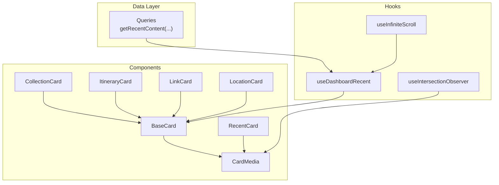
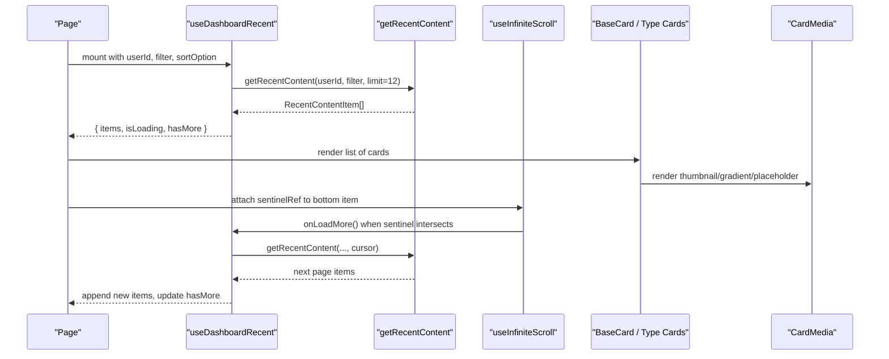
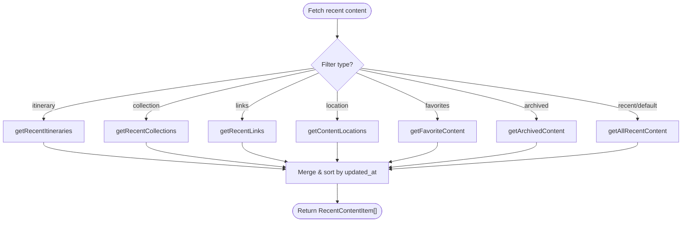
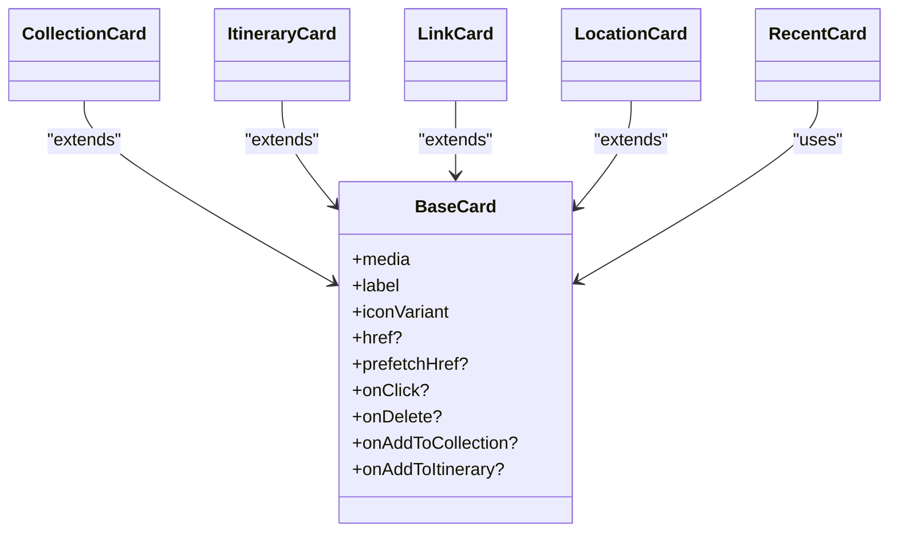
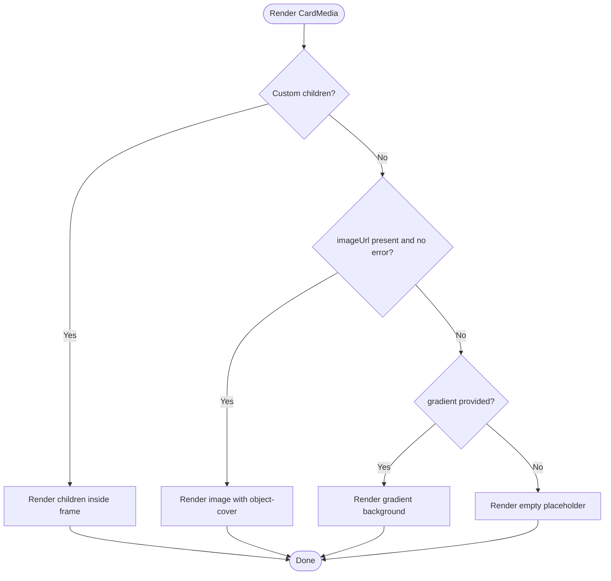
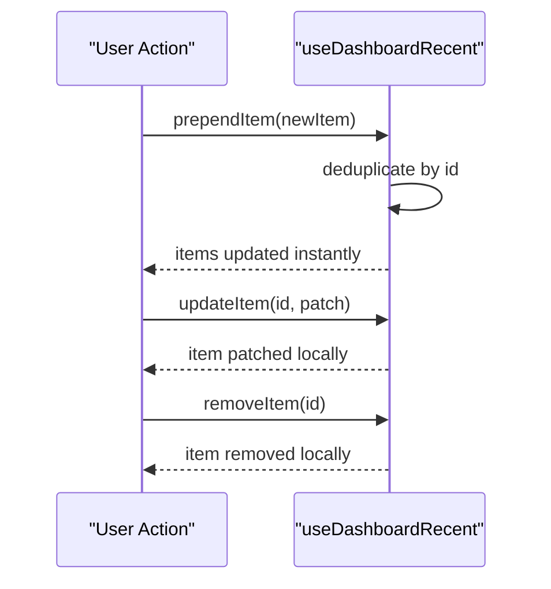
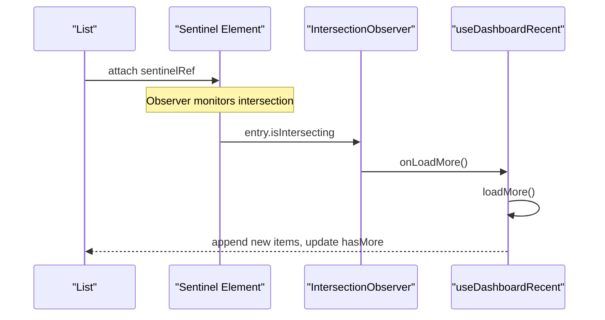
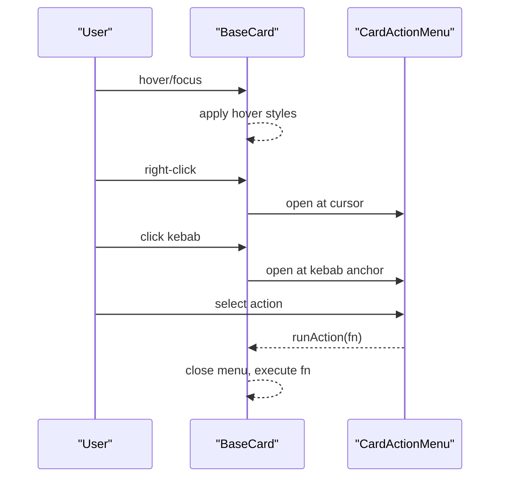
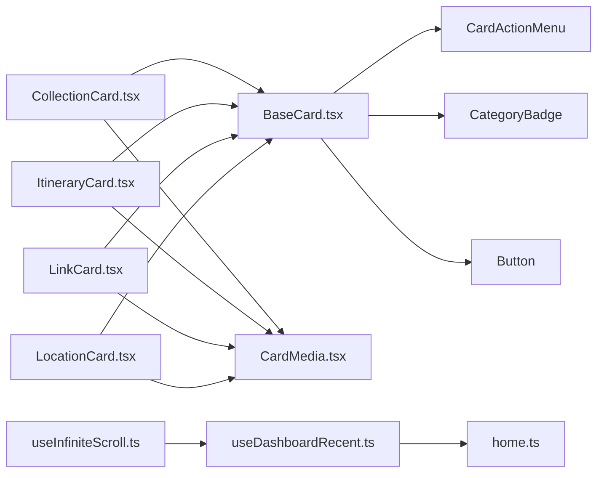

# Content Display & Card System

<cite>
**Referenced Files in This Document**
- [BaseCard.tsx](file://src/components/ui/cards/BaseCard.tsx)
- [CardMedia.tsx](file://src/components/ui/cards/CardMedia.tsx)
- [CollectionCard.tsx](file://src/components/ui/cards/CollectionCard.tsx)
- [ItineraryCard.tsx](file://src/components/ui/cards/ItineraryCard.tsx)
- [LinkCard.tsx](file://src/components/ui/cards/LinkCard.tsx)
- [LocationCard.tsx](file://src/components/ui/cards/LocationCard.tsx)
- [RecentCard.tsx](file://src/components/ui/cards/RecentCard.tsx)
- [constants.ts](file://src/components/ui/cards/constants.ts)
- [useDashboardRecent.ts](file://src/hooks/useDashboardRecent.ts)
- [useInfiniteScroll.ts](file://src/hooks/useInfiniteScroll.ts)
- [useIntersectionObserver.ts](file://src/hooks/useIntersectionObserver.ts)
- [home.ts](file://src/lib/supabase/queries/home.ts)
</cite>

## Table of Contents
1. Introduction
2. Project Structure
3. Core Components
4. Architecture Overview
5. Detailed Component Analysis
6. Dependency Analysis
7. Performance Considerations
8. Troubleshooting Guide
9. Conclusion

## Introduction
This document explains the content display system and card rendering engine used to present recent items such as links, collections, itineraries, and locations. It covers:
- The RecentContentItem data model and how it is fetched and sorted
- Card type resolution logic for different content types
- Dynamic card rendering with consistent shell behavior and media handling
- Optimistic updates for newly created items
- Infinite scrolling via intersection observers
- Performance optimizations including lazy loading and prefetching
- Interaction patterns (hover states, click handlers, context menu actions)
- Thumbnail handling, gradient backgrounds, and responsive sizing

## Project Structure
The card system is organized around a shared base component that provides common layout, accessibility, and interaction behaviors. Specific card types extend this base to render their unique media and styling. Data flows from Supabase queries into hooks that manage pagination, sorting, and optimistic state, which are consumed by pages to render grids or lists.

**Diagram sources**
- [home.ts:305-334](file://src/lib/supabase/queries/home.ts#L305-L334)
- [useDashboardRecent.ts:39-131](file://src/hooks/useDashboardRecent.ts#L39-L131)
- [useInfiniteScroll.ts:29-76](file://src/hooks/useInfiniteScroll.ts#L29-L76)
- [useIntersectionObserver.ts:5-27](file://src/hooks/useIntersectionObserver.ts#L5-L27)
- [BaseCard.tsx:57-205](file://src/components/ui/cards/BaseCard.tsx#L57-L205)
- [CardMedia.tsx:30-62](file://src/components/ui/cards/CardMedia.tsx#L30-L62)
- [CollectionCard.tsx:79-107](file://src/components/ui/cards/CollectionCard.tsx#L79-L107)
- [ItineraryCard.tsx:30-48](file://src/components/ui/cards/ItineraryCard.tsx#L30-L48)
- [LinkCard.tsx:29-71](file://src/components/ui/cards/LinkCard.tsx#L29-L71)
- [LocationCard.tsx:30-48](file://src/components/ui/cards/LocationCard.tsx#L30-L48)
- [RecentCard.tsx:27-58](file://src/components/ui/cards/RecentCard.tsx#L27-L58)

**Section sources**
- [home.ts:305-334](file://src/lib/supabase/queries/home.ts#L305-L334)
- [useDashboardRecent.ts:39-131](file://src/hooks/useDashboardRecent.ts#L39-L131)
- [BaseCard.tsx:57-205](file://src/components/ui/cards/BaseCard.tsx#L57-L205)
- [CardMedia.tsx:30-62](file://src/components/ui/cards/CardMedia.tsx#L30-L62)

## Core Components
- BaseCard: Shared shell providing consistent layout, hover/selection styles, keyboard navigation, optional Link wrapper, and a right-click/context menu anchored to a kebab button or cursor.
- CardMedia: Centralized media slot with image, gradient, placeholder fallbacks, aspect ratio support, and error handling.
- Type-specific cards: CollectionCard, ItineraryCard, LinkCard, LocationCard compose BaseCard and supply media and icon variants.
- RecentCard: Compact card for the recent items strip with preview image grid or single image fallback.

Key responsibilities:
- Rendering: Media area + header with category badge and label
- Interactions: Hover effects, focus-visible ring, selection mode, kebab menu, right-click context menu
- Navigation: Optional href wrapping; prefetch on hover when no href
- Accessibility: Keyboard support, aria attributes, semantic roles

**Section sources**
- [BaseCard.tsx:13-50](file://src/components/ui/cards/BaseCard.tsx#L13-L50)
- [BaseCard.tsx:81-118](file://src/components/ui/cards/BaseCard.tsx#L81-L118)
- [BaseCard.tsx:120-205](file://src/components/ui/cards/BaseCard.tsx#L120-L205)
- [CardMedia.tsx:7-21](file://src/components/ui/cards/CardMedia.tsx#L7-L21)
- [CardMedia.tsx:30-62](file://src/components/ui/cards/CardMedia.tsx#L30-L62)
- [CollectionCard.tsx:79-107](file://src/components/ui/cards/CollectionCard.tsx#L79-L107)
- [ItineraryCard.tsx:30-48](file://src/components/ui/cards/ItineraryCard.tsx#L30-L48)
- [LinkCard.tsx:29-71](file://src/components/ui/cards/LinkCard.tsx#L29-L71)
- [LocationCard.tsx:30-48](file://src/components/ui/cards/LocationCard.tsx#L30-L48)
- [RecentCard.tsx:9-25](file://src/components/ui/cards/RecentCard.tsx#L9-L25)
- [RecentCard.tsx:27-58](file://src/components/ui/cards/RecentCard.tsx#L27-L58)

## Architecture Overview
The system composes a layered architecture:
- Data layer: Queries fetch recent content across multiple entity types and merge results.
- Hook layer: useDashboardRecent manages pagination, sorting, and optimistic updates; useInfiniteScroll triggers loadMore via IntersectionObserver; useIntersectionObserver enables lazy visibility detection.
- UI layer: BaseCard standardizes behavior; specific cards customize media; CardMedia handles images/gradients/placeholders.

**Diagram sources**
- [useDashboardRecent.ts:39-131](file://src/hooks/useDashboardRecent.ts#L39-L131)
- [home.ts:305-334](file://src/lib/supabase/queries/home.ts#L305-L334)
- [useInfiniteScroll.ts:29-76](file://src/hooks/useInfiniteScroll.ts#L29-L76)
- [BaseCard.tsx:57-205](file://src/components/ui/cards/BaseCard.tsx#L57-L205)
- [CardMedia.tsx:30-62](file://src/components/ui/cards/CardMedia.tsx#L30-L62)

## Detailed Component Analysis

### RecentContentItem Data Model and Fetching
- The query layer supports filtering by itinerary, collection, links, location, favorites, archived, and a combined recent view. It returns a unified array of items with id, type, name, thumbnail_url, and updated_at fields.
- Sorting is performed client-side by modified date or alphabetically within the hook.
- Pagination uses an updated_at cursor to fetch subsequent pages without duplicates.

**Diagram sources**
- [home.ts:305-334](file://src/lib/supabase/queries/home.ts#L305-L334)
- [home.ts:764-780](file://src/lib/supabase/queries/home.ts#L764-L780)
- [home.ts:486-534](file://src/lib/supabase/queries/home.ts#L486-L534)

**Section sources**
- [home.ts:305-334](file://src/lib/supabase/queries/home.ts#L305-L334)
- [home.ts:764-780](file://src/lib/supabase/queries/home.ts#L764-L780)
- [useDashboardRecent.ts:29-37](file://src/hooks/useDashboardRecent.ts#L29-L37)
- [useDashboardRecent.ts:59-79](file://src/hooks/useDashboardRecent.ts#L59-L79)
- [useDashboardRecent.ts:81-97](file://src/hooks/useDashboardRecent.ts#L81-L97)

### Card Type Resolution Logic
- RecentCard maps a type string to a route using a lookup table, enabling dynamic routing for link, collection, and itinerary types.
- Type-specific cards set a semantic cardClass and iconVariant so the header badge and styles match the content type.

**Diagram sources**
- [BaseCard.tsx:57-205](file://src/components/ui/cards/BaseCard.tsx#L57-L205)
- [CollectionCard.tsx:79-107](file://src/components/ui/cards/CollectionCard.tsx#L79-L107)
- [ItineraryCard.tsx:30-48](file://src/components/ui/cards/ItineraryCard.tsx#L30-L48)
- [LinkCard.tsx:29-71](file://src/components/ui/cards/LinkCard.tsx#L29-L71)
- [LocationCard.tsx:30-48](file://src/components/ui/cards/LocationCard.tsx#L30-L48)
- [RecentCard.tsx:9-25](file://src/components/ui/cards/RecentCard.tsx#L9-L25)

**Section sources**
- [RecentCard.tsx:9-25](file://src/components/ui/cards/RecentCard.tsx#L9-L25)
- [RecentCard.tsx:27-58](file://src/components/ui/cards/RecentCard.tsx#L27-L58)
- [CollectionCard.tsx:79-107](file://src/components/ui/cards/CollectionCard.tsx#L79-L107)
- [ItineraryCard.tsx:30-48](file://src/components/ui/cards/ItineraryCard.tsx#L30-L48)
- [LinkCard.tsx:29-71](file://src/components/ui/cards/LinkCard.tsx#L29-L71)
- [LocationCard.tsx:30-48](file://src/components/ui/cards/LocationCard.tsx#L30-L48)

### Dynamic Card Rendering and Media Handling
- CardMedia renders custom children (e.g., multi-image grid), falls back to an image if available, then to a gradient, and finally to a placeholder. Images handle errors by switching to fallback paths.
- CollectionCard composes a 2x2 image grid for up to four images and reuses CardMedia for single-image/Unsplash/gradient fallbacks.
- LinkCard renders a phone-frame-like thumbnail with optional image or gradient.
- ItineraryCard and LocationCard pass imageUrl, aspect, and gradient to CardMedia.

**Diagram sources**
- [CardMedia.tsx:30-62](file://src/components/ui/cards/CardMedia.tsx#L30-L62)
- [CollectionCard.tsx:10-55](file://src/components/ui/cards/CollectionCard.tsx#L10-L55)
- [CollectionCard.tsx:79-107](file://src/components/ui/cards/CollectionCard.tsx#L79-L107)
- [LinkCard.tsx:29-71](file://src/components/ui/cards/LinkCard.tsx#L29-L71)
- [ItineraryCard.tsx:30-48](file://src/components/ui/cards/ItineraryCard.tsx#L30-L48)
- [LocationCard.tsx:30-48](file://src/components/ui/cards/LocationCard.tsx#L30-L48)

**Section sources**
- [CardMedia.tsx:30-62](file://src/components/ui/cards/CardMedia.tsx#L30-L62)
- [CollectionCard.tsx:10-55](file://src/components/ui/cards/CollectionCard.tsx#L10-L55)
- [CollectionCard.tsx:79-107](file://src/components/ui/cards/CollectionCard.tsx#L79-L107)
- [LinkCard.tsx:29-71](file://src/components/ui/cards/LinkCard.tsx#L29-L71)
- [ItineraryCard.tsx:30-48](file://src/components/ui/cards/ItineraryCard.tsx#L30-L48)
- [LocationCard.tsx:30-48](file://src/components/ui/cards/LocationCard.tsx#L30-L48)

### Optimistic Update System
- prependItem inserts a newly created item at the top of the list if it does not already exist, ensuring immediate visual feedback before server confirmation.
- updateItem applies patches to existing items locally for instant UI updates.
- removeItem removes items immediately from the local list.
- refresh resets pagination and refetches the first page when needed.

**Diagram sources**
- [useDashboardRecent.ts:99-112](file://src/hooks/useDashboardRecent.ts#L99-L112)
- [useDashboardRecent.ts:114-123](file://src/hooks/useDashboardRecent.ts#L114-L123)

**Section sources**
- [useDashboardRecent.ts:99-112](file://src/hooks/useDashboardRecent.ts#L99-L112)
- [useDashboardRecent.ts:114-123](file://src/hooks/useDashboardRecent.ts#L114-L123)

### Infinite Scrolling with Intersection Observers
- useInfiniteScroll attaches an IntersectionObserver to a sentinel element at the bottom of the list. When the sentinel enters the viewport (with configurable rootMargin), it calls onLoadMore.
- It finds the nearest scrollable ancestor to ensure correct intersection behavior inside overflow containers.
- Combined with useDashboardRecent.loadMore, this enables seamless pagination.

**Diagram sources**
- [useInfiniteScroll.ts:29-76](file://src/hooks/useInfiniteScroll.ts#L29-L76)
- [useDashboardRecent.ts:81-97](file://src/hooks/useDashboardRecent.ts#L81-L97)

**Section sources**
- [useInfiniteScroll.ts:29-76](file://src/hooks/useInfiniteScroll.ts#L29-L76)
- [useDashboardRecent.ts:81-97](file://src/hooks/useDashboardRecent.ts#L81-L97)

### Lazy Loading and Visibility Detection
- useIntersectionObserver provides a simple hook to detect when an element enters the viewport once, useful for lazy-loading heavy components or triggering animations.
- CardMedia implements image error fallback to prevent broken images and degrade gracefully to gradients or placeholders.

**Section sources**
- [useIntersectionObserver.ts:5-27](file://src/hooks/useIntersectionObserver.ts#L5-L27)
- [CardMedia.tsx:30-62](file://src/components/ui/cards/CardMedia.tsx#L30-L62)

### Interaction Patterns: Hover, Click, Context Menu
- Hover: BaseCard applies hover background/border transitions; LinkCard’s thumbnail tilts on hover; RecentCard dims opacity on hover.
- Click: BaseCard supports both Link-based navigation and programmatic onClick; keyboard Enter/Space triggers click when focused.
- Context menu: Right-click opens a CardActionMenu anchored to the cursor; clicking the kebab button opens the same menu anchored to its position. Actions include delete, add to collection, and add to itinerary.

**Diagram sources**
- [BaseCard.tsx:81-118](file://src/components/ui/cards/BaseCard.tsx#L81-L118)
- [BaseCard.tsx:120-205](file://src/components/ui/cards/BaseCard.tsx#L120-L205)

**Section sources**
- [BaseCard.tsx:81-118](file://src/components/ui/cards/BaseCard.tsx#L81-L118)
- [BaseCard.tsx:120-205](file://src/components/ui/cards/BaseCard.tsx#L120-L205)
- [LinkCard.tsx:29-71](file://src/components/ui/cards/LinkCard.tsx#L29-L71)
- [RecentCard.tsx:27-58](file://src/components/ui/cards/RecentCard.tsx#L27-L58)

### Responsive Sizing and Grid Behavior
- Link card grid row height is controlled via a CSS variable exposed through a constant class to ensure Tailwind generates the necessary CSS.
- CardMedia supports aspect ratios via a prop, allowing consistent proportions across devices.
- RecentCard uses fixed dimensions suitable for horizontal strips, while other cards adapt to grid layouts.

**Section sources**
- [constants.ts:1-8](file://src/components/ui/cards/constants.ts#L1-L8)
- [CardMedia.tsx:7-21](file://src/components/ui/cards/CardMedia.tsx#L7-L21)
- [RecentCard.tsx:27-58](file://src/components/ui/cards/RecentCard.tsx#L27-L58)

## Dependency Analysis
- BaseCard depends on primitives (Button, CategoryBadge) and dashboard utilities (CardActionMenu).
- Type-specific cards depend on BaseCard and CardMedia.
- useDashboardRecent depends on Supabase queries and manages local state for items, pagination, and sorting.
- useInfiniteScroll depends on DOM APIs and integrates with the hook’s loadMore callback.

**Diagram sources**
- [BaseCard.tsx:57-205](file://src/components/ui/cards/BaseCard.tsx#L57-L205)
- [CollectionCard.tsx:79-107](file://src/components/ui/cards/CollectionCard.tsx#L79-L107)
- [ItineraryCard.tsx:30-48](file://src/components/ui/cards/ItineraryCard.tsx#L30-L48)
- [LinkCard.tsx:29-71](file://src/components/ui/cards/LinkCard.tsx#L29-L71)
- [LocationCard.tsx:30-48](file://src/components/ui/cards/LocationCard.tsx#L30-L48)
- [CardMedia.tsx:30-62](file://src/components/ui/cards/CardMedia.tsx#L30-L62)
- [useDashboardRecent.ts:39-131](file://src/hooks/useDashboardRecent.ts#L39-L131)
- [useInfiniteScroll.ts:29-76](file://src/hooks/useInfiniteScroll.ts#L29-L76)
- [home.ts:305-334](file://src/lib/supabase/queries/home.ts#L305-L334)

**Section sources**
- [BaseCard.tsx:57-205](file://src/components/ui/cards/BaseCard.tsx#L57-L205)
- [useDashboardRecent.ts:39-131](file://src/hooks/useDashboardRecent.ts#L39-L131)
- [useInfiniteScroll.ts:29-76](file://src/hooks/useInfiniteScroll.ts#L29-L76)
- [home.ts:305-334](file://src/lib/supabase/queries/home.ts#L305-L334)

## Performance Considerations
- Pagination: Fixed PAGE_SIZE reduces initial payload; cursor-based pagination avoids re-fetching known items.
- Deduplication: Client-side Set ensures appended items do not duplicate existing IDs.
- Memoization: items are memoized to avoid unnecessary re-renders and effect thrashing.
- Prefetching: BaseCard can prefetch linked routes on hover when no href is present, improving perceived performance.
- Image resilience: CardMedia switches to fallbacks on image errors to maintain layout stability.
- Intersection roots: Infinite scroll finds the nearest scrollable ancestor to ensure accurate thresholds in nested containers.

[No sources needed since this section provides general guidance]

## Troubleshooting Guide
- Items not appearing after creation: Ensure prependItem is called with a unique id and that the item structure matches RecentContentItem expectations.
- Duplicate items on load more: Verify cursor progression and deduplication logic in loadMore.
- Context menu not opening: Confirm that at least one action callback is provided; otherwise, the kebab and context menu are hidden.
- Broken thumbnails: Check imageUrl validity; CardMedia will fall back to gradient or placeholder on error.
- Infinite scroll not triggering: Ensure the sentinel is attached and the container has proper overflow; verify enabled flag and rootMargin settings.

**Section sources**
- [useDashboardRecent.ts:81-97](file://src/hooks/useDashboardRecent.ts#L81-L97)
- [useDashboardRecent.ts:99-112](file://src/hooks/useDashboardRecent.ts#L99-L112)
- [BaseCard.tsx:81-118](file://src/components/ui/cards/BaseCard.tsx#L81-L118)
- [CardMedia.tsx:30-62](file://src/components/ui/cards/CardMedia.tsx#L30-L62)
- [useInfiniteScroll.ts:29-76](file://src/hooks/useInfiniteScroll.ts#L29-L76)

## Conclusion
The content display system centers on a robust BaseCard that unifies interactions, accessibility, and layout across all card types. Dynamic media handling via CardMedia ensures graceful degradation and flexible presentation. The data layer provides a unified RecentContentItem model with efficient pagination and sorting, while hooks enable optimistic updates and infinite scrolling. Together, these components deliver a performant, accessible, and user-friendly experience for browsing links, collections, itineraries, and locations.

[No sources needed since this section summarizes without analyzing specific files]