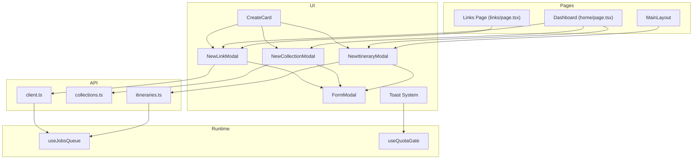
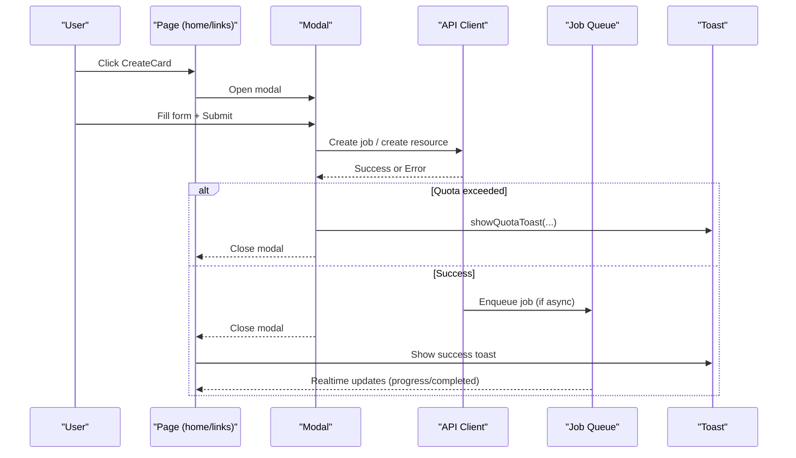
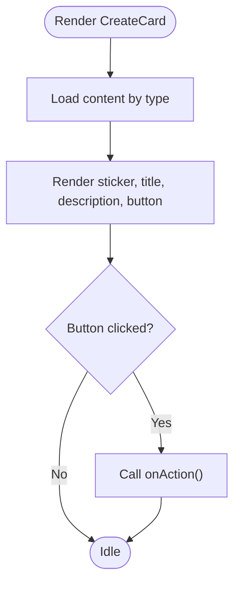
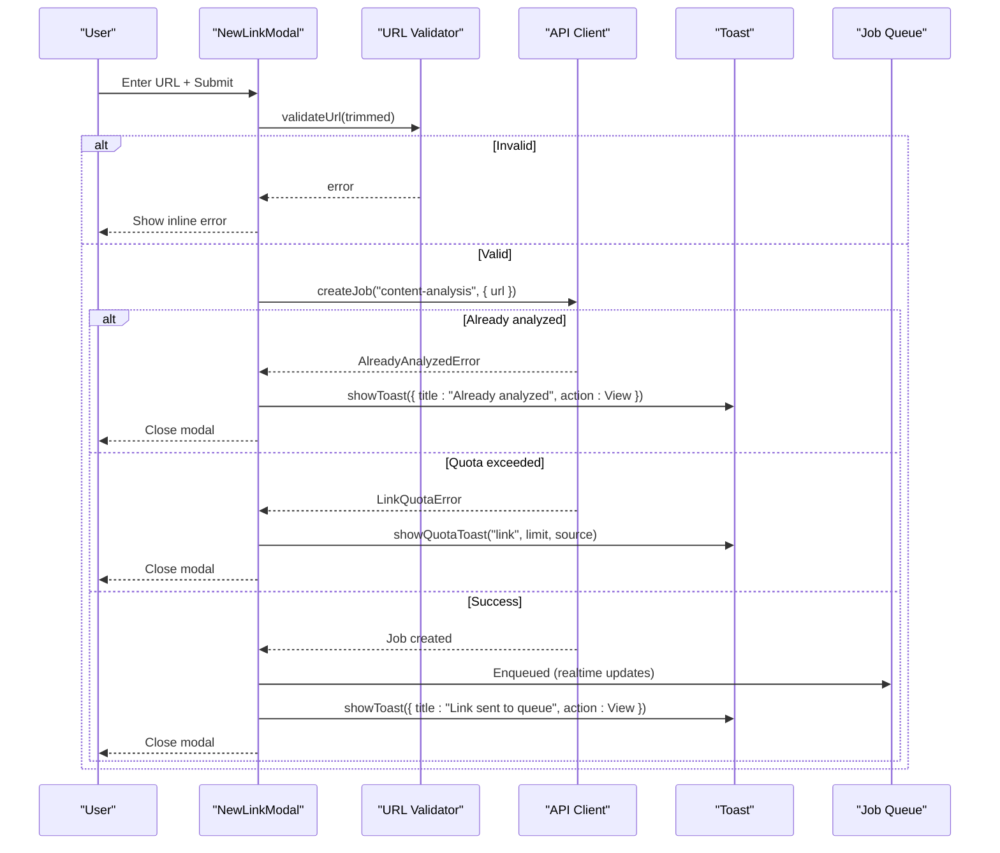
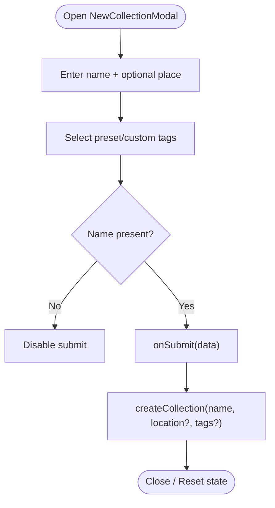
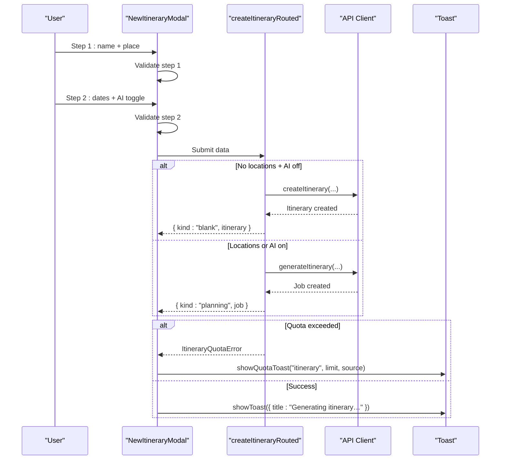
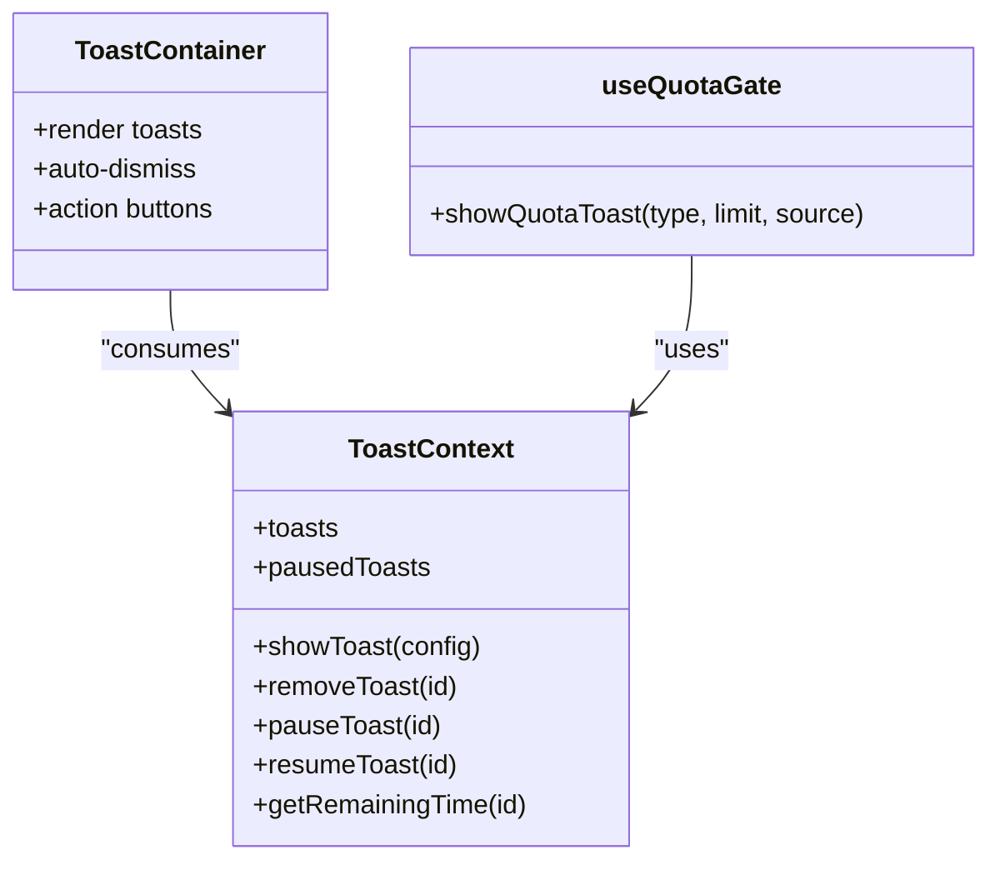
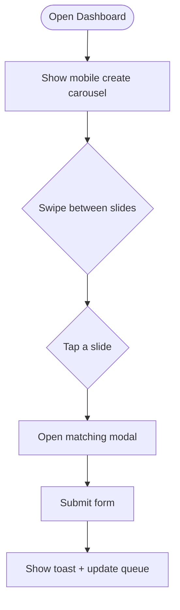
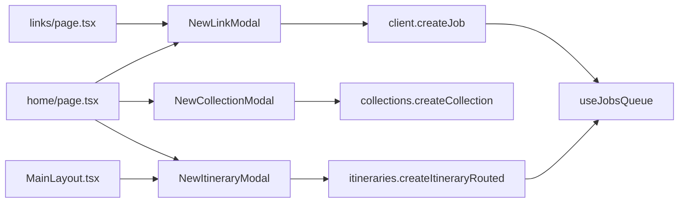

# Creation Workflows & Modals

<cite>
**Referenced Files in This Document**
- [CreateCard.tsx](file://src/components/ui/dashboard/CreateCard.tsx)
- [FormModal.tsx](file://src/components/ui/modals/FormModal.tsx)
- [NewLinkModal.tsx](file://src/components/ui/modals/NewLinkModal.tsx)
- [NewCollectionModal.tsx](file://src/components/ui/modals/NewCollectionModal.tsx)
- [NewItineraryModal.tsx](file://src/components/ui/modals/NewItineraryModal.tsx)
- [ToastContext.tsx](file://src/contexts/ToastContext.tsx)
- [Toast.tsx](file://src/components/ui/primitives/Toast.tsx)
- [useQuotaGate.ts](file://src/hooks/useQuotaGate.ts)
- [client.ts](file://src/lib/api/client.ts)
- [collections.ts](file://src/lib/api/collections.ts)
- [itineraries.ts](file://src/lib/api/itineraries.ts)
- [home/page.tsx](file://src/app/home/page.tsx)
- [links/page.tsx](file://src/app/links/page.tsx)
- [MainLayout.tsx](file://src/components/ui/layout/MainLayout.tsx)
- [useJobsQueue.ts](file://src/hooks/useJobsQueue.ts)
</cite>

## Table of Contents
1. [Introduction](#introduction)
2. [Project Structure](#project-structure)
3. [Core Components](#core-components)
4. [Architecture Overview](#architecture-overview)
5. [Detailed Component Analysis](#detailed-component-analysis)
6. [Dependency Analysis](#dependency-analysis)
7. [Performance Considerations](#performance-considerations)
8. [Troubleshooting Guide](#troubleshooting-guide)
9. [Conclusion](#conclusion)

## Introduction
This document explains the content creation workflows and modal systems that power creating links, collections, and itineraries across the dashboard and related pages. It covers:
- The CreateCard entry points for each creation flow
- Modal form validation, submission handling, and error management
- Link analysis job creation and optimistic UI updates
- Collection creation with optional location support and tags
- Itinerary generation with AI recommendations and quota enforcement
- Quota checking via a centralized hook and toast notifications
- Mobile carousel interface for creation options and its integration into the main dashboard flow

## Project Structure
Creation flows are centered around reusable modals and a shared FormModal shell. Entry points are provided by CreateCard tiles on the home page and other surfaces. Pages orchestrate API calls, queue jobs, and user feedback through toasts and real-time job queues.

**Diagram sources**
- [CreateCard.tsx:15-34](file://src/components/ui/dashboard/CreateCard.tsx#L15-L34)
- [FormModal.tsx:50-76](file://src/components/ui/modals/FormModal.tsx#L50-L76)
- [NewLinkModal.tsx:12-22](file://src/components/ui/modals/NewLinkModal.tsx#L12-L22)
- [NewCollectionModal.tsx:22-40](file://src/components/ui/modals/NewCollectionModal.tsx#L22-L40)
- [NewItineraryModal.tsx:16-43](file://src/components/ui/modals/NewItineraryModal.tsx#L16-L43)
- [home/page.tsx:123-152](file://src/app/home/page.tsx#L123-L152)
- [links/page.tsx:120-135](file://src/app/links/page.tsx#L120-L135)
- [client.ts:130-155](file://src/lib/api/client.ts#L130-L155)
- [collections.ts:78-93](file://src/lib/api/collections.ts#L78-L93)
- [itineraries.ts:59-87](file://src/lib/api/itineraries.ts#L59-L87)
- [useJobsQueue.ts:45-57](file://src/hooks/useJobsQueue.ts#L45-L57)
- [useQuotaGate.ts:16-39](file://src/hooks/useQuotaGate.ts#L16-L39)

**Section sources**
- [CreateCard.tsx:15-34](file://src/components/ui/dashboard/CreateCard.tsx#L15-L34)
- [FormModal.tsx:50-76](file://src/components/ui/modals/FormModal.tsx#L50-L76)
- [home/page.tsx:123-152](file://src/app/home/page.tsx#L123-L152)
- [links/page.tsx:120-135](file://src/app/links/page.tsx#L120-L135)

## Core Components
- CreateCard: A reusable tile exposing three creation actions (link, collection, itinerary) with localized copy and icons. Its button triggers the appropriate modal via an onAction callback.
- FormModal: A shared dialog wrapper providing consistent header, sticker/icon area, form slot, and submit/cancel buttons with loading states and mobile sheet behavior.
- NewLinkModal: Validates URLs, submits link analysis jobs, and handles errors inline or via friendly messages.
- NewCollectionModal: Collects name, optional location, and tags; supports preset and custom tags; submits to create a new collection.
- NewItineraryModal: Two-step wizard collecting trip name, region/location, date range, and AI toggle; validates inputs and submits planning or blank itineraries.

**Section sources**
- [CreateCard.tsx:36-99](file://src/components/ui/dashboard/CreateCard.tsx#L36-L99)
- [FormModal.tsx:78-224](file://src/components/ui/modals/FormModal.tsx#L78-L224)
- [NewLinkModal.tsx:24-136](file://src/components/ui/modals/NewLinkModal.tsx#L24-L136)
- [NewCollectionModal.tsx:42-226](file://src/components/ui/modals/NewCollectionModal.tsx#L42-L226)
- [NewItineraryModal.tsx:45-286](file://src/components/ui/modals/NewItineraryModal.tsx#L45-L286)

## Architecture Overview
The creation system follows a clear separation:
- UI layer: CreateCard tiles open modals; modals handle local validation and state.
- Orchestration layer: Pages manage modal visibility, call APIs, and update UI.
- Backend integration: API client wraps requests, normalizes quota errors, and returns typed results.
- Queue layer: Jobs are created asynchronously; a real-time queue updates progress and completion.
- Feedback layer: Toasts provide immediate user feedback; quota gate centralizes upgrade messaging.

**Diagram sources**
- [home/page.tsx:417-456](file://src/app/home/page.tsx#L417-L456)
- [links/page.tsx:222-260](file://src/app/links/page.tsx#L222-L260)
- [client.ts:130-155](file://src/lib/api/client.ts#L130-L155)
- [useJobsQueue.ts:45-57](file://src/hooks/useJobsQueue.ts#L45-L57)
- [useQuotaGate.ts:16-39](file://src/hooks/useQuotaGate.ts#L16-L39)

## Detailed Component Analysis

### CreateCard
- Purpose: Entry point for creating links, collections, and itineraries from dashboards and entity pages.
- Behavior: Renders a sticker, title, description, and primary action button based on type. Disables action when disabled prop is set.
- Integration: Each page binds onAction to open the corresponding modal.

**Diagram sources**
- [CreateCard.tsx:15-34](file://src/components/ui/dashboard/CreateCard.tsx#L15-L34)
- [CreateCard.tsx:50-99](file://src/components/ui/dashboard/CreateCard.tsx#L50-L99)

**Section sources**
- [CreateCard.tsx:15-34](file://src/components/ui/dashboard/CreateCard.tsx#L15-L34)
- [CreateCard.tsx:50-99](file://src/components/ui/dashboard/CreateCard.tsx#L50-L99)

### NewLinkModal
- Validation: URL validation before submission; clears errors on change; disables submit when empty.
- Submission: Calls createJob("content-analysis", { url }). Handles AlreadyAnalyzedError and LinkQuotaError specially.
- Errors: Converts backend errors to friendly messages; shows inline error text for invalid URLs; uses quota gate for paywall scenarios.
- Optimistic UI: Pages build optimistic content from completed jobs to avoid flicker when transitioning from queue card to link card.

**Diagram sources**
- [NewLinkModal.tsx:56-81](file://src/components/ui/modals/NewLinkModal.tsx#L56-L81)
- [client.ts:130-155](file://src/lib/api/client.ts#L130-L155)
- [links/page.tsx:222-260](file://src/app/links/page.tsx#L222-L260)
- [home/page.tsx:417-456](file://src/app/home/page.tsx#L417-L456)
- [useQuotaGate.ts:16-39](file://src/hooks/useQuotaGate.ts#L16-L39)

**Section sources**
- [NewLinkModal.tsx:24-136](file://src/components/ui/modals/NewLinkModal.tsx#L24-L136)
- [links/page.tsx:222-260](file://src/app/links/page.tsx#L222-L260)
- [home/page.tsx:417-456](file://src/app/home/page.tsx#L417-L456)

### NewCollectionModal
- Fields: Name (required), optional PlaceAutocomplete for country/region/coordinates, tag selection (preset + custom).
- Validation: Requires non-empty name; disables submit while busy.
- Submission: Sends name, optional location fields, and tags to createCollection.
- User feedback: Controlled by parent pages; modal itself focuses on form UX and state reset on close.

**Diagram sources**
- [NewCollectionModal.tsx:118-135](file://src/components/ui/modals/NewCollectionModal.tsx#L118-L135)
- [collections.ts:78-93](file://src/lib/api/collections.ts#L78-L93)

**Section sources**
- [NewCollectionModal.tsx:42-226](file://src/components/ui/modals/NewCollectionModal.tsx#L42-L226)
- [collections.ts:78-93](file://src/lib/api/collections.ts#L78-L93)

### NewItineraryModal
- Wizard: Step 1 collects trip name and region/place; Step 2 collects date range and AI toggle.
- Validation: Shakes invalid fields; requires name + place on step 1; requires dates on step 2.
- Submission: Routes to createItineraryRouted which either creates a blank itinerary or starts an async planning job with AI recommendations enabled/disabled.
- Quota: If ItineraryQuotaError is thrown, shows quota toast and refreshes usage queries.

**Diagram sources**
- [NewItineraryModal.tsx:118-160](file://src/components/ui/modals/NewItineraryModal.tsx#L118-L160)
- [itineraries.ts:411-439](file://src/lib/api/itineraries.ts#L411-L439)
- [MainLayout.tsx:181-216](file://src/components/ui/layout/MainLayout.tsx#L181-L216)
- [home/page.tsx:492-516](file://src/app/home/page.tsx#L492-L516)

**Section sources**
- [NewItineraryModal.tsx:45-286](file://src/components/ui/modals/NewItineraryModal.tsx#L45-L286)
- [itineraries.ts:59-87](file://src/lib/api/itineraries.ts#L59-L87)
- [itineraries.ts:411-439](file://src/lib/api/itineraries.ts#L411-L439)
- [MainLayout.tsx:181-216](file://src/components/ui/layout/MainLayout.tsx#L181-L216)
- [home/page.tsx:492-516](file://src/app/home/page.tsx#L492-L516)

### FormModal
- Shared layout: Sticker/icon, title/description, form slot, cancel/submit buttons with submitting state.
- Mobile behavior: Renders as bottom sheet on phones; accessible controls and keyboard-friendly interactions.
- Accessibility: Uses Dialog primitives for focus management and ARIA attributes.

**Section sources**
- [FormModal.tsx:50-224](file://src/components/ui/modals/FormModal.tsx#L50-L224)

### Toast Notifications and Quota Gate
- Toast system: Centralized context provides showToast, pause/resume, and auto-dismiss with progress bar.
- Quota gate: Single hook emits consistent upgrade prompts for link and itinerary limits with a billing action.

**Diagram sources**
- [ToastContext.tsx:28-36](file://src/contexts/ToastContext.tsx#L28-L36)
- [Toast.tsx:47-174](file://src/components/ui/primitives/Toast.tsx#L47-L174)
- [useQuotaGate.ts:16-39](file://src/hooks/useQuotaGate.ts#L16-L39)

**Section sources**
- [ToastContext.tsx:28-36](file://src/contexts/ToastContext.tsx#L28-L36)
- [Toast.tsx:47-174](file://src/components/ui/primitives/Toast.tsx#L47-L174)
- [useQuotaGate.ts:16-39](file://src/hooks/useQuotaGate.ts#L16-L39)

### Mobile Carousel Interface
- Dashboard renders a horizontal carousel of CreateCard tiles for link, collection, and itinerary on mobile.
- Interaction: Pointer-based drag with snap scrolling; active slide indicator; click suppression during drag.
- Integration: Each slide opens the corresponding modal via state toggles managed by the dashboard page.

**Diagram sources**
- [home/page.tsx:713-763](file://src/app/home/page.tsx#L713-L763)
- [CreateCard.tsx:15-34](file://src/components/ui/dashboard/CreateCard.tsx#L15-L34)

**Section sources**
- [home/page.tsx:713-763](file://src/app/home/page.tsx#L713-L763)

## Dependency Analysis
- Modal dependencies: All creation modals depend on FormModal for consistent presentation and accessibility.
- Page dependencies: Home and Links pages wire modals to API calls and job queues; MainLayout also triggers itinerary creation from the navbar.
- API dependencies:
  - Link creation uses client.createJob with quota error mapping.
  - Collection creation uses collections.createCollection with optional location and tags.
  - Itinerary creation routes through itineraries.createItineraryRouted to decide between blank or AI-driven planning.
- Queue dependencies: useJobsQueue listens to realtime job updates and surfaces transitions to UI components.

**Diagram sources**
- [NewLinkModal.tsx:56-81](file://src/components/ui/modals/NewLinkModal.tsx#L56-L81)
- [NewCollectionModal.tsx:118-135](file://src/components/ui/modals/NewCollectionModal.tsx#L118-L135)
- [NewItineraryModal.tsx:118-160](file://src/components/ui/modals/NewItineraryModal.tsx#L118-L160)
- [client.ts:130-155](file://src/lib/api/client.ts#L130-L155)
- [collections.ts:78-93](file://src/lib/api/collections.ts#L78-L93)
- [itineraries.ts:411-439](file://src/lib/api/itineraries.ts#L411-L439)
- [useJobsQueue.ts:45-57](file://src/hooks/useJobsQueue.ts#L45-L57)
- [home/page.tsx:123-152](file://src/app/home/page.tsx#L123-L152)
- [links/page.tsx:120-135](file://src/app/links/page.tsx#L120-L135)
- [MainLayout.tsx:181-216](file://src/components/ui/layout/MainLayout.tsx#L181-L216)

**Section sources**
- [client.ts:130-155](file://src/lib/api/client.ts#L130-L155)
- [collections.ts:78-93](file://src/lib/api/collections.ts#L78-L93)
- [itineraries.ts:411-439](file://src/lib/api/itineraries.ts#L411-L439)
- [useJobsQueue.ts:45-57](file://src/hooks/useJobsQueue.ts#L45-L57)
- [home/page.tsx:123-152](file://src/app/home/page.tsx#L123-L152)
- [links/page.tsx:120-135](file://src/app/links/page.tsx#L120-L135)
- [MainLayout.tsx:181-216](file://src/components/ui/layout/MainLayout.tsx#L181-L216)

## Performance Considerations
- Optimistic UI:
  - Links: BuildOptimisticContent maps completed jobs to link cards immediately, keyed by content_id, preventing flicker when the canonical row arrives.
  - Itineraries: BuildOptimisticItineraryItem inserts finished planning jobs into the feed before the full refresh lands.
- Progress animations: useProgressAnimation smooths percentage changes and trusts worker-reported percent when available; ETA countdown avoids misleading precision near completion.
- Realtime efficiency: useJobsQueue deduplicates channels per instance and filters visible jobs to reduce re-renders.

[No sources needed since this section provides general guidance]

## Troubleshooting Guide
- Invalid URL in link creation: Inline error displayed under input; ensure URL passes validator before submission.
- Quota exceeded:
  - Links: LinkQuotaError triggers showQuotaToast with plan details and billing action; usage queries refreshed.
  - Itineraries: ItineraryQuotaError triggers showQuotaToast; usage queries refreshed.
- Job failures:
  - Retry and detach operations surface error toasts if they fail; failed jobs pin to front for visibility.
- Modal state resets:
  - Modals reset internal state on close to prevent stale values on reopen.

**Section sources**
- [NewLinkModal.tsx:56-81](file://src/components/ui/modals/NewLinkModal.tsx#L56-L81)
- [links/page.tsx:199-220](file://src/app/links/page.tsx#L199-L220)
- [useQuotaGate.ts:16-39](file://src/hooks/useQuotaGate.ts#L16-L39)
- [useJobsQueue.ts:269-295](file://src/hooks/useJobsQueue.ts#L269-L295)

## Conclusion
The creation workflows combine a consistent modal system, robust validation, and clear user feedback through toasts and quotas. Pages orchestrate asynchronous jobs with optimistic updates for seamless experiences. The mobile carousel offers intuitive access to creation options, integrating tightly with the dashboard’s state and navigation.

[No sources needed since this section summarizes without analyzing specific files]