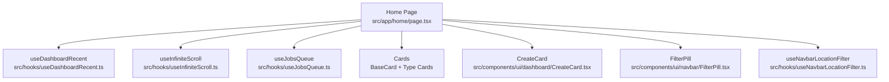
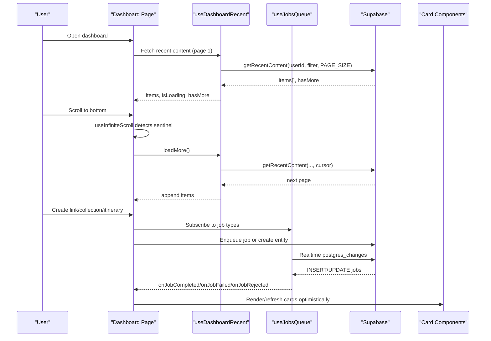
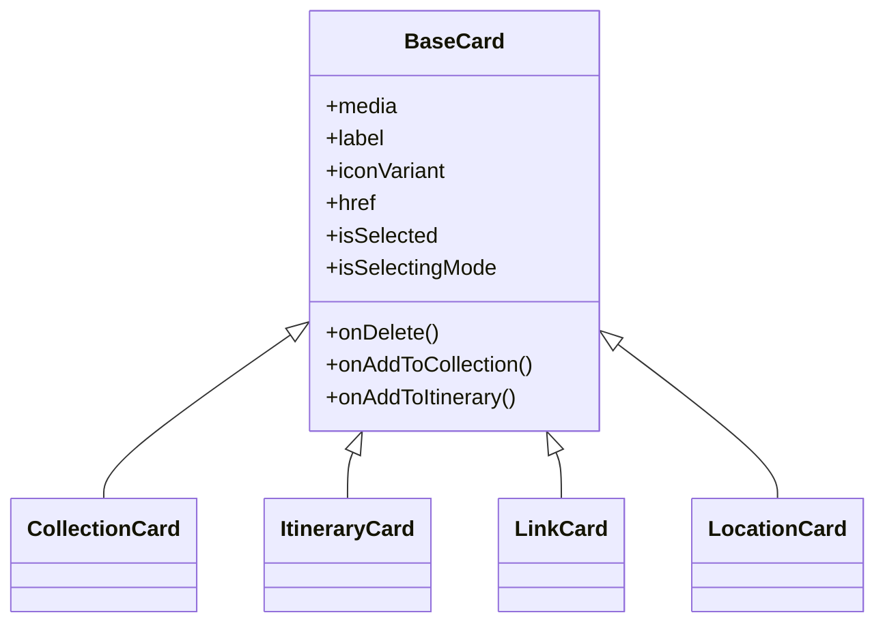
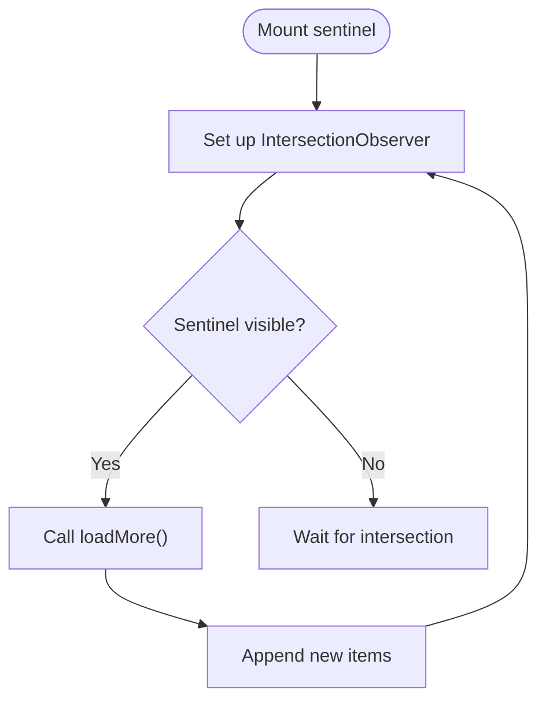
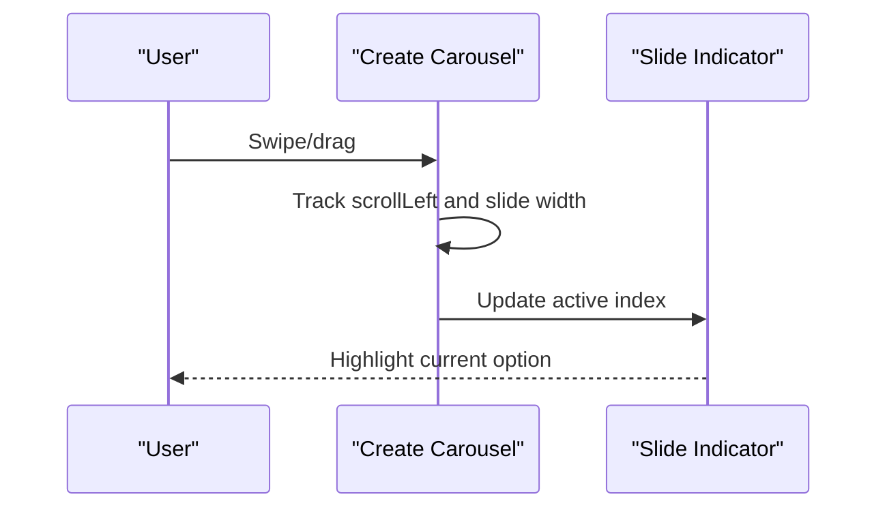
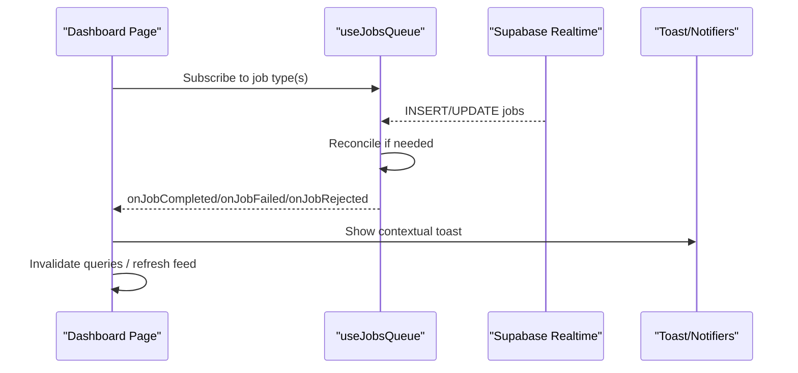
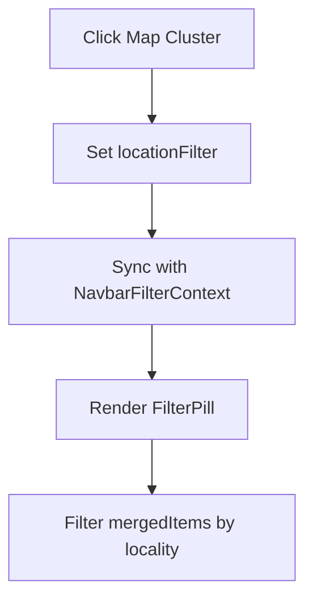
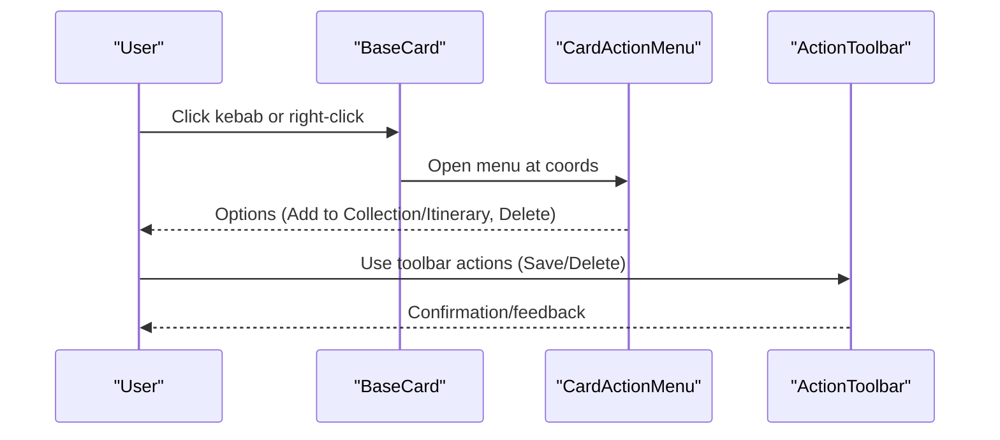
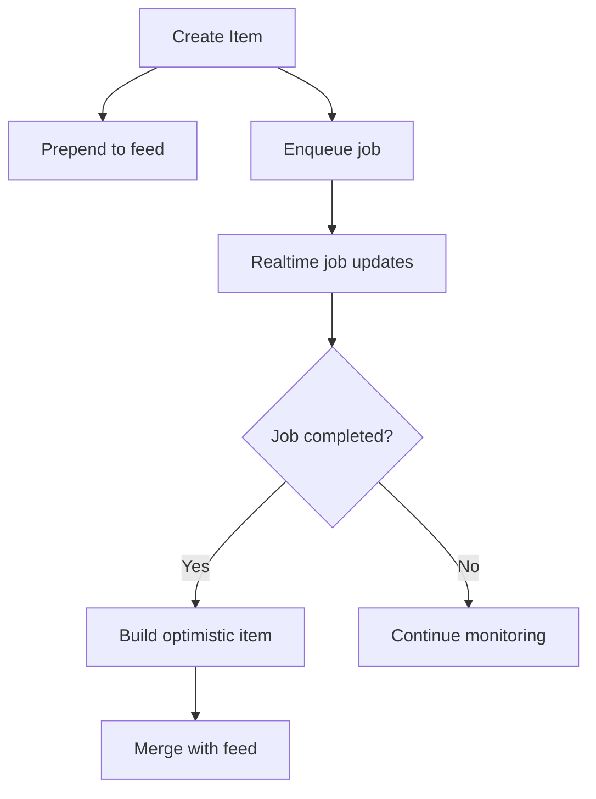
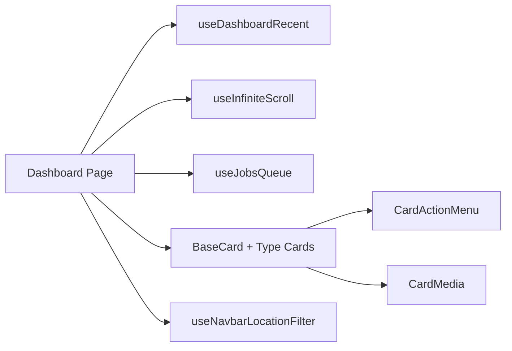

# Dashboard Interface

<cite>
**Referenced Files in This Document**
- [page.tsx](file://src/app/home/page.tsx)
- [CreateCard.tsx](file://src/components/ui/dashboard/CreateCard.tsx)
- [useDashboardRecent.ts](file://src/hooks/useDashboardRecent.ts)
- [useInfiniteScroll.ts](file://src/hooks/useInfiniteScroll.ts)
- [useJobsQueue.ts](file://src/hooks/useJobsQueue.ts)
- [BaseCard.tsx](file://src/components/ui/cards/BaseCard.tsx)
- [CollectionCard.tsx](file://src/components/ui/cards/CollectionCard.tsx)
- [ItineraryCard.tsx](file://src/components/ui/cards/ItineraryCard.tsx)
- [LinkCard.tsx](file://src/components/ui/cards/LinkCard.tsx)
- [LocationCard.tsx](file://src/components/ui/cards/LocationCard.tsx)
- [ActionToolbar.tsx](file://src/components/ui/dashboard/ActionToolbar.tsx)
- [CardActionMenu.tsx](file://src/components/ui/dashboard/CardActionMenu.tsx)
- [FilterPill.tsx](file://src/components/ui/navbar/FilterPill.tsx)
- [useNavbarLocationFilter.ts](file://src/hooks/useNavbarLocationFilter.ts)
</cite>

## Table of Contents
1. [Introduction](#introduction)
2. [Project Structure](#project-structure)
3. [Core Components](#core-components)
4. [Architecture Overview](#architecture-overview)
5. [Detailed Component Analysis](#detailed-component-analysis)
6. [Dependency Analysis](#dependency-analysis)
7. [Performance Considerations](#performance-considerations)
8. [Troubleshooting Guide](#troubleshooting-guide)
9. [Conclusion](#conclusion)

## Introduction
This document explains the Argo dashboard interface that serves as the main entry point for users to view recent content, create new items (links, collections, itineraries), and manage workflows. It covers the bento grid layout, infinite scrolling, mobile-responsive design with a carousel, integration with job queues for background processing, card rendering system, filtering capabilities (including location-based filtering), user interactions, optimistic updates, real-time job monitoring, and error handling strategies.

## Project Structure
The dashboard is implemented as a Next.js client component page that composes:
- A responsive header with greeting and usage summary
- Mobile-only create carousel and content filters
- A bento grid displaying recent content cards
- Real-time job queue integration for background tasks
- Location-based filtering via map clusters and navbar filter pill

**Diagram sources**
- [page.tsx:123-800](file://src/app/home/page.tsx#L123-L800)
- [useDashboardRecent.ts:39-131](file://src/hooks/useDashboardRecent.ts#L39-L131)
- [useInfiniteScroll.ts:29-76](file://src/hooks/useInfiniteScroll.ts#L29-L76)
- [useJobsQueue.ts:45-295](file://src/hooks/useJobsQueue.ts#L45-L295)
- [BaseCard.tsx:57-211](file://src/components/ui/cards/BaseCard.tsx#L57-L211)
- [CreateCard.tsx:50-99](file://src/components/ui/dashboard/CreateCard.tsx#L50-L99)
- [FilterPill.tsx:20-73](file://src/components/ui/navbar/FilterPill.tsx#L20-L73)
- [useNavbarLocationFilter.ts:9-29](file://src/hooks/useNavbarLocationFilter.ts#L9-L29)

**Section sources**
- [page.tsx:123-800](file://src/app/home/page.tsx#L123-L800)

## Core Components
- Dashboard page orchestrates data fetching, creation flows, job queue subscriptions, and UI state for filtering and mobile navigation.
- useDashboardRecent provides paginated recent content with sorting, prepend/update/remove helpers, and refresh.
- useInfiniteScroll triggers loadMore when a sentinel enters the viewport or scroll container.
- useJobsQueue subscribes to realtime job updates, reconciles missed updates, and exposes remove/upsert helpers.
- Card components render entity-specific visuals while sharing common behavior from BaseCard (kebab menu, right-click actions, selection styling).
- CreateCard drives the three creation flows (link, collection, itinerary) via modals.
- ActionToolbar supports multi-select operations across locations and destinations.
- FilterPill and useNavbarLocationFilter synchronize active location filters into the shared navbar.

**Section sources**
- [useDashboardRecent.ts:39-131](file://src/hooks/useDashboardRecent.ts#L39-L131)
- [useInfiniteScroll.ts:29-76](file://src/hooks/useInfiniteScroll.ts#L29-L76)
- [useJobsQueue.ts:45-295](file://src/hooks/useJobsQueue.ts#L45-L295)
- [BaseCard.tsx:57-211](file://src/components/ui/cards/BaseCard.tsx#L57-L211)
- [CreateCard.tsx:50-99](file://src/components/ui/dashboard/CreateCard.tsx#L50-L99)
- [ActionToolbar.tsx:96-372](file://src/components/ui/dashboard/ActionToolbar.tsx#L96-L372)
- [FilterPill.tsx:20-73](file://src/components/ui/navbar/FilterPill.tsx#L20-L73)
- [useNavbarLocationFilter.ts:9-29](file://src/hooks/useNavbarLocationFilter.ts#L9-L29)

## Architecture Overview
The dashboard integrates several subsystems:
- Data layer: useDashboardRecent fetches recent content; useMapClusters supplies locality mappings; Supabase queries power the feed.
- Job layer: useJobsQueue listens to realtime changes on jobs, emits completion/failure/rejection events, and reconciles missed updates.
- UI layer: Bento grid renders cards; mobile carousel guides creation; filters narrow content by type and locality.
- Interaction layer: Creation flows enqueue jobs or create entities synchronously; optimistic updates keep the UI responsive.

**Diagram sources**
- [page.tsx:172-240](file://src/app/home/page.tsx#L172-L240)
- [useDashboardRecent.ts:60-97](file://src/hooks/useDashboardRecent.ts#L60-L97)
- [useInfiniteScroll.ts:42-67](file://src/hooks/useInfiniteScroll.ts#L42-L67)
- [useJobsQueue.ts:138-260](file://src/hooks/useJobsQueue.ts#L138-L260)

## Detailed Component Analysis

### Dashboard Page (Main Entry Point)
Responsibilities:
- Displays recent content using useDashboardRecent and merges optimistic itineraries.
- Manages creation flows:
  - Link: enqueues content-analysis job; handles quota and already-analyzed errors.
  - Collection: creates synchronously and prepends to feed.
  - Itinerary: either creates blank immediately or enqueues planning job; shows optimistic item until refresh.
- Integrates job queues for both content-analysis and itinerary-planning, with toast notifications and query invalidation.
- Implements location-based filtering via map cluster clicks and syncs with navbar filter pill.
- Provides mobile carousel for creation options and content type filters.
- Renders bento grid with cards and supports infinite scrolling.

Key behaviors:
- Optimistic updates:
  - Prepend created items immediately.
  - Build optimistic itinerary item from completed job result to avoid flicker during handover.
- Real-time job monitoring:
  - Subscribes to job types; refreshes feed and shows toasts on completion/failure/rejection.
- Error handling:
  - Quota errors trigger upgrade toasts.
  - Already analyzed links show “View” action.
  - Deletion and retry operations surface user-friendly toasts.

**Section sources**
- [page.tsx:92-114](file://src/app/home/page.tsx#L92-L114)
- [page.tsx:172-240](file://src/app/home/page.tsx#L172-L240)
- [page.tsx:281-297](file://src/app/home/page.tsx#L281-L297)
- [page.tsx:381-415](file://src/app/home/page.tsx#L381-L415)
- [page.tsx:417-551](file://src/app/home/page.tsx#L417-L551)
- [page.tsx:566-633](file://src/app/home/page.tsx#L566-L633)
- [page.tsx:638-679](file://src/app/home/page.tsx#L638-L679)
- [page.tsx:681-800](file://src/app/home/page.tsx#L681-L800)

### Bento Grid and Card Rendering System
- The bento grid uses CSS custom properties for columns and aspect ratios, enabling responsive tile sizing.
- Cards are rendered via a unified renderer that selects the appropriate card type (collection, itinerary, location, link) based on item metadata.
- BaseCard provides:
  - Shared shell with media area, label, category badge, and kebab/right-click menu.
  - Selection styling for multi-select mode.
  - Optional prefetching on hover.
- Type-specific cards customize media:
  - CollectionCard supports image grids and fallback images.
  - ItineraryCard and LocationCard use CardMedia for consistent visuals.
  - LinkCard renders a phone-frame thumbnail with optional gradient fallback.

**Diagram sources**
- [BaseCard.tsx:57-211](file://src/components/ui/cards/BaseCard.tsx#L57-L211)
- [CollectionCard.tsx:79-115](file://src/components/ui/cards/CollectionCard.tsx#L79-L115)
- [ItineraryCard.tsx:30-55](file://src/components/ui/cards/ItineraryCard.tsx#L30-L55)
- [LinkCard.tsx:29-79](file://src/components/ui/cards/LinkCard.tsx#L29-L79)
- [LocationCard.tsx:30-55](file://src/components/ui/cards/LocationCard.tsx#L30-L55)

**Section sources**
- [page.tsx:638-679](file://src/app/home/page.tsx#L638-L679)
- [BaseCard.tsx:57-211](file://src/components/ui/cards/BaseCard.tsx#L57-L211)
- [CollectionCard.tsx:79-115](file://src/components/ui/cards/CollectionCard.tsx#L79-L115)
- [ItineraryCard.tsx:30-55](file://src/components/ui/cards/ItineraryCard.tsx#L30-L55)
- [LinkCard.tsx:29-79](file://src/components/ui/cards/LinkCard.tsx#L29-L79)
- [LocationCard.tsx:30-55](file://src/components/ui/cards/LocationCard.tsx#L30-L55)

### Infinite Scrolling Implementation
- useInfiniteScroll attaches an IntersectionObserver to a sentinel element at the list’s end.
- It finds the nearest scrollable ancestor so rootMargin works inside overflow containers.
- When enabled and the sentinel intersects, it calls loadMore to fetch additional pages.

**Diagram sources**
- [useInfiniteScroll.ts:42-67](file://src/hooks/useInfiniteScroll.ts#L42-L67)

**Section sources**
- [useInfiniteScroll.ts:29-76](file://src/hooks/useInfiniteScroll.ts#L29-L76)
- [page.tsx:281-283](file://src/app/home/page.tsx#L281-L283)

### Mobile-Responsive Design and Carousel Navigation
- On mobile, a horizontal carousel presents creation options with snap scrolling and pointer drag support.
- Active slide tracking updates dot indicators based on scroll position.
- Content filters allow switching between all, links, collections, and itineraries on small screens.

**Diagram sources**
- [page.tsx:305-379](file://src/app/home/page.tsx#L305-L379)
- [page.tsx:713-763](file://src/app/home/page.tsx#L713-L763)

**Section sources**
- [page.tsx:305-379](file://src/app/home/page.tsx#L305-L379)
- [page.tsx:713-763](file://src/app/home/page.tsx#L713-L763)

### Integration with Job Queues for Background Processing
- useJobsQueue subscribes to realtime job changes per user and type, maintaining a sorted queue where failed jobs pin to the front.
- It reconciles missed updates on visibility change or channel reconnect to prevent stuck progress states.
- Dashboard hooks handle:
  - content-analysis: completion shows success toast with thumbnail and “View” action; failures and rejections display appropriate messages.
  - itinerary-planning: completion invalidates relevant queries, builds optimistic itinerary item, and refreshes feed.

**Diagram sources**
- [useJobsQueue.ts:78-260](file://src/hooks/useJobsQueue.ts#L78-L260)
- [page.tsx:192-240](file://src/app/home/page.tsx#L192-L240)

**Section sources**
- [useJobsQueue.ts:45-295](file://src/hooks/useJobsQueue.ts#L45-L295)
- [page.tsx:192-240](file://src/app/home/page.tsx#L192-L240)

### Filtering Capabilities and Location-Based Filtering
- Mobile content filters restrict displayed items by type on small screens.
- Location-based filtering:
  - Map cluster click sets a locality filter and scrolls to the cards section.
  - useNavbarLocationFilter syncs the active filter into the shared navbar pill, passing locality entity IDs.
  - FilterPill displays the active filter and allows dismissal.

**Diagram sources**
- [page.tsx:294-303](file://src/app/home/page.tsx#L294-L303)
- [page.tsx:387-397](file://src/app/home/page.tsx#L387-L397)
- [useNavbarLocationFilter.ts:9-29](file://src/hooks/useNavbarLocationFilter.ts#L9-L29)
- [FilterPill.tsx:20-73](file://src/components/ui/navbar/FilterPill.tsx#L20-L73)

**Section sources**
- [page.tsx:387-397](file://src/app/home/page.tsx#L387-L397)
- [useNavbarLocationFilter.ts:9-29](file://src/hooks/useNavbarLocationFilter.ts#L9-L29)
- [FilterPill.tsx:20-73](file://src/components/ui/navbar/FilterPill.tsx#L20-L73)

### User Interaction Patterns and Multi-Select Actions
- BaseCard supports:
  - Kebab menu anchored under the button or at cursor on right-click.
  - Right-click context menu for quick actions.
  - Selection styling for rubber-band multi-select mode.
- ActionToolbar appears during multi-select to:
  - Save selected items to collections or itineraries.
  - Generate itineraries (when provided).
  - Delete selections and clear selection.

**Diagram sources**
- [BaseCard.tsx:81-159](file://src/components/ui/cards/BaseCard.tsx#L81-L159)
- [CardActionMenu.tsx:52-115](file://src/components/ui/dashboard/CardActionMenu.tsx#L52-L115)
- [ActionToolbar.tsx:96-372](file://src/components/ui/dashboard/ActionToolbar.tsx#L96-L372)

**Section sources**
- [BaseCard.tsx:57-211](file://src/components/ui/cards/BaseCard.tsx#L57-L211)
- [CardActionMenu.tsx:52-115](file://src/components/ui/dashboard/CardActionMenu.tsx#L52-L115)
- [ActionToolbar.tsx:96-372](file://src/components/ui/dashboard/ActionToolbar.tsx#L96-L372)

### Optimistic Updates and Real-Time Job Monitoring
- Optimistic updates:
  - Prepend newly created items immediately to the feed.
  - Build an optimistic itinerary item from the completed job result to fill the grid slot before refresh.
- Real-time monitoring:
  - useJobsQueue maintains job status transitions and emits terminal callbacks.
  - Dashboard invalidates queries and refreshes feed upon completion.

**Diagram sources**
- [page.tsx:178-190](file://src/app/home/page.tsx#L178-L190)
- [page.tsx:227-254](file://src/app/home/page.tsx#L227-L254)
- [useJobsQueue.ts:89-136](file://src/hooks/useJobsQueue.ts#L89-L136)

**Section sources**
- [page.tsx:178-190](file://src/app/home/page.tsx#L178-L190)
- [page.tsx:227-254](file://src/app/home/page.tsx#L227-L254)
- [useJobsQueue.ts:89-136](file://src/hooks/useJobsQueue.ts#L89-L136)

### Error Handling Strategies
- Quota errors:
  - For links and itineraries, show upgrade toasts and invalidate usage queries.
- Duplicate analysis:
  - Already analyzed links show a “View” action instead of re-enqueuing.
- Job failures and rejections:
  - Display contextual toasts; itinerary failures rely on queue card and global notifier to avoid duplicate announcements.
- Network/connection issues:
  - useJobsQueue tracks connectionError and reconciles missed updates on visibility change or reconnect.

**Section sources**
- [page.tsx:417-456](file://src/app/home/page.tsx#L417-L456)
- [page.tsx:534-551](file://src/app/home/page.tsx#L534-L551)
- [page.tsx:192-217](file://src/app/home/page.tsx#L192-L217)
- [useJobsQueue.ts:250-260](file://src/hooks/useJobsQueue.ts#L250-L260)

## Dependency Analysis
The dashboard depends on:
- Data hooks for recent content and infinite loading.
- Job queue hook for background processing and realtime updates.
- Card components for consistent rendering and interaction.
- Navbar filter context for synchronized location filtering.

**Diagram sources**
- [page.tsx:172-240](file://src/app/home/page.tsx#L172-L240)
- [useDashboardRecent.ts:39-131](file://src/hooks/useDashboardRecent.ts#L39-L131)
- [useInfiniteScroll.ts:29-76](file://src/hooks/useInfiniteScroll.ts#L29-L76)
- [useJobsQueue.ts:45-295](file://src/hooks/useJobsQueue.ts#L45-L295)
- [BaseCard.tsx:57-211](file://src/components/ui/cards/BaseCard.tsx#L57-L211)
- [CardActionMenu.tsx:52-115](file://src/components/ui/dashboard/CardActionMenu.tsx#L52-L115)

**Section sources**
- [page.tsx:172-240](file://src/app/home/page.tsx#L172-L240)
- [useDashboardRecent.ts:39-131](file://src/hooks/useDashboardRecent.ts#L39-L131)
- [useInfiniteScroll.ts:29-76](file://src/hooks/useInfiniteScroll.ts#L29-L76)
- [useJobsQueue.ts:45-295](file://src/hooks/useJobsQueue.ts#L45-L295)
- [BaseCard.tsx:57-211](file://src/components/ui/cards/BaseCard.tsx#L57-L211)
- [CardActionMenu.tsx:52-115](file://src/components/ui/dashboard/CardActionMenu.tsx#L52-L115)

## Performance Considerations
- Pagination and deduplication:
  - useDashboardRecent avoids duplicates when appending pages and uses a cursor for efficient pagination.
- Memoization:
  - Merged items and filtered lists are memoized to prevent unnecessary recalculations.
- Observer efficiency:
  - useInfiniteScroll targets the nearest scrollable ancestor to ensure accurate intersection detection.
- Realtime reconciliation:
  - useJobsQueue reconciles missed updates to prevent stale progress states and reduce network chatter.

[No sources needed since this section provides general guidance]

## Troubleshooting Guide
Common issues and resolutions:
- Stuck job progress:
  - Ensure visibilitychange handler triggers reconciliation; check connectionError state and reconnect behavior.
- Duplicate toasts:
  - Avoid emitting toasts in multiple places for the same event; rely on centralized notifiers where applicable.
- Quota limits:
  - Validate usage queries and show upgrade prompts; invalidate usage caches after attempts.
- Missing cards after creation:
  - Confirm optimistic prepend logic and that refresh clears optimistic placeholders once real data arrives.

**Section sources**
- [useJobsQueue.ts:161-165](file://src/hooks/useJobsQueue.ts#L161-L165)
- [useJobsQueue.ts:250-260](file://src/hooks/useJobsQueue.ts#L250-L260)
- [page.tsx:227-240](file://src/app/home/page.tsx#L227-L240)
- [page.tsx:417-456](file://src/app/home/page.tsx#L417-L456)
- [page.tsx:534-551](file://src/app/home/page.tsx#L534-L551)

## Conclusion
The Argo dashboard provides a cohesive, responsive interface for managing recent content and creating new items efficiently. Its architecture combines paginated data fetching, infinite scrolling, real-time job monitoring, and robust filtering to deliver a smooth user experience. Optimistic updates and comprehensive error handling ensure responsiveness and clarity throughout user workflows.