# Dashboard Layout & Navigation

<cite>
**Referenced Files in This Document**
- [page.tsx](file://src/app/home/page.tsx)
- [globals.css](file://src/app/globals.css)
- [CreateCard.tsx](file://src/components/ui/dashboard/CreateCard.tsx)
- [UsageCard.tsx](file://src/components/ui/primitives/UsageCard.tsx)
- [FilterPill.tsx](file://src/components/ui/navbar/FilterPill.tsx)
- [useMediaQuery.ts](file://src/hooks/useMediaQuery.ts)
- [layout.tsx](file://src/app/layout.tsx)
</cite>

## Table of Contents
1. Introduction
2. Project Structure
3. Core Components
4. Architecture Overview
5. Detailed Component Analysis
6. Dependency Analysis
7. Performance Considerations
8. Troubleshooting Guide
9. Conclusion

## Introduction
This document explains the dashboard layout and navigation system with a focus on:
- Responsive bento grid layout for cards and tiles
- Mobile carousel navigation for creation workflows
- Desktop grid adaptations and map placement
- Header section with user greeting and usage statistics
- Location filter integration and mobile-specific content filtering
- Container queries for card sizing and responsive behavior
- Accessibility features including ARIA labels and keyboard navigation

The dashboard is implemented as a Next.js client component that composes reusable UI primitives, hooks, and CSS utilities to deliver a consistent experience across devices.

## Project Structure
At a high level, the dashboard page orchestrates:
- A header row with a personalized greeting and a usage statistics card
- A mobile-only create carousel (links, collections, itineraries)
- A mobile-only content filter bar (All, Links, Collections, Itineraries)
- A container-queried bento grid that adapts columns and tile ratios from mobile to desktop
- A pinned map tile that changes size/placement at breakpoints
- A feed of recent items with infinite scroll and optimistic updates for newly created or queued items

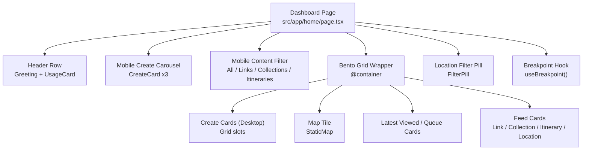

**Diagram sources**
- [page.tsx:681-947](file://src/app/home/page.tsx#L681-L947)
- [globals.css:1080-1102](file://src/app/globals.css#L1080-L1102)

**Section sources**
- [page.tsx:681-947](file://src/app/home/page.tsx#L681-L947)
- [globals.css:1080-1102](file://src/app/globals.css#L1080-L1102)

## Core Components
- Dashboard page: central controller for state, filters, creation flows, and rendering of the bento grid and modals.
- CreateCard: promotional card for starting link analysis, collection creation, or itinerary planning.
- UsageCard: displays quota usage with progress and optional upgrade link.
- FilterPill: active location filter indicator with dismiss action.
- Breakpoint hook: provides device-class flags used to toggle mobile-only UI and filter logic.

Key responsibilities:
- Compose header, carousel, filters, and grid
- Manage location-based filtering via cluster selection
- Handle creation workflows and queue jobs
- Render responsive layouts using container queries and breakpoint-aware classes

**Section sources**
- [page.tsx:123-176](file://src/app/home/page.tsx#L123-L176)
- [CreateCard.tsx:1-99](file://src/components/ui/dashboard/CreateCard.tsx#L1-L99)
- [UsageCard.tsx:1-99](file://src/components/ui/primitives/UsageCard.tsx#L1-L99)
- [FilterPill.tsx:1-73](file://src/components/ui/navbar/FilterPill.tsx#L1-L73)
- [useMediaQuery.ts:53-67](file://src/hooks/useMediaQuery.ts#L53-L67)

## Architecture Overview
The dashboard uses a layered architecture:
- Presentation layer: Tailwind utility classes, container queries, and semantic HTML structure
- Component layer: Reusable cards and UI primitives
- State and data layer: Hooks for recent content, jobs queue, map clusters, and profile/usage data
- Routing and navigation: Modals and links to entity pages

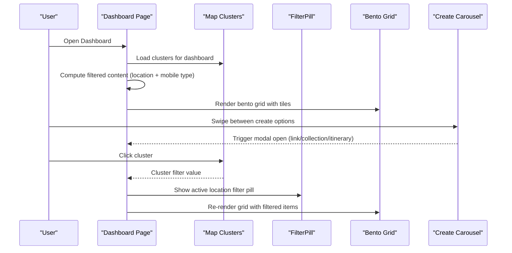

**Diagram sources**
- [page.tsx:294-303](file://src/app/home/page.tsx#L294-L303)
- [page.tsx:387-405](file://src/app/home/page.tsx#L387-L405)
- [page.tsx:702-711](file://src/app/home/page.tsx#L702-L711)
- [page.tsx:713-763](file://src/app/home/page.tsx#L713-L763)
- [page.tsx:795-916](file://src/app/home/page.tsx#L795-L916)

## Detailed Component Analysis

### Bento Grid and Responsive Card Sizing
- The grid is defined by a CSS class that sets column count, gap, and derived row height based on a fixed aspect ratio.
- Column count and ratio are overridden per breakpoint using inline CSS custom properties, enabling a fluid number of columns while preserving tile proportions.
- The grid must be inside an ancestor with container-type inline-size so that 100cqw resolves correctly; the dashboard wraps the grid in a container element.

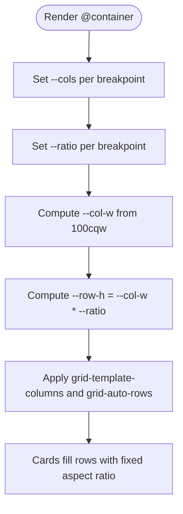

**Diagram sources**
- [globals.css:1080-1102](file://src/app/globals.css#L1080-L1102)
- [page.tsx:795-801](file://src/app/home/page.tsx#L795-L801)

**Section sources**
- [globals.css:1080-1102](file://src/app/globals.css#L1080-L1102)
- [page.tsx:795-801](file://src/app/home/page.tsx#L795-L801)

### Mobile Create Carousel
- On small screens, three CreateCard instances are presented in a horizontally scrollable carousel with snap scrolling.
- Pointer events enable drag-to-scroll with click suppression when dragging occurs.
- A dot indicator shows the current slide and allows direct navigation.

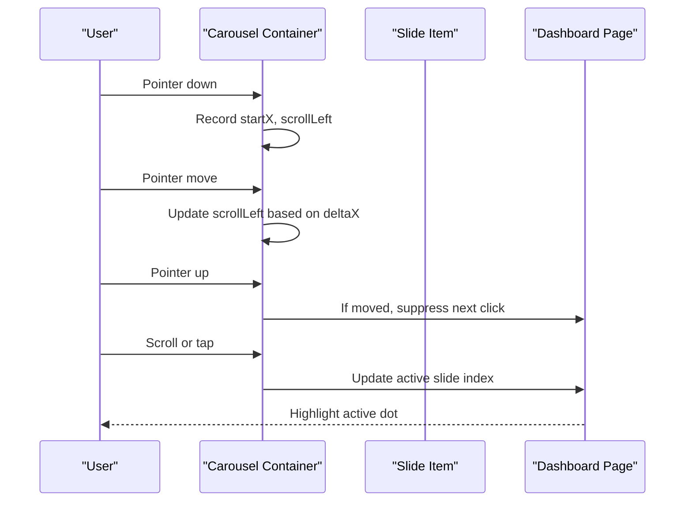

**Diagram sources**
- [page.tsx:305-379](file://src/app/home/page.tsx#L305-L379)
- [page.tsx:713-763](file://src/app/home/page.tsx#L713-L763)

**Section sources**
- [page.tsx:305-379](file://src/app/home/page.tsx#L305-L379)
- [page.tsx:713-763](file://src/app/home/page.tsx#L713-L763)

### Desktop Grid Adaptations
- At medium and larger breakpoints, create actions appear as static cards placed in specific grid cells.
- The map tile spans multiple rows/columns depending on breakpoint, providing a prominent visual anchor.
- The “Latest Viewed” tile is explicitly positioned; running itinerary jobs can occupy this slot ahead of regular feed items.

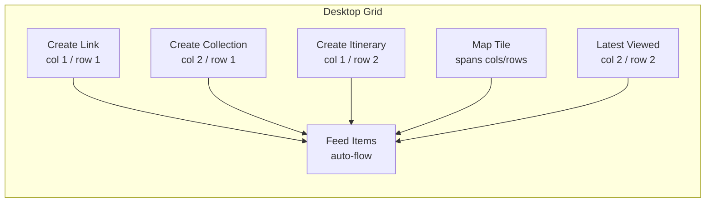

**Diagram sources**
- [page.tsx:802-829](file://src/app/home/page.tsx#L802-L829)
- [page.tsx:831-890](file://src/app/home/page.tsx#L831-L890)

**Section sources**
- [page.tsx:802-829](file://src/app/home/page.tsx#L802-L829)
- [page.tsx:831-890](file://src/app/home/page.tsx#L831-L890)

### Header Section: Greeting and Usage Statistics
- The header greets the user by display name or email prefix and includes a UsageCard showing quota usage for links.
- When usage reaches the limit, an upgrade link is provided through the UsageCard’s variant configuration.

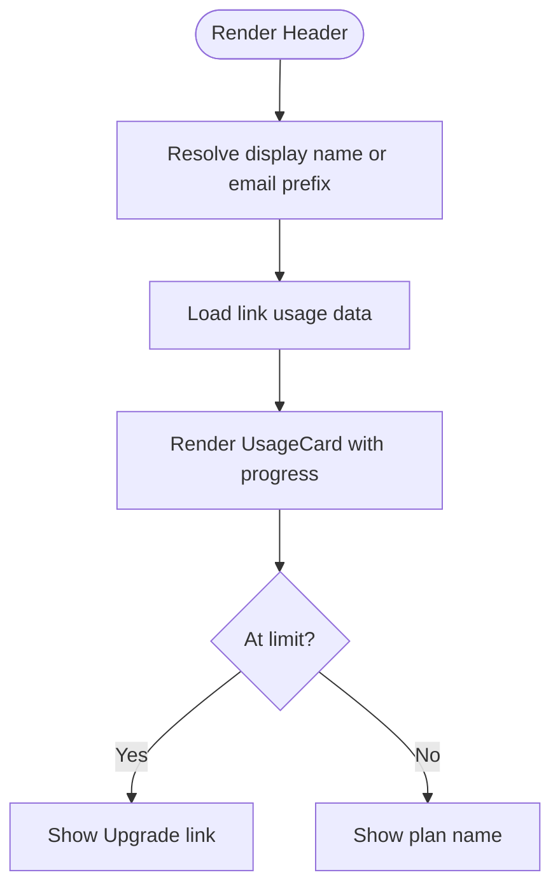

**Diagram sources**
- [page.tsx:688-700](file://src/app/home/page.tsx#L688-L700)
- [UsageCard.tsx:51-93](file://src/components/ui/primitives/UsageCard.tsx#L51-L93)

**Section sources**
- [page.tsx:688-700](file://src/app/home/page.tsx#L688-L700)
- [UsageCard.tsx:51-93](file://src/components/ui/primitives/UsageCard.tsx#L51-L93)

### Location Filter Integration
- Map clusters provide locality-based filters; clicking a cluster sets a location filter and scrolls to the cards section.
- An active filter is shown as a FilterPill with a clear action.
- Content is filtered by the selected locality before applying any mobile type filter.

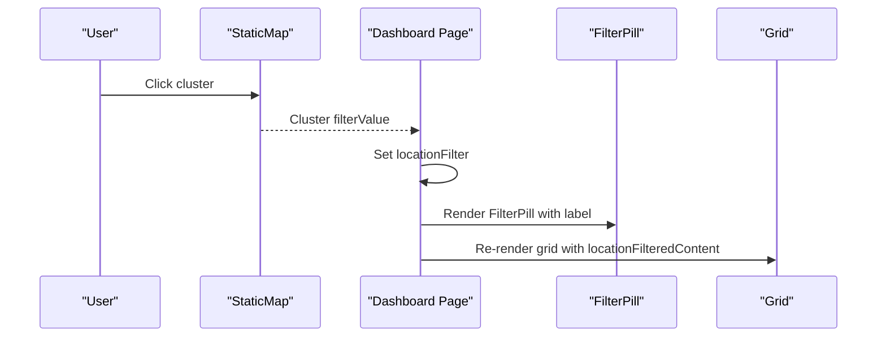

**Diagram sources**
- [page.tsx:294-303](file://src/app/home/page.tsx#L294-L303)
- [page.tsx:702-711](file://src/app/home/page.tsx#L702-L711)
- [page.tsx:387-392](file://src/app/home/page.tsx#L387-L392)

**Section sources**
- [page.tsx:294-303](file://src/app/home/page.tsx#L294-L303)
- [page.tsx:702-711](file://src/app/home/page.tsx#L702-L711)
- [page.tsx:387-392](file://src/app/home/page.tsx#L387-L392)

### Mobile-Specific Content Filtering
- On phone-sized screens, a horizontal filter bar lets users narrow the feed to All, Links, Collections, or Itineraries.
- The filter affects both the static feed and visible planning jobs (with special handling for in-progress itineraries).

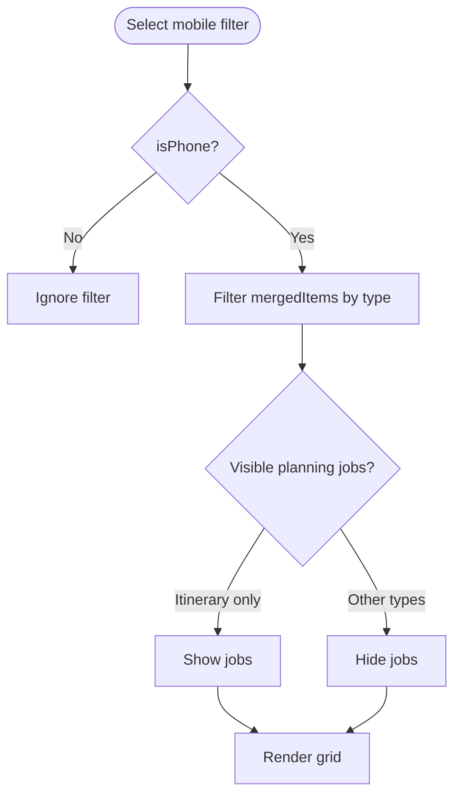

**Diagram sources**
- [page.tsx:394-405](file://src/app/home/page.tsx#L394-L405)
- [page.tsx:765-793](file://src/app/home/page.tsx#L765-L793)

**Section sources**
- [page.tsx:394-405](file://src/app/home/page.tsx#L394-L405)
- [page.tsx:765-793](file://src/app/home/page.tsx#L765-L793)

### Accessibility Features
- ARIA labels:
  - Create carousel has an aria-label describing its purpose.
  - Carousel controls group has an aria-label and each control button has an aria-label and aria-current for the active slide.
  - Mobile content filter area has an aria-label for context.
  - FilterPill exposes an aria-label to clear the active filter.
- Keyboard navigation:
  - Buttons are native elements with focus-visible ring styles for keyboard accessibility.
  - Carousel supports pointer interactions but remains navigable via standard focus order.

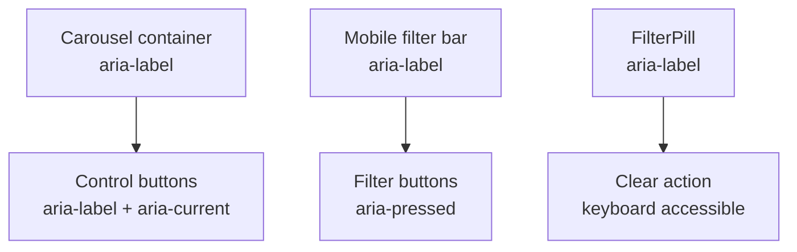

**Diagram sources**
- [page.tsx:713-763](file://src/app/home/page.tsx#L713-L763)
- [page.tsx:765-793](file://src/app/home/page.tsx#L765-L793)
- [FilterPill.tsx:30-67](file://src/components/ui/navbar/FilterPill.tsx#L30-L67)

**Section sources**
- [page.tsx:713-763](file://src/app/home/page.tsx#L713-L763)
- [page.tsx:765-793](file://src/app/home/page.tsx#L765-L793)
- [FilterPill.tsx:30-67](file://src/components/ui/navbar/FilterPill.tsx#L30-L67)

### Create Workflow Modal Integration
- Each CreateCard triggers a corresponding modal for creating a link, collection, or itinerary.
- Success paths include toast notifications, optimistic list updates, and navigation where appropriate.
- Quota errors are surfaced via dedicated toasts and usage refreshes.

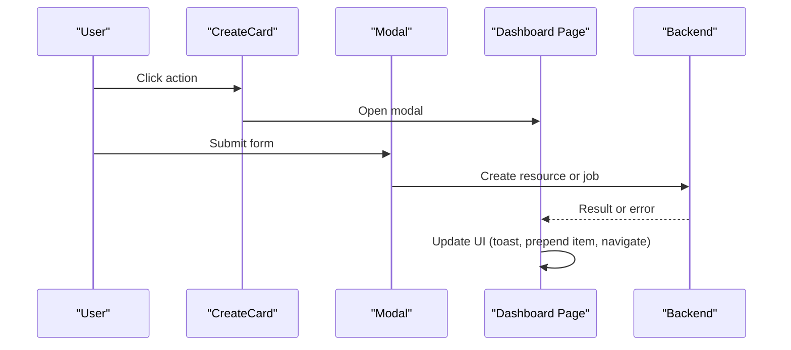

**Diagram sources**
- [page.tsx:417-551](file://src/app/home/page.tsx#L417-L551)
- [CreateCard.tsx:50-93](file://src/components/ui/dashboard/CreateCard.tsx#L50-L93)

**Section sources**
- [page.tsx:417-551](file://src/app/home/page.tsx#L417-L551)
- [CreateCard.tsx:50-93](file://src/components/ui/dashboard/CreateCard.tsx#L50-L93)

## Dependency Analysis
- The dashboard page depends on:
  - Media query hook for breakpoint detection
  - Map clusters hook for locality filtering
  - Recent content hook for feed data
  - Jobs queue hooks for asynchronous processing
  - Profile and usage hooks for header information
- CSS dependencies:
  - Global tokens and theme variables
  - Bento grid rules that compute dimensions from container width
- Component dependencies:
  - CreateCard, UsageCard, FilterPill, and various entity cards

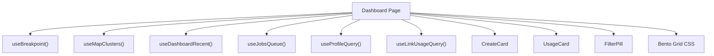

**Diagram sources**
- [page.tsx:169-176](file://src/app/home/page.tsx#L169-L176)
- [page.tsx:192-240](file://src/app/home/page.tsx#L192-L240)
- [page.tsx:294-297](file://src/app/home/page.tsx#L294-L297)
- [globals.css:1080-1102](file://src/app/globals.css#L1080-L1102)

**Section sources**
- [page.tsx:169-240](file://src/app/home/page.tsx#L169-L240)
- [page.tsx:294-297](file://src/app/home/page.tsx#L294-L297)
- [globals.css:1080-1102](file://src/app/globals.css#L1080-L1102)

## Performance Considerations
- Container queries ensure tiles maintain aspect ratio without hardcoding heights, reducing layout thrashing.
- Infinite scroll loads more content progressively to keep initial render lightweight.
- Optimistic updates prevent flicker when new items appear before server responses settle.
- Reduced motion preference is respected for animations to improve performance and comfort.

[No sources needed since this section provides general guidance]

## Troubleshooting Guide
- Empty state: If no content matches filters, an empty state is displayed prompting the user to adjust filters or add content.
- Loading states: Initial loading and “loading more” indicators inform users about ongoing operations.
- Job failures: Errors during link analysis or itinerary planning surface as toasts with actionable feedback.
- Quota limits: Exceeding quotas triggers informative toasts and directs users to billing when applicable.

**Section sources**
- [page.tsx:918-946](file://src/app/home/page.tsx#L918-L946)
- [page.tsx:192-240](file://src/app/home/page.tsx#L192-L240)
- [page.tsx:417-551](file://src/app/home/page.tsx#L417-L551)

## Conclusion
The dashboard combines a responsive bento grid, mobile-first carousel navigation, and robust filtering to deliver a cohesive experience across devices. Container queries and breakpoint-aware components ensure consistent card sizing and layout, while accessibility attributes and keyboard support make the interface inclusive. Creation workflows integrate seamlessly with modals and background jobs, and usage statistics provide clear feedback on account limits.

[No sources needed since this section summarizes without analyzing specific files]