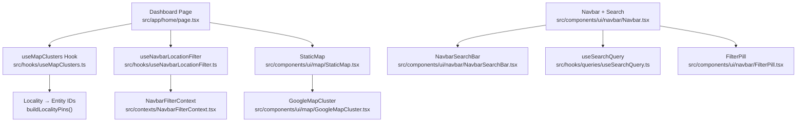
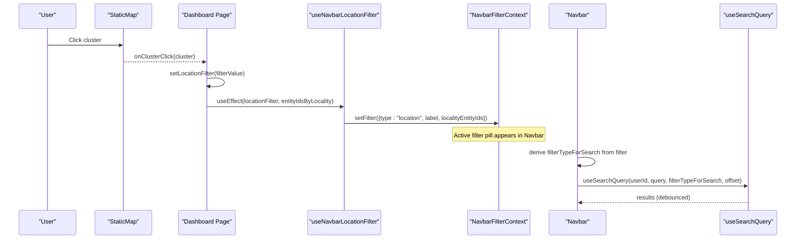
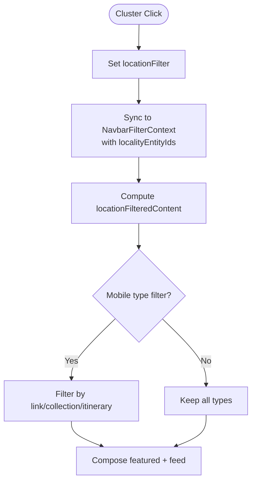
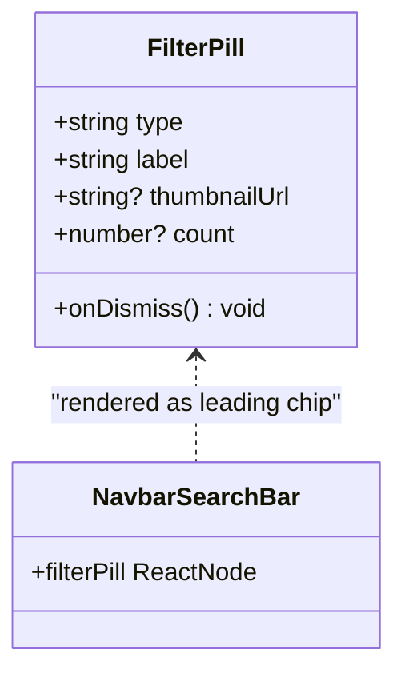
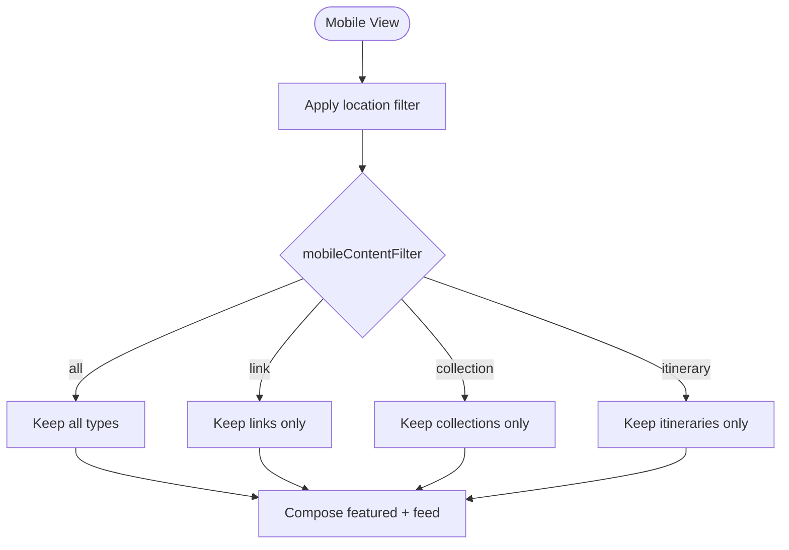
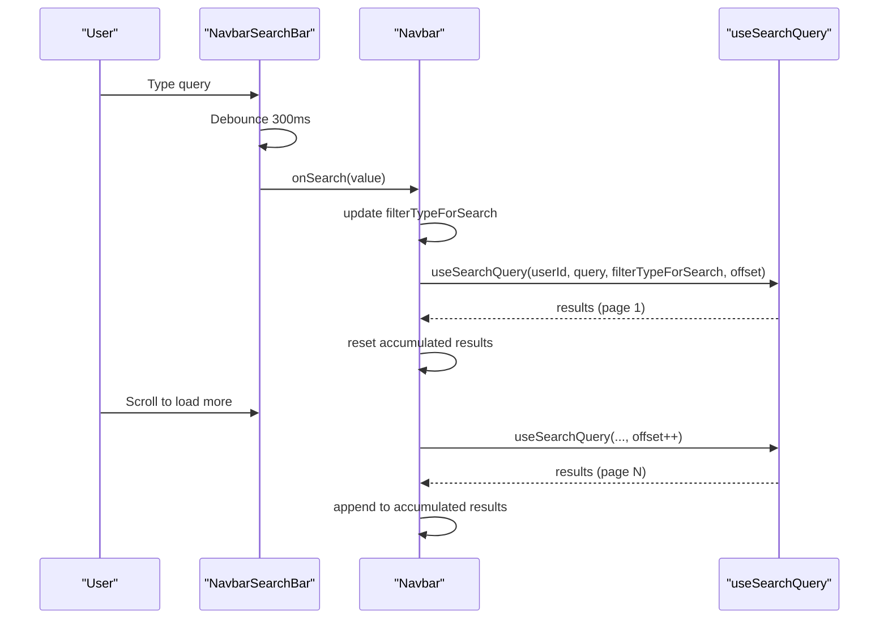
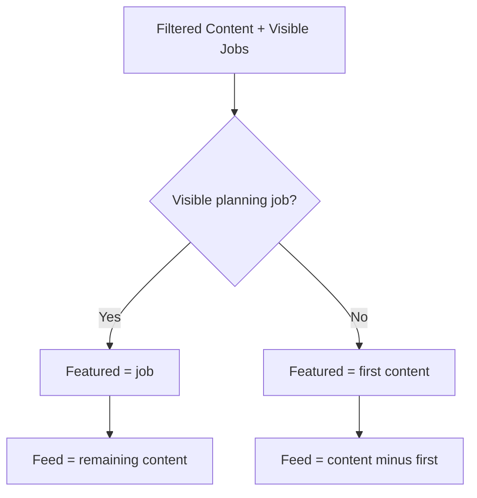
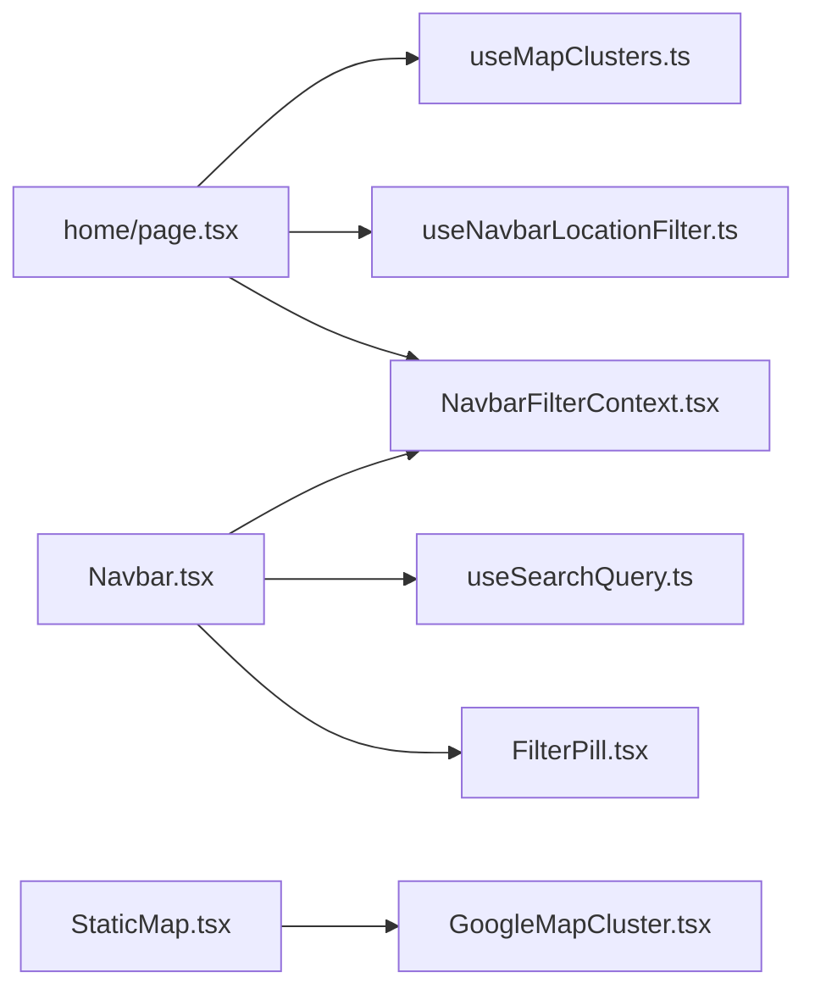

# Filtering & Search Capabilities

<cite>
**Referenced Files in This Document**
- [home/page.tsx](file://src/app/home/page.tsx)
- [NavbarFilterContext.tsx](file://src/contexts/NavbarFilterContext.tsx)
- [useMapClusters.ts](file://src/hooks/useMapClusters.ts)
- [useNavbarLocationFilter.ts](file://src/hooks/useNavbarLocationFilter.ts)
- [StaticMap.tsx](file://src/components/ui/map/StaticMap.tsx)
- [GoogleMapCluster.tsx](file://src/components/ui/map/GoogleMapCluster.tsx)
- [FilterPill.tsx](file://src/components/ui/navbar/FilterPill.tsx)
- [NavbarSearchBar.tsx](file://src/components/ui/navbar/NavbarSearchBar.tsx)
- [Navbar.tsx](file://src/components/ui/navbar/Navbar.tsx)
- [SearchDropdown.tsx](file://src/components/ui/navbar/SearchDropdown.tsx)
- [useSearchQuery.ts](file://src/hooks/queries/useSearchQuery.ts)
</cite>

## Table of Contents
1. Introduction
2. Project Structure
3. Core Components
4. Architecture Overview
5. Detailed Component Analysis
6. Dependency Analysis
7. Performance Considerations
8. Troubleshooting Guide
9. Conclusion

## Introduction
This document explains the dashboard filtering and search system with a focus on:
- Location-based filtering via map clusters
- The FilterPill component for active filters
- Mobile-specific content type filtering (links, collections, itineraries)
- How location clusters integrate with dashboard content filtering
- Entity ID mapping by locality and real-time filter updates
- Filter state management and URL synchronization considerations
- How filters affect both the main feed and featured items
- Performance considerations when filtering large datasets

## Project Structure
The filtering and search features span several layers:
- Dashboard page orchestrates data fetching, local state, and composed filters
- Map clusters are fetched and transformed into locality-to-entity mappings
- A shared navbar filter context exposes an active filter pill to consumers
- Search is implemented through a debounced input and server-side query hook
- Mobile-only content type buttons refine the visible feed

**Diagram sources**
- [home/page.tsx:294-303](file://src/app/home/page.tsx#L294-L303)
- [useMapClusters.ts:35-59](file://src/hooks/useMapClusters.ts#L35-L59)
- [useNavbarLocationFilter.ts:9-28](file://src/hooks/useNavbarLocationFilter.ts#L9-L28)
- [StaticMap.tsx:21-32](file://src/components/ui/map/StaticMap.tsx#L21-L32)
- [Navbar.tsx:90-116](file://src/components/ui/navbar/Navbar.tsx#L90-L116)
- [NavbarSearchBar.tsx:68-88](file://src/components/ui/navbar/NavbarSearchBar.tsx#L68-L88)
- [useSearchQuery.ts:8-22](file://src/hooks/queries/useSearchQuery.ts#L8-L22)
- [FilterPill.tsx:20-68](file://src/components/ui/navbar/FilterPill.tsx#L20-L68)

**Section sources**
- [home/page.tsx:123-176](file://src/app/home/page.tsx#L123-L176)
- [useMapClusters.ts:1-61](file://src/hooks/useMapClusters.ts#L1-L61)
- [NavbarFilterContext.tsx:5-45](file://src/contexts/NavbarFilterContext.tsx#L5-L45)

## Core Components
- Dashboard page: manages mobile content filter state, location filter state, merges optimistic itineraries, applies locality and type filters, and composes featured vs feed items.
- useMapClusters: fetches cluster data per source and builds a locality-to-entity-id mapping used for location filtering.
- useNavbarLocationFilter: syncs the current location filter into the shared navbar filter pill using the locality entity set.
- NavbarFilterContext: provides a single source of truth for the active filter across the app.
- FilterPill: renders the active filter with dismiss action and optional thumbnail/count.
- Navbar + Search: debounced search input, “search in” filters, and accumulation of results; integrates with the active filter pill.
- StaticMap/GoogleMapCluster: displays clusters and emits click events that drive location filtering.

**Section sources**
- [home/page.tsx:381-415](file://src/app/home/page.tsx#L381-L415)
- [useMapClusters.ts:35-59](file://src/hooks/useMapClusters.ts#L35-L59)
- [useNavbarLocationFilter.ts:9-28](file://src/hooks/useNavbarLocationFilter.ts#L9-L28)
- [NavbarFilterContext.tsx:15-45](file://src/contexts/NavbarFilterContext.tsx#L15-L45)
- [FilterPill.tsx:20-68](file://src/components/ui/navbar/FilterPill.tsx#L20-L68)
- [Navbar.tsx:90-116](file://src/components/ui/navbar/Navbar.tsx#L90-L116)
- [NavbarSearchBar.tsx:68-88](file://src/components/ui/navbar/NavbarSearchBar.tsx#L68-L88)
- [StaticMap.tsx:21-32](file://src/components/ui/map/StaticMap.tsx#L21-L32)

## Architecture Overview
The filtering architecture combines client-side composition with server-backed search and cluster data:
- Map clusters are loaded once and cached; they provide a locality-to-entity mapping.
- Clicking a cluster sets a location filter, which is synced into the navbar filter pill.
- The dashboard composes two filters:
  - Location filter: restricts items to those whose IDs belong to the selected locality.
  - Mobile content type filter: restricts items to links, collections, or itineraries on small screens.
- The navbar search uses a debounced input and a server-side search hook, optionally scoped by the active filter type.

**Diagram sources**
- [home/page.tsx:294-303](file://src/app/home/page.tsx#L294-L303)
- [useNavbarLocationFilter.ts:15-27](file://src/hooks/useNavbarLocationFilter.ts#L15-L27)
- [Navbar.tsx:90-116](file://src/components/ui/navbar/Navbar.tsx#L90-L116)
- [useSearchQuery.ts:8-22](file://src/hooks/queries/useSearchQuery.ts#L8-L22)

## Detailed Component Analysis

### Location-Based Filtering via Map Clusters
- Data acquisition: useMapClusters queries per-source endpoints and transforms raw locations into locality pins, returning clusters and a Map of locality → entity IDs.
- Interaction: StaticMap renders clusters and forwards click events to the dashboard.
- State sync: useNavbarLocationFilter maps the selected locality to its entity IDs and pushes a location-type filter into the shared context.
- Content filtering: the dashboard computes locationFilteredContent by intersecting the merged items with the locality’s entity set.

**Diagram sources**
- [home/page.tsx:294-303](file://src/app/home/page.tsx#L294-L303)
- [useNavbarLocationFilter.ts:15-27](file://src/hooks/useNavbarLocationFilter.ts#L15-L27)
- [home/page.tsx:387-397](file://src/app/home/page.tsx#L387-L397)

**Section sources**
- [useMapClusters.ts:35-59](file://src/hooks/useMapClusters.ts#L35-L59)
- [StaticMap.tsx:21-32](file://src/components/ui/map/StaticMap.tsx#L21-L32)
- [home/page.tsx:387-397](file://src/app/home/page.tsx#L387-L397)

### FilterPill Component for Active Filters
- Purpose: visually indicates the active filter and allows dismissal.
- Behavior: shows category badge or thumbnail, count, and a clear action; integrates with the navbar search bar layout when present.
- Integration: rendered inside the navbar search area when a filter is active; clearing resets the filter state.

**Diagram sources**
- [FilterPill.tsx:20-68](file://src/components/ui/navbar/FilterPill.tsx#L20-L68)
- [NavbarSearchBar.tsx:122-149](file://src/components/ui/navbar/NavbarSearchBar.tsx#L122-L149)

**Section sources**
- [FilterPill.tsx:20-68](file://src/components/ui/navbar/FilterPill.tsx#L20-L68)
- [NavbarSearchBar.tsx:122-149](file://src/components/ui/navbar/NavbarSearchBar.tsx#L122-L149)

### Mobile-Specific Content Type Filtering
- On small screens, users can switch between All, Links, Collections, and Itineraries.
- This filter is applied after location filtering, narrowing the visible feed without affecting in-flight planning jobs beyond visibility rules.
- Planning jobs remain visible according to specific rules to avoid blind spots during creation.

**Diagram sources**
- [home/page.tsx:394-405](file://src/app/home/page.tsx#L394-L405)

**Section sources**
- [home/page.tsx:65-75](file://src/app/home/page.tsx#L65-L75)
- [home/page.tsx:394-405](file://src/app/home/page.tsx#L394-L405)

### Search and Real-Time Filter Updates
- Debounced input: NavbarSearchBar delays search calls to reduce network load.
- Server search: useSearchQuery performs paginated searches, optionally scoped by the active filter type.
- Accumulation: Navbar accumulates results across pages and resets on query/filter changes.
- Active filter influence: When a non-location, non-entity filter is active, it scopes the search to that content type.

**Diagram sources**
- [NavbarSearchBar.tsx:68-88](file://src/components/ui/navbar/NavbarSearchBar.tsx#L68-L88)
- [Navbar.tsx:90-116](file://src/components/ui/navbar/Navbar.tsx#L90-L116)
- [useSearchQuery.ts:8-22](file://src/hooks/queries/useSearchQuery.ts#L8-L22)

**Section sources**
- [NavbarSearchBar.tsx:68-88](file://src/components/ui/navbar/NavbarSearchBar.tsx#L68-L88)
- [Navbar.tsx:90-116](file://src/components/ui/navbar/Navbar.tsx#L90-L116)
- [useSearchQuery.ts:8-22](file://src/hooks/queries/useSearchQuery.ts#L8-L22)

### Featured Items and Main Feed Composition
- Featured item selection:
  - If there is a visible in-flight itinerary job, it becomes the featured item.
  - Otherwise, the first filtered content item becomes featured.
- Feed items:
  - If a featured job exists, the rest of the filtered list forms the feed.
  - If no featured job, the feed excludes the first item (which is featured).
- This ensures newest-first ordering while highlighting active work-in-progress.

**Diagram sources**
- [home/page.tsx:402-415](file://src/app/home/page.tsx#L402-L415)

**Section sources**
- [home/page.tsx:402-415](file://src/app/home/page.tsx#L402-L415)

## Dependency Analysis
- Dashboard depends on:
  - useMapClusters for cluster data and locality-to-entity mapping
  - useNavbarLocationFilter to push location filters into the global context
  - Local state for mobile content filter and optimistic itineraries
- Navbar depends on:
  - NavbarFilterContext for active filter display
  - useSearchQuery for search results
  - FilterPill for rendering active filters
- StaticMap depends on:
  - GoogleMapCluster for interactive rendering
  - IntersectionObserver to defer loading until visible

**Diagram sources**
- [home/page.tsx:294-303](file://src/app/home/page.tsx#L294-L303)
- [Navbar.tsx:90-116](file://src/components/ui/navbar/Navbar.tsx#L90-L116)
- [StaticMap.tsx:21-32](file://src/components/ui/map/StaticMap.tsx#L21-L32)

**Section sources**
- [home/page.tsx:294-303](file://src/app/home/page.tsx#L294-L303)
- [Navbar.tsx:90-116](file://src/components/ui/navbar/Navbar.tsx#L90-L116)
- [StaticMap.tsx:21-32](file://src/components/ui/map/StaticMap.tsx#L21-L32)

## Performance Considerations
- Debounced search: reduces network requests during typing.
- Query caching: map clusters and search queries use stale times to minimize refetches.
- Client-side filtering: location and mobile type filters are computed in-memory using Sets and arrays, avoiding extra server calls.
- Lazy map loading: StaticMap defers heavy map rendering until visible via intersection observer.
- Optimistic updates: new itineraries are prepended immediately to avoid UI flicker while background refresh occurs.
- Pagination: search results accumulate incrementally to support large result sets efficiently.

[No sources needed since this section provides general guidance]

## Troubleshooting Guide
- No results after selecting a locality:
  - Ensure the locality has associated entities; check the locality-to-entity mapping returned by the cluster hook.
  - Verify the location filter is set and not cleared unintentionally on unmount.
- Search not updating:
  - Confirm the input is debounced and not blocked by disabled state.
  - Check that the active filter does not scope search to a type with no matches.
- Featured item not showing expected content:
  - Review whether an in-flight itinerary job is taking the featured slot.
  - Confirm the filtered content order and that the first item is available.
- Mobile filter not applying:
  - Verify breakpoint detection and that mobileContentFilter is set correctly.
  - Ensure location filtering runs before type filtering.

**Section sources**
- [useNavbarLocationFilter.ts:15-27](file://src/hooks/useNavbarLocationFilter.ts#L15-L27)
- [NavbarSearchBar.tsx:68-88](file://src/components/ui/navbar/NavbarSearchBar.tsx#L68-L88)
- [home/page.tsx:394-415](file://src/app/home/page.tsx#L394-L415)

## Conclusion
The dashboard filtering and search system combines map-driven location filtering, a shared active filter pill, and mobile-specific content type controls to deliver a responsive, performant experience. Location clusters provide locality-to-entity mappings that power precise content scoping, while debounced search and pagination handle large datasets efficiently. The composition of featured items and feed ensures that active work remains visible and prioritized. Together, these components create a cohesive filtering model that scales across devices and data sizes.