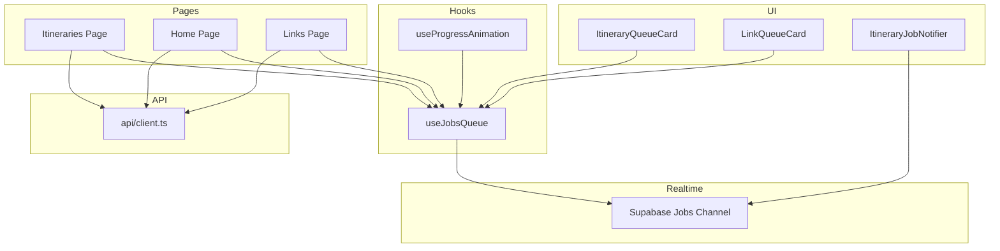
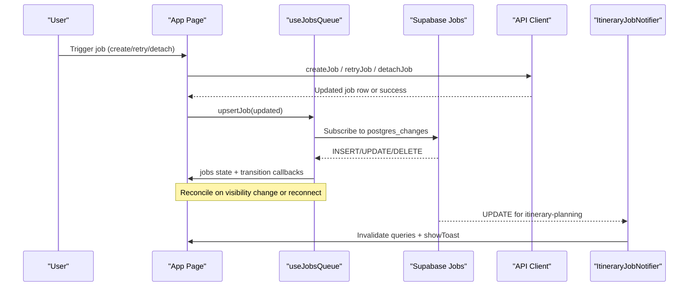
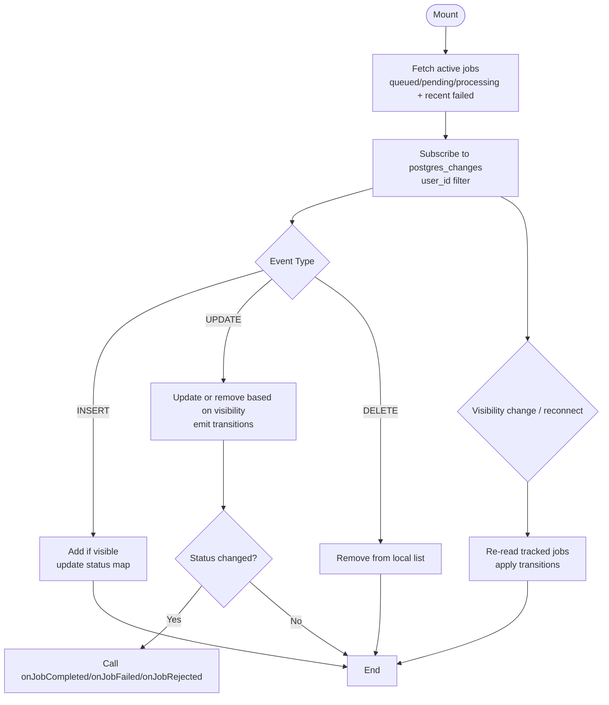
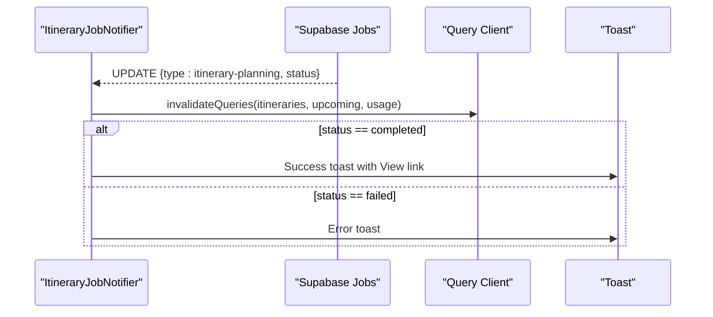
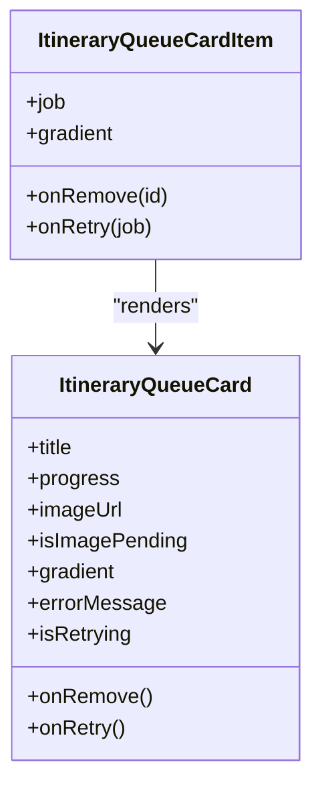
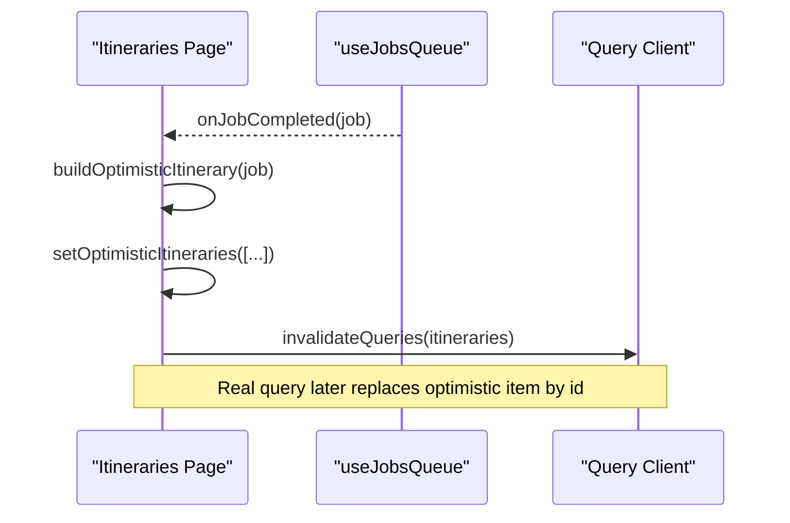
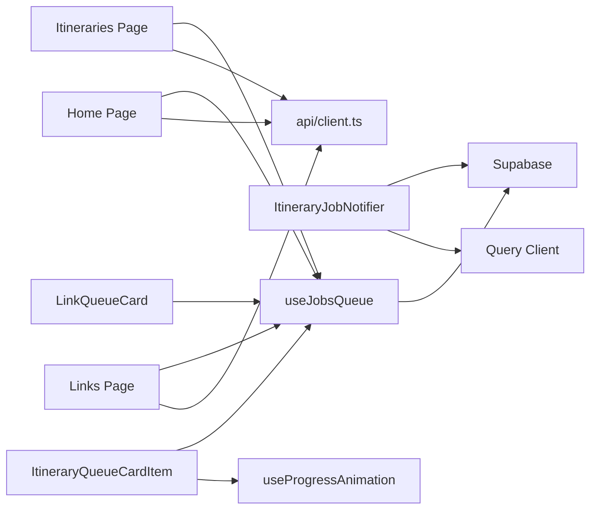

# Job Queue Integration & Real-time Updates

<cite>
**Referenced Files in This Document**
- [useJobsQueue.ts](file://src/hooks/useJobsQueue.ts)
- [ItineraryJobNotifier.tsx](file://src/components/notifications/ItineraryJobNotifier.tsx)
- [ItineraryQueueCard.tsx](file://src/components/ui/itinerary/ItineraryQueueCard.tsx)
- [ItineraryQueueCardItem.tsx](file://src/components/ui/itinerary/ItineraryQueueCardItem.tsx)
- [LinkQueueCard.tsx](file://src/components/ui/links/LinkQueueCard.tsx)
- [useProgressAnimation.ts](file://src/hooks/useProgressAnimation.ts)
- [client.ts](file://src/lib/api/client.ts)
- [page.tsx (itineraries)](file://src/app/itineraries/page.tsx)
- [page.tsx (home)](file://src/app/home/page.tsx)
- [page.tsx (links)](file://src/app/links/page.tsx)
</cite>

## Table of Contents
1. Introduction
2. Project Structure
3. Core Components
4. Architecture Overview
5. Detailed Component Analysis
6. Dependency Analysis
7. Performance Considerations
8. Troubleshooting Guide
9. Conclusion

## Introduction
This document explains the job queue integration that powers background processing for content analysis and itinerary planning. It covers:
- The useJobsQueue hook for real-time job monitoring and status updates
- Real-time progress tracking, completion handling, and error recovery
- The optimistic itinerary item system that bridges job completion to data refresh
- The ItineraryJobNotifier component for user notifications
- Queue card items and how jobs integrate with dashboard feeds
- Retry mechanisms, job detachment, and notification flows

## Project Structure
The job queue system spans hooks, UI components, and application pages:
- A client-side hook subscribes to job changes and maintains a live queue
- UI components render in-flight jobs as cards with progress and retry actions
- Pages integrate jobs into their dashboards and handle optimistic updates
- A global notifier emits success/error toasts when itineraries complete or fail
- API helpers create, retry, and detach jobs

**Diagram sources**
- [useJobsQueue.ts:45-295](file://src/hooks/useJobsQueue.ts#L45-L295)
- [ItineraryJobNotifier.tsx:10-90](file://src/components/notifications/ItineraryJobNotifier.tsx#L10-L90)
- [ItineraryQueueCard.tsx:60-197](file://src/components/ui/itinerary/ItineraryQueueCard.tsx#L60-L197)
- [LinkQueueCard.tsx:52-216](file://src/components/ui/links/LinkQueueCard.tsx#L52-L216)
- [useProgressAnimation.ts:37-103](file://src/hooks/useProgressAnimation.ts#L37-L103)
- [client.ts:109-155](file://src/lib/api/client.ts#L109-L155)
- [page.tsx (itineraries):102-162](file://src/app/itineraries/page.tsx#L102-L162)
- [page.tsx (home):417-456](file://src/app/home/page.tsx#L417-L456)
- [page.tsx (links):66-118](file://src/app/links/page.tsx#L66-L118)

**Section sources**
- [useJobsQueue.ts:45-295](file://src/hooks/useJobsQueue.ts#L45-L295)
- [ItineraryJobNotifier.tsx:10-90](file://src/components/notifications/ItineraryJobNotifier.tsx#L10-L90)
- [ItineraryQueueCard.tsx:60-197](file://src/components/ui/itinerary/ItineraryQueueCard.tsx#L60-L197)
- [LinkQueueCard.tsx:52-216](file://src/components/ui/links/LinkQueueCard.tsx#L52-L216)
- [useProgressAnimation.ts:37-103](file://src/hooks/useProgressAnimation.ts#L37-L103)
- [client.ts:109-155](file://src/lib/api/client.ts#L109-L155)
- [page.tsx (itineraries):102-162](file://src/app/itineraries/page.tsx#L102-L162)
- [page.tsx (home):417-456](file://src/app/home/page.tsx#L417-L456)
- [page.tsx (links):66-118](file://src/app/links/page.tsx#L66-L118)

## Core Components
- useJobsQueue: Subscribes to job changes, tracks transitions, reconciles missed updates, and exposes methods to remove or optimistically upsert jobs.
- ItineraryJobNotifier: Listens for itinerary-planning job updates and shows toasts while invalidating relevant caches.
- ItineraryQueueCard / ItineraryQueueCardItem: Render in-progress itinerary jobs with progress, ETA cues, image placeholders, and retry controls.
- LinkQueueCard: Renders in-progress content-analysis jobs with progress and retry.
- useProgressAnimation: Smoothly animates progress bars using worker-reported percentages or step-based estimates.
- API client helpers: Create, retry, and detach jobs; surface quota and duplicate-analysis errors.

Key responsibilities:
- Real-time synchronization via Supabase channels
- Optimistic UI updates to avoid jank during handoff from queue cards to final cards
- Robust error handling and retry UX
- Notification and cache invalidation on completion/failure

**Section sources**
- [useJobsQueue.ts:45-295](file://src/hooks/useJobsQueue.ts#L45-L295)
- [ItineraryJobNotifier.tsx:10-90](file://src/components/notifications/ItineraryJobNotifier.tsx#L10-L90)
- [ItineraryQueueCard.tsx:60-197](file://src/components/ui/itinerary/ItineraryQueueCard.tsx#L60-L197)
- [ItineraryQueueCardItem.tsx:39-100](file://src/components/ui/itinerary/ItineraryQueueCardItem.tsx#L39-L100)
- [LinkQueueCard.tsx:52-216](file://src/components/ui/links/LinkQueueCard.tsx#L52-L216)
- [useProgressAnimation.ts:37-103](file://src/hooks/useProgressAnimation.ts#L37-L103)
- [client.ts:109-155](file://src/lib/api/client.ts#L109-L155)

## Architecture Overview
The system combines real-time database subscriptions with optimistic UI updates to deliver seamless background job experiences.

**Diagram sources**
- [useJobsQueue.ts:167-260](file://src/hooks/useJobsQueue.ts#L167-L260)
- [ItineraryJobNotifier.tsx:29-88](file://src/components/notifications/ItineraryJobNotifier.tsx#L29-L88)
- [client.ts:109-155](file://src/lib/api/client.ts#L109-L155)
- [page.tsx (itineraries):102-162](file://src/app/itineraries/page.tsx#L102-L162)

## Detailed Component Analysis

### useJobsQueue hook
Responsibilities:
- Initial fetch of active jobs (including recent failures)
- Realtime subscription to job changes per user
- Transition detection and callback invocation for completed/failed/rejected
- Reconciliation pass to recover from missed realtime events
- Visibility-change reconciliation and channel error handling
- Local helpers to remove or upsert jobs optimistically

Data model:
- QueueJob includes id, type, status, payload, result, error, progress, detached flag, timestamps

Sorting and visibility:
- Failed jobs pin to front; within groups newest first
- Only queued/pending/processing or recent failed jobs are shown unless detached

Reconciliation strategy:
- Tracks last known statuses per job
- On tab focus or reconnect, re-read tracked jobs and apply transitions

Optimistic upsert:
- Immediately reflects retry results without waiting for realtime

**Diagram sources**
- [useJobsQueue.ts:89-136](file://src/hooks/useJobsQueue.ts#L89-L136)
- [useJobsQueue.ts:167-260](file://src/hooks/useJobsQueue.ts#L167-L260)

**Section sources**
- [useJobsQueue.ts:45-295](file://src/hooks/useJobsQueue.ts#L45-L295)

### ItineraryJobNotifier
Responsibilities:
- Listen for itinerary-planning job updates
- Invalidate itinerary-related queries on completion/failure
- Show success toast with “View” action linking to the new itinerary
- Show error toast on failure

Behavior:
- Maintains a Map of previous statuses to avoid duplicate notifications
- Filters by job type and user scope

**Diagram sources**
- [ItineraryJobNotifier.tsx:29-88](file://src/components/notifications/ItineraryJobNotifier.tsx#L29-L88)

**Section sources**
- [ItineraryJobNotifier.tsx:10-90](file://src/components/notifications/ItineraryJobNotifier.tsx#L10-L90)

### ItineraryQueueCard and ItineraryQueueCardItem
Responsibilities:
- Display in-progress itinerary jobs with title, destination photo, progress bar, and error messaging
- Provide dismiss and retry actions
- Compute whether a job is stuck and eligible for retry

Progress animation:
- Uses useProgressAnimation to smoothly animate progress
- Honors worker-reported percent when available; otherwise uses step-based targets
- Crawls forward between steps to avoid frozen visuals

Retry logic:
- Offers retry when job is failed or stuck beyond threshold
- Disables retry while in-flight and clears spinner once backend acks

**Diagram sources**
- [ItineraryQueueCard.tsx:60-197](file://src/components/ui/itinerary/ItineraryQueueCard.tsx#L60-L197)
- [ItineraryQueueCardItem.tsx:39-100](file://src/components/ui/itinerary/ItineraryQueueCardItem.tsx#L39-L100)

**Section sources**
- [ItineraryQueueCard.tsx:60-197](file://src/components/ui/itinerary/ItineraryQueueCard.tsx#L60-L197)
- [ItineraryQueueCardItem.tsx:39-100](file://src/components/ui/itinerary/ItineraryQueueCardItem.tsx#L39-L100)

### LinkQueueCard (content analysis)
Responsibilities:
- Render in-progress content-analysis jobs with URL, thumbnail, progress, and retry
- Mirror visual language with itinerary queue cards for consistency

Integration:
- Used by the links page to show ongoing analysis
- Works with optimistic content synthesis to morph queue card into final card

**Section sources**
- [LinkQueueCard.tsx:52-216](file://src/components/ui/links/LinkQueueCard.tsx#L52-L216)

### useProgressAnimation
Responsibilities:
- Derive target percentage from job status and progress fields
- Animate progress smoothly between steps
- Use worker-provided stage metadata to crawl toward next_percent

Complexity:
- O(1) per update; uses interval timers to increment display value

**Section sources**
- [useProgressAnimation.ts:37-103](file://src/hooks/useProgressAnimation.ts#L37-L103)

### API client helpers
Responsibilities:
- createJob(type, payload): POST to /api/jobs
- retryJob(jobId): POST to /api/jobs/:id/retry
- detachJob(jobId): PATCH to /api/jobs/:id/detach
- Surface specific errors like already_analyzed and quota_exceeded

Usage:
- Pages call these functions to initiate, retry, or dismiss jobs
- Results are merged back into the queue via upsertJob for immediate feedback

**Section sources**
- [client.ts:109-155](file://src/lib/api/client.ts#L109-L155)

### Optimistic itinerary items and dashboard feed integration
Itineraries page:
- On job completion, builds an optimistic itinerary object from job.result and job.payload
- Inserts it at the head of the grid so the queue card’s slot morphs into the final card seamlessly
- Removes the optimistic item once the canonical query returns the real itinerary

Home page:
- Similar pattern for home feed: merges optimistic items until real data arrives
- Handles removal of optimistic items when real IDs match

Links page:
- Builds optimistic content from completed content-analysis jobs
- Merges with real content keyed by content_id to prevent remounting

**Diagram sources**
- [page.tsx (itineraries):34-71](file://src/app/itineraries/page.tsx#L34-L71)
- [page.tsx (itineraries):102-135](file://src/app/itineraries/page.tsx#L102-L135)

**Section sources**
- [page.tsx (itineraries):34-71](file://src/app/itineraries/page.tsx#L34-L71)
- [page.tsx (itineraries):102-135](file://src/app/itineraries/page.tsx#L102-L135)
- [page.tsx (home):242-254](file://src/app/home/page.tsx#L242-L254)
- [page.tsx (links):93-118](file://src/app/links/page.tsx#L93-L118)

## Dependency Analysis
- useJobsQueue depends on Supabase client and manages its own channel lifecycle
- ItineraryJobNotifier depends on Supabase client and Query Client for cache invalidation
- UI components depend on useJobsQueue for job data and useProgressAnimation for smooth progress
- Pages depend on API client for job creation/retry/detach and on useJobsQueue for live updates
- No circular dependencies observed among these modules

**Diagram sources**
- [useJobsQueue.ts:167-260](file://src/hooks/useJobsQueue.ts#L167-L260)
- [ItineraryJobNotifier.tsx:29-88](file://src/components/notifications/ItineraryJobNotifier.tsx#L29-L88)
- [client.ts:109-155](file://src/lib/api/client.ts#L109-L155)
- [page.tsx (itineraries):102-162](file://src/app/itineraries/page.tsx#L102-L162)
- [page.tsx (home):417-456](file://src/app/home/page.tsx#L417-L456)
- [page.tsx (links):66-118](file://src/app/links/page.tsx#L66-L118)

**Section sources**
- [useJobsQueue.ts:167-260](file://src/hooks/useJobsQueue.ts#L167-L260)
- [ItineraryJobNotifier.tsx:29-88](file://src/components/notifications/ItineraryJobNotifier.tsx#L29-L88)
- [client.ts:109-155](file://src/lib/api/client.ts#L109-L155)
- [page.tsx (itineraries):102-162](file://src/app/itineraries/page.tsx#L102-L162)
- [page.tsx (home):417-456](file://src/app/home/page.tsx#L417-L456)
- [page.tsx (links):66-118](file://src/app/links/page.tsx#L66-L118)

## Performance Considerations
- Realtime deduplication: Each hook instance uses a unique channel suffix to avoid shared-channel conflicts
- Reconciliation: Prevents stale mid-progress states by re-syncing on visibility change or reconnect
- Optimistic updates: Immediate UI feedback avoids perceived lag after retries or completions
- Progress animation: Avoids backward jumps and uses staged crawling to keep UI responsive
- Sorting: Failed jobs pinned to front ensures visibility of issues without heavy computation

[No sources needed since this section provides general guidance]

## Troubleshooting Guide
Common issues and resolutions:
- Stuck in flight: If a job remains in queued/pending/processing beyond threshold, offer retry
- Missed realtime updates: rely on reconcile pass triggered by visibility change or reconnect
- Duplicate notifications: StatusMap in notifier prevents repeated toasts for same transition
- Connection errors: Hook sets connectionError flag; consider showing a subtle banner or disabling actions
- Retry failures: Catch and surface user-friendly messages; ensure spinner clears even on error paths

**Section sources**
- [ItineraryQueueCardItem.tsx:63-83](file://src/components/ui/itinerary/ItineraryQueueCardItem.tsx#L63-L83)
- [useJobsQueue.ts:250-260](file://src/hooks/useJobsQueue.ts#L250-L260)
- [ItineraryJobNotifier.tsx:54-82](file://src/components/notifications/ItineraryJobNotifier.tsx#L54-L82)

## Conclusion
The job queue integration delivers a robust, real-time background processing experience:
- useJobsQueue centralizes job state and transitions with resilience against missed updates
- ItineraryJobNotifier surfaces timely notifications and keeps caches fresh
- Queue cards provide clear progress, error messaging, and retry affordances
- Optimistic updates ensure smooth transitions from queue cards to final content
- API helpers and page integrations tie together creation, retry, and detachment workflows

[No sources needed since this section summarizes without analyzing specific files]