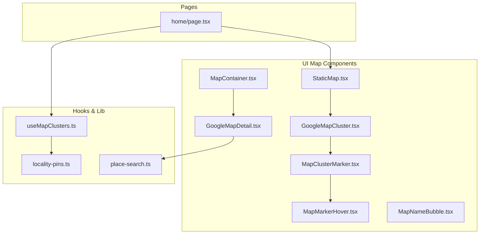
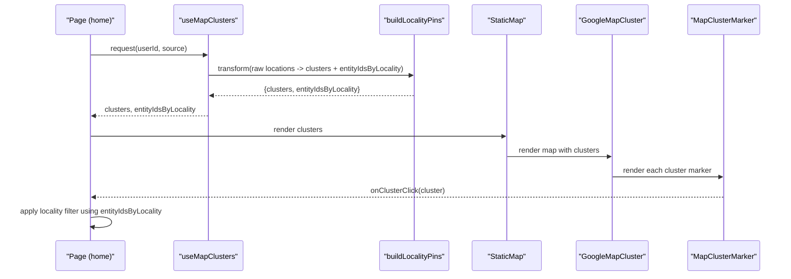
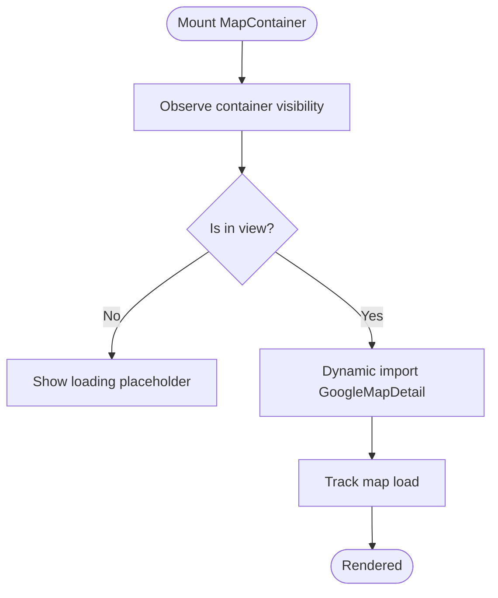
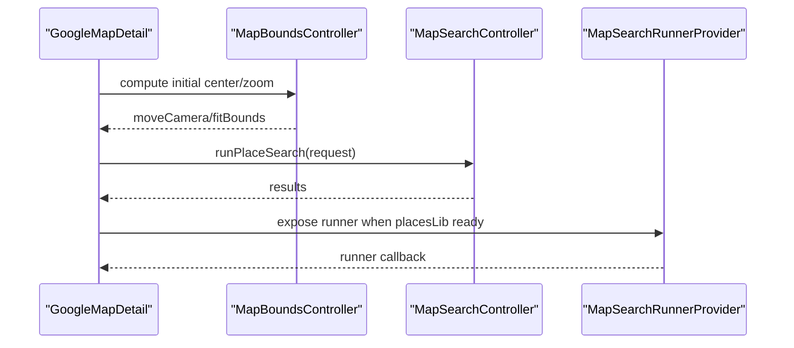
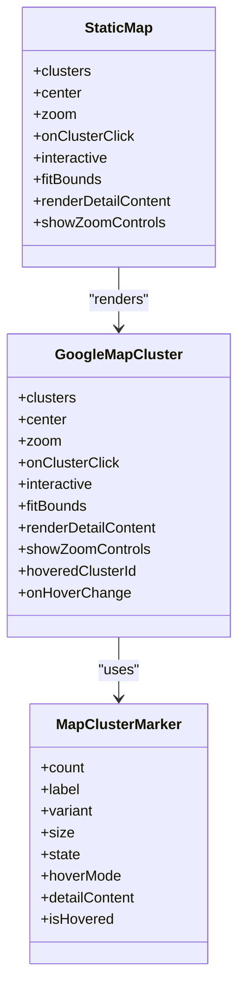
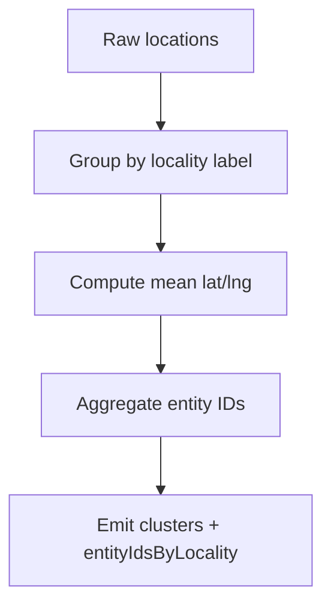
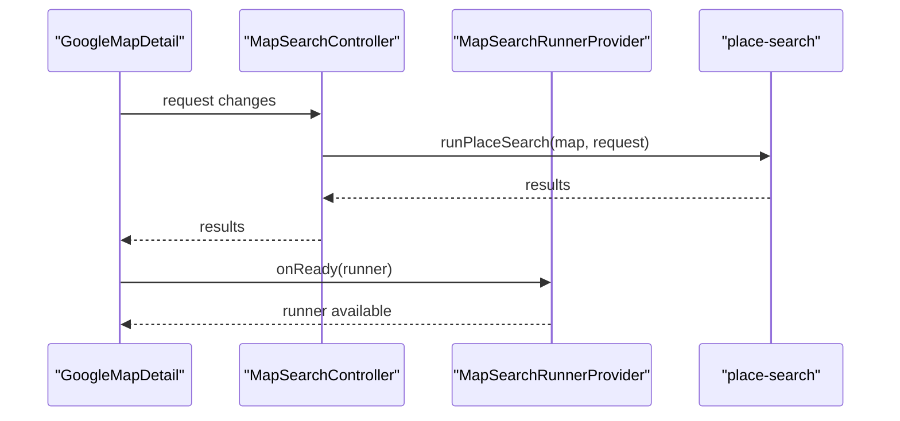
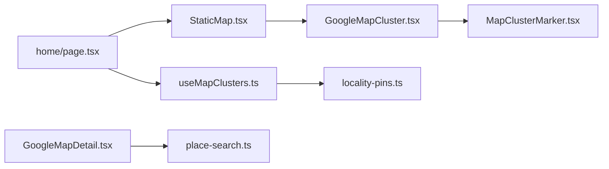

# Interactive Map Integration

<cite>
**Referenced Files in This Document**
- [MapContainer.tsx](file://src/components/ui/map/MapContainer.tsx)
- [GoogleMapDetail.tsx](file://src/components/ui/map/GoogleMapDetail.tsx)
- [StaticMap.tsx](file://src/components/ui/map/StaticMap.tsx)
- [GoogleMapCluster.tsx](file://src/components/ui/map/GoogleMapCluster.tsx)
- [MapClusterMarker.tsx](file://src/components/ui/map/MapClusterMarker.tsx)
- [MapMarkerHover.tsx](file://src/components/ui/map/MapMarkerHover.tsx)
- [MapNameBubble.tsx](file://src/components/ui/map/MapNameBubble.tsx)
- [useMapClusters.ts](file://src/hooks/useMapClusters.ts)
- [locality-pins.ts](file://src/lib/maps/locality-pins.ts)
- [place-search.ts](file://src/lib/maps/place-search.ts)
- [home/page.tsx](file://src/app/home/page.tsx)
</cite>

## Table of Contents
1. [Introduction](#introduction)
2. [Project Structure](#project-structure)
3. [Core Components](#core-components)
4. [Architecture Overview](#architecture-overview)
5. [Detailed Component Analysis](#detailed-component-analysis)
6. [Dependency Analysis](#dependency-analysis)
7. [Performance Considerations](#performance-considerations)
8. [Troubleshooting Guide](#troubleshooting-guide)
9. [Conclusion](#conclusion)

## Introduction
This document explains Argo’s interactive map integration that combines Google Maps clustering, location visualization, and locality-based filtering across multiple contexts (dashboard, collections, itineraries). It covers:
- Clustering algorithm for grouping nearby locations to optimize rendering performance
- Cluster click handling to filter related content by locality
- Dynamic viewport adjustments based on data context
- Static map generation for thumbnails and previews with marker positioning, zoom levels, and styling
- A reusable map container component providing consistent interactions
- Performance strategies including lazy loading, intersection-based initialization, and memory management

## Project Structure
The map feature is implemented as a set of composable React components under the UI layer, a hook for fetching and transforming cluster data, and utilities for locality grouping and place search. Pages consume these abstractions to render maps in different contexts.

**Diagram sources**
- [home/page.tsx:48-55](file://src/app/home/page.tsx#L48-L55)
- [StaticMap.tsx:34-93](file://src/components/ui/map/StaticMap.tsx#L34-L93)
- [GoogleMapCluster.tsx:9-11](file://src/components/ui/map/GoogleMapCluster.tsx#L9-L11)
- [MapClusterMarker.tsx:51-109](file://src/components/ui/map/MapClusterMarker.tsx#L51-L109)
- [MapMarkerHover.tsx:42-70](file://src/components/ui/map/MapMarkerHover.tsx#L42-L70)
- [GoogleMapDetail.tsx:23-25](file://src/components/ui/map/GoogleMapDetail.tsx#L23-L25)
- [useMapClusters.ts:18-33](file://src/hooks/useMapClusters.ts#L18-L33)
- [locality-pins.ts:28-77](file://src/lib/maps/locality-pins.ts#L28-L77)

**Section sources**
- [home/page.tsx:48-55](file://src/app/home/page.tsx#L48-L55)
- [StaticMap.tsx:34-93](file://src/components/ui/map/StaticMap.tsx#L34-L93)
- [GoogleMapCluster.tsx:9-11](file://src/components/ui/map/GoogleMapCluster.tsx#L9-L11)
- [MapClusterMarker.tsx:51-109](file://src/components/ui/map/MapClusterMarker.tsx#L51-L109)
- [MapMarkerHover.tsx:42-70](file://src/components/ui/map/MapMarkerHover.tsx#L42-L70)
- [GoogleMapDetail.tsx:23-25](file://src/components/ui/map/GoogleMapDetail.tsx#L23-L25)
- [useMapClusters.ts:18-33](file://src/hooks/useMapClusters.ts#L18-L33)
- [locality-pins.ts:28-77](file://src/lib/maps/locality-pins.ts#L28-L77)

## Core Components
- MapContainer: Lazy-loads the detailed map view and tracks load events when visible. Provides consistent sizing, placeholder states, and forwards all interaction props to the underlying detail map.
- GoogleMapDetail: Renders individual locations with advanced markers, polylines, hover details, and integrated place search. Computes initial center/zoom and manages bounds transitions.
- StaticMap: Lightweight wrapper for clustered views. Lazily renders clusters, tracks visibility, and exposes hover state for cluster markers.
- GoogleMapCluster: Hosts the Google Maps instance for clusters, computes auto-view, fits bounds, and renders cluster markers with optional zoom controls.
- MapClusterMarker: Visual cluster pin with hover popups (compact or detail), styled via variants and sizes.
- MapMarkerHover: Compact hover badge showing count and label.
- MapNameBubble: Lightweight name-only bubble for minimal hover affordance.

Key responsibilities:
- Data flow: useMapClusters fetches raw locations and transforms them into clusters and locality-to-entity mappings.
- Rendering: StaticMap and GoogleMapDetail render either clustered or detailed markers depending on context.
- Interaction: Clicking a cluster can trigger content filtering; hovering shows contextual info.

**Section sources**
- [MapContainer.tsx:10-99](file://src/components/ui/map/MapContainer.tsx#L10-L99)
- [GoogleMapDetail.tsx:27-54](file://src/components/ui/map/GoogleMapDetail.tsx#L27-L54)
- [StaticMap.tsx:9-32](file://src/components/ui/map/StaticMap.tsx#L9-L32)
- [GoogleMapCluster.tsx:13-67](file://src/components/ui/map/GoogleMapCluster.tsx#L13-L67)
- [MapClusterMarker.tsx:35-115](file://src/components/ui/map/MapClusterMarker.tsx#L35-L115)
- [MapMarkerHover.tsx:28-78](file://src/components/ui/map/MapMarkerHover.tsx#L28-L78)
- [MapNameBubble.tsx:5-26](file://src/components/ui/map/MapNameBubble.tsx#L5-L26)
- [useMapClusters.ts:35-61](file://src/hooks/useMapClusters.ts#L35-L61)

## Architecture Overview
The system separates concerns between data preparation, rendering, and interaction:
- Data preparation: useMapClusters queries Supabase and builds locality pins via buildLocalityPins.
- Rendering: StaticMap renders clustered markers; GoogleMapDetail renders detailed markers and polylines.
- Interaction: Cluster clicks propagate to parent pages to update filters; hover states are managed locally within map components.

**Diagram sources**
- [useMapClusters.ts:35-61](file://src/hooks/useMapClusters.ts#L35-L61)
- [locality-pins.ts:28-77](file://src/lib/maps/locality-pins.ts#L28-L77)
- [StaticMap.tsx:39-93](file://src/components/ui/map/StaticMap.tsx#L39-L93)
- [GoogleMapCluster.tsx:80-136](file://src/components/ui/map/GoogleMapCluster.tsx#L80-L136)
- [MapClusterMarker.tsx:51-109](file://src/components/ui/map/MapClusterMarker.tsx#L51-L109)

## Detailed Component Analysis

### MapContainer
- Purpose: Provide a reusable, lazily loaded map container for detailed views (e.g., itineraries). Tracks visibility and emits a load event once rendered.
- Key behaviors:
  - Uses an intersection observer to defer rendering until visible.
  - Wraps GoogleMapDetail with dynamic import to avoid SSR issues.
  - Exposes props for default center/zoom, fit bounds, highlighting, and search integration.

**Diagram sources**
- [MapContainer.tsx:45-99](file://src/components/ui/map/MapContainer.tsx#L45-L99)

**Section sources**
- [MapContainer.tsx:45-99](file://src/components/ui/map/MapContainer.tsx#L45-L99)

### GoogleMapDetail
- Purpose: Render detailed location markers, route polylines, hover cards, and integrate place search.
- Key behaviors:
  - Computes initial center and estimateZoom based on locations.
  - Manages bounds transitions with optional animation and single-location zoom.
  - Integrates place search via MapSearchController and exposes a runner provider for external use.
  - Supports hoverVariant to switch between rich card and lightweight name bubble.

**Diagram sources**
- [GoogleMapDetail.tsx:27-54](file://src/components/ui/map/GoogleMapDetail.tsx#L27-L54)
- [GoogleMapDetail.tsx:105-184](file://src/components/ui/map/GoogleMapDetail.tsx#L105-L184)
- [GoogleMapDetail.tsx:289-463](file://src/components/ui/map/GoogleMapDetail.tsx#L289-L463)

**Section sources**
- [GoogleMapDetail.tsx:27-54](file://src/components/ui/map/GoogleMapDetail.tsx#L27-L54)
- [GoogleMapDetail.tsx:105-184](file://src/components/ui/map/GoogleMapDetail.tsx#L105-L184)
- [GoogleMapDetail.tsx:289-463](file://src/components/ui/map/GoogleMapDetail.tsx#L289-L463)

### StaticMap and GoogleMapCluster
- StaticMap:
  - Lazily renders GoogleMapCluster only when visible.
  - Tracks hover state per cluster and forwards it down.
  - Emits map load tracking on first view.
- GoogleMapCluster:
  - Calculates auto-view from clusters (center and zoom) based on geographic spread.
  - Fits bounds to encompass all clusters or centers on a single cluster.
  - Renders AdvancedMarker wrappers around MapClusterMarker with hover/click handlers.

**Diagram sources**
- [StaticMap.tsx:39-93](file://src/components/ui/map/StaticMap.tsx#L39-L93)
- [GoogleMapCluster.tsx:80-136](file://src/components/ui/map/GoogleMapCluster.tsx#L80-L136)
- [MapClusterMarker.tsx:51-109](file://src/components/ui/map/MapClusterMarker.tsx#L51-L109)

**Section sources**
- [StaticMap.tsx:39-93](file://src/components/ui/map/StaticMap.tsx#L39-L93)
- [GoogleMapCluster.tsx:13-67](file://src/components/ui/map/GoogleMapCluster.tsx#L13-L67)
- [GoogleMapCluster.tsx:80-136](file://src/components/ui/map/GoogleMapCluster.tsx#L80-L136)
- [MapClusterMarker.tsx:51-109](file://src/components/ui/map/MapClusterMarker.tsx#L51-L109)

### MapMarkerHover and MapNameBubble
- MapMarkerHover: Displays compact hover badge with count and label, styled by variant and size.
- MapNameBubble: Minimal label bubble used for lightweight hover mode in detailed maps.

**Section sources**
- [MapMarkerHover.tsx:42-70](file://src/components/ui/map/MapMarkerHover.tsx#L42-L70)
- [MapNameBubble.tsx:15-24](file://src/components/ui/map/MapNameBubble.tsx#L15-L24)

### Data Preparation: useMapClusters and locality-pins
- useMapClusters:
  - Selects query function by source (dashboard, collections, content, itineraries).
  - Transforms raw locations into clusters and a mapping from locality labels to entity IDs.
  - Caches results with stale time and provides isLoading status.
- buildLocalityPins:
  - Groups entities by "{region}, {country}" or country if region missing.
  - Computes mean lat/lng for cluster position and aggregates entity IDs.
  - Returns clusters and entityIdsByLocality for downstream filtering.

**Diagram sources**
- [useMapClusters.ts:18-33](file://src/hooks/useMapClusters.ts#L18-L33)
- [useMapClusters.ts:35-61](file://src/hooks/useMapClusters.ts#L35-L61)
- [locality-pins.ts:28-77](file://src/lib/maps/locality-pins.ts#L28-L77)

**Section sources**
- [useMapClusters.ts:18-33](file://src/hooks/useMapClusters.ts#L18-L33)
- [useMapClusters.ts:35-61](file://src/hooks/useMapClusters.ts#L35-L61)
- [locality-pins.ts:28-77](file://src/lib/maps/locality-pins.ts#L28-L77)

### Place Search Integration
- GoogleMapDetail integrates place search through MapSearchController and MapSearchRunnerProvider.
- The controller runs text or nearby searches based on the active request nonce and updates result markers.
- The runner provider exposes a function to perform viewport-biased searches from outside the map component tree.

**Diagram sources**
- [GoogleMapDetail.tsx:105-184](file://src/components/ui/map/GoogleMapDetail.tsx#L105-L184)
- [GoogleMapDetail.tsx:289-463](file://src/components/ui/map/GoogleMapDetail.tsx#L289-L463)
- [place-search.ts](file://src/lib/maps/place-search.ts)

**Section sources**
- [GoogleMapDetail.tsx:105-184](file://src/components/ui/map/GoogleMapDetail.tsx#L105-L184)
- [GoogleMapDetail.tsx:289-463](file://src/components/ui/map/GoogleMapDetail.tsx#L289-L463)
- [place-search.ts](file://src/lib/maps/place-search.ts)

## Dependency Analysis
- Pages depend on StaticMap and useMapClusters to display clustered maps and drive filters.
- StaticMap depends on GoogleMapCluster and MapClusterMarker for rendering.
- GoogleMapDetail depends on place-search utilities and theme-aware map styles.
- useMapClusters depends on Supabase queries and locality-pins transformation.

**Diagram sources**
- [home/page.tsx:48-55](file://src/app/home/page.tsx#L48-L55)
- [StaticMap.tsx:34-93](file://src/components/ui/map/StaticMap.tsx#L34-L93)
- [GoogleMapCluster.tsx:80-136](file://src/components/ui/map/GoogleMapCluster.tsx#L80-L136)
- [MapClusterMarker.tsx:51-109](file://src/components/ui/map/MapClusterMarker.tsx#L51-L109)
- [GoogleMapDetail.tsx:23-25](file://src/components/ui/map/GoogleMapDetail.tsx#L23-L25)
- [useMapClusters.ts:18-33](file://src/hooks/useMapClusters.ts#L18-L33)
- [locality-pins.ts:28-77](file://src/lib/maps/locality-pins.ts#L28-L77)

**Section sources**
- [home/page.tsx:48-55](file://src/app/home/page.tsx#L48-L55)
- [StaticMap.tsx:34-93](file://src/components/ui/map/StaticMap.tsx#L34-L93)
- [GoogleMapCluster.tsx:80-136](file://src/components/ui/map/GoogleMapCluster.tsx#L80-L136)
- [MapClusterMarker.tsx:51-109](file://src/components/ui/map/MapClusterMarker.tsx#L51-L109)
- [GoogleMapDetail.tsx:23-25](file://src/components/ui/map/GoogleMapDetail.tsx#L23-L25)
- [useMapClusters.ts:18-33](file://src/hooks/useMapClusters.ts#L18-L33)
- [locality-pins.ts:28-77](file://src/lib/maps/locality-pins.ts#L28-L77)

## Performance Considerations
- Lazy loading:
  - MapContainer and StaticMap dynamically import map modules and render only when in view using intersection observers.
  - Reduces initial bundle size and avoids unnecessary SDK initialization.
- Visibility-based initialization:
  - trackMapLoad is called when maps become visible, enabling accurate analytics without premature loads.
- Auto-view calculation:
  - calculateMapView estimates appropriate zoom based on geographic spread to prevent over/under zooming.
- Bounds fitting:
  - MapBoundsController fits bounds efficiently and handles single-cluster centering for focused views.
- Memory management:
  - Dynamic imports ensure map instances are created on demand.
  - Place search controllers manage lifecycle via refs to avoid stale callbacks and redundant requests.
- Caching:
  - useMapClusters caches cluster data with a stale time to reduce network calls.

[No sources needed since this section provides general guidance]

## Troubleshooting Guide
- Map not rendering:
  - Ensure the container is visible; check intersection observer behavior and eager prop usage.
  - Verify environment variables for Google Maps API key and map IDs are set.
- Incorrect zoom or center:
  - Review calculateMapView thresholds and estimateZoom logic; adjust if necessary for specific datasets.
- Place search not updating:
  - Confirm request nonce changes trigger re-execution and that places library is loaded before running searches.
- Hover states not clearing:
  - Check hover state propagation from StaticMap to GoogleMapCluster and ensure onHoverChange resets properly.

**Section sources**
- [MapContainer.tsx:45-99](file://src/components/ui/map/MapContainer.tsx#L45-L99)
- [GoogleMapCluster.tsx:13-67](file://src/components/ui/map/GoogleMapCluster.tsx#L13-L67)
- [GoogleMapDetail.tsx:105-184](file://src/components/ui/map/GoogleMapDetail.tsx#L105-L184)
- [StaticMap.tsx:39-93](file://src/components/ui/map/StaticMap.tsx#L39-L93)

## Conclusion
Argo’s map integration delivers a scalable, performant, and user-friendly experience by combining lazy-loaded rendering, intelligent auto-view calculations, and locality-based filtering. The modular design allows reuse across dashboards, collections, and itineraries while maintaining clear separation between data preparation, rendering, and interaction. With built-in caching, intersection-based initialization, and robust place search integration, the system supports large datasets and diverse use cases effectively.

[No sources needed since this section summarizes without analyzing specific files]