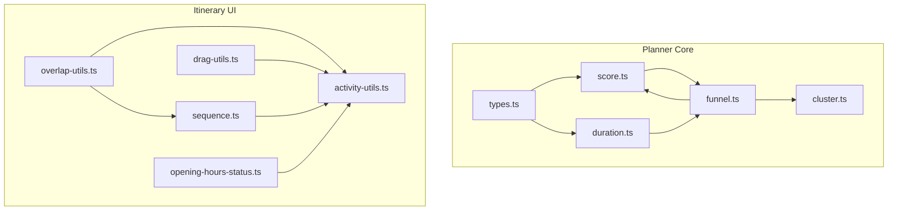
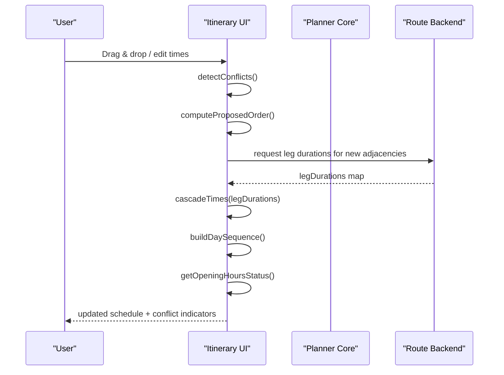
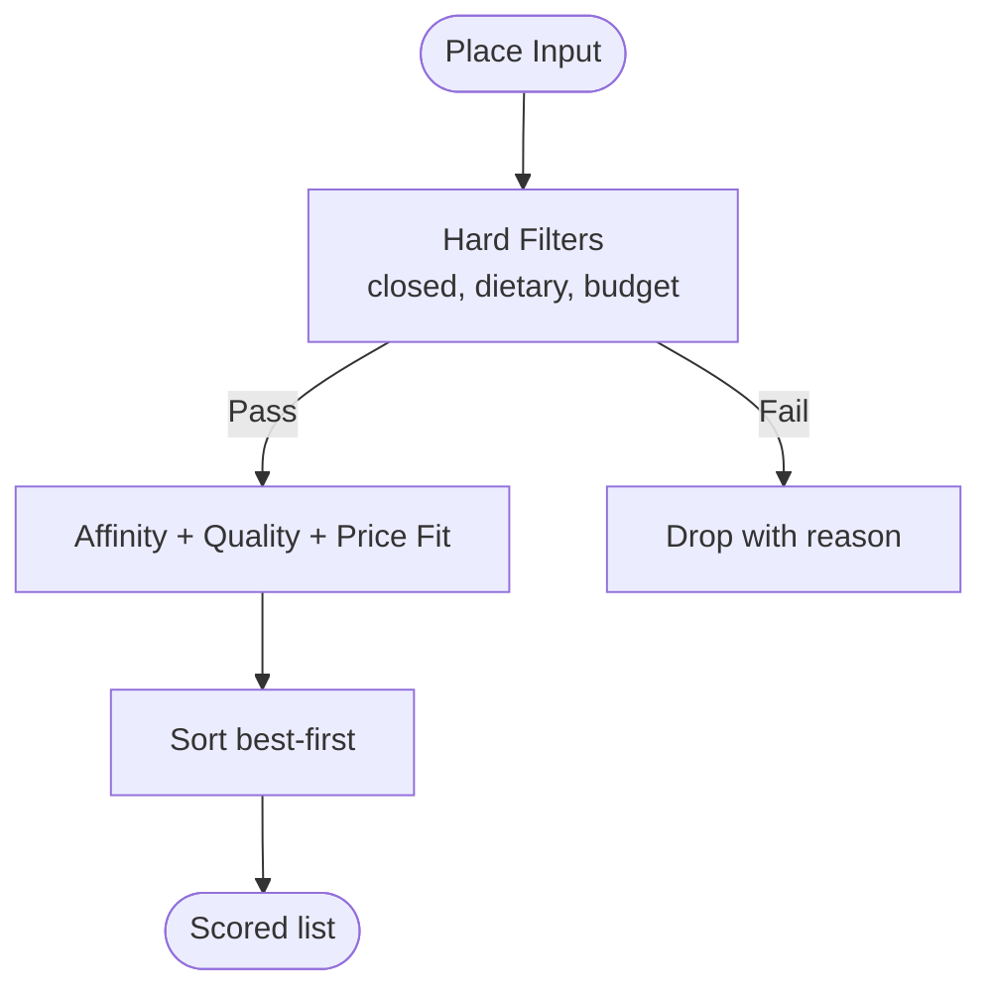
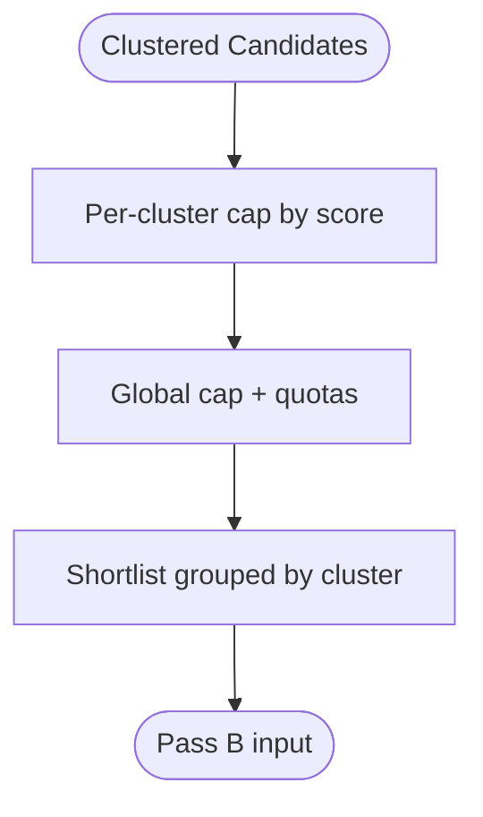
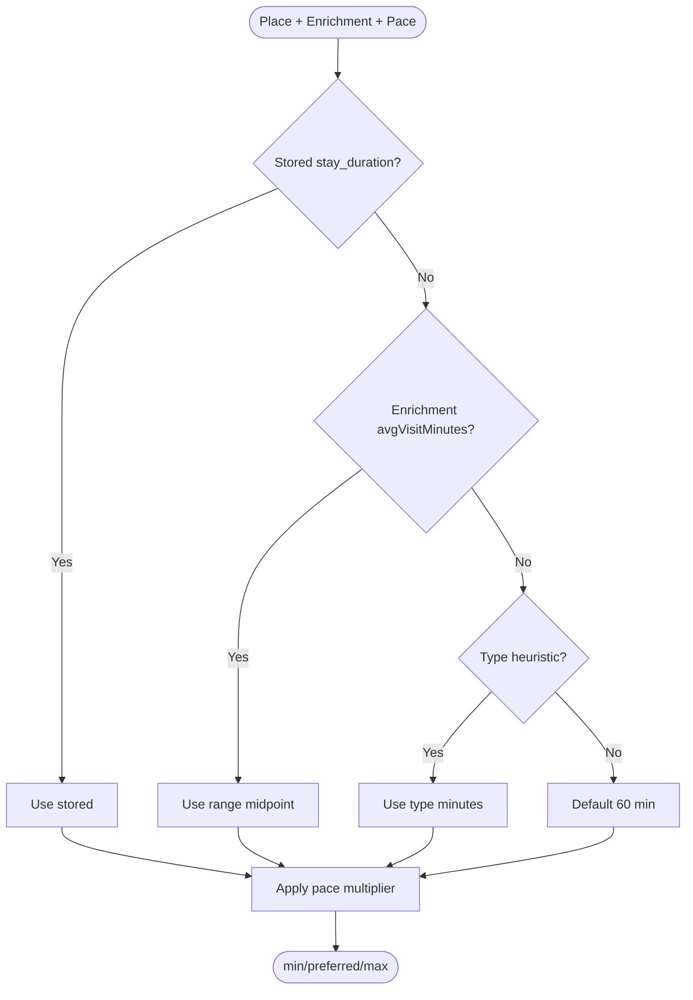
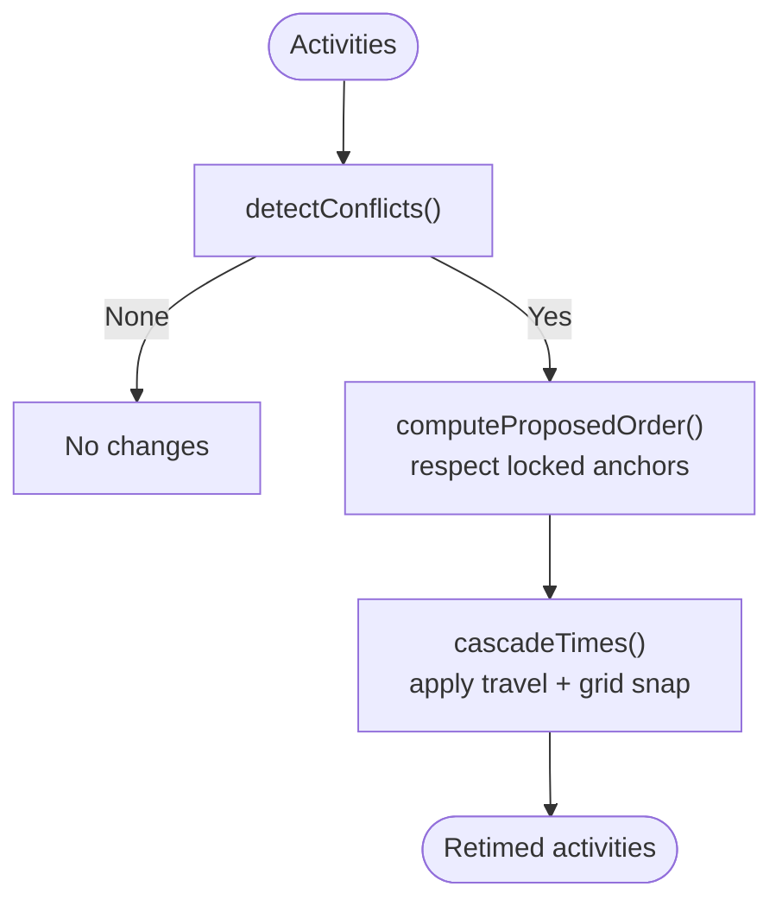
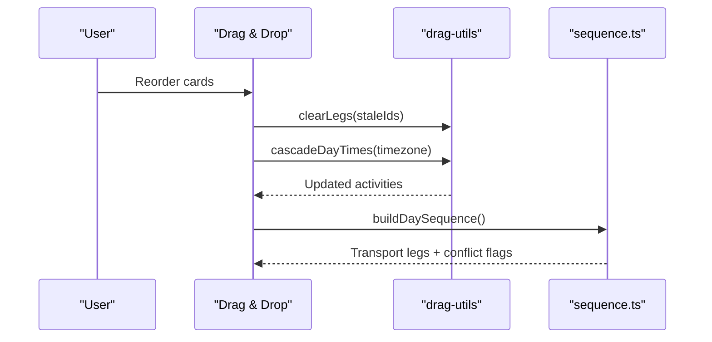
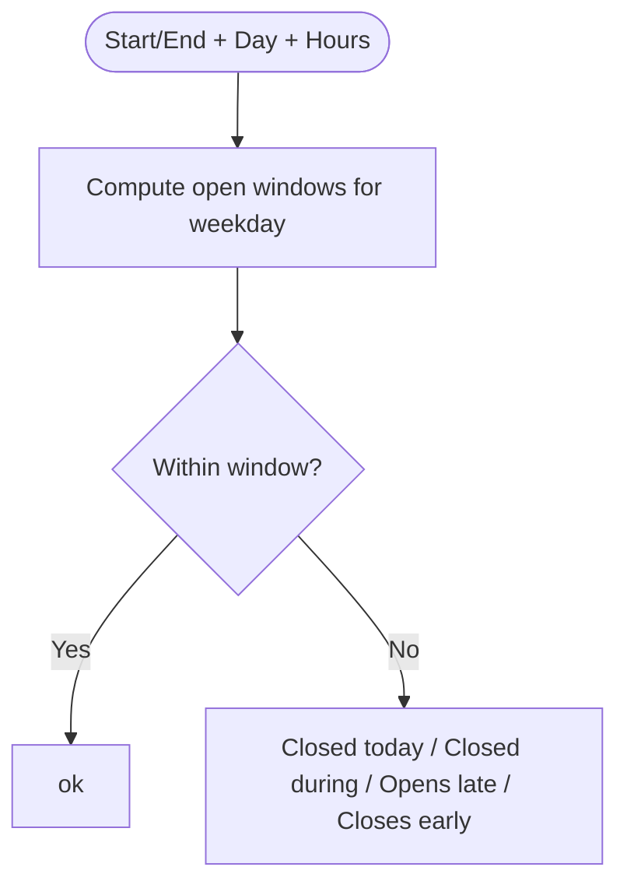
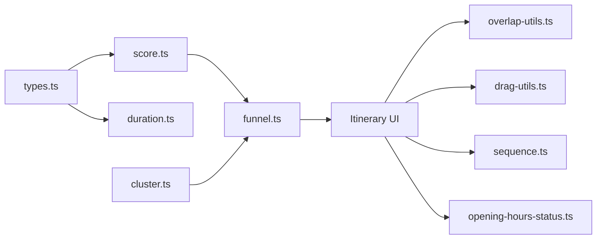

# AI-Powered Route Optimization

<cite>
**Referenced Files in This Document**
- [overlap-utils.ts](file://src/components/ui/itinerary/overlap-utils.ts)
- [drag-utils.ts](file://src/components/ui/itinerary/drag-utils.ts)
- [sequence.ts](file://src/components/ui/itinerary/ItineraryDayColumn/sequence.ts)
- [activity-utils.ts](file://src/components/ui/itinerary/activity-utils.ts)
- [opening-hours-status.ts](file://src/components/ui/itinerary/opening-hours-status.ts)
- [score.ts](file://src/lib/planner/score.ts)
- [funnel.ts](file://src/lib/planner/funnel.ts)
- [cluster.ts](file://src/lib/planner/cluster.ts)
- [duration.ts](file://src/lib/planner/duration.ts)
- [types.ts](file://src/lib/planner/types.ts)
</cite>

## Table of Contents
1. Introduction
2. Project Structure
3. Core Components
4. Architecture Overview
5. Detailed Component Analysis
6. Dependency Analysis
7. Performance Considerations
8. Troubleshooting Guide
9. Conclusion
10. Appendices

## Introduction
This document explains the AI-powered route optimization system that plans optimal activity sequences across a day or multi-day itinerary. It covers how the system computes schedules considering opening hours, travel times, geographic proximity, and user preferences; how it detects and resolves conflicts (overlaps and time cascades); how the drag-and-drop interface integrates with AI recommendations while preserving consistency; and how to customize behavior for different planning needs.

## Project Structure
The system is split into two cooperating layers:
- Planner core (deterministic algorithms): scoring, clustering, duration resolution, candidate funnel, and preference profiles.
- Itinerary UI layer: conflict detection/resolution, time cascading, sequence rendering, and opening-hours checks.

**Diagram sources**
- [score.ts:1-200](file://src/lib/planner/score.ts#L1-L200)
- [funnel.ts:1-448](file://src/lib/planner/funnel.ts#L1-L448)
- [cluster.ts:1-166](file://src/lib/planner/cluster.ts#L1-L166)
- [duration.ts:1-105](file://src/lib/planner/duration.ts#L1-L105)
- [types.ts:1-93](file://src/lib/planner/types.ts#L1-L93)
- [overlap-utils.ts:1-303](file://src/components/ui/itinerary/overlap-utils.ts#L1-L303)
- [drag-utils.ts:1-89](file://src/components/ui/itinerary/drag-utils.ts#L1-L89)
- [sequence.ts:1-196](file://src/components/ui/itinerary/ItineraryDayColumn/sequence.ts#L1-L196)
- [activity-utils.ts:1-128](file://src/components/ui/itinerary/activity-utils.ts#L1-L128)
- [opening-hours-status.ts:1-112](file://src/components/ui/itinerary/opening-hours-status.ts#L1-L112)

**Section sources**
- [score.ts:1-200](file://src/lib/planner/score.ts#L1-L200)
- [funnel.ts:1-448](file://src/lib/planner/funnel.ts#L1-L448)
- [cluster.ts:1-166](file://src/lib/planner/cluster.ts#L1-L166)
- [duration.ts:1-105](file://src/lib/planner/duration.ts#L1-L105)
- [types.ts:1-93](file://src/lib/planner/types.ts#L1-L93)
- [overlap-utils.ts:1-303](file://src/components/ui/itinerary/overlap-utils.ts#L1-L303)
- [drag-utils.ts:1-89](file://src/components/ui/itinerary/drag-utils.ts#L1-L89)
- [sequence.ts:1-196](file://src/components/ui/itinerary/ItineraryDayColumn/sequence.ts#L1-L196)
- [activity-utils.ts:1-128](file://src/components/ui/itinerary/activity-utils.ts#L1-L128)
- [opening-hours-status.ts:1-112](file://src/components/ui/itinerary/opening-hours-status.ts#L1-L112)

## Core Components
- Preference profile and scheduler options define user interests, dietary constraints, pace, budget, and scheduling knobs.
- Candidate scoring ranks places by affinity, quality, and price fit, with hard filters for closed venues, dietary conflicts, and extreme budget mismatches.
- Geographic clustering groups nearby candidates per day using k-means++ for coherent neighborhood planning.
- Duration resolution estimates visit lengths via a ladder (stored stay durations, enrichment ranges, type heuristics, global default) and adjusts by pace.
- The candidate funnel narlists top candidates per cluster and globally, enforcing quotas (e.g., restaurant share, cuisine diversity).
- Conflict detection identifies overlapping activities and transport overflow between consecutive rows.
- Time cascading re-times unlocked activities on a 10-minute grid, respecting locked anchors and travel legs.
- Sequence building renders activities and transport legs, marking conflicts when travel cannot fit.
- Opening-hours status validates scheduled windows against location hours, including overnight periods.

**Section sources**
- [types.ts:1-93](file://src/lib/planner/types.ts#L1-L93)
- [score.ts:1-200](file://src/lib/planner/score.ts#L1-L200)
- [cluster.ts:1-166](file://src/lib/planner/cluster.ts#L1-L166)
- [duration.ts:1-105](file://src/lib/planner/duration.ts#L1-L105)
- [funnel.ts:1-448](file://src/lib/planner/funnel.ts#L1-L448)
- [overlap-utils.ts:1-303](file://src/components/ui/itinerary/overlap-utils.ts#L1-L303)
- [sequence.ts:1-196](file://src/components/ui/itinerary/ItineraryDayColumn/sequence.ts#L1-L196)
- [opening-hours-status.ts:1-112](file://src/components/ui/itinerary/opening-hours-status.ts#L1-L112)

## Architecture Overview
The system runs deterministic stages before any LLM involvement: retrieve → filter → score → cluster → funnel shortlist → assign clusters to days → compute routes and times → render and validate.

**Diagram sources**
- [overlap-utils.ts:75-218](file://src/components/ui/itinerary/overlap-utils.ts#L75-L218)
- [drag-utils.ts:37-88](file://src/components/ui/itinerary/drag-utils.ts#L37-L88)
- [sequence.ts:68-193](file://src/components/ui/itinerary/ItineraryDayColumn/sequence.ts#L68-L193)
- [opening-hours-status.ts:84-112](file://src/components/ui/itinerary/opening-hours-status.ts#L84-L112)

## Detailed Component Analysis

### Scoring and Personalization
- Scores combine interest affinity, Bayesian-quality rating, and price fit with configurable weights.
- Hard filters remove permanently closed venues, enforce dietary constraints for meal slots, and kill extreme budget outliers.
- Reasons are attached to each scored place for explainability.

**Diagram sources**
- [score.ts:90-200](file://src/lib/planner/score.ts#L90-L200)

**Section sources**
- [score.ts:1-200](file://src/lib/planner/score.ts#L1-L200)

### Candidate Funnel and Clustering
- The funnel applies per-cluster caps, then a global cap with quotas (restaurant share, cuisine diversity), producing a shortlist grouped by cluster.
- Geographic clustering uses k-means++ seeding and Lloyd iterations to group nearby candidates into neighborhoods aligned with planned days.

**Diagram sources**
- [funnel.ts:179-312](file://src/lib/planner/funnel.ts#L179-L312)
- [cluster.ts:84-165](file://src/lib/planner/cluster.ts#L84-L165)

**Section sources**
- [funnel.ts:1-448](file://src/lib/planner/funnel.ts#L1-L448)
- [cluster.ts:1-166](file://src/lib/planner/cluster.ts#L1-L166)

### Visit Duration Resolution
- Resolves preferred visit length from stored durations, enrichment ranges, type heuristics, or a global default.
- Applies pace multipliers to preferred while keeping within min/max bounds.

**Diagram sources**
- [duration.ts:84-105](file://src/lib/planner/duration.ts#L84-L105)

**Section sources**
- [duration.ts:1-105](file://src/lib/planner/duration.ts#L1-L105)

### Conflict Detection and Resolution
- Detects overlaps among timed activities and transport overflow where travel exceeds the gap to the next activity.
- Computes a proposed order that respects locked anchors (e.g., flights) and defers unlocked activities around them.
- Cascades start/end times forward on a 10-minute grid, preserving durations and stopping if overpacked.

**Diagram sources**
- [overlap-utils.ts:75-218](file://src/components/ui/itinerary/overlap-utils.ts#L75-L218)

**Section sources**
- [overlap-utils.ts:1-303](file://src/components/ui/itinerary/overlap-utils.ts#L1-L303)

### Drag-and-Drop Integration and Consistency
- On reorder, the UI clears stale travel legs to avoid drawing outdated routes until recomputation completes.
- Times are cascaded after drops: each activity starts no earlier than previous end plus rounded travel, with all times snapped to a 10-minute step.
- The sequence builder inserts transport legs between activities when backend data exists and marks conflicts when travel cannot fit.

**Diagram sources**
- [drag-utils.ts:25-88](file://src/components/ui/itinerary/drag-utils.ts#L25-L88)
- [sequence.ts:68-193](file://src/components/ui/itinerary/ItineraryDayColumn/sequence.ts#L68-L193)

**Section sources**
- [drag-utils.ts:1-89](file://src/components/ui/itinerary/drag-utils.ts#L1-L89)
- [sequence.ts:1-196](file://src/components/ui/itinerary/ItineraryDayColumn/sequence.ts#L1-L196)

### Opening Hours Validation
- Validates scheduled windows against location opening hours, handling overnight periods and missing data gracefully.
- Returns actionable statuses such as “opens late” or “closes early” to guide adjustments.

**Diagram sources**
- [opening-hours-status.ts:84-112](file://src/components/ui/itinerary/opening-hours-status.ts#L84-L112)

**Section sources**
- [opening-hours-status.ts:1-112](file://src/components/ui/itinerary/opening-hours-status.ts#L1-L112)

## Dependency Analysis
- Planner core depends on types for shared vocabulary and on scoring for ranking; funnel orchestrates clustering and quota enforcement.
- UI layer depends on utility functions for time parsing/formatting and on sequence building to visualize legs and conflicts.
- Overlap resolution consumes backend-provided travel durations and feeds back retimed activities to the UI.

**Diagram sources**
- [types.ts:1-93](file://src/lib/planner/types.ts#L1-L93)
- [score.ts:1-200](file://src/lib/planner/score.ts#L1-L200)
- [duration.ts:1-105](file://src/lib/planner/duration.ts#L1-L105)
- [funnel.ts:1-448](file://src/lib/planner/funnel.ts#L1-L448)
- [cluster.ts:1-166](file://src/lib/planner/cluster.ts#L1-L166)
- [overlap-utils.ts:1-303](file://src/components/ui/itinerary/overlap-utils.ts#L1-L303)
- [drag-utils.ts:1-89](file://src/components/ui/itinerary/drag-utils.ts#L1-L89)
- [sequence.ts:1-196](file://src/components/ui/itinerary/ItineraryDayColumn/sequence.ts#L1-L196)
- [opening-hours-status.ts:1-112](file://src/components/ui/itinerary/opening-hours-status.ts#L1-L112)

**Section sources**
- [types.ts:1-93](file://src/lib/planner/types.ts#L1-L93)
- [score.ts:1-200](file://src/lib/planner/score.ts#L1-L200)
- [funnel.ts:1-448](file://src/lib/planner/funnel.ts#L1-L448)
- [cluster.ts:1-166](file://src/lib/planner/cluster.ts#L1-L166)
- [overlap-utils.ts:1-303](file://src/components/ui/itinerary/overlap-utils.ts#L1-L303)
- [drag-utils.ts:1-89](file://src/components/ui/itinerary/drag-utils.ts#L1-L89)
- [sequence.ts:1-196](file://src/components/ui/itinerary/ItineraryDayColumn/sequence.ts#L1-L196)
- [opening-hours-status.ts:1-112](file://src/components/ui/itinerary/opening-hours-status.ts#L1-L112)

## Performance Considerations
- Deterministic scoring and funnel keep computations fast and reproducible; global cap limits downstream work.
- K-means clustering uses capped iterations and seeded initialization to ensure stability and speed.
- Time cascading operates only on the conflicting suffix, minimizing rework.
- Travel leg requests are limited to newly created adjacencies to reduce network calls.
- Opening-hours checks are computed on demand during render without heavy state updates.

[No sources needed since this section provides general guidance]

## Troubleshooting Guide
- Conflicts persist: verify whether activities are locked; locked anchors cannot be moved and will force downstream shifts.
- Transport overflow: check that travel durations exist on the preceding row; missing values prevent accurate cascading.
- Overpacked days: if activities push past the day boundary, cascading stops to avoid unrealistic schedules; consider splitting across days or relaxing constraints.
- Opening hours warnings: adjust start/end times to fall within open windows; overnight visits require careful alignment with closing/opening logic.

**Section sources**
- [overlap-utils.ts:229-297](file://src/components/ui/itinerary/overlap-utils.ts#L229-L297)
- [drag-utils.ts:37-88](file://src/components/ui/itinerary/drag-utils.ts#L37-L88)
- [opening-hours-status.ts:84-112](file://src/components/ui/itinerary/opening-hours-status.ts#L84-L112)

## Conclusion
The system combines transparent, deterministic algorithms with a responsive UI to produce feasible, preference-aligned itineraries. It balances user control (drag-and-drop, manual edits) with AI-driven suggestions (scoring, clustering, duration estimation) while maintaining consistency through robust conflict detection, time cascading, and opening-hours validation. Customizable preferences and scheduler options allow tailoring to diverse planning needs.

[No sources needed since this section summarizes without analyzing specific files]

## Appendices

### Example Optimization Scenarios
- Tight city tour: high-interest museums and cafes clustered geographically; funnels limit restaurants to preserve variety; cascading ensures realistic gaps between visits.
- Family-friendly day: relaxed pace increases preferred durations; opening-hours checks prevent scheduling at closed attractions; locked lodging check-in/out anchor the day.
- Budget-conscious trip: budget widening ladder surfaces affordable alternatives; scoring favors price-fit while preserving quality signals.

[No sources needed since this section provides conceptual examples]

### Customization Options
- Preferences: interests, dietary constraints, pace, budget level.
- Scheduler options: maximum clusters, initialization method, iteration caps, daily start/end bounds.
- Funnel tuning: per-cluster cap, global cap, restaurant share, cuisine diversity.

**Section sources**
- [types.ts:27-51](file://src/lib/planner/types.ts#L27-L51)
- [funnel.ts:32-56](file://src/lib/planner/funnel.ts#L32-L56)
- [duration.ts:27-34](file://src/lib/planner/duration.ts#L27-L34)