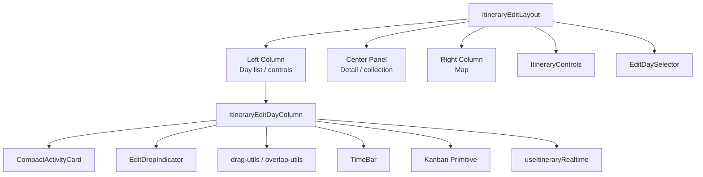
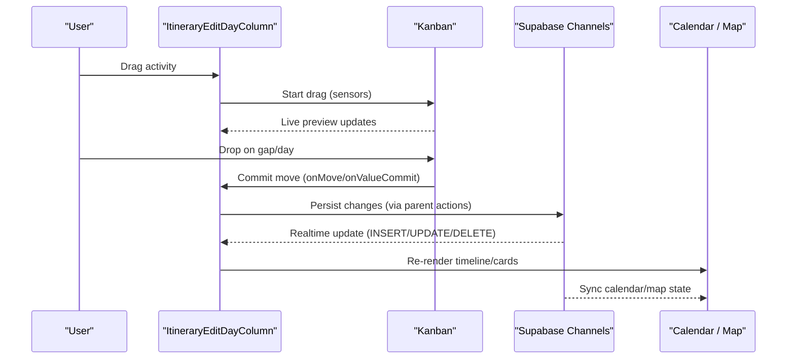
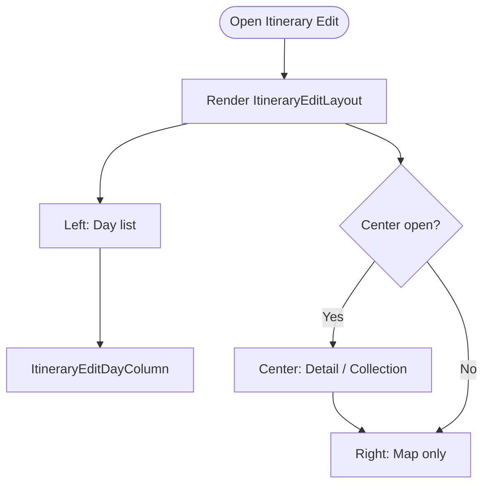
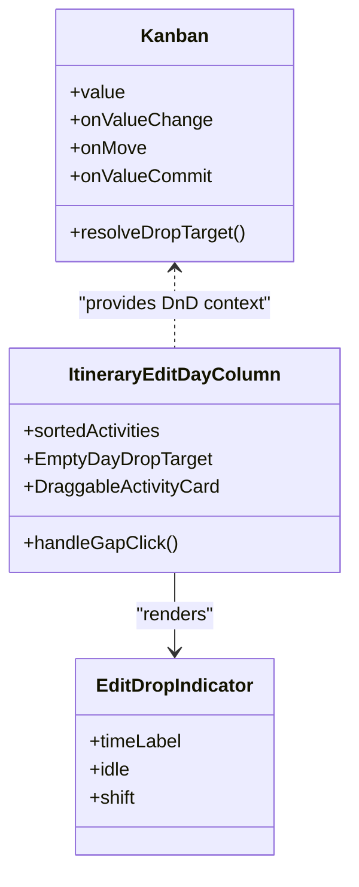
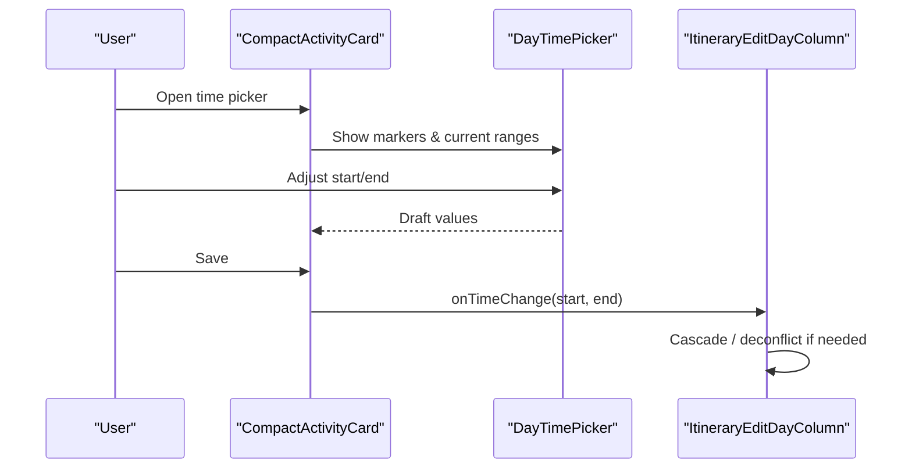
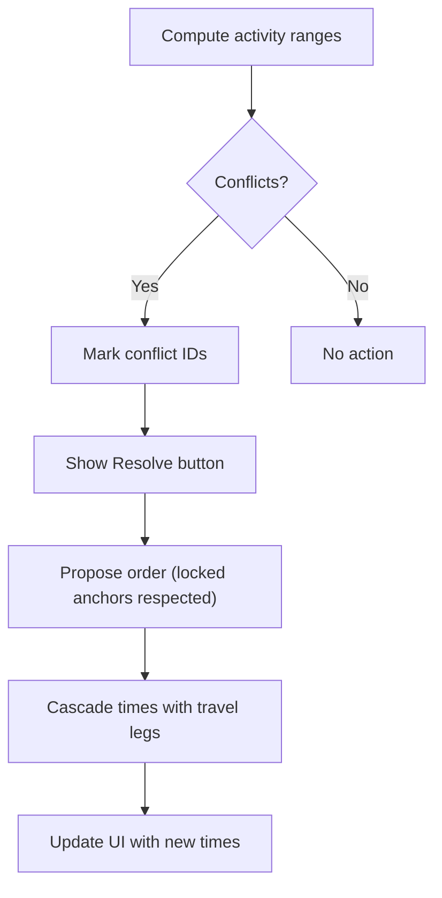
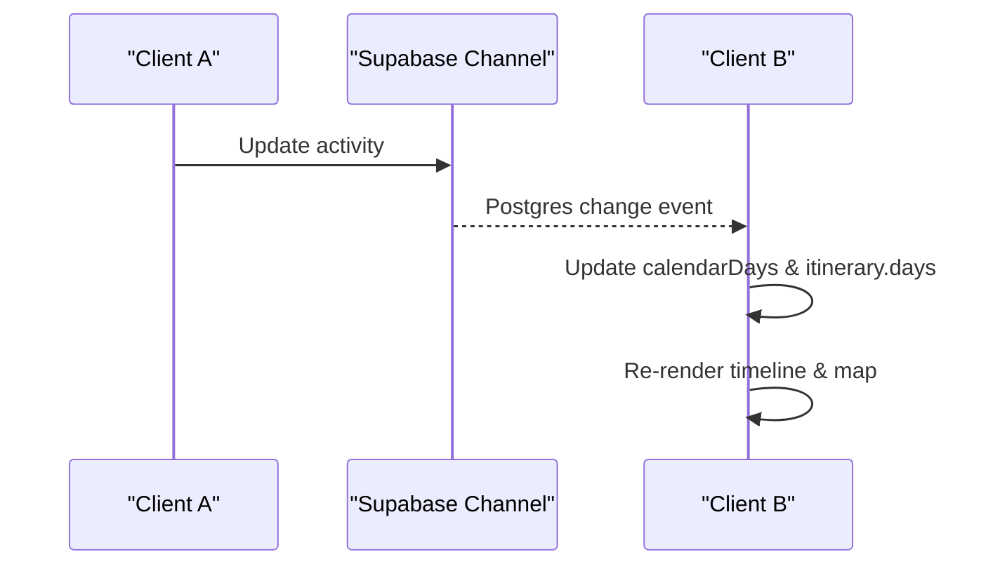
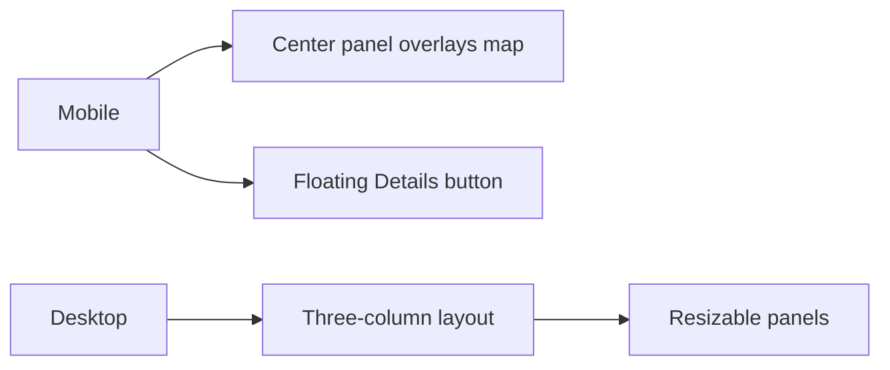
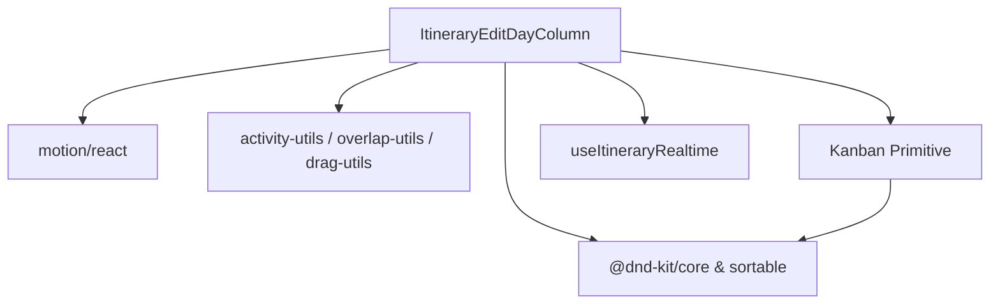
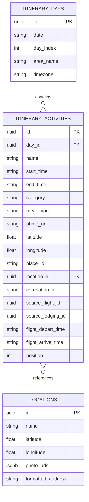

# Interactive Editing Interface

<cite>
**Referenced Files in This Document**
- [ItineraryEditLayout.tsx](file://src/components/ui/itinerary/ItineraryEditLayout.tsx)
- [ItineraryEditDayColumn.tsx](file://src/components/ui/itinerary/ItineraryEditDayColumn.tsx)
- [Kanban.tsx](file://src/components/ui/primitives/Kanban.tsx)
- [drag-utils.ts](file://src/components/ui/itinerary/drag-utils.ts)
- [EditDropIndicator.tsx](file://src/components/ui/itinerary/EditDropIndicator.tsx)
- [useItineraryRealtime.ts](file://src/hooks/useItineraryRealtime.ts)
- [CompactActivityCard.tsx](file://src/components/ui/itinerary/CompactActivityCard.tsx)
- [activity-utils.ts](file://src/components/ui/itinerary/activity-utils.ts)
- [overlap-utils.ts](file://src/components/ui/itinerary/overlap-utils.ts)
- [TimeBar.tsx](file://src/components/ui/itinerary/TimeBar.tsx)
- [ItineraryControls.tsx](file://src/components/ui/itinerary/ItineraryControls.tsx)
- [EditDaySelector.tsx](file://src/components/ui/itinerary/EditDaySelector.tsx)
</cite>

## Table of Contents
1. Introduction
2. Project Structure
3. Core Components
4. Architecture Overview
5. Detailed Component Analysis
6. Dependency Analysis
7. Performance Considerations
8. Troubleshooting Guide
9. Conclusion
10. Appendices

## Introduction
This document explains the interactive itinerary editing interface with a focus on its Kanban-style layout, drag-and-drop behavior, real-time collaboration, day-by-day editing experience (activity cards, time slots, visual indicators), responsive and accessible design, mobile adaptations, common workflows, keyboard support, advanced editing techniques, and performance optimizations for large itineraries.

## Project Structure
The editing interface is composed of:
- A three-column edit layout that adapts to screen size and supports resizing panels.
- Day columns that render activity lists as draggable items with drop zones and visual indicators.
- A shared Kanban primitive that encapsulates dnd-kit context, sensors, and commit logic.
- Utilities for time cascading, overlap detection, and conflict resolution.
- Real-time hooks that synchronize activities, days, collaborators, flights, and lodgings across clients.
- Controls and selectors for view/edit modes, tabs, and date range management.

**Diagram sources**
- [ItineraryEditLayout.tsx:25-127](file://src/components/ui/itinerary/ItineraryEditLayout.tsx#L25-L127)
- [ItineraryEditDayColumn.tsx:450-742](file://src/components/ui/itinerary/ItineraryEditDayColumn.tsx#L450-L742)
- [Kanban.tsx:216-747](file://src/components/ui/primitives/Kanban.tsx#L216-L747)
- [UseItineraryRealtime.ts:27-534](file://src/hooks/useItineraryRealtime.ts#L27-L534)

**Section sources**
- [ItineraryEditLayout.tsx:25-127](file://src/components/ui/itinerary/ItineraryEditLayout.tsx#L25-L127)
- [ItineraryEditDayColumn.tsx:450-742](file://src/components/ui/itinerary/ItineraryEditDayColumn.tsx#L450-L742)
- [Kanban.tsx:216-747](file://src/components/ui/primitives/Kanban.tsx#L216-L747)
- [ItineraryControls.tsx:57-166](file://src/components/ui/itinerary/ItineraryControls.tsx#L57-L166)
- [EditDaySelector.tsx:55-303](file://src/components/ui/itinerary/EditDaySelector.tsx#L55-L303)

## Core Components
- ItineraryEditLayout: Three-region layout (left day list, center panel, right map) with responsive behavior and resizable handles.
- ItineraryEditDayColumn: Draggable day column with activity cards, drop gaps, empty-day targets, transport rows, and conflict-aware UI.
- CompactActivityCard: Activity card with time pill, notes, thumbnails, opening-hours warnings, and inline time picker in edit mode.
- EditDropIndicator: Visual feedback for drop positions and optional time labels.
- Kanban: Shared DnD context, sensors, live preview, slot-based insertion, and commit semantics.
- Realtime hook: Subscriptions to Supabase channels for activities, days, collaborators, flights, and lodgings.
- Overlap utilities: Conflict detection, proposed ordering, and cascade re-timing with locked anchors.
- Drag utilities: Time cascading and leg clearing after reorder.
- TimeBar: Visual time bar component used by time pickers.
- Controls and selector: View/edit toggle, collaborator avatars, tabs, and date range management.

**Section sources**
- [ItineraryEditLayout.tsx:25-127](file://src/components/ui/itinerary/ItineraryEditLayout.tsx#L25-L127)
- [ItineraryEditDayColumn.tsx:450-742](file://src/components/ui/itinerary/ItineraryEditDayColumn.tsx#L450-L742)
- [CompactActivityCard.tsx:208-800](file://src/components/ui/itinerary/CompactActivityCard.tsx#L208-L800)
- [EditDropIndicator.tsx:13-46](file://src/components/ui/itinerary/EditDropIndicator.tsx#L13-L46)
- [Kanban.tsx:216-747](file://src/components/ui/primitives/Kanban.tsx#L216-L747)
- [useItineraryRealtime.ts:27-534](file://src/hooks/useItineraryRealtime.ts#L27-L534)
- [overlap-utils.ts:75-218](file://src/components/ui/itinerary/overlap-utils.ts#L75-L218)
- [drag-utils.ts:37-88](file://src/components/ui/itinerary/drag-utils.ts#L37-L88)
- [TimeBar.tsx:50-66](file://src/components/ui/itinerary/TimeBar.tsx#L50-L66)
- [ItineraryControls.tsx:57-166](file://src/components/ui/itinerary/ItineraryControls.tsx#L57-L166)
- [EditDaySelector.tsx:55-303](file://src/components/ui/itinerary/EditDaySelector.tsx#L55-L303)

## Architecture Overview
The editing interface composes a responsive layout around a Kanban-style day column. Activities are sortable within a day and droppable into gap targets or empty-day targets. The Kanban primitive provides DnD context, sensors (mouse/touch/keyboard), live preview, and commit callbacks. Real-time subscriptions keep all clients synchronized for activities, days, collaborators, flights, and lodgings. Overlap detection and cascade re-timing ensure conflicts are surfaced and resolved efficiently.

**Diagram sources**
- [Kanban.tsx:412-693](file://src/components/ui/primitives/Kanban.tsx#L412-L693)
- [ItineraryEditDayColumn.tsx:450-742](file://src/components/ui/itinerary/ItineraryEditDayColumn.tsx#L450-L742)
- [useItineraryRealtime.ts:89-333](file://src/hooks/useItineraryRealtime.ts#L89-L333)

## Detailed Component Analysis

### Kanban-style Layout and Columns
- Three-region layout with left (day list), center (detail/collection), and right (map). Responsive rules collapse or overlay panels on smaller screens; a floating “Details” button appears when the center panel is closed on mobile.
- Resizable handles allow width adjustments with pointer capture and reduced-motion considerations.

**Diagram sources**
- [ItineraryEditLayout.tsx:25-127](file://src/components/ui/itinerary/ItineraryEditLayout.tsx#L25-L127)

**Section sources**
- [ItineraryEditLayout.tsx:25-127](file://src/components/ui/itinerary/ItineraryEditLayout.tsx#L25-L127)

### Drag-and-Drop and Drop Targets
- Each activity is wrapped in a sortable item with motion-based transitions and z-index handling during drag.
- Gaps between cards are registered as droppable targets with animated drop zones and striped placeholders.
- Empty-day targets provide a full-width drop area when a day has no activities.
- The Kanban primitive centralizes sensor configuration, live preview, slot resolution, and commit semantics.

**Diagram sources**
- [Kanban.tsx:216-747](file://src/components/ui/primitives/Kanban.tsx#L216-L747)
- [ItineraryEditDayColumn.tsx:137-227](file://src/components/ui/itinerary/ItineraryEditDayColumn.tsx#L137-L227)
- [EditDropIndicator.tsx:13-46](file://src/components/ui/itinerary/EditDropIndicator.tsx#L13-L46)

**Section sources**
- [ItineraryEditDayColumn.tsx:137-227](file://src/components/ui/itinerary/ItineraryEditDayColumn.tsx#L137-L227)
- [ItineraryEditDayColumn.tsx:292-402](file://src/components/ui/itinerary/ItineraryEditDayColumn.tsx#L292-L402)
- [Kanban.tsx:412-693](file://src/components/ui/primitives/Kanban.tsx#L412-L693)

### Day-by-Day Editing Experience
- Activities are sorted by stored position to preserve order across refetches and realtime echoes.
- Transport activities are excluded from the main reorder list but shown as detail rows between relevant activities.
- Lodging bookends are rendered at day boundaries when applicable, with travel estimates derived from previous/next activities.
- Inline time picker allows editing start/end times per activity; it suspends dragging while open to avoid conflicts.

**Diagram sources**
- [CompactActivityCard.tsx:342-419](file://src/components/ui/itinerary/CompactActivityCard.tsx#L342-L419)
- [ItineraryEditDayColumn.tsx:517-529](file://src/components/ui/itinerary/ItineraryEditDayColumn.tsx#L517-L529)

**Section sources**
- [ItineraryEditDayColumn.tsx:517-529](file://src/components/ui/itinerary/ItineraryEditDayColumn.tsx#L517-L529)
- [ItineraryEditDayColumn.tsx:741-800](file://src/components/ui/itinerary/ItineraryEditDayColumn.tsx#L741-L800)
- [CompactActivityCard.tsx:342-419](file://src/components/ui/itinerary/CompactActivityCard.tsx#L342-L419)

### Time Slots, Visual Indicators, and Conflicts
- Activity ranges are computed for overlap detection; overlapping activities receive inset offsets proportional to conflict depth.
- Conflict IDs are detected and surfaced via a “Resolve conflicts” action in the day header.
- Opening hours status can show warnings next to time displays.
- Time bars and drop indicators provide clear visual cues for placement and timing.

**Diagram sources**
- [overlap-utils.ts:75-218](file://src/components/ui/itinerary/overlap-utils.ts#L75-L218)
- [ItineraryEditDayColumn.tsx:616-658](file://src/components/ui/itinerary/ItineraryEditDayColumn.tsx#L616-L658)
- [TimeBar.tsx:50-66](file://src/components/ui/itinerary/TimeBar.tsx#L50-L66)

**Section sources**
- [overlap-utils.ts:229-297](file://src/components/ui/itinerary/overlap-utils.ts#L229-L297)
- [ItineraryEditDayColumn.tsx:616-658](file://src/components/ui/itinerary/ItineraryEditDayColumn.tsx#L616-L658)
- [CompactActivityCard.tsx:462-508](file://src/components/ui/itinerary/CompactActivityCard.tsx#L462-L508)

### Real-Time Collaboration
- Multiple Supabase channels listen for INSERT/UPDATE/DELETE on activities, days, and related entities, updating both calendar and itinerary views.
- Collaborators join/leave are reflected in the avatar group and counts.
- Flights and lodgings sync when their sidebars are open.

**Diagram sources**
- [useItineraryRealtime.ts:89-333](file://src/hooks/useItineraryRealtime.ts#L89-L333)
- [useItineraryRealtime.ts:335-440](file://src/hooks/useItineraryRealtime.ts#L335-L440)
- [useItineraryRealtime.ts:442-530](file://src/hooks/useItineraryRealtime.ts#L442-L530)

**Section sources**
- [useItineraryRealtime.ts:89-333](file://src/hooks/useItineraryRealtime.ts#L89-L333)
- [useItineraryRealtime.ts:335-440](file://src/hooks/useItineraryRealtime.ts#L335-L440)
- [useItineraryRealtime.ts:442-530](file://src/hooks/useItineraryRealtime.ts#L442-L530)

### Responsive Design and Mobile Adaptations
- On small screens, the center panel overlays content and a floating “Details” button opens it when closed.
- The day list collapses to zero width when closed on non-lg screens, while lg+ maintains a third-column layout.
- Controls hide certain elements on mobile and reveal them on md+.

**Diagram sources**
- [ItineraryEditLayout.tsx:71-125](file://src/components/ui/itinerary/ItineraryEditLayout.tsx#L71-L125)
- [ItineraryControls.tsx:97-166](file://src/components/ui/itinerary/ItineraryControls.tsx#L97-L166)

**Section sources**
- [ItineraryEditLayout.tsx:71-125](file://src/components/ui/itinerary/ItineraryEditLayout.tsx#L71-L125)
- [ItineraryControls.tsx:97-166](file://src/components/ui/itinerary/ItineraryControls.tsx#L97-L166)

### Accessibility Features
- Keyboard sensors are enabled in the Kanban primitive for sortable navigation.
- Buttons include aria-labels and roles where appropriate (e.g., toggles, confirm dialogs).
- Reduced motion preferences are respected throughout animations and transitions.

**Section sources**
- [Kanban.tsx:256-261](file://src/components/ui/primitives/Kanban.tsx#L256-L261)
- [EditDaySelector.tsx:217-261](file://src/components/ui/itinerary/EditDaySelector.tsx#L217-L261)
- [ItineraryEditLayout.tsx:37-41](file://src/components/ui/itinerary/ItineraryEditLayout.tsx#L37-L41)

### Common Editing Workflows
- Add an activity: Click the “+” in an empty day or hover gap to insert at a specific position.
- Reorder activities: Drag cards between gaps; drop zones animate to indicate placement.
- Adjust times: Open the inline time picker, adjust start/end, and save; the system may cascade subsequent times based on travel legs.
- Resolve conflicts: Use the “Resolve conflicts” button to propose a new order respecting locked activities and recalculate times.
- Manage dates: Use the day selector to change the itinerary’s date range; confirm if days will be dropped.

**Section sources**
- [ItineraryEditDayColumn.tsx:685-736](file://src/components/ui/itinerary/ItineraryEditDayColumn.tsx#L685-L736)
- [ItineraryEditDayColumn.tsx:229-290](file://src/components/ui/itinerary/ItineraryEditDayColumn.tsx#L229-L290)
- [CompactActivityCard.tsx:342-419](file://src/components/ui/itinerary/CompactActivityCard.tsx#L342-L419)
- [overlap-utils.ts:75-218](file://src/components/ui/itinerary/overlap-utils.ts#L75-L218)
- [EditDaySelector.tsx:147-161](file://src/components/ui/itinerary/EditDaySelector.tsx#L147-L161)

### Keyboard Shortcuts and Advanced Techniques
- Keyboard sorting: The Kanban primitive configures a keyboard sensor with sortable coordinates, enabling arrow-key navigation and reordering without a mouse.
- Locking activities: Locked activities act as immovable anchors during conflict resolution; users can lock/unlock to control re-timing behavior.
- Optimizing a single activity: An “optimize” action runs the day route optimizer with other activities locked, adjusting times around the selected activity.

**Section sources**
- [Kanban.tsx:140-142](file://src/components/ui/primitives/Kanban.tsx#L140-L142)
- [ItineraryEditDayColumn.tsx:331-352](file://src/components/ui/itinerary/ItineraryEditDayColumn.tsx#L331-L352)
- [overlap-utils.ts:166-218](file://src/components/ui/itinerary/overlap-utils.ts#L166-L218)

## Dependency Analysis
- ItineraryEditDayColumn depends on:
  - @dnd-kit/core and @dnd-kit/sortable for drag-and-drop and sorting.
  - Motion libraries for layout animations and reduced motion handling.
  - Utility modules for time parsing, overlap detection, and cascading.
- Kanban primitive centralizes DnD concerns and exposes commit hooks consumed by day columns.
- Realtime hook depends on Supabase client and synchronizes multiple data models.

**Diagram sources**
- [ItineraryEditDayColumn.tsx:1-22](file://src/components/ui/itinerary/ItineraryEditDayColumn.tsx#L1-L22)
- [Kanban.tsx:1-55](file://src/components/ui/primitives/Kanban.tsx#L1-L55)
- [useItineraryRealtime.ts:1-15](file://src/hooks/useItineraryRealtime.ts#L1-L15)

**Section sources**
- [ItineraryEditDayColumn.tsx:1-22](file://src/components/ui/itinerary/ItineraryEditDayColumn.tsx#L1-L22)
- [Kanban.tsx:1-55](file://src/components/ui/primitives/Kanban.tsx#L1-L55)
- [useItineraryRealtime.ts:1-15](file://src/hooks/useItineraryRealtime.ts#L1-L15)

## Performance Considerations
- Prefer stable sort keys: Activities are sorted by stored position to avoid re-sorting artifacts during realtime updates.
- Minimize re-renders: Use memoization for derived arrays (sorted activities, markers, ranges) and avoid unnecessary state updates.
- Respect reduced motion: Disable heavy animations when users prefer reduced motion.
- Efficient drag previews: Use transform-based positioning and minimal style changes during drag to maintain smoothness.
- Batch updates: Realtime handlers update calendar and itinerary views carefully to avoid costly reflows.

[No sources needed since this section provides general guidance]

## Troubleshooting Guide
- Duplicate item IDs: The Kanban primitive warns about duplicate ids which can cause misbehavior in drag-and-drop.
- Stale travel legs: After reordering, clear stale legs so the map does not draw outdated routes until recomputed.
- Conflict resolution stalls: Ensure locked activities are correctly identified and that cascade respects travel durations; verify new adjacencies trigger backend pricing when needed.
- Date range drops: When changing dates, confirm before dropping days to prevent accidental deletion of planned activities.

**Section sources**
- [Kanban.tsx:263-281](file://src/components/ui/primitives/Kanban.tsx#L263-L281)
- [drag-utils.ts:25-35](file://src/components/ui/itinerary/drag-utils.ts#L25-L35)
- [overlap-utils.ts:140-153](file://src/components/ui/itinerary/overlap-utils.ts#L140-L153)
- [EditDaySelector.tsx:138-161](file://src/components/ui/itinerary/EditDaySelector.tsx#L138-L161)

## Conclusion
The interactive itinerary editing interface combines a robust Kanban-style layout with precise drag-and-drop, real-time collaboration, and intelligent conflict resolution. It offers a responsive, accessible experience across devices, supporting efficient workflows for planning multi-day trips. Careful attention to performance ensures smooth interactions even with large itineraries.

## Appendices

### Data Models Diagram

[No sources needed since this diagram shows conceptual model mapping]