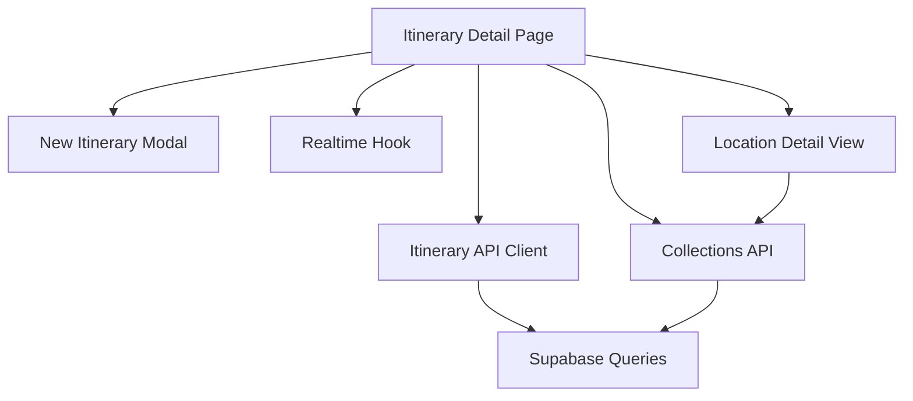
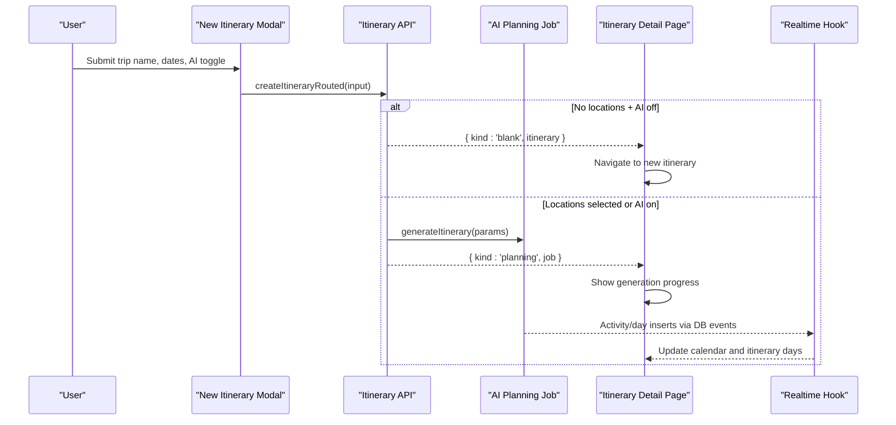
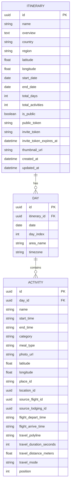
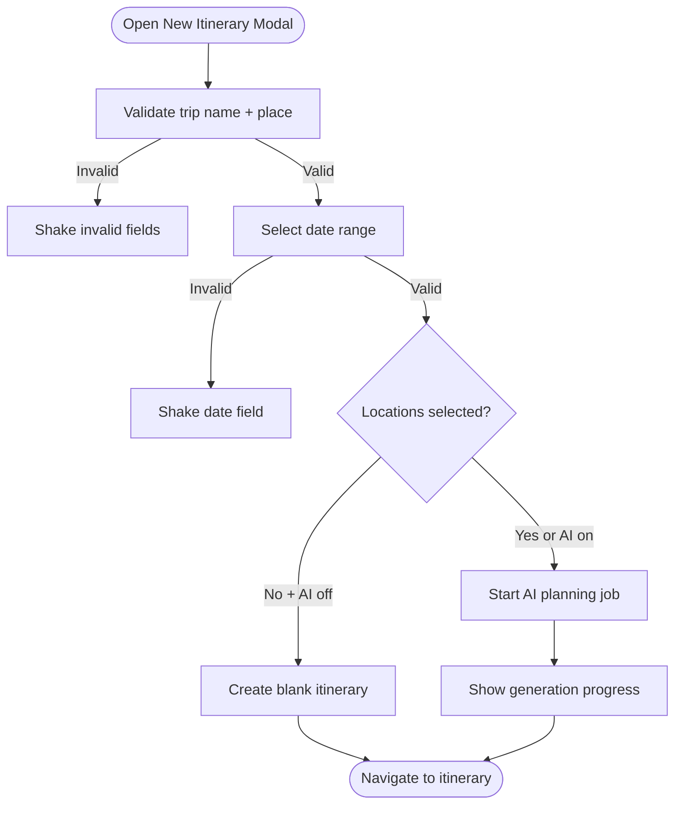
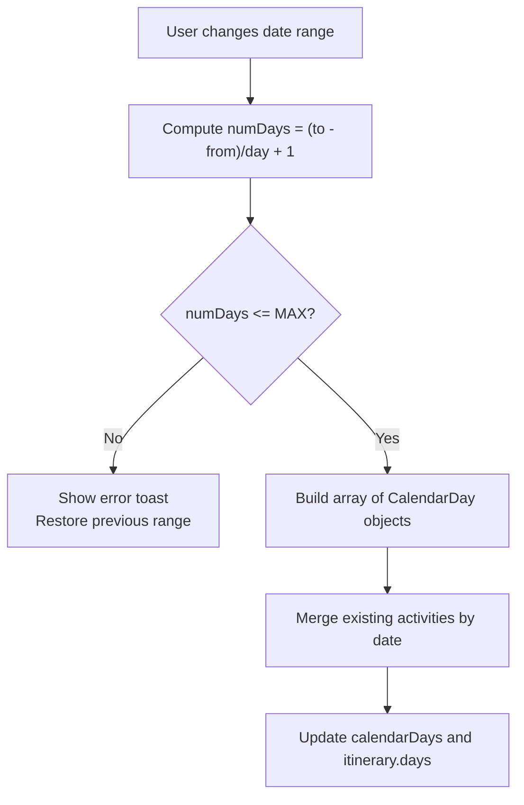
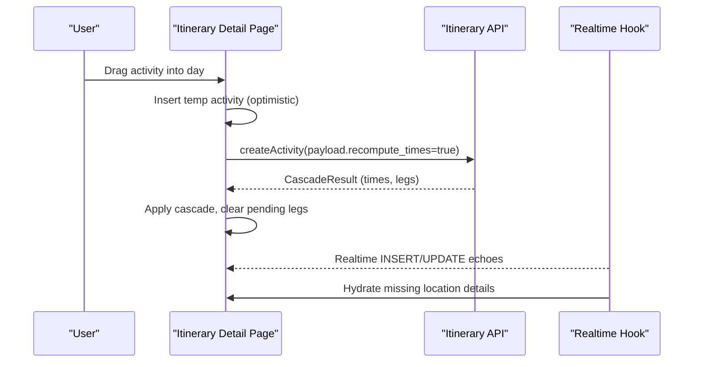
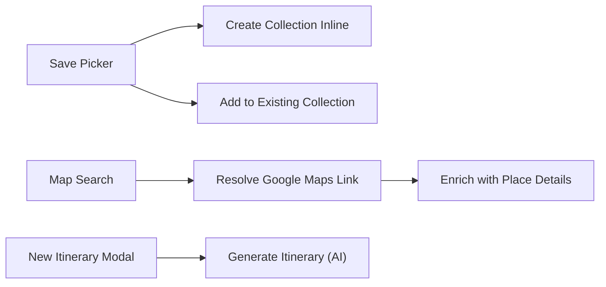
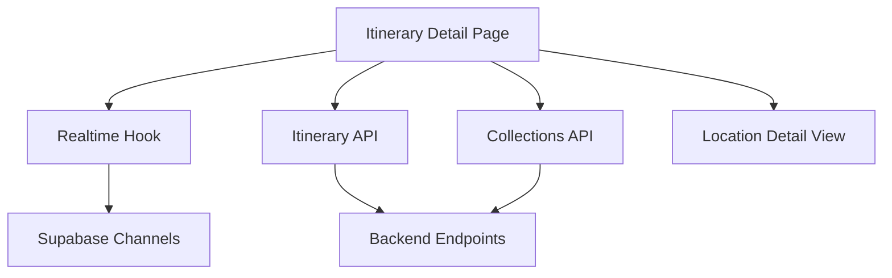

# Itinerary Creation & Management

<cite>
**Referenced Files in This Document**
- [page.tsx](file://src/app/itineraries/[id]/page.tsx)
- [NewItineraryModal.tsx](file://src/components/ui/modals/NewItineraryModal.tsx)
- [useItineraryRealtime.ts](file://src/hooks/useItineraryRealtime.ts)
- [itineraries.ts](file://src/lib/api/itineraries.ts)
- [domain-types.ts](file://src/lib/domain-types.ts)
- [home.ts](file://src/lib/supabase/queries/home.ts)
- [collections.ts](file://src/lib/api/collections.ts)
- [location-references.ts](file://src/lib/supabase/queries/location-references.ts)
- [LocationDetailView.tsx](file://src/components/ui/detail-views/LocationDetailView.tsx)
- [sequence.ts](file://src/components/ui/itinerary/ItineraryDayColumn/sequence.ts)
- [ItineraryEditDayColumn.tsx](file://src/components/ui/itinerary/ItineraryEditDayColumn.tsx)
- [page.tsx (itineraries list)](file://src/app/itineraries/page.tsx)
- [page.tsx (public itinerary)](file://src/app/itineraries/public/[token]/page.tsx)
</cite>

## Table of Contents
1. Introduction
2. Project Structure
3. Core Components
4. Architecture Overview
5. Detailed Component Analysis
6. Dependency Analysis
7. Performance Considerations
8. Troubleshooting Guide
9. Conclusion
10. Appendices

## Introduction
This document explains the end-to-end workflow for creating and managing itineraries, from initial setup through day configuration and ongoing edits. It covers the data model, validation rules, state management patterns, integrations with collections and location imports, AI-powered suggestions, error handling, optimistic updates, and real-time collaboration features during creation and editing.

## Project Structure
The itinerary system spans UI pages, modals, hooks, API clients, and Supabase queries:
- Pages: Itinerary detail view, public sharing view, and listing page orchestrate flows and state.
- Modals: New itinerary creation wizard collects trip name, region, date range, and AI preferences.
- Hooks: Realtime subscriptions keep collaborators’ changes live across activities, days, and metadata.
- APIs: Client functions call backend endpoints to create itineraries, generate AI plans, manage activities, and handle sharing tokens.
- Queries: Supabase queries assemble itinerary details, days, and activities into a normalized shape.
- Utilities: Day sequencing, overlap detection, drag utilities, and time cascading support edit-mode UX.

**Diagram sources**
- [page.tsx:250-750](file://src/app/itineraries/[id]/page.tsx#L250-L750)
- [NewItineraryModal.tsx:45-160](file://src/components/ui/modals/NewItineraryModal.tsx#L45-L160)
- [itineraries.ts:101-120](file://src/lib/api/itineraries.ts#L101-L120)
- [useItineraryRealtime.ts:39-333](file://src/hooks/useItineraryRealtime.ts#L39-L333)
- [collections.ts:65-132](file://src/lib/api/collections.ts#L65-L132)
- [LocationDetailView.tsx:260-290](file://src/components/ui/detail-views/LocationDetailView.tsx#L260-L290)

**Section sources**
- [page.tsx:250-750](file://src/app/itineraries/[id]/page.tsx#L250-L750)
- [NewItineraryModal.tsx:45-160](file://src/components/ui/modals/NewItineraryModal.tsx#L45-L160)
- [itineraries.ts:101-120](file://src/lib/api/itineraries.ts#L101-L120)
- [useItineraryRealtime.ts:39-333](file://src/hooks/useItineraryRealtime.ts#L39-L333)
- [collections.ts:65-132](file://src/lib/api/collections.ts#L65-L132)
- [LocationDetailView.tsx:260-290](file://src/components/ui/detail-views/LocationDetailView.tsx#L260-L290)

## Core Components
- New Itinerary Modal: Two-step wizard to capture trip name, place/region, date range, total days, and AI toggle. Validates inputs and submits via routing logic that chooses between blank creation or AI planning.
- Itinerary Detail Page: Loads itinerary data, manages calendar days, edit mode, drag-and-drop, optimization, notes, flights/lodging import, map search, and side panels. Handles realtime sync and optimistic updates.
- Realtime Hook: Subscribes to activity/day/meta changes and collaborator membership changes; hydrates missing location details on inserts.
- API Client: Functions to create itineraries, generate AI plans, manage activities (create/move/delete), optimize routes, preview legs, and manage sharing tokens.
- Collections Integration: Add locations to collections, create new collections inline, and reflect changes in the itinerary’s companion collection.
- Location References: “Also found in” feature surfaces other collections/itineraries containing the same location, with optimistic updates when saving.

**Section sources**
- [NewItineraryModal.tsx:45-160](file://src/components/ui/modals/NewItineraryModal.tsx#L45-L160)
- [page.tsx:250-750](file://src/app/itineraries/[id]/page.tsx#L250-L750)
- [useItineraryRealtime.ts:39-333](file://src/hooks/useItineraryRealtime.ts#L39-L333)
- [itineraries.ts:101-120](file://src/lib/api/itineraries.ts#L101-L120)
- [collections.ts:65-132](file://src/lib/api/collections.ts#L65-L132)
- [LocationDetailView.tsx:260-290](file://src/components/ui/detail-views/LocationDetailView.tsx#L260-L290)

## Architecture Overview
The system uses a client-driven architecture with optimistic UI and realtime synchronization:
- Creation flow routes to either a blank itinerary or an async AI planning job based on user selections.
- Edit mode maintains a working copy of days and activities, applying server-side cascade results for times and travel legs.
- Realtime channels update both the calendar and the itinerary data model instantly as collaborators make changes.
- Integrations with collections and location references provide cross-entity linking and discovery.

**Diagram sources**
- [NewItineraryModal.tsx:118-160](file://src/components/ui/modals/NewItineraryModal.tsx#L118-L160)
- [itineraries.ts:406-439](file://src/lib/api/itineraries.ts#L406-L439)
- [itineraries.ts:101-120](file://src/lib/api/itineraries.ts#L101-L120)
- [useItineraryRealtime.ts:39-333](file://src/hooks/useItineraryRealtime.ts#L39-L333)

## Detailed Component Analysis

### Itinerary Data Model
- Itinerary entity includes identifiers, title, overview, geographic context (country, region, coordinates), date range (start/end), total days, activity counts, sharing flags/tokens, and timestamps.
- Days include id, date, index, optional area name/timezone, and ordered activities.
- Activities include id, day association, name, start/end times, category, optional meal type, photo, coordinates, place/location ids, source links (flights/lodgings), travel leg info (polyline, duration, distance, mode), and position for ordering.
- Public itineraries expose a read-only subset suitable for sharing.

**Diagram sources**
- [itineraries.ts:32-52](file://src/lib/api/itineraries.ts#L32-L52)
- [home.ts:214-249](file://src/lib/supabase/queries/home.ts#L214-L249)
- [home.ts:275-303](file://src/lib/supabase/queries/home.ts#L275-L303)

**Section sources**
- [itineraries.ts:32-52](file://src/lib/api/itineraries.ts#L32-L52)
- [home.ts:214-249](file://src/lib/supabase/queries/home.ts#L214-L249)
- [home.ts:275-303](file://src/lib/supabase/queries/home.ts#L275-L303)

### Creation Workflow and Validation
- Two-step modal validates:
  - Step 1: Trip name and place/region selection.
  - Step 2: Date range and total days calculation; AI recommendations toggle.
- Routing logic determines creation path:
  - Blank itinerary if no locations and AI off.
  - AI planning job if locations are present or AI on.
- Server enforces constraints such as maximum itinerary length (e.g., 30 days).

**Diagram sources**
- [NewItineraryModal.tsx:118-160](file://src/components/ui/modals/NewItineraryModal.tsx#L118-L160)
- [itineraries.ts:406-439](file://src/lib/api/itineraries.ts#L406-L439)
- [page.tsx:2560-2590](file://src/app/itineraries/[id]/page.tsx#L2560-L2590)

**Section sources**
- [NewItineraryModal.tsx:118-160](file://src/components/ui/modals/NewItineraryModal.tsx#L118-L160)
- [itineraries.ts:406-439](file://src/lib/api/itineraries.ts#L406-L439)
- [page.tsx:2560-2590](file://src/app/itineraries/[id]/page.tsx#L2560-L2590)

### Date Range Selection and Day Configuration
- Calendar days are rebuilt when the user changes the date range, computing total days and generating day entries.
- The system rejects ranges exceeding the maximum allowed days and rolls back to the last valid range.
- Existing activities are filtered to the new range; new days are initialized empty.
- Time zone inference occurs from itinerary coordinates or first day’s timezone.

**Diagram sources**
- [page.tsx:2560-2626](file://src/app/itineraries/[id]/page.tsx#L2560-L2626)
- [page.tsx:2560-2590](file://src/app/itineraries/[id]/page.tsx#L2560-L2590)

**Section sources**
- [page.tsx:2560-2626](file://src/app/itineraries/[id]/page.tsx#L2560-L2626)

### Optimistic Updates and Real-Time Collaboration
- Optimistic adds insert temporary activity cards immediately with provisional times; server cascade returns final times and travel legs.
- Pending operations track IDs needing time recalculation; stale legs are cleared until cascade resolves.
- Realtime channels subscribe to activity/day/meta changes and collaborator membership changes, updating both calendar and itinerary state without full refetches.
- Notes are shared per itinerary and refreshed via realtime table changes.

**Diagram sources**
- [page.tsx:2074-2092](file://src/app/itineraries/[id]/page.tsx#L2074-L2092)
- [itineraries.ts:230-246](file://src/lib/api/itineraries.ts#L230-L246)
- [useItineraryRealtime.ts:39-333](file://src/hooks/useItineraryRealtime.ts#L39-L333)

**Section sources**
- [page.tsx:2074-2092](file://src/app/itineraries/[id]/page.tsx#L2074-L2092)
- [itineraries.ts:230-246](file://src/lib/api/itineraries.ts#L230-L246)
- [useItineraryRealtime.ts:39-333](file://src/hooks/useItineraryRealtime.ts#L39-L333)

### Integrations: Collections, Location Imports, and AI Suggestions
- Collections:
  - Add locations to collections from the detail view; refresh companion collection after adding to itinerary.
  - Create new collections inline from save picker; return new id so location can be saved directly.
- Location imports:
  - Resolve Google Maps share links to persisted locations; enrich with enterprise Place Details when needed.
  - Use viewport-biased place search scoped to itinerary country.
- AI suggestions:
  - Toggle “Start with AI recommendations” triggers async planning job with scheduler options and preference profile.
  - AI fill gaps and meal discovery controlled by flag; clustering and route optimization always run.

**Diagram sources**
- [LocationDetailView.tsx:260-290](file://src/components/ui/detail-views/LocationDetailView.tsx#L260-L290)
- [page.tsx:592-618](file://src/app/itineraries/[id]/page.tsx#L592-L618)
- [itineraries.ts:406-439](file://src/lib/api/itineraries.ts#L406-L439)

**Section sources**
- [LocationDetailView.tsx:260-290](file://src/components/ui/detail-views/LocationDetailView.tsx#L260-L290)
- [page.tsx:592-618](file://src/app/itineraries/[id]/page.tsx#L592-L618)
- [itineraries.ts:406-439](file://src/lib/api/itineraries.ts#L406-L439)

### Examples: Day Trips and Multi-Day Adventures
- Day trips:
  - Select a single-day range; minimal activities; optional lodging check-in/out markers.
  - Use transport modes and route optimization to fit multiple POIs within tight windows.
- Multi-day adventures:
  - Choose extended ranges; distribute activities across days; use accommodation bookends to anchor start/end times.
  - Leverage AI planning to suggest gap-filling activities and meals; apply deconflict to resolve overlaps.

Configuration options vary by scenario:
- Transport modes per leg (drive/walk/bus factors used in sequencing).
- Locked activities to preserve anchors during optimization.
- AI toggle to enable/disable gap-fill and meal discovery.

**Section sources**
- [ItineraryEditDayColumn.tsx:531-560](file://src/components/ui/itinerary/ItineraryEditDayColumn.tsx#L531-L560)
- [sequence.ts:59-106](file://src/components/ui/itinerary/ItineraryDayColumn/sequence.ts#L59-L106)

### Error Handling and Quotas
- Quota errors:
  - Creating or generating itineraries may exceed limits; specific error types surface current/max counts for user feedback.
- Validation errors:
  - Field shaking indicates invalid inputs; date range cap enforced before optimistic mutation.
- Friendly messages:
  - API errors mapped to user-friendly messages via helper utilities.

**Section sources**
- [itineraries.ts:89-120](file://src/lib/api/itineraries.ts#L89-L120)
- [itineraries.ts:339-367](file://src/lib/api/itineraries.ts#L339-L367)
- [page.tsx:2560-2590](file://src/app/itineraries/[id]/page.tsx#L2560-L2590)

## Dependency Analysis
Key dependencies and relationships:
- Itinerary Detail Page depends on:
  - Realtime hook for live updates.
  - API client for CRUD and planning jobs.
  - Collections API for cross-entity linking.
  - Location detail view for “Also found in” and save actions.
- Realtime hook subscribes to Supabase channels for activities, days, meta, and members.
- API client calls backend endpoints and handles quota errors.
- Domain types define surfaces and shareable entities for analytics and permissions.

**Diagram sources**
- [page.tsx:250-750](file://src/app/itineraries/[id]/page.tsx#L250-L750)
- [useItineraryRealtime.ts:39-333](file://src/hooks/useItineraryRealtime.ts#L39-L333)
- [itineraries.ts:101-120](file://src/lib/api/itineraries.ts#L101-L120)
- [collections.ts:65-132](file://src/lib/api/collections.ts#L65-L132)

**Section sources**
- [page.tsx:250-750](file://src/app/itineraries/[id]/page.tsx#L250-L750)
- [useItineraryRealtime.ts:39-333](file://src/hooks/useItineraryRealtime.ts#L39-L333)
- [itineraries.ts:101-120](file://src/lib/api/itineraries.ts#L101-L120)
- [collections.ts:65-132](file://src/lib/api/collections.ts#L65-L132)

## Performance Considerations
- Minimize redundant network calls by leveraging realtime channels and optimistic UI.
- Use server-side cascade for time recomputation to avoid client-side heavy calculations.
- Cache enriched place details per session to reduce duplicate Enterprise calls.
- Defer heavy components (maps) with dynamic imports to improve initial load.

[No sources needed since this section provides general guidance]

## Troubleshooting Guide
Common issues and resolutions:
- Date range exceeds maximum days:
  - System shows error toast and restores previous range; ensure selection stays within limit.
- Missing location details in activity cards:
  - Realtime hydration fetches location row asynchronously; verify location_id/place_id presence.
- Stale travel legs after reorder:
  - Clear legs for affected activities; rely on cascade to recompute fresh legs.
- Quota exceeded:
  - Handle ItineraryQuotaError to inform users of limits and prompt cleanup or upgrade.

**Section sources**
- [page.tsx:2560-2590](file://src/app/itineraries/[id]/page.tsx#L2560-L2590)
- [useItineraryRealtime.ts:50-87](file://src/hooks/useItineraryRealtime.ts#L50-L87)
- [itineraries.ts:89-120](file://src/lib/api/itineraries.ts#L89-L120)

## Conclusion
The itinerary system provides a robust, collaborative, and AI-enhanced planning experience. It balances immediate responsiveness with accurate server-side computation, ensuring consistent state across users and devices. By integrating collections, location imports, and real-time updates, it supports diverse trip types—from quick day trips to multi-day adventures—while maintaining high usability and performance.

[No sources needed since this section summarizes without analyzing specific files]

## Appendices

### API Surface Summary
- Create blank itinerary: POST /api/itineraries/blank
- Generate AI itinerary: POST /api/itineraries
- Update itinerary: PATCH /api/itineraries/:id
- Manage activities: POST/PATCH/DELETE /api/itineraries/:id/activities/:activityId
- Optimize route: POST /api/itineraries/:id/days/:dayId/optimize-route
- Preview legs: POST /api/itineraries/:id/days/:dayId/preview-legs
- Sharing tokens: POST/DELETE /api/itineraries/:id/tokens/{public,invite}
- Collaborators: GET/DELETE /api/itineraries/:id/collaborators

**Section sources**
- [itineraries.ts:101-120](file://src/lib/api/itineraries.ts#L101-L120)
- [itineraries.ts:122-131](file://src/lib/api/itineraries.ts#L122-L131)
- [itineraries.ts:230-291](file://src/lib/api/itineraries.ts#L230-L291)
- [itineraries.ts:303-337](file://src/lib/api/itineraries.ts#L303-L337)
- [itineraries.ts:448-487](file://src/lib/api/itineraries.ts#L448-L487)

### Public Sharing
- Public itineraries expose a read-only view with days and activities.
- Token-based access allows sharing without authentication.

**Section sources**
- [page.tsx (public itinerary):1-34](file://src/app/itineraries/public/[token]/page.tsx#L1-L34)
- [itineraries.ts:489-524](file://src/lib/api/itineraries.ts#L489-L524)