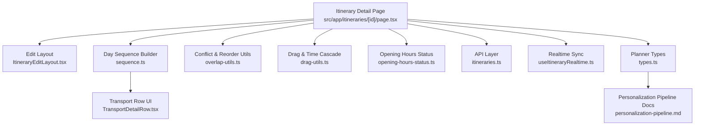
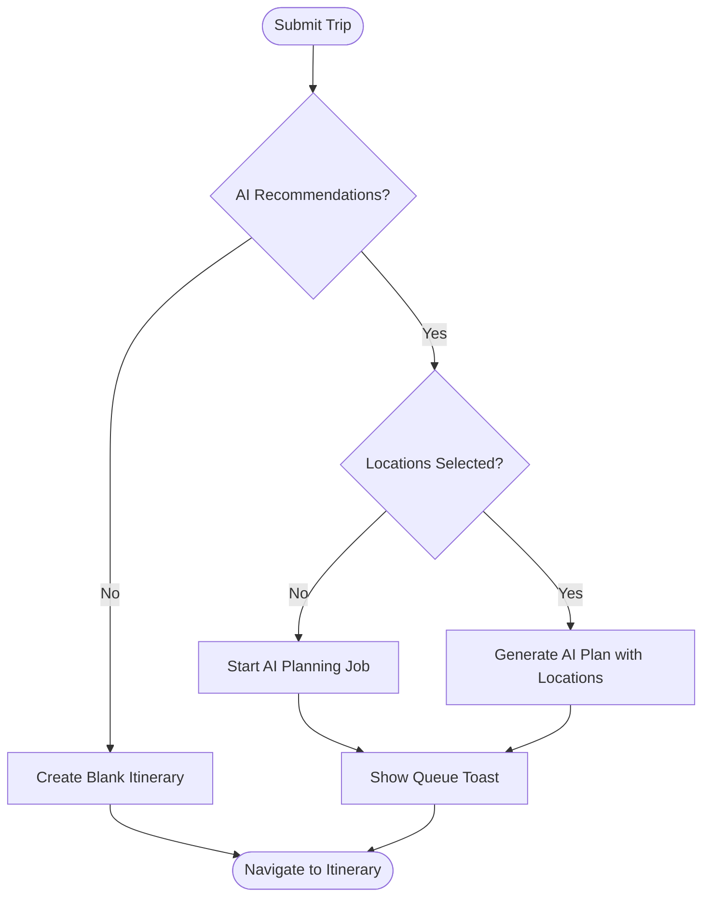
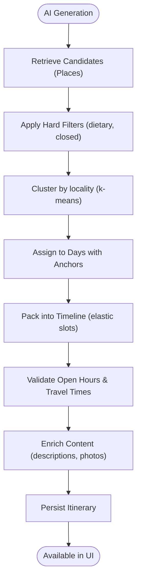
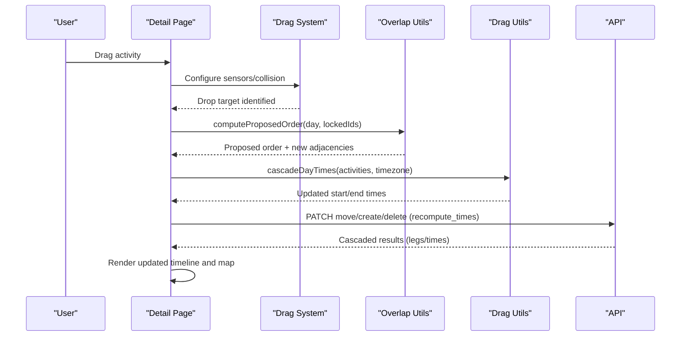
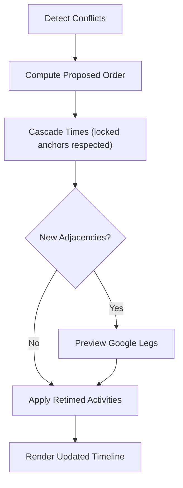
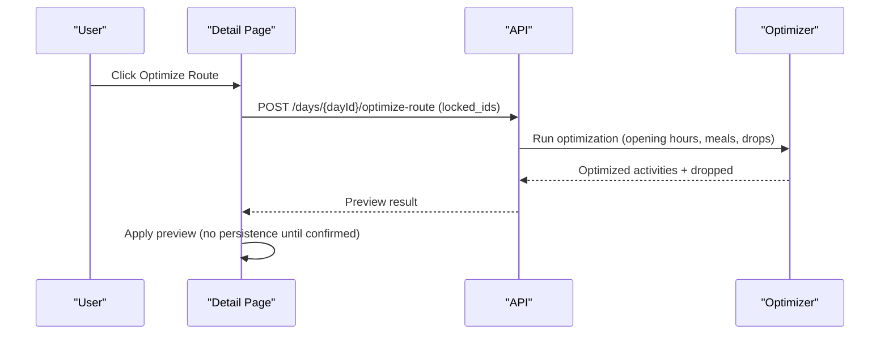
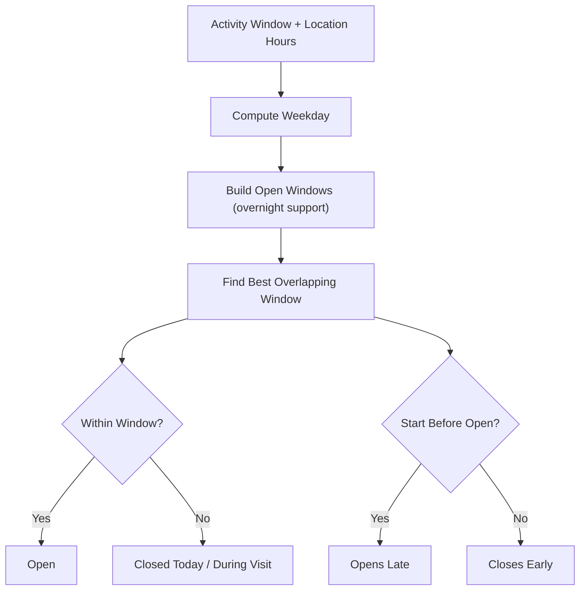
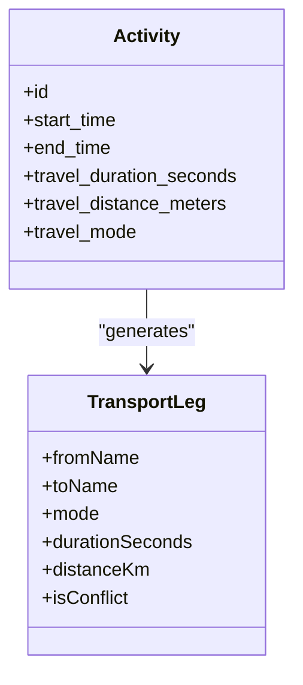
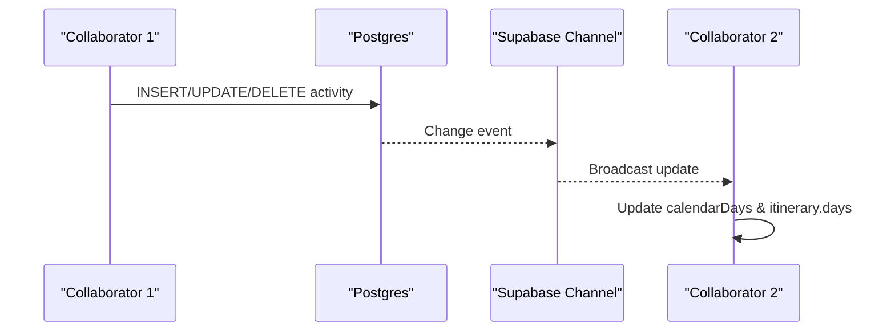
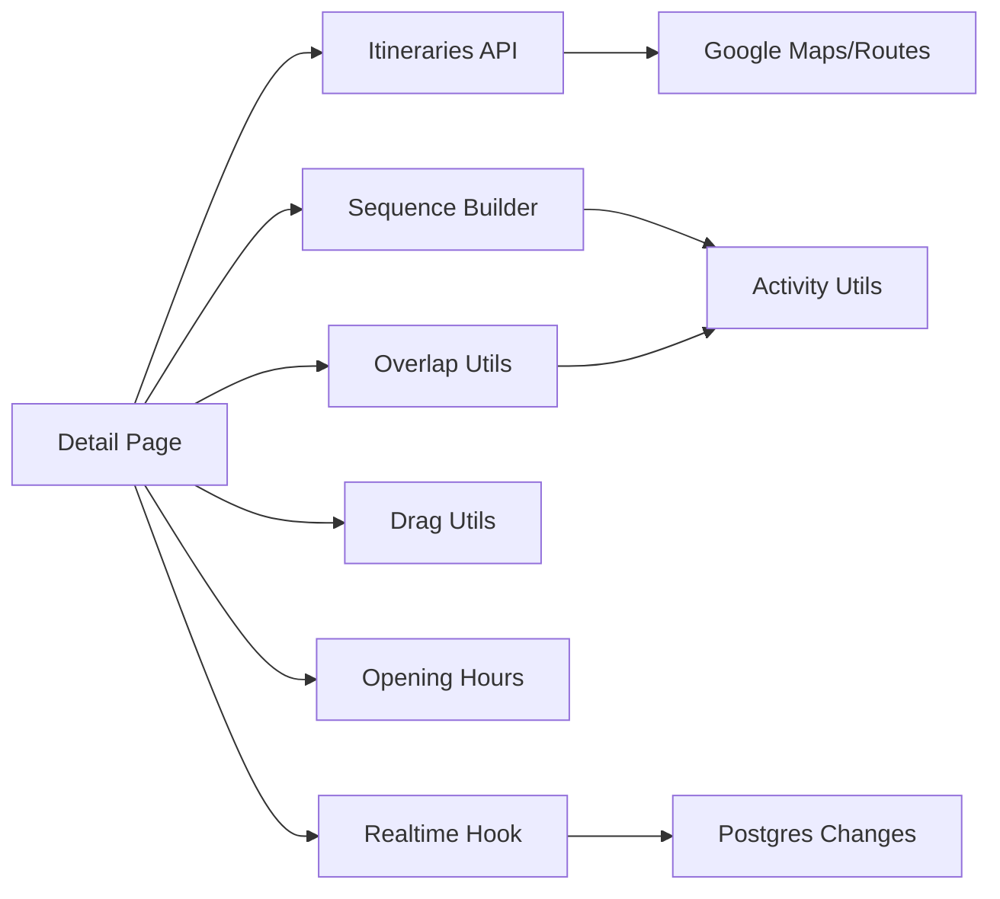

# Itinerary Planning

<cite>
**Referenced Files in This Document**
- [page.tsx](file://src/app/itineraries/[id]/page.tsx)
- [ItineraryEditLayout.tsx](file://src/components/ui/itinerary/ItineraryEditLayout.tsx)
- [sequence.ts](file://src/components/ui/itinerary/ItineraryDayColumn/sequence.ts)
- [overlap-utils.ts](file://src/components/ui/itinerary/overlap-utils.ts)
- [drag-utils.ts](file://src/components/ui/itinerary/drag-utils.ts)
- [activity-utils.ts](file://src/components/ui/itinerary/activity-utils.ts)
- [opening-hours-status.ts](file://src/components/ui/itinerary/opening-hours-status.ts)
- [itineraries.ts](file://src/lib/api/itineraries.ts)
- [useItineraryRealtime.ts](file://src/hooks/useItineraryRealtime.ts)
- [TransportDetailRow.tsx](file://src/components/ui/itinerary/TransportDetailRow.tsx)
- [MainLayout.tsx](file://src/components/ui/layout/MainLayout.tsx)
- [types.ts](file://src/lib/planner/types.ts)
- [personalization-pipeline.md](file://docs/personalization-pipeline.md)
- [implementation-plan.md](file://docs/implementation-plan.md)
</cite>

## Table of Contents
1. [Introduction](#introduction)
2. [Project Structure](#project-structure)
3. [Core Components](#core-components)
4. [Architecture Overview](#architecture-overview)
5. [Detailed Component Analysis](#detailed-component-analysis)
6. [Dependency Analysis](#dependency-analysis)
7. [Performance Considerations](#performance-considerations)
8. [Troubleshooting Guide](#troubleshooting-guide)
9. [Conclusion](#conclusion)
10. [Appendices](#appendices)

## Introduction
This document explains the AI-powered itinerary planning system implemented in the repository. It covers how itineraries are created, how day-by-day schedules are generated and edited, how conflicts are detected and resolved, and how optimization algorithms integrate with Google Maps for route planning and travel time calculations. It also documents the interactive editing interface (including drag-and-drop), opening hours considerations, real-time collaboration, expense tracking, transportation planning, and example planning scenarios from simple day trips to complex multi-day adventures.

## Project Structure
The itinerary feature spans several layers:
- UI pages and edit layout for viewing and editing itineraries
- Day sequence rendering and transport leg visualization
- Conflict detection and re-timing utilities
- Drag-and-drop helpers and time cascading
- Opening hours status computation
- API layer for creating, optimizing, and managing itineraries
- Realtime synchronization across collaborators
- Planner types and pipeline documentation for AI-driven generation



**Diagram sources**
- [page.tsx:250-800](file://src/app/itineraries/[id]/page.tsx#L250-L800)
- [ItineraryEditLayout.tsx:25-127](file://src/components/ui/itinerary/ItineraryEditLayout.tsx#L25-L127)
- [sequence.ts:68-194](file://src/components/ui/itinerary/ItineraryDayColumn/sequence.ts#L68-L194)
- [overlap-utils.ts:75-218](file://src/components/ui/itinerary/overlap-utils.ts#L75-L218)
- [drag-utils.ts:37-88](file://src/components/ui/itinerary/drag-utils.ts#L37-L88)
- [opening-hours-status.ts:84-136](file://src/components/ui/itinerary/opening-hours-status.ts#L84-L136)
- [itineraries.ts:122-337](file://src/lib/api/itineraries.ts#L122-L337)
- [useItineraryRealtime.ts:27-333](file://src/hooks/useItineraryRealtime.ts#L27-L333)
- [TransportDetailRow.tsx:54-146](file://src/components/ui/itinerary/TransportDetailRow.tsx#L54-L146)
- [types.ts:27-51](file://src/lib/planner/types.ts#L27-L51)
- [personalization-pipeline.md:13-108](file://docs/personalization-pipeline.md#L13-L108)

**Section sources**
- [page.tsx:250-800](file://src/app/itineraries/[id]/page.tsx#L250-L800)
- [ItineraryEditLayout.tsx:25-127](file://src/components/ui/itinerary/ItineraryEditLayout.tsx#L25-L127)
- [sequence.ts:68-194](file://src/components/ui/itinerary/ItineraryDayColumn/sequence.ts#L68-L194)
- [overlap-utils.ts:75-218](file://src/components/ui/itinerary/overlap-utils.ts#L75-L218)
- [drag-utils.ts:37-88](file://src/components/ui/itinerary/drag-utils.ts#L37-L88)
- [opening-hours-status.ts:84-136](file://src/components/ui/itinerary/opening-hours-status.ts#L84-L136)
- [itineraries.ts:122-337](file://src/lib/api/itineraries.ts#L122-L337)
- [useItineraryRealtime.ts:27-333](file://src/hooks/useItineraryRealtime.ts#L27-L333)
- [TransportDetailRow.tsx:54-146](file://src/components/ui/itinerary/TransportDetailRow.tsx#L54-L146)
- [types.ts:27-51](file://src/lib/planner/types.ts#L27-L51)
- [personalization-pipeline.md:13-108](file://docs/personalization-pipeline.md#L13-L108)

## Core Components
- Itinerary detail page orchestrates state, realtime updates, map integration, and user actions like adding activities, optimizing routes, and resolving overlaps.
- Edit layout provides a three-column workspace with resizable panels for timeline, details, and map.
- Day sequence builder constructs a visual timeline including activities and transport legs derived from stored travel data.
- Overlap utilities detect conflicts and compute proposed reorderings and cascaded times.
- Drag utilities cascade times after reordering and clear stale travel legs optimistically.
- Opening hours status evaluates whether an activity’s scheduled window fits location opening hours.
- API layer exposes endpoints to create itineraries, generate AI plans, optimize routes, preview legs, manage activities, and collaborate.
- Realtime hook synchronizes changes across collaborators for activities, days, flights, and lodgings.

**Section sources**
- [page.tsx:250-800](file://src/app/itineraries/[id]/page.tsx#L250-L800)
- [ItineraryEditLayout.tsx:25-127](file://src/components/ui/itinerary/ItineraryEditLayout.tsx#L25-L127)
- [sequence.ts:68-194](file://src/components/ui/itinerary/ItineraryDayColumn/sequence.ts#L68-L194)
- [overlap-utils.ts:75-218](file://src/components/ui/itinerary/overlap-utils.ts#L75-L218)
- [drag-utils.ts:37-88](file://src/components/ui/itinerary/drag-utils.ts#L37-L88)
- [opening-hours-status.ts:84-136](file://src/components/ui/itinerary/opening-hours-status.ts#L84-L136)
- [itineraries.ts:122-337](file://src/lib/api/itineraries.ts#L122-L337)
- [useItineraryRealtime.ts:27-333](file://src/hooks/useItineraryRealtime.ts#L27-L333)

## Architecture Overview
The system combines client-side interactivity with server-side AI and Google Maps integrations:
- Users create or generate itineraries via the detail page and modal flows.
- AI generation is routed through the API; it may return a job for async processing.
- Editing uses drag-and-drop to reorder activities; the client computes proposed orders and cascades times locally, then persists changes via API calls that trigger backend recalculation of travel legs using Google Routes.
- Realtime channels keep all collaborators synchronized on changes.
- Opening hours and transport constraints inform conflict detection and optimization.

```mermaid
sequenceDiagram
participant User as "User"
participant Page as "Itinerary Detail Page"
participant API as "Itinerary API"
participant Planner as "AI Planner"
participant Maps as "Google Maps/Routes"
participant RT as "Realtime Channels"
User->>Page : Create or Generate Itinerary
Page->>API : POST /api/itineraries (with options/profile)
alt AI-only or locations selected
API->>Planner : Start planning job
Planner-->>API : Job queued
API-->>Page : { kind : "planning", job }
Note over Page : Show queue/toast; poll completion
else Blank itinerary
API-->>Page : { kind : "blank", itinerary }
end
User->>Page : Drag/reorder activities
Page->>Page : computeProposedOrder + cascadeTimes
Page->>API : PATCH move/create/delete (recompute_times)
API->>Maps : Compute travel legs (duration, distance, polyline)
Maps-->>API : Leg results
API-->>RT : Postgres change events
RT-->>Page : Update calendarDays, itinerary.days
Page->>Page : Render updated timeline and map
```

**Diagram sources**
- [MainLayout.tsx:181-216](file://src/components/ui/layout/MainLayout.tsx#L181-L216)
- [itineraries.ts:101-120](file://src/lib/api/itineraries.ts#L101-L120)
- [itineraries.ts:230-291](file://src/lib/api/itineraries.ts#L230-L291)
- [useItineraryRealtime.ts:40-333](file://src/hooks/useItineraryRealtime.ts#L40-L333)
- [page.tsx:1066-1088](file://src/app/itineraries/[id]/page.tsx#L1066-L1088)

## Detailed Component Analysis

### Itinerary Creation Workflow
- The detail page integrates with creation flows from multiple entry points (home, dashboard, navbar).
- When users submit a trip request, the system routes to either:
  - AI-only planning (async job) when no locations are selected but AI recommendations are enabled
  - AI-assisted planning with selected locations
  - Blank itinerary creation when AI is disabled and no locations are selected
- Quota handling is enforced at the API layer; errors surface to the user via friendly messages.



**Diagram sources**
- [MainLayout.tsx:181-216](file://src/components/ui/layout/MainLayout.tsx#L181-L216)
- [itineraries.ts:394-439](file://src/lib/api/itineraries.ts#L394-L439)
- [itineraries.ts:101-120](file://src/lib/api/itineraries.ts#L101-L120)

**Section sources**
- [MainLayout.tsx:181-216](file://src/components/ui/layout/MainLayout.tsx#L181-L216)
- [itineraries.ts:394-439](file://src/lib/api/itineraries.ts#L394-L439)
- [itineraries.ts:101-120](file://src/lib/api/itineraries.ts#L101-L120)

### Day-by-Day Schedule Generation
- AI planner generates timed segments including activities and travel legs, constrained by opening hours, meal anchors, and pace preferences.
- The schedule respects visit durations derived from enrichment and type heuristics, and ensures realistic travel times between stops.
- Generated itineraries are persisted and surfaced to the detail page where users can refine them.



**Diagram sources**
- [personalization-pipeline.md:13-108](file://docs/personalization-pipeline.md#L13-L108)
- [personalization-pipeline.md:566-573](file://docs/personalization-pipeline.md#L566-L573)
- [implementation-plan.md:314-352](file://docs/implementation-plan.md#L314-L352)

**Section sources**
- [personalization-pipeline.md:13-108](file://docs/personalization-pipeline.md#L13-L108)
- [personalization-pipeline.md:566-573](file://docs/personalization-pipeline.md#L566-L573)
- [implementation-plan.md:314-352](file://docs/implementation-plan.md#L314-L352)

### Interactive Editing Interface and Drag-and-Drop
- The edit mode presents a three-panel layout: left column for the day list/timeline, center panel for details (optional), and right panel for the map.
- Drag-and-drop allows reordering activities within and across days. The collision detection prioritizes explicit gap targets and activity cards to ensure precise insertion.
- After a drop, the client computes a proposed order and cascades times, clearing stale travel legs until the server recomputes them.



**Diagram sources**
- [page.tsx:620-665](file://src/app/itineraries/[id]/page.tsx#L620-L665)
- [overlap-utils.ts:75-153](file://src/components/ui/itinerary/overlap-utils.ts#L75-L153)
- [drag-utils.ts:37-88](file://src/components/ui/itinerary/drag-utils.ts#L37-L88)
- [itineraries.ts:230-291](file://src/lib/api/itineraries.ts#L230-L291)

**Section sources**
- [ItineraryEditLayout.tsx:25-127](file://src/components/ui/itinerary/ItineraryEditLayout.tsx#L25-L127)
- [page.tsx:620-665](file://src/app/itineraries/[id]/page.tsx#L620-L665)
- [overlap-utils.ts:75-153](file://src/components/ui/itinerary/overlap-utils.ts#L75-L153)
- [drag-utils.ts:37-88](file://src/components/ui/itinerary/drag-utils.ts#L37-L88)
- [itineraries.ts:230-291](file://src/lib/api/itineraries.ts#L230-L291)

### Conflict Detection and Resolution
- Conflicts include overlapping activity windows and transport time overflow where travel duration exceeds the gap between activities.
- The system proposes a reordered sequence that respects locked activities (e.g., flights) and cascades times forward, snapping to a 10-minute grid to avoid awkward times.
- If reordering creates new adjacencies without stored travel times, the system previews exact Google DRIVE legs before applying changes.



**Diagram sources**
- [overlap-utils.ts:75-218](file://src/components/ui/itinerary/overlap-utils.ts#L75-L218)
- [overlap-utils.ts:229-297](file://src/components/ui/itinerary/overlap-utils.ts#L229-L297)
- [itineraries.ts:327-337](file://src/lib/api/itineraries.ts#L327-L337)

**Section sources**
- [overlap-utils.ts:75-218](file://src/components/ui/itinerary/overlap-utils.ts#L75-L218)
- [overlap-utils.ts:229-297](file://src/components/ui/itinerary/overlap-utils.ts#L229-L297)
- [itineraries.ts:327-337](file://src/lib/api/itineraries.ts#L327-L337)

### Optimization Algorithms
- Route optimization runs on a per-day basis, respecting locked activities and opening hours, returning a preview of reordered activities and any dropped ones that cannot fit.
- The optimizer leverages the same engine used for day generation, ensuring consistency between initial AI plans and manual optimizations.



**Diagram sources**
- [page.tsx:1066-1088](file://src/app/itineraries/[id]/page.tsx#L1066-L1088)
- [itineraries.ts:298-313](file://src/lib/api/itineraries.ts#L298-L313)

**Section sources**
- [page.tsx:1066-1088](file://src/app/itineraries/[id]/page.tsx#L1066-L1088)
- [itineraries.ts:298-313](file://src/lib/api/itineraries.ts#L298-L313)

### Opening Hours Consideration
- Opening hours are evaluated against each activity’s scheduled window, supporting overnight periods and weekday-specific rules.
- The status indicates if a location is open, closed today, closed during the visit, opens late, or closes early, enabling proactive UX hints.



**Diagram sources**
- [opening-hours-status.ts:84-136](file://src/components/ui/itinerary/opening-hours-status.ts#L84-L136)

**Section sources**
- [opening-hours-status.ts:84-136](file://src/components/ui/itinerary/opening-hours-status.ts#L84-L136)

### Travel Time Calculations and Transportation Planning
- Transport legs are derived from stored Google Routes data (distance, duration, polyline) associated with the origin activity row.
- The day sequence renders transport segments between activities when available, marking conflicts when travel time exceeds gaps.
- Users can switch transport modes per leg; unavailable routes are indicated explicitly.



**Diagram sources**
- [sequence.ts:68-194](file://src/components/ui/itinerary/ItineraryDayColumn/sequence.ts#L68-L194)
- [TransportDetailRow.tsx:54-146](file://src/components/ui/itinerary/TransportDetailRow.tsx#L54-L146)

**Section sources**
- [sequence.ts:68-194](file://src/components/ui/itinerary/ItineraryDayColumn/sequence.ts#L68-L194)
- [TransportDetailRow.tsx:54-146](file://src/components/ui/itinerary/TransportDetailRow.tsx#L54-L146)

### Real-Time Collaboration
- Realtime channels synchronize activity inserts, updates, and deletes across collaborators, updating both the calendar view and the itinerary days.
- Collaborator joins/leaves and itinerary metadata changes are reflected live.
- Notes and attachments are also synced via dedicated channels.



**Diagram sources**
- [useItineraryRealtime.ts:40-333](file://src/hooks/useItineraryRealtime.ts#L40-L333)

**Section sources**
- [useItineraryRealtime.ts:40-333](file://src/hooks/useItineraryRealtime.ts#L40-L333)

### Integration with Google Maps
- Route optimization and travel leg computation rely on Google Maps/Routes APIs via the backend.
- The UI displays transport legs, distances, durations, and polylines; users can open legs in Google Maps directly.
- Place search and enrichment integrate with Google Places to provide rich location details and opening hours.

**Section sources**
- [itineraries.ts:298-337](file://src/lib/api/itineraries.ts#L298-L337)
- [TransportDetailRow.tsx:54-146](file://src/components/ui/itinerary/TransportDetailRow.tsx#L54-L146)
- [page.tsx:497-618](file://src/app/itineraries/[id]/page.tsx#L497-L618)

### Expense Tracking and Tabs
- The itinerary includes tabs for expenses, bookings, flights, and lodging, allowing users to attach receipts and track costs alongside their plan.
- File drop zones accept PDFs, images, and other formats for parsing and association with itinerary items.

**Section sources**
- [page.tsx:4701-4719](file://src/app/itineraries/[id]/page.tsx#L4701-L4719)

### Example Planning Scenarios
- Simple day trip: Add a few POIs, enable AI recommendations to fill gaps and optimize route; use opening hours to avoid closures.
- Multi-day adventure: Use AI generation with selected locations; lock key activities (flights, museums); run per-day optimization to minimize travel time.
- Complex itinerary with meals and lodging: Anchor meals within specified windows; add lodging check-in/out; adjust transport modes per leg based on availability.

[No sources needed since this section summarizes conceptual scenarios]

## Dependency Analysis
Key dependencies and relationships:
- The detail page depends on API functions for CRUD operations, optimization, and collaboration tokens.
- Day sequence rendering depends on activity-utils for time parsing and formatting.
- Conflict resolution depends on overlap-utils and drag-utils for ordering and time cascading.
- Realtime sync depends on Supabase channels to propagate changes.
- Planner types define shared vocabulary for profile and scheduler options consumed by the AI pipeline.



**Diagram sources**
- [page.tsx:250-800](file://src/app/itineraries/[id]/page.tsx#L250-L800)
- [sequence.ts:68-194](file://src/components/ui/itinerary/ItineraryDayColumn/sequence.ts#L68-L194)
- [overlap-utils.ts:75-218](file://src/components/ui/itinerary/overlap-utils.ts#L75-L218)
- [drag-utils.ts:37-88](file://src/components/ui/itinerary/drag-utils.ts#L37-L88)
- [activity-utils.ts:5-79](file://src/components/ui/itinerary/activity-utils.ts#L5-L79)
- [useItineraryRealtime.ts:40-333](file://src/hooks/useItineraryRealtime.ts#L40-L333)
- [itineraries.ts:298-337](file://src/lib/api/itineraries.ts#L298-L337)

**Section sources**
- [page.tsx:250-800](file://src/app/itineraries/[id]/page.tsx#L250-L800)
- [sequence.ts:68-194](file://src/components/ui/itinerary/ItineraryDayColumn/sequence.ts#L68-L194)
- [overlap-utils.ts:75-218](file://src/components/ui/itinerary/overlap-utils.ts#L75-L218)
- [drag-utils.ts:37-88](file://src/components/ui/itinerary/drag-utils.ts#L37-L88)
- [activity-utils.ts:5-79](file://src/components/ui/itinerary/activity-utils.ts#L5-L79)
- [useItineraryRealtime.ts:40-333](file://src/hooks/useItineraryRealtime.ts#L40-L333)
- [itineraries.ts:298-337](file://src/lib/api/itineraries.ts#L298-L337)

## Performance Considerations
- Avoid unnecessary Google Places calls by leveraging cached place details and enterprise-tier search results.
- Use optimistic UI updates for drag-and-drop and clear stale legs only when necessary to reduce map redraws.
- Snap times to a 10-minute grid to simplify scheduling and reduce micro-adjustments.
- Batch realtime updates and prefer in-place replacements to prevent array reordering side effects.
- Limit AI generation scope by filtering candidates aggressively and caching enrichment data.

[No sources needed since this section provides general guidance]

## Troubleshooting Guide
Common issues and resolutions:
- Stale travel legs after reorder: Clear legs optimistically and wait for server cascade to repopulate accurate data.
- No route for a transport mode: Switch mode or verify geographic feasibility; UI indicates “No route” when unavailable.
- Opening hours conflicts: Adjust activity times to fall within open windows; use status hints to guide edits.
- Realtime sync delays: Ensure channels are subscribed and network connectivity is stable; check Postgres change events.
- Quota exceeded during creation: Handle quota errors gracefully and prompt users to upgrade or reduce scope.

**Section sources**
- [drag-utils.ts:25-35](file://src/components/ui/itinerary/drag-utils.ts#L25-L35)
- [TransportDetailRow.tsx:92-119](file://src/components/ui/itinerary/TransportDetailRow.tsx#L92-L119)
- [opening-hours-status.ts:84-136](file://src/components/ui/itinerary/opening-hours-status.ts#L84-L136)
- [useItineraryRealtime.ts:40-333](file://src/hooks/useItineraryRealtime.ts#L40-L333)
- [itineraries.ts:89-120](file://src/lib/api/itineraries.ts#L89-L120)

## Conclusion
The itinerary planning system provides a robust, interactive experience for creating and refining travel plans. It combines AI-driven generation with precise conflict detection, opening hours validation, and Google Maps integration for realistic routing. Realtime collaboration ensures teams can co-edit seamlessly, while flexible transport modes and expense tracking support diverse planning needs. The modular architecture enables iterative improvements and scalability for both simple day trips and complex multi-day adventures.

[No sources needed since this section summarizes without analyzing specific files]

## Appendices

### Data Models and Types
- PreferenceProfile and SchedulerOptions define traveler preferences and scheduler behavior for AI generation.
- CandidatePlace and PlaceEnrichment capture retrieved places and enriched metadata used throughout the pipeline.

**Section sources**
- [types.ts:27-93](file://src/lib/planner/types.ts#L27-L93)

### Implementation Notes
- Duration resolution and packing logic are designed to be testable and deterministic, ensuring reliable schedule generation.
- Anchors (meals, long visits) constrain elastic scheduling to produce balanced days.

**Section sources**
- [implementation-plan.md:314-352](file://docs/implementation-plan.md#L314-L352)