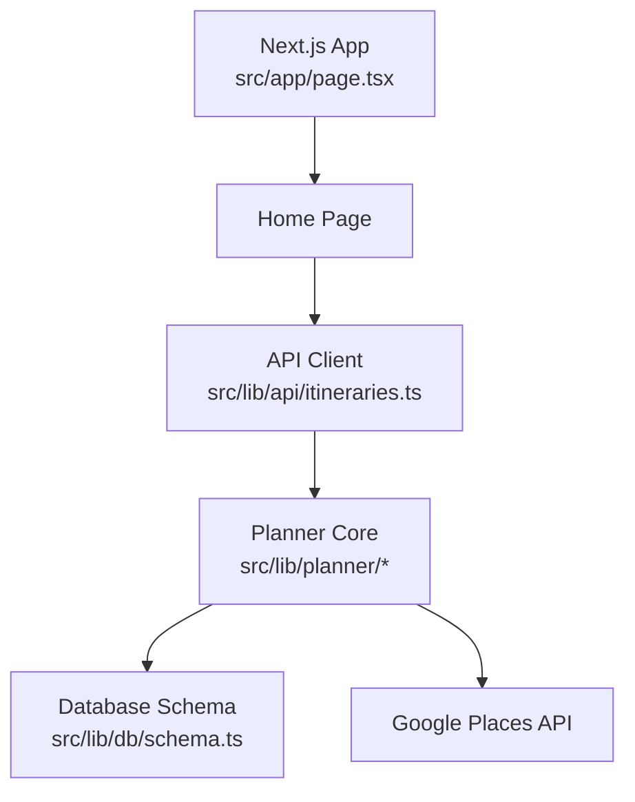
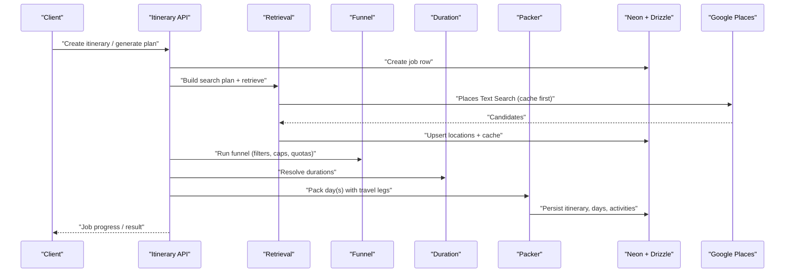
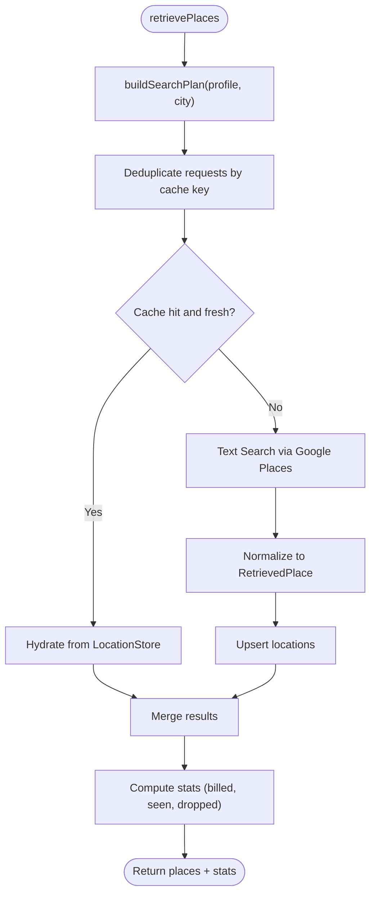
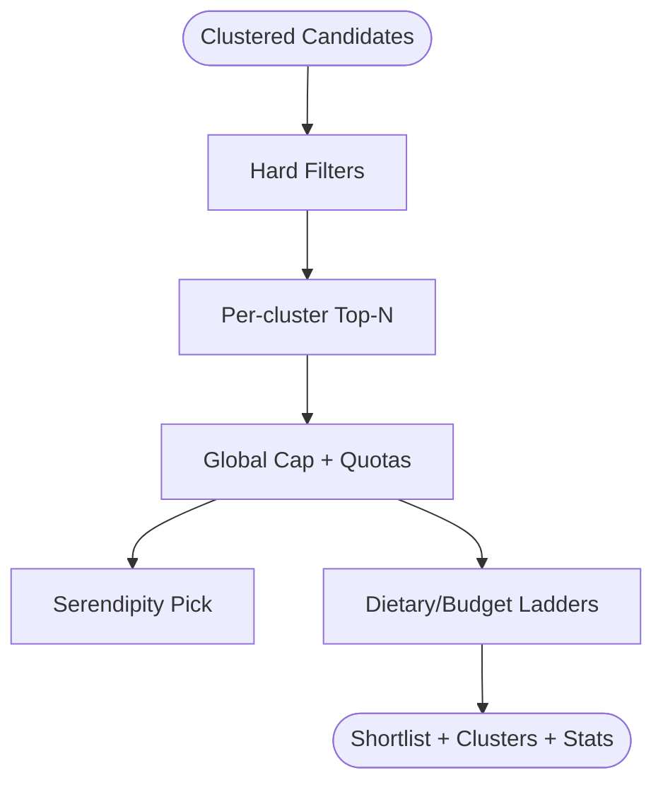
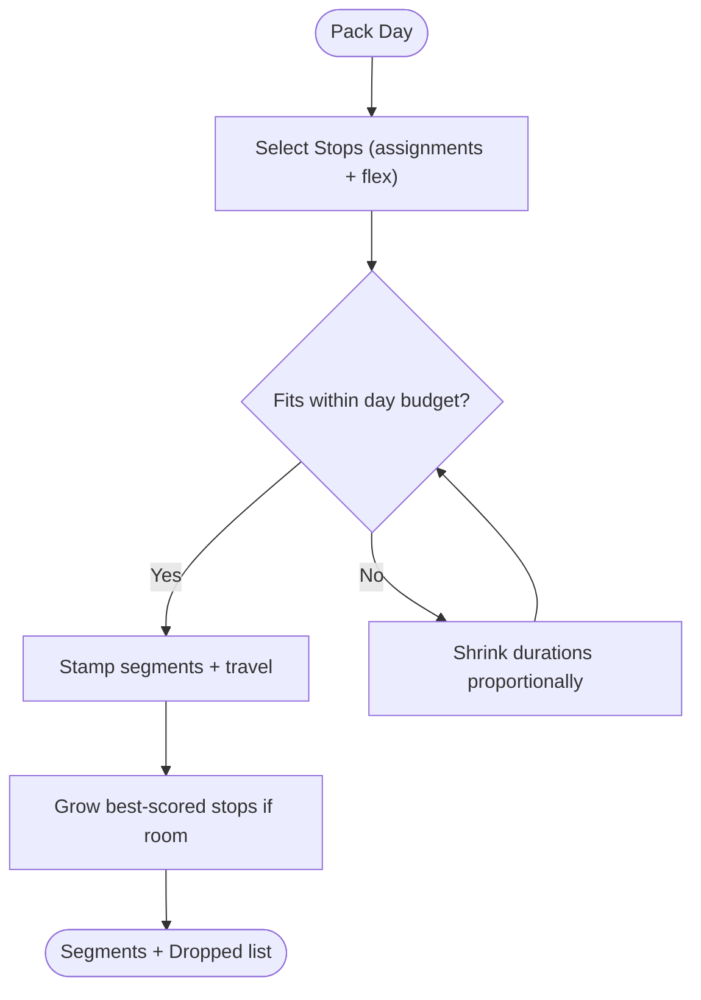
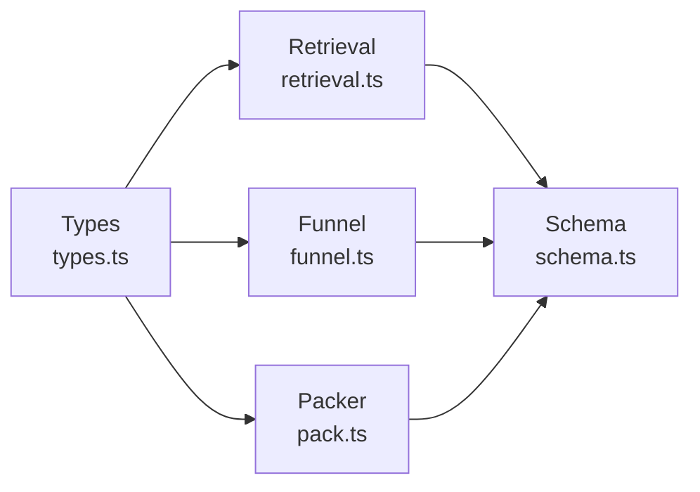

# Planning Pipeline System

<cite>
**Referenced Files in This Document**
- [package.json](file://package.json)
- [personalization-pipeline.md](file://docs/personalization-pipeline.md)
- [implementation-plan.md](file://docs/implementation-plan.md)
- [page.tsx](file://src/app/page.tsx)
- [schema.ts](file://src/lib/db/schema.ts)
- [types.ts](file://src/lib/planner/types.ts)
- [retrieval.ts](file://src/lib/planner/retrieval.ts)
- [funnel.ts](file://src/lib/planner/funnel.ts)
- [pack.ts](file://src/lib/planner/pack.ts)
- [itineraries.ts](file://src/lib/api/itineraries.ts)
</cite>

## Table of Contents
1. [Introduction](#introduction)
2. [Project Structure](#project-structure)
3. [Core Components](#core-components)
4. [Architecture Overview](#architecture-overview)
5. [Detailed Component Analysis](#detailed-component-analysis)
6. [Dependency Analysis](#dependency-analysis)
7. [Performance Considerations](#performance-considerations)
8. [Troubleshooting Guide](#troubleshooting-guide)
9. [Conclusion](#conclusion)

## Introduction
This document explains the Planning Pipeline System that generates hyper-personalized itineraries from user preferences and place data. The system is implemented as a Next.js application with server-side route handlers, a deterministic core for retrieval, scoring, clustering, scheduling, and validation, and optional AI passes for enrichment and narration. It uses Neon Postgres via Drizzle for persistence and integrates Google Places APIs with strict caching and cost controls.

The pipeline follows a clear mental model: recall (retrieve candidates), precision (score and narrow), schedule (time and fit), and explain (narration). Deterministic code owns time math, geometry, and constraints; AI contributes content and assignment guidance within strict contracts.

**Section sources**
- [personalization-pipeline.md:1-108](file://docs/personalization-pipeline.md#L1-L108)
- [implementation-plan.md:1-23](file://docs/implementation-plan.md#L1-L23)

## Project Structure
At a high level:
- App entry redirects to the home page.
- Planner logic lives under src/lib/planner with modules for retrieval, funneling, duration resolution, packing, photos, and types.
- Database schema is defined in Drizzle under src/lib/db/schema.ts.
- API client utilities are under src/lib/api/itineraries.ts.
- Documentation describes design and implementation steps.

**Diagram sources**
- [page.tsx:1-6](file://src/app/page.tsx#L1-L6)
- [itineraries.ts:59-78](file://src/lib/api/itineraries.ts#L59-L78)
- [retrieval.ts:1-28](file://src/lib/planner/retrieval.ts#L1-L28)
- [schema.ts:59-116](file://src/lib/db/schema.ts#L59-L116)

**Section sources**
- [page.tsx:1-6](file://src/app/page.tsx#L1-L6)
- [package.json:1-21](file://package.json#L1-L21)

## Core Components
Key components and responsibilities:
- Retrieval: cache-first search plan, deduplication, normalization, shortlist hydration, and stats tracking.
- Funnel: staged narrowing with hard filters, per-cluster caps, global cap, quotas, serendipity slot, and degradation ladders.
- Duration resolution: visit duration ladder and pace multipliers.
- Packing: elastic-slot scheduler that stamps times, inserts travel legs, and enforces day budgets.
- Types: shared vocabulary for profiles, options, opening hours, candidate places, and enrichment.
- Schema: persistent tables for locations, caches, enrichments, area guides, itineraries, days, activities, and jobs.

**Section sources**
- [retrieval.ts:1-28](file://src/lib/planner/retrieval.ts#L1-L28)
- [funnel.ts:1-16](file://src/lib/planner/funnel.ts#L1-L16)
- [types.ts:1-126](file://src/lib/planner/types.ts#L1-L126)
- [schema.ts:59-256](file://src/lib/db/schema.ts#L59-L256)

## Architecture Overview
The planning pipeline orchestrates several stages with clear boundaries and testable seams:

**Diagram sources**
- [retrieval.ts:386-503](file://src/lib/planner/retrieval.ts#L386-L503)
- [funnel.ts:189-353](file://src/lib/planner/funnel.ts#L189-L353)
- [pack.ts:296-315](file://src/lib/planner/pack.ts#L296-L315)
- [schema.ts:174-256](file://src/lib/db/schema.ts#L174-L256)

## Detailed Component Analysis

### Retrieval Module
Responsibilities:
- Build a search plan from interests and dietary needs using a taxonomy bridge.
- Cache-first retrieval keyed by normalized city/query/type/pageSize.
- Normalize raw responses into RetrievedPlace shapes.
- Hydrate shortlist fields only for shortlisted IDs to control costs.
- Track detailed stats for every loss path (failures, duplicates, missing rows).

Key behaviors:
- Field masks limit billed SKUs; bulk search avoids Atmosphere fields.
- Photo resource names stored; media resolved later.
- Concurrency and TTL configurable; clock injected for determinism.

**Diagram sources**
- [retrieval.ts:140-164](file://src/lib/planner/retrieval.ts#L140-L164)
- [retrieval.ts:386-503](file://src/lib/planner/retrieval.ts#L386-L503)

**Section sources**
- [retrieval.ts:44-94](file://src/lib/planner/retrieval.ts#L44-L94)
- [retrieval.ts:331-375](file://src/lib/planner/retrieval.ts#L331-L375)
- [retrieval.ts:542-603](file://src/lib/planner/retrieval.ts#L542-L603)

### Funnel Module
Responsibilities:
- Apply hard filters (closed, off-budget, meal-specific dietary rules).
- Cap per cluster to prevent dense neighborhoods from starving others.
- Enforce global cap and quotas (restaurant share, cuisine diversity).
- Provide serendipity pick and degradation ladders for diet and budget.
- Output grouped clusters for Pass B assignment.

Key behaviors:
- Every drop recorded with stage and reason for transparency.
- Cluster scoring balances top-place quality, interest coverage, and variety.
- Shortlist size controlled to keep LLM input manageable.

**Diagram sources**
- [funnel.ts:189-353](file://src/lib/planner/funnel.ts#L189-L353)
- [funnel.ts:368-434](file://src/lib/planner/funnel.ts#L368-L434)
- [funnel.ts:471-502](file://src/lib/planner/funnel.ts#L471-L502)

**Section sources**
- [funnel.ts:31-70](file://src/lib/planner/funnel.ts#L31-L70)
- [funnel.ts:157-179](file://src/lib/planner/funnel.ts#L157-L179)
- [funnel.ts:207-318](file://src/lib/planner/funnel.ts#L207-L318)

### Packing Module
Responsibilities:
- Stamp times onto an ordered day while preserving Pass B’s sequence.
- Insert travel legs between stops based on distance thresholds.
- Enforce meal windows and day-end constraints per pace.
- Use elastic durations and a degradation ladder to fit or shrink the day.
- Report dropped items with reasons for traceability.

Key behaviors:
- Meals are anchors; activities fill gaps.
- Pace influences buffers, end time, and duration bias.
- Walk vs transit threshold applied consistently.

**Diagram sources**
- [pack.ts:296-315](file://src/lib/planner/pack.ts#L296-L315)
- [pack.ts:374-405](file://src/lib/planner/pack.ts#L374-L405)
- [pack.ts:506-574](file://src/lib/planner/pack.ts#L506-L574)

**Section sources**
- [pack.ts:50-76](file://src/lib/planner/pack.ts#L50-L76)
- [pack.ts:113-177](file://src/lib/planner/pack.ts#L113-L177)
- [pack.ts:250-259](file://src/lib/planner/pack.ts#L250-L259)

### Types and Schema
Shared types define the planner’s vocabulary:
- PreferenceProfile: interests, dietary needs, pace, budget, learned affinities.
- SchedulerOptions: clustering and packing knobs.
- CandidatePlace: retrieved place shape consumed by deterministic core.
- PlaceEnrichment: cached AI-derived tags, descriptions, and durations.

Schema defines persistent structures:
- locations: cached Google data with photo names and status.
- place_search_cache: 30-day TTL keyed by query hash.
- place_enrichments: cached AI enrichment with model/prompt versioning.
- itineraries, itinerary_days, itinerary_activities: final timeline storage.
- jobs: async planning job queue with progress and errors.

**Section sources**
- [types.ts:27-51](file://src/lib/planner/types.ts#L27-L51)
- [types.ts:73-126](file://src/lib/planner/types.ts#L73-L126)
- [schema.ts:59-116](file://src/lib/db/schema.ts#L59-L116)
- [schema.ts:120-170](file://src/lib/db/schema.ts#L120-L170)
- [schema.ts:174-256](file://src/lib/db/schema.ts#L174-L256)

## Dependency Analysis
Component relationships:
- Retrieval depends on taxonomy and HTTP utilities; writes to LocationStore and SearchCache.
- Funnel depends on scoring and taxonomy; outputs clusters for Pass B.
- Packer depends on duration resolution and travel leg provider; persists timeline segments.
- Schema provides typed tables used across modules.

**Diagram sources**
- [types.ts:1-126](file://src/lib/planner/types.ts#L1-L126)
- [retrieval.ts:331-375](file://src/lib/planner/retrieval.ts#L331-L375)
- [funnel.ts:189-353](file://src/lib/planner/funnel.ts#L189-L353)
- [pack.ts:296-315](file://src/lib/planner/pack.ts#L296-L315)
- [schema.ts:59-256](file://src/lib/db/schema.ts#L59-L256)

**Section sources**
- [retrieval.ts:331-375](file://src/lib/planner/retrieval.ts#L331-L375)
- [funnel.ts:189-353](file://src/lib/planner/funnel.ts#L189-L353)
- [pack.ts:296-315](file://src/lib/planner/pack.ts#L296-L315)
- [schema.ts:59-256](file://src/lib/db/schema.ts#L59-L256)

## Performance Considerations
- Retrieval is the most expensive stage; cache-first strategy minimizes billed calls.
- Field masks avoid unnecessary Atmosphere fields during bulk search.
- Photo resolution deferred until final stops to reduce SKU costs.
- Concurrency limits and TTLs tune throughput and freshness.
- Elastic scheduling reduces overruns without dropping meaningful stops.

[No sources needed since this section provides general guidance]

## Troubleshooting Guide
Common issues and diagnostics:
- Missing locations after cache hit: check store hydration and missingFromStore counters.
- Overbudget days: inspect packer’s dropped list and squeeze ladder outcomes.
- Dietary mismatches: verify hard filters and degradation ladder rung selection.
- Job failures: review job error field and friendly error routing in handlers.

**Section sources**
- [retrieval.ts:344-375](file://src/lib/planner/retrieval.ts#L344-L375)
- [pack.ts:243-255](file://src/lib/planner/pack.ts#L243-L255)
- [schema.ts:231-256](file://src/lib/db/schema.ts#L231-L256)

## Conclusion
The Planning Pipeline System combines deterministic algorithms with carefully bounded AI usage to produce personalized, schedulable itineraries. Its modular design emphasizes testability, cost control, and transparency through detailed stats and drop reasons. With strong typing, schema-driven persistence, and clear separation of concerns, it supports iterative improvements and robust debugging.

[No sources needed since this section summarizes without analyzing specific files]