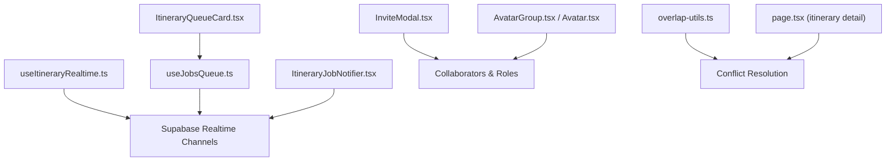
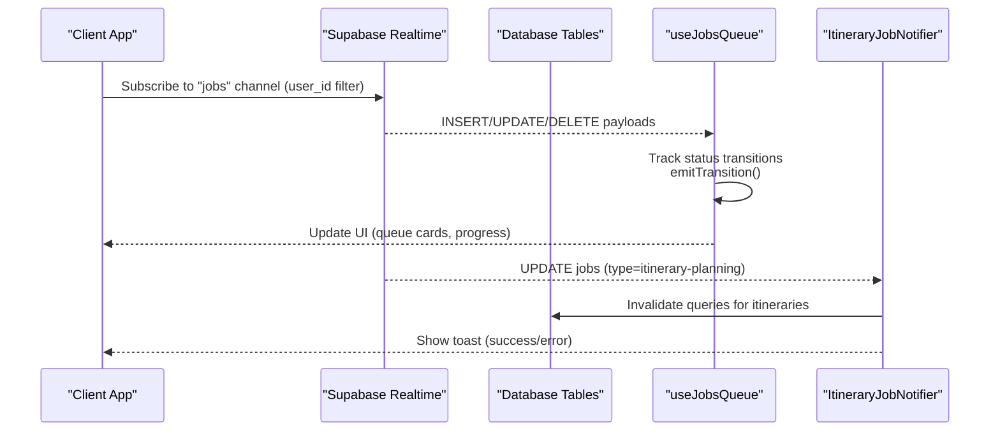
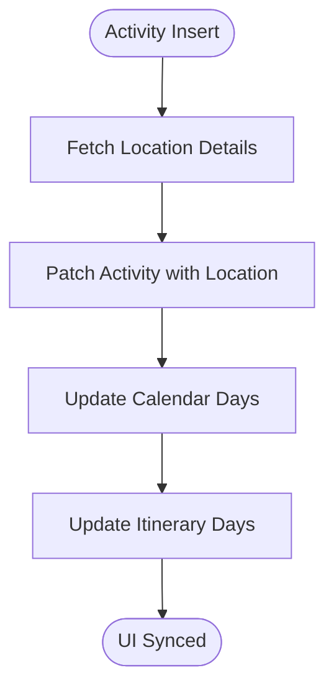
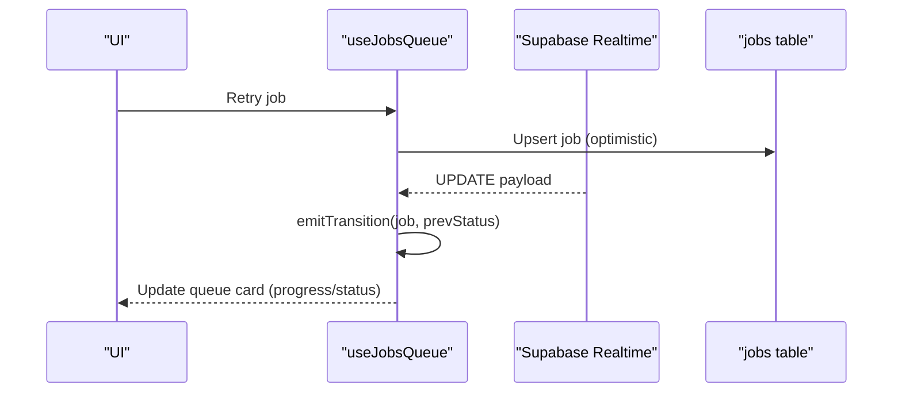
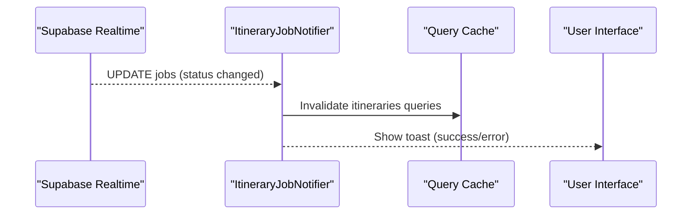
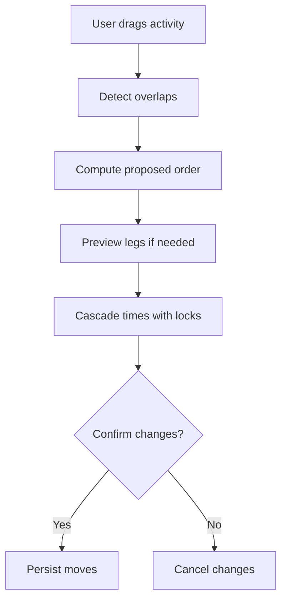
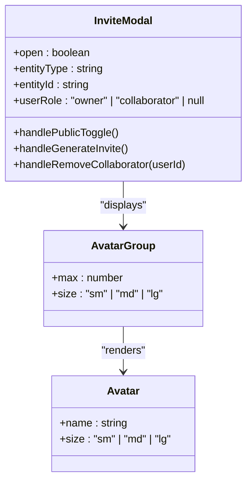
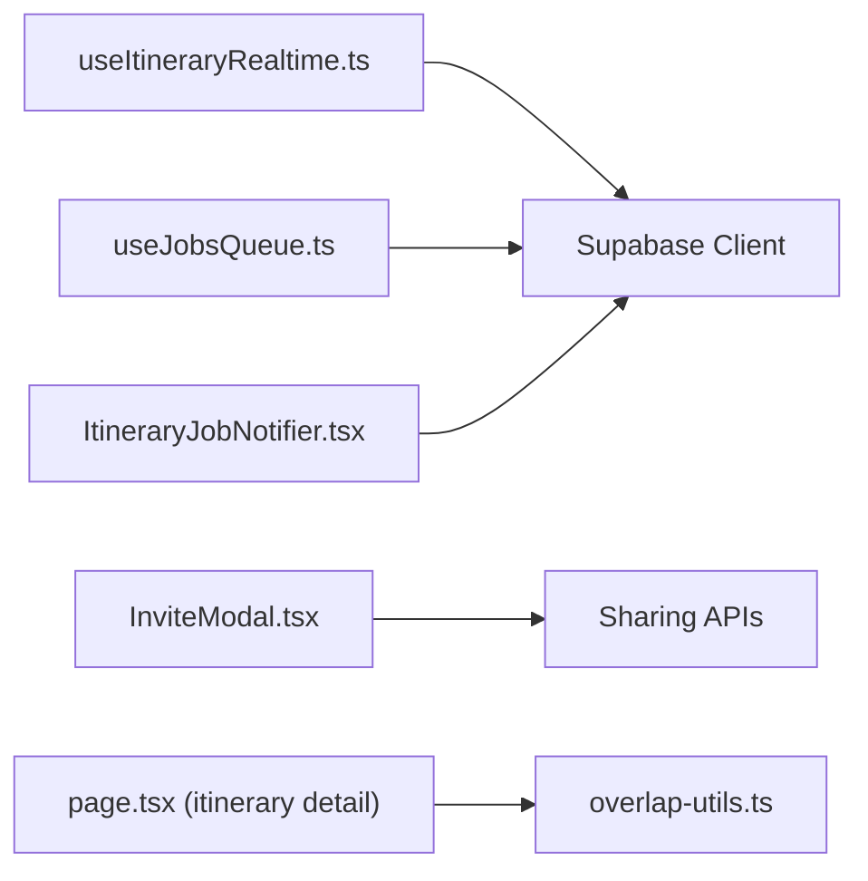

# Real-time Collaboration Features

<cite>
**Referenced Files in This Document**
- [useItineraryRealtime.ts](file://src/hooks/useItineraryRealtime.ts)
- [useJobsQueue.ts](file://src/hooks/useJobsQueue.ts)
- [ItineraryJobNotifier.tsx](file://src/components/notifications/ItineraryJobNotifier.tsx)
- [InviteModal.tsx](file://src/components/ui/modals/InviteModal.tsx)
- [overlap-utils.ts](file://src/components/ui/itinerary/overlap-utils.ts)
- [page.tsx (itinerary detail)](file://src/app/itineraries/[id]/page.tsx)
- [ItineraryQueueCard.tsx](file://src/components/ui/itinerary/ItineraryQueueCard.tsx)
- [AvatarGroup.tsx](file://src/components/ui/primitives/AvatarGroup.tsx)
- [Avatar.tsx](file://src/components/ui/primitives/Avatar.tsx)
- [recordView.ts](file://src/lib/supabase/mutations/recordView.ts)
- [personalization-pipeline.md](file://docs/personalization-pipeline.md)
</cite>

## Table of Contents
1. Introduction
2. Project Structure
3. Core Components
4. Architecture Overview
5. Detailed Component Analysis
6. Dependency Analysis
7. Performance Considerations
8. Troubleshooting Guide
9. Conclusion
10. Appendices

## Introduction
This document explains the real-time collaboration features for itinerary planning, focusing on:
- WebSocket-based synchronization using Supabase Realtime channels
- Conflict resolution strategies when multiple users edit overlapping activities
- Presence indicators and collaborator management
- Job queue system for background processing with real-time notifications
- Collaborative editing workflows, permissions, and role-based access control
- Performance considerations for concurrent users

## Project Structure
The collaboration features span hooks, UI components, and notification utilities:
- Real-time subscriptions are implemented as React hooks that listen to database changes via Supabase Realtime channels
- The job queue hook manages background tasks and transitions
- Notification component surfaces completion/failure events to users
- Invite modal handles sharing, collaborators, and roles
- Overlap utilities resolve scheduling conflicts during collaborative edits

**Diagram sources**
- [useItineraryRealtime.ts:39-333](file://src/hooks/useItineraryRealtime.ts#L39-L333)
- [useJobsQueue.ts:167-260](file://src/hooks/useJobsQueue.ts#L167-L260)
- [ItineraryJobNotifier.tsx:29-88](file://src/components/notifications/ItineraryJobNotifier.tsx#L29-L88)
- [InviteModal.tsx:184-270](file://src/components/ui/modals/InviteModal.tsx#L184-L270)
- [overlap-utils.ts:64-184](file://src/components/ui/itinerary/overlap-utils.ts#L64-L184)
- [page.tsx (itinerary detail):926-990](file://src/app/itineraries/[id]/page.tsx#L926-L990)
- [ItineraryQueueCard.tsx:55-199](file://src/components/ui/itinerary/ItineraryQueueCard.tsx#L55-L199)
- [AvatarGroup.tsx:34-56](file://src/components/ui/primitives/AvatarGroup.tsx#L34-L56)
- [Avatar.tsx:1-38](file://src/components/ui/primitives/Avatar.tsx#L1-L38)

**Section sources**
- [useItineraryRealtime.ts:39-533](file://src/hooks/useItineraryRealtime.ts#L39-L533)
- [useJobsQueue.ts:45-296](file://src/hooks/useJobsQueue.ts#L45-L296)
- [ItineraryJobNotifier.tsx:1-92](file://src/components/notifications/ItineraryJobNotifier.tsx#L1-L92)
- [InviteModal.tsx:1-789](file://src/components/ui/modals/InviteModal.tsx#L1-L789)
- [overlap-utils.ts:35-184](file://src/components/ui/itinerary/overlap-utils.ts#L35-L184)
- [page.tsx (itinerary detail):926-990](file://src/app/itineraries/[id]/page.tsx#L926-L990)
- [ItineraryQueueCard.tsx:55-199](file://src/components/ui/itinerary/ItineraryQueueCard.tsx#L55-L199)
- [AvatarGroup.tsx:34-56](file://src/components/ui/primitives/AvatarGroup.tsx#L34-L56)
- [Avatar.tsx:1-38](file://src/components/ui/primitives/Avatar.tsx#L1-L38)

## Core Components
- Real-time synchronization hook subscribes to activity, day, flight, lodging, and member changes for a specific itinerary
- Job queue hook tracks background jobs with optimistic updates, reconciliation, and transition callbacks
- Itinerary job notifier listens for completed or failed jobs and invalidates caches to reflect new data
- Invite modal manages public links, invite tokens, collaborator lists, and removal actions
- Overlap utilities compute conflict-free schedules by locking anchors and cascading times
- Queue card visualizes job progress and retry flows

**Section sources**
- [useItineraryRealtime.ts:39-533](file://src/hooks/useItineraryRealtime.ts#L39-L533)
- [useJobsQueue.ts:45-296](file://src/hooks/useJobsQueue.ts#L45-L296)
- [ItineraryJobNotifier.tsx:29-88](file://src/components/notifications/ItineraryJobNotifier.tsx#L29-L88)
- [InviteModal.tsx:184-270](file://src/components/ui/modals/InviteModal.tsx#L184-L270)
- [overlap-utils.ts:64-184](file://src/components/ui/itinerary/overlap-utils.ts#L64-L184)
- [ItineraryQueueCard.tsx:55-199](file://src/components/ui/itinerary/ItineraryQueueCard.tsx#L55-L199)

## Architecture Overview
The system uses Supabase Realtime channels to keep clients synchronized with server state. Each feature area subscribes to relevant tables and filters by entity IDs or user IDs. Job queues use a dedicated channel per user and instance to avoid deduplication conflicts. Collaborator presence is reflected through database changes to membership tables.

**Diagram sources**
- [useJobsQueue.ts:167-260](file://src/hooks/useJobsQueue.ts#L167-L260)
- [ItineraryJobNotifier.tsx:29-88](file://src/components/notifications/ItineraryJobNotifier.tsx#L29-L88)

**Section sources**
- [useJobsQueue.ts:167-260](file://src/hooks/useJobsQueue.ts#L167-L260)
- [ItineraryJobNotifier.tsx:29-88](file://src/components/notifications/ItineraryJobNotifier.tsx#L29-L88)

## Detailed Component Analysis

### Real-time Synchronization (Activities, Days, Flights, Lodgings, Members)
- Subscribes to INSERT/UPDATE/DELETE events for itinerary_activities, itinerary_days, itinerary_flights, itinerary_lodgings, and user_itinerary
- Mirrors changes into both calendar days and itinerary state to keep view modes consistent
- Hydrates location details asynchronously after activity inserts to ensure thumbnails and addresses render correctly
- Updates collaborator list in real time when users join or leave an itinerary

**Diagram sources**
- [useItineraryRealtime.ts:39-168](file://src/hooks/useItineraryRealtime.ts#L39-L168)

**Section sources**
- [useItineraryRealtime.ts:39-533](file://src/hooks/useItineraryRealtime.ts#L39-L533)

### Job Queue System
- Maintains a local map of job statuses to detect transitions and trigger callbacks for completion, failure, or rejection
- Reconciles missed realtime updates by re-fetching active jobs when visibility changes or reconnects occur
- Filters jobs by type and shows recent failures for retry
- Provides optimistic upsert to immediately reflect retries without waiting for realtime

**Diagram sources**
- [useJobsQueue.ts:89-136](file://src/hooks/useJobsQueue.ts#L89-L136)
- [useJobsQueue.ts:167-260](file://src/hooks/useJobsQueue.ts#L167-L260)
- [useJobsQueue.ts:269-296](file://src/hooks/useJobsQueue.ts#L269-L296)

**Section sources**
- [useJobsQueue.ts:45-296](file://src/hooks/useJobsQueue.ts#L45-L296)
- [ItineraryQueueCard.tsx:55-199](file://src/components/ui/itinerary/ItineraryQueueCard.tsx#L55-L199)

### Real-time Notifications
- Listens specifically for itinerary-planning jobs and invalidates cached queries upon completion or failure
- Shows success or error toasts with actionable links to view newly generated itineraries

**Diagram sources**
- [ItineraryJobNotifier.tsx:29-88](file://src/components/notifications/ItineraryJobNotifier.tsx#L29-L88)

**Section sources**
- [ItineraryJobNotifier.tsx:29-88](file://src/components/notifications/ItineraryJobNotifier.tsx#L29-L88)

### Collaborative Editing and Conflict Resolution
- Detects overlapping activities and computes a proposed order that respects locked anchors
- Cascades start times based on travel durations and user-defined windows
- Presents a deconflict preview to the user before persisting changes
- Preserves leg durations for reordered adjacencies to maintain accurate travel estimates

**Diagram sources**
- [overlap-utils.ts:64-184](file://src/components/ui/itinerary/overlap-utils.ts#L64-L184)
- [page.tsx (itinerary detail):926-990](file://src/app/itineraries/[id]/page.tsx#L926-L990)

**Section sources**
- [overlap-utils.ts:35-184](file://src/components/ui/itinerary/overlap-utils.ts#L35-L184)
- [page.tsx (itinerary detail):926-990](file://src/app/itineraries/[id]/page.tsx#L926-L990)

### Presence Indicators and Collaborator Management
- Real-time updates to user_itinerary add/remove collaborators and update avatar groups
- Invite modal allows owners to generate public links, invite tokens, and manage collaborators
- Avatars visually indicate current collaborators; group displays overflow counts

**Diagram sources**
- [InviteModal.tsx:184-270](file://src/components/ui/modals/InviteModal.tsx#L184-L270)
- [AvatarGroup.tsx:34-56](file://src/components/ui/primitives/AvatarGroup.tsx#L34-L56)
- [Avatar.tsx:1-38](file://src/components/ui/primitives/Avatar.tsx#L1-L38)

**Section sources**
- [useItineraryRealtime.ts:407-440](file://src/hooks/useItineraryRealtime.ts#L407-L440)
- [InviteModal.tsx:184-270](file://src/components/ui/modals/InviteModal.tsx#L184-L270)
- [AvatarGroup.tsx:34-56](file://src/components/ui/primitives/AvatarGroup.tsx#L34-L56)
- [Avatar.tsx:1-38](file://src/components/ui/primitives/Avatar.tsx#L1-L38)

### User Permissions and Role-Based Access Control
- Owner-only actions include toggling public links, generating/revoke invite tokens, and removing collaborators
- Non-owners cannot remove collaborators or change sharing settings
- Error messages enforce ownership constraints at the backend level

**Section sources**
- [InviteModal.tsx:194-270](file://src/components/ui/modals/InviteModal.tsx#L194-L270)
- [errors/userMessages.ts:49-92](file://src/lib/errors/userMessages.ts#L49-L92)

### Audit Trails and Change Tracking
- View tracking records recently viewed entities per user
- Realtime echoes and optimistic updates provide immediate feedback but do not implement explicit audit logs in this codebase

**Section sources**
- [recordView.ts:1-24](file://src/lib/supabase/mutations/recordView.ts#L1-L24)

## Dependency Analysis
- Realtime hooks depend on Supabase client and subscribe to specific tables filtered by entity or user IDs
- Job queue depends on realtime channel per user and instance to avoid deduplication conflicts
- Itinerary detail page integrates overlap utilities to resolve conflicts before persisting moves
- Invite modal depends on API endpoints for token generation and collaborator management

**Diagram sources**
- [useItineraryRealtime.ts:39-533](file://src/hooks/useItineraryRealtime.ts#L39-L533)
- [useJobsQueue.ts:167-260](file://src/hooks/useJobsQueue.ts#L167-L260)
- [ItineraryJobNotifier.tsx:29-88](file://src/components/notifications/ItineraryJobNotifier.tsx#L29-L88)
- [InviteModal.tsx:184-270](file://src/components/ui/modals/InviteModal.tsx#L184-L270)
- [page.tsx (itinerary detail):926-990](file://src/app/itineraries/[id]/page.tsx#L926-L990)
- [overlap-utils.ts:64-184](file://src/components/ui/itinerary/overlap-utils.ts#L64-L184)

**Section sources**
- [useItineraryRealtime.ts:39-533](file://src/hooks/useItineraryRealtime.ts#L39-L533)
- [useJobsQueue.ts:167-260](file://src/hooks/useJobsQueue.ts#L167-L260)
- [ItineraryJobNotifier.tsx:29-88](file://src/components/notifications/ItineraryJobNotifier.tsx#L29-L88)
- [InviteModal.tsx:184-270](file://src/components/ui/modals/InviteModal.tsx#L184-L270)
- [page.tsx (itinerary detail):926-990](file://src/app/itineraries/[id]/page.tsx#L926-L990)
- [overlap-utils.ts:64-184](file://src/components/ui/itinerary/overlap-utils.ts#L64-L184)

## Performance Considerations
- Multiple realtime subscriptions can be heavy; consider reducing scope or replacing with polling where appropriate
- Channel deduplication requires unique instance IDs to prevent subscription conflicts
- Reconciliation logic mitigates missed realtime updates during backgrounding or reconnects
- Optimistic updates improve perceived responsiveness while awaiting server confirmation
- For large-scale collaboration, evaluate batching updates and limiting realtime to necessary tables

**Section sources**
- [personalization-pipeline.md:140-156](file://docs/personalization-pipeline.md#L140-L156)
- [useJobsQueue.ts:68-76](file://src/hooks/useJobsQueue.ts#L68-L76)
- [useJobsQueue.ts:105-136](file://src/hooks/useJobsQueue.ts#L105-L136)

## Troubleshooting Guide
- Missed realtime updates: Use visibility change and reconnect handlers to reconcile active jobs
- Stuck jobs: Check connection errors and retry failed jobs within a reasonable time window
- Duplicate subscriptions: Ensure unique instance IDs per hook call to avoid channel dedup issues
- Permission errors: Verify owner role before attempting to modify collaborators or sharing settings

**Section sources**
- [useJobsQueue.ts:161-165](file://src/hooks/useJobsQueue.ts#L161-L165)
- [useJobsQueue.ts:250-260](file://src/hooks/useJobsQueue.ts#L250-L260)
- [InviteModal.tsx:194-270](file://src/components/ui/modals/InviteModal.tsx#L194-L270)

## Conclusion
The itinerary planning application implements robust real-time collaboration through Supabase Realtime channels, with careful attention to conflict resolution, job queue management, and presence indicators. Role-based access controls and owner-only actions ensure secure collaboration. Performance optimizations like optimistic updates and reconciliation help maintain responsiveness under concurrent usage.

## Appendices

### Team Collaboration Workflow Example
- Owner generates invite link and shares it with team members
- Team members join via invite token and appear in the collaborator list
- Realtime updates reflect joins/leaves instantly
- Collaborators can edit activities; overlaps are resolved with locked anchors and cascaded times
- Background jobs process complex operations and notify users upon completion or failure

**Section sources**
- [InviteModal.tsx:184-270](file://src/components/ui/modals/InviteModal.tsx#L184-L270)
- [useItineraryRealtime.ts:407-440](file://src/hooks/useItineraryRealtime.ts#L407-L440)
- [overlap-utils.ts:64-184](file://src/components/ui/itinerary/overlap-utils.ts#L64-L184)
- [ItineraryJobNotifier.tsx:29-88](file://src/components/notifications/ItineraryJobNotifier.tsx#L29-L88)

### Conflict Scenarios and Resolutions
- Scenario: Two users drag overlapping activities simultaneously
- Resolution: Lock anchors, compute proposed order, cascade times, present preview, then persist changes
- Outcome: Conflicts are minimized and user intent is preserved

**Section sources**
- [overlap-utils.ts:64-184](file://src/components/ui/itinerary/overlap-utils.ts#L64-L184)
- [page.tsx (itinerary detail):926-990](file://src/app/itineraries/[id]/page.tsx#L926-L990)