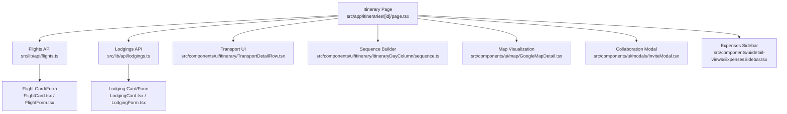
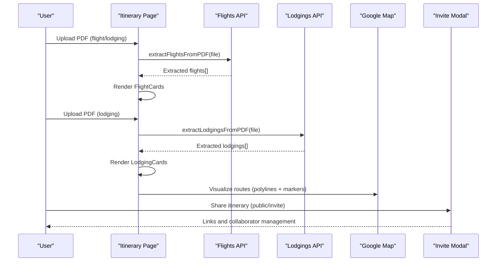
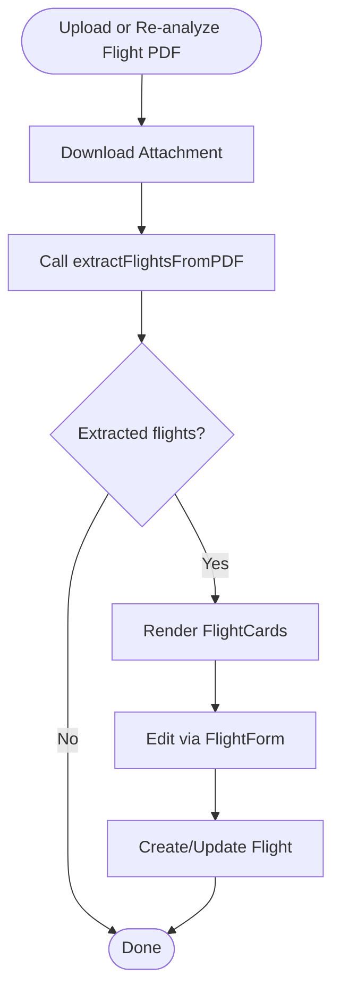
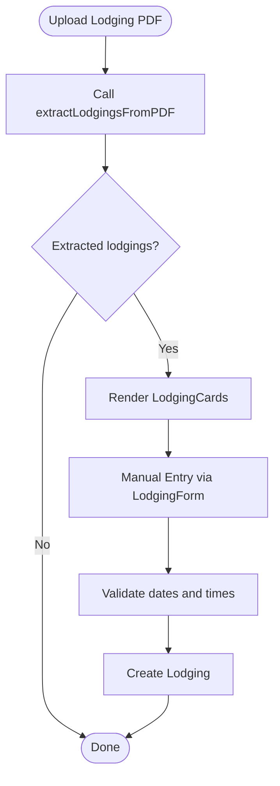
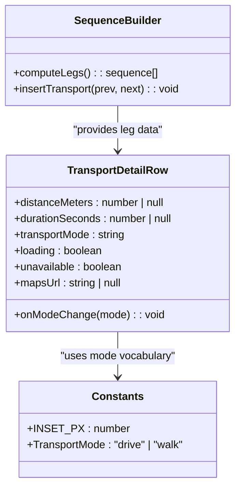
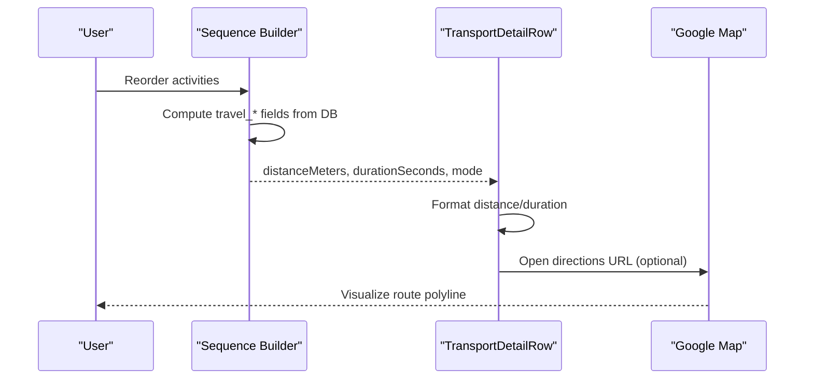
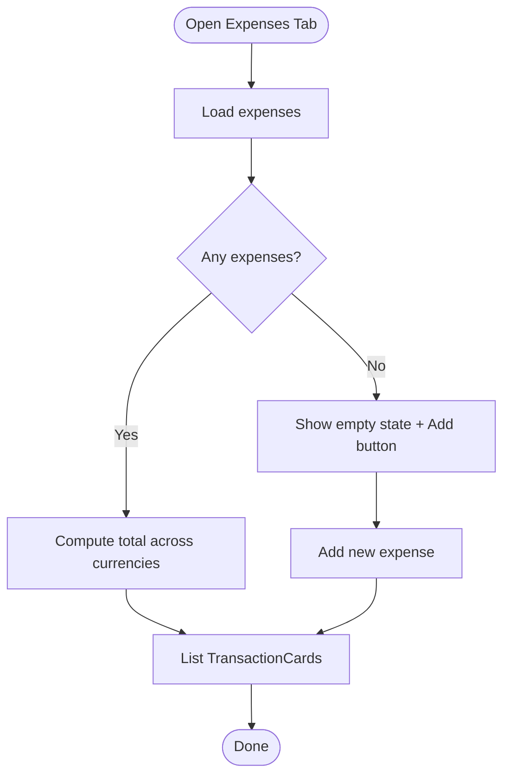
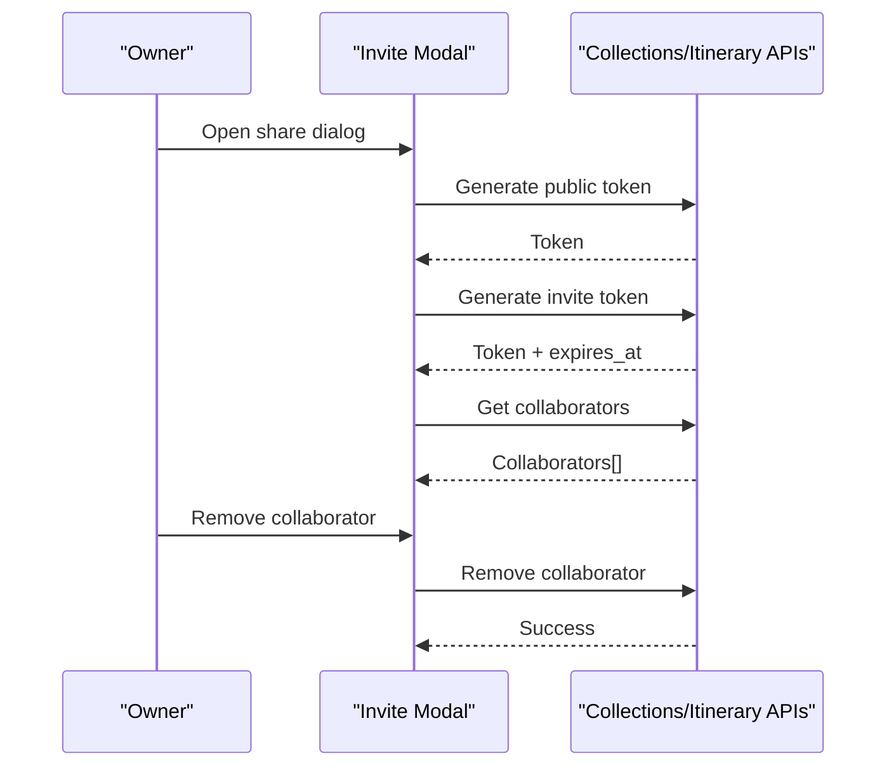
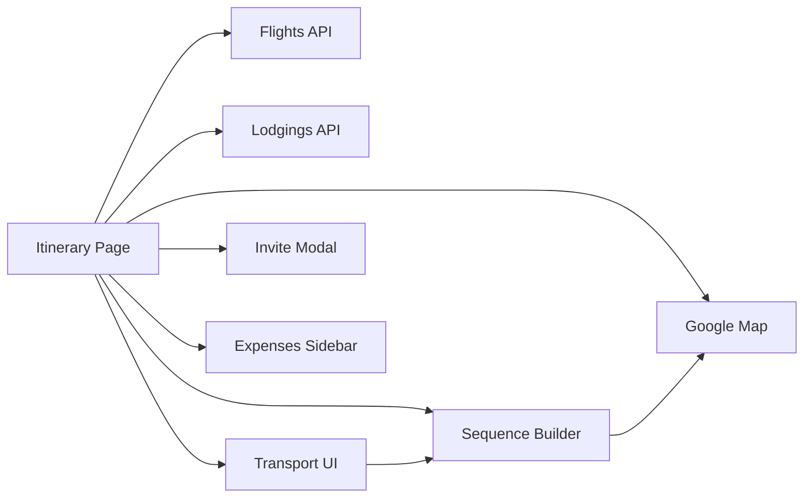

# Transportation & Logistics Planning

<cite>
**Referenced Files in This Document**
- [page.tsx](file://src/app/itineraries/[id]/page.tsx)
- [flights.ts](file://src/lib/api/flights.ts)
- [lodgings.ts](file://src/lib/api/lodgings.ts)
- [FlightCard.tsx](file://src/components/ui/detail-views/FlightCard.tsx)
- [LodgingCard.tsx](file://src/components/ui/detail-views/LodgingCard.tsx)
- [FlightForm.tsx](file://src/components/ui/detail-views/FlightForm.tsx)
- [LodgingForm.tsx](file://src/components/ui/detail-views/LodgingForm.tsx)
- [TransportDetailRow.tsx](file://src/components/ui/itinerary/TransportDetailRow.tsx)
- [sequence.ts](file://src/components/ui/itinerary/ItineraryDayColumn/sequence.ts)
- [constants.ts](file://src/components/ui/itinerary/ItineraryDayColumn/constants.ts)
- [GoogleMapDetail.tsx](file://src/components/ui/map/GoogleMapDetail.tsx)
- [InviteModal.tsx](file://src/components/ui/modals/InviteModal.tsx)
- [collections.ts](file://src/lib/api/collections.ts)
- [ExpensesSidebar.tsx](file://src/components/ui/detail-views/ExpensesSidebar.tsx)
- [ExpenseSummaryCard.tsx](file://src/components/ui/detail-views/ExpenseSummaryCard.tsx)
- [userMessages.ts](file://src/lib/errors/userMessages.ts)
</cite>

## Table of Contents
1. Introduction
2. Project Structure
3. Core Components
4. Architecture Overview
5. Detailed Component Analysis
6. Dependency Analysis
7. Performance Considerations
8. Troubleshooting Guide
9. Conclusion

## Introduction
This document explains the transportation and logistics planning features for multi-day trips, focusing on:
- Importing flights from PDFs and managing flight details
- Booking lodging with check-in/out date management and accommodation search
- Selecting transportation modes between activities, visualizing routes, and calculating travel times
- Integrating expense tracking and enabling collaborative planning for group trips

The system supports both manual entry and automated extraction from uploaded documents (PDFs), integrates with mapping services for route visualization and time/distance calculations, and provides sharing and collaboration tools for teams or families.

## Project Structure
Key areas involved in transportation and logistics:
- Itinerary page orchestrates uploads, extraction, and UI state for flights, lodging, expenses, and map views
- API clients for flights and lodgings handle PDF extraction endpoints and CRUD operations
- Detail view components render cards and forms for flights and lodging
- Transport leg computation and display integrate with backend route calculation and Google Maps
- Collaboration modal supports public links and invite tokens for sharing itineraries
- Expense sidebar summarizes spending and allows adding transactions

**Diagram sources**
- [page.tsx:1-200](file://src/app/itineraries/[id]/page.tsx#L1-L200)
- [flights.ts:1-119](file://src/lib/api/flights.ts#L1-L119)
- [lodgings.ts:22-64](file://src/lib/api/lodgings.ts#L22-L64)
- [TransportDetailRow.tsx:1-119](file://src/components/ui/itinerary/TransportDetailRow.tsx#L1-L119)
- [sequence.ts:104-194](file://src/components/ui/itinerary/ItineraryDayColumn/sequence.ts#L104-L194)
- [GoogleMapDetail.tsx:341-374](file://src/components/ui/map/GoogleMapDetail.tsx#L341-L374)
- [InviteModal.tsx:111-419](file://src/components/ui/modals/InviteModal.tsx#L111-L419)
- [ExpensesSidebar.tsx:1-81](file://src/components/ui/detail-views/ExpensesSidebar.tsx#L1-L81)

**Section sources**
- [page.tsx:1-200](file://src/app/itineraries/[id]/page.tsx#L1-L200)

## Core Components
- Flight import and management: Upload PDFs to extract flights; create and list flights; re-analyze stored attachments
- Lodging booking integration: Upload PDFs to extract lodging; manage check-in/out dates and times; optional accommodation search via place enrichment
- Transportation mode selection and route visualization: Choose drive or walk per leg; compute distance and duration; visualize routes on map
- Expense tracking integration: Summarize total spent across currencies; add and expand transaction details
- Collaborative planning: Generate public and invite tokens; manage collaborators; share itinerary links

**Section sources**
- [flights.ts:45-119](file://src/lib/api/flights.ts#L45-L119)
- [lodgings.ts:22-64](file://src/lib/api/lodgings.ts#L22-L64)
- [TransportDetailRow.tsx:1-119](file://src/components/ui/itinerary/TransportDetailRow.tsx#L1-L119)
- [sequence.ts:104-194](file://src/components/ui/itinerary/ItineraryDayColumn/sequence.ts#L104-L194)
- [ExpensesSidebar.tsx:1-81](file://src/components/ui/detail-views/ExpensesSidebar.tsx#L1-L81)
- [InviteModal.tsx:111-419](file://src/components/ui/modals/InviteModal.tsx#L111-L419)

## Architecture Overview
The itinerary page coordinates end-to-end flows:
- File upload triggers extraction APIs that parse PDFs and return structured entities (flights, lodgings)
- Entities are rendered as cards; users can edit via forms
- Between activities, transport legs are computed by the backend and displayed with mode-specific durations and distances
- Routes are visualized on a map using encoded polylines and day-colored markers
- Expenses are summarized and can be expanded into sub-transactions
- Sharing is managed via public and invite tokens, with collaborator lists and removal

**Diagram sources**
- [page.tsx:3155-3184](file://src/app/itineraries/[id]/page.tsx#L3155-L3184)
- [flights.ts:45-65](file://src/lib/api/flights.ts#L45-L65)
- [lodgings.ts:58-64](file://src/lib/api/lodgings.ts#L58-L64)
- [GoogleMapDetail.tsx:341-374](file://src/components/ui/map/GoogleMapDetail.tsx#L341-L374)
- [InviteModal.tsx:111-419](file://src/components/ui/modals/InviteModal.tsx#L111-L419)

## Detailed Component Analysis

### Flight Import and Management
- PDF extraction: The itinerary page downloads stored attachments and re-runs extraction to update flights without duplication
- API client: Sends authenticated requests to extract flights and create/list them
- UI: Flight cards show route, schedule, cost, confirmation, and other details; forms allow manual entry with validation and date range checks

**Diagram sources**
- [page.tsx:3155-3184](file://src/app/itineraries/[id]/page.tsx#L3155-L3184)
- [flights.ts:45-119](file://src/lib/api/flights.ts#L45-L119)
- [FlightCard.tsx:1-146](file://src/components/ui/detail-views/FlightCard.tsx#L1-L146)
- [FlightForm.tsx:1-433](file://src/components/ui/detail-views/FlightForm.tsx#L1-L433)

**Section sources**
- [page.tsx:3155-3184](file://src/app/itineraries/[id]/page.tsx#L3155-L3184)
- [flights.ts:45-119](file://src/lib/api/flights.ts#L45-L119)
- [FlightCard.tsx:1-146](file://src/components/ui/detail-views/FlightCard.tsx#L1-L146)
- [FlightForm.tsx:1-433](file://src/components/ui/detail-views/FlightForm.tsx#L1-L433)

### Lodging Booking Integration
- PDF extraction: Upload lodging PDFs to extract name, address, check-in/out dates/times, cost, currency, and optional place photo
- Check-in/out management: Forms validate required fields; default times are applied when not provided; temporary IDs support optimistic UI updates
- Accommodation search: Place enrichment supplies photos and location data for display and map pinning

**Diagram sources**
- [page.tsx:3177-3184](file://src/app/itineraries/[id]/page.tsx#L3177-L3184)
- [lodgings.ts:22-64](file://src/lib/api/lodgings.ts#L22-L64)
- [LodgingCard.tsx:1-179](file://src/components/ui/detail-views/LodgingCard.tsx#L1-L179)
- [LodgingForm.tsx:1-252](file://src/components/ui/detail-views/LodgingForm.tsx#L1-L252)

**Section sources**
- [page.tsx:3177-3184](file://src/app/itineraries/[id]/page.tsx#L3177-L3184)
- [lodgings.ts:22-64](file://src/lib/api/lodgings.ts#L22-L64)
- [LodgingCard.tsx:1-179](file://src/components/ui/detail-views/LodgingCard.tsx#L1-L179)
- [LodgingForm.tsx:1-252](file://src/components/ui/detail-views/LodgingForm.tsx#L1-L252)

### Transportation Mode Selection, Route Visualization, and Travel Time Calculations
- Mode selection: Users choose between drive and walk per leg; icons reflect current mode
- Leg computation: Backend calculates distance and duration; client renders transport rows with loading states and “no route” handling
- Sequence building: Transport legs are inserted between activities based on activity order and travel metadata
- Map visualization: Polylines represent routes with day-based colors; markers indicate stops

**Diagram sources**
- [TransportDetailRow.tsx:1-119](file://src/components/ui/itinerary/TransportDetailRow.tsx#L1-L119)
- [sequence.ts:104-194](file://src/components/ui/itinerary/ItineraryDayColumn/sequence.ts#L104-L194)
- [constants.ts:1-4](file://src/components/ui/itinerary/ItineraryDayColumn/constants.ts#L1-L4)

**Diagram sources**
- [sequence.ts:104-194](file://src/components/ui/itinerary/ItineraryDayColumn/sequence.ts#L104-L194)
- [TransportDetailRow.tsx:1-119](file://src/components/ui/itinerary/TransportDetailRow.tsx#L1-L119)
- [GoogleMapDetail.tsx:341-374](file://src/components/ui/map/GoogleMapDetail.tsx#L341-L374)

**Section sources**
- [TransportDetailRow.tsx:1-119](file://src/components/ui/itinerary/TransportDetailRow.tsx#L1-L119)
- [sequence.ts:104-194](file://src/components/ui/itinerary/ItineraryDayColumn/sequence.ts#L104-L194)
- [constants.ts:1-4](file://src/components/ui/itinerary/ItineraryDayColumn/constants.ts#L1-L4)
- [GoogleMapDetail.tsx:341-374](file://src/components/ui/map/GoogleMapDetail.tsx#L341-L374)

### Expense Tracking Integration
- Summary card shows total spent with currency toggling
- Sidebar lists expenses with expandable sub-transactions
- Empty state guides users to add new expenses

**Diagram sources**
- [ExpensesSidebar.tsx:1-81](file://src/components/ui/detail-views/ExpensesSidebar.tsx#L1-L81)
- [ExpenseSummaryCard.tsx:1-79](file://src/components/ui/detail-views/ExpenseSummaryCard.tsx#L1-L79)

**Section sources**
- [ExpensesSidebar.tsx:1-81](file://src/components/ui/detail-views/ExpensesSidebar.tsx#L1-L81)
- [ExpenseSummaryCard.tsx:1-79](file://src/components/ui/detail-views/ExpenseSummaryCard.tsx#L1-L79)

### Collaborative Planning Features for Group Trips
- Public and invite tokens enable sharing itineraries and collections
- Owners can generate/revoke tokens and remove collaborators
- Invite modal displays link status, expiry, and collaborator list

**Diagram sources**
- [InviteModal.tsx:111-419](file://src/components/ui/modals/InviteModal.tsx#L111-L419)
- [collections.ts:127-157](file://src/lib/api/collections.ts#L127-L157)

**Section sources**
- [InviteModal.tsx:111-419](file://src/components/ui/modals/InviteModal.tsx#L111-L419)
- [collections.ts:127-157](file://src/lib/api/collections.ts#L127-L157)

## Dependency Analysis
- Itinerary page depends on:
  - Flights and lodgings APIs for extraction and CRUD
  - Transport UI for leg display and mode switching
  - Sequence builder for inserting transport legs between activities
  - Map component for route visualization
  - Collaboration modal for sharing
  - Expense sidebar for financial summaries
- External integrations:
  - Google Maps for directions URLs and route polylines
  - Supabase auth for token retrieval
  - Backend endpoints for PDF extraction and route recalculation

**Diagram sources**
- [page.tsx:1-200](file://src/app/itineraries/[id]/page.tsx#L1-L200)
- [flights.ts:1-119](file://src/lib/api/flights.ts#L1-L119)
- [lodgings.ts:22-64](file://src/lib/api/lodgings.ts#L22-L64)
- [TransportDetailRow.tsx:1-119](file://src/components/ui/itinerary/TransportDetailRow.tsx#L1-L119)
- [sequence.ts:104-194](file://src/components/ui/itinerary/ItineraryDayColumn/sequence.ts#L104-L194)
- [GoogleMapDetail.tsx:341-374](file://src/components/ui/map/GoogleMapDetail.tsx#L341-L374)
- [InviteModal.tsx:111-419](file://src/components/ui/modals/InviteModal.tsx#L111-L419)
- [ExpensesSidebar.tsx:1-81](file://src/components/ui/detail-views/ExpensesSidebar.tsx#L1-L81)

**Section sources**
- [page.tsx:1-200](file://src/app/itineraries/[id]/page.tsx#L1-L200)

## Performance Considerations
- Avoid synthetic transport legs: Only emit legs when backend-provided travel metadata exists; this prevents unnecessary recomputation and ensures accuracy
- Skeleton states: Show loading placeholders while Directions cascade recalculates to maintain responsive UI
- Efficient rendering: Use compact activity cards and tabbed panels to reduce layout thrash during heavy edits
- Map performance: Encode polylines and use day-based color palettes to minimize redraw overhead
- Extraction deduplication: Re-analysis reuses existing results and skips duplicates to avoid redundant work

[No sources needed since this section provides general guidance]

## Troubleshooting Guide
Common issues and resolutions:
- Not authenticated: Ensure session exists before calling extraction or CRUD APIs
- Invalid or unsupported file types: Only PDF files are supported for extraction; verify MIME type and error messages
- No route available: Some modes may be unavailable between certain locations (e.g., water barriers); switch mode or adjust locations
- Itinerary length exceeded: Server enforces maximum days; shorten trip or split into multiple itineraries
- Permission errors: Only owners can modify collaborators or delete items; verify role and permissions

**Section sources**
- [flights.ts:38-43](file://src/lib/api/flights.ts#L38-L43)
- [userMessages.ts:49-92](file://src/lib/errors/userMessages.ts#L49-L92)

## Conclusion
The transportation and logistics planning system combines automated PDF extraction with robust manual editing, real-time route visualization, and collaborative sharing. It supports complex multi-modal journeys by computing transport legs between activities, integrating maps for route display, and providing expense tracking for budgeting. The modular architecture separates concerns across UI components, API clients, and backend services, enabling scalable enhancements and reliable user experiences.

[No sources needed since this section summarizes without analyzing specific files]