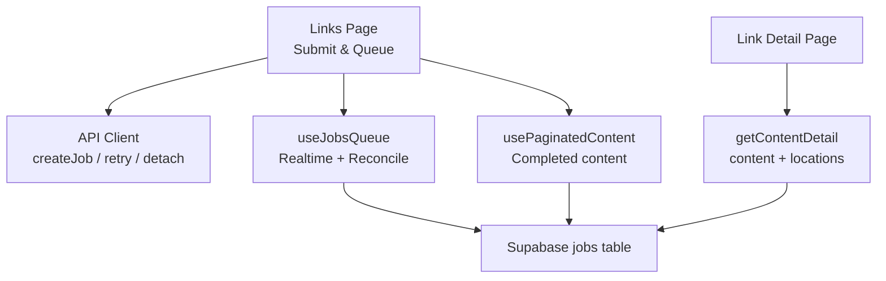
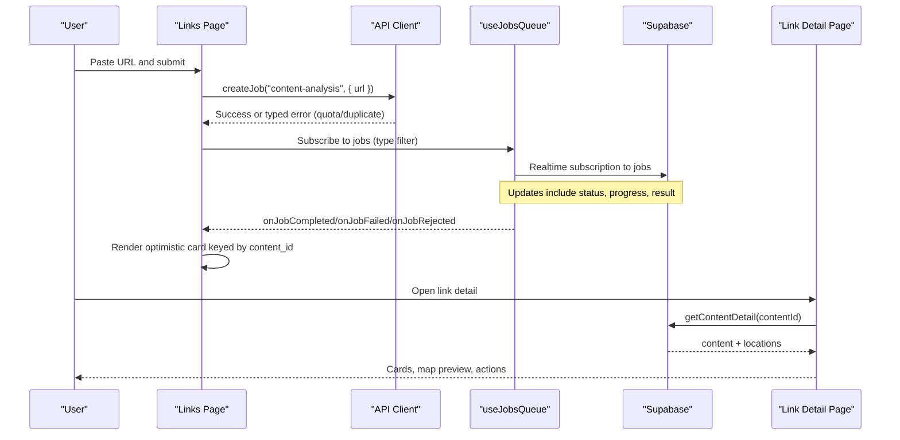
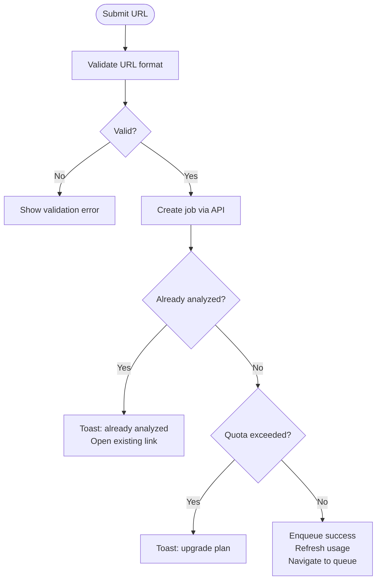
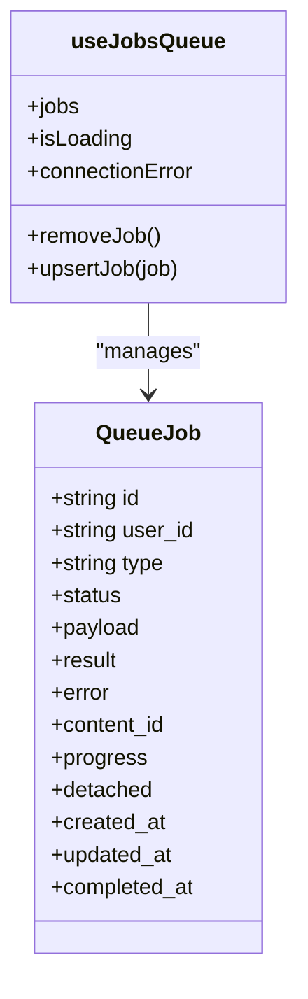
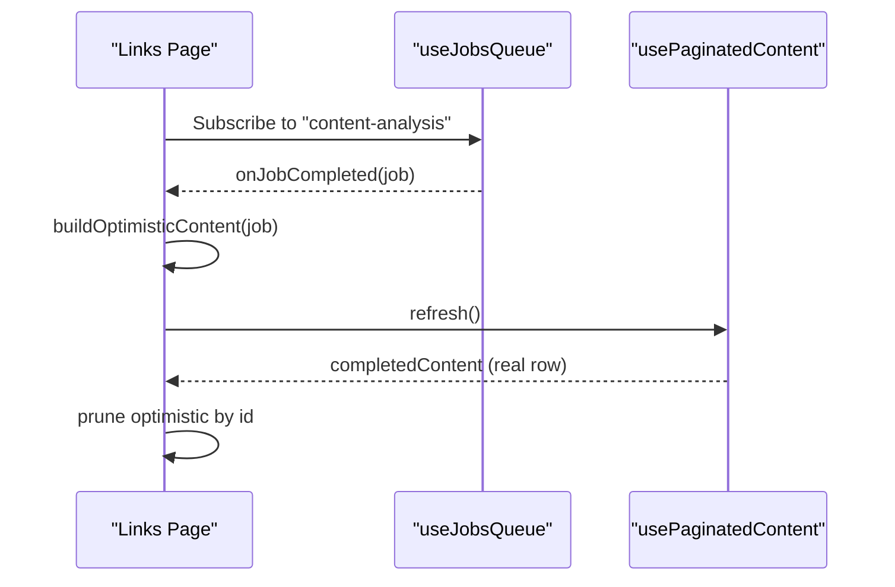
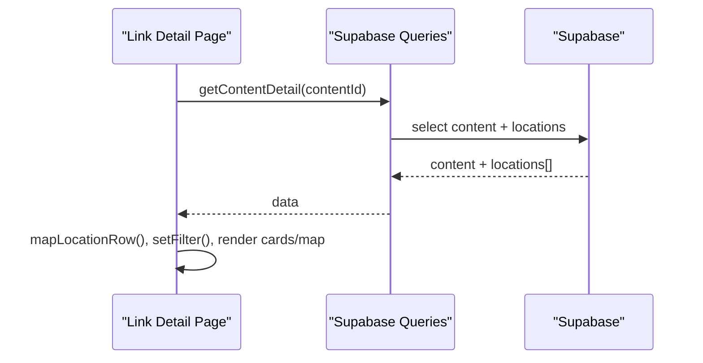
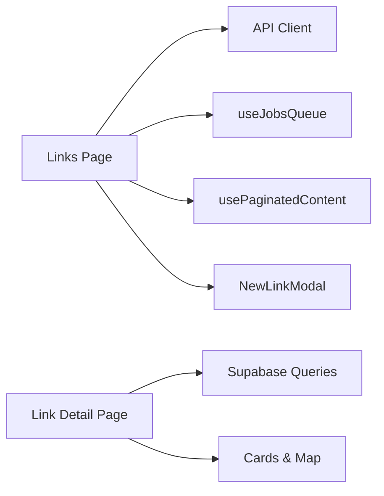

# Content Analysis Workflow

<cite>
**Referenced Files in This Document**
- [page.tsx](file://src/app/links/page.tsx)
- [page.tsx](file://src/app/links/[id]/page.tsx)
- [NewLinkModal.tsx](file://src/components/ui/modals/NewLinkModal.tsx)
- [client.ts](file://src/lib/api/client.ts)
- [queries.ts](file://src/lib/supabase/queries.ts)
- [useJobsQueue.ts](file://src/hooks/useJobsQueue.ts)
- [usePaginatedContent.ts](file://src/hooks/usePaginatedContent.ts)
- [url-validation.ts](file://src/lib/utils/url-validation.ts)
- [userMessages.ts](file://src/lib/errors/userMessages.ts)
- [content.ts](file://src/lib/api/content.ts)
</cite>

## Table of Contents
1. Introduction
2. Project Structure
3. Core Components
4. Architecture Overview
5. Detailed Component Analysis
6. Dependency Analysis
7. Performance Considerations
8. Troubleshooting Guide
9. Conclusion

## Introduction
This document explains the end-to-end content analysis workflow for submitted URLs that extracts location data and presents it to users. It covers how links are submitted, queued, processed in the background, transformed into displayable results, and surfaced on both the Links list and Link detail pages. It also documents supported URL types, error handling strategies, status monitoring, and fallback behaviors when no locations are found or content is unsupported.

## Project Structure
The workflow spans UI components, hooks, API client utilities, and Supabase queries:
- User input and submission: New link modal and page handlers enqueue a job.
- Background processing: Jobs are tracked via realtime subscriptions and progress animations.
- Result transformation: Completed jobs are merged with paginated content and mapped to UI models.
- Detail view: A dedicated page fetches content and associated locations, maps them, and renders cards and map previews.

**Diagram sources**
- [page.tsx:222-261](file://src/app/links/page.tsx#L222-L261)
- [client.ts:109-155](file://src/lib/api/client.ts#L109-L155)
- [useJobsQueue.ts:138-260](file://src/hooks/useJobsQueue.ts#L138-L260)
- [usePaginatedContent.ts:1-43](file://src/hooks/usePaginatedContent.ts#L1-L43)
- [queries.ts:50-99](file://src/lib/supabase/queries.ts#L50-L99)

**Section sources**
- [page.tsx:222-261](file://src/app/links/page.tsx#L222-L261)
- [client.ts:109-155](file://src/lib/api/client.ts#L109-L155)
- [useJobsQueue.ts:138-260](file://src/hooks/useJobsQueue.ts#L138-L260)
- [usePaginatedContent.ts:1-43](file://src/hooks/usePaginatedContent.ts#L1-L43)
- [queries.ts:50-99](file://src/lib/supabase/queries.ts#L50-L99)

## Core Components
- Link submission and queueing: The Links page collects URLs, validates them, and enqueues a content-analysis job. It handles quota and duplicate-link scenarios with typed errors and user-friendly toasts.
- Job tracking and progress: A hook subscribes to job updates, reconciles missed realtime events, and exposes completion/failure/rejection callbacks. Progress animation smooths perceived wait times.
- Result merging: Completed jobs are optimistically rendered as link cards before the canonical content row arrives, keyed by content_id to avoid flicker.
- Link detail view: Fetches content and its locations, maps rows to UI models, and renders cards, map preview, and actions (save, generate itinerary, delete).

**Section sources**
- [page.tsx:138-170](file://src/app/links/page.tsx#L138-L170)
- [page.tsx:222-261](file://src/app/links/page.tsx#L222-L261)
- [useJobsQueue.ts:45-103](file://src/hooks/useJobsQueue.ts#L45-L103)
- [page.tsx:287-333](file://src/app/links/[id]/page.tsx#L287-L333)

## Architecture Overview
The system uses a client-driven queue model:
- Submit: The UI calls createJob with type "content-analysis" and payload { url }.
- Process: A backend worker processes the URL, extracts metadata and locations, and updates the jobs table with progress and result.
- Observe: The frontend listens to realtime changes, emits transitions, and merges optimistic completions with paginated content.
- Display: The detail page loads content and locations, maps them, and renders the UI.

**Diagram sources**
- [page.tsx:222-261](file://src/app/links/page.tsx#L222-L261)
- [client.ts:109-155](file://src/lib/api/client.ts#L109-L155)
- [useJobsQueue.ts:138-260](file://src/hooks/useJobsQueue.ts#L138-L260)
- [queries.ts:50-99](file://src/lib/supabase/queries.ts#L50-L99)

## Detailed Component Analysis

### Link Submission and Validation
- Input validation ensures only http/https URLs with valid hostnames are accepted.
- On submit, the page attempts to create a job; duplicates and quota limits are handled with specific errors and user feedback.
- After successful submission, usage counters are refreshed and a toast guides the user to the queue.

**Diagram sources**
- [url-validation.ts:1-18](file://src/lib/utils/url-validation.ts#L1-L18)
- [page.tsx:222-261](file://src/app/links/page.tsx#L222-L261)
- [client.ts:109-155](file://src/lib/api/client.ts#L109-L155)

**Section sources**
- [NewLinkModal.tsx:56-81](file://src/components/ui/modals/NewLinkModal.tsx#L56-L81)
- [page.tsx:222-261](file://src/app/links/page.tsx#L222-L261)
- [client.ts:109-155](file://src/lib/api/client.ts#L109-L155)

### Background Processing Pipeline and Status Monitoring
- The job queue hook subscribes to realtime changes for the current user and filters by job type.
- It tracks per-job statuses, emits terminal transitions (completed, failed, rejected), and reconciles missed updates on reconnect or visibility change.
- Failed jobs older than one day are hidden; recent failures remain visible for retry.
- Progress animation maps step numbers and reported percentages to a smooth visual bar, including gap-filling between stages.

**Diagram sources**
- [useJobsQueue.ts:6-34](file://src/hooks/useJobsQueue.ts#L6-L34)
- [useJobsQueue.ts:45-103](file://src/hooks/useJobsQueue.ts#L45-L103)
- [useJobsQueue.ts:138-260](file://src/hooks/useJobsQueue.ts#L138-L260)

**Section sources**
- [useJobsQueue.ts:45-103](file://src/hooks/useJobsQueue.ts#L45-L103)
- [useJobsQueue.ts:138-260](file://src/hooks/useJobsQueue.ts#L138-L260)
- [useJobsQueue.ts:269-292](file://src/hooks/useJobsQueue.ts#L269-L292)

### Result Transformation and Optimistic Rendering
- When a job completes, the page builds an optimistic completed content item keyed by content_id using the job’s result and payload.
- This allows the queue card to morph into a link card in place, avoiding flicker while waiting for the canonical content row.
- Once the real content row arrives, optimistic entries are pruned.

**Diagram sources**
- [page.tsx:138-170](file://src/app/links/page.tsx#L138-L170)
- [page.tsx:99-118](file://src/app/links/page.tsx#L99-L118)
- [page.tsx:188-197](file://src/app/links/page.tsx#L188-L197)

**Section sources**
- [page.tsx:99-118](file://src/app/links/page.tsx#L99-L118)
- [page.tsx:138-170](file://src/app/links/page.tsx#L138-L170)
- [page.tsx:188-197](file://src/app/links/page.tsx#L188-L197)

### Link Detail Page Implementation
- Fetches content and nested locations via a single query, enforcing scoping through joins.
- Maps database rows to UI models, sets navbar filter context, and renders cards and map clusters.
- Supports selection, saving to collections/itineraries, generating itineraries from selected locations, and deleting the link.

**Diagram sources**
- [page.tsx:287-333](file://src/app/links/[id]/page.tsx#L287-L333)
- [queries.ts:50-99](file://src/lib/supabase/queries.ts#L50-L99)

**Section sources**
- [page.tsx:287-333](file://src/app/links/[id]/page.tsx#L287-L333)
- [queries.ts:50-99](file://src/lib/supabase/queries.ts#L50-L99)

### Supported URL Types and Fallbacks
- The UI advertises support for TikTok, YouTube, Instagram, and websites.
- If no travel locations are found, the job emits a rejection callback and the UI shows a corresponding toast.
- Unsupported or invalid inputs are caught early by URL validation or by backend rejections surfaced via friendly messages.

**Section sources**
- [NewLinkModal.tsx:96-98](file://src/components/ui/modals/NewLinkModal.tsx#L96-L98)
- [page.tsx:164-169](file://src/app/links/page.tsx#L164-L169)
- [url-validation.ts:1-18](file://src/lib/utils/url-validation.ts#L1-L18)
- [userMessages.ts:94-106](file://src/lib/errors/userMessages.ts#L94-L106)

## Dependency Analysis
- Links page depends on:
  - API client for job creation, retry, and deletion.
  - useJobsQueue for realtime job state and transitions.
  - usePaginatedContent for completed items.
  - NewLinkModal for validated input.
- Link detail page depends on:
  - Supabase queries for content and locations.
  - UI components for cards, map, and actions.

**Diagram sources**
- [page.tsx:222-261](file://src/app/links/page.tsx#L222-L261)
- [client.ts:109-155](file://src/lib/api/client.ts#L109-L155)
- [useJobsQueue.ts:138-260](file://src/hooks/useJobsQueue.ts#L138-L260)
- [usePaginatedContent.ts:1-43](file://src/hooks/usePaginatedContent.ts#L1-L43)
- [queries.ts:50-99](file://src/lib/supabase/queries.ts#L50-L99)

**Section sources**
- [page.tsx:222-261](file://src/app/links/page.tsx#L222-L261)
- [client.ts:109-155](file://src/lib/api/client.ts#L109-L155)
- [useJobsQueue.ts:138-260](file://src/hooks/useJobsQueue.ts#L138-L260)
- [usePaginatedContent.ts:1-43](file://src/hooks/usePaginatedContent.ts#L1-L43)
- [queries.ts:50-99](file://src/lib/supabase/queries.ts#L50-L99)

## Performance Considerations
- Optimistic rendering reduces perceived latency by showing completed cards immediately after job completion, keyed by content_id to prevent remounts.
- Realtime reconciliation prevents stuck states when tabs go background or connections drop.
- Progress animation smooths long-running stages by interpolating between reported steps and optional stage-level timing hints.
- Pagination and infinite scroll keep the Links page responsive as the number of links grows.

[No sources needed since this section provides general guidance]

## Troubleshooting Guide
- Duplicate link submission: Handled by a typed error that surfaces a toast with a direct link to the existing analysis.
- Quota exceeded: Typed error triggers an upgrade prompt and usage refresh.
- Network or server errors: Centralized unwrap/ensureOk converts HTTP failures into ApiError with status codes; friendly messages are used where appropriate.
- Stuck jobs: The queue detects stale processing states and offers retry; failed jobs within a day remain visible for manual removal or retry.
- No locations found: Job rejection callback displays a clear message guiding users to try another link.

**Section sources**
- [client.ts:109-155](file://src/lib/api/client.ts#L109-L155)
- [page.tsx:158-169](file://src/app/links/page.tsx#L158-L169)
- [useJobsQueue.ts:105-136](file://src/hooks/useJobsQueue.ts#L105-L136)
- [userMessages.ts:94-106](file://src/lib/errors/userMessages.ts#L94-L106)
- [content.ts:1-8](file://src/lib/api/content.ts#L1-L8)

## Conclusion
The content analysis workflow integrates a robust queue-based pipeline with optimistic UI updates and resilient realtime synchronization. Users can submit various link types, monitor progress, and review extracted locations in a detail view with rich actions. Error handling is explicit and user-friendly, ensuring clarity for duplicates, quotas, and unsupported content. The design balances responsiveness and correctness through careful state management and progressive enhancement of the user experience.