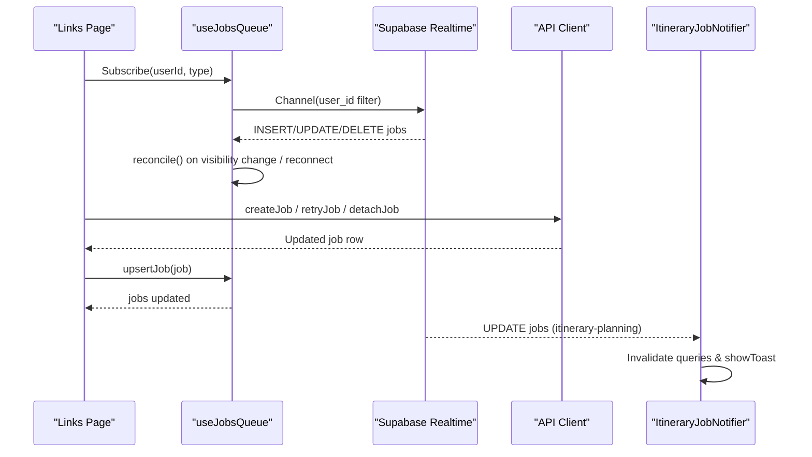
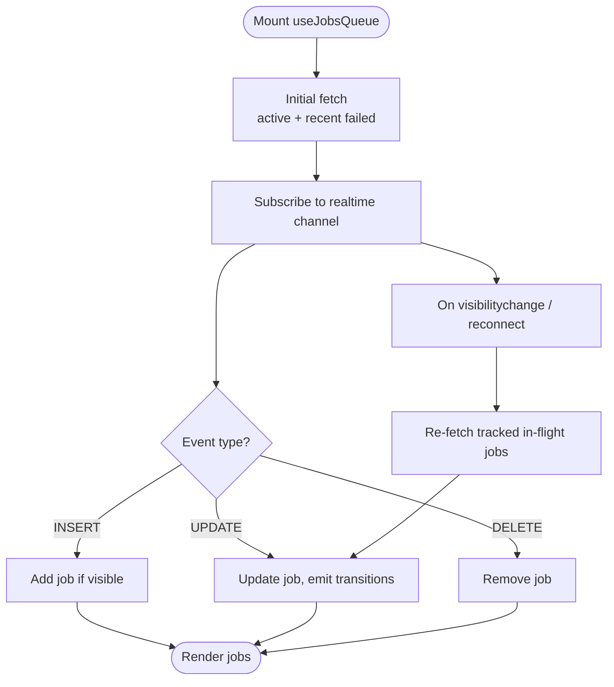
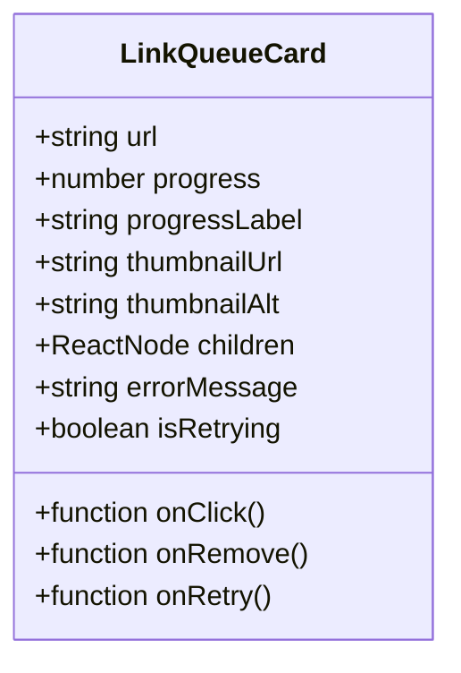
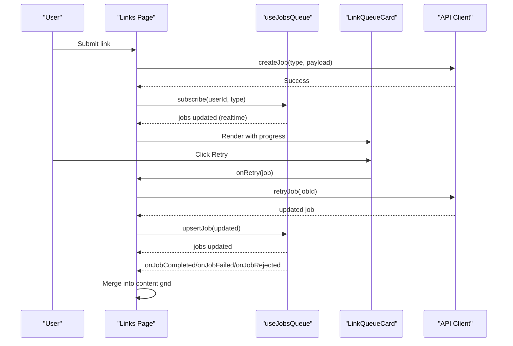
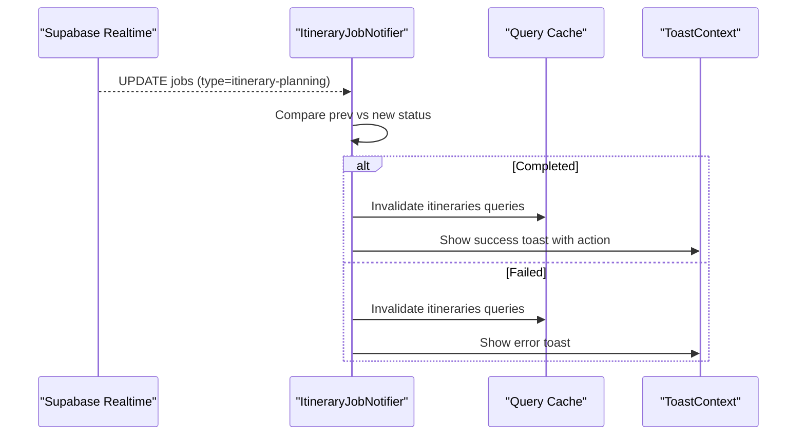
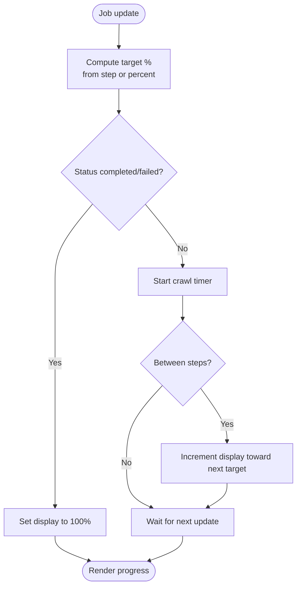
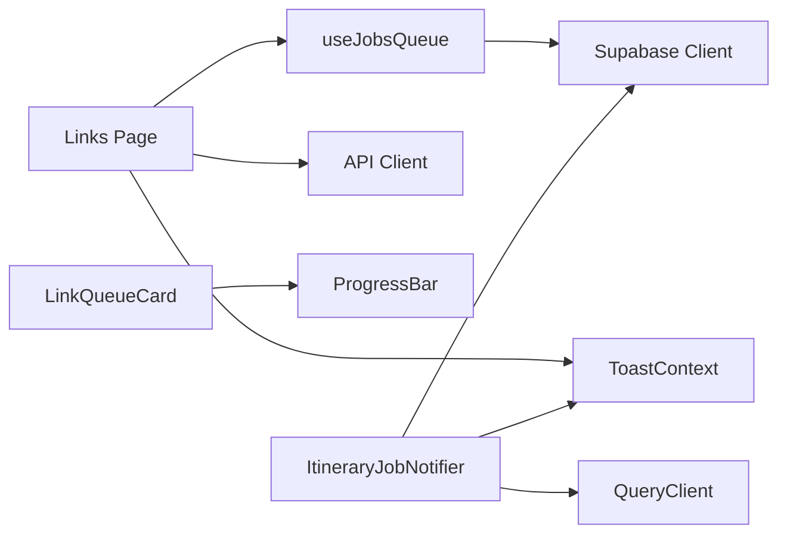

# Job Queue Management

<cite>
**Referenced Files in This Document**
- [useJobsQueue.ts](file://src/hooks/useJobsQueue.ts)
- [LinkQueueCard.tsx](file://src/components/ui/links/LinkQueueCard.tsx)
- [page.tsx](file://src/app/links/page.tsx)
- [ItineraryJobNotifier.tsx](file://src/components/notifications/ItineraryJobNotifier.tsx)
- [useProgressAnimation.ts](file://src/hooks/useProgressAnimation.ts)
- [useProgressEta.ts](file://src/hooks/useProgressEta.ts)
- [ToastContext.tsx](file://src/contexts/ToastContext.tsx)
- [client.ts](file://src/lib/api/client.ts)
</cite>

## Table of Contents
1. [Introduction](#introduction)
2. [Project Structure](#project-structure)
3. [Core Components](#core-components)
4. [Architecture Overview](#architecture-overview)
5. [Detailed Component Analysis](#detailed-component-analysis)
6. [Dependency Analysis](#dependency-analysis)
7. [Performance Considerations](#performance-considerations)
8. [Troubleshooting Guide](#troubleshooting-guide)
9. [Conclusion](#conclusion)

## Introduction
This document explains the job queue system that manages background link processing tasks. It covers the queue architecture, job lifecycle management, real-time status updates, progress tracking, retry mechanisms, error recovery patterns, and user experience considerations for long-running operations. It also documents the useJobsQueue hook implementation, LinkQueueCard component behavior, and integration with the notification system.

## Project Structure
The job queue spans hooks, UI components, pages, and notifications:
- Hook layer: useJobsQueue orchestrates initial fetch, realtime subscriptions, reconciliation, and state transitions.
- UI layer: LinkQueueCard renders individual queue items with states (queued, processing, failed), progress, and actions (remove, retry).
- Page integration: The Links page composes jobs into a grid, handles retries, and morphs completed jobs into content cards.
- Notifications: Toast-based feedback and an itinerary-specific notifier invalidate caches and show success/error toasts.
- Progress utilities: useProgressAnimation and useProgressEta compute smooth visual progress and countdown labels.

```mermaid
graph TB
subgraph "UI"
LQ["LinkQueueCard"]
LP["Links Page"]
end
subgraph "Hooks"
UJQ["useJobsQueue"]
UPA["useProgressAnimation"]
UETA["useProgressEta"]
end
subgraph "Notifications"
TOAST["ToastContext"]
INOTIFY["ItineraryJobNotifier"]
end
subgraph "API"
API["Client (create/retry/detach)"]
end
LP --> UJQ
LP --> LQ
LQ --> UPA
LQ --> UETA
UJQ --> API
LP --> TOAST
INOTIFY --> TOAST
INOTIFY --> API
```

**Diagram sources**
- [useJobsQueue.ts:45-295](file://src/hooks/useJobsQueue.ts#L45-L295)
- [LinkQueueCard.tsx:52-214](file://src/components/ui/links/LinkQueueCard.tsx#L52-L214)
- [page.tsx:120-430](file://src/app/links/page.tsx#L120-L430)
- [ItineraryJobNotifier.tsx:10-92](file://src/components/notifications/ItineraryJobNotifier.tsx#L10-L92)
- [useProgressAnimation.ts:1-104](file://src/hooks/useProgressAnimation.ts#L1-L104)
- [useProgressEta.ts:22-59](file://src/hooks/useProgressEta.ts#L22-L59)
- [client.ts:130-155](file://src/lib/api/client.ts#L130-L155)

**Section sources**
- [useJobsQueue.ts:45-295](file://src/hooks/useJobsQueue.ts#L45-L295)
- [LinkQueueCard.tsx:52-214](file://src/components/ui/links/LinkQueueCard.tsx#L52-L214)
- [page.tsx:120-430](file://src/app/links/page.tsx#L120-L430)
- [ItineraryJobNotifier.tsx:10-92](file://src/components/notifications/ItineraryJobNotifier.tsx#L10-L92)
- [useProgressAnimation.ts:1-104](file://src/hooks/useProgressAnimation.ts#L1-L104)
- [useProgressEta.ts:22-59](file://src/hooks/useProgressEta.ts#L22-L59)
- [client.ts:130-155](file://src/lib/api/client.ts#L130-L155)

## Core Components
- useJobsQueue: Manages job list, realtime updates, visibility-based reconciliation, and transition callbacks for completion/failure/rejection. Provides removeJob and upsertJob for optimistic UI updates.
- LinkQueueCard: Displays queued/processing/failed jobs with thumbnail, URL, progress bar, error message, and retry/remove actions.
- Links Page: Subscribes to jobs, creates new jobs, handles retries and removals, and merges completed jobs into the content grid with seamless handoff.
- ItineraryJobNotifier: Listens to job updates for itinerary planning, invalidates related queries, and shows success/error toasts.
- Progress utilities: Smoothly animate progress bars and provide ETA countdowns between worker updates.
- ToastContext: Centralized notification system used across the app for user feedback.

**Section sources**
- [useJobsQueue.ts:45-295](file://src/hooks/useJobsQueue.ts#L45-L295)
- [LinkQueueCard.tsx:52-214](file://src/components/ui/links/LinkQueueCard.tsx#L52-L214)
- [page.tsx:120-430](file://src/app/links/page.tsx#L120-L430)
- [ItineraryJobNotifier.tsx:10-92](file://src/components/notifications/ItineraryJobNotifier.tsx#L10-L92)
- [useProgressAnimation.ts:1-104](file://src/hooks/useProgressAnimation.ts#L1-L104)
- [useProgressEta.ts:22-59](file://src/hooks/useProgressEta.ts#L22-L59)
- [ToastContext.tsx:42-154](file://src/contexts/ToastContext.tsx#L42-L154)

## Architecture Overview
The queue uses Supabase realtime to keep the UI synchronized with backend workers. Jobs are filtered by user and type, with failed jobs kept visible for a day to enable retries. Realtime INSERT/UPDATE/DELETE events update local state, while reconciliation ensures consistency after reconnect or tab focus changes.



**Diagram sources**
- [useJobsQueue.ts:78-267](file://src/hooks/useJobsQueue.ts#L78-L267)
- [page.tsx:138-220](file://src/app/links/page.tsx#L138-L220)
- [ItineraryJobNotifier.tsx:29-88](file://src/components/notifications/ItineraryJobNotifier.tsx#L29-L88)
- [client.ts:130-155](file://src/lib/api/client.ts#L130-L155)

## Detailed Component Analysis

### useJobsQueue: Job Lifecycle and Realtime Sync
- Initial load: Fetches active jobs (queued/pending/processing) and recent failed jobs within 24 hours, excluding detached jobs. Sorts by failure priority and recency.
- Realtime subscription: Listens to postgres_changes for INSERT/UPDATE/DELETE on the jobs table scoped to the current user. Filters by optional type. Updates local state and triggers transition callbacks for terminal states.
- Reconciliation: On tab visibility change or channel reconnect, re-fetches tracked jobs still considered in-flight to settle any missed updates.
- State transitions: Emits onJobCompleted, onJobFailed, and onJobRejected when statuses change. Rejected jobs carry result.is_rejected.
- Optimistic updates: upsertJob allows immediate UI refresh after retry endpoints return a reset job row; removeJob clears stale entries.



**Diagram sources**
- [useJobsQueue.ts:78-267](file://src/hooks/useJobsQueue.ts#L78-L267)

**Section sources**
- [useJobsQueue.ts:78-267](file://src/hooks/useJobsQueue.ts#L78-L267)

### LinkQueueCard: Displaying Queue Items
- States: default, hover, processing, queued, failed. Failed state includes inset glow and error message.
- Media area: Phone-frame thumbnail container with subtle tilt during processing/hover.
- Footer: CategoryBadge and truncated URL.
- Actions: Remove button (hover-visible), Retry button (disabled while retrying), Progress bar (hidden in failed state).
- Accessibility: Keyboard support for clickable cards, aria-labels, and aria-busy for retry spinner.



**Diagram sources**
- [LinkQueueCard.tsx:36-50](file://src/components/ui/links/LinkQueueCard.tsx#L36-L50)
- [LinkQueueCard.tsx:52-214](file://src/components/ui/links/LinkQueueCard.tsx#L52-L214)

**Section sources**
- [LinkQueueCard.tsx:52-214](file://src/components/ui/links/LinkQueueCard.tsx#L52-L214)

### Links Page: Integration and User Flow
- Creates jobs via API and shows toast feedback. Handles quota errors and already-analyzed cases.
- Subscribes to jobs with type filtering and provides callbacks for completion/failure/rejection.
- Renders queue items using LinkQueueCard with computed visual progress and retry logic. Detects stuck jobs beyond a threshold and enables retry.
- Merges completed jobs into the content grid using optimistic content keyed by content_id to avoid flicker and ensure smooth handoff.



**Diagram sources**
- [page.tsx:222-261](file://src/app/links/page.tsx#L222-L261)
- [page.tsx:138-220](file://src/app/links/page.tsx#L138-L220)
- [page.tsx:339-352](file://src/app/links/page.tsx#L339-L352)
- [client.ts:130-155](file://src/lib/api/client.ts#L130-L155)

**Section sources**
- [page.tsx:120-430](file://src/app/links/page.tsx#L120-L430)

### ItineraryJobNotifier: Notification System Integration
- Subscribes to job updates for itinerary-planning jobs and tracks status per job id.
- On completion, invalidates relevant queries and shows a success toast with an action to view the itinerary.
- On failure, invalidates queries and shows an error toast.



**Diagram sources**
- [ItineraryJobNotifier.tsx:29-88](file://src/components/notifications/ItineraryJobNotifier.tsx#L29-L88)
- [ToastContext.tsx:42-154](file://src/contexts/ToastContext.tsx#L42-L154)

**Section sources**
- [ItineraryJobNotifier.tsx:10-92](file://src/components/notifications/ItineraryJobNotifier.tsx#L10-L92)
- [ToastContext.tsx:42-154](file://src/contexts/ToastContext.tsx#L42-L154)

### Progress Tracking: Animation and ETA
- useProgressAnimation: Computes target percentage from step or reported percent, then crawls forward smoothly between steps. Prevents backward movement to avoid perceived regressions.
- useProgressEta: Provides a countdown label based on worker-reported eta_seconds and fired_at timestamps, with safeguards near completion to avoid misleading messages.



**Diagram sources**
- [useProgressAnimation.ts:18-104](file://src/hooks/useProgressAnimation.ts#L18-L104)
- [useProgressEta.ts:22-59](file://src/hooks/useProgressEta.ts#L22-L59)

**Section sources**
- [useProgressAnimation.ts:1-104](file://src/hooks/useProgressAnimation.ts#L1-L104)
- [useProgressEta.ts:22-59](file://src/hooks/useProgressEta.ts#L22-L59)

## Dependency Analysis
- useJobsQueue depends on Supabase client for realtime and query operations, and exposes hooks for consumers to handle transitions and optimistic updates.
- Links Page depends on useJobsQueue, useProgressAnimation, API client, and ToastContext for end-to-end flow.
- ItineraryJobNotifier depends on Supabase client, QueryClient, and ToastContext for cache invalidation and notifications.
- LinkQueueCard depends on primitives (ProgressBar, Button, CategoryBadge) and styling utilities.



**Diagram sources**
- [useJobsQueue.ts:45-295](file://src/hooks/useJobsQueue.ts#L45-L295)
- [page.tsx:120-430](file://src/app/links/page.tsx#L120-L430)
- [ItineraryJobNotifier.tsx:10-92](file://src/components/notifications/ItineraryJobNotifier.tsx#L10-L92)
- [LinkQueueCard.tsx:52-214](file://src/components/ui/links/LinkQueueCard.tsx#L52-L214)
- [client.ts:130-155](file://src/lib/api/client.ts#L130-L155)
- [ToastContext.tsx:42-154](file://src/contexts/ToastContext.tsx#L42-L154)

**Section sources**
- [useJobsQueue.ts:45-295](file://src/hooks/useJobsQueue.ts#L45-L295)
- [page.tsx:120-430](file://src/app/links/page.tsx#L120-L430)
- [ItineraryJobNotifier.tsx:10-92](file://src/components/notifications/ItineraryJobNotifier.tsx#L10-L92)
- [LinkQueueCard.tsx:52-214](file://src/components/ui/links/LinkQueueCard.tsx#L52-L214)
- [client.ts:130-155](file://src/lib/api/client.ts#L130-L155)
- [ToastContext.tsx:42-154](file://src/contexts/ToastContext.tsx#L42-L154)

## Performance Considerations
- Realtime deduplication: Each hook instance uses a unique channel suffix to avoid shared channel conflicts when multiple subscribers exist for the same user.
- Reconciliation: Minimizes missed updates by re-fetching in-flight jobs on visibility changes and reconnects, preventing stuck mid-progress states.
- Optimistic UI: Immediate upsert of retry results reduces perceived latency and avoids waiting for delayed realtime updates.
- Progress animation: Crawling increments prevent flatlined progress during long stages, improving perceived responsiveness without extra server writes.
- Visibility handling: Avoids unnecessary work when tabs are hidden; reconciles only when needed.

[No sources needed since this section provides general guidance]

## Troubleshooting Guide
- Stuck jobs: If a job remains in processing/queued/pending beyond a threshold, consider retrying. The Links page detects stuck jobs and enables retry.
- Connection errors: When realtime channels error or time out, connectionError is set; reconciliation runs on reconnect to restore state.
- Failed jobs: Recent failures remain visible for 24 hours to allow retry. Use the Retry button to requeue; the endpoint returns a reset job merged optimistically.
- Detached jobs: Detached jobs are excluded from the queue UI; use detachJob to hide them from the active list.
- Quota errors: Creating jobs may raise quota errors; show upgrade prompts and invalidate usage queries accordingly.

**Section sources**
- [page.tsx:29-79](file://src/app/links/page.tsx#L29-L79)
- [useJobsQueue.ts:250-267](file://src/hooks/useJobsQueue.ts#L250-L267)
- [client.ts:130-155](file://src/lib/api/client.ts#L130-L155)

## Conclusion
The job queue system combines robust realtime synchronization, resilient reconciliation, and thoughtful UX patterns to manage long-running background tasks. The useJobsQueue hook centralizes job lifecycle management, while LinkQueueCard and progress utilities deliver clear feedback. Integration with the notification system ensures users are informed of completions and failures, and optimistic updates maintain a responsive interface even under network variability.

[No sources needed since this section summarizes without analyzing specific files]