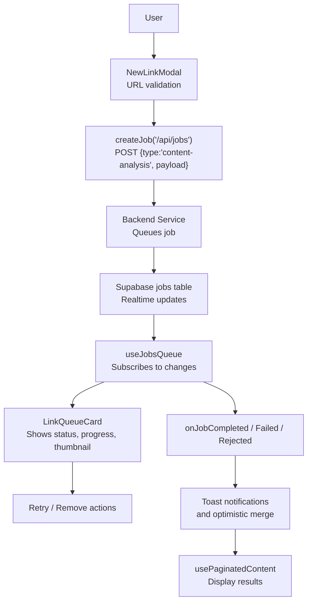
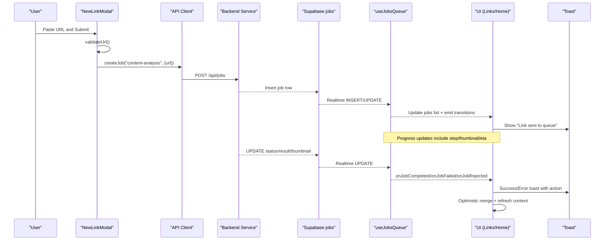
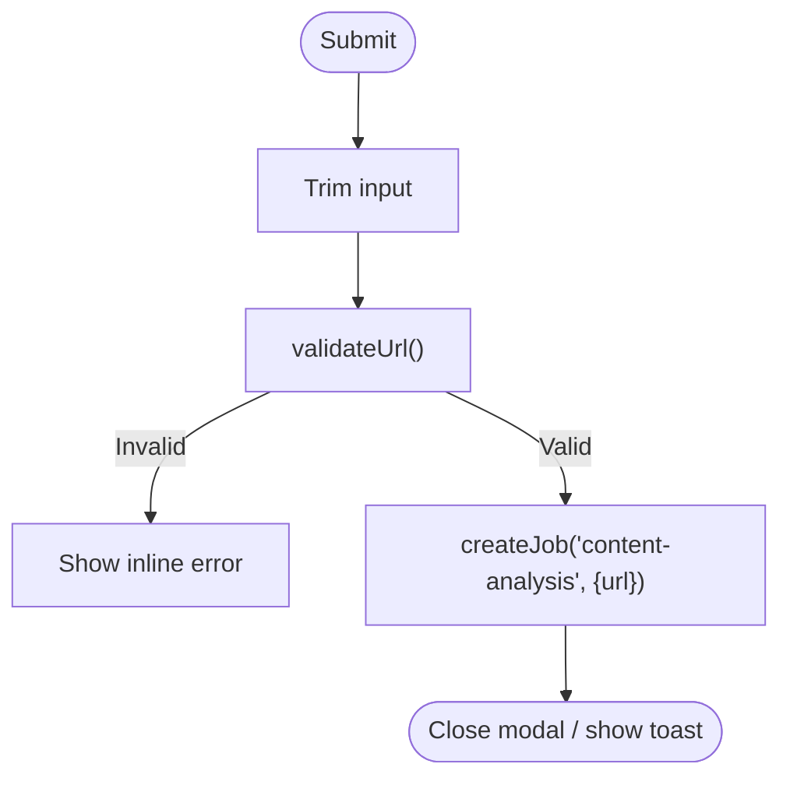
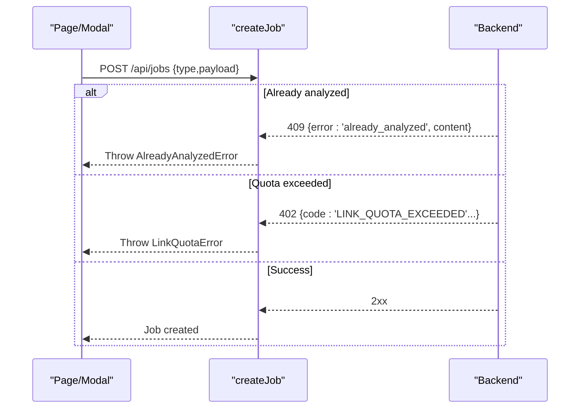
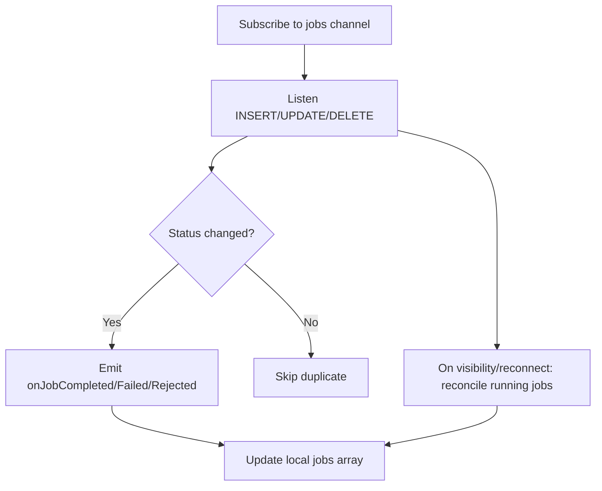
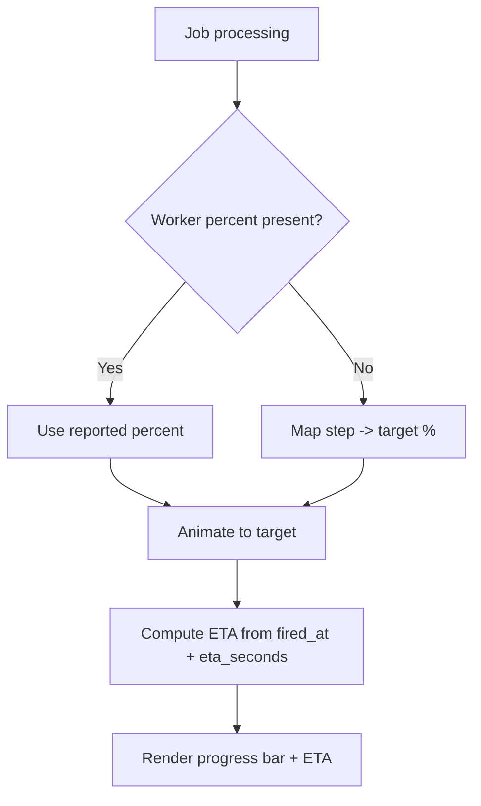
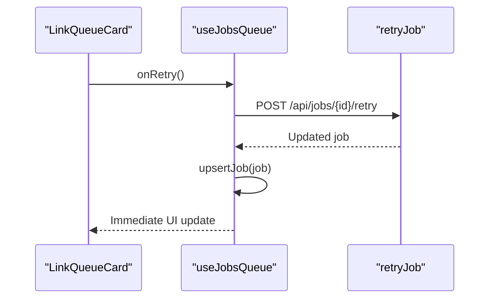
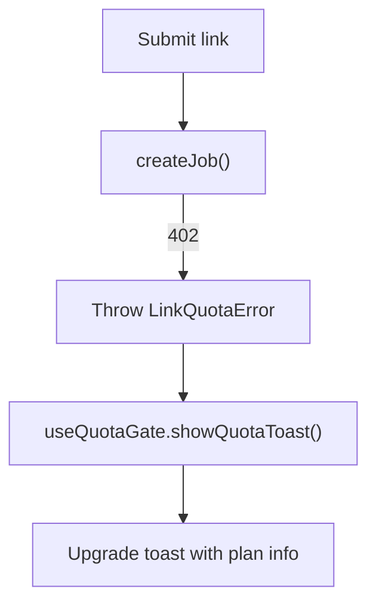
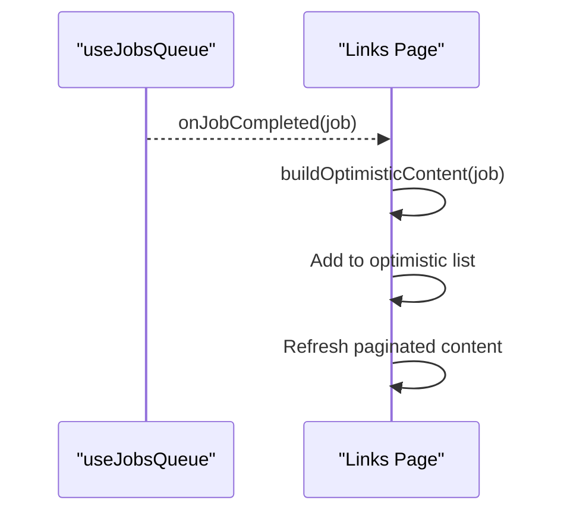
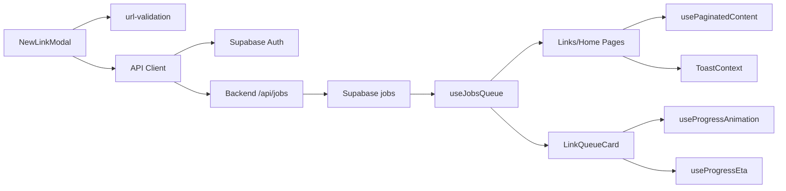

# Link Processing Pipeline

<cite>
**Referenced Files in This Document**
- [NewLinkModal.tsx](file://src/components/ui/modals/NewLinkModal.tsx)
- [client.ts](file://src/lib/api/client.ts)
- [useJobsQueue.ts](file://src/hooks/useJobsQueue.ts)
- [LinkQueueCard.tsx](file://src/components/ui/links/LinkQueueCard.tsx)
- [page.tsx (Links)](file://src/app/links/page.tsx)
- [page.tsx (Home)](file://src/app/home/page.tsx)
- [MainLayout.tsx](file://src/components/ui/layout/MainLayout.tsx)
- [url-validation.ts](file://src/lib/utils/url-validation.ts)
- [ToastContext.tsx](file://src/contexts/ToastContext.tsx)
- [useQuotaGate.ts](file://src/hooks/useQuotaGate.ts)
- [useProgressAnimation.ts](file://src/hooks/useProgressAnimation.ts)
- [useProgressEta.ts](file://src/hooks/useProgressEta.ts)
- [usePaginatedContent.ts](file://src/hooks/usePaginatedContent.ts)
</cite>

## Table of Contents
1. [Introduction](#introduction)
2. [Project Structure](#project-structure)
3. [Core Components](#core-components)
4. [Architecture Overview](#architecture-overview)
5. [Detailed Component Analysis](#detailed-component-analysis)
6. [Dependency Analysis](#dependency-analysis)
7. [Performance Considerations](#performance-considerations)
8. [Troubleshooting Guide](#troubleshooting-guide)
9. [Conclusion](#conclusion)

## Introduction
This document explains the end-to-end link processing pipeline: how users submit URLs, how jobs are queued and processed in the background, how progress and thumbnails are shown, and how errors and quotas are handled. It covers the modal interface for submission, validation rules, quota management, progress tracking, integration with external content analysis services via a backend API, retry mechanisms, and user feedback patterns. It also includes examples of successful and failed processing scenarios.

## Project Structure
The link processing flow spans UI components, hooks, and an API client that communicates with a backend service. The key pieces are:
- Submission UI: NewLinkModal validates and submits URLs.
- Job creation: createJob posts to /api/jobs to enqueue a content-analysis job.
- Queue monitoring: useJobsQueue subscribes to realtime updates on the jobs table and surfaces status transitions.
- Progress and visuals: LinkQueueCard renders queue state, progress, thumbnails, and retry actions; useProgressAnimation and useProgressEta compute visual progress and ETA.
- Results: Completed content is displayed via paginated queries and optimistic merging from completed jobs.
- Quotas and notifications: useQuotaGate centralizes quota messaging; ToastContext provides user feedback.

**Diagram sources**
- [NewLinkModal.tsx:56-81](file://src/components/ui/modals/NewLinkModal.tsx#L56-L81)
- [client.ts:109-145](file://src/lib/api/client.ts#L109-L145)
- [useJobsQueue.ts:167-260](file://src/hooks/useJobsQueue.ts#L167-L260)
- [LinkQueueCard.tsx:52-218](file://src/components/ui/links/LinkQueueCard.tsx#L52-L218)
- [page.tsx (Links):138-170](file://src/app/links/page.tsx#L138-L170)
- [usePaginatedContent.ts:6-21](file://src/hooks/usePaginatedContent.ts#L6-L21)

**Section sources**
- [NewLinkModal.tsx:1-136](file://src/components/ui/modals/NewLinkModal.tsx#L1-L136)
- [client.ts:1-156](file://src/lib/api/client.ts#L1-L156)
- [useJobsQueue.ts:1-296](file://src/hooks/useJobsQueue.ts#L1-L296)
- [LinkQueueCard.tsx:1-218](file://src/components/ui/links/LinkQueueCard.tsx#L1-L218)
- [page.tsx (Links):66-261](file://src/app/links/page.tsx#L66-L261)
- [page.tsx (Home):417-456](file://src/app/home/page.tsx#L417-L456)
- [MainLayout.tsx:93-129](file://src/components/ui/layout/MainLayout.tsx#L93-L129)
- [url-validation.ts:1-18](file://src/lib/utils/url-validation.ts#L1-L18)
- [ToastContext.tsx:1-155](file://src/contexts/ToastContext.tsx#L1-L155)
- [useQuotaGate.ts:1-41](file://src/hooks/useQuotaGate.ts#L1-L41)
- [useProgressAnimation.ts:1-41](file://src/hooks/useProgressAnimation.ts#L1-L41)
- [useProgressEta.ts:22-59](file://src/hooks/useProgressEta.ts#L22-L59)
- [usePaginatedContent.ts:1-43](file://src/hooks/usePaginatedContent.ts#L1-L43)

## Core Components
- URL submission modal: Validates input and triggers job creation.
- API client: Authenticates requests, creates jobs, handles typed errors (already analyzed, quota exceeded), and retries.
- Job queue hook: Subscribes to realtime job updates, reconciles missed events, and exposes callbacks for completion/failure/rejection.
- Queue card: Renders per-job state, progress, thumbnail, error messages, and retry controls.
- Progress utilities: Compute visual percentage and ETA based on worker-reported progress.
- Quota gate: Centralized upgrade messaging when monthly limits are reached.
- Notifications: Toast system for success, error, and action-driven flows.

**Section sources**
- [NewLinkModal.tsx:56-81](file://src/components/ui/modals/NewLinkModal.tsx#L56-L81)
- [client.ts:48-156](file://src/lib/api/client.ts#L48-L156)
- [useJobsQueue.ts:45-296](file://src/hooks/useJobsQueue.ts#L45-L296)
- [LinkQueueCard.tsx:52-218](file://src/components/ui/links/LinkQueueCard.tsx#L52-L218)
- [useProgressAnimation.ts:1-41](file://src/hooks/useProgressAnimation.ts#L1-L41)
- [useProgressEta.ts:22-59](file://src/hooks/useProgressEta.ts#L22-L59)
- [useQuotaGate.ts:16-40](file://src/hooks/useQuotaGate.ts#L16-L40)
- [ToastContext.tsx:14-155](file://src/contexts/ToastContext.tsx#L14-L155)

## Architecture Overview
The pipeline integrates frontend UI with a backend service through a job queue stored in Supabase. Realtime subscriptions keep the UI synchronized with job states. On completion, the UI merges results optimistically and refreshes paginated content.

**Diagram sources**
- [NewLinkModal.tsx:56-81](file://src/components/ui/modals/NewLinkModal.tsx#L56-L81)
- [client.ts:109-145](file://src/lib/api/client.ts#L109-L145)
- [useJobsQueue.ts:167-260](file://src/hooks/useJobsQueue.ts#L167-L260)
- [page.tsx (Links):138-170](file://src/app/links/page.tsx#L138-L170)
- [page.tsx (Home):417-456](file://src/app/home/page.tsx#L417-L456)
- [MainLayout.tsx:109-129](file://src/components/ui/layout/MainLayout.tsx#L109-L129)

## Detailed Component Analysis

### URL Submission Modal
- Validates URLs using a strict rule set requiring http/https and a valid hostname.
- Prevents submitting empty or malformed links and shows inline errors.
- On submit, calls createJob with type "content-analysis".
- Handles backend errors gracefully by converting machine codes into friendly messages.

**Diagram sources**
- [NewLinkModal.tsx:56-81](file://src/components/ui/modals/NewLinkModal.tsx#L56-L81)
- [url-validation.ts:1-18](file://src/lib/utils/url-validation.ts#L1-L18)

**Section sources**
- [NewLinkModal.tsx:56-81](file://src/components/ui/modals/NewLinkModal.tsx#L56-L81)
- [url-validation.ts:1-18](file://src/lib/utils/url-validation.ts#L1-L18)

### Job Creation and Error Handling
- Creates authenticated requests to /api/jobs with type and payload.
- Special-cases:
  - 409 already_analyzed: throws a typed error carrying existing content metadata for immediate navigation.
  - 402 quota_exceeded: throws a typed error with plan details to trigger upgrade prompts.
- Provides retry and detach helpers for operational control.

**Diagram sources**
- [client.ts:109-145](file://src/lib/api/client.ts#L109-L145)

**Section sources**
- [client.ts:48-156](file://src/lib/api/client.ts#L48-L156)

### Job Queue and Realtime Updates
- Subscribes to postgres_changes on the jobs table filtered by user_id.
- Maintains a local list of visible jobs (queued/pending/processing and recent failures).
- Emits transition callbacks only once per status change using a ref map.
- Reconciles missed updates on visibility change or reconnect to avoid stuck states.
- Supports optimistic upsert for immediate UI feedback after retry.

**Diagram sources**
- [useJobsQueue.ts:78-267](file://src/hooks/useJobsQueue.ts#L78-L267)

**Section sources**
- [useJobsQueue.ts:45-296](file://src/hooks/useJobsQueue.ts#L45-L296)

### Progress Tracking and Thumbnails
- Visual progress:
  - Uses worker-reported percent when available; otherwise maps step numbers to target percentages.
  - Smoothly animates between targets to avoid jarring jumps.
- ETA countdown:
  - Counts down locally between worker updates using fired_at and eta_seconds.
  - Avoids showing misleading zero-time near completion; hides label when nearly done.
- Thumbnails:
  - Displayed from job.progress.thumbnail during processing and from result.thumbnail upon completion.
  - Used in both queue cards and completion toasts for context-rich feedback.

**Diagram sources**
- [useProgressAnimation.ts:1-41](file://src/hooks/useProgressAnimation.ts#L1-L41)
- [useProgressEta.ts:22-59](file://src/hooks/useProgressEta.ts#L22-L59)

**Section sources**
- [useProgressAnimation.ts:1-41](file://src/hooks/useProgressAnimation.ts#L1-L41)
- [useProgressEta.ts:22-59](file://src/hooks/useProgressEta.ts#L22-L59)
- [page.tsx (Links):66-118](file://src/app/links/page.tsx#L66-L118)

### Retry Mechanisms and User Actions
- Retry:
  - Available when a job fails; calls retry endpoint to re-enqueue.
  - Optimistically inserts the retried job into the queue for immediate feedback.
- Remove:
  - Allows users to clear stale or unwanted items from the queue view.
- Detach:
  - Provided by API client for detaching jobs if needed by backend workflows.

**Diagram sources**
- [LinkQueueCard.tsx:175-197](file://src/components/ui/links/LinkQueueCard.tsx#L175-L197)
- [useJobsQueue.ts:274-292](file://src/hooks/useJobsQueue.ts#L274-L292)
- [client.ts:147-150](file://src/lib/api/client.ts#L147-L150)

**Section sources**
- [LinkQueueCard.tsx:175-197](file://src/components/ui/links/LinkQueueCard.tsx#L175-L197)
- [useJobsQueue.ts:274-292](file://src/hooks/useJobsQueue.ts#L274-L292)
- [client.ts:147-150](file://src/lib/api/client.ts#L147-L150)

### Quota Management
- When the backend returns a quota error, the client throws a typed LinkQuotaError.
- Pages catch this and call useQuotaGate to show a consistent upgrade prompt with plan details and billing link.
- Usage data is refreshed to reflect updated counts.

**Diagram sources**
- [client.ts:130-145](file://src/lib/api/client.ts#L130-L145)
- [useQuotaGate.ts:16-40](file://src/hooks/useQuotaGate.ts#L16-L40)
- [page.tsx (Links):222-261](file://src/app/links/page.tsx#L222-L261)
- [page.tsx (Home):417-456](file://src/app/home/page.tsx#L417-L456)

**Section sources**
- [client.ts:130-145](file://src/lib/api/client.ts#L130-L145)
- [useQuotaGate.ts:16-40](file://src/hooks/useQuotaGate.ts#L16-L40)
- [page.tsx (Links):222-261](file://src/app/links/page.tsx#L222-L261)
- [page.tsx (Home):417-456](file://src/app/home/page.tsx#L417-L456)

### Result Management and Optimistic Merge
- Upon job completion, pages build an optimistic content object from the job’s result and content_id.
- This allows the queue slot to morph into a finished link card without flicker while the content table catches up.
- Paginated content is refreshed to ensure consistency.

**Diagram sources**
- [page.tsx (Links):138-170](file://src/app/links/page.tsx#L138-L170)
- [page.tsx (Links):93-118](file://src/app/links/page.tsx#L93-L118)

**Section sources**
- [page.tsx (Links):93-118](file://src/app/links/page.tsx#L93-L118)
- [page.tsx (Links):138-170](file://src/app/links/page.tsx#L138-L170)
- [usePaginatedContent.ts:6-21](file://src/hooks/usePaginatedContent.ts#L6-L21)

### User Feedback Patterns
- Toasts provide concise, actionable feedback:
  - Success: “Link finished analyzing” with optional thumbnail and “View” action.
  - Error: “Couldn't analyze this link.”
  - Rejected: “No travel locations found in this link.”
  - Quota: Centralized upgrade message with plan details and billing link.
- Inline validation errors in the modal prevent invalid submissions.

**Section sources**
- [page.tsx (Links):138-170](file://src/app/links/page.tsx#L138-L170)
- [ToastContext.tsx:14-155](file://src/contexts/ToastContext.tsx#L14-L155)
- [useQuotaGate.ts:16-40](file://src/hooks/useQuotaGate.ts#L16-L40)
- [NewLinkModal.tsx:56-81](file://src/components/ui/modals/NewLinkModal.tsx#L56-L81)

## Dependency Analysis
Key dependencies and their roles:
- NewLinkModal depends on url-validation and API client for submission.
- API client depends on Supabase auth to attach tokens and defines typed errors.
- useJobsQueue depends on Supabase realtime to track job lifecycle.
- Links/Home pages depend on useJobsQueue, usePaginatedContent, and ToastContext.
- LinkQueueCard depends on progress hooks for visual fidelity.

**Diagram sources**
- [NewLinkModal.tsx:56-81](file://src/components/ui/modals/NewLinkModal.tsx#L56-L81)
- [client.ts:48-156](file://src/lib/api/client.ts#L48-L156)
- [useJobsQueue.ts:167-260](file://src/hooks/useJobsQueue.ts#L167-L260)
- [page.tsx (Links):138-170](file://src/app/links/page.tsx#L138-L170)
- [usePaginatedContent.ts:1-43](file://src/hooks/usePaginatedContent.ts#L1-L43)
- [ToastContext.tsx:14-155](file://src/contexts/ToastContext.tsx#L14-L155)
- [LinkQueueCard.tsx:52-218](file://src/components/ui/links/LinkQueueCard.tsx#L52-L218)
- [useProgressAnimation.ts:1-41](file://src/hooks/useProgressAnimation.ts#L1-L41)
- [useProgressEta.ts:22-59](file://src/hooks/useProgressEta.ts#L22-L59)

**Section sources**
- [client.ts:48-156](file://src/lib/api/client.ts#L48-L156)
- [useJobsQueue.ts:78-267](file://src/hooks/useJobsQueue.ts#L78-L267)
- [page.tsx (Links):138-170](file://src/app/links/page.tsx#L138-L170)
- [usePaginatedContent.ts:1-43](file://src/hooks/usePaginatedContent.ts#L1-L43)
- [ToastContext.tsx:14-155](file://src/contexts/ToastContext.tsx#L14-L155)
- [LinkQueueCard.tsx:52-218](file://src/components/ui/links/LinkQueueCard.tsx#L52-L218)
- [useProgressAnimation.ts:1-41](file://src/hooks/useProgressAnimation.ts#L1-L41)
- [useProgressEta.ts:22-59](file://src/hooks/useProgressEta.ts#L22-L59)

## Performance Considerations
- Realtime efficiency:
  - useJobsQueue filters updates by user_id and job type to minimize noise.
  - Reconciliation prevents stuck states after disconnects or backgrounding.
- UI responsiveness:
  - Optimistic merging avoids layout shifts when transitioning from queue to results.
  - Progress animation smooths perceived latency and reduces jarring updates.
- Network overhead:
  - ETA countdown runs locally between server updates to avoid excessive writes.
  - Paginated content loads incrementally to reduce initial payload size.

[No sources needed since this section provides general guidance]

## Troubleshooting Guide
Common issues and resolutions:
- Invalid URL:
  - Ensure http/https protocol and a valid hostname; modal will show inline errors.
- Already analyzed:
  - Backend returns 409 with existing content; UI shows a toast with a “View” action to navigate directly.
- Quota exceeded:
  - Backend returns 402; UI shows a centralized upgrade toast with plan details and billing link.
- Stuck processing:
  - If a job remains in processing after reconnect or tab focus, reconciliation resets state by re-fetching tracked jobs.
- No travel locations:
  - Worker may reject jobs with no relevant content; UI displays a specific error toast.

**Section sources**
- [url-validation.ts:1-18](file://src/lib/utils/url-validation.ts#L1-L18)
- [client.ts:118-145](file://src/lib/api/client.ts#L118-L145)
- [useJobsQueue.ts:105-136](file://src/hooks/useJobsQueue.ts#L105-L136)
- [page.tsx (Links):138-170](file://src/app/links/page.tsx#L138-L170)

## Conclusion
The link processing pipeline combines robust client-side validation, typed error handling, real-time job tracking, and thoughtful UX patterns to deliver a responsive and reliable experience. Quota enforcement is centralized and user-friendly, while progress and thumbnails keep users informed throughout processing. Retry and removal actions empower users to manage their queues effectively, and optimistic merging ensures seamless transitions to results.