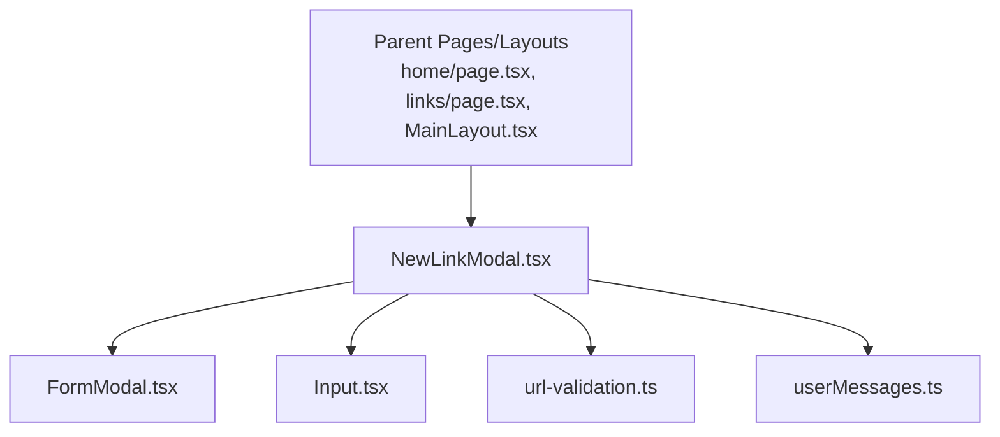
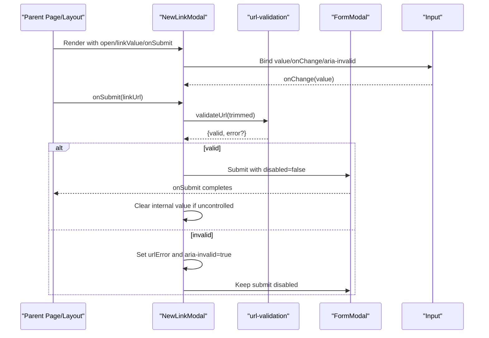
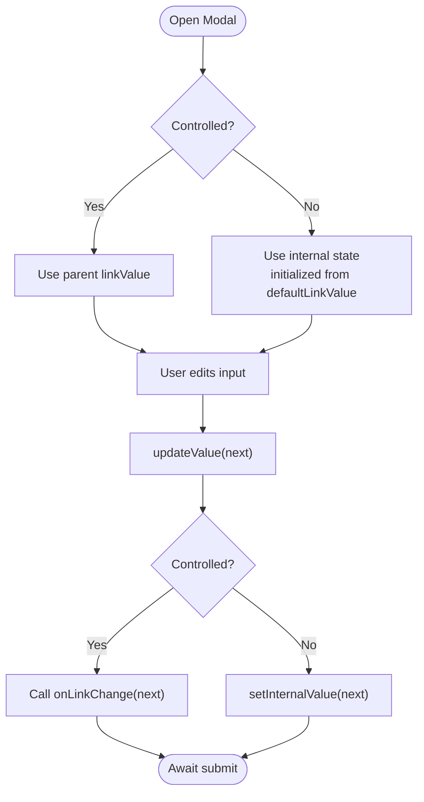
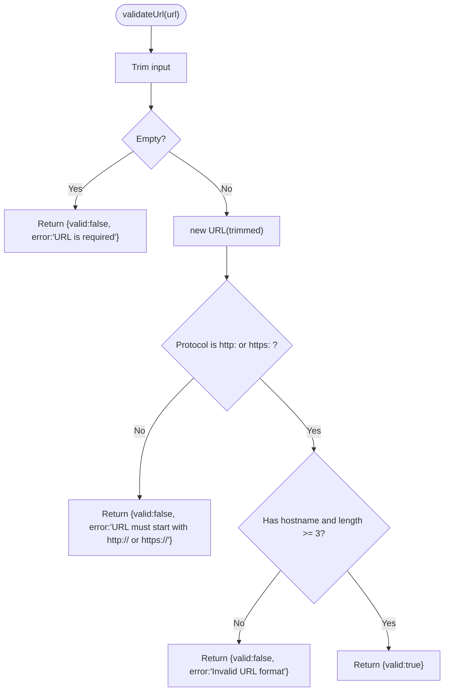
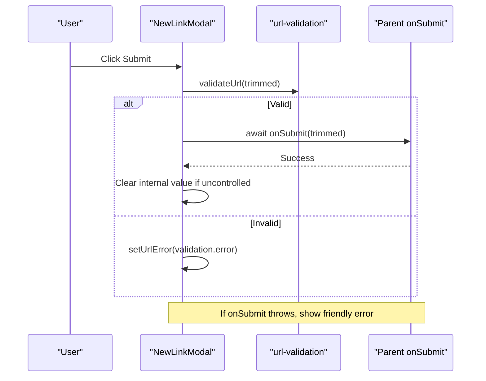
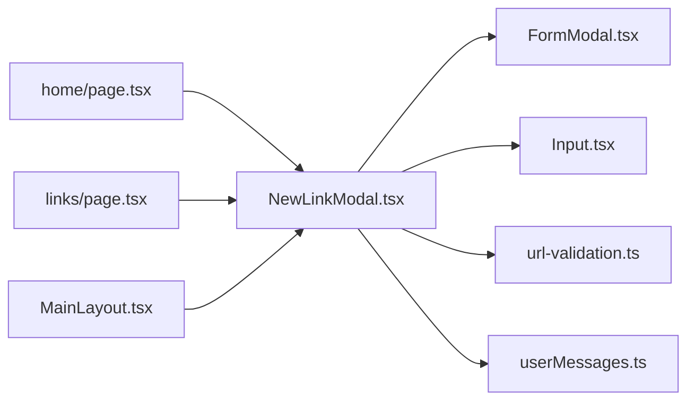

# URL Submission Interface

<cite>
**Referenced Files in This Document**
- [NewLinkModal.tsx](file://src/components/ui/modals/NewLinkModal.tsx)
- [FormModal.tsx](file://src/components/ui/modals/FormModal.tsx)
- [Input.tsx](file://src/components/ui/primitives/Input.tsx)
- [url-validation.ts](file://src/lib/utils/url-validation.ts)
- [userMessages.ts](file://src/lib/errors/userMessages.ts)
- [home/page.tsx](file://src/app/home/page.tsx)
- [links/page.tsx](file://src/app/links/page.tsx)
- [MainLayout.tsx](file://src/components/ui/layout/MainLayout.tsx)
</cite>

## Table of Contents
1. Introduction
2. Project Structure
3. Core Components
4. Architecture Overview
5. Detailed Component Analysis
6. Dependency Analysis
7. Performance Considerations
8. Troubleshooting Guide
9. Conclusion

## Introduction
This document explains the URL submission interface centered on the NewLinkModal component. It covers how user input is captured and validated, how form state is managed (controlled vs uncontrolled), validation rules for URLs, error handling strategies, accessibility features, and user feedback during submission. It also includes examples of proper URL formats, typical validation error messages, and integration patterns with parent components that open and manage the modal.

## Project Structure
The URL submission flow spans a small set of focused components and utilities:
- NewLinkModal orchestrates the form UI, validation, and submission lifecycle.
- FormModal provides the dialog shell, header, content slot, and submit/cancel buttons.
- Input renders the text field with icon support and accessibility attributes.
- url-validation enforces URL format constraints before submission.
- userMessages maps backend errors to friendly user-facing messages.
- Parent pages/layouts render NewLinkModal and manage open state and submission handlers.

**Diagram sources**
- [NewLinkModal.tsx:1-136](file://src/components/ui/modals/NewLinkModal.tsx#L1-L136)
- [FormModal.tsx:1-224](file://src/components/ui/modals/FormModal.tsx#L1-L224)
- [Input.tsx:1-513](file://src/components/ui/primitives/Input.tsx#L1-L513)
- [url-validation.ts:1-18](file://src/lib/utils/url-validation.ts#L1-L18)
- [userMessages.ts:1-107](file://src/lib/errors/userMessages.ts#L1-L107)
- [home/page.tsx:970-1004](file://src/app/home/page.tsx#L970-L1004)
- [links/page.tsx:419-430](file://src/app/links/page.tsx#L419-L430)
- [MainLayout.tsx:346-397](file://src/components/ui/layout/MainLayout.tsx#L346-L397)

**Section sources**
- [NewLinkModal.tsx:1-136](file://src/components/ui/modals/NewLinkModal.tsx#L1-L136)
- [FormModal.tsx:1-224](file://src/components/ui/modals/FormModal.tsx#L1-L224)
- [Input.tsx:1-513](file://src/components/ui/primitives/Input.tsx#L1-L513)
- [url-validation.ts:1-18](file://src/lib/utils/url-validation.ts#L1-L18)
- [userMessages.ts:1-107](file://src/lib/errors/userMessages.ts#L1-L107)
- [home/page.tsx:970-1004](file://src/app/home/page.tsx#L970-L1004)
- [links/page.tsx:419-430](file://src/app/links/page.tsx#L419-L430)
- [MainLayout.tsx:346-397](file://src/components/ui/layout/MainLayout.tsx#L346-L397)

## Core Components
- NewLinkModal: Encapsulates URL input, validation, submission, and error display. Supports both controlled and uncontrolled value patterns and exposes callbacks for change and submit.
- FormModal: Dialog wrapper providing consistent layout, header, description, submit/cancel buttons, loading state, and mobile sheet behavior.
- Input: Accessible text input with leading/trailing icons, clear button, and aria-invalid support.
- url-validation: Validates trimmed input as an http/https URL with a hostname length check.
- userMessages: Converts backend errors into safe, user-friendly messages while preventing technical details from leaking into the UI.

Key responsibilities:
- Validation occurs before submission; invalid states are surfaced inline under the input.
- Submission sets a submitting state, disables controls, and handles success or error paths.
- Accessibility attributes ensure screen readers can announce errors and validity.

**Section sources**
- [NewLinkModal.tsx:12-136](file://src/components/ui/modals/NewLinkModal.tsx#L12-L136)
- [FormModal.tsx:50-224](file://src/components/ui/modals/FormModal.tsx#L50-L224)
- [Input.tsx:93-276](file://src/components/ui/primitives/Input.tsx#L93-L276)
- [url-validation.ts:1-18](file://src/lib/utils/url-validation.ts#L1-L18)
- [userMessages.ts:94-107](file://src/lib/errors/userMessages.ts#L94-L107)

## Architecture Overview
The URL submission flow integrates several layers:
- Parent components control modal visibility and optionally own the link value (controlled mode).
- NewLinkModal manages local submission state and validates input using url-validation.
- On submit, it calls the parent-provided onSubmit callback after validation passes.
- Errors are normalized via userMessages to present friendly feedback.

**Diagram sources**
- [NewLinkModal.tsx:51-86](file://src/components/ui/modals/NewLinkModal.tsx#L51-L86)
- [url-validation.ts:1-18](file://src/lib/utils/url-validation.ts#L1-L18)
- [FormModal.tsx:124-212](file://src/components/ui/modals/FormModal.tsx#L124-L212)
- [Input.tsx:148-168](file://src/components/ui/primitives/Input.tsx#L148-L168)

## Detailed Component Analysis

### NewLinkModal: Controlled vs Uncontrolled Inputs
- Controlled pattern: Parent supplies linkValue and onLinkChange. The modal reflects the parent’s state exactly.
- Uncontrolled pattern: Modal uses defaultLinkValue and maintains internal state; resets when closed to avoid stale values.
- Change propagation: updateValue writes to either parent or internal state and always invokes onLinkChange if provided.
- Reset behavior: When the modal closes, uncontrolled mode clears its internal value and error to present a fresh form next time.

**Diagram sources**
- [NewLinkModal.tsx:24-54](file://src/components/ui/modals/NewLinkModal.tsx#L24-L54)
- [NewLinkModal.tsx:39-49](file://src/components/ui/modals/NewLinkModal.tsx#L39-L49)

**Section sources**
- [NewLinkModal.tsx:24-54](file://src/components/ui/modals/NewLinkModal.tsx#L24-L54)
- [NewLinkModal.tsx:39-49](file://src/components/ui/modals/NewLinkModal.tsx#L39-L49)

### URL Validation Rules
- Empty input is rejected with a required message.
- Only http:// and https:// protocols are accepted.
- Hostname must be present and at least three characters long.
- Any parsing exception results in an invalid format message.

Examples of valid inputs:
- https://example.com
- http://sub.domain.org/path?query=1

Examples of invalid inputs and messages:
- "" → "URL is required"
- "ftp://files.example.com" → "URL must start with http:// or https://"
- "not-a-url" → "Invalid URL format"
- "http://a" → "Invalid URL format"

**Diagram sources**
- [url-validation.ts:1-18](file://src/lib/utils/url-validation.ts#L1-L18)

**Section sources**
- [url-validation.ts:1-18](file://src/lib/utils/url-validation.ts#L1-L18)

### Error Handling Strategy
- Client-side validation errors are shown directly under the input via aria-invalid and a descriptive paragraph.
- Server-side errors are normalized through getFriendlyApiError to prevent exposing technical codes to users.
- Submitting state disables the input and submit button to prevent duplicate submissions.

**Diagram sources**
- [NewLinkModal.tsx:56-81](file://src/components/ui/modals/NewLinkModal.tsx#L56-L81)
- [userMessages.ts:94-107](file://src/lib/errors/userMessages.ts#L94-L107)

**Section sources**
- [NewLinkModal.tsx:56-81](file://src/components/ui/modals/NewLinkModal.tsx#L56-L81)
- [userMessages.ts:94-107](file://src/lib/errors/userMessages.ts#L94-L107)

### Form State Management
- Local states:
  - isSubmitting: prevents re-submission and disables controls.
  - urlError: holds the latest validation or API error message.
  - internalValue: used only in uncontrolled mode; cleared on close and after successful submit.
- Parent-managed state (controlled):
  - linkValue and onLinkChange keep the parent as the source of truth.
- Reset on close:
  - Ensures reopening the modal presents a clean form in uncontrolled mode.

**Section sources**
- [NewLinkModal.tsx:35-49](file://src/components/ui/modals/NewLinkModal.tsx#L35-L49)
- [NewLinkModal.tsx:51-86](file://src/components/ui/modals/NewLinkModal.tsx#L51-L86)

### Accessibility Features
- aria-invalid toggles based on presence of urlError to signal invalidity to assistive technologies.
- aria-describedby links the input to the error message element for screen reader announcements.
- Input supports keyboard navigation and focus management via Base UI primitives.
- FormModal provides accessible dialog semantics, title/description, and trap focus within the modal context.

**Section sources**
- [NewLinkModal.tsx:107-126](file://src/components/ui/modals/NewLinkModal.tsx#L107-L126)
- [Input.tsx:241-273](file://src/components/ui/primitives/Input.tsx#L241-L273)
- [FormModal.tsx:100-168](file://src/components/ui/modals/FormModal.tsx#L100-L168)

### User Feedback Mechanisms
- Inline validation errors appear immediately below the input.
- Submit button shows a spinner and custom label while submitting.
- Disabled states prevent interaction during submission.
- Friendly API errors replace raw backend messages to maintain clarity and trust.

**Section sources**
- [NewLinkModal.tsx:88-128](file://src/components/ui/modals/NewLinkModal.tsx#L88-L128)
- [FormModal.tsx:170-212](file://src/components/ui/modals/FormModal.tsx#L170-L212)
- [userMessages.ts:94-107](file://src/lib/errors/userMessages.ts#L94-L107)

### Integration Patterns with Parent Components
- Controlled usage:
  - Parent owns linkValue and onLinkChange, enabling centralized state and validation elsewhere if needed.
- Uncontrolled usage:
  - Parent can omit linkValue/onLinkChange and rely on defaultLinkValue; modal clears itself on close.
- Open/close:
  - Parent controls open and onOpenChange to coordinate modal lifecycle across the app.
- Submission:
  - Parent implements onSubmit to perform side effects (e.g., enqueueing the link) and handle success/error.

Example integrations:
- Home page renders NewLinkModal with controlled linkValue and dedicated submit handler.
- Links page mirrors the same controlled pattern.
- MainLayout renders NewLinkModal without controlled value for quick global access.

**Section sources**
- [home/page.tsx:970-1004](file://src/app/home/page.tsx#L970-L1004)
- [links/page.tsx:419-430](file://src/app/links/page.tsx#L419-L430)
- [MainLayout.tsx:346-397](file://src/components/ui/layout/MainLayout.tsx#L346-L397)

## Dependency Analysis
NewLinkModal composes multiple building blocks and utilities:
- Depends on FormModal for dialog structure and actions.
- Uses Input for accessible, styled text entry.
- Calls url-validation to enforce URL constraints.
- Uses userMessages to normalize backend errors.

**Diagram sources**
- [NewLinkModal.tsx:1-136](file://src/components/ui/modals/NewLinkModal.tsx#L1-L136)
- [FormModal.tsx:1-224](file://src/components/ui/modals/FormModal.tsx#L1-L224)
- [Input.tsx:1-513](file://src/components/ui/primitives/Input.tsx#L1-L513)
- [url-validation.ts:1-18](file://src/lib/utils/url-validation.ts#L1-L18)
- [userMessages.ts:1-107](file://src/lib/errors/userMessages.ts#L1-L107)
- [home/page.tsx:970-1004](file://src/app/home/page.tsx#L970-L1004)
- [links/page.tsx:419-430](file://src/app/links/page.tsx#L419-L430)
- [MainLayout.tsx:346-397](file://src/components/ui/layout/MainLayout.tsx#L346-L397)

**Section sources**
- [NewLinkModal.tsx:1-136](file://src/components/ui/modals/NewLinkModal.tsx#L1-L136)
- [FormModal.tsx:1-224](file://src/components/ui/modals/FormModal.tsx#L1-L224)
- [Input.tsx:1-513](file://src/components/ui/primitives/Input.tsx#L1-L513)
- [url-validation.ts:1-18](file://src/lib/utils/url-validation.ts#L1-L18)
- [userMessages.ts:1-107](file://src/lib/errors/userMessages.ts#L1-L107)
- [home/page.tsx:970-1004](file://src/app/home/page.tsx#L970-L1004)
- [links/page.tsx:419-430](file://src/app/links/page.tsx#L419-L430)
- [MainLayout.tsx:346-397](file://src/components/ui/layout/MainLayout.tsx#L346-L397)

## Performance Considerations
- Validation runs synchronously on submit; it is lightweight and avoids unnecessary re-renders by clearing errors on change.
- Submitting state disables inputs and buttons to prevent redundant network requests.
- Controlled vs uncontrolled choice affects where state lives; prefer controlled when multiple consumers need the value (e.g., analytics, external validation).
- Avoid heavy computations in onChange; keep it simple to maintain responsiveness.

[No sources needed since this section provides general guidance]

## Troubleshooting Guide
Common issues and resolutions:
- “URL is required”: Ensure the input is not empty or whitespace-only before submission.
- “URL must start with http:// or https://”: Require protocol in user input or normalize automatically.
- “Invalid URL format”: Validate hostname presence and minimum length; consider pre-normalizing common short forms.
- Backend errors surface as friendly messages: Rely on getFriendlyApiError to avoid showing technical codes; log full errors for debugging.

Operational tips:
- Always pass aria-invalid and aria-describedby to associate errors with inputs.
- Disable submit during submission to prevent race conditions.
- In controlled mode, ensure parent state updates promptly to reflect user edits.

**Section sources**
- [url-validation.ts:1-18](file://src/lib/utils/url-validation.ts#L1-L18)
- [NewLinkModal.tsx:56-86](file://src/components/ui/modals/NewLinkModal.tsx#L56-L86)
- [userMessages.ts:94-107](file://src/lib/errors/userMessages.ts#L94-L107)

## Conclusion
The URL submission interface is built around a clear separation of concerns: NewLinkModal coordinates user input, validation, and submission; FormModal provides a consistent dialog experience; Input ensures accessible and ergonomic text entry; url-validation enforces strict URL rules; and userMessages guarantees friendly error messaging. By supporting both controlled and uncontrolled patterns, the component adapts to various parent architectures while maintaining robust validation, accessibility, and user feedback.

[No sources needed since this section summarizes without analyzing specific files]