# Map Visualization

<cite>
**Referenced Files in This Document**
- [GoogleMapCluster.tsx](file://src/components/ui/map/GoogleMapCluster.tsx)
- [StaticMap.tsx](file://src/components/ui/map/StaticMap.tsx)
- [MapContainer.tsx](file://src/components/ui/map/MapContainer.tsx)
- [GoogleMapDetail.tsx](file://src/components/ui/map/GoogleMapDetail.tsx)
- [MapClusterMarker.tsx](file://src/components/ui/map/MapClusterMarker.tsx)
- [MapMarkerHover.tsx](file://src/components/ui/map/MapMarkerHover.tsx)
- [MapNameBubble.tsx](file://src/components/ui/map/MapNameBubble.tsx)
- [ItineraryMapSection.tsx](file://src/components/ui/itinerary/ItineraryMapSection.tsx)
- [useMapClusters.ts](file://src/hooks/useMapClusters.ts)
- [locality-pins.ts](file://src/lib/maps/locality-pins.ts)
- [cluster.ts](file://src/lib/planner/cluster.ts)
- [google-maps-url.ts](file://src/lib/maps/google-maps-url.ts)
- [useMediaQuery.ts](file://src/hooks/useMediaQuery.ts)
</cite>

## Table of Contents
1. [Introduction](#introduction)
2. [Project Structure](#project-structure)
3. [Core Components](#core-components)
4. [Architecture Overview](#architecture-overview)
5. [Detailed Component Analysis](#detailed-component-analysis)
6. [Dependency Analysis](#dependency-analysis)
7. [Performance Considerations](#performance-considerations)
8. [Troubleshooting Guide](#troubleshooting-guide)
9. [Conclusion](#conclusion)
10. [Appendices](#appendices)

## Introduction
This document explains the map visualization system that renders locations on interactive maps, supports clustering for performance, custom markers and hover interactions, static map generation for sharing, Google Maps API integration, location filtering via clusters, cluster click handling, responsive design considerations, mapping hooks, data transformation pipelines, and optimizations for large datasets. It also includes examples of different map views and interaction patterns used across the application.

## Project Structure
The map system is composed of:
- A reusable detail map component for itineraries and detailed location views with rich hover cards and search.
- A static map wrapper for dashboards and home pages that shows grouped clusters.
- Hooks to fetch and transform clustered data from Supabase into display-ready pins.
- Utilities for geographic clustering (k-means) used by the planner to group nearby places.
- Responsive utilities and layout components to adapt maps to different screen sizes.

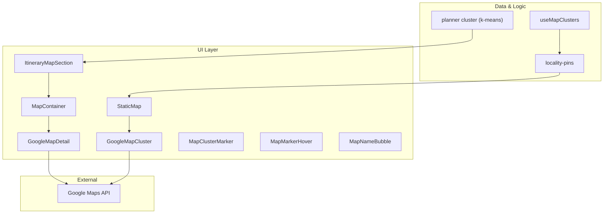

**Diagram sources**
- [ItineraryMapSection.tsx:21-52](file://src/components/ui/itinerary/ItineraryMapSection.tsx#L21-L52)
- [MapContainer.tsx:45-92](file://src/components/ui/map/MapContainer.tsx#L45-L92)
- [GoogleMapDetail.tsx:289-463](file://src/components/ui/map/GoogleMapDetail.tsx#L289-L463)
- [StaticMap.tsx:39-96](file://src/components/ui/map/StaticMap.tsx#L39-L96)
- [GoogleMapCluster.tsx:80-136](file://src/components/ui/map/GoogleMapCluster.tsx#L80-L136)
- [useMapClusters.ts:35-60](file://src/hooks/useMapClusters.ts#L35-L60)
- [locality-pins.ts:28-77](file://src/lib/maps/locality-pins.ts#L28-L77)
- [cluster.ts:84-165](file://src/lib/planner/cluster.ts#L84-L165)

**Section sources**
- [ItineraryMapSection.tsx:21-52](file://src/components/ui/itinerary/ItineraryMapSection.tsx#L21-L52)
- [MapContainer.tsx:45-92](file://src/components/ui/map/MapContainer.tsx#L45-L92)
- [GoogleMapDetail.tsx:289-463](file://src/components/ui/map/GoogleMapDetail.tsx#L289-L463)
- [StaticMap.tsx:39-96](file://src/components/ui/map/StaticMap.tsx#L39-L96)
- [GoogleMapCluster.tsx:80-136](file://src/components/ui/map/GoogleMapCluster.tsx#L80-L136)
- [useMapClusters.ts:35-60](file://src/hooks/useMapClusters.ts#L35-L60)
- [locality-pins.ts:28-77](file://src/lib/maps/locality-pins.ts#L28-L77)
- [cluster.ts:84-165](file://src/lib/planner/cluster.ts#L84-L165)

## Core Components
- ItineraryMapSection: Renders the itinerary’s map card with a dynamic MapContainer and responsive height.
- MapContainer: Lazy-loads GoogleMapDetail, handles intersection-based rendering, and tracks map load events.
- GoogleMapDetail: Full-featured interactive map with AdvancedMarker pins, route polylines, place search, and hover details.
- StaticMap: Lightweight wrapper around GoogleMapCluster for dashboard/home static maps with lazy loading and hover state.
- GoogleMapCluster: Renders clusters as AdvancedMarkers with custom MapClusterMarker and optional zoom controls.
- MapClusterMarker and MapMarkerHover: Custom marker visuals and hover labels/badges.
- MapNameBubble: Lightweight name-only hover bubble for minimal interactivity.
- useMapClusters: Fetches raw locations and transforms them into locality-based clusters for static maps.
- locality-pins: Groups entities by region/country label and computes mean coordinates per group.
- planner cluster (k-means): Groups nearby places geographically for planning workflows.

**Section sources**
- [ItineraryMapSection.tsx:21-52](file://src/components/ui/itinerary/ItineraryMapSection.tsx#L21-L52)
- [MapContainer.tsx:45-92](file://src/components/ui/map/MapContainer.tsx#L45-L92)
- [GoogleMapDetail.tsx:289-463](file://src/components/ui/map/GoogleMapDetail.tsx#L289-L463)
- [StaticMap.tsx:39-96](file://src/components/ui/map/StaticMap.tsx#L39-L96)
- [GoogleMapCluster.tsx:80-136](file://src/components/ui/map/GoogleMapCluster.tsx#L80-L136)
- [MapClusterMarker.tsx:51-108](file://src/components/ui/map/MapClusterMarker.tsx#L51-L108)
- [MapMarkerHover.tsx:42-72](file://src/components/ui/map/MapMarkerHover.tsx#L42-L72)
- [MapNameBubble.tsx:15-23](file://src/components/ui/map/MapNameBubble.tsx#L15-L23)
- [useMapClusters.ts:35-60](file://src/hooks/useMapClusters.ts#L35-L60)
- [locality-pins.ts:28-77](file://src/lib/maps/locality-pins.ts#L28-L77)
- [cluster.ts:84-165](file://src/lib/planner/cluster.ts#L84-L165)

## Architecture Overview
The system provides two primary map experiences:
- Interactive itinerary map: Uses GoogleMapDetail with AdvancedMarker pins, polyline routes, place search, and rich hover cards.
- Static dashboard/home map: Uses StaticMap which wraps GoogleMapCluster to show grouped locality pins with compact or detail hover modes.

Both share Google Maps API integration through @vis.gl/react-google-maps’ APIProvider and Map components. Data flows from Supabase queries through useMapClusters into locality grouping, then into UI components. Planner k-means clustering groups nearby places for itinerary planning.

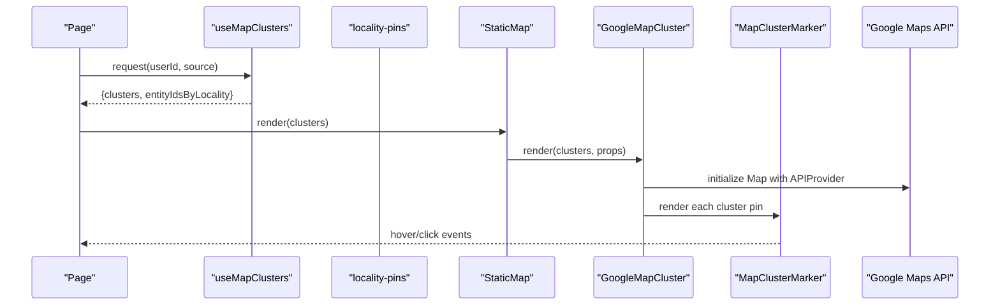

**Diagram sources**
- [useMapClusters.ts:35-60](file://src/hooks/useMapClusters.ts#L35-L60)
- [locality-pins.ts:28-77](file://src/lib/maps/locality-pins.ts#L28-L77)
- [StaticMap.tsx:39-96](file://src/components/ui/map/StaticMap.tsx#L39-L96)
- [GoogleMapCluster.tsx:80-136](file://src/components/ui/map/GoogleMapCluster.tsx#L80-L136)
- [MapClusterMarker.tsx:51-108](file://src/components/ui/map/MapClusterMarker.tsx#L51-L108)

## Detailed Component Analysis

### Interactive Itinerary Map (GoogleMapDetail)
- Renders AdvancedMarker pins for each location with day-colored numbered stop pins when dayIndex is set.
- Computes initial center and zoom based on locations; fits bounds once and animates subsequent single-location changes.
- Supports rich hover cards or lightweight name bubbles via hoverVariant.
- Integrates place search using a viewport-aware controller and exposes a runner/fetcher for external usage.
- Draws route polylines with layered strokes for visibility.

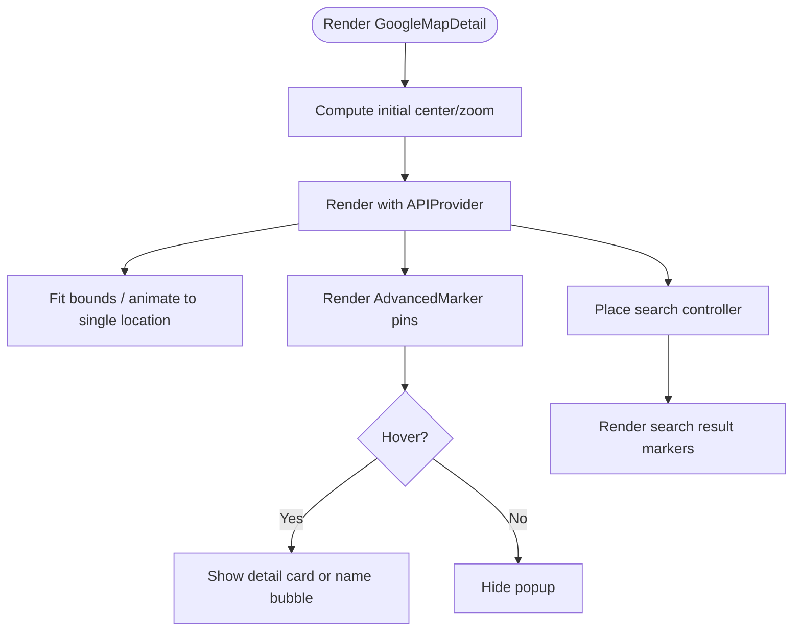

**Diagram sources**
- [GoogleMapDetail.tsx:27-54](file://src/components/ui/map/GoogleMapDetail.tsx#L27-L54)
- [GoogleMapDetail.tsx:65-103](file://src/components/ui/map/GoogleMapDetail.tsx#L65-L103)
- [GoogleMapDetail.tsx:116-151](file://src/components/ui/map/GoogleMapDetail.tsx#L116-L151)
- [GoogleMapDetail.tsx:341-463](file://src/components/ui/map/GoogleMapDetail.tsx#L341-L463)

**Section sources**
- [GoogleMapDetail.tsx:27-54](file://src/components/ui/map/GoogleMapDetail.tsx#L27-L54)
- [GoogleMapDetail.tsx:65-103](file://src/components/ui/map/GoogleMapDetail.tsx#L65-L103)
- [GoogleMapDetail.tsx:116-151](file://src/components/ui/map/GoogleMapDetail.tsx#L116-L151)
- [GoogleMapDetail.tsx:289-463](file://src/components/ui/map/GoogleMapDetail.tsx#L289-L463)

### Static Dashboard/Home Map (StaticMap + GoogleMapCluster)
- Lazily loads the map when visible using an intersection observer.
- Wraps GoogleMapCluster to render locality-based clusters with custom markers and hover states.
- Provides optional zoom controls and fit-bounds behavior.
- Tracks map load events for analytics.

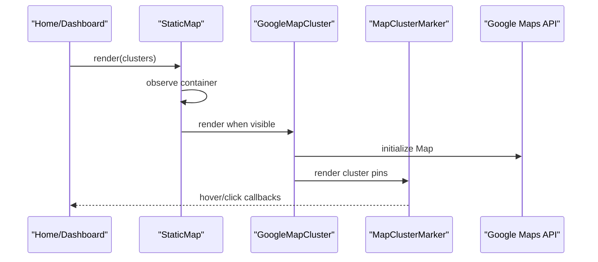

**Diagram sources**
- [StaticMap.tsx:39-96](file://src/components/ui/map/StaticMap.tsx#L39-L96)
- [GoogleMapCluster.tsx:80-136](file://src/components/ui/map/GoogleMapCluster.tsx#L80-L136)
- [MapClusterMarker.tsx:51-108](file://src/components/ui/map/MapClusterMarker.tsx#L51-L108)

**Section sources**
- [StaticMap.tsx:39-96](file://src/components/ui/map/StaticMap.tsx#L39-L96)
- [GoogleMapCluster.tsx:80-136](file://src/components/ui/map/GoogleMapCluster.tsx#L80-L136)
- [MapClusterMarker.tsx:51-108](file://src/components/ui/map/MapClusterMarker.tsx#L51-L108)

### Clustering Algorithm (Planner k-means)
- Groups nearby places geographically using k-means++ seeding and iterative assignment.
- Ensures no empty clusters and handles edge cases like missing coordinates or k > candidates.
- Used for planning workflows to create neighborhood clusters distinct from presentation-level locality grouping.

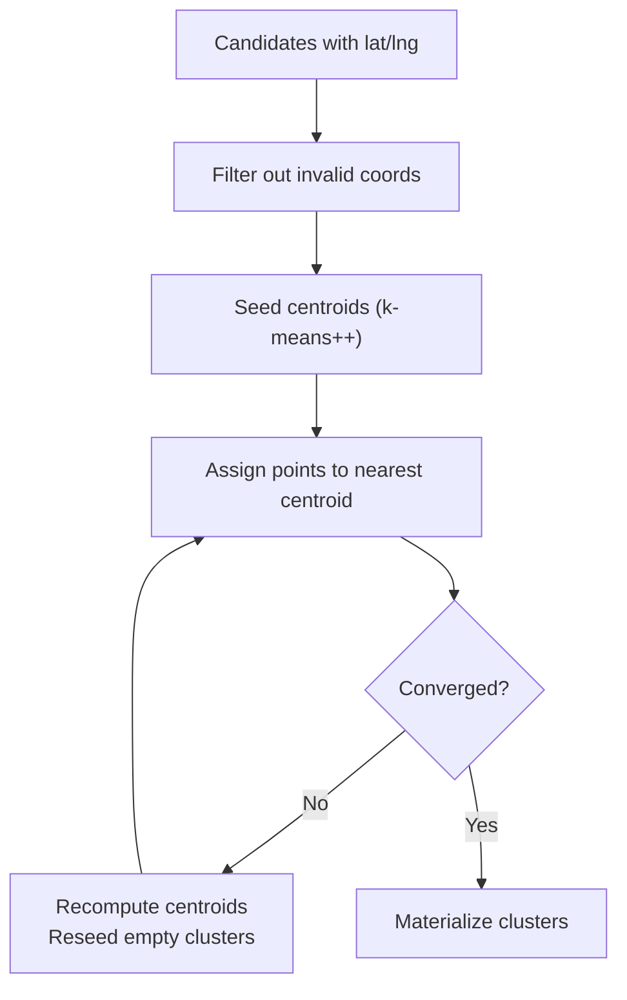

**Diagram sources**
- [cluster.ts:44-76](file://src/lib/planner/cluster.ts#L44-L76)
- [cluster.ts:84-165](file://src/lib/planner/cluster.ts#L84-L165)

**Section sources**
- [cluster.ts:44-76](file://src/lib/planner/cluster.ts#L44-L76)
- [cluster.ts:84-165](file://src/lib/planner/cluster.ts#L84-L165)

### Data Transformation Pipeline (useMapClusters + locality-pins)
- useMapClusters queries Supabase for raw locations based on source (dashboard, collections, content, itineraries).
- locality-pins groups items by “region, country” label and computes mean coordinates, producing MapClusterData suitable for static maps.
- Returns both clusters and a mapping of locality to entity IDs for filtering.

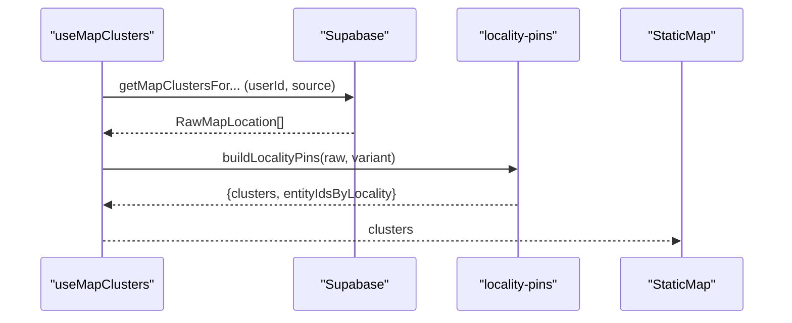

**Diagram sources**
- [useMapClusters.ts:35-60](file://src/hooks/useMapClusters.ts#L35-L60)
- [locality-pins.ts:28-77](file://src/lib/maps/locality-pins.ts#L28-L77)

**Section sources**
- [useMapClusters.ts:35-60](file://src/hooks/useMapClusters.ts#L35-L60)
- [locality-pins.ts:28-77](file://src/lib/maps/locality-pins.ts#L28-L77)

### Marker Customization and Hover Interactions
- MapClusterMarker renders a base pin image and displays either a compact count/label or full detail content on hover.
- MapMarkerHover provides styled badges and labels for cluster counts and labels.
- MapNameBubble offers a lightweight name-only bubble for minimal hover affordance.
- GoogleMapDetail supports rich hover cards or name bubbles depending on hoverVariant.

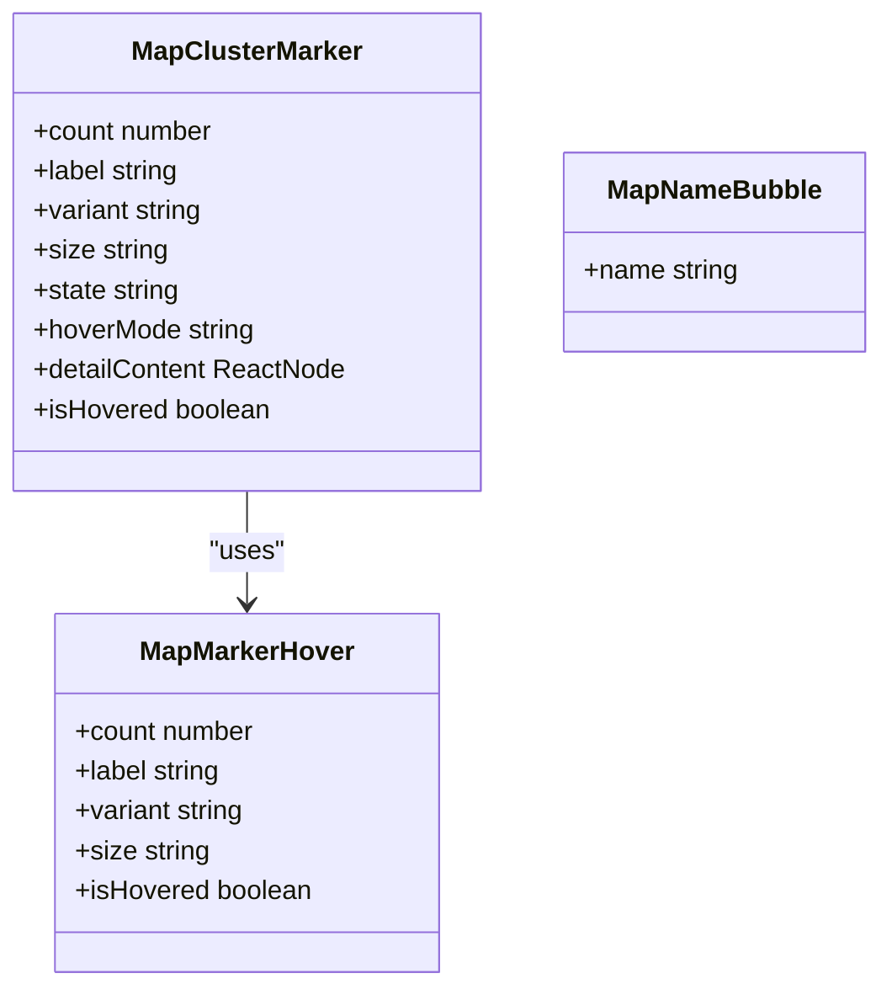

**Diagram sources**
- [MapClusterMarker.tsx:51-108](file://src/components/ui/map/MapClusterMarker.tsx#L51-L108)
- [MapMarkerHover.tsx:42-72](file://src/components/ui/map/MapMarkerHover.tsx#L42-L72)
- [MapNameBubble.tsx:15-23](file://src/components/ui/map/MapNameBubble.tsx#L15-L23)

**Section sources**
- [MapClusterMarker.tsx:51-108](file://src/components/ui/map/MapClusterMarker.tsx#L51-L108)
- [MapMarkerHover.tsx:42-72](file://src/components/ui/map/MapMarkerHover.tsx#L42-L72)
- [MapNameBubble.tsx:15-23](file://src/components/ui/map/MapNameBubble.tsx#L15-L23)
- [GoogleMapDetail.tsx:341-463](file://src/components/ui/map/GoogleMapDetail.tsx#L341-L463)

### Google Maps API Integration
- Both GoogleMapDetail and GoogleMapCluster wrap their maps with APIProvider using environment variables for API key and map IDs for light/dark themes.
- Place search uses the Places library loaded via useMapsLibrary and runs viewport-biased searches with tracking.

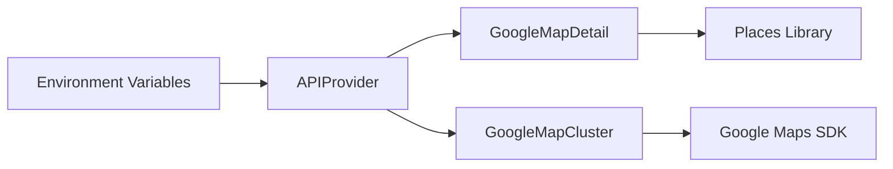

**Diagram sources**
- [GoogleMapDetail.tsx:23-25](file://src/components/ui/map/GoogleMapDetail.tsx#L23-L25)
- [GoogleMapCluster.tsx:9-11](file://src/components/ui/map/GoogleMapCluster.tsx#L9-L11)
- [GoogleMapDetail.tsx:289-463](file://src/components/ui/map/GoogleMapDetail.tsx#L289-L463)
- [GoogleMapCluster.tsx:80-136](file://src/components/ui/map/GoogleMapCluster.tsx#L80-L136)

**Section sources**
- [GoogleMapDetail.tsx:23-25](file://src/components/ui/map/GoogleMapDetail.tsx#L23-L25)
- [GoogleMapCluster.tsx:9-11](file://src/components/ui/map/GoogleMapCluster.tsx#L9-L11)
- [GoogleMapDetail.tsx:289-463](file://src/components/ui/map/GoogleMapDetail.tsx#L289-L463)
- [GoogleMapCluster.tsx:80-136](file://src/components/ui/map/GoogleMapCluster.tsx#L80-L136)

### Location Filtering and Cluster Click Handling
- StaticMap passes hoveredClusterId and onHoverChange to GoogleMapCluster for hover state management.
- Clusters expose onClusterClick to handle user interactions and can drive downstream filtering or navigation.
- The home page demonstrates passing clusters and handling clicks to filter content.

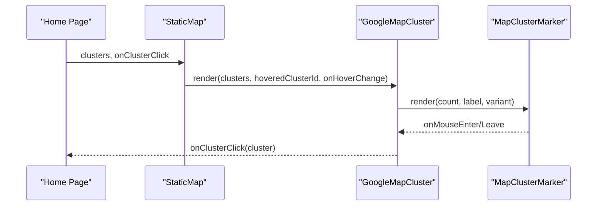

**Diagram sources**
- [StaticMap.tsx:39-96](file://src/components/ui/map/StaticMap.tsx#L39-L96)
- [GoogleMapCluster.tsx:80-136](file://src/components/ui/map/GoogleMapCluster.tsx#L80-L136)
- [MapClusterMarker.tsx:51-108](file://src/components/ui/map/MapClusterMarker.tsx#L51-L108)

**Section sources**
- [StaticMap.tsx:39-96](file://src/components/ui/map/StaticMap.tsx#L39-L96)
- [GoogleMapCluster.tsx:80-136](file://src/components/ui/map/GoogleMapCluster.tsx#L80-L136)
- [MapClusterMarker.tsx:51-108](file://src/components/ui/map/MapClusterMarker.tsx#L51-L108)

### Responsive Design Considerations
- ItineraryMapSection uses responsive padding and clamp-based heights to adapt to various viewports.
- useBreakpoint provides SSR-safe media query hooks to branch logic by device type.
- Global styles define a short breakpoint for compacting height-critical sections.

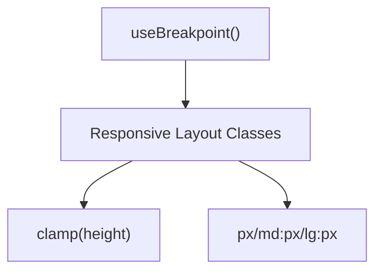

**Diagram sources**
- [ItineraryMapSection.tsx:21-52](file://src/components/ui/itinerary/ItineraryMapSection.tsx#L21-L52)
- [useMediaQuery.ts:53-67](file://src/hooks/useMediaQuery.ts#L53-L67)

**Section sources**
- [ItineraryMapSection.tsx:21-52](file://src/components/ui/itinerary/ItineraryMapSection.tsx#L21-L52)
- [useMediaQuery.ts:53-67](file://src/hooks/useMediaQuery.ts#L53-L67)

### Examples of Map Views and Interaction Patterns
- Itinerary map with numbered day-colored pins, polyline routes, and rich hover cards or name bubbles.
- Static dashboard/home map showing locality clusters with compact hover badges or detail content.
- Place search integrated into the interactive map to discover nearby locations and render result markers.

[No sources needed since this section summarizes usage patterns without analyzing specific files]

## Dependency Analysis
Key dependencies and relationships:
- UI components depend on @vis.gl/react-google-maps for map rendering and advanced markers.
- Data layer depends on Supabase queries and transforms via useMapClusters and locality-pins.
- Planner clustering is independent and used for grouping nearby places during itinerary planning.
- Responsive behavior relies on Tailwind classes and useBreakpoint hook.

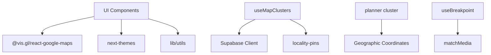

**Diagram sources**
- [GoogleMapDetail.tsx:289-463](file://src/components/ui/map/GoogleMapDetail.tsx#L289-L463)
- [GoogleMapCluster.tsx:80-136](file://src/components/ui/map/GoogleMapCluster.tsx#L80-L136)
- [useMapClusters.ts:35-60](file://src/hooks/useMapClusters.ts#L35-L60)
- [locality-pins.ts:28-77](file://src/lib/maps/locality-pins.ts#L28-L77)
- [cluster.ts:84-165](file://src/lib/planner/cluster.ts#L84-L165)
- [useMediaQuery.ts:53-67](file://src/hooks/useMediaQuery.ts#L53-L67)

**Section sources**
- [GoogleMapDetail.tsx:289-463](file://src/components/ui/map/GoogleMapDetail.tsx#L289-L463)
- [GoogleMapCluster.tsx:80-136](file://src/components/ui/map/GoogleMapCluster.tsx#L80-L136)
- [useMapClusters.ts:35-60](file://src/hooks/useMapClusters.ts#L35-L60)
- [locality-pins.ts:28-77](file://src/lib/maps/locality-pins.ts#L28-L77)
- [cluster.ts:84-165](file://src/lib/planner/cluster.ts#L84-L165)
- [useMediaQuery.ts:53-67](file://src/hooks/useMediaQuery.ts#L53-L67)

## Performance Considerations
- Lazy loading: MapContainer and StaticMap use intersection observers to defer map initialization until visible, reducing initial bundle and runtime cost.
- Fit bounds optimization: Initial fitBounds computed once; subsequent single-location updates animate smoothly to avoid jarring jumps.
- Marker rendering: AdvancedMarker instances are created per location/cluster; keep dataset size reasonable and consider server-side aggregation for very large sets.
- Clustering: Use locality grouping for static maps to reduce marker count; use planner k-means for planning workflows to group nearby places efficiently.
- Place search: Viewport-biased search reduces unnecessary results; track and debounce requests to limit API calls.
- Responsive sizing: Clamp heights and responsive padding prevent excessive reflows on smaller screens.

[No sources needed since this section provides general guidance]

## Troubleshooting Guide
- Missing API key or map IDs: Ensure environment variables for Google Maps API key and map IDs are configured; otherwise maps will not initialize.
- No locations displayed: Verify that locations have valid latitude/longitude; invalid entries are filtered out by the planner clustering and may not appear on interactive maps.
- Fit bounds not updating: Check fitBoundsKey increments and ensure locations array identity changes to trigger re-fitting.
- Hover popups not appearing: Confirm hover state is managed correctly in parent components and that hoverVariant is set appropriately.
- Place search not returning results: Ensure Places library is loaded and request parameters include appropriate types; check network logs for errors.

**Section sources**
- [GoogleMapDetail.tsx:23-25](file://src/components/ui/map/GoogleMapDetail.tsx#L23-L25)
- [GoogleMapDetail.tsx:65-103](file://src/components/ui/map/GoogleMapDetail.tsx#L65-L103)
- [cluster.ts:84-165](file://src/lib/planner/cluster.ts#L84-L165)
- [GoogleMapDetail.tsx:116-151](file://src/components/ui/map/GoogleMapDetail.tsx#L116-L151)

## Conclusion
The map visualization system provides flexible, performant, and responsive map experiences for both interactive itineraries and static dashboards. It leverages Google Maps API integration, robust clustering algorithms, and customizable markers with hover interactions. Data transformation pipelines ensure efficient rendering of large datasets, while responsive design ensures usability across devices.

[No sources needed since this section summarizes without analyzing specific files]

## Appendices

### Environment Configuration
- NEXT_PUBLIC_GOOGLE_MAPS_API_KEY: Required for Google Maps initialization.
- NEXT_PUBLIC_GOOGLE_MAPS_MAP_ID_LIGHT: Map ID for light theme.
- NEXT_PUBLIC_GOOGLE_MAPS_MAP_ID_DARK: Map ID for dark theme.

**Section sources**
- [GoogleMapDetail.tsx:23-25](file://src/components/ui/map/GoogleMapDetail.tsx#L23-L25)
- [GoogleMapCluster.tsx:9-11](file://src/components/ui/map/GoogleMapCluster.tsx#L9-L11)

### Google Maps URL Validation
- Utility to detect Google Maps URLs for sharing or linking purposes.

**Section sources**
- [google-maps-url.ts:1-11](file://src/lib/maps/google-maps-url.ts#L1-L11)