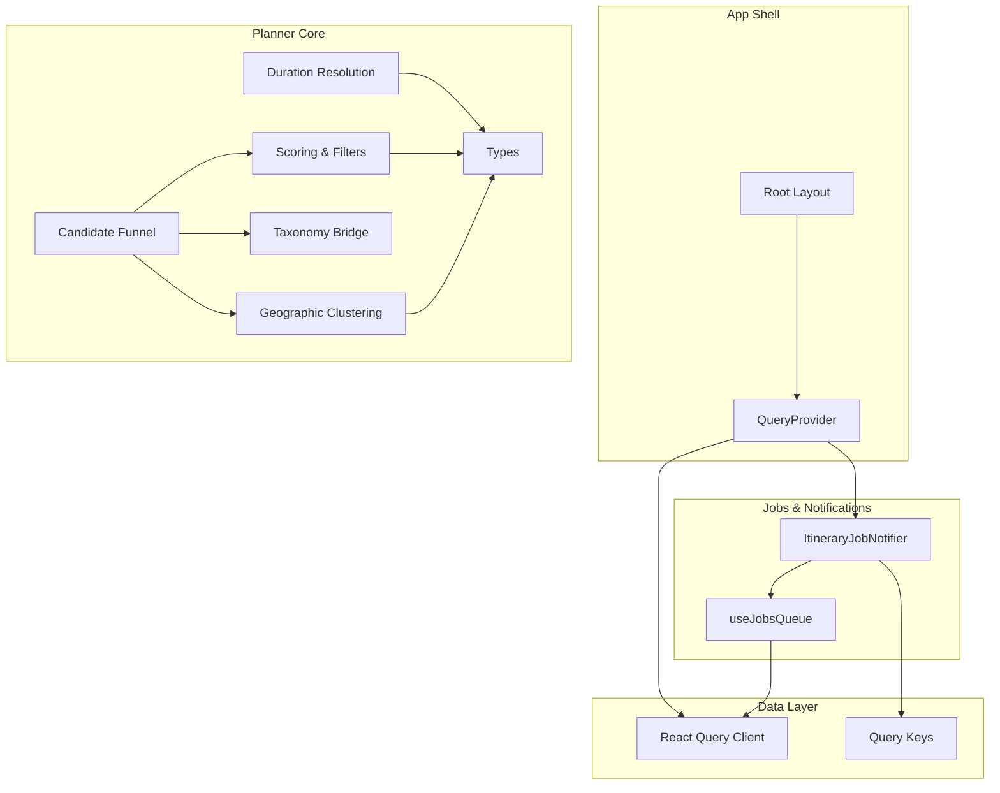
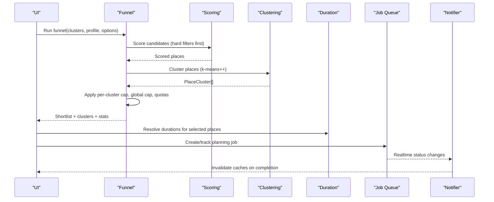
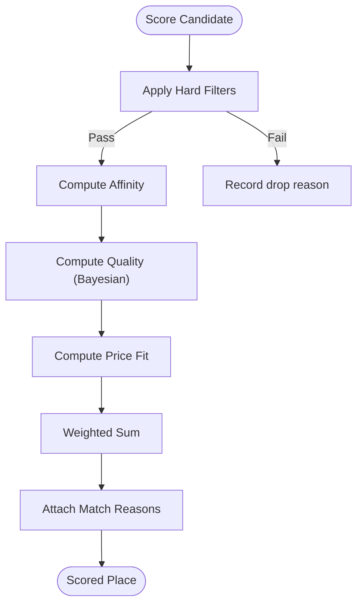
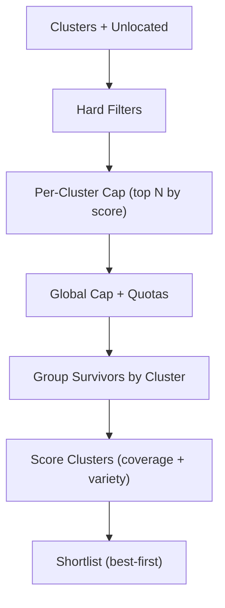
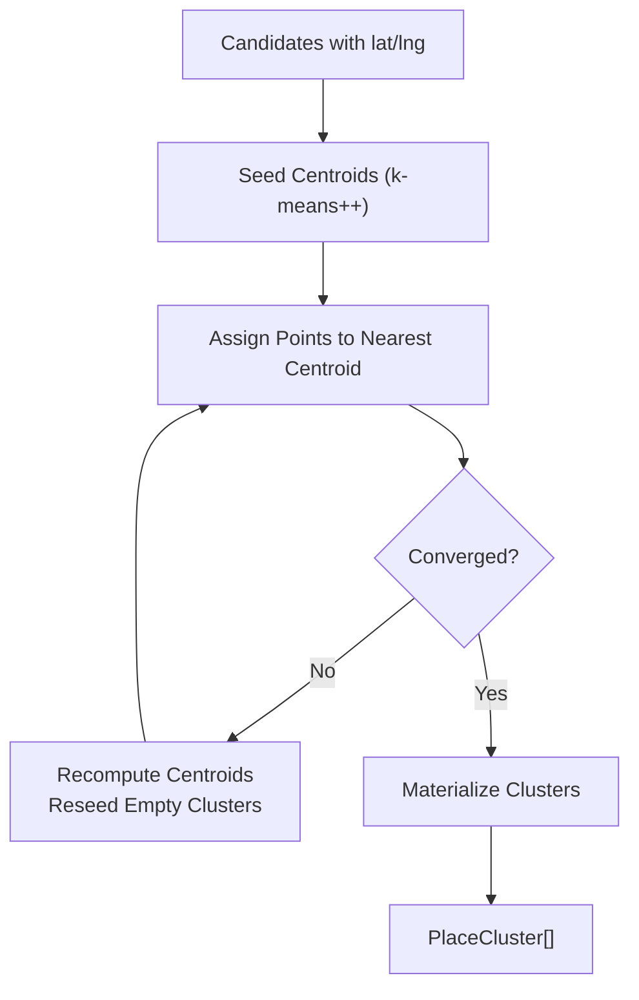
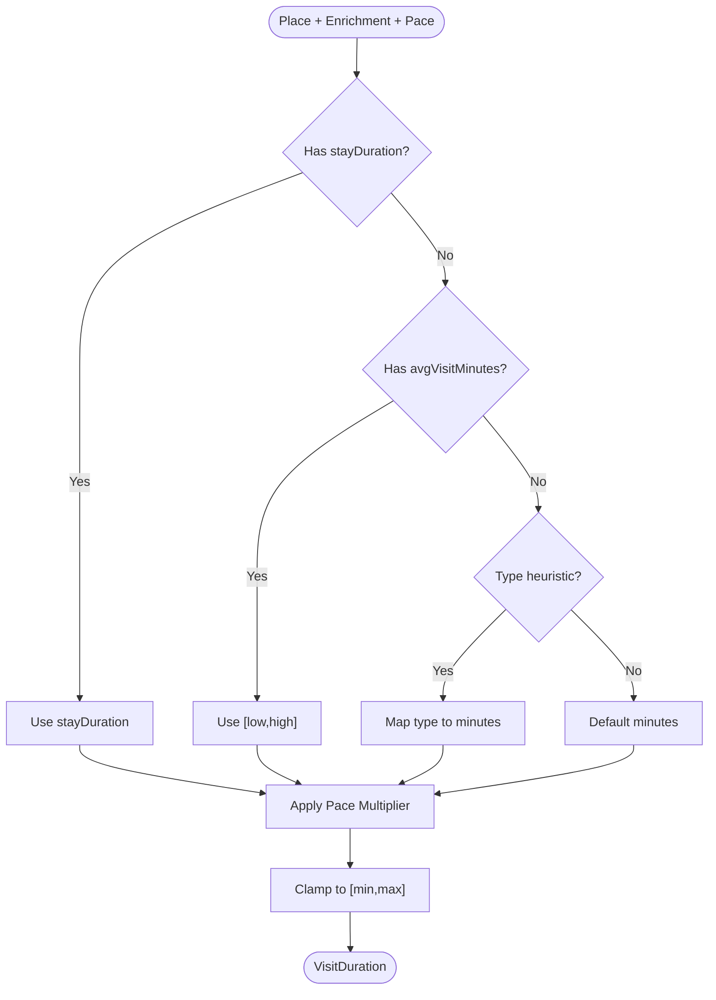
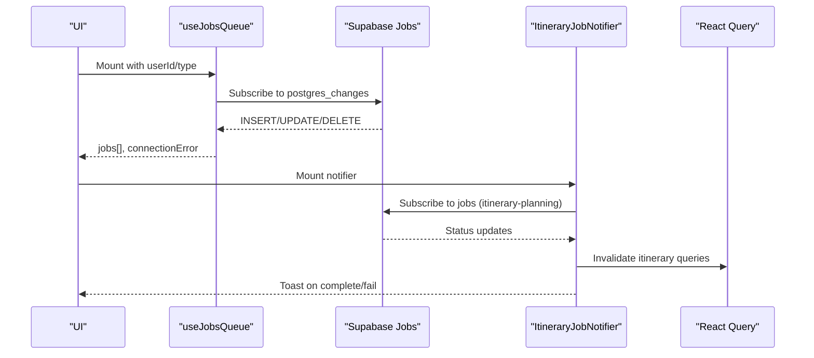
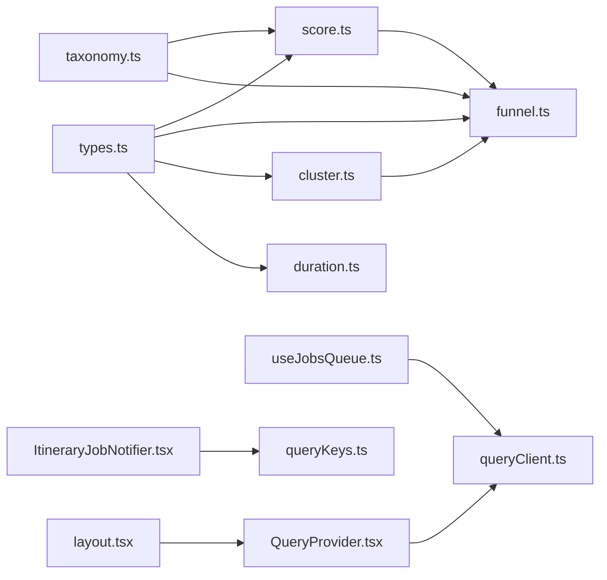

# Planner System Core

<cite>
**Referenced Files in This Document**
- [package.json](file://package.json)
- [layout.tsx](file://src/app/layout.tsx)
- [QueryProvider.tsx](file://src/components/QueryProvider.tsx)
- [types.ts](file://src/lib/planner/types.ts)
- [cluster.ts](file://src/lib/planner/cluster.ts)
- [funnel.ts](file://src/lib/planner/funnel.ts)
- [score.ts](file://src/lib/planner/score.ts)
- [taxonomy.ts](file://src/lib/planner/taxonomy.ts)
- [duration.ts](file://src/lib/planner/duration.ts)
- [useJobsQueue.ts](file://src/hooks/useJobsQueue.ts)
- [ItineraryJobNotifier.tsx](file://src/components/notifications/ItineraryJobNotifier.tsx)
- [queryClient.ts](file://src/lib/query/queryClient.ts)
- [queryKeys.ts](file://src/lib/query/queryKeys.ts)
</cite>

## Table of Contents
1. Introduction
2. Project Structure
3. Core Components
4. Architecture Overview
5. Detailed Component Analysis
6. Dependency Analysis
7. Performance Considerations
8. Troubleshooting Guide
9. Conclusion

## Introduction
This document explains the Planner System Core that powers itinerary planning. It covers how candidate places are retrieved, filtered, scored, clustered, and shortlisted deterministically before being handed to a downstream planner (LLM or packer). It also documents the job queue integration for background planning tasks and the client-side data layer used by the app shell.

## Project Structure
The planner core lives under src/lib/planner and is composed of:
- Types and shared vocabulary
- Deterministic scoring and hard filters
- Candidate funnel with quotas and serendipity
- Geographic clustering
- Visit-duration resolution
- Taxonomy bridge mapping interests to retrieval types and queries
- Client hooks and components for job queue and notifications
- React Query provider and keys for caching and invalidation

**Diagram sources**
- [layout.tsx:57-80](file://src/app/layout.tsx#L57-L80)
- [QueryProvider.tsx:7-12](file://src/components/QueryProvider.tsx#L7-L12)
- [types.ts:27-51](file://src/lib/planner/types.ts#L27-L51)
- [taxonomy.ts:27-56](file://src/lib/planner/taxonomy.ts#L27-L56)
- [score.ts:156-206](file://src/lib/planner/score.ts#L156-L206)
- [cluster.ts:84-165](file://src/lib/planner/cluster.ts#L84-L165)
- [funnel.ts:179-312](file://src/lib/planner/funnel.ts#L179-L312)
- [duration.ts:84-104](file://src/lib/planner/duration.ts#L84-L104)
- [useJobsQueue.ts:45-295](file://src/hooks/useJobsQueue.ts#L45-L295)
- [ItineraryJobNotifier.tsx:10-90](file://src/components/notifications/ItineraryJobNotifier.tsx#L10-L90)
- [queryClient.ts:3-12](file://src/lib/query/queryClient.ts#L3-L12)
- [queryKeys.ts:1-42](file://src/lib/query/queryKeys.ts#L1-L42)

**Section sources**
- [package.json:1-50](file://package.json#L1-L50)
- [layout.tsx:57-80](file://src/app/layout.tsx#L57-L80)

## Core Components
- PreferenceProfile and SchedulerOptions define user preferences and scheduler knobs.
- CandidatePlace and PlaceEnrichment model retrieved places and cached enrichment data.
- Scoring applies affinity, quality, and price fit with hard filters for closed venues, dietary conflicts (meal slots), and budget violations.
- Funnel stages narrow candidates per cluster and globally while enforcing restaurant and cuisine quotas; it also provides serendipity picks and dietary/budget degradation ladders.
- Clustering groups nearby candidates into neighborhoods using k-means++ with deterministic seeding.
- Duration resolution estimates visit times via a ladder of sources and pace multipliers.
- Job queue hook tracks background jobs with realtime updates and reconciliation.
- Notifier listens for itinerary planning completion and invalidates caches accordingly.

**Section sources**
- [types.ts:27-93](file://src/lib/planner/types.ts#L27-L93)
- [score.ts:156-206](file://src/lib/planner/score.ts#L156-L206)
- [funnel.ts:179-312](file://src/lib/planner/funnel.ts#L179-L312)
- [cluster.ts:84-165](file://src/lib/planner/cluster.ts#L84-L165)
- [duration.ts:84-104](file://src/lib/planner/duration.ts#L84-L104)
- [useJobsQueue.ts:45-295](file://src/hooks/useJobsQueue.ts#L45-L295)
- [ItineraryJobNotifier.tsx:10-90](file://src/components/notifications/ItineraryJobNotifier.tsx#L10-L90)

## Architecture Overview
The planner pipeline is staged and deterministic:
- Retrieval uses taxonomy bridges to query Places by interest types and text queries.
- Hard filters remove permanently closed places, dietary mismatches (for meal slots), and severely over-budget options.
- Scoring ranks candidates by affinity, quality, and price fit.
- Geographic clustering assigns candidates to neighborhood clusters.
- The funnel caps per-cluster and global shortlist size, enforces restaurant/cuisine quotas, and computes cluster scores.
- Serendipity selects one wildcard per day from high-scoring, lower-fame candidates.
- Dietary and budget degradation ladders ensure robustness when strict constraints fail.
- Duration resolution estimates visit lengths for packing.
- Background jobs drive planning; the notifier reacts to completion and refreshes UI state.

**Diagram sources**
- [funnel.ts:179-312](file://src/lib/planner/funnel.ts#L179-L312)
- [score.ts:156-206](file://src/lib/planner/score.ts#L156-L206)
- [cluster.ts:84-165](file://src/lib/planner/cluster.ts#L84-L165)
- [duration.ts:84-104](file://src/lib/planner/duration.ts#L84-L104)
- [useJobsQueue.ts:45-295](file://src/hooks/useJobsQueue.ts#L45-L295)
- [ItineraryJobNotifier.tsx:10-90](file://src/components/notifications/ItineraryJobNotifier.tsx#L10-L90)

## Detailed Component Analysis

### Scoring and Hard Filters
- Weights combine affinity, quality (Bayesian average), and price fit.
- Hard filters reject permanently closed places, dietary conflicts in meal slots, and places far above budget.
- Reasons are attached to each scored place for explainability.

**Diagram sources**
- [score.ts:156-206](file://src/lib/planner/score.ts#L156-L206)

**Section sources**
- [score.ts:156-206](file://src/lib/planner/score.ts#L156-L206)

### Candidate Funnel
- Stages: retrieved → afterFilters → afterClusterCap → afterGlobalCap.
- Enforces per-cluster top-N, global cap, restaurant share, and per-cuisine limits.
- Produces grouped clusters with scores and a flat shortlist.
- Provides serendipity pick and dietary/budget degradation ladders.

**Diagram sources**
- [funnel.ts:179-312](file://src/lib/planner/funnel.ts#L179-L312)

**Section sources**
- [funnel.ts:179-312](file://src/lib/planner/funnel.ts#L179-L312)

### Geographic Clustering
- K-means++ seeding ensures diverse initial centroids.
- Lloyd iterations assign points to nearest centroid; empty clusters are reseeded.
- Returns non-empty clusters with centroids and member places.

**Diagram sources**
- [cluster.ts:50-76](file://src/lib/planner/cluster.ts#L50-L76)
- [cluster.ts:84-165](file://src/lib/planner/cluster.ts#L84-L165)

**Section sources**
- [cluster.ts:84-165](file://src/lib/planner/cluster.ts#L84-L165)

### Duration Resolution
- Resolves visit duration via a ladder: stored stay duration → enriched avgVisitMinutes → type heuristics → default.
- Applies pace multiplier to preferred time while keeping within min/max bounds.

**Diagram sources**
- [duration.ts:84-104](file://src/lib/planner/duration.ts#L84-L104)

**Section sources**
- [duration.ts:84-104](file://src/lib/planner/duration.ts#L84-L104)

### Taxonomy Bridge
- Maps fixed Interest values to Google Places types and text search queries.
- Supports dietary needs bridging for retrieval and filtering.
- Aggregates deduplicated types across interests for efficient retrieval.

**Section sources**
- [taxonomy.ts:27-98](file://src/lib/planner/taxonomy.ts#L27-L98)

### Jobs Queue and Itinerary Notifications
- useJobsQueue subscribes to realtime job updates, reconciles missed transitions, and exposes helpers to manage visible jobs.
- ItineraryJobNotifier listens for itinerary-planning job completion/failure, invalidates relevant React Query caches, and shows toasts.

**Diagram sources**
- [useJobsQueue.ts:45-295](file://src/hooks/useJobsQueue.ts#L45-L295)
- [ItineraryJobNotifier.tsx:10-90](file://src/components/notifications/ItineraryJobNotifier.tsx#L10-L90)
- [queryKeys.ts:1-42](file://src/lib/query/queryKeys.ts#L1-L42)

**Section sources**
- [useJobsQueue.ts:45-295](file://src/hooks/useJobsQueue.ts#L45-L295)
- [ItineraryJobNotifier.tsx:10-90](file://src/components/notifications/ItineraryJobNotifier.tsx#L10-L90)

## Dependency Analysis
- Planner modules depend on shared types and taxonomy for consistent vocabulary and retrieval mapping.
- Funnel composes scoring and clustering outputs and owns set-level policies (quotas, serendipity, degradation).
- App shell depends on React Query provider and notification components for state synchronization.
- Job queue and notifier integrate with Supabase realtime and invalidate query caches based on keys.

**Diagram sources**
- [types.ts:27-93](file://src/lib/planner/types.ts#L27-L93)
- [score.ts:156-206](file://src/lib/planner/score.ts#L156-L206)
- [funnel.ts:179-312](file://src/lib/planner/funnel.ts#L179-L312)
- [cluster.ts:84-165](file://src/lib/planner/cluster.ts#L84-L165)
- [duration.ts:84-104](file://src/lib/planner/duration.ts#L84-L104)
- [taxonomy.ts:27-98](file://src/lib/planner/taxonomy.ts#L27-L98)
- [layout.tsx:57-80](file://src/app/layout.tsx#L57-L80)
- [QueryProvider.tsx:7-12](file://src/components/QueryProvider.tsx#L7-L12)
- [queryClient.ts:3-12](file://src/lib/query/queryClient.ts#L3-L12)
- [queryKeys.ts:1-42](file://src/lib/query/queryKeys.ts#L1-L42)
- [ItineraryJobNotifier.tsx:10-90](file://src/components/notifications/ItineraryJobNotifier.tsx#L10-L90)
- [useJobsQueue.ts:45-295](file://src/hooks/useJobsQueue.ts#L45-L295)

**Section sources**
- [types.ts:27-93](file://src/lib/planner/types.ts#L27-L93)
- [funnel.ts:179-312](file://src/lib/planner/funnel.ts#L179-L312)
- [score.ts:156-206](file://src/lib/planner/score.ts#L156-L206)
- [cluster.ts:84-165](file://src/lib/planner/cluster.ts#L84-L165)
- [duration.ts:84-104](file://src/lib/planner/duration.ts#L84-L104)
- [taxonomy.ts:27-98](file://src/lib/planner/taxonomy.ts#L27-L98)
- [layout.tsx:57-80](file://src/app/layout.tsx#L57-L80)
- [QueryProvider.tsx:7-12](file://src/components/QueryProvider.tsx#L7-L12)
- [queryClient.ts:3-12](file://src/lib/query/queryClient.ts#L3-L12)
- [queryKeys.ts:1-42](file://src/lib/query/queryKeys.ts#L1-L42)
- [ItineraryJobNotifier.tsx:10-90](file://src/components/notifications/ItineraryJobNotifier.tsx#L10-L90)
- [useJobsQueue.ts:45-295](file://src/hooks/useJobsQueue.ts#L45-L295)

## Performance Considerations
- Deterministic scoring and funnel reduce reliance on LLM calls and keep shortlists small and debuggable.
- K-means++ seeding improves convergence and cluster quality.
- Per-cluster and global caps limit downstream processing load.
- React Query defaults provide reasonable stale/gc times and minimal retries to balance freshness and network usage.
- Realtime subscriptions are scoped per user and instance to avoid channel collisions and unnecessary updates.

[No sources needed since this section provides general guidance]

## Troubleshooting Guide
- If a candidate disappears unexpectedly, check funnel stages and dropped reasons for hard filter failures, per-cluster caps, or global quota breaches.
- For dietary issues, verify rung selection and enrichment tags; fallback to rung 3 with caveats if necessary.
- Budget widening can be inspected via widenedBy and match reasons to understand why a place was admitted.
- For job-related UI stalls, confirm realtime subscription status, reconcile on visibility change, and ensure failed jobs under 24 hours remain visible.
- After itinerary completion, verify cache invalidation via query keys to ensure fresh data appears.

**Section sources**
- [funnel.ts:179-312](file://src/lib/planner/funnel.ts#L179-L312)
- [score.ts:156-206](file://src/lib/planner/score.ts#L156-L206)
- [useJobsQueue.ts:45-295](file://src/hooks/useJobsQueue.ts#L45-L295)
- [ItineraryJobNotifier.tsx:10-90](file://src/components/notifications/ItineraryJobNotifier.tsx#L10-L90)
- [queryKeys.ts:1-42](file://src/lib/query/queryKeys.ts#L1-L42)

## Conclusion
The Planner System Core implements a robust, deterministic pipeline for transforming retrieved places into a curated, geographically coherent shortlist ready for scheduling. It balances personalization with practical constraints through scoring, clustering, quotas, and degradation ladders. Integration with background jobs and React Query ensures responsive UI updates and reliable state synchronization.

[No sources needed since this section summarizes without analyzing specific files]