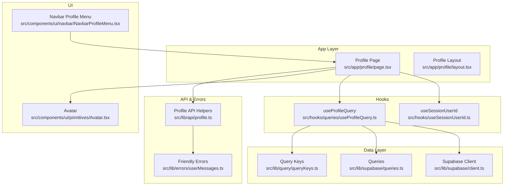
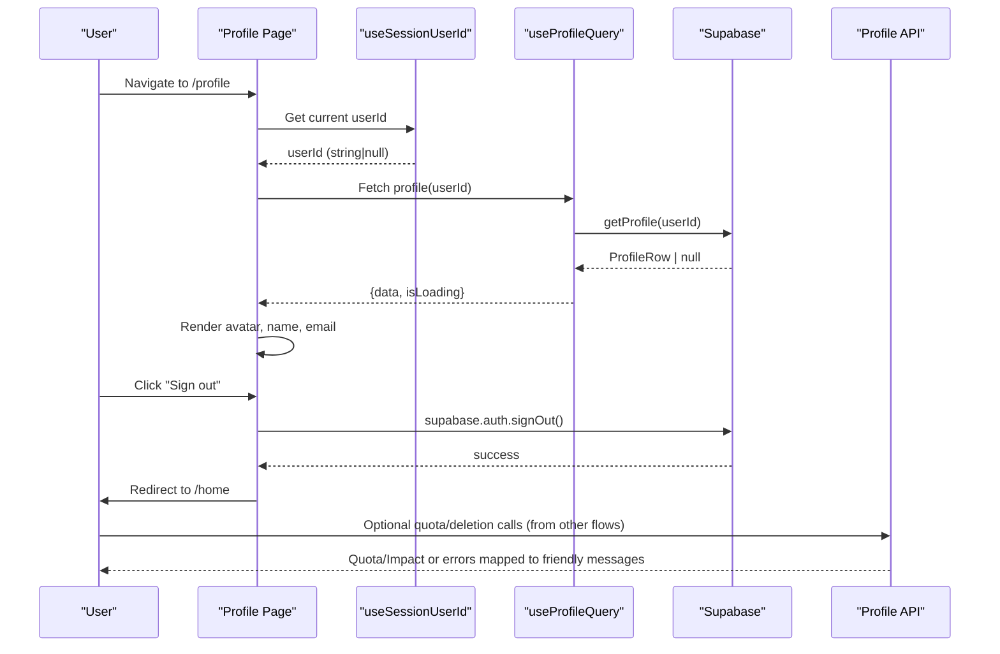
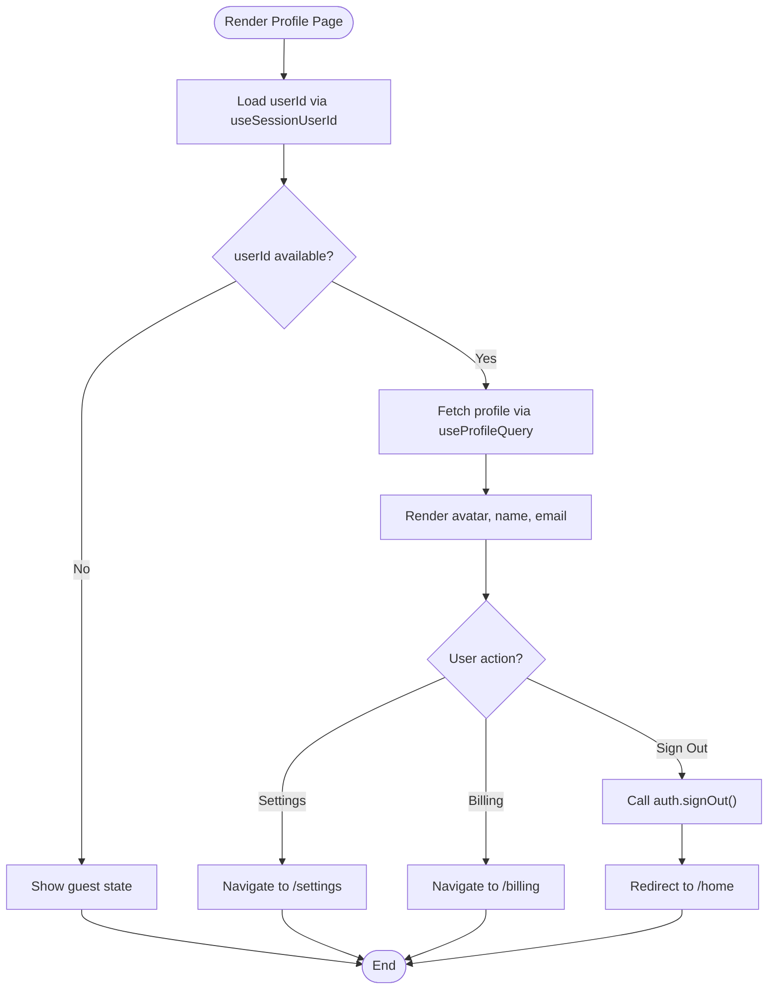
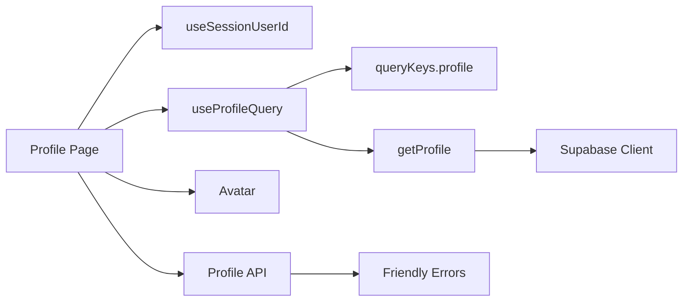

# Profile System

<cite>
**Referenced Files in This Document**
- [page.tsx](file://src/app/profile/page.tsx)
- [layout.tsx](file://src/app/profile/layout.tsx)
- [useProfileQuery.ts](file://src/hooks/queries/useProfileQuery.ts)
- [useSessionUserId.ts](file://src/hooks/useSessionUserId.ts)
- [queries.ts](file://src/lib/supabase/queries.ts)
- [client.ts](file://src/lib/supabase/client.ts)
- [queryKeys.ts](file://src/lib/query/queryKeys.ts)
- [Avatar.tsx](file://src/components/ui/primitives/Avatar.tsx)
- [NavbarProfileMenu.tsx](file://src/components/ui/navbar/NavbarProfileMenu.tsx)
- [profile.ts](file://src/lib/api/profile.ts)
- [userMessages.ts](file://src/lib/errors/userMessages.ts)
</cite>

## Table of Contents
1. Introduction
2. Project Structure
3. Core Components
4. Architecture Overview
5. Detailed Component Analysis
6. Dependency Analysis
7. Performance Considerations
8. Troubleshooting Guide
9. Conclusion

## Introduction
This document explains the Profile System that powers user identity display, authentication state resolution, profile data retrieval, and account-related actions (settings, billing, sign out). It focuses on how the Next.js app layer composes UI with hooks and Supabase to present a consistent profile experience.

## Project Structure
The Profile System spans several layers:
- App layer: Profile page and layout
- Hooks: Session ID resolution and profile data fetching
- Data layer: Supabase client and queries for profiles
- UI primitives: Avatar component used to render user identity
- Navigation integration: Navbar menu entry points to profile, settings, and billing
- API utilities: Quota/account endpoints and error messaging

**Diagram sources**
- [page.tsx:1-190](file://src/app/profile/page.tsx#L1-L190)
- [layout.tsx:1-12](file://src/app/profile/layout.tsx#L1-L12)
- [useSessionUserId.ts:1-20](file://src/hooks/useSessionUserId.ts#L1-L20)
- [useProfileQuery.ts:1-20](file://src/hooks/queries/useProfileQuery.ts#L1-L20)
- [client.ts:1-8](file://src/lib/supabase/client.ts#L1-L8)
- [queries.ts:1-46](file://src/lib/supabase/queries.ts#L1-L46)
- [queryKeys.ts:1-42](file://src/lib/query/queryKeys.ts#L1-L42)
- [Avatar.tsx:1-127](file://src/components/ui/primitives/Avatar.tsx#L1-L127)
- [NavbarProfileMenu.tsx:41-77](file://src/components/ui/navbar/NavbarProfileMenu.tsx#L41-L77)
- [profile.ts:1-59](file://src/lib/api/profile.ts#L1-L59)
- [userMessages.ts:1-107](file://src/lib/errors/userMessages.ts#L1-L107)

**Section sources**
- [page.tsx:1-190](file://src/app/profile/page.tsx#L1-L190)
- [layout.tsx:1-12](file://src/app/profile/layout.tsx#L1-L12)

## Core Components
- Profile Page: Displays user identity, email, travel persona CTA, and account actions (Settings, Plan & Billing, Sign Out). Uses motion for entrance animations and respects reduced motion preferences.
- Session Hook: Resolves the current user’s ID from Supabase session asynchronously.
- Profile Query Hook: Fetches profile data using React Query with stable keys and long-lived caching.
- Supabase Queries: Typed functions to fetch single or multiple profiles from the database.
- Avatar Component: Renders initials, image, or icon with consistent sizing and styling.
- Navbar Integration: Provides navigation to Profile, Settings, and Plan & Billing, plus sign-out.
- API Helpers: Encapsulate quota and deletion endpoints; centralize error handling via friendly messages.

**Section sources**
- [page.tsx:25-189](file://src/app/profile/page.tsx#L25-L189)
- [useSessionUserId.ts:8-19](file://src/hooks/useSessionUserId.ts#L8-L19)
- [useProfileQuery.ts:8-19](file://src/hooks/queries/useProfileQuery.ts#L8-L19)
- [queries.ts:7-46](file://src/lib/supabase/queries.ts#L7-L46)
- [Avatar.tsx:40-127](file://src/components/ui/primitives/Avatar.tsx#L40-L127)
- [NavbarProfileMenu.tsx:41-77](file://src/components/ui/navbar/NavbarProfileMenu.tsx#L41-L77)
- [profile.ts:13-59](file://src/lib/api/profile.ts#L13-L59)

## Architecture Overview
The Profile System follows a layered architecture:
- Presentation: Profile page composes UI primitives and orchestrates hooks.
- State/Data: useSessionUserId provides the userId; useProfileQuery fetches profile data with React Query.
- Persistence: Supabase client connects to the backend; queries select profile fields.
- Navigation: Navbar menu routes to profile-related pages and triggers sign-out.
- Error Handling: Friendly error mapping ensures user-facing messages are safe and clear.

**Diagram sources**
- [page.tsx:25-189](file://src/app/profile/page.tsx#L25-L189)
- [useSessionUserId.ts:8-19](file://src/hooks/useSessionUserId.ts#L8-L19)
- [useProfileQuery.ts:8-19](file://src/hooks/queries/useProfileQuery.ts#L8-L19)
- [queries.ts:14-29](file://src/lib/supabase/queries.ts#L14-L29)
- [profile.ts:13-59](file://src/lib/api/profile.ts#L13-L59)

## Detailed Component Analysis

### Profile Page
- Responsibilities:
  - Resolve userId and fetch profile data
  - Display hero section with avatar, display name, and email
  - Provide CTA to take a travel persona quiz
  - Offer account actions: Settings, Plan & Billing, Sign Out
- Key behaviors:
  - Graceful fallbacks for missing profile fields
  - Motion transitions respecting reduced motion preference
  - Sign-out flow clears session and navigates away

**Diagram sources**
- [page.tsx:25-189](file://src/app/profile/page.tsx#L25-L189)

**Section sources**
- [page.tsx:25-189](file://src/app/profile/page.tsx#L25-L189)

### Session Resolution Hook
- Purpose: Retrieve the authenticated user’s ID from Supabase session once on mount.
- Behavior: Returns null until session is resolved; enables downstream queries only when userId is present.

**Section sources**
- [useSessionUserId.ts:8-19](file://src/hooks/useSessionUserId.ts#L8-L19)

### Profile Query Hook
- Purpose: Fetch profile data for a given userId using React Query.
- Configuration:
  - Query key includes userId for cache isolation
  - Enabled only when userId exists
  - Long-lived cache (staleTime/gcTime set to Infinity) to avoid refetching profile data unnecessarily

**Section sources**
- [useProfileQuery.ts:8-19](file://src/hooks/queries/useProfileQuery.ts#L8-L19)
- [queryKeys.ts:1-42](file://src/lib/query/queryKeys.ts#L1-L42)

### Supabase Queries
- Single profile fetch: Selects id, email, display_name, avatar_url for a specific user.
- Batch profiles fetch: Supports retrieving multiple profiles by IDs.
- Error handling: Logs errors and returns safe defaults (null or empty arrays).

**Section sources**
- [queries.ts:7-46](file://src/lib/supabase/queries.ts#L7-L46)

### Avatar Component
- Modes: Initials, image, or icon based on props.
- Sizing: Small, medium, large with consistent typography scaling.
- Accessibility: Alt text support and keyboard-friendly interactions.

**Section sources**
- [Avatar.tsx:40-127](file://src/components/ui/primitives/Avatar.tsx#L40-L127)

### Navbar Integration
- Entry points: Profile, Settings, Plan & Billing, Sign Out.
- Sign-out behavior: Triggers Supabase sign-out and redirects appropriately.

**Section sources**
- [NavbarProfileMenu.tsx:41-77](file://src/components/ui/navbar/NavbarProfileMenu.tsx#L41-L77)

### API Helpers and Error Messaging
- Quota and deletion endpoints encapsulated with typed responses.
- Centralized friendly error mapping to ensure user-facing messages are safe and actionable.

**Section sources**
- [profile.ts:13-59](file://src/lib/api/profile.ts#L13-L59)
- [userMessages.ts:7-47](file://src/lib/errors/userMessages.ts#L7-L47)

## Dependency Analysis

**Diagram sources**
- [page.tsx:25-189](file://src/app/profile/page.tsx#L25-L189)
- [useSessionUserId.ts:8-19](file://src/hooks/useSessionUserId.ts#L8-L19)
- [useProfileQuery.ts:8-19](file://src/hooks/queries/useProfileQuery.ts#L8-L19)
- [queryKeys.ts:1-42](file://src/lib/query/queryKeys.ts#L1-L42)
- [queries.ts:14-29](file://src/lib/supabase/queries.ts#L14-L29)
- [client.ts:1-8](file://src/lib/supabase/client.ts#L1-L8)
- [Avatar.tsx:40-127](file://src/components/ui/primitives/Avatar.tsx#L40-L127)
- [profile.ts:13-59](file://src/lib/api/profile.ts#L13-L59)
- [userMessages.ts:7-47](file://src/lib/errors/userMessages.ts#L7-L47)

**Section sources**
- [page.tsx:25-189](file://src/app/profile/page.tsx#L25-L189)
- [useProfileQuery.ts:8-19](file://src/hooks/queries/useProfileQuery.ts#L8-L19)
- [queries.ts:14-29](file://src/lib/supabase/queries.ts#L14-L29)
- [client.ts:1-8](file://src/lib/supabase/client.ts#L1-L8)

## Performance Considerations
- Profile data caching: The profile query uses infinite staleTime and gcTime to avoid unnecessary refetches since profile data changes infrequently.
- Conditional fetching: Queries are enabled only when userId is available, preventing wasted network requests.
- Reduced motion: Animations respect user preferences to improve accessibility and performance on low-end devices.
- Efficient rendering: Avatar component renders minimal DOM nodes and avoids re-renders through stable props.

[No sources needed since this section provides general guidance]

## Troubleshooting Guide
Common issues and resolutions:
- Missing profile data:
  - Ensure userId is resolved before querying; check useSessionUserId output.
  - Verify Supabase permissions and row-level security for the profiles table.
- Authentication failures:
  - Use friendly error mapping to surface clear messages to users.
  - Check network connectivity and rate limits if errors indicate throttling.
- Sign-out not working:
  - Confirm Supabase client initialization and environment variables.
  - Validate redirect after sign-out completes.

**Section sources**
- [useSessionUserId.ts:8-19](file://src/hooks/useSessionUserId.ts#L8-L19)
- [userMessages.ts:7-47](file://src/lib/errors/userMessages.ts#L7-L47)
- [client.ts:1-8](file://src/lib/supabase/client.ts#L1-L8)

## Conclusion
The Profile System integrates Next.js routing, React hooks, and Supabase to deliver a robust profile experience. It cleanly separates concerns across presentation, state, and data layers while providing accessible UI and resilient error handling. The design supports future enhancements such as profile editing, subscription management, and deeper personalization features.

[No sources needed since this section summarizes without analyzing specific files]