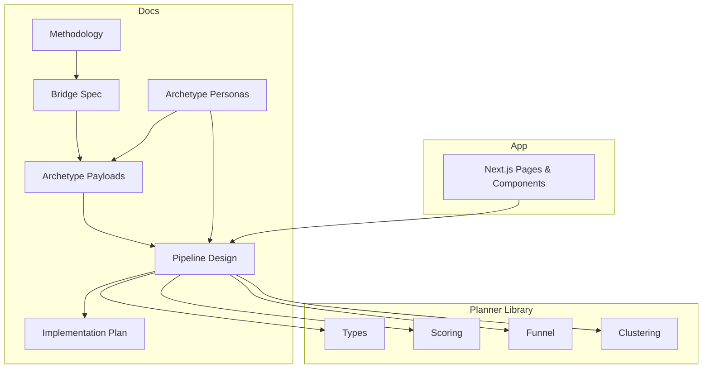
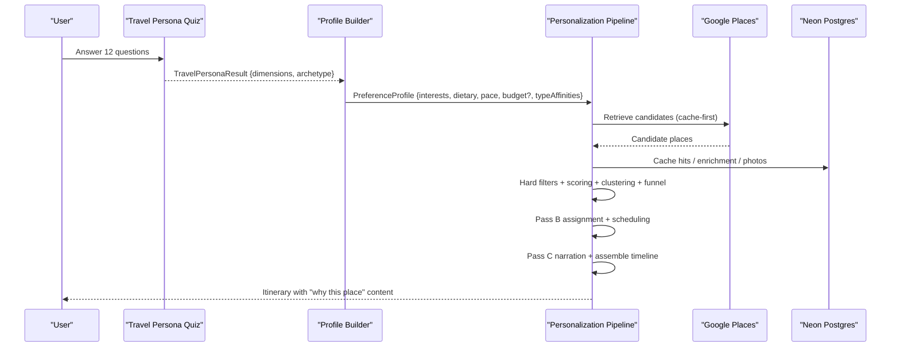
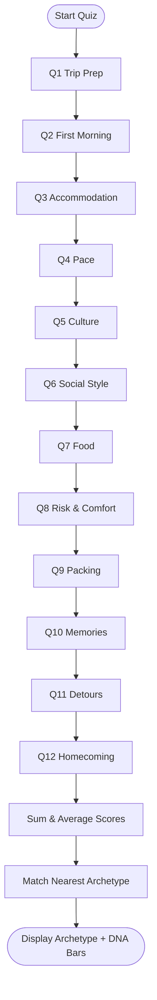
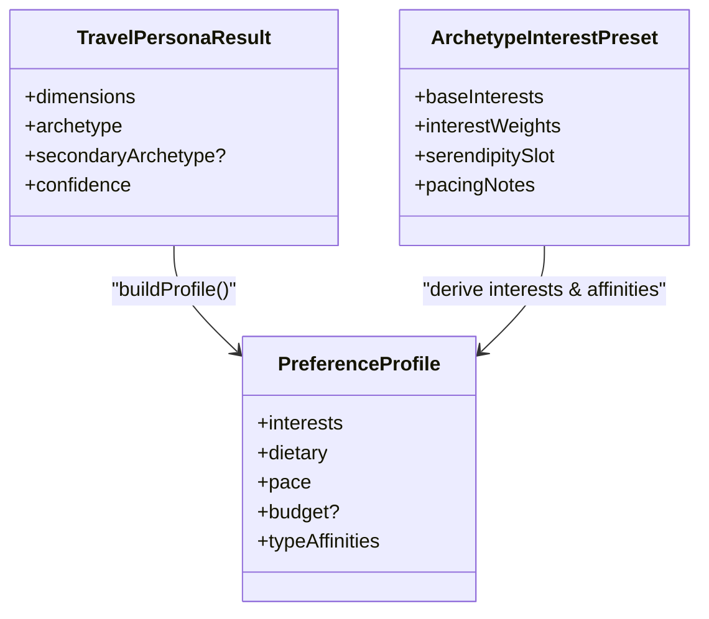
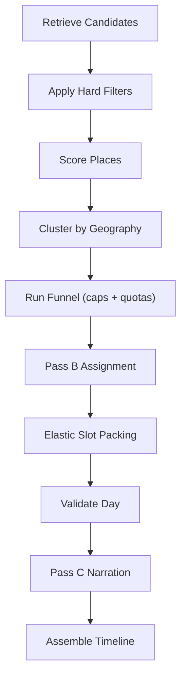
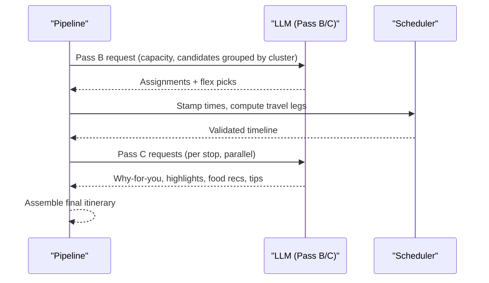
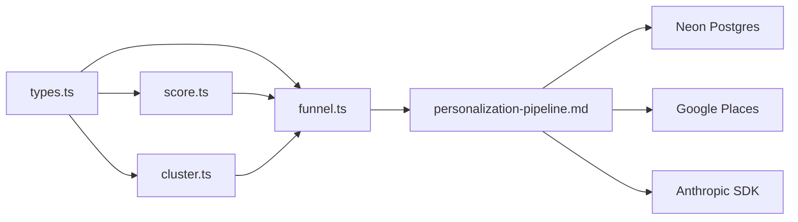

# Travel Persona Quiz System

<cite>
**Referenced Files in This Document**
- [travel-persona-quiz-methodology.md](file://docs/travel-persona-quiz-methodology.md)
- [quiz-pipeline-bridge.md](file://docs/quiz-pipeline-bridge.md)
- [archetype-data-payloads.md](file://docs/archetype-data-payloads.md)
- [archetype-output-reference.md](file://docs/archetype-output-reference.md)
- [archetype-personas.md](file://docs/archetype-personas.md)
- [personalization-pipeline.md](file://docs/personalization-pipeline.md)
- [implementation-plan.md](file://docs/implementation-plan.md)
- [types.ts](file://src/lib/planner/types.ts)
- [score.ts](file://src/lib/planner/score.ts)
- [funnel.ts](file://src/lib/planner/funnel.ts)
- [cluster.ts](file://src/lib/planner/cluster.ts)
- [package.json](file://package.json)
</cite>

## Update Summary
**Changes Made**
- Added comprehensive archetype documentation section covering all 12 distinct travel personas
- Updated architecture overview to include the new archetype reference system
- Enhanced detailed component analysis with complete archetype profiles and scoring mechanisms
- Added new section documenting the dimensional model and matching algorithms
- Integrated comprehensive archetype data payloads and output references

## Table of Contents
1. [Introduction](#introduction)
2. [Project Structure](#project-structure)
3. [Core Components](#core-components)
4. [Architecture Overview](#architecture-overview)
5. [Detailed Component Analysis](#detailed-component-analysis)
6. [Comprehensive Archetype Reference](#comprehensive-archetype-reference)
7. [Dependency Analysis](#dependency-analysis)
8. [Performance Considerations](#performance-considerations)
9. [Troubleshooting Guide](#troubleshooting-guide)
10. [Conclusion](#conclusion)
11. [Appendices](#appendices)

## Introduction
This document explains the Travel Persona Quiz System and how it integrates with a hyper-personalized itinerary pipeline. The quiz measures four travel dimensions (Structure, Comfort, Focus, Social), maps answers to 12 distinct archetypes, and produces structured outputs that drive retrieval, scoring, scheduling, and narration in the pipeline. The system is designed for deterministic ranking and scheduling with LLM-assisted assignment and narration, using Google Places data and a Neon Postgres database.

## Project Structure
The repository combines:
- Documentation describing the quiz methodology, bridge to the pipeline, archetype payloads, and end-to-end design.
- A Next.js application with UI components and hooks.
- A planner library implementing retrieval, scoring, clustering, funneling, and scheduling logic.
- Tests and implementation plans guiding step-by-step development.



**Diagram sources**
- [personalization-pipeline.md:1-120](file://docs/personalization-pipeline.md#L1-L120)
- [quiz-pipeline-bridge.md:20-50](file://docs/quiz-pipeline-bridge.md#L20-L50)
- [archetype-personas.md:1-40](file://docs/archetype-personas.md#L1-L40)

**Section sources**
- [personalization-pipeline.md:1-120](file://docs/personalization-pipeline.md#L1-L120)
- [package.json:1-50](file://package.json#L1-L50)

## Core Components
- Travel Persona Quiz: 12 questions mapped to 4 axes; scores normalized to 0–100 per axis; Euclidean distance matches nearest archetype among 12 types.
- Bridge Layer: Converts quiz output into PreferenceProfile inputs for the pipeline (interests, pace, budget fallback, type affinities).
- Pipeline Stages: Retrieval (cache-first), hard filters, scoring, clustering, funnel narrowing, Pass B assignment, scheduling, Pass C narration, photo resolution.
- Deterministic Core: Pure functions for scoring, clustering, duration resolution, packing, validation, and degradation ladders.

Key interfaces and constants:
- PreferenceProfile defines interests, dietary constraints, pace, optional budget, and learned affinities.
- Scoring uses weighted affinity, quality (Bayesian average), and price fit with hard filters applied first.
- Funnel stages track counts and reasons for dropped candidates; serendipity picks and dietary/budget ladders ensure robustness.
- Clustering groups candidates by geography for coherent day planning.

**Section sources**
- [travel-persona-quiz-methodology.md:196-242](file://docs/travel-persona-quiz-methodology.md#L196-L242)
- [quiz-pipeline-bridge.md:54-93](file://docs/quiz-pipeline-bridge.md#L54-L93)
- [personalization-pipeline.md:224-344](file://docs/personalization-pipeline.md#L224-L344)
- [types.ts:27-41](file://src/lib/planner/types.ts#L27-L41)
- [score.ts:26-34](file://src/lib/planner/score.ts#L26-L34)
- [funnel.ts:32-62](file://src/lib/planner/funnel.ts#L32-L62)
- [cluster.ts:17-32](file://src/lib/planner/cluster.ts#L17-L32)

## Architecture Overview
The system bridges quiz results into the pipeline's preference profile and then runs a staged process to produce a personalized itinerary.



**Diagram sources**
- [quiz-pipeline-bridge.md:20-50](file://docs/quiz-pipeline-bridge.md#L20-L50)
- [personalization-pipeline.md:13-108](file://docs/personalization-pipeline.md#L13-L108)

## Detailed Component Analysis

### Travel Persona Quiz Methodology
- Four-axis model: Structure (planner vs spontaneous), Comfort (luxury vs roughing it), Focus (highlights vs immersion), Social (group vs solo).
- Each question contributes score vectors across all axes; totals are averaged to 0–100 per dimension.
- Archetype matching via Euclidean distance to 12 archetype centers; secondary archetype provides blend context.
- Result presentation includes archetype name, tagline, description, trait cards, DNA bars, and destination recommendations.



**Diagram sources**
- [travel-persona-quiz-methodology.md:24-193](file://docs/travel-persona-quiz-methodology.md#L24-L193)
- [travel-persona-quiz-methodology.md:196-242](file://docs/travel-persona-quiz-methodology.md#L196-L242)

**Section sources**
- [travel-persona-quiz-methodology.md:7-21](file://docs/travel-persona-quiz-methodology.md#L7-L21)
- [travel-persona-quiz-methodology.md:196-242](file://docs/travel-persona-quiz-methodology.md#L196-L242)
- [travel-persona-quiz-methodology.md:300-314](file://docs/travel-persona-quiz-methodology.md#L300-L314)

### Bridge: Quiz Output → Pipeline Profile
- Produces structured TravelPersonaResult with dimension scores and archetype match.
- Maps archetype to base interests and weights; derives pace from structure dimension; falls back to comfort-based budget if not set; builds type affinities.
- Augments Pass B system prompt with pacing notes and persona-specific rules; enriches Pass C narration with archetype tone.



**Diagram sources**
- [quiz-pipeline-bridge.md:54-93](file://docs/quiz-pipeline-bridge.md#L54-L93)
- [quiz-pipeline-bridge.md:97-248](file://docs/quiz-pipeline-bridge.md#L97-L248)

**Section sources**
- [quiz-pipeline-bridge.md:54-93](file://docs/quiz-pipeline-bridge.md#L54-L93)
- [quiz-pipeline-bridge.md:252-331](file://docs/quiz-pipeline-bridge.md#L252-L331)
- [quiz-pipeline-bridge.md:333-392](file://docs/quiz-pipeline-bridge.md#L333-L392)

### Pipeline: Retrieval, Scoring, Clustering, Funnel
- Retrieval: cache-first against city/query/type hash; field mask includes reviews and photos resource names; dedupe by place_id.
- Scoring: affinity (interest overlap), quality (Bayesian average), priceFit (ordinal distance); hard filters remove permanently closed places, dietary conflicts for meals, and extreme budget mismatches.
- Clustering: k-means++ over lat/lng with k = total_days; ensures non-empty clusters and deterministic seeding via injected RNG.
- Funnel: staged narrowing with per-cluster cap, global cap, restaurant/cuisine quotas; tracks stats and dropped reasons; selects serendipity slot; applies dietary and budget ladders.



**Diagram sources**
- [personalization-pipeline.md:224-344](file://docs/personalization-pipeline.md#L224-L344)
- [score.ts:15-34](file://src/lib/planner/score.ts#L15-L34)
- [funnel.ts:179-312](file://src/lib/planner/funnel.ts#L179-L312)
- [cluster.ts:84-165](file://src/lib/planner/cluster.ts#L84-L165)

**Section sources**
- [personalization-pipeline.md:261-344](file://docs/personalization-pipeline.md#L261-L344)
- [score.ts:15-207](file://src/lib/planner/score.ts#L15-L207)
- [funnel.ts:17-448](file://src/lib/planner/funnel.ts#L17-L448)
- [cluster.ts:1-166](file://src/lib/planner/cluster.ts#L1-L166)

### Pass B and Pass C: Assignment and Narration
- Pass B assigns candidate IDs to slot roles per day with capacity in minutes; open windows provided as coarse hints; flex picks allowed for overflow.
- Pass C generates per-stop content including why-for-you, highlights, food recommendations grounded by signature dishes, and tips; failures degrade gracefully to cached descriptions and match reasons.



**Diagram sources**
- [personalization-pipeline.md:389-723](file://docs/personalization-pipeline.md#L389-L723)

**Section sources**
- [personalization-pipeline.md:389-723](file://docs/personalization-pipeline.md#L389-L723)

### Archetype Data Payloads and Outputs
- Each archetype has four payloads: TravelPersonaResult, PreferenceProfile, ScoringConfig, SchedulingRules.
- Example payloads define interests, weights, serendipity behavior, visit durations, crowd preferences, and prompt injections.
- Sample itineraries illustrate how preferences manifest in daily schedules.

```mermaid
erDiagram
TRAVEL_PERSONA_RESULT {
string archetype
number confidence
object dimensions
}
PREFERENCE_PROFILE {
string[] interests
string[] dietary
enum pace
number budget?
map typeAffinities
}
SCORING_CONFIG {
map weights
number touristTrapPenalty
number touristTrapThreshold
enum visitDurationBias
enum crowdPreference
number crowdPenalty
}
SCHEDULING_RULES {
object activitiesPerDay
boolean eveningActivityRequired
number minSocialVenuesPerDay
boolean allowSolitudeSlots
object mealDurationMinutes
boolean serendipitySlot
number serendipityMaxReviews
string passBPromptInject
string passCNarrationNote
}
TRAVEL_PERSONA_RESULT ||--|| PREFERENCE_PROFILE : "derived"
PREFERENCE_PROFILE ||--|| SCORING_CONFIG : "used by"
PREFERENCE_PROFILE ||--|| SCHEDULING_RULES : "used by"
```

**Diagram sources**
- [archetype-data-payloads.md:13-55](file://docs/archetype-data-payloads.md#L13-L55)

**Section sources**
- [archetype-data-payloads.md:59-800](file://docs/archetype-data-payloads.md#L59-L800)
- [archetype-output-reference.md:22-800](file://docs/archetype-output-reference.md#L22-L800)

## Comprehensive Archetype Reference

### The Dimensional Model
Each archetype is defined by a center point in 4D space. Users are scored 0–100 on each axis, then matched to the nearest archetype by Euclidean distance.

| Axis | Code | 0 = This End | 100 = This End |
|------|------|--------------|----------------|
| **Structure** | `d1` | Master Planner | Spontaneous Wanderer |
| **Comfort** | `d2` | Luxury-first | Roughing It |
| **Focus** | `d3` | Sightseeing Highlights | Deep Immersion |
| **Social** | `d4` | Group-oriented | Solo-oriented |

### Complete Archetype Profiles

#### 1. The Master Planner 📋
**Tagline:** "A well-organized trip is a beautiful trip."

**Description:** You travel like you live — with intention, preparation, and a spreadsheet that would impress a project manager. Every detail is considered, from the optimal time to visit each landmark to the best seat at the best restaurant. You're not rigid — you're optimized. Your trips run so smoothly that travel companions feel like they're on a luxury guided tour, even when it's all you.

**Trait Cards:**
| Travel Style | Vibe | Superpower | Blind Spot |
|--------------|------|------------|------------|
| Highly Organized | Prepared & Polished | Logistics wizard | Over-scheduling |

**Derived Profile:**
```json
{
  "interests": ["landmarks", "museums", "architecture", "shopping"],
  "dietary": ["vegetarian"],
  "pace": "packed",
  "budget": 3,
  "typeAffinities": {
    "landmarks": 1.4,
    "museums": 1.3,
    "architecture": 1.1,
    "shopping": 0.9
  }
}
```

**Scoring Adjustments:**
```
qualityWeight:      0.30
popularityWeight:   0.25
touristTrapPenalty: 0.00
visitDurationBias:  "min"
```

**Typical Trip Shape:** 8–9 stops per day, tight transitions, minimal gaps. No wildcards.

#### 2. The Spontaneous Wanderer 🌬️
**Tagline:** "The best plan is no plan at all."

**Description:** You follow the wind. Guidebooks are suggestions, itineraries are fiction, and the best moments are the ones you never saw coming. You thrive on serendipity — a missed train becomes a new friendship, a wrong turn leads to a hidden beach. You travel light, think fast, and collect stories instead of souvenirs.

**Derived Profile:**
```json
{
  "interests": ["cafes", "street_art", "local_markets", "walking_tours"],
  "dietary": ["vegetarian"],
  "pace": "relaxed",
  "budget": 2,
  "typeAffinities": {
    "cafes": 1.3,
    "street_art": 1.2,
    "local_markets": 1.3,
    "walking_tours": 1.1
  }
}
```

**Typical Trip Shape:** 4–5 anchors per day, 2–3 flex/gap slots. Wildcards encouraged.

#### 3. The Cultural Diver 🎭
**Tagline:** "I don't visit places — I try to understand them."

**Description:** You travel to learn. Museums, temples, language exchanges, home-cooked meals with strangers — these aren't activities for you, they're the whole point. You read history books before flights, attempt the local language (badly, bravely), and come home with a deeper understanding of something bigger than yourself.

**Derived Profile:**
```json
{
  "interests": ["museums", "temples", "local_markets", "cooking_classes", "historical_sites"],
  "dietary": ["vegetarian"],
  "pace": "balanced",
  "budget": 2,
  "typeAffinities": {
    "museums": 1.4,
    "temples": 1.3,
    "local_markets": 1.2,
    "cooking_classes": 1.5,
    "historical_sites": 1.3
  }
}
```

**Typical Trip Shape:** 5–6 stops per day, but LONG stays at cultural sites. Hidden temples and neighborhood shrines score higher.

#### 4. The Thrill Seeker ⚡
**Tagline:** "If it doesn't scare me a little, it's not worth doing."

**Description:** You travel for adrenaline. Summiting volcanoes at dawn, cliff-diving in Croatia, motorbiking the Ha Giang Loop — your trips are measured in heartbeats, not hotel stars. You're not reckless; you're alive in a way that only comes from pushing past the edge of your comfort zone. Your camera roll looks like a Red Bull ad.

**Derived Profile:**
```json
{
  "interests": ["outdoors", "adventure_sports", "viewpoints", "water_activities"],
  "dietary": ["vegetarian"],
  "pace": "balanced",
  "budget": 1,
  "typeAffinities": {
    "outdoors": 1.4,
    "adventure_sports": 1.5,
    "viewpoints": 1.2,
    "water_activities": 1.3
  }
}
```

**Typical Trip Shape:** 1 big anchor (2–3 hrs) + 3–4 lighter activities per day. Recovery time between adrenaline slots.

#### 5. The Comfort Cruiser 🛋️
**Tagline:** "Travel should feel better than home, not harder."

**Description:** You've earned your relaxation, and you travel to enjoy it. Five-star hotels, ocean-view suites, spa days, and slow mornings with room service — this is your idea of paradise. You're not lazy; you're intentional about rest. Your trips are designed to recharge you, and you return home genuinely renewed.

**Derived Profile:**
```json
{
  "interests": ["spas", "fine_dining", "shopping", "scenic_drives", "resorts"],
  "dietary": ["vegetarian"],
  "pace": "relaxed",
  "budget": 4,
  "typeAffinities": {
    "spas": 1.4,
    "fine_dining": 1.3,
    "shopping": 1.2,
    "scenic_drives": 1.1,
    "resorts": 1.3
  }
}
```

**Typical Trip Shape:** 2 activities max per day. Long meals and spa time. Budget tier 4.

#### 6. The Culinary Nomad 🍜
**Tagline:** "Tell me what a city eats, and I'll tell you what it is."

**Description:** For you, the meal IS the trip. You plan entire days around food — morning markets, cooking classes, lunch at the place with no English menu, dinner at the grandmother's kitchen you found through a local. You understand cultures through their kitchens, and your souvenir is always a new recipe.

**Derived Profile:**
```json
{
  "interests": ["restaurants", "street_food", "local_markets", "cooking_classes", "food_tours", "cafes"],
  "dietary": ["vegetarian"],
  "pace": "balanced",
  "budget": 2,
  "typeAffinities": {
    "restaurants": 1.5,
    "street_food": 1.4,
    "local_markets": 1.3,
    "cooking_classes": 1.4,
    "food_tours": 1.4,
    "cafes": 1.2
  }
}
```

**Typical Trip Shape:** 3 meals as primary activities + 2–3 food-adjacent stops. Wildcards are hidden kitchens and unreviewed stalls.

#### 7. The Soulful Soloist 🧘
**Tagline:** "I travel to meet myself, somewhere new."

**Description:** Solo travel isn't just a preference for you — it's a practice. You journey outward to look inward. Long walks, journaling in cafés, meditation retreats, quiet sunrise viewpoints. You don't avoid people; you seek depth over small talk. Your best travel memories are quiet moments of clarity that changed something in you.

**Derived Profile:**
```json
{
  "interests": ["temples", "nature_walks", "meditation_retreats", "bookshops", "cafes", "viewpoints"],
  "dietary": ["vegetarian"],
  "pace": "balanced",
  "budget": 2,
  "typeAffinities": {
    "temples": 1.3,
    "nature_walks": 1.3,
    "meditation_retreats": 1.4,
    "bookshops": 1.1,
    "cafes": 1.2,
    "viewpoints": 1.2
  }
}
```

**Typical Trip Shape:** 3–4 anchors max. Long unstructured gaps. No evening pressure. Quiet places preferred.

#### 8. The Social Explorer 🎉
**Tagline:** "Every stranger is a friend I haven't met yet."

**Description:** You travel for people. The places are backdrop; the connections are the trip. You're the one who ends up at a family dinner in someone's home, dancing at a local wedding you weren't invited to, or hosting a rooftop dinner for hostel friends. You collect people, not stamps.

**Derived Profile:**
```json
{
  "interests": ["nightlife", "local_markets", "food_tours", "group_activities", "festivals", "bars"],
  "dietary": ["vegetarian"],
  "pace": "balanced",
  "budget": 2,
  "typeAffinities": {
    "nightlife": 1.3,
    "local_markets": 1.2,
    "food_tours": 1.3,
    "group_activities": 1.4,
    "festivals": 1.5,
    "bars": 1.2
  }
}
```

**Typical Trip Shape:** 6–7 stops per day. Evening is mandatory and extended. Live music, festivals, pop-up events.

#### 9. The Nature Pilgrim 🏔️
**Tagline:** "The mountains don't care about my inbox, and that's why I love them."

**Description:** Cities are fine, but you come alive in the wild. Hiking boots, tent poles, and trail maps are your travel essentials. You measure a trip in elevation gained, waterfalls found, and stars seen. Silence, fresh air, and the scale of nature put everything else in perspective. You don't conquer mountains — they recalibrate you.

**Derived Profile:**
```json
{
  "interests": ["outdoors", "hiking", "national_parks", "viewpoints", "botanical_gardens", "wildlife"],
  "dietary": ["vegetarian"],
  "pace": "balanced",
  "budget": 1,
  "typeAffinities": {
    "outdoors": 1.5,
    "hiking": 1.5,
    "national_parks": 1.4,
    "viewpoints": 1.3,
    "botanical_gardens": 1.2,
    "wildlife": 1.3
  }
}
```

**Typical Trip Shape:** 1 nature anchor (2–3 hrs) + 1–2 lighter nature stops + filler. Hidden trails and local gorges score higher.

#### 10. The Bucket List Chaser 🏆
**Tagline:** "Life is short. I'm checking things off."

**Description:** You've got a list, and you're working through it. Northern Lights? Done. Machu Picchu? Check. Swimming with whale sharks? Next month. You're driven by iconic experiences and once-in-a-lifetime moments. Your trips are ambitious, visually stunning, and make for incredible stories. You inspire everyone around you to dream bigger.

**Derived Profile:**
```json
{
  "interests": ["landmarks", "viewpoints", "museums", "iconic_restaurants", "shows"],
  "dietary": ["vegetarian"],
  "pace": "packed",
  "budget": 3,
  "typeAffinities": {
    "landmarks": 1.5,
    "viewpoints": 1.3,
    "museums": 1.2,
    "iconic_restaurants": 1.3,
    "shows": 1.2
  }
}
```

**Typical Trip Shape:** 8–9 stops per day. Short stays at each. Check the boxes. No wildcards.

#### 11. The Slow Immersionist 🕰️
**Tagline:** "I don't visit. I stay."

**Description:** You don't do drive-by tourism. When you travel, you embed. You rent an apartment, find a regular café, learn the neighborhood rhythms. Two weeks in one village beats seven cities in seven days, every time. You believe travel should change how you live, not just fill your photo album.

**Derived Profile:**
```json
{
  "interests": ["local_markets", "cafes", "neighborhoods", "cooking_classes", "temples", "artisan_shops"],
  "dietary": ["vegetarian"],
  "pace": "relaxed",
  "budget": 2,
  "typeAffinities": {
    "local_markets": 1.3,
    "cafes": 1.3,
    "neighborhoods": 1.4,
    "cooking_classes": 1.3,
    "temples": 1.2,
    "artisan_shops": 1.2
  }
}
```

**Typical Trip Shape:** 4–5 stops per day, all in one neighborhood. Very long stays. Local artisan shops and unmarked cafes score higher.

#### 12. The Weekend Warrior 🚀
**Tagline:** "48 hours is enough if you use them right."

**Description:** You don't wait for the perfect two-week window. You grab a Friday night flight and squeeze every ounce of adventure out of 48 hours. Packed itineraries, efficient logistics, maximum experience per hour — you're a master of the micro-trip. Your coworkers don't understand how you saw so much in so little time.

**Derived Profile:**
```json
{
  "interests": ["landmarks", "restaurants", "shopping", "viewpoints"],
  "dietary": ["vegetarian"],
  "pace": "packed",
  "budget": 3,
  "typeAffinities": {
    "landmarks": 1.4,
    "restaurants": 1.2,
    "shopping": 1.1,
    "viewpoints": 1.2
  }
}
```

**Typical Trip Shape:** 12–14 stops per day. Short stays. Zero wasted time. No wildcards.

### Matching Algorithm
1. The quiz collects 12 answers. Each answer contributes a vector of scores across `d1`, `d2`, `d3`, and `d4`.
2. Raw totals are averaged to produce a user coordinate in 0–100 on each axis.
3. The system calculates Euclidean distance from the user's coordinate to each archetype's center point.
4. The archetype with the smallest distance is the primary match.
5. The secondary archetype is the next-closest match; confidence is derived from the gap between first and second place.

For example, a user who scores `{ d1: 68, d2: 40, d3: 83, d4: 63 }` lands almost exactly on the Slow Immersionist center `{ 70, 40, 85, 65 }`, making that the clear primary match.

**Section sources**
- [archetype-personas.md:7-36](file://docs/archetype-personas.md#L7-L36)
- [archetype-personas.md:41-808](file://docs/archetype-personas.md#L41-L808)
- [archetype-personas.md:810-819](file://docs/archetype-personas.md#L810-L819)

## Dependency Analysis
- Planner modules depend on shared types and mapping utilities; scoring depends on taxonomy bridge; funnel composes scoring and clustering; clustering depends on geometry and RNG injection.
- External dependencies include Google Places API, Anthropic SDK for LLM passes, and Neon Postgres for persistence.



**Diagram sources**
- [types.ts:1-93](file://src/lib/planner/types.ts#L1-L93)
- [score.ts:1-207](file://src/lib/planner/score.ts#L1-L207)
- [funnel.ts:1-448](file://src/lib/planner/funnel.ts#L1-L448)
- [cluster.ts:1-166](file://src/lib/planner/cluster.ts#L1-L166)
- [personalization-pipeline.md:111-156](file://docs/personalization-pipeline.md#L111-L156)

**Section sources**
- [types.ts:1-93](file://src/lib/planner/types.ts#L1-L93)
- [score.ts:1-207](file://src/lib/planner/score.ts#L1-L207)
- [funnel.ts:1-448](file://src/lib/planner/funnel.ts#L1-L448)
- [cluster.ts:1-166](file://src/lib/planner/cluster.ts#L1-L166)
- [personalization-pipeline.md:111-156](file://docs/personalization-pipeline.md#L111-L156)

## Performance Considerations
- Retrieval cost control: cache-first strategy reduces billed calls; field masks avoid unnecessary fields; photos resolved only for final stops.
- Deterministic core: pure functions enable fast, testable ranking and scheduling without network calls.
- LLM efficiency: batched enrichment, structured output constraints, and prefix caching reduce token usage and latency.
- Database choice: Neon serverless Postgres fits route handlers; realtime replaced by polling for job progress.

## Troubleshooting Guide
Common issues and mitigations:
- Dietary filter empties meal bucket: use degradation ladder to relax constraints and surface caveats.
- Budget filter empties bucket: widen by one priceLevel step at a time and record widening in match reasons.
- Pass C failure: fall back to cached enrichment description plus match reasons; run calls in parallel with settlement to avoid full failure.
- Validation failures: repair by swapping next-best candidates from ranked list; never ask LLM to retry scheduling.

**Section sources**
- [personalization-pipeline.md:520-542](file://docs/personalization-pipeline.md#L520-L542)

## Conclusion
The Travel Persona Quiz System provides a rigorous, research-backed method to capture traveler personality and translate it into actionable preferences for itinerary generation. By bridging quiz outputs to a structured pipeline, the system ensures deterministic ranking and scheduling while leveraging LLMs for nuanced assignment and narration. The architecture balances personalization with performance, reliability, and cost control, enabling scalable delivery of tailored travel experiences.

## Appendices

### Implementation Plan Highlights
- Test-first approach with pure functions for scoring, clustering, duration resolution, packing, and validation.
- Stepwise build order prioritizes deterministic core before external integrations; integration tests validate schema and migrations.
- Critical path focuses on essential steps for demo viability, with clear trade-offs for cuts.

**Section sources**
- [implementation-plan.md:1-120](file://docs/implementation-plan.md#L1-L120)
- [implementation-plan.md:410-431](file://docs/implementation-plan.md#L410-L431)
- [implementation-plan.md:710-742](file://docs/implementation-plan.md#L710-L742)