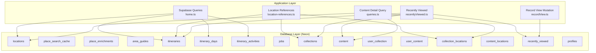
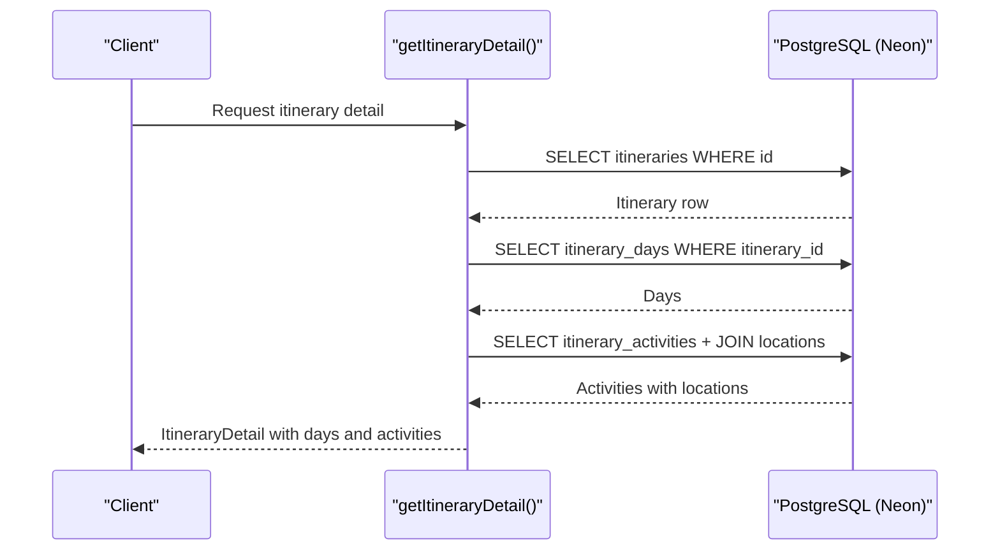
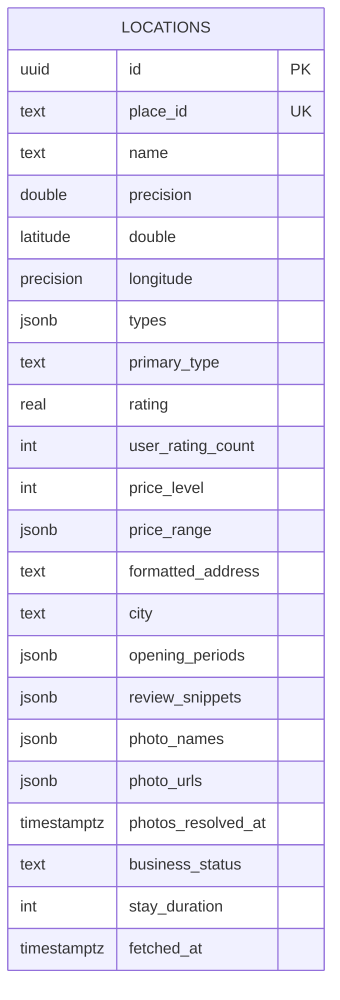
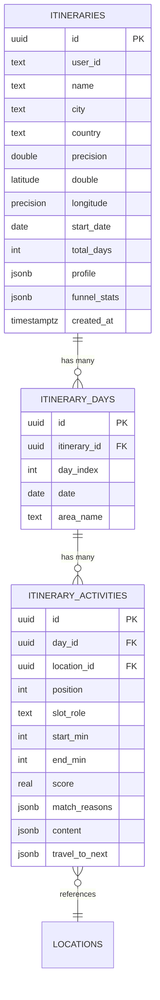
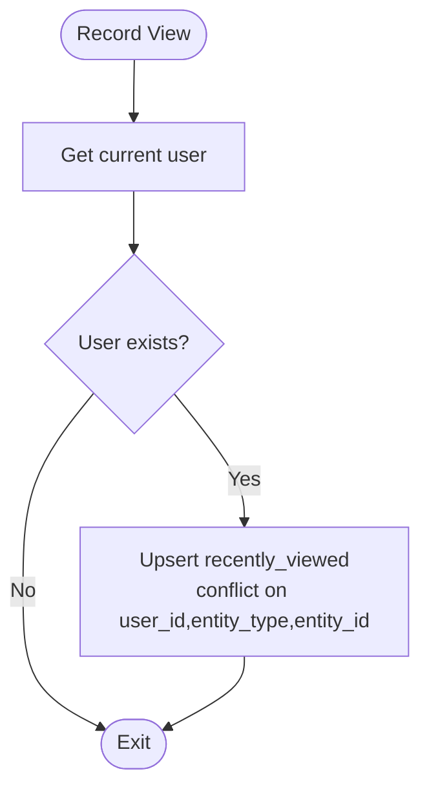
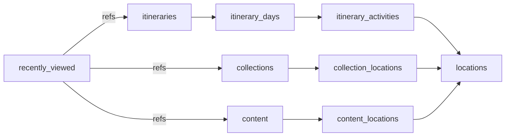

# Database Schema

<cite>
**Referenced Files in This Document**
- [personalization-pipeline.md](file://docs/personalization-pipeline.md)
- [home.ts](file://src/lib/supabase/queries/home.ts)
- [location-references.ts](file://src/lib/supabase/queries/location-references.ts)
- [recentlyViewed.ts](file://src/lib/supabase/queries/recentlyViewed.ts)
- [recordView.ts](file://src/lib/supabase/mutations/recordView.ts)
- [queries.ts](file://src/lib/supabase/queries.ts)
- [domain-types.ts](file://src/lib/domain-types.ts)
</cite>

## Table of Contents
1. [Introduction](#introduction)
2. [Project Structure](#project-structure)
3. [Core Components](#core-components)
4. [Architecture Overview](#architecture-overview)
5. [Detailed Component Analysis](#detailed-component-analysis)
6. [Dependency Analysis](#dependency-analysis)
7. [Performance Considerations](#performance-considerations)
8. [Troubleshooting Guide](#troubleshooting-guide)
9. [Conclusion](#conclusion)
10. [Appendices](#appendices)

## Introduction
This document describes the database schema and data models used by Argo for managing users, collections, itineraries, locations, content references, and related operational tables. It consolidates the canonical SQL schema (Neon/PostgreSQL) with the application’s query patterns to provide a single source of truth for entity relationships, field definitions, constraints, indexing strategy, sample structures, common queries, migration and backup guidance, privacy/security considerations, and extension recommendations.

## Project Structure
The repository uses Supabase client libraries to interact with a PostgreSQL-backed database (Neon). The canonical schema is documented in the project’s design notes and is enforced via Drizzle migrations during development. Application code defines typed queries and mutations that operate on these tables.

**Diagram sources**
- [personalization-pipeline.md:802-925](file://docs/personalization-pipeline.md#L802-L925)
- [home.ts:159-303](file://src/lib/supabase/queries/home.ts#L159-L303)
- [location-references.ts:62-166](file://src/lib/supabase/queries/location-references.ts#L62-L166)
- [recentlyViewed.ts:13-93](file://src/lib/supabase/queries/recentlyViewed.ts#L13-L93)
- [recordView.ts:5-24](file://src/lib/supabase/mutations/recordView.ts#L5-L24)
- [queries.ts:50-99](file://src/lib/supabase/queries.ts#L50-L99)

**Section sources**
- [personalization-pipeline.md:802-925](file://docs/personalization-pipeline.md#L802-L925)
- [home.ts:159-303](file://src/lib/supabase/queries/home.ts#L159-L303)
- [location-references.ts:62-166](file://src/lib/supabase/queries/location-references.ts#L62-L166)
- [recentlyViewed.ts:13-93](file://src/lib/supabase/queries/recentlyViewed.ts#L13-L93)
- [recordView.ts:5-24](file://src/lib/supabase/mutations/recordView.ts#L5-L24)
- [queries.ts:50-99](file://src/lib/supabase/queries.ts#L50-L99)

## Core Components
This section summarizes the primary entities and their roles:

- Locations: Canonical place records cached from external APIs, including geospatial attributes, ratings, pricing, opening hours, photos, and enrichment metadata.
- Itineraries: User-owned plans spanning multiple days, each day containing ordered activities.
- Itinerary Days: Per-day containers within an itinerary with date and optional area label.
- Itinerary Activities: Ordered slots per day referencing locations and scheduling metadata.
- Collections: Reusable sets of locations; some are linked to itineraries.
- Content: Saved links or articles with processing status and derived location associations.
- Junctions: collection_locations and content_locations associate entities with locations.
- Recently Viewed: Per-user history of viewed entities for quick access.
- Jobs: Background job queue for asynchronous tasks such as enrichment or planning.
- Profiles: Minimal user profile rows referenced by queries.

Key relationships:
- Itinerary → Itinerary Days → Itinerary Activities → Locations
- Collections ↔ Locations via collection_locations
- Content ↔ Locations via content_locations
- Users ↔ Itineraries/Collections/Content via RLS-scoped joins (user_itinerary, user_collection, user_content)
- Recently Viewed → Entities (links, collections, itineraries)

**Section sources**
- [personalization-pipeline.md:802-925](file://docs/personalization-pipeline.md#L802-L925)
- [home.ts:159-303](file://src/lib/supabase/queries/home.ts#L159-L303)
- [location-references.ts:62-166](file://src/lib/supabase/queries/location-references.ts#L62-L166)
- [recentlyViewed.ts:13-93](file://src/lib/supabase/queries/recentlyViewed.ts#L13-L93)
- [queries.ts:50-99](file://src/lib/supabase/queries.ts#L50-L99)

## Architecture Overview
The system separates read-heavy retrieval (e.g., itinerary detail, recent content) from write paths (e.g., recording views). Queries compose joins across core entities and junction tables, while background jobs handle long-running work.

**Diagram sources**
- [home.ts:159-303](file://src/lib/supabase/queries/home.ts#L159-L303)
- [personalization-pipeline.md:802-925](file://docs/personalization-pipeline.md#L802-L925)

## Detailed Component Analysis

### Locations
- Purpose: Central cache of places with geospatial and business attributes.
- Key fields: id (UUID PK), place_id (unique text), name, latitude/longitude, types (JSONB array), primary_type, rating/user_rating_count, price_level, price_range (JSONB), formatted_address, city, opening_periods (JSONB), review_snippets (JSONB), photo_names/photo_urls (JSONB), photos_resolved_at, business_status, stay_duration, fetched_at.
- Constraints: Primary key on id; unique on place_id; JSONB defaults; timestamps default to now().
- Indexes: city (B-tree); types (GIN) for efficient filtering by category tags.
- Notes: Enrichment backfills stay_duration; photos resolved lazily to control costs.

**Diagram sources**
- [personalization-pipeline.md:802-839](file://docs/personalization-pipeline.md#L802-L839)

**Section sources**
- [personalization-pipeline.md:802-839](file://docs/personalization-pipeline.md#L802-L839)

### Place Search Cache
- Purpose: Short-lived cache of search results to reduce API calls.
- Fields: query_hash (PK), place_ids (JSONB), created_at, expires_at (default +30 days).
- Usage: Lookup by hash before calling external search APIs.

**Section sources**
- [personalization-pipeline.md:833-839](file://docs/personalization-pipeline.md#L833-L839)

### AI Enrichments and Area Guides
- place_enrichments: Stores LLM-derived descriptions/tags/confidence/time windows/dishes; keyed by place_id with model/prompt_version/source_hash and TTL.
- area_guides: Area-level narrative and highlights with TTL.
- Indexes: expiry-based index for cleanup.

**Section sources**
- [personalization-pipeline.md:841-867](file://docs/personalization-pipeline.md#L841-L867)

### Itineraries, Days, and Activities
- Itineraries: Plan metadata, geolocation, dates, duration, profile JSON, funnel stats, created_at.
- Itinerary Days: One row per day with unique (itinerary_id, day_index).
- Itinerary Activities: Ordered slot per day with position, slot_role, start_min/end_min (minutes from midnight), score, match_reasons (JSONB), content (JSONB), travel_to_next (JSONB), FK to locations.
- Relationships: Itineraries → Days → Activities → Locations.

**Diagram sources**
- [personalization-pipeline.md:869-908](file://docs/personalization-pipeline.md#L869-L908)

**Section sources**
- [personalization-pipeline.md:869-908](file://docs/personalization-pipeline.md#L869-L908)

### Collections, Content, and Location Junctions
- Collections: Named sets of locations; some are itinerary-linked.
- Content: Saved links/articles with processing status and derived fields.
- Junctions:
  - collection_locations: Associates collections with locations.
  - content_locations: Associates content with locations.
- Access control: RLS scopes queries to user-owned or shared items.

Common usage:
- Recent content lists join user_* tables to filter by ownership and archive/bookmark flags.
- “Also found in” resolves all collections/itineraries containing a location, excluding the current container.

**Section sources**
- [home.ts:369-400](file://src/lib/supabase/queries/home.ts#L369-L400)
- [home.ts:441-535](file://src/lib/supabase/queries/home.ts#L441-L535)
- [location-references.ts:62-166](file://src/lib/supabase/queries/location-references.ts#L62-L166)
- [queries.ts:50-99](file://src/lib/supabase/queries.ts#L50-L99)

### Recently Viewed
- Purpose: Track last-seen entities per user for quick navigation.
- Fields: user_id, entity_type (link/collection/itinerary), entity_id, viewed_at.
- Upsert behavior: Inserts or updates based on composite conflict key.

**Diagram sources**
- [recordView.ts:5-24](file://src/lib/supabase/mutations/recordView.ts#L5-L24)

**Section sources**
- [recordView.ts:5-24](file://src/lib/supabase/mutations/recordView.ts#L5-L24)
- [recentlyViewed.ts:13-93](file://src/lib/supabase/queries/recentlyViewed.ts#L13-L93)

### Profiles
- Minimal user profile table with id, email, display_name, avatar_url.
- Used for fetching profile details and collaborator info.

**Section sources**
- [queries.ts:7-29](file://src/lib/supabase/queries.ts#L7-L29)

## Dependency Analysis
- Itinerary detail composes multiple tables: itineraries, itinerary_days, itinerary_activities, and locations. Ordering relies on position then start_time.
- “Also found in” depends on collection_locations and resolves itinerary-linked collections to itineraries.
- Recently viewed aggregates across collections, itineraries, and content using a single history table.
- Content detail includes nested joins through content_locations to locations.

**Diagram sources**
- [home.ts:159-303](file://src/lib/supabase/queries/home.ts#L159-L303)
- [location-references.ts:62-166](file://src/lib/supabase/queries/location-references.ts#L62-L166)
- [recentlyViewed.ts:13-93](file://src/lib/supabase/queries/recentlyViewed.ts#L13-L93)
- [queries.ts:50-99](file://src/lib/supabase/queries.ts#L50-L99)

**Section sources**
- [home.ts:159-303](file://src/lib/supabase/queries/home.ts#L159-L303)
- [location-references.ts:62-166](file://src/lib/supabase/queries/location-references.ts#L62-L166)
- [recentlyViewed.ts:13-93](file://src/lib/supabase/queries/recentlyViewed.ts#L13-L93)
- [queries.ts:50-99](file://src/lib/supabase/queries.ts#L50-L99)

## Performance Considerations
- Indexing strategy:
  - locations.city for city-filtered queries.
  - locations.types GIN index for JSONB array containment filters.
  - place_enrichments.expires_at for TTL-based cleanup.
  - jobs.status, created_at for job polling and ordering.
- Time representation:
  - Itinerary activities store start_min/end_min as integers (minutes from midnight) to avoid timezone issues and simplify comparisons.
- Caching:
  - place_search_cache with 30-day TTL reduces external API calls.
  - Enrichment cache with 90-day TTL and model/prompt invalidation keys.
- Query composition:
  - Use selective projections (e.g., only needed location fields) to minimize payload size.
  - Leverage RLS to avoid client-side scoping logic.

[No sources needed since this section provides general guidance]

## Troubleshooting Guide
- Itinerary activity ordering:
  - Ensure position is set; it is authoritative for display order. Fallback tie-break uses start_time for legacy rows.
- Realtime hydration mismatches:
  - Keep select projections and realtime column lists in sync with the canonical schema to prevent silent undefined fields after edits.
- Recently viewed upserts:
  - Confirm conflict target matches the intended uniqueness (user_id, entity_type, entity_id).
- Enrichment misses:
  - Check model and prompt_version changes; stale entries may be invalidated intentionally.

**Section sources**
- [home.ts:192-212](file://src/lib/supabase/queries/home.ts#L192-L212)
- [personalization-pipeline.md:779-800](file://docs/personalization-pipeline.md#L779-L800)
- [recordView.ts:15-23](file://src/lib/supabase/mutations/recordView.ts#L15-L23)
- [personalization-pipeline.md:927-948](file://docs/personalization-pipeline.md#L927-L948)

## Conclusion
Argo’s schema centers around a robust locations cache, structured itineraries with precise time handling, flexible collections/content with location associations, and supporting caches and queues. The design emphasizes type safety, performance via targeted indexes and caching, and clear separation between storage semantics and presentation concerns. Extending the schema should follow the established patterns: add columns with defaults, update Drizzle definitions, and ensure query projections remain synchronized.

[No sources needed since this section summarizes without analyzing specific files]

## Appendices

### Field Definitions and Constraints Summary
- locations:
  - PK: id (UUID)
  - Unique: place_id
  - JSONB: types, price_range, opening_periods, review_snippets, photo_names, photo_urls, match_reasons, content, travel_to_next
  - Timestamps: photos_resolved_at, fetched_at (default now())
- itineraries:
  - PK: id (UUID)
  - Required: name, city, start_date, total_days
  - JSONB: profile, funnel_stats
- itinerary_days:
  - PK: id (UUID)
  - Unique: (itinerary_id, day_index)
- itinerary_activities:
  - PK: id (UUID)
  - Unique: (day_id, position)
  - Integers: start_min, end_min (minutes from midnight)
  - JSONB: match_reasons, content, travel_to_next
- place_search_cache:
  - PK: query_hash
  - TTL: expires_at default now() + 30 days
- place_enrichments:
  - PK: place_id (FK to locations.place_id)
  - Checks: best_time_of_day, crowd_profile
  - TTL: expires_at default now() + 90 days
- area_guides:
  - PK: area_key
  - TTL: expires_at default now() + 90 days
- jobs:
  - PK: id (UUID)
  - Status: queued/default; indexed for polling
- recently_viewed:
  - Conflict target: (user_id, entity_type, entity_id)

**Section sources**
- [personalization-pipeline.md:802-925](file://docs/personalization-pipeline.md#L802-L925)
- [recordView.ts:15-23](file://src/lib/supabase/mutations/recordView.ts#L15-L23)

### Common Query Patterns
- Itinerary detail:
  - Select itinerary base fields, then days constrained to date range, then activities ordered by position and start_time with joined locations.
- Also found in:
  - Resolve collection_locations for a location, fetch collection metadata and counts, map itinerary-linked collections to itineraries, sort by newest membership.
- Recently viewed:
  - Fetch per-user history, group by entity type, batch-fetch titles/thumbnails, attach preview images for collections.
- Content detail:
  - Select content row with nested content_locations → locations projection.

**Section sources**
- [home.ts:159-303](file://src/lib/supabase/queries/home.ts#L159-L303)
- [location-references.ts:62-166](file://src/lib/supabase/queries/location-references.ts#L62-L166)
- [recentlyViewed.ts:13-93](file://src/lib/supabase/queries/recentlyViewed.ts#L13-L93)
- [queries.ts:50-99](file://src/lib/supabase/queries.ts#L50-L99)

### Data Migration Strategy
- Use Drizzle schema definitions and migrations to evolve the database.
- Integration tests validate migrations against an empty Neon branch and round-trip inserts/selections.
- When adding columns, update Drizzle schema and ensure all query projections include the new fields to avoid runtime mismatches.

**Section sources**
- [personalization-pipeline.md:779-800](file://docs/personalization-pipeline.md#L779-L800)
- [implementation-plan.md:397-435](file://docs/implementation-plan.md#L397-L435)

### Backup Procedures
- Follow Neon’s native backup and restore capabilities (point-in-time recovery, manual snapshots).
- For critical datasets (e.g., locations, itineraries), schedule regular logical backups and verify restore procedures.
- Validate backups by restoring to a staging environment and running integration tests.

[No sources needed since this section provides general guidance]

### Data Integrity Measures
- Foreign keys:
  - itinerary_activities.day_id → itinerary_days.id
  - itinerary_activities.location_id → locations.id
  - place_enrichments.place_id → locations.place_id
  - jobs.itinerary_id → itineraries.id
- Constraints:
  - Unique constraints on (itinerary_days.itinerary_id, day_index) and (itinerary_activities.day_id, position).
  - Check constraints on enumerated fields in enrichments.
- Defaults:
  - Timestamps default to now(); JSONB arrays default to empty arrays.

**Section sources**
- [personalization-pipeline.md:841-925](file://docs/personalization-pipeline.md#L841-L925)

### Privacy, Security, and Access Control
- Row-Level Security (RLS):
  - Scopes queries on collections, itineraries, content, and user_* tables to enforce ownership and collaboration rules.
- Public sharing:
  - Itineraries and collections support public tokens for read-only access.
- Quotas and surfaces:
  - Domain types define shareable entities and quota categories to gate usage consistently.

**Section sources**
- [location-references.ts:3-8](file://src/lib/supabase/queries/location-references.ts#L3-L8)
- [home.ts:46-69](file://src/lib/supabase/queries/home.ts#L46-L69)
- [domain-types.ts:15-19](file://src/lib/domain-types.ts#L15-L19)

### Extending the Schema
Guidelines:
- Add new tables or columns with appropriate defaults and constraints.
- Update Drizzle schema and run migrations; ensure integration tests cover new fields.
- Synchronize query projections and realtime subscriptions to include new fields where needed.
- For new relationships, prefer explicit junction tables (e.g., like collection_locations) to maintain clarity and RLS scoping.
- For enumerations, use check constraints and TypeScript unions to keep backend and frontend aligned.

[No sources needed since this section provides general guidance]