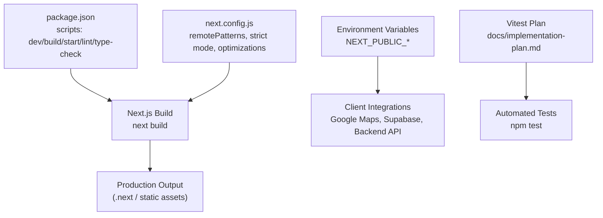
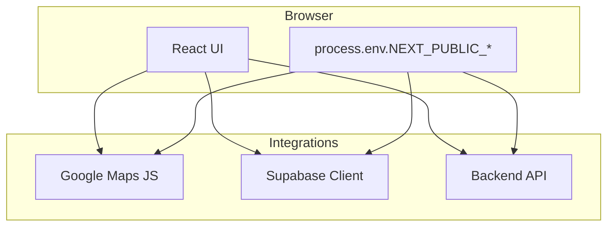
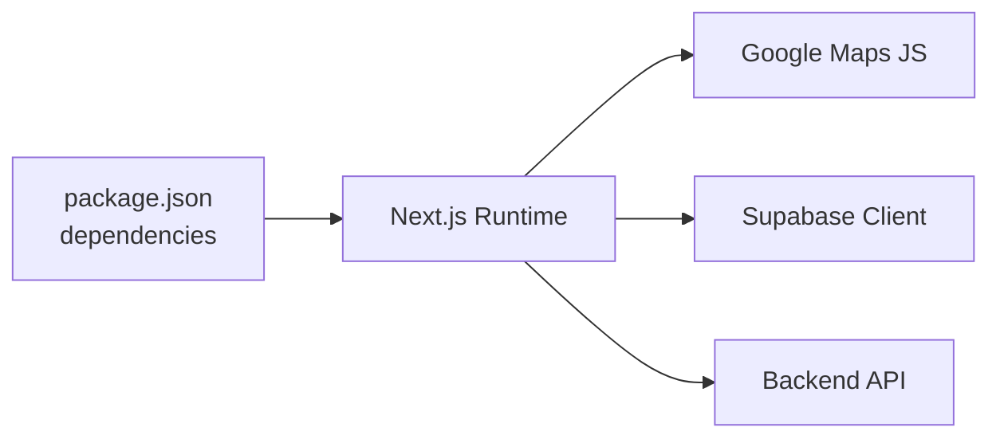

# Deployment & DevOps

<cite>
**Referenced Files in This Document**
- [package.json](file://package.json)
- [next.config.js](file://next.config.js)
- [AGENTS.md](file://AGENTS.md)
- [implementation-plan.md](file://docs/implementation-plan.md)
- [GoogleMapCluster.tsx](file://src/components/ui/map/GoogleMapCluster.tsx)
- [GoogleMapDetail.tsx](file://src/components/ui/map/GoogleMapDetail.tsx)
- [PlaceAutocomplete.tsx](file://src/components/ui/primitives/PlaceAutocomplete.tsx)
- [client.ts](file://src/lib/api/client.ts)
- [attachments.ts](file://src/lib/api/attachments.ts)
- [flights.ts](file://src/lib/api/flights.ts)
- [lodgings.ts](file://src/lib/api/lodgings.ts)
- [collections.ts](file://src/lib/api/collections.ts)
- [itineraries.ts](file://src/lib/api/itineraries.ts)
- [site.ts](file://src/lib/site.ts)
- [client.ts](file://src/lib/supabase/client.ts)
</cite>

## Table of Contents
1. Introduction
2. Project Structure
3. Core Components
4. Architecture Overview
5. Detailed Component Analysis
6. Dependency Analysis
7. Performance Considerations
8. Troubleshooting Guide
9. Conclusion
10. Appendices

## Introduction
This document provides deployment and DevOps guidance for Argo, a Next.js 15 application with React 19, TypeScript, Tailwind v4, Supabase client usage, and Google Maps integration. It covers build configuration, environment variables, CI/CD setup, automated testing, hosting on Vercel/Netlify/custom platforms, monitoring/logging, error tracking, performance, security (including SSL), environment-specific configurations, scaling, load balancing, disaster recovery, debugging, log analysis, and maintenance procedures.

## Project Structure
Argo is a Next.js App Router project. The build and runtime behavior are defined by package scripts and Next configuration. Environment variables drive external integrations such as Google Maps and the backend API. Tests are organized under a test-first plan using Vitest.

**Diagram sources**
- [package.json:5-10](file://package.json#L5-L10)
- [next.config.js:1-17](file://next.config.js#L1-L17)
- [implementation-plan.md:67-99](file://docs/implementation-plan.md#L67-L99)

**Section sources**
- [package.json:5-10](file://package.json#L5-L10)
- [next.config.js:1-17](file://next.config.js#L1-L17)
- [implementation-plan.md:67-99](file://docs/implementation-plan.md#L67-L99)

## Core Components
- Build and runtime scripts: development, build, start, lint, type checking.
- Next configuration: strict mode, dev indicators off, experimental import optimization, remote image patterns for Unsplash, UI avatars, and Supabase storage.
- Environment-driven integrations: Google Maps keys and map IDs, backend API base URL, site URL, Supabase credentials.
- Testing harness: Vitest-based pipeline with a detailed implementation plan.

**Section sources**
- [package.json:5-10](file://package.json#L5-L10)
- [next.config.js:1-17](file://next.config.js#L1-L17)
- [AGENTS.md:72-75](file://AGENTS.md#L72-L75)
- [implementation-plan.md:67-99](file://docs/implementation-plan.md#L67-L99)

## Architecture Overview
At runtime, the browser loads the Next.js app and calls:
- Google Maps via environment variables for maps and autocomplete.
- Supabase client for realtime or data operations.
- Backend API endpoints through a shared client configured by NEXT_PUBLIC_API_URL.

**Diagram sources**
- [GoogleMapCluster.tsx:9-11](file://src/components/ui/map/GoogleMapCluster.tsx#L9-L11)
- [GoogleMapDetail.tsx:23-25](file://src/components/ui/map/GoogleMapDetail.tsx#L23-L25)
- [PlaceAutocomplete.tsx:21-21](file://src/components/ui/primitives/PlaceAutocomplete.tsx#L21-L21)
- [client.ts:3-3](file://src/lib/api/client.ts#L3-L3)
- [client.ts:5-6](file://src/lib/supabase/client.ts#L5-L6)

## Detailed Component Analysis

### Build Process Configuration
- Scripts:
  - Development: next dev with Turbopack.
  - Build: next build.
  - Start: next start.
  - Lint: next lint.
  - Type check: tsc --noEmit.
- Next config highlights:
  - reactStrictMode enabled.
  - devIndicators disabled for production clarity.
  - Experimental optimizePackageImports for lucide-react and @base-ui/react.
  - images.remotePatterns allow Unsplash, ui-avatars.com, and Supabase public storage paths.

Operational notes:
- Ensure environment variables are set before build/start to avoid degraded features (e.g., missing Google Maps keys).
- Use type-checking in CI to catch issues early.

**Section sources**
- [package.json:5-10](file://package.json#L5-L10)
- [next.config.js:1-17](file://next.config.js#L1-L17)

### Environment Variable Management
Key variables used across the app:
- NEXT_PUBLIC_GOOGLE_MAPS_API_KEY: Used by map components and autocomplete.
- NEXT_PUBLIC_GOOGLE_MAPS_MAP_ID_LIGHT / NEXT_PUBLIC_GOOGLE_MAPS_MAP_ID_DARK: Map style IDs per theme.
- NEXT_PUBLIC_API_URL: Base URL for backend API calls; defaults to localhost when not set.
- NEXT_PUBLIC_SITE_URL: Site URL for crawlers/social previews; defaults to localhost.
- NEXT_PUBLIC_SUPABASE_URL / NEXT_PUBLIC_SUPABASE_ANON_KEY: Supabase client configuration.

Best practices:
- Never commit secrets; use platform secret managers or .env files excluded from version control.
- Validate required keys at startup or during build to fail fast.
- Provide sensible defaults for local development while enforcing presence in production.

**Section sources**
- [GoogleMapCluster.tsx:9-11](file://src/components/ui/map/GoogleMapCluster.tsx#L9-L11)
- [GoogleMapDetail.tsx:23-25](file://src/components/ui/map/GoogleMapDetail.tsx#L23-L25)
- [PlaceAutocomplete.tsx:21-21](file://src/components/ui/primitives/PlaceAutocomplete.tsx#L21-L21)
- [client.ts:3-3](file://src/lib/api/client.ts#L3-L3)
- [attachments.ts:4-4](file://src/lib/api/attachments.ts#L4-L4)
- [flights.ts:4-4](file://src/lib/api/flights.ts#L4-L4)
- [lodgings.ts:5-5](file://src/lib/api/lodgings.ts#L5-L5)
- [collections.ts:165-165](file://src/lib/api/collections.ts#L165-L165)
- [collections.ts:196-196](file://src/lib/api/collections.ts#L196-L196)
- [itineraries.ts:479-479](file://src/lib/api/itineraries.ts#L479-L479)
- [itineraries.ts:521-521](file://src/lib/api/itineraries.ts#L521-L521)
- [site.ts:2-5](file://src/lib/site.ts#L2-L5)
- [client.ts:5-6](file://src/lib/supabase/client.ts#L5-L6)
- [AGENTS.md:72-75](file://AGENTS.md#L72-L75)

### Hosting Configuration

#### Vercel
- Recommended for Next.js apps.
- Set environment variables in Vercel dashboard or .env files.
- Build command: next build.
- Output directory: .next (handled automatically).
- Remote image domains are already whitelisted in Next config for Unsplash, ui-avatars.com, and Supabase storage.

#### Netlify
- Build command: next build.
- Publish directory: .next or framework-specific output if configured.
- Configure environment variables in Netlify UI.
- For SPA fallback, ensure routing rules match Next.js rewrites if needed.

#### Custom Deployments (Docker/Nginx)
- Build locally or in CI: next build.
- Serve static assets and serverless functions (if any) with a web server like Nginx or Node runtime.
- Ensure HTTPS termination at the edge (Nginx/Traefik/Let’s Encrypt) and forward to the app.
- Set environment variables at runtime.

[No sources needed since this section provides general guidance]

### CI/CD Pipeline Setup
Recommended stages:
- Install dependencies.
- Run linter: npm run lint.
- Run type checks: npm run type-check.
- Run tests: npm test (Vitest).
- Build: npm run build.
- Deploy artifacts or push to platform.

Pipeline tips:
- Cache node_modules to speed up builds.
- Fail fast on lint/type errors.
- Store build artifacts for rollback.
- Use environment-specific secrets for each stage.

**Section sources**
- [package.json:5-10](file://package.json#L5-L10)
- [implementation-plan.md:67-99](file://docs/implementation-plan.md#L67-L99)

### Automated Testing
- Test runner: Vitest with TypeScript and path aliases.
- Scripts: npm test (run), npm run type-check.
- Strategy: test-first for core logic; seams for external clients; golden snapshots for end-to-end stability.

Execution:
- Run full suite in CI before merging.
- Isolate flaky or network-dependent tests behind flags or mocks.

**Section sources**
- [implementation-plan.md:67-99](file://docs/implementation-plan.md#L67-L99)
- [package.json:5-10](file://package.json#L5-L10)

### Deployment Automation
- Trigger deployments on main branch pushes or PRs to preview environments.
- Use platform-native previews (Vercel/Netlify) for automatic deploys.
- Promote successful builds to production after passing all gates.

[No sources needed since this section provides general guidance]

### Monitoring and Logging Strategies
- Frontend logging:
  - Log technical details to console.error; surface user-friendly messages via error utilities referenced in documentation.
- Error tracking:
  - Integrate an error reporting service (e.g., Sentry) in the browser and server boundaries.
  - Capture context: route, user session (if available), feature flags, environment.
- Metrics:
  - Track key interactions and performance metrics (Time to First Byte, Largest Contentful Paint, Interaction to Next Paint).
  - Instrument API calls for latency and error rates.
- Logs:
  - Centralize logs in a log management platform.
  - Include correlation IDs for request tracing.

[No sources needed since this section provides general guidance]

### Security Considerations for Production
- Secrets management:
  - Store all secrets in platform secret stores; never commit .env files.
  - Rotate keys regularly.
- Input validation and sanitization:
  - Validate all inputs at API boundaries.
  - Sanitize outputs to prevent XSS.
- CORS and CSP:
  - Restrict allowed origins for APIs.
  - Configure Content Security Policy headers.
- SSL/TLS:
  - Enforce HTTPS everywhere.
  - Use modern TLS versions and strong cipher suites.
  - Redirect HTTP to HTTPS.
- External services:
  - Limit scopes for API keys (Google Maps, Supabase).
  - Use least privilege access.

[No sources needed since this section provides general guidance]

### Environment-Specific Configurations
- Local:
  - NEXT_PUBLIC_API_URL may default to localhost; configure accordingly.
  - Provide Google Maps keys for full functionality.
- Preview/Staging:
  - Mirror production environment variables.
  - Enable verbose logging for debugging.
- Production:
  - Enforce required variables.
  - Disable dev-only features and indicators.

**Section sources**
- [client.ts:3-3](file://src/lib/api/client.ts#L3-L3)
- [AGENTS.md:72-75](file://AGENTS.md#L72-L75)

### Scaling Considerations and Load Balancing
- Horizontal scaling:
  - Stateless app instances behind a load balancer.
  - Use CDN for static assets and images.
- Database and caching:
  - Scale read replicas if using a database.
  - Implement caching layers for expensive computations.
- Rate limiting:
  - Protect APIs with rate limiting at the edge.
- Auto-scaling:
  - Configure auto-scaling policies based on CPU/memory or request throughput.

[No sources needed since this section provides general guidance]

### Disaster Recovery Procedures
- Backups:
  - Regular backups of databases and critical assets.
  - Test restore procedures periodically.
- Rollback strategy:
  - Keep previous builds available for quick rollback.
- Incident response:
  - Define runbooks for common failures.
  - Alerting thresholds and escalation paths.

[No sources needed since this section provides general guidance]

### Debugging Production Issues
- Symptom triage:
  - Check error tracking dashboards for spikes.
  - Correlate with recent deployments and environment changes.
- Log analysis:
  - Filter by correlation ID, user agent, and endpoint.
  - Look for repeated error patterns and upstream timeouts.
- Reproduction:
  - Use feature flags to isolate problematic code paths.
  - Replay requests with sanitized payloads.

[No sources needed since this section provides general guidance]

### Maintenance Procedures
- Dependency updates:
  - Schedule regular updates; test thoroughly before promotion.
- Key rotation:
  - Plan rotations for API keys and certificates.
- Health checks:
  - Implement health endpoints and monitor uptime.
- Documentation:
  - Keep runbooks and architecture docs current.

[No sources needed since this section provides general guidance]

## Dependency Analysis
The app depends on:
- Next.js runtime and build toolchain.
- Google Maps JS SDK for mapping features.
- Supabase client for realtime/data operations.
- Backend API accessed via NEXT_PUBLIC_API_URL.

**Diagram sources**
- [package.json:12-32](file://package.json#L12-L32)
- [client.ts:3-3](file://src/lib/api/client.ts#L3-L3)
- [client.ts:5-6](file://src/lib/supabase/client.ts#L5-L6)

**Section sources**
- [package.json:12-32](file://package.json#L12-L32)
- [client.ts:3-3](file://src/lib/api/client.ts#L3-L3)
- [client.ts:5-6](file://src/lib/supabase/client.ts#L5-L6)

## Performance Considerations
- Build-time optimizations:
  - Experimental optimizePackageImports reduces bundle size for specific libraries.
- Image handling:
  - Whitelist remote image domains to enable optimized delivery.
- Runtime:
  - Minimize client-side work; leverage server components where possible.
  - Use caching strategies for API responses and external data.
- Monitoring:
  - Track Core Web Vitals and API latency.

**Section sources**
- [next.config.js:5-13](file://next.config.js#L5-L13)

## Troubleshooting Guide
Common issues and resolutions:
- Missing Google Maps keys:
  - Symptoms: maps and autocomplete degrade or fail to load.
  - Resolution: set NEXT_PUBLIC_GOOGLE_MAPS_API_KEY and map IDs.
- Backend API unreachable:
  - Symptoms: API calls fail or timeout.
  - Resolution: verify NEXT_PUBLIC_API_URL and network connectivity; add retries and backoff.
- Supabase connection errors:
  - Symptoms: realtime or queries fail.
  - Resolution: validate NEXT_PUBLIC_SUPABASE_URL and ANON_KEY; check permissions.
- Image loading failures:
  - Symptoms: images not displayed.
  - Resolution: ensure remotePatterns include the domain; check CORS and network.

**Section sources**
- [GoogleMapCluster.tsx:9-11](file://src/components/ui/map/GoogleMapCluster.tsx#L9-L11)
- [GoogleMapDetail.tsx:23-25](file://src/components/ui/map/GoogleMapDetail.tsx#L23-L25)
- [PlaceAutocomplete.tsx:21-21](file://src/components/ui/primitives/PlaceAutocomplete.tsx#L21-L21)
- [client.ts:3-3](file://src/lib/api/client.ts#L3-L3)
- [client.ts:5-6](file://src/lib/supabase/client.ts#L5-L6)
- [next.config.js:8-13](file://next.config.js#L8-L13)

## Conclusion
Argo’s deployment model centers on Next.js build and runtime, environment-driven integrations, and a robust testing strategy. By configuring environment variables securely, automating CI/CD, and implementing monitoring and security best practices, you can deploy reliably to Vercel, Netlify, or custom platforms. Continuous improvement through performance monitoring, error tracking, and maintenance procedures ensures long-term stability and scalability.

## Appendices

### Environment Variables Reference
- NEXT_PUBLIC_GOOGLE_MAPS_API_KEY
- NEXT_PUBLIC_GOOGLE_MAPS_MAP_ID_LIGHT
- NEXT_PUBLIC_GOOGLE_MAPS_MAP_ID_DARK
- NEXT_PUBLIC_API_URL
- NEXT_PUBLIC_SITE_URL
- NEXT_PUBLIC_SUPABASE_URL
- NEXT_PUBLIC_SUPABASE_ANON_KEY

**Section sources**
- [GoogleMapCluster.tsx:9-11](file://src/components/ui/map/GoogleMapCluster.tsx#L9-L11)
- [GoogleMapDetail.tsx:23-25](file://src/components/ui/map/GoogleMapDetail.tsx#L23-L25)
- [PlaceAutocomplete.tsx:21-21](file://src/components/ui/primitives/PlaceAutocomplete.tsx#L21-L21)
- [client.ts:3-3](file://src/lib/api/client.ts#L3-L3)
- [site.ts:2-5](file://src/lib/site.ts#L2-L5)
- [client.ts:5-6](file://src/lib/supabase/client.ts#L5-L6)