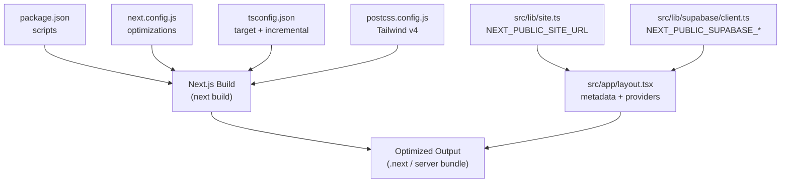
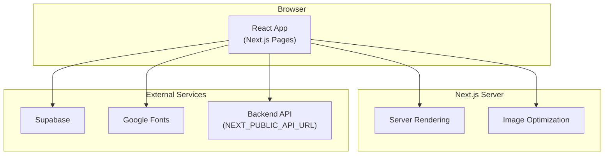
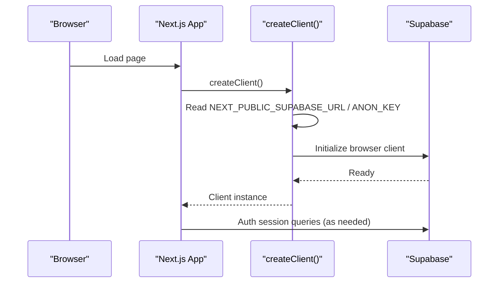
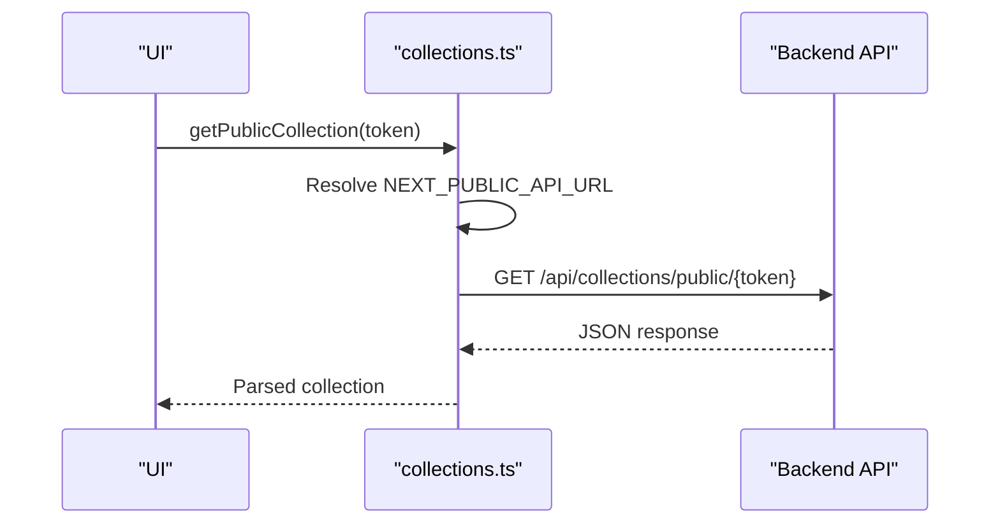

# Deployment & Production

<cite>
**Referenced Files in This Document**
- [package.json](file://package.json)
- [next.config.js](file://next.config.js)
- [tsconfig.json](file://tsconfig.json)
- [postcss.config.js](file://postcss.config.js)
- [.gitignore](file://.gitignore)
- [src/app/layout.tsx](file://src/app/layout.tsx)
- [src/lib/site.ts](file://src/lib/site.ts)
- [src/lib/supabase/client.ts](file://src/lib/supabase/client.ts)
- [src/lib/api/collections.ts](file://src/lib/api/collections.ts)
</cite>

## Table of Contents
1. Introduction
2. Project Structure
3. Core Components
4. Architecture Overview
5. Detailed Component Analysis
6. Dependency Analysis
7. Performance Considerations
8. Troubleshooting Guide
9. Conclusion
10. Appendices

## Introduction
This document provides production-ready guidance for building, configuring, deploying, and operating this Next.js application. It covers build optimization, environment configuration, deployment strategies, caching, performance tuning, monitoring, scaling, backups, and maintenance procedures. The goal is to help teams ship reliably and maintain high availability and performance in production.

## Project Structure
The project is a Next.js application with:
- Build and runtime scripts defined in package.json
- Next.js configuration for strict mode, development indicators, experimental optimizations, and image remote patterns
- TypeScript configuration targeting modern JS and enabling incremental builds
- PostCSS configured for Tailwind CSS v4 via the PostCSS plugin
- Environment variables used at build/runtime for site origin and Supabase client credentials
- A root layout that sets metadata, fonts, and global providers

**Diagram sources**
- [package.json:5-12](file://package.json#L5-L12)
- [next.config.js:1-17](file://next.config.js#L1-L17)
- [tsconfig.json:1-28](file://tsconfig.json#L1-L28)
- [postcss.config.js:1-6](file://postcss.config.js#L1-L6)
- [src/app/layout.tsx:1-85](file://src/app/layout.tsx#L1-L85)
- [src/lib/site.ts:1-7](file://src/lib/site.ts#L1-L7)
- [src/lib/supabase/client.ts:1-9](file://src/lib/supabase/client.ts#L1-L9)

**Section sources**
- [package.json:5-12](file://package.json#L5-L12)
- [next.config.js:1-17](file://next.config.js#L1-L17)
- [tsconfig.json:1-28](file://tsconfig.json#L1-L28)
- [postcss.config.js:1-6](file://postcss.config.js#L1-L6)
- [src/app/layout.tsx:1-85](file://src/app/layout.tsx#L1-L85)

## Core Components
- Build pipeline: next build produces optimized assets and server bundles; next start runs the production server.
- Image optimization: Remote image domains are explicitly allowed for Next.js Image optimization.
- Font loading: Google Fonts are preconnected and loaded via next/font to minimize layout shifts.
- Environment-driven origins: Canonical site URL is derived from an environment variable to ensure correct metadata and social tags.
- Client SDK initialization: Supabase browser client is created using public environment variables.

**Section sources**
- [package.json:5-12](file://package.json#L5-L12)
- [next.config.js:8-14](file://next.config.js#L8-L14)
- [src/app/layout.tsx:19-49](file://src/app/layout.tsx#L19-L49)
- [src/lib/site.ts:1-7](file://src/lib/site.ts#L1-L7)
- [src/lib/supabase/client.ts:1-9](file://src/lib/supabase/client.ts#L1-L9)

## Architecture Overview
At runtime, the Next.js server serves pages and API routes (if any), while the client hydrates React components. External services include:
- Supabase for authentication and data
- Google Fonts for typography
- Optional external APIs referenced by environment variables

**Diagram sources**
- [src/app/layout.tsx:19-49](file://src/app/layout.tsx#L19-L49)
- [next.config.js:8-14](file://next.config.js#L8-L14)
- [src/lib/supabase/client.ts:1-9](file://src/lib/supabase/client.ts#L1-L9)
- [src/lib/api/collections.ts:195-198](file://src/lib/api/collections.ts#L195-L198)

## Detailed Component Analysis

### Build and Runtime Scripts
- Development uses Turbopack for fast iteration.
- Production build uses next build to generate optimized output.
- Production server uses next start.
- Type checking and linting are available as separate commands.

Operational notes:
- Ensure CI caches node_modules and .next to speed up builds.
- Pin Node.js version compatible with Next.js 15.x.
- Use environment variables during build and runtime as needed.

**Section sources**
- [package.json:5-12](file://package.json#L5-L12)

### Next.js Configuration and Asset Optimization
Key production-relevant settings:
- Strict mode enabled for safer runtime behavior.
- Development indicators disabled in production.
- Experimental package import optimization reduces bundle size for selected libraries.
- Image remotePatterns allow Next.js to optimize images from specific hosts.

Recommendations:
- Keep only necessary remotePatterns to reduce attack surface.
- Validate image URLs at runtime to avoid misconfiguration.
- Monitor bundle size and tree-shaking effectiveness.

**Section sources**
- [next.config.js:1-17](file://next.config.js#L1-L17)

### TypeScript and Incremental Builds
- Target ES2022 for modern runtime features.
- Incremental compilation enabled to speed up builds.
- Path aliases simplify imports and improve maintainability.

Operational notes:
- Run type checks in CI to catch issues early.
- Keep dependencies aligned with supported TS versions.

**Section sources**
- [tsconfig.json:1-28](file://tsconfig.json#L1-L28)

### PostCSS and Tailwind CSS v4
- PostCSS configured with the Tailwind v4 plugin.
- Ensure your styles use Tailwind v4 syntax and utilities.

Operational notes:
- Verify CSS purge/tree-shake behavior in production builds.
- Avoid large custom CSS that bypasses Tailwind’s optimizations.

**Section sources**
- [postcss.config.js:1-6](file://postcss.config.js#L1-L6)

### Environment Variables and Origins
- NEXT_PUBLIC_SITE_URL defines the canonical site origin for metadata and Open Graph tags.
- NEXT_PUBLIC_SUPABASE_URL and NEXT_PUBLIC_SUPABASE_ANON_KEY configure the Supabase browser client.
- NEXT_PUBLIC_API_URL configures backend API endpoints used by frontend modules.

Security and operational notes:
- Never commit secrets; use platform secret managers or CI/CD variables.
- Validate required variables exist before starting the server.
- For preview deployments, set NEXT_PUBLIC_SITE_URL to the preview domain.

**Section sources**
- [src/lib/site.ts:1-7](file://src/lib/site.ts#L1-L7)
- [src/lib/supabase/client.ts:1-9](file://src/lib/supabase/client.ts#L1-L9)
- [src/lib/api/collections.ts:195-198](file://src/lib/api/collections.ts#L195-L198)

### Root Layout and Metadata
- Sets metadata base URL using the canonical site origin.
- Configures title templates, description, Open Graph, Twitter cards, and robots indexing.
- Preconnects to font CDN to reduce latency.

Operational notes:
- Ensure robots rules align with your SEO strategy.
- Monitor font loading performance and consider self-hosting if needed.

**Section sources**
- [src/app/layout.tsx:19-49](file://src/app/layout.tsx#L19-L49)
- [src/app/layout.tsx:63-67](file://src/app/layout.tsx#L63-L67)

### Client Initialization Flow (Supabase)

**Diagram sources**
- [src/lib/supabase/client.ts:1-9](file://src/lib/supabase/client.ts#L1-L9)

**Section sources**
- [src/lib/supabase/client.ts:1-9](file://src/lib/supabase/client.ts#L1-L9)

### API Call Flow (Collections Public Endpoint)

**Diagram sources**
- [src/lib/api/collections.ts:195-198](file://src/lib/api/collections.ts#L195-L198)

**Section sources**
- [src/lib/api/collections.ts:195-198](file://src/lib/api/collections.ts#L195-L198)

## Dependency Analysis
- Next.js 15.x drives the build and runtime.
- React 19.x requires compatibility with Next.js 15.x.
- Supabase SSR client is used for browser-side auth/data access.
- Tailwind v4 via PostCSS plugin powers styling.
- Optional packages like lucide-react and @base-ui/react benefit from experimental import optimization.

Operational notes:
- Keep dependency versions pinned in lockfiles.
- Audit dependencies regularly for security updates.
- Monitor peer dependency conflicts during upgrades.

**Section sources**
- [package.json:14-48](file://package.json#L14-L48)

## Performance Considerations
- Build-time optimizations:
  - Use next build to produce optimized bundles.
  - Leverage experimental optimizePackageImports for select libraries.
  - Enable incremental builds via tsconfig to speed up rebuilds.
- Runtime optimizations:
  - Configure image remotePatterns to enable on-the-fly optimization.
  - Preconnect to third-party CDNs (e.g., fonts).
  - Minimize client-side JavaScript by moving logic to server where possible.
- Caching strategies:
  - Rely on Next.js static asset caching headers when deployed behind a CDN.
  - Set appropriate cache-control headers for API responses at the edge or API layer.
  - Use Supabase caching policies and query deduplication via React Query (if used).
- Monitoring:
  - Instrument error tracking and performance metrics at the edge and application level.
  - Track TTFB, LCP, CLS, and FID/INP via real user monitoring tools.

[No sources needed since this section provides general guidance]

## Troubleshooting Guide
Common issues and resolutions:
- Missing environment variables:
  - Ensure NEXT_PUBLIC_SITE_URL, NEXT_PUBLIC_SUPABASE_URL, NEXT_PUBLIC_SUPABASE_ANON_KEY, and NEXT_PUBLIC_API_URL are set in the deployment environment.
  - Validate presence at startup and fail fast with clear messages.
- Image optimization failures:
  - Confirm remotePatterns include all required domains.
  - Check CORS and network access for image sources.
- Font loading errors:
  - Verify preconnect links and CDN availability.
  - Consider fallback fonts and offline strategies if applicable.
- Authentication errors:
  - Use friendly error mapping to present user-friendly messages while logging technical details securely.
  - Inspect Supabase project settings and CORS configurations.

Operational tips:
- Centralize error handling and logging.
- Add health check endpoints for liveness/readiness probes.
- Use structured logs with correlation IDs for request tracing.

**Section sources**
- [src/lib/errors/userMessages.ts:1-106](file://src/lib/errors/userMessages.ts#L1-L106)

## Conclusion
This Next.js application is well-suited for production with modern tooling and clear configuration points. By following the build, environment, deployment, and monitoring recommendations outlined here, teams can achieve reliable releases, strong performance, and maintainable operations. Adopt CI/CD best practices, secure environment management, and proactive observability to sustain long-term success.

[No sources needed since this section summarizes without analyzing specific files]

## Appendices

### Build Commands Reference
- Development: next dev --turbopack
- Production build: next build
- Production server: next start
- Type check: tsc --noEmit
- Lint: next lint
- Tests: vitest run

**Section sources**
- [package.json:5-12](file://package.json#L5-L12)

### Environment Variables Reference
- NEXT_PUBLIC_SITE_URL: Canonical site origin for metadata and OG tags.
- NEXT_PUBLIC_SUPABASE_URL: Supabase project URL.
- NEXT_PUBLIC_SUPABASE_ANON_KEY: Supabase anonymous key for browser client.
- NEXT_PUBLIC_API_URL: Base URL for backend API calls.

**Section sources**
- [src/lib/site.ts:1-7](file://src/lib/site.ts#L1-L7)
- [src/lib/supabase/client.ts:1-9](file://src/lib/supabase/client.ts#L1-L9)
- [src/lib/api/collections.ts:195-198](file://src/lib/api/collections.ts#L195-L198)

### Security and Secrets Management
- Do not commit secrets; use platform secret stores or CI/CD variables.
- Restrict NEXT_PUBLIC_* variables to non-sensitive values only.
- Rotate keys regularly and audit access.

**Section sources**
- [.gitignore:1-6](file://.gitignore#L1-L6)

### Deployment Strategies
- Static hosting (Vercel, Netlify):
  - Use next build and serve the generated output.
  - Configure environment variables in the platform dashboard.
  - Enable CDN caching for static assets.
- Containerized deployment (Docker, Kubernetes):
  - Build with next build and run next start inside the container.
  - Expose port used by next start and configure health checks.
  - Scale horizontally behind a load balancer.
- Platform-as-a-Service (Render, Railway, Fly.io):
  - Provide environment variables and build command.
  - Configure custom domains and HTTPS.

[No sources needed since this section provides general guidance]

### Scaling Considerations
- Horizontal scaling:
  - Run multiple instances behind a load balancer.
  - Stateless design ensures easy scaling.
- Database scaling:
  - Use connection pooling and read replicas if applicable.
- Edge caching:
  - Offload static assets to CDN.
  - Cache API responses at the edge where possible.

[No sources needed since this section provides general guidance]

### Backup and Recovery
- Backups:
  - Schedule regular backups of databases and storage buckets.
  - Encrypt backups and store them offsite.
- Recovery:
  - Test restore procedures periodically.
  - Document runbooks for incident response.

[No sources needed since this section provides general guidance]

### Maintenance Procedures
- Updates:
  - Regularly update dependencies and apply security patches.
  - Use automated dependency update tools with PR reviews.
- Monitoring:
  - Set alerts for errors, latency spikes, and resource exhaustion.
  - Review logs and traces regularly.
- Housekeeping:
  - Clean up unused assets and dependencies.
  - Archive old deployments and artifacts.

[No sources needed since this section provides general guidance]