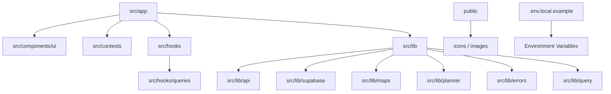
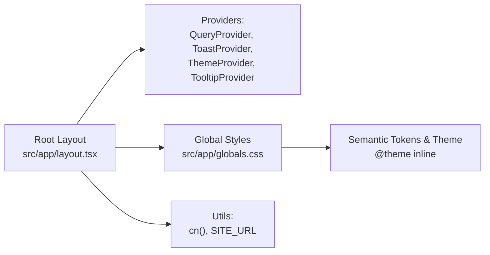
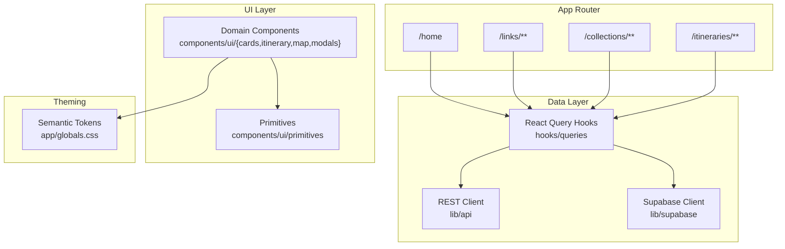
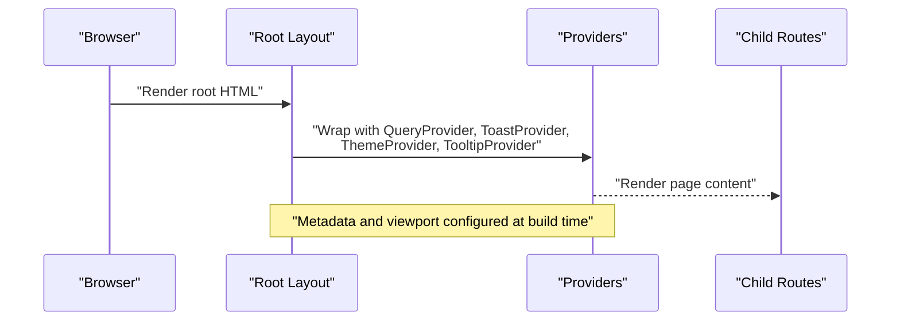
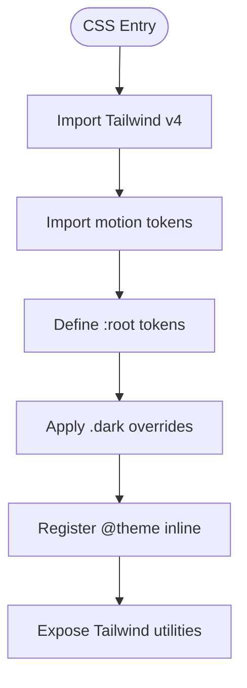
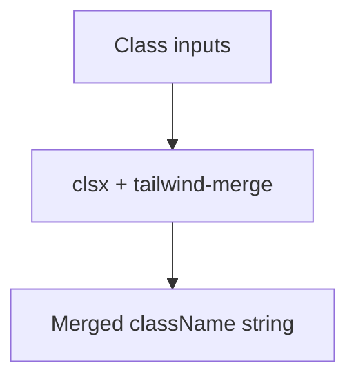
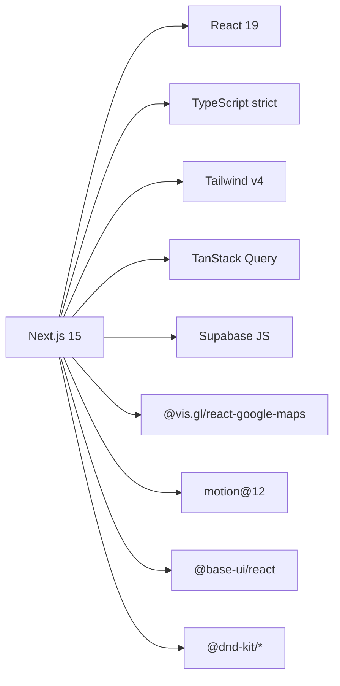

# Developer Guidelines

<cite>
**Referenced Files in This Document**
- [package.json](file://package.json)
- [tsconfig.json](file://tsconfig.json)
- [next.config.js](file://next.config.js)
- [postcss.config.js](file://postcss.config.js)
- [.env.local.example](file://.env.local.example)
- [AGENTS.md](file://AGENTS.md)
- [CLAUDE.md](file://CLAUDE.md)
- [src/app/layout.tsx](file://src/app/layout.tsx)
- [src/app/globals.css](file://src/app/globals.css)
- [src/lib/utils.ts](file://src/lib/utils.ts)
- [src/lib/site.ts](file://src/lib/site.ts)
</cite>

## Table of Contents
1. [Introduction](#introduction)
2. [Project Structure](#project-structure)
3. [Core Components](#core-components)
4. [Architecture Overview](#architecture-overview)
5. [Detailed Component Analysis](#detailed-component-analysis)
6. [Dependency Analysis](#dependency-analysis)
7. [Performance Considerations](#performance-considerations)
8. [Troubleshooting Guide](#troubleshooting-guide)
9. [Conclusion](#conclusion)
10. [Appendices](#appendices)

## Introduction
This document provides comprehensive developer guidelines for contributing to the Argo project. It covers coding standards, TypeScript and React best practices, Git workflow, pull request process, code review expectations, testing requirements, documentation standards, naming and file organization conventions, environment setup, debugging tools, productivity tips, feature addition and refactoring guidance, backward compatibility, performance, accessibility, cross-browser considerations, and contribution norms for both community contributors and internal team members.

The project is a Next.js 15 App Router application built with React 19, strict TypeScript, Tailwind v4, motion, Base UI, drag-and-drop via dnd-kit, Google Maps integration, TanStack Query, and Supabase client libraries. The design system is CSS-first with semantic tokens defined in global styles and registered into Tailwind’s theme layer.

## Project Structure
Argo follows a feature-oriented layout under src:
- app/: Next.js App Router pages and layouts (home, links, collections, itineraries).
- components/: Reusable UI primitives and domain-specific components grouped by purpose (ui/primitives, ui/cards, ui/itinerary, ui/map, ui/modals, etc.).
- contexts/: Shared React contexts (toast, navigation loading, filters, sidebar visibility).
- hooks/: Custom React hooks, including data fetching hooks under hooks/queries and utility hooks.
- lib/: Domain types, utilities, API clients, Supabase client, maps helpers, planner logic, query configuration, errors, and shared modules.
- styles/tokens/: Motion-related CSS tokens.
- public/: Static assets like icons and images.

Key root files:
- package.json defines scripts and dependencies.
- tsconfig.json configures strict TypeScript with path aliases (@/* -> src/*).
- next.config.js enables React Strict Mode, disables dev indicators, optimizes specific packages, and whitelists remote image hosts.
- postcss.config.js uses @tailwindcss/postcss for Tailwind v4.
- .env.local.example documents required environment variables for Supabase, REST API, and Google Maps.

**Section sources**
- [package.json:1-45](file://package.json#L1-L45)
- [tsconfig.json:1-29](file://tsconfig.json#L1-L29)
- [next.config.js:1-18](file://next.config.js#L1-L18)
- [postcss.config.js:1-6](file://postcss.config.js#L1-L6)
- [.env.local.example:1-12](file://.env.local.example#L1-L12)
- [AGENTS.md:1-103](file://AGENTS.md#L1-L103)

## Core Components
Root layout and providers:
- Root layout composes essential providers: QueryProvider (TanStack Query), ToastProvider, ThemeProvider, TooltipProvider, and an itinerary job notifier. It sets metadata, fonts, viewport, and base classes for theming and typography.

Design system and styling:
- Global CSS defines semantic tokens for surfaces, content, glyphs, edges, actions, categories, and calendar colors, with light and dark overrides. Tokens are registered via @theme inline so they can be used as Tailwind utilities. Motion tokens are imported from a separate file.

Utilities:
- cn() combines clsx and tailwind-merge to produce deterministic class names.
- SITE_URL centralizes canonical origin for metadata and Open Graph tags.

**Diagram sources**
- [src/app/layout.tsx:1-85](file://src/app/layout.tsx#L1-L85)
- [src/app/globals.css:1-800](file://src/app/globals.css#L1-L800)
- [src/lib/utils.ts:1-7](file://src/lib/utils.ts#L1-L7)
- [src/lib/site.ts:1-7](file://src/lib/site.ts#L1-L7)

**Section sources**
- [src/app/layout.tsx:1-85](file://src/app/layout.tsx#L1-L85)
- [src/app/globals.css:1-800](file://src/app/globals.css#L1-L800)
- [src/lib/utils.ts:1-7](file://src/lib/utils.ts#L1-L7)
- [src/lib/site.ts:1-7](file://src/lib/site.ts#L1-L7)

## Architecture Overview
High-level architecture:
- Pages under app/ render against data layers in lib/api and lib/supabase.
- Data fetching is centralized via TanStack Query hooks in hooks/queries.
- UI is composed from reusable components under components/ui, organized by domain (cards, itinerary, map, modals, navbar, primitives).
- Theming and tokens live in global CSS; components consume semantic tokens through Tailwind utilities.
- Environment variables configure Supabase, REST backend, and Google Maps.

**Diagram sources**
- [src/app/layout.tsx:1-85](file://src/app/layout.tsx#L1-L85)
- [src/app/globals.css:1-800](file://src/app/globals.css#L1-L800)
- [package.json:12-33](file://package.json#L12-L33)

## Detailed Component Analysis

### Root Layout and Providers
- Sets up metadata, fonts, viewport, and base classes.
- Wraps children with providers for data caching, toasts, theme, tooltips, and background job notifications.

**Diagram sources**
- [src/app/layout.tsx:1-85](file://src/app/layout.tsx#L1-L85)

**Section sources**
- [src/app/layout.tsx:1-85](file://src/app/layout.tsx#L1-L85)

### Design System and Tokens
- Semantic tokens define surfaces, content, glyphs, edges, actions, categories, and calendar colors for both light and dark themes.
- Tokens are registered via @theme inline to expose Tailwind utilities.
- Motion tokens are imported separately.

**Diagram sources**
- [src/app/globals.css:1-800](file://src/app/globals.css#L1-L800)

**Section sources**
- [src/app/globals.css:1-800](file://src/app/globals.css#L1-L800)

### Utility Functions
- cn(): merges class names deterministically using clsx and tailwind-merge.
- SITE_URL: resolves canonical site URL for metadata and OG tags.

**Diagram sources**
- [src/lib/utils.ts:1-7](file://src/lib/utils.ts#L1-L7)
- [src/lib/site.ts:1-7](file://src/lib/site.ts#L1-L7)

**Section sources**
- [src/lib/utils.ts:1-7](file://src/lib/utils.ts#L1-L7)
- [src/lib/site.ts:1-7](file://src/lib/site.ts#L1-L7)

## Dependency Analysis
Runtime and development dependencies:
- Frontend stack includes Next.js 15, React 19, TypeScript, Tailwind v4, motion, Base UI, dnd-kit, Google Maps integration, TanStack Query, Supabase JS, and utility libraries for class merging and animations.
- Dev dependencies include ESLint, Tailwind PostCSS plugin, and type definitions.

**Diagram sources**
- [package.json:12-43](file://package.json#L12-L43)

**Section sources**
- [package.json:1-45](file://package.json#L1-L45)

## Performance Considerations
- Use React Strict Mode and optimize package imports for lucide-react and @base-ui/react to reduce bundle size.
- Prefer semantic tokens and Tailwind utilities to avoid runtime style computation.
- Leverage TanStack Query for efficient data fetching and caching.
- Avoid heavy re-renders by memoizing expensive computations and splitting large components.
- Use lazy loading for routes and components where appropriate.
- Keep animations minimal and prefer motion library features that do not unmount/remount components unnecessarily.

[No sources needed since this section provides general guidance]

## Troubleshooting Guide
Common issues and resolutions:
- Missing environment variables: Ensure NEXT_PUBLIC_SUPABASE_URL, NEXT_PUBLIC_SUPABASE_ANON_KEY, NEXT_PUBLIC_API_URL, and Google Maps keys are set in .env.local based on .env.local.example.
- Map rendering failures: Verify Google Maps API key and map IDs for light/dark modes; without them, map-dependent routes degrade gracefully.
- Type errors: Run npm run type-check to catch TypeScript issues early.
- Linting: Run npm run lint to identify code quality issues.
- User-facing errors: Log technical details via console.error and display friendly messages using error utilities referenced in AGENTS.md.

**Section sources**
- [.env.local.example:1-12](file://.env.local.example#L1-L12)
- [AGENTS.md:67-75](file://AGENTS.md#L67-L75)
- [package.json:5-11](file://package.json#L5-L11)

## Conclusion
Argo is a modern, token-driven Next.js application with a strong emphasis on TypeScript strictness, accessible UI primitives, and clear separation between data and presentation layers. By following the guidelines in this document—especially around semantic tokens, provider composition, environment configuration, and testing—you can contribute effectively while maintaining consistency and performance across the codebase.

[No sources needed since this section summarizes without analyzing specific files]

## Appendices

### Coding Standards and TypeScript Best Practices
- Enable strict mode and use path aliases (@/*) consistently.
- Prefer functional components with explicit prop types and default values.
- Use cn() for all className compositions; reserve CVA for component variants when applicable.
- Avoid hardcoding colors or spacing; use semantic tokens from globals.css.
- Keep modules small and focused; co-locate tests next to their modules.

**Section sources**
- [tsconfig.json:1-29](file://tsconfig.json#L1-L29)
- [src/app/globals.css:1-800](file://src/app/globals.css#L1-L800)
- [AGENTS.md:12-39](file://AGENTS.md#L12-L39)

### React Component Development Patterns
- Compose UI from primitives under components/ui/primitives; build domain-specific components under components/ui/{cards,itinerary,map,modals}.
- Use contexts sparingly for truly global state (e.g., toast, navigation loading); otherwise prefer props and hooks.
- Follow the two-layout-addressability conventions: JSX comments for major sections and data-region attributes for structural elements.

**Section sources**
- [src/app/layout.tsx:1-85](file://src/app/layout.tsx#L1-L85)
- [AGENTS.md:31-39](file://AGENTS.md#L31-L39)

### Git Workflow, Branching Strategy, and Pull Requests
- Create feature branches from main with descriptive names (e.g., feat/add-itinerary-calendar).
- Commit often with clear messages describing intent and impact.
- Open pull requests with a concise description, linked issues, and screenshots for UI changes.
- Request reviews from maintainers familiar with the affected areas.
- Squash and rebase before merging to keep history clean.

[No sources needed since this section provides general guidance]

### Code Review Guidelines
- Verify adherence to coding standards, TypeScript strictness, and token usage.
- Check for accessibility (semantic HTML, ARIA attributes, keyboard navigation).
- Ensure user-facing errors are friendly and technical details are logged.
- Validate performance implications (bundle size, re-renders, network calls).
- Confirm tests exist and pass for new or changed logic.

[No sources needed since this section provides general guidance]

### Testing Requirements
- Use Vitest with native ESM and TypeScript; colocate tests next to modules.
- Inject randomness and time as parameters rather than relying on ambient mocks.
- Run tests via npm test and ensure type checks pass alongside tests.

**Section sources**
- [AGENTS.md:96-103](file://AGENTS.md#L96-L103)

### Documentation Standards
- Update relevant docs when changing behavior or adding features.
- Keep READMEs and decision records aligned with implementation.
- Use clear headings and examples; link to source files for traceability.

[No sources needed since this section provides general guidance]

### Naming Conventions and File Organization
- Feature-based directories under app/ and components/ui/.
- Hooks under hooks/, queries under hooks/queries/.
- Libraries under lib/ with subfolders for api, supabase, maps, planner, errors, query, utils.
- Use kebab-case for data-region attributes and role-based naming.

**Section sources**
- [AGENTS.md:31-39](file://AGENTS.md#L31-L39)

### Development Environment Setup
- Copy .env.local.example to .env.local and fill in Supabase, API, and Google Maps keys.
- Install dependencies and run dev server with Turbopack enabled.
- Use type-check and lint scripts to validate changes locally.

**Section sources**
- [.env.local.example:1-12](file://.env.local.example#L1-L12)
- [package.json:5-11](file://package.json#L5-L11)

### Debugging Tools and Productivity Tips
- Use React DevTools and TanStack Query Devtools for data flow inspection.
- Leverage browser dev tools for network and performance profiling.
- Use motion debugging to verify animation transitions without unmount/remount pitfalls.
- Adopt consistent editor settings for TypeScript and Tailwind autocomplete.

[No sources needed since this section provides general guidance]

### Adding New Features
- Identify the feature area (pages, components, hooks, lib modules).
- Add or update semantic tokens if introducing new visual states.
- Implement data fetching via hooks/queries and wire to lib/api or lib/supabase.
- Write colocated tests and update documentation.

**Section sources**
- [AGENTS.md:45-53](file://AGENTS.md#L45-L53)
- [AGENTS.md:96-103](file://AGENTS.md#L96-L103)

### Refactoring Existing Code
- Preserve backward compatibility by keeping existing APIs stable.
- Gradually migrate to semantic tokens and component patterns.
- Update tests to reflect new behavior and ensure coverage.

[No sources needed since this section provides general guidance]

### Backward Compatibility
- Maintain existing component interfaces and data contracts.
- Deprecate features gradually with migration guides.
- Avoid breaking changes in lib/api and lib/supabase clients.

[No sources needed since this section provides general guidance]

### Accessibility Requirements
- Use semantic HTML elements and proper heading hierarchy.
- Provide ARIA attributes where necessary and ensure keyboard navigability.
- Test with screen readers and accessibility inspectors.

[No sources needed since this section provides general guidance]

### Cross-Browser Compatibility
- Target modern browsers supported by Next.js and React.
- Validate layout and interactions across Chrome, Firefox, Safari, and Edge.
- Use polyfills only when necessary and document any limitations.

[No sources needed since this section provides general guidance]

### Contribution Guidelines for Community and Internal Contributors
- Follow the coding standards and testing requirements outlined here.
- Engage respectfully in discussions and incorporate feedback promptly.
- For internal teams, align with team processes for branching, PRs, and releases.

[No sources needed since this section provides general guidance]