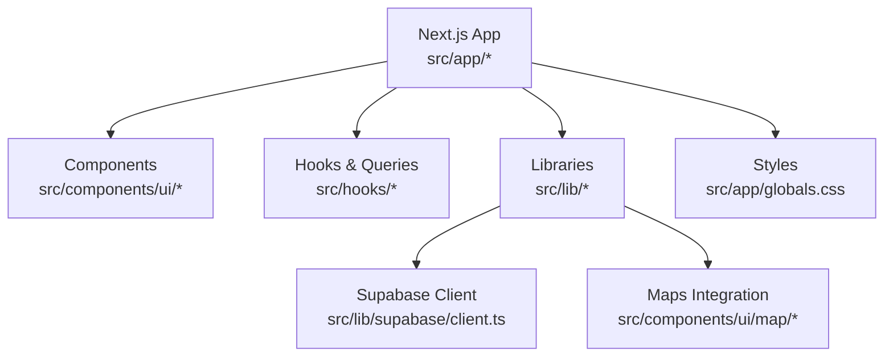
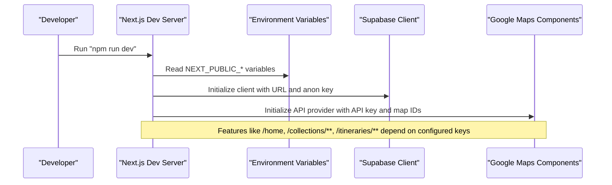
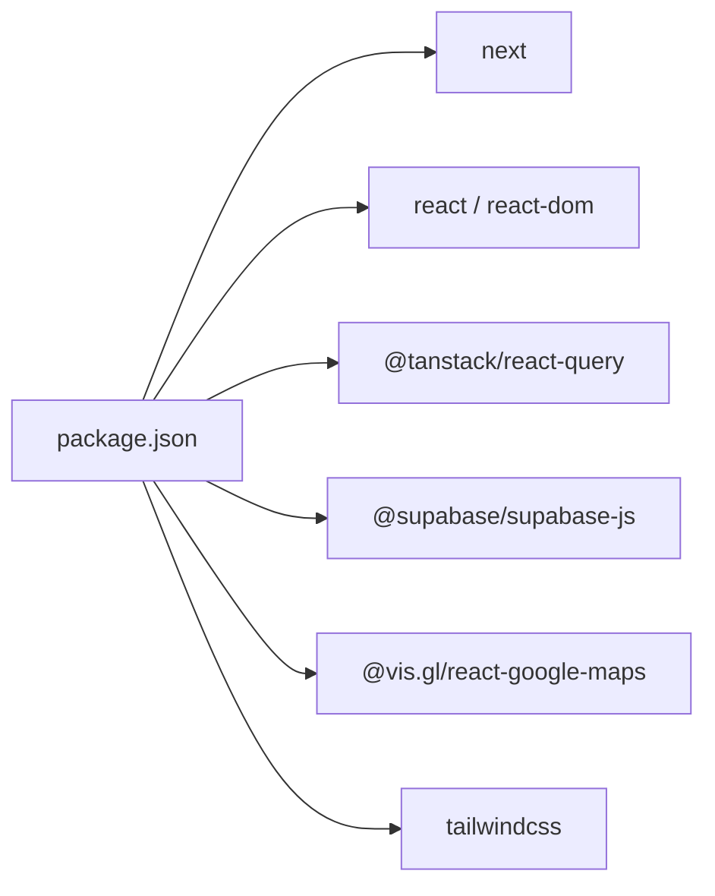

# Getting Started

<cite>
**Referenced Files in This Document**
- [package.json](file://package.json)
- [next.config.js](file://next.config.js)
- [tsconfig.json](file://tsconfig.json)
- [postcss.config.js](file://postcss.config.js)
- [.env.local.example](file://.env.local.example)
- [src/lib/supabase/client.ts](file://src/lib/supabase/client.ts)
- [src/components/ui/map/GoogleMapDetail.tsx](file://src/components/ui/map/GoogleMapDetail.tsx)
- [src/components/ui/map/GoogleMapCluster.tsx](file://src/components/ui/map/GoogleMapCluster.tsx)
- [src/app/globals.css](file://src/app/globals.css)
</cite>

## Table of Contents
1. [Introduction](#introduction)
2. [Project Structure](#project-structure)
3. [Core Components](#core-components)
4. [Architecture Overview](#architecture-overview)
5. [Detailed Component Analysis](#detailed-component-analysis)
6. [Dependency Analysis](#dependency-analysis)
7. [Performance Considerations](#performance-considerations)
8. [Troubleshooting Guide](#troubleshooting-guide)
9. [Conclusion](#conclusion)
10. [Appendices](#appendices)

## Introduction
This guide helps you set up and run the Argo platform locally, configure required services (Supabase and Google Maps), and understand the development workflow using Next.js with Turbopack. It also explains key configuration files and provides verification steps to ensure a successful setup.

## Project Structure
Argo is a Next.js 15 App Router application built with React 19 and TypeScript. The UI layer uses Tailwind CSS v4 with a CSS-first design system defined in the global stylesheet. Supabase is used for data and authentication, while Google Maps powers location features.

**Diagram sources**
- [next.config.js:1-18](file://next.config.js#L1-L18)
- [src/lib/supabase/client.ts:1-9](file://src/lib/supabase/client.ts#L1-L9)
- [src/components/ui/map/GoogleMapDetail.tsx:23-26](file://src/components/ui/map/GoogleMapDetail.tsx#L23-L26)
- [src/app/globals.css:1-6](file://src/app/globals.css#L1-L6)

**Section sources**
- [package.json:1-45](file://package.json#L1-L45)
- [AGENTS.md:6-10](file://AGENTS.md#L6-L10)

## Core Components
- Development server: Uses Next.js with Turbopack enabled via scripts.
- Build and start: Standard Next.js build and production start commands.
- Linting and type checking: ESLint via Next.js and TypeScript type checks.

Key scripts:
- dev: next dev --turbopack
- build: next build
- start: next start
- lint: next lint
- type-check: tsc --noEmit

**Section sources**
- [package.json:5-11](file://package.json#L5-L11)

## Architecture Overview
The app integrates Supabase for data/auth and Google Maps for location-based features. Environment variables drive these integrations at runtime.

**Diagram sources**
- [package.json:5-11](file://package.json#L5-L11)
- [.env.local.example:1-12](file://.env.local.example#L1-L12)
- [src/lib/supabase/client.ts:1-9](file://src/lib/supabase/client.ts#L1-L9)
- [src/components/ui/map/GoogleMapDetail.tsx:23-26](file://src/components/ui/map/GoogleMapDetail.tsx#L23-L26)

## Detailed Component Analysis

### Installation and Environment Setup
- Node.js: Use a modern LTS version compatible with Next.js 15 and React 19.
- Install dependencies:
  - npm: npm install
  - yarn: yarn install
- Environment variables:
  - Copy .env.local.example to .env.local and fill in values.
  - Required keys:
    - NEXT_PUBLIC_SUPABASE_URL
    - NEXT_PUBLIC_SUPABASE_ANON_KEY
    - NEXT_PUBLIC_API_URL (optional placeholder)
    - NEXT_PUBLIC_GOOGLE_MAPS_API_KEY
    - NEXT_PUBLIC_GOOGLE_MAPS_MAP_ID_LIGHT
    - NEXT_PUBLIC_GOOGLE_MAPS_MAP_ID_DARK

Verification:
- Start the dev server and navigate to routes that use maps or data to confirm environment variables are loaded.

**Section sources**
- [.env.local.example:1-12](file://.env.local.example#L1-L12)
- [package.json:5-11](file://package.json#L5-L11)

### Running the Development Server
- Command: npm run dev
- Uses Turbopack for faster builds and reloads.

**Section sources**
- [package.json:5-11](file://package.json#L5-L11)

### Building for Production
- Command: npm run build
- Produces optimized assets for deployment.

**Section sources**
- [package.json:5-11](file://package.json#L5-L11)

### Linting and Type Checking
- Lint: npm run lint
- Type check: npm run type-check

**Section sources**
- [package.json:5-11](file://package.json#L5-L11)

### Configuration Files

#### Next.js Configuration
- Enables React Strict Mode and disables dev indicators.
- Optimizes specific package imports.
- Configures allowed remote image patterns including Supabase storage.

**Section sources**
- [next.config.js:1-18](file://next.config.js#L1-L18)

#### TypeScript Settings
- Target ES2022, strict mode enabled.
- Module resolution set to bundler.
- Path alias @/* mapped to ./src/*.

**Section sources**
- [tsconfig.json:1-29](file://tsconfig.json#L1-L29)

#### PostCSS and Tailwind v4
- PostCSS uses the Tailwind v4 plugin.
- Styles are imported from src/app/globals.css where the design tokens and theme live.

**Section sources**
- [postcss.config.js:1-6](file://postcss.config.js#L1-L6)
- [src/app/globals.css:1-6](file://src/app/globals.css#L1-L6)

### Setting Up Supabase
- Create a Supabase project and obtain:
  - Project URL
  - Anon key
- Add them to .env.local:
  - NEXT_PUBLIC_SUPABASE_URL
  - NEXT_PUBLIC_SUPABASE_ANON_KEY
- The browser client reads these variables to initialize the Supabase SDK.

**Section sources**
- [.env.local.example:1-6](file://.env.local.example#L1-L6)
- [src/lib/supabase/client.ts:1-9](file://src/lib/supabase/client.ts#L1-L9)

### Setting Up Google Maps
- Obtain a Google Maps API key and create two map styles (light and dark).
- Add to .env.local:
  - NEXT_PUBLIC_GOOGLE_MAPS_API_KEY
  - NEXT_PUBLIC_GOOGLE_MAPS_MAP_ID_LIGHT
  - NEXT_PUBLIC_GOOGLE_MAPS_MAP_ID_DARK
- Map components read these variables to render interactive maps.

**Section sources**
- [.env.local.example:8-12](file://.env.local.example#L8-L12)
- [src/components/ui/map/GoogleMapDetail.tsx:23-26](file://src/components/ui/map/GoogleMapDetail.tsx#L23-L26)
- [src/components/ui/map/GoogleMapCluster.tsx:9-11](file://src/components/ui/map/GoogleMapCluster.tsx#L9-L11)

## Dependency Analysis
Top-level dependencies include Next.js, React, TanStack Query, Supabase JS, Google Maps integration, and Tailwind CSS v4.

**Diagram sources**
- [package.json:12-43](file://package.json#L12-L43)

**Section sources**
- [package.json:12-43](file://package.json#L12-L43)

## Performance Considerations
- Development uses Turbopack for fast rebuilds and HMR.
- Image optimization allows only specified remote domains to reduce risk and improve performance.
- Tailwind v4 is CSS-first; keep token definitions centralized in globals.css to avoid duplication.

[No sources needed since this section provides general guidance]

## Troubleshooting Guide
Common issues and resolutions:

- Missing environment variables
  - Symptom: Maps do not load or show errors; Supabase calls fail.
  - Resolution: Ensure all NEXT_PUBLIC_* variables are present in .env.local and match expected formats.

- Google Maps API key invalid or missing
  - Symptom: Map components fail to initialize.
  - Resolution: Verify API key and both map style IDs are correct and enabled in your Google Cloud project.

- Supabase client initialization fails
  - Symptom: Network or auth errors when accessing data.
  - Resolution: Confirm Supabase URL and anon key are set and valid.

- Remote images blocked
  - Symptom: Images from external hosts do not display.
  - Resolution: Add allowed hostnames to Next.js images.remotePatterns if necessary.

- Dev server not starting
  - Symptom: Port conflicts or dependency errors.
  - Resolution: Clear node_modules and reinstall dependencies; ensure Node.js version compatibility.

Verification steps:
- Run npm run dev and open the app in a browser.
- Check that map tiles load on pages that require Google Maps.
- Confirm Supabase connectivity by attempting a simple query or observing empty states gracefully.

**Section sources**
- [.env.local.example:1-12](file://.env.local.example#L1-L12)
- [next.config.js:8-14](file://next.config.js#L8-L14)
- [src/lib/supabase/client.ts:1-9](file://src/lib/supabase/client.ts#L1-L9)
- [src/components/ui/map/GoogleMapDetail.tsx:23-26](file://src/components/ui/map/GoogleMapDetail.tsx#L23-L26)

## Conclusion
You now have the essential steps to install, configure, and run the Argo platform locally. With Supabase and Google Maps properly configured, you can develop features across collections, itineraries, links, and home experiences. Use the provided scripts for development, building, linting, and type checking to maintain code quality and performance.

[No sources needed since this section summarizes without analyzing specific files]

## Appendices

### Quick Commands Reference
- Install dependencies: npm install
- Start dev server: npm run dev
- Build production: npm run build
- Start production: npm start
- Lint code: npm run lint
- Type check: npm run type-check

**Section sources**
- [package.json:5-11](file://package.json#L5-L11)