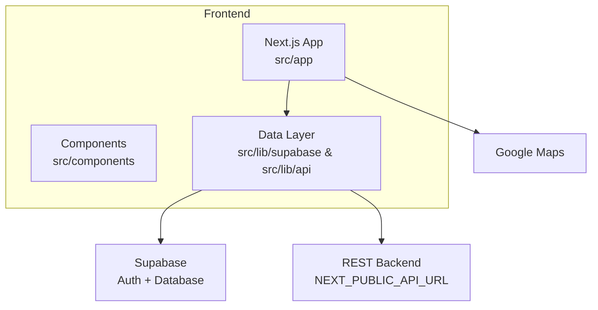
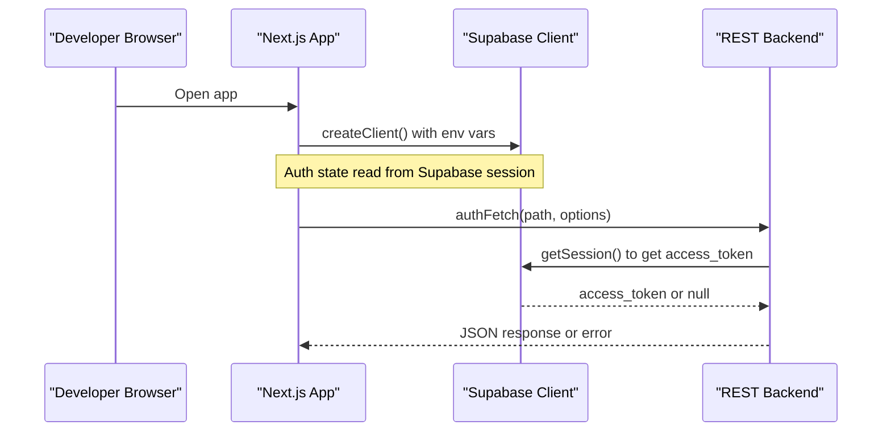
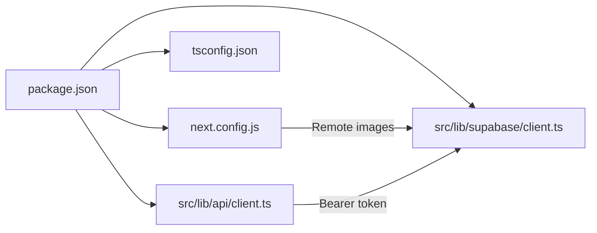

# Getting Started

<cite>
**Referenced Files in This Document**
- [package.json](file://package.json)
- [next.config.js](file://next.config.js)
- [.env.local.example](file://.env.local.example)
- [AGENTS.md](file://AGENTS.md)
- [tsconfig.json](file://tsconfig.json)
- [src/lib/supabase/client.ts](file://src/lib/supabase/client.ts)
- [src/lib/api/client.ts](file://src/lib/api/client.ts)
</cite>

## Table of Contents
1. Introduction
2. Project Structure
3. Core Components
4. Architecture Overview
5. Detailed Component Analysis
6. Dependency Analysis
7. Performance Considerations
8. Troubleshooting Guide
9. Conclusion

## Introduction
This guide helps you set up and run the Argo AI-Powered Itinerary Planner locally. You will learn the project’s purpose, technology stack, environment setup, and step-by-step instructions to install dependencies, configure Supabase and Google Maps, and verify a successful installation.

The application is a Next.js 15 + React 19 frontend that uses:
- TanStack Query for data fetching and caching
- Supabase (browser client) for authentication and database access
- A REST backend integration point that sends the Supabase JWT as a bearer token
- Google Maps for map features on key pages

## Project Structure
At a high level:
- App shell and routes live under src/app
- UI components are organized by feature under src/components
- Data access is split between:
  - src/lib/supabase for direct Supabase browser queries and realtime
  - src/lib/api for REST calls to an external API using Supabase auth tokens
- Environment variables define Supabase, API, and Google Maps configuration

[No sources needed since this diagram shows conceptual workflow, not actual code structure]

**Section sources**
- [package.json:1-50](file://package.json#L1-L50)
- [next.config.js:1-18](file://next.config.js#L1-L18)
- [AGENTS.md:6-10](file://AGENTS.md#L6-L10)

## Core Components
Key runtime pieces you need to know for setup:
- Supabase browser client reads NEXT_PUBLIC_SUPABASE_URL and NEXT_PUBLIC_SUPABASE_ANON_KEY from environment variables.
- The REST API client reads NEXT_PUBLIC_API_URL and attaches the Supabase session access token as a Bearer token for authenticated requests.
- Google Maps requires three environment variables; without them, map-enabled pages degrade gracefully.

Environment variables required:
- NEXT_PUBLIC_SUPABASE_URL
- NEXT_PUBLIC_SUPABASE_ANON_KEY
- NEXT_PUBLIC_API_URL
- NEXT_PUBLIC_GOOGLE_MAPS_API_KEY
- NEXT_PUBLIC_GOOGLE_MAPS_MAP_ID_LIGHT
- NEXT_PUBLIC_GOOGLE_MAPS_MAP_ID_DARK

**Section sources**
- [src/lib/supabase/client.ts:1-9](file://src/lib/supabase/client.ts#L1-L9)
- [src/lib/api/client.ts:1-156](file://src/lib/api/client.ts#L1-L156)
- [.env.local.example:1-12](file://.env.local.example#L1-L12)
- [AGENTS.md:72-76](file://AGENTS.md#L72-L76)

## Architecture Overview
The app runs entirely in the browser with two backends:
- Supabase for auth and database via the browser client
- A REST backend accessed through a typed fetch wrapper that injects the Supabase JWT

**Diagram sources**
- [src/lib/supabase/client.ts:1-9](file://src/lib/supabase/client.ts#L1-L9)
- [src/lib/api/client.ts:48-83](file://src/lib/api/client.ts#L48-L83)

**Section sources**
- [src/lib/api/client.ts:1-156](file://src/lib/api/client.ts#L1-L156)
- [src/lib/supabase/client.ts:1-9](file://src/lib/supabase/client.ts#L1-L9)

## Detailed Component Analysis

### Environment Setup and Configuration
Follow these steps to prepare your local environment:

1. Install Node.js (recommended LTS) and ensure npm is available.
2. Clone the repository and open the project root.
3. Copy the example environment file to your local environment file:
   - Create .env.local from .env.local.example
4. Fill in the required values:
   - Supabase URL and anon key
   - REST backend URL (default points to localhost:8080)
   - Google Maps API key and light/dark map IDs
5. Save the file.

Verification tips:
- Confirm .env.local exists and contains all six keys.
- Ensure NEXT_PUBLIC_API_URL matches where your backend is running.
- If maps do not load, check that the Google Maps API key and map IDs are correct.

**Section sources**
- [.env.local.example:1-12](file://.env.local.example#L1-L12)
- [AGENTS.md:72-76](file://AGENTS.md#L72-L76)

### Installation and Running Locally
1. Install dependencies:
   - Run npm install at the project root.
2. Start the development server:
   - Run npm run dev.
3. Open the app in your browser at the printed local address.

Notes:
- The dev script uses Turbopack for faster builds.
- TypeScript strict mode is enabled; type errors will be surfaced during development.

**Section sources**
- [package.json:5-12](file://package.json#L5-L12)
- [tsconfig.json:1-29](file://tsconfig.json#L1-L29)

### Supabase Integration
- The Supabase browser client is created with environment variables.
- Authentication state is read from the Supabase session when making API calls.
- All routes are currently open; sign-out is a stub until auth is re-enabled.

What you must configure:
- NEXT_PUBLIC_SUPABASE_URL
- NEXT_PUBLIC_SUPABASE_ANON_KEY

If you plan to use the REST backend:
- Ensure NEXT_PUBLIC_API_URL points to your running service.
- Requests will include the Supabase access token as a Bearer header when a session exists.

**Section sources**
- [src/lib/supabase/client.ts:1-9](file://src/lib/supabase/client.ts#L1-L9)
- [src/lib/api/client.ts:48-83](file://src/lib/api/client.ts#L48-L83)
- [AGENTS.md:55-59](file://AGENTS.md#L55-L59)

### Google Maps Integration
Map-enabled pages require:
- NEXT_PUBLIC_GOOGLE_MAPS_API_KEY
- NEXT_PUBLIC_GOOGLE_MAPS_MAP_ID_LIGHT
- NEXT_PUBLIC_GOOGLE_MAPS_MAP_ID_DARK

Without these, affected pages degrade gracefully but maps will not render.

**Section sources**
- [.env.local.example:8-12](file://.env.local.example#L8-L12)
- [AGENTS.md:72-76](file://AGENTS.md#L72-L76)

### Build and Production
- Build the app with npm run build.
- Start the production server with npm run start.

These commands are provided by Next.js and configured in package scripts.

**Section sources**
- [package.json:5-12](file://package.json#L5-L12)

## Dependency Analysis
The project relies on a modern web stack:
- Next.js 15 with React 19
- Tailwind CSS v4 (CSS-first design system)
- TanStack Query for data management
- Supabase JS client for auth and database
- Google Maps via @vis.gl/react-google-maps
- Vitest for tests

**Diagram sources**
- [package.json:14-35](file://package.json#L14-L35)
- [next.config.js:8-14](file://next.config.js#L8-L14)
- [tsconfig.json:22-24](file://tsconfig.json#L22-L24)
- [src/lib/supabase/client.ts:1-9](file://src/lib/supabase/client.ts#L1-L9)
- [src/lib/api/client.ts:1-156](file://src/lib/api/client.ts#L1-L156)

**Section sources**
- [package.json:14-48](file://package.json#L14-L48)
- [next.config.js:1-18](file://next.config.js#L1-L18)
- [tsconfig.json:1-29](file://tsconfig.json#L1-L29)

## Performance Considerations
- Development uses Turbopack for fast refresh and builds.
- Image optimization allows remote patterns for Unsplash, UI avatars, and Supabase storage public objects.
- Strict TypeScript settings help catch issues early and improve maintainability.

[No sources needed since this section provides general guidance]

## Troubleshooting Guide
Common setup issues and resolutions:

- Missing environment variables
  - Symptom: Runtime errors or degraded features (maps blank).
  - Fix: Ensure .env.local contains all six keys listed above.

- Supabase client initialization fails
  - Symptom: Errors when creating the Supabase client.
  - Fix: Verify NEXT_PUBLIC_SUPABASE_URL and NEXT_PUBLIC_SUPABASE_ANON_KEY are set and valid.

- REST API returns 401 Unauthorized
  - Symptom: API calls fail with “Not authenticated”.
  - Fix: Ensure a Supabase session exists; the API client attaches the access token only when a session is present.

- Map pages do not render
  - Symptom: Maps are missing or broken.
  - Fix: Provide NEXT_PUBLIC_GOOGLE_MAPS_API_KEY and both map IDs. Without them, pages degrade gracefully.

- Cannot reach the backend
  - Symptom: Network errors when calling the REST API.
  - Fix: Check NEXT_PUBLIC_API_URL and confirm the backend is running and reachable.

- Type errors during development
  - Symptom: TypeScript errors blocking builds or IDE feedback.
  - Fix: Review types and fix mismatches; strict mode is enabled.

- Tests
  - Run unit tests with npm test.

**Section sources**
- [src/lib/supabase/client.ts:1-9](file://src/lib/supabase/client.ts#L1-L9)
- [src/lib/api/client.ts:48-83](file://src/lib/api/client.ts#L48-L83)
- [.env.local.example:1-12](file://.env.local.example#L1-L12)
- [AGENTS.md:72-76](file://AGENTS.md#L72-L76)
- [package.json:5-12](file://package.json#L5-L12)

## Conclusion
You now have everything needed to set up, configure, and run the Argo AI-Powered Itinerary Planner locally. After installing dependencies and configuring environment variables for Supabase, the REST backend, and Google Maps, start the development server and verify that pages load correctly. Use the troubleshooting guide if you encounter common issues during setup.