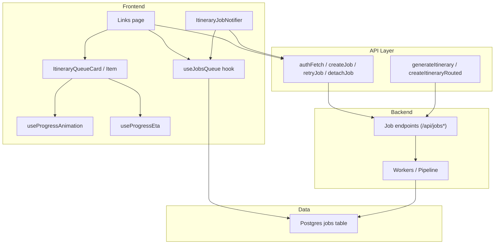
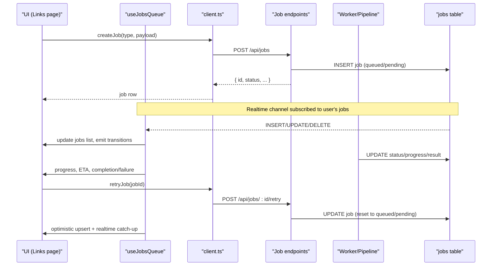
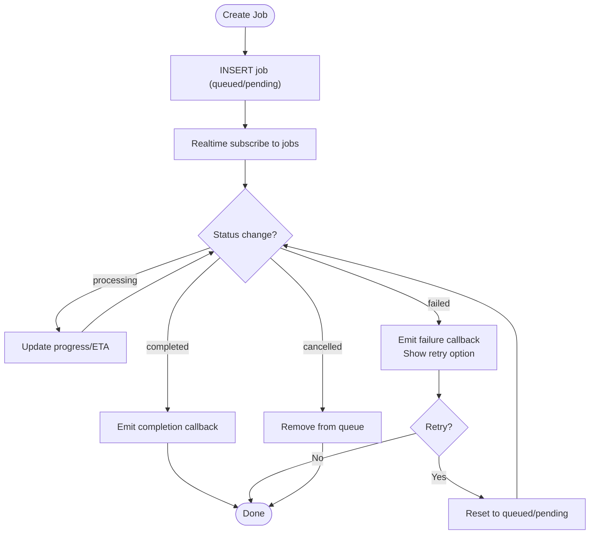
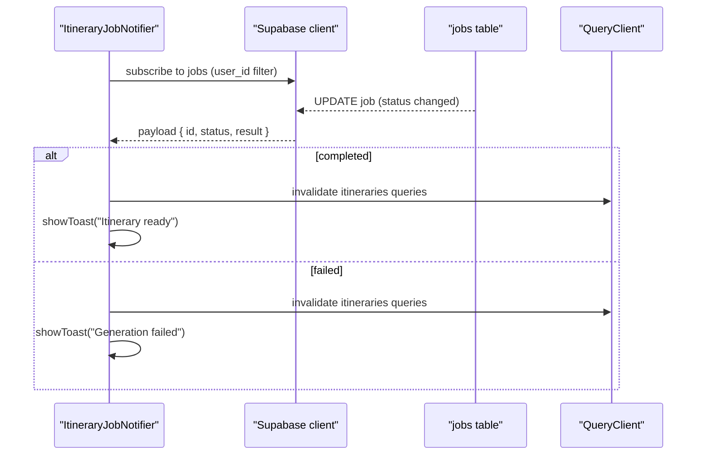
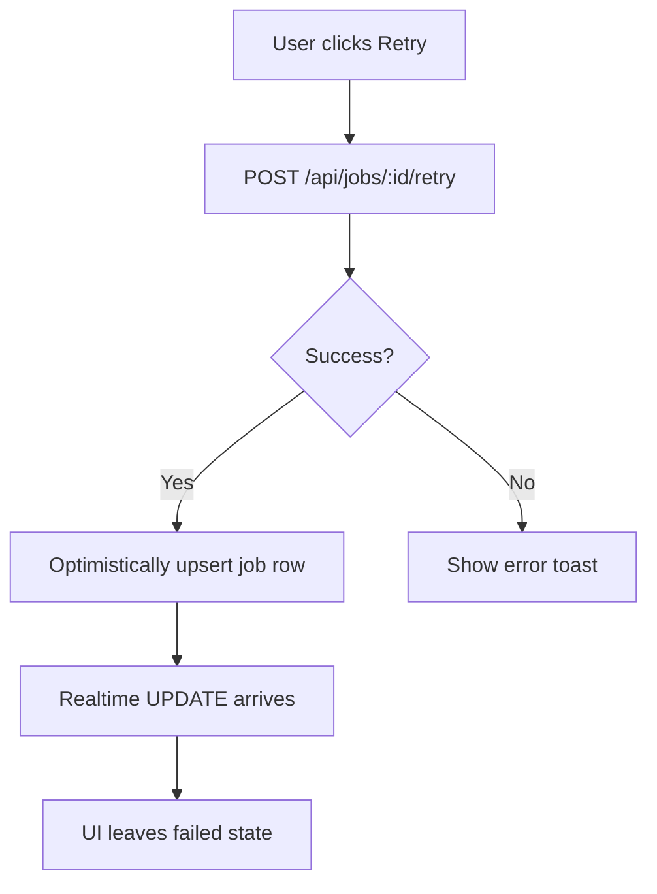
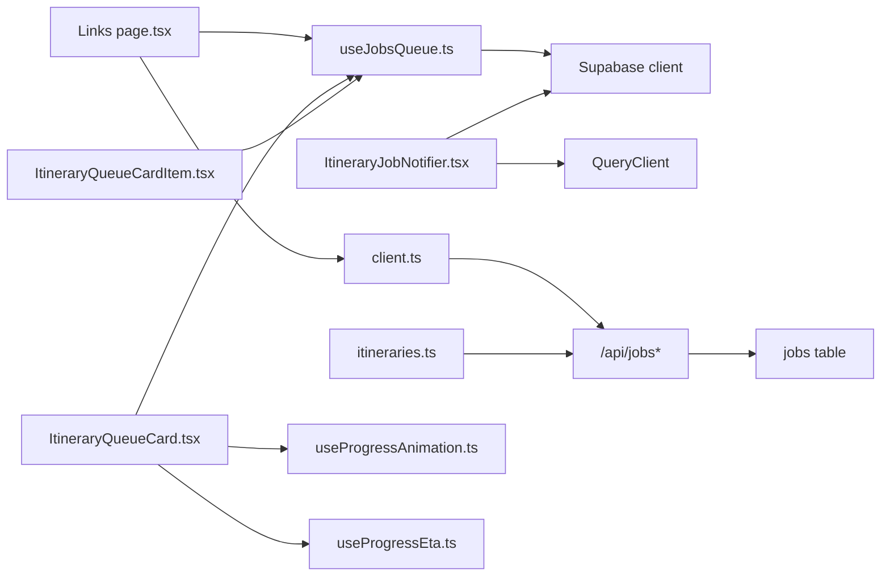

# Job Queue System

<cite>
**Referenced Files in This Document**
- [useJobsQueue.ts](file://src/hooks/useJobsQueue.ts)
- [ItineraryJobNotifier.tsx](file://src/components/notifications/ItineraryJobNotifier.tsx)
- [client.ts](file://src/lib/api/client.ts)
- [itineraries.ts](file://src/lib/api/itineraries.ts)
- [page.tsx (Links page)](file://src/app/links/page.tsx)
- [ItineraryQueueCard.tsx](file://src/components/ui/itinerary/ItineraryQueueCard.tsx)
- [ItineraryQueueCardItem.tsx](file://src/components/ui/itinerary/ItineraryQueueCardItem.tsx)
- [useProgressAnimation.ts](file://src/hooks/useProgressAnimation.ts)
- [useProgressEta.ts](file://src/hooks/useProgressEta.ts)
- [personalization-pipeline.md](file://docs/personalization-pipeline.md)
</cite>

## Table of Contents
1. Introduction
2. Project Structure
3. Core Components
4. Architecture Overview
5. Detailed Component Analysis
6. Dependency Analysis
7. Performance Considerations
8. Troubleshooting Guide
9. Conclusion
10. Appendices

## Introduction
This document explains Argo’s job queue system as implemented in the frontend and its integration points for background processing tasks such as AI content analysis and itinerary generation. It covers how jobs are created, tracked in real time, updated with progress, and completed or failed; how users receive feedback via notifications and UI cards; and how retries, detachment, and error handling work end-to-end. It also provides guidance on adding new job types, monitoring performance, scaling considerations, debugging techniques, logging strategies, and optimization patterns for high-volume processing.

## Project Structure
The job queue is primarily a client-side pattern that subscribes to database changes for a jobs table, renders in-flight jobs as queue cards, and surfaces completion/failure events to the user. Key areas:
- Hook for subscribing to job updates and reconciling state: useJobsQueue
- Realtime notification component for itinerary completion/failure: ItineraryJobNotifier
- API helpers for creating, retrying, and detaching jobs: client.ts
- Itinerary creation flow that triggers async planning jobs: itineraries.ts
- Pages and components that render queue cards and handle retry/remove actions: Links page, ItineraryQueueCard, ItineraryQueueCardItem
- Progress visualization utilities: useProgressAnimation, useProgressEta
- Design documentation describing pipeline stages and where jobs fit: personalization-pipeline.md

**Diagram sources**
- [useJobsQueue.ts:45-295](file://src/hooks/useJobsQueue.ts#L45-L295)
- [ItineraryJobNotifier.tsx:10-92](file://src/components/notifications/ItineraryJobNotifier.tsx#L10-L92)
- [client.ts:109-155](file://src/lib/api/client.ts#L109-L155)
- [itineraries.ts:101-120](file://src/lib/api/itineraries.ts#L101-L120)
- [page.tsx (Links page):120-261](file://src/app/links/page.tsx#L120-L261)
- [ItineraryQueueCard.tsx:55-199](file://src/components/ui/itinerary/ItineraryQueueCard.tsx#L55-L199)
- [ItineraryQueueCardItem.tsx:34-101](file://src/components/ui/itinerary/ItineraryQueueCardItem.tsx#L34-L101)
- [useProgressAnimation.ts:1-41](file://src/hooks/useProgressAnimation.ts#L1-L41)
- [useProgressEta.ts:22-59](file://src/hooks/useProgressEta.ts#L22-L59)

**Section sources**
- [useJobsQueue.ts:45-295](file://src/hooks/useJobsQueue.ts#L45-L295)
- [ItineraryJobNotifier.tsx:10-92](file://src/components/notifications/ItineraryJobNotifier.tsx#L10-L92)
- [client.ts:109-155](file://src/lib/api/client.ts#L109-L155)
- [itineraries.ts:101-120](file://src/lib/api/itineraries.ts#L101-L120)
- [page.tsx (Links page):120-261](file://src/app/links/page.tsx#L120-L261)
- [ItineraryQueueCard.tsx:55-199](file://src/components/ui/itinerary/ItineraryQueueCard.tsx#L55-L199)
- [ItineraryQueueCardItem.tsx:34-101](file://src/components/ui/itinerary/ItineraryQueueCardItem.tsx#L34-L101)
- [useProgressAnimation.ts:1-41](file://src/hooks/useProgressAnimation.ts#L1-L41)
- [useProgressEta.ts:22-59](file://src/hooks/useProgressEta.ts#L22-L59)

## Core Components
- useJobsQueue: Subscribes to Postgres changes for the jobs table, maintains a local list of active jobs, reconciles missed updates, emits lifecycle callbacks, and supports optimistic upserts after retry.
- ItineraryJobNotifier: A global notifier that listens for itinerary-planning job transitions and shows success/error toasts while invalidating relevant caches.
- API client: Provides authed requests to create jobs, retry them, and detach them; includes typed quota and duplicate-analysis errors.
- Itinerary APIs: Create blank itineraries or trigger async planning jobs; return job metadata for the client to track.
- UI queue cards: Render queued/processing/failed states, show progress bars, offer retry/dismiss, and integrate with progress animation and ETA hooks.
- Progress utilities: Smooth visual progress between worker updates and countdown timers based on worker-reported ETAs.

**Section sources**
- [useJobsQueue.ts:6-43](file://src/hooks/useJobsQueue.ts#L6-L43)
- [ItineraryJobNotifier.tsx:10-92](file://src/components/notifications/ItineraryJobNotifier.tsx#L10-L92)
- [client.ts:109-155](file://src/lib/api/client.ts#L109-L155)
- [itineraries.ts:101-120](file://src/lib/api/itineraries.ts#L101-L120)
- [ItineraryQueueCard.tsx:55-199](file://src/components/ui/itinerary/ItineraryQueueCard.tsx#L55-L199)
- [ItineraryQueueCardItem.tsx:34-101](file://src/components/ui/itinerary/ItineraryQueueCardItem.tsx#L34-L101)
- [useProgressAnimation.ts:1-41](file://src/hooks/useProgressAnimation.ts#L1-L41)
- [useProgressEta.ts:22-59](file://src/hooks/useProgressEta.ts#L22-L59)

## Architecture Overview
The queue architecture combines:
- Client-side realtime subscription to job rows for immediate UI updates
- Initial fetch to populate visible jobs (including recent failures)
- Reconciliation on reconnect or visibility change to recover from missed messages
- Optimistic UI updates after retry calls to avoid waiting for delayed realtime updates
- Typed error handling for quotas and duplicates at job creation time
- Separate notifier for cross-page toast notifications on job completion/failure

**Diagram sources**
- [client.ts:109-155](file://src/lib/api/client.ts#L109-L155)
- [useJobsQueue.ts:138-267](file://src/hooks/useJobsQueue.ts#L138-L267)
- [page.tsx (Links page):209-261](file://src/app/links/page.tsx#L209-L261)

## Detailed Component Analysis

### Job Lifecycle Management
- Creation: The UI calls createJob with a type and payload. The backend inserts a job row and returns it. Quota and duplicate-analysis errors are handled with typed exceptions.
- Tracking: useJobsQueue subscribes to Postgres changes for the current user’s jobs, filters by optional type, and keeps only active or recently failed jobs visible.
- Progress updates: Workers update status and progress fields. The hook merges these into the local list and emits transition callbacks for terminal states.
- Completion handling: Completed jobs can be marked as rejected; the hook distinguishes normal completion vs rejection and invokes appropriate callbacks. Recent failures remain visible for one day to allow retry.
- Retry and detach: Users can retry failed or stuck jobs; detached jobs are hidden from the queue.

**Diagram sources**
- [useJobsQueue.ts:89-136](file://src/hooks/useJobsQueue.ts#L89-L136)
- [useJobsQueue.ts:167-267](file://src/hooks/useJobsQueue.ts#L167-L267)
- [client.ts:109-155](file://src/lib/api/client.ts#L109-L155)

**Section sources**
- [useJobsQueue.ts:89-136](file://src/hooks/useJobsQueue.ts#L89-L136)
- [useJobsQueue.ts:167-267](file://src/hooks/useJobsQueue.ts#L167-L267)
- [client.ts:109-155](file://src/lib/api/client.ts#L109-L155)

### Real-time Notification System
- ItineraryJobNotifier subscribes to job updates for itinerary-planning jobs and shows success/error toasts. On completion, it invalidates relevant query caches so the UI refreshes automatically.
- For link analysis, the Links page uses useJobsQueue callbacks to show toasts and optimistically morph queue cards into completed link cards once jobs finish.

**Diagram sources**
- [ItineraryJobNotifier.tsx:29-88](file://src/components/notifications/ItineraryJobNotifier.tsx#L29-L88)

**Section sources**
- [ItineraryJobNotifier.tsx:29-88](file://src/components/notifications/ItineraryJobNotifier.tsx#L29-L88)
- [page.tsx (Links page):138-170](file://src/app/links/page.tsx#L138-L170)

### Error Handling and Retry Mechanisms
- Quota and duplicate detection: createJob throws typed errors for quota exceeded and already-analyzed links, enabling targeted UX (upgrade prompts, view existing content).
- Stuck-in-flight detection: UI offers retry when a job remains in queued/pending/processing beyond a threshold.
- Retry flow: Calls retry endpoint, then optimistically upserts the returned job row to immediately reflect reset status before realtime catches up.
- Detach: Allows removing jobs from the queue without reprocessing.

**Diagram sources**
- [page.tsx (Links page):209-220](file://src/app/links/page.tsx#L209-L220)
- [client.ts:147-155](file://src/lib/api/client.ts#L147-L155)
- [useJobsQueue.ts:274-292](file://src/hooks/useJobsQueue.ts#L274-L292)

**Section sources**
- [client.ts:109-155](file://src/lib/api/client.ts#L109-L155)
- [page.tsx (Links page):209-220](file://src/app/links/page.tsx#L209-L220)
- [useJobsQueue.ts:274-292](file://src/hooks/useJobsQueue.ts#L274-L292)

### Adding New Job Types
To add a new job type:
- Define the job type string and expected payload/result shapes in your feature module.
- Use createJob(type, payload) to enqueue work.
- Optionally filter useJobsQueue by type to scope the queue UI to this job type.
- Handle completion/failure/rejection callbacks to update UI and invalidate caches.
- Provide retry and detach flows using existing API helpers.

Example paths:
- Enqueue: [createJob usage:109-145](file://src/lib/api/client.ts#L109-L145)
- Scope queue: [type filtering:145-149](file://src/hooks/useJobsQueue.ts#L145-L149)
- Callbacks: [transition emission:89-103](file://src/hooks/useJobsQueue.ts#L89-L103)

**Section sources**
- [client.ts:109-145](file://src/lib/api/client.ts#L109-L145)
- [useJobsQueue.ts:145-149](file://src/hooks/useJobsQueue.ts#L145-L149)
- [useJobsQueue.ts:89-103](file://src/hooks/useJobsQueue.ts#L89-L103)

### Monitoring Job Performance
- Visual progress: useProgressAnimation maps step numbers or worker-reported percent to smooth progress values.
- ETA countdown: useProgressEta computes remaining seconds locally between worker reports, with safeguards near completion.
- Visibility reconciliation: useJobsQueue reconciles missed updates on tab focus or reconnect to ensure accurate status.

**Section sources**
- [useProgressAnimation.ts:1-41](file://src/hooks/useProgressAnimation.ts#L1-L41)
- [useProgressEta.ts:22-59](file://src/hooks/useProgressEta.ts#L22-L59)
- [useJobsQueue.ts:161-165](file://src/hooks/useJobsQueue.ts#L161-L165)
- [useJobsQueue.ts:250-260](file://src/hooks/useJobsQueue.ts#L250-L260)

### Scaling the Queue System
- Per-instance channels: useJobsQueue generates unique channel suffixes per hook instance to avoid deduplication conflicts when multiple queues share a user context.
- Type scoping: Filter by job type to reduce noise and improve performance.
- Optimistic upserts: Reduce perceived latency after retry by merging server responses immediately.
- Cache invalidation: Invalidate related queries on completion/failure to keep UI consistent without polling.

**Section sources**
- [useJobsQueue.ts:70-76](file://src/hooks/useJobsQueue.ts#L70-L76)
- [useJobsQueue.ts:145-149](file://src/hooks/useJobsQueue.ts#L145-L149)
- [useJobsQueue.ts:274-292](file://src/hooks/useJobsQueue.ts#L274-L292)
- [ItineraryJobNotifier.tsx:57-61](file://src/components/notifications/ItineraryJobNotifier.tsx#L57-L61)

## Dependency Analysis

**Diagram sources**
- [useJobsQueue.ts:45-295](file://src/hooks/useJobsQueue.ts#L45-L295)
- [ItineraryJobNotifier.tsx:10-92](file://src/components/notifications/ItineraryJobNotifier.tsx#L10-L92)
- [client.ts:109-155](file://src/lib/api/client.ts#L109-L155)
- [itineraries.ts:101-120](file://src/lib/api/itineraries.ts#L101-L120)
- [page.tsx (Links page):120-261](file://src/app/links/page.tsx#L120-L261)
- [ItineraryQueueCard.tsx:55-199](file://src/components/ui/itinerary/ItineraryQueueCard.tsx#L55-L199)
- [ItineraryQueueCardItem.tsx:34-101](file://src/components/ui/itinerary/ItineraryQueueCardItem.tsx#L34-L101)
- [useProgressAnimation.ts:1-41](file://src/hooks/useProgressAnimation.ts#L1-L41)
- [useProgressEta.ts:22-59](file://src/hooks/useProgressEta.ts#L22-L59)

**Section sources**
- [useJobsQueue.ts:45-295](file://src/hooks/useJobsQueue.ts#L45-L295)
- [ItineraryJobNotifier.tsx:10-92](file://src/components/notifications/ItineraryJobNotifier.tsx#L10-L92)
- [client.ts:109-155](file://src/lib/api/client.ts#L109-L155)
- [itineraries.ts:101-120](file://src/lib/api/itineraries.ts#L101-L120)
- [page.tsx (Links page):120-261](file://src/app/links/page.tsx#L120-L261)
- [ItineraryQueueCard.tsx:55-199](file://src/components/ui/itinerary/ItineraryQueueCard.tsx#L55-L199)
- [ItineraryQueueCardItem.tsx:34-101](file://src/components/ui/itinerary/ItineraryQueueCardItem.tsx#L34-L101)
- [useProgressAnimation.ts:1-41](file://src/hooks/useProgressAnimation.ts#L1-L41)
- [useProgressEta.ts:22-59](file://src/hooks/useProgressEta.ts#L22-L59)

## Performance Considerations
- Minimize redundant updates: useJobsQueue tracks last known status per job to avoid repeated transitions and only updates when status changes.
- Efficient sorting and visibility: Failed jobs pin to the front; only active or recent failures are shown to reduce UI churn.
- Local ETA countdown: useProgressEta avoids frequent server writes by computing countdowns locally.
- Optimistic UI: After retry, merge server response immediately to improve responsiveness.
- Reconciliation: Recover from missed realtime messages on reconnect or visibility change to prevent stale UI.

[No sources needed since this section provides general guidance]

## Troubleshooting Guide
Common issues and resolutions:
- Connection errors: useJobsQueue sets connectionError on channel errors/timeouts; reconcile on SUBSCRIBED to resync.
- Stuck jobs: If a job remains in queued/pending/processing beyond a threshold, offer retry.
- Duplicate analysis: createJob may throw AlreadyAnalyzedError; show existing content and action to view it.
- Quota limits: LinkQuotaError and ItineraryQuotaError provide tier and limit details to prompt upgrades.
- Missing updates: Rely on reconcile on visibility change and reconnect to fix gaps.

**Section sources**
- [useJobsQueue.ts:250-260](file://src/hooks/useJobsQueue.ts#L250-L260)
- [page.tsx (Links page):44-47](file://src/app/links/page.tsx#L44-L47)
- [client.ts:118-145](file://src/lib/api/client.ts#L118-L145)
- [itineraries.ts:89-120](file://src/lib/api/itineraries.ts#L89-L120)

## Conclusion
The job queue system leverages client-side realtime subscriptions, robust reconciliation, and optimistic UI to deliver responsive feedback during long-running background tasks. It supports multiple job types, clear error handling, retries, and scalable patterns through per-instance channels and type scoping. By following the guidelines here, you can add new job types, monitor performance, and maintain a resilient user experience under high load.

[No sources needed since this section summarizes without analyzing specific files]

## Appendices

### Example: Itinerary Planning Flow
- Trigger: createItineraryRouted routes to generateItinerary or createItinerary depending on inputs.
- Job tracking: useJobsQueue subscribes to itinerary-planning jobs and updates UI.
- Notifications: ItineraryJobNotifier shows toasts and invalidates caches on completion/failure.

**Section sources**
- [itineraries.ts:406-439](file://src/lib/api/itineraries.ts#L406-L439)
- [useJobsQueue.ts:145-149](file://src/hooks/useJobsQueue.ts#L145-L149)
- [ItineraryJobNotifier.tsx:29-88](file://src/components/notifications/ItineraryJobNotifier.tsx#L29-L88)

### Example: Link Content Analysis Flow
- Trigger: Links page calls createJob("content-analysis", { url }).
- Queue rendering: useJobsQueue with type "content-analysis" drives queue cards.
- Completion: onJobCompleted builds an optimistic content card and navigates/toasts accordingly.

**Section sources**
- [page.tsx (Links page):222-261](file://src/app/links/page.tsx#L222-L261)
- [page.tsx (Links page):138-170](file://src/app/links/page.tsx#L138-L170)