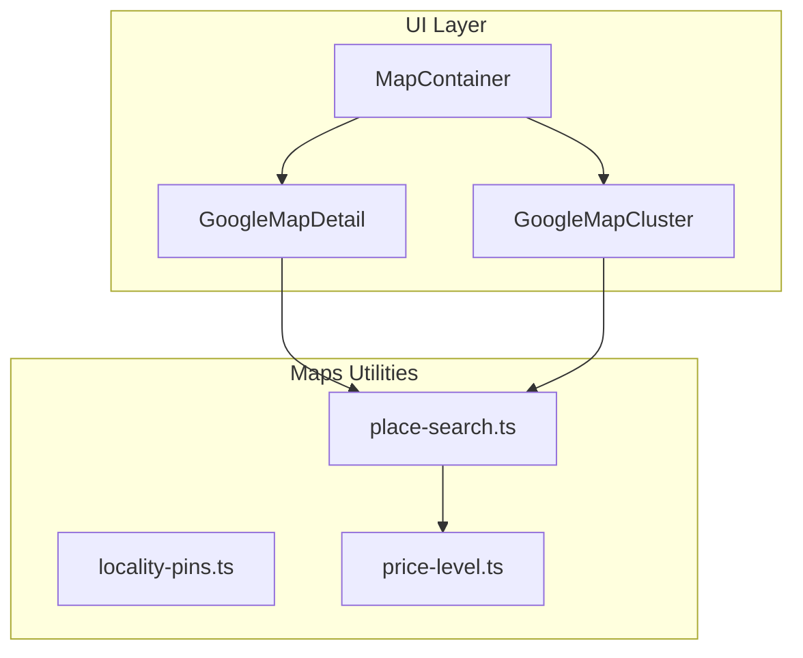
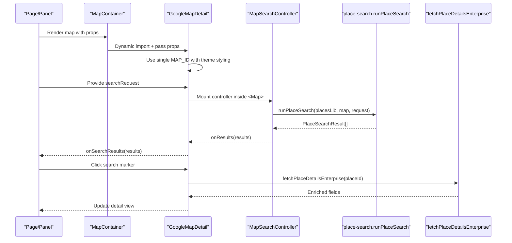
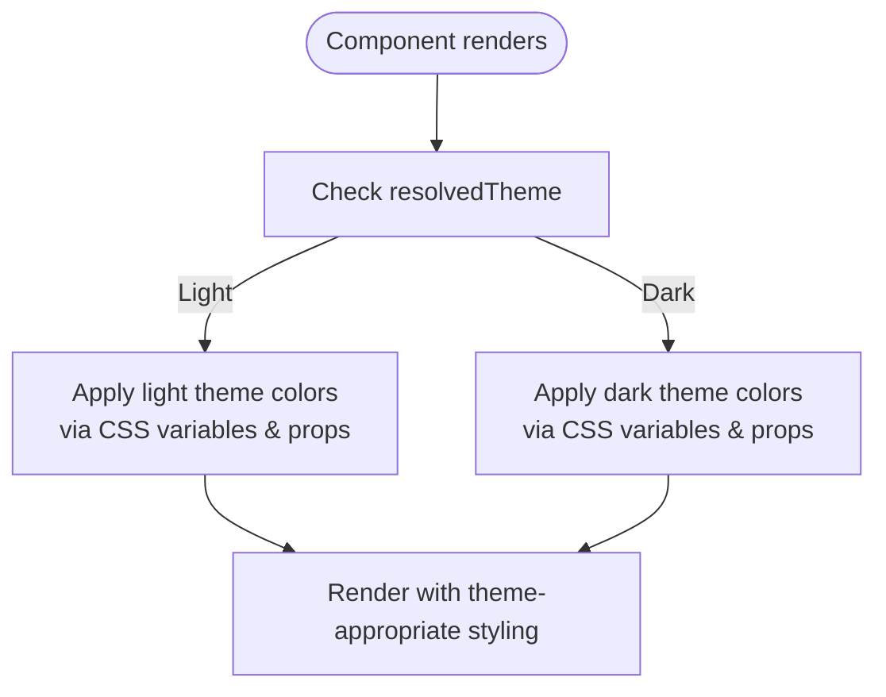
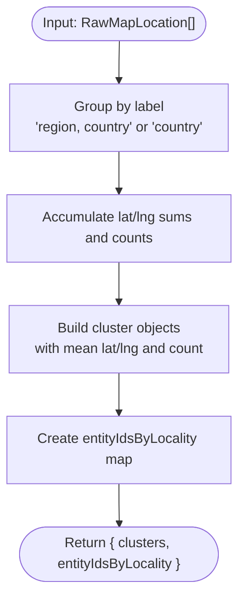
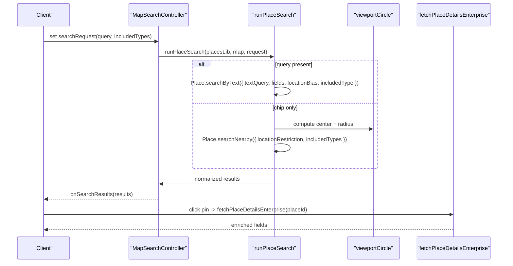
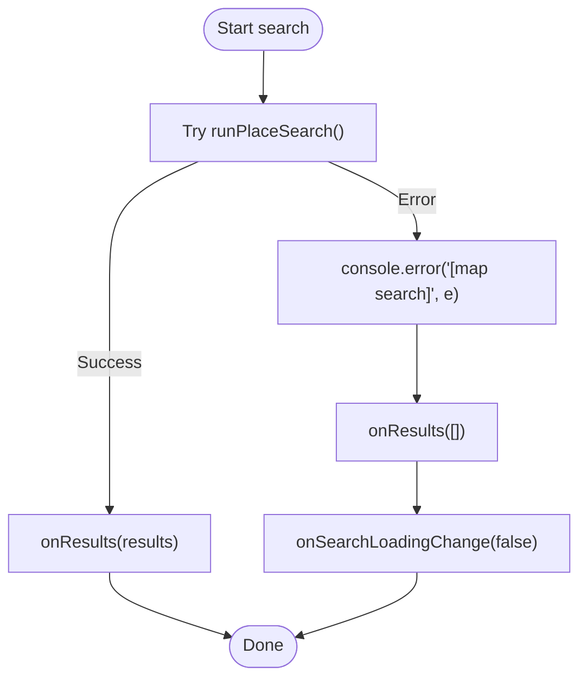
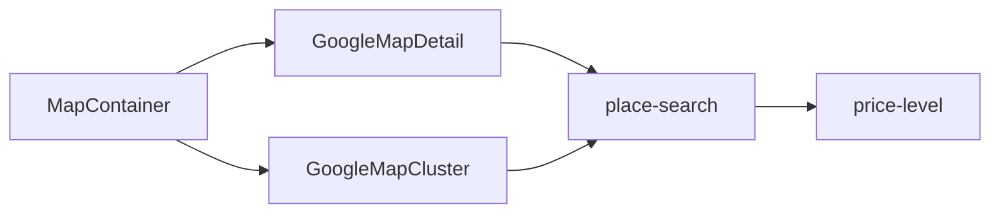

# Google Maps API Integration

<cite>
**Referenced Files in This Document**
- [GoogleMapDetail.tsx](file://src/components/ui/map/GoogleMapDetail.tsx)
- [MapContainer.tsx](file://src/components/ui/map/MapContainer.tsx)
- [GoogleMapCluster.tsx](file://src/components/ui/map/GoogleMapCluster.tsx)
- [place-search.ts](file://src/lib/maps/place-search.ts)
- [locality-pins.ts](file://src/lib/maps/locality-pins.ts)
- [price-level.ts](file://src/lib/maps/price-level.ts)
- [next.config.js](file://next.config.js)
- [globals.css](file://src/app/globals.css)
</cite>

## Update Summary
**Changes Made**
- Updated Map ID Management section to reflect simplified single map ID approach
- Removed references to separate dark/light map IDs and theme-based map selection
- Updated examples and configuration sections to reflect current implementation
- Enhanced theme-aware styling documentation to focus on CSS classes and component props

## Table of Contents
1. [Introduction](#introduction)
2. [Project Structure](#project-structure)
3. [Core Components](#core-components)
4. [Architecture Overview](#architecture-overview)
5. [Detailed Component Analysis](#detailed-component-analysis)
6. [Dependency Analysis](#dependency-analysis)
7. [Performance Considerations](#performance-considerations)
8. [Troubleshooting Guide](#troubleshooting-guide)
9. [Conclusion](#conclusion)
10. [Appendices](#appendices)

## Introduction
This document explains Argo's Google Maps integration layer built on top of @vis.gl/react-google-maps. It covers API key configuration, environment setup with a simplified single map ID approach, the locality pins system, place search and geocoding flows via Google Places (New), error handling strategies, Next.js loading behavior, performance optimizations such as lazy loading and caching, and security considerations for API keys. Theme-aware styling is achieved through CSS classes and component props rather than separate map configurations. It also provides practical examples for extending location types, customizing map styles, and implementing advanced features like route polylines and cluster markers.

## Project Structure
The Google Maps integration is centered around a reusable map component that wraps the Google Maps SDK via APIProvider, with additional utilities for place search, price normalization, and locality-based grouping. A container component handles lazy rendering and intersection-based loading to optimize performance.

**Diagram sources**
- [MapContainer.tsx:1-99](file://src/components/ui/map/MapContainer.tsx#L1-L99)
- [GoogleMapDetail.tsx:1-487](file://src/components/ui/map/GoogleMapDetail.tsx#L1-L487)
- [GoogleMapCluster.tsx:1-176](file://src/components/ui/map/GoogleMapCluster.tsx#L1-L176)
- [place-search.ts:1-469](file://src/lib/maps/place-search.ts#L1-L469)
- [locality-pins.ts:1-78](file://src/lib/maps/locality-pins.ts#L1-L78)
- [price-level.ts:1-36](file://src/lib/maps/price-level.ts#L1-L36)

**Section sources**
- [MapContainer.tsx:1-99](file://src/components/ui/map/MapContainer.tsx#L1-L99)
- [GoogleMapDetail.tsx:1-487](file://src/components/ui/map/GoogleMapDetail.tsx#L1-L487)
- [GoogleMapCluster.tsx:1-176](file://src/components/ui/map/GoogleMapCluster.tsx#L1-L176)
- [place-search.ts:1-469](file://src/lib/maps/place-search.ts#L1-L469)
- [locality-pins.ts:1-78](file://src/lib/maps/locality-pins.ts#L1-L78)
- [price-level.ts:1-36](file://src/lib/maps/price-level.ts#L1-L36)

## Core Components
- MapContainer: Lazy-loads the map when visible using an intersection observer; tracks map load events; supports eager mode for off-screen panels.
- GoogleMapDetail: Wraps the map with APIProvider, uses a single map ID with theme-aware styling through CSS classes and component props, renders locations, route polylines, hover popups, and integrates place search controllers and result markers.
- GoogleMapCluster: Renders clustered markers with optional zoom controls and fit-bounds logic using a single map ID.
- Place Search Utilities: Normalizes results, builds viewport circles, runs Text/Nearby searches, enriches Pro-tier results with Enterprise details, and persists payloads to the backend.
- Locality Pins: Groups entities by region/country labels into clusters for static maps.
- Price Level Normalization: Converts string price levels to a canonical ordinal used across browser and server paths.

**Section sources**
- [MapContainer.tsx:1-99](file://src/components/ui/map/MapContainer.tsx#L1-L99)
- [GoogleMapDetail.tsx:1-487](file://src/components/ui/map/GoogleMapDetail.tsx#L1-L487)
- [GoogleMapCluster.tsx:1-176](file://src/components/ui/map/GoogleMapCluster.tsx#L1-L176)
- [place-search.ts:1-469](file://src/lib/maps/place-search.ts#L1-L469)
- [locality-pins.ts:1-78](file://src/lib/maps/locality-pins.ts#L1-L78)
- [price-level.ts:1-36](file://src/lib/maps/price-level.ts#L1-L36)

## Architecture Overview
The integration uses a layered approach:
- UI components render maps and markers via @vis.gl/react-google-maps with a single map ID.
- Theme-aware styling is applied through CSS classes and component props rather than separate map configurations.
- Place search is driven by a request object and executed against the live map viewport.
- Results are normalized and optionally enriched with Enterprise details.
- Data is persisted to the backend without redundant calls by carrying rich payloads.

**Diagram sources**
- [MapContainer.tsx:40-99](file://src/components/ui/map/MapContainer.tsx#L40-L99)
- [GoogleMapDetail.tsx:105-184](file://src/components/ui/map/GoogleMapDetail.tsx#L105-L184)
- [GoogleMapDetail.tsx:289-463](file://src/components/ui/map/GoogleMapDetail.tsx#L289-L463)
- [place-search.ts:393-469](file://src/lib/maps/place-search.ts#L393-L469)
- [place-search.ts:378-385](file://src/lib/maps/place-search.ts#L378-L385)

## Detailed Component Analysis

### API Key Configuration and Environment Setup
- The Google Maps API key is read from a client-side environment variable and passed to APIProvider.
- **Updated**: A single map ID is used for both light and dark themes, eliminating the need for separate map configurations.
- These values are used consistently across both detail and cluster map components.

Key behaviors:
- API key is consumed only in client components.
- Single map ID simplifies configuration while maintaining visual consistency across themes.
- Fallback map ID is provided if environment variable is missing.

**Section sources**
- [GoogleMapDetail.tsx:23-24](file://src/components/ui/map/GoogleMapDetail.tsx#L23-L24)
- [GoogleMapCluster.tsx:8-9](file://src/components/ui/map/GoogleMapCluster.tsx#L8-L9)

### Simplified Map ID Management
- **Updated**: The integration now uses a single map ID (`NEXT_PUBLIC_GOOGLE_MAPS_MAP_ID_LIGHT`) for all themes.
- Theme differentiation is achieved through CSS classes and component-level styling rather than separate map configurations.
- This simplification reduces maintenance overhead while preserving visual quality across themes.

**Section sources**
- [GoogleMapDetail.tsx:24](file://src/components/ui/map/GoogleMapDetail.tsx#L24)
- [GoogleMapCluster.tsx:9](file://src/components/ui/map/GoogleMapCluster.tsx#L9)

### Theme-Aware Styling Through CSS Classes and Component Props
- **Updated**: Instead of separate map IDs, theme-aware styling is implemented through:
  - CSS custom properties defined in `globals.css` for consistent theming
  - Component props that adapt colors based on resolved theme
  - Tailwind CSS classes that respond to theme context
- Markers, polylines, and UI elements adapt their appearance based on the current theme state.

**Diagram sources**
- [GoogleMapDetail.tsx:358-377](file://src/components/ui/map/GoogleMapDetail.tsx#L358-L377)
- [globals.css:21-740](file://src/app/globals.css#L21-L740)

**Section sources**
- [GoogleMapDetail.tsx:358-377](file://src/components/ui/map/GoogleMapDetail.tsx#L358-L377)
- [globals.css:21-740](file://src/app/globals.css#L21-L740)

### Locality Pins System
- Groups saved entities by "region, country" or "country" labels to produce presentation clusters for static maps.
- Computes mean coordinates per group and returns cluster data plus a mapping from locality to entity IDs.
- Distinct from planner geographic clustering; this is purely a labeling/grouping concern.

**Diagram sources**
- [locality-pins.ts:28-77](file://src/lib/maps/locality-pins.ts#L28-L77)

**Section sources**
- [locality-pins.ts:1-78](file://src/lib/maps/locality-pins.ts#L1-L78)

### Place Search and Geocoding Integration
- Supports two modes:
  - Text query → Text Search (New) biased to the current map bounds.
  - Chip-only query → Nearby Search (New) restricted to a viewport-derived circle.
- Uses a field mask that includes Enterprise-tier fields to minimize extra calls; one request can return up to ~20 places.
- Normalizes results to a consistent shape, including photos, opening hours, phone, website, business status, and links.
- Detects when a result lacks Enterprise details and triggers a targeted Place Details fetch to enrich it.
- Builds a payload for server persistence to avoid redundant backend enrichment.

**Diagram sources**
- [GoogleMapDetail.tsx:105-184](file://src/components/ui/map/GoogleMapDetail.tsx#L105-L184)
- [place-search.ts:155-175](file://src/lib/maps/place-search.ts#L155-L175)
- [place-search.ts:393-469](file://src/lib/maps/place-search.ts#L393-L469)
- [place-search.ts:378-385](file://src/lib/maps/place-search.ts#L378-L385)

**Section sources**
- [place-search.ts:1-469](file://src/lib/maps/place-search.ts#L1-L469)
- [GoogleMapDetail.tsx:105-184](file://src/components/ui/map/GoogleMapDetail.tsx#L105-L184)

### Error Handling Strategies
- Place search errors are caught and logged; results are cleared and loading state reset.
- Dev-mode logging groups request/response details for debugging.

**Diagram sources**
- [GoogleMapDetail.tsx:126-151](file://src/components/ui/map/GoogleMapDetail.tsx#L126-L151)
- [place-search.ts:438-465](file://src/lib/maps/place-search.ts#L438-L465)

**Section sources**
- [GoogleMapDetail.tsx:126-151](file://src/components/ui/map/GoogleMapDetail.tsx#L126-L151)
- [place-search.ts:438-465](file://src/lib/maps/place-search.ts#L438-L465)

### Next.js Configuration for Google Maps Loading
- The map component is dynamically imported with SSR disabled to ensure the Google Maps SDK loads only in the browser.
- IntersectionObserver-based lazy loading defers rendering until the map container is in view, reducing initial bundle and network usage.
- Optional eager mode allows immediate rendering for off-screen panels where visibility detection is not suitable.

**Section sources**
- [MapContainer.tsx:4-8](file://src/components/ui/map/MapContainer.tsx#L4-L8)
- [MapContainer.tsx:40-54](file://src/components/ui/map/MapContainer.tsx#L40-L54)
- [MapContainer.tsx:56-90](file://src/components/ui/map/MapContainer.tsx#L56-L90)

### Performance Optimizations
- Lazy loading via dynamic import and intersection observer.
- Single billed request for up to ~20 places with a comprehensive field mask to reduce subsequent calls.
- Enrichment only when needed (Pro-tier result detected missing Enterprise fields).
- Fit-bounds and auto-zoom calculations to minimize unnecessary re-renders.
- Polylines rendered with encoded paths for efficient path representation.
- **Updated**: Simplified map ID management reduces configuration complexity and potential loading issues.

**Section sources**
- [MapContainer.tsx:40-54](file://src/components/ui/map/MapContainer.tsx#L40-L54)
- [place-search.ts:1-8](file://src/lib/maps/place-search.ts#L1-L8)
- [place-search.ts:328-359](file://src/lib/maps/place-search.ts#L328-L359)
- [GoogleMapDetail.tsx:358-377](file://src/components/ui/map/GoogleMapDetail.tsx#L358-L377)

### Security Considerations for API Key Management
- API keys are loaded from client environment variables and never embedded in server code.
- Keys are scoped to specific domains and referrers in Google Cloud Console to prevent misuse.
- Avoid logging sensitive keys; use environment variables and restrict access to build/runtime secrets.
- **Updated**: Single map ID simplifies security configuration while maintaining appropriate scoping.

[No sources needed since this section provides general guidance]

## Dependency Analysis
The following diagram shows how components depend on each other and on utility modules.

**Diagram sources**
- [MapContainer.tsx:40-99](file://src/components/ui/map/MapContainer.tsx#L40-L99)
- [GoogleMapDetail.tsx:1-12](file://src/components/ui/map/GoogleMapDetail.tsx#L1-L12)
- [GoogleMapCluster.tsx:1-12](file://src/components/ui/map/GoogleMapCluster.tsx#L1-L12)
- [place-search.ts:1-12](file://src/lib/maps/place-search.ts#L1-L12)
- [price-level.ts:1-36](file://src/lib/maps/price-level.ts#L1-L36)

**Section sources**
- [MapContainer.tsx:40-99](file://src/components/ui/map/MapContainer.tsx#L40-L99)
- [GoogleMapDetail.tsx:1-12](file://src/components/ui/map/GoogleMapDetail.tsx#L1-L12)
- [GoogleMapCluster.tsx:1-12](file://src/components/ui/map/GoogleMapCluster.tsx#L1-L12)
- [place-search.ts:1-12](file://src/lib/maps/place-search.ts#L1-L12)
- [price-level.ts:1-36](file://src/lib/maps/price-level.ts#L1-L36)

## Performance Considerations
- Prefer lazy loading for maps to reduce initial page weight.
- Use a single rich search call with Enterprise fields to minimize total requests.
- Enrich Pro-tier results only when necessary to save costs.
- Use fit-bounds and auto-zoom to avoid excessive camera updates.
- Reuse encoded polylines for routes to keep rendering efficient.
- **Updated**: Simplified map ID management improves reliability and reduces potential configuration-related performance issues.

[No sources needed since this section provides general guidance]

## Troubleshooting Guide
Common issues and resolutions:
- Map does not load: Ensure the API key is valid and allowed for your domain; verify that the map component is rendered in the browser (SSR disabled).
- No search results: Check that the map has valid bounds; confirm that the Places library is available before running searches.
- Missing details on pin click: If Enterprise fields are absent, trigger the Place Details fetcher to enrich the result.
- **Updated**: Theme display issues: Verify CSS custom properties are properly defined in globals.css and that theme context is correctly propagated.

**Section sources**
- [GoogleMapDetail.tsx:126-151](file://src/components/ui/map/GoogleMapDetail.tsx#L126-L151)
- [place-search.ts:378-385](file://src/lib/maps/place-search.ts#L378-L385)

## Conclusion
Argo's Google Maps integration leverages a clean separation between UI, utilities, and services with a simplified approach to theme management. The removal of separate dark/light map IDs streamlines configuration while maintaining visual quality through CSS classes and component props. It optimizes cost and performance through intelligent search strategies, lazy loading, and selective enrichment. Robust error handling and validation improve reliability. Extending the system involves adding new location types, updating map styles via the single map ID, and integrating advanced features like clustering and route visualization.

[No sources needed since this section summarizes without analyzing specific files]

## Appendices

### Examples and How-To Guides

#### Add a New Location Type (Chip)
- Extend the chips array with a new id, label, and includedTypes mapping to Places API types.
- The search runner will automatically include the type in queries.

**Section sources**
- [place-search.ts:80-89](file://src/lib/maps/place-search.ts#L80-L89)

#### Customize Map Styles Per Theme
- **Updated**: Configure a single map style in Google Cloud Console and assign it to the `NEXT_PUBLIC_GOOGLE_MAPS_MAP_ID_LIGHT` environment variable.
- Theme differentiation is achieved through CSS custom properties in `globals.css` and component-level styling.
- The map component applies theme-appropriate colors to markers, polylines, and UI elements automatically.

**Section sources**
- [GoogleMapDetail.tsx:24](file://src/components/ui/map/GoogleMapDetail.tsx#L24)
- [GoogleMapCluster.tsx:9](file://src/components/ui/map/GoogleMapCluster.tsx#L9)
- [globals.css:21-740](file://src/app/globals.css#L21-L740)

#### Implement Advanced Features
- Route Polylines: Pass encoded polyline segments to render styled routes with day-based colors that adapt to theme.
- Clustering: Use GoogleMapCluster to display grouped markers with interactive controls.
- Place Details Enrichment: Expose a fetcher to enrich Pro-tier results on demand.

**Section sources**
- [GoogleMapDetail.tsx:358-377](file://src/components/ui/map/GoogleMapDetail.tsx#L358-L377)
- [GoogleMapCluster.tsx:100-134](file://src/components/ui/map/GoogleMapCluster.tsx#L100-L134)
- [GoogleMapDetail.tsx:321-327](file://src/components/ui/map/GoogleMapDetail.tsx#L321-L327)
- [place-search.ts:378-385](file://src/lib/maps/place-search.ts#L378-L385)