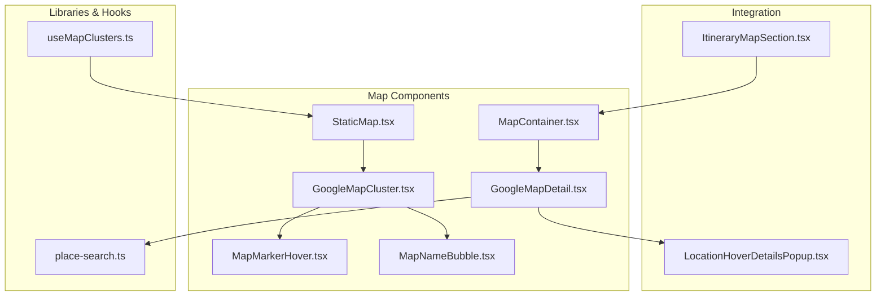
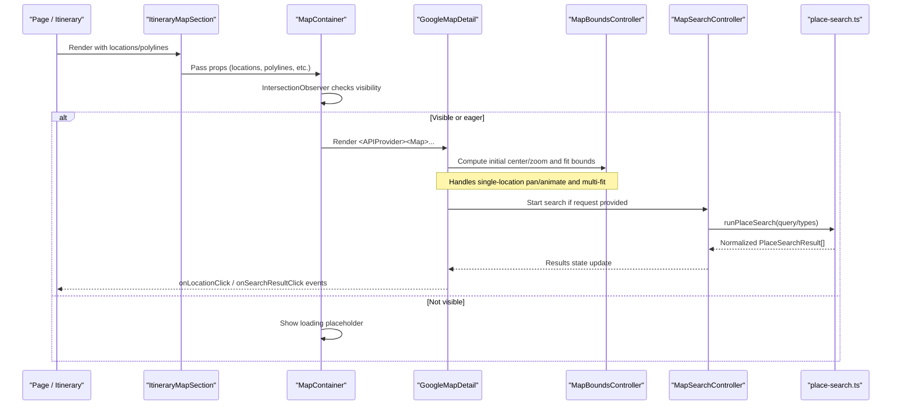
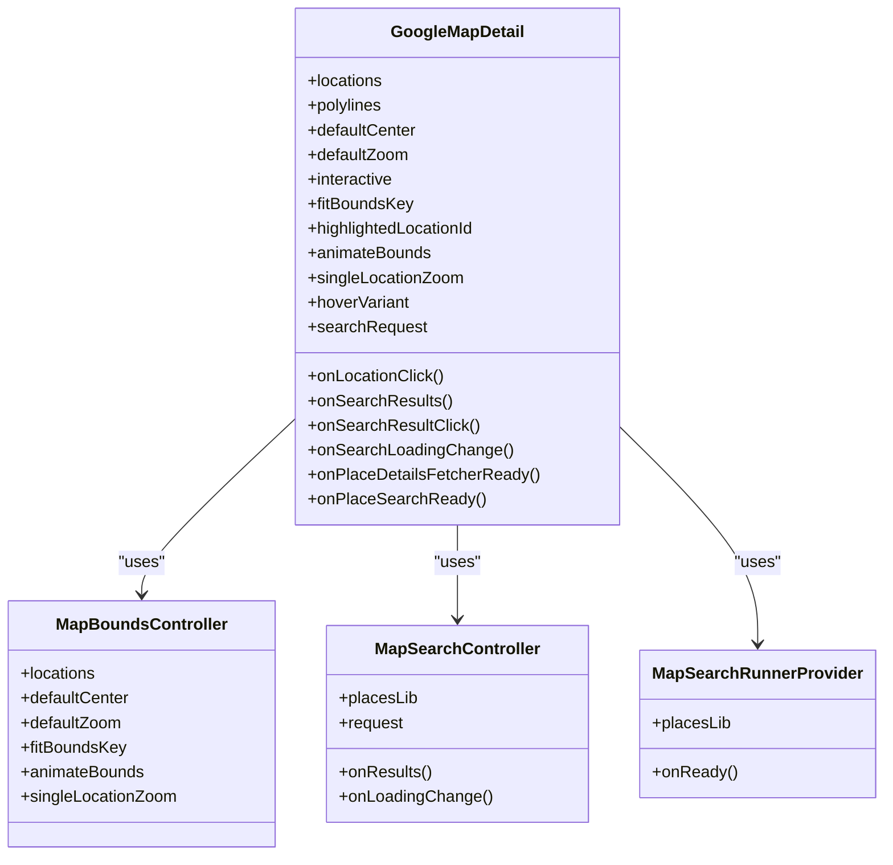
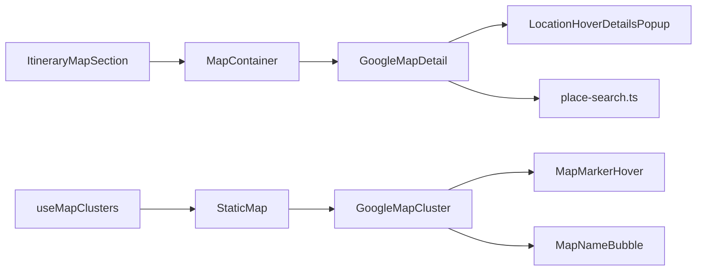

# Interactive Map Components

<cite>
**Referenced Files in This Document**
- [MapContainer.tsx](file://src/components/ui/map/MapContainer.tsx)
- [GoogleMapDetail.tsx](file://src/components/ui/map/GoogleMapDetail.tsx)
- [GoogleMapCluster.tsx](file://src/components/ui/map/GoogleMapCluster.tsx)
- [StaticMap.tsx](file://src/components/ui/map/StaticMap.tsx)
- [MapMarkerHover.tsx](file://src/components/ui/map/MapMarkerHover.tsx)
- [MapNameBubble.tsx](file://src/components/ui/map/MapNameBubble.tsx)
- [ItineraryMapSection.tsx](file://src/components/ui/itinerary/ItineraryMapSection.tsx)
- [LocationHoverDetailsPopup.tsx](file://src/components/ui/detail-views/LocationHoverDetailsPopup.tsx)
- [place-search.ts](file://src/lib/maps/place-search.ts)
- [useMapClusters.ts](file://src/hooks/useMapClusters.ts)
</cite>

## Table of Contents
1. [Introduction](#introduction)
2. [Project Structure](#project-structure)
3. [Core Components](#core-components)
4. [Architecture Overview](#architecture-overview)
5. [Detailed Component Analysis](#detailed-component-analysis)
6. [Dependency Analysis](#dependency-analysis)
7. [Performance Considerations](#performance-considerations)
8. [Troubleshooting Guide](#troubleshooting-guide)
9. [Conclusion](#conclusion)
10. [Appendices](#appendices)

## Introduction
This document explains the interactive map components that power dynamic Google Maps rendering and user interactions across the application. It focuses on:
- MapContainer as the main wrapper for lazy-loading and lifecycle management of Google Maps integration
- GoogleMapDetail for rendering locations, polylines, search results, and hover details
- Event handling for clicks, zoom controls, centering, and responsive behavior
- Adding custom overlays and integrating with itinerary planning features

The goal is to provide a clear mental model for developers integrating maps into itineraries, collections, dashboards, and detail views.

## Project Structure
The map feature is organized around reusable components under src/components/ui/map, supporting both detailed single-map experiences and clustered overviews. Supporting utilities handle place search and cluster data fetching.

**Diagram sources**
- [MapContainer.tsx:40-99](file://src/components/ui/map/MapContainer.tsx#L40-L99)
- [GoogleMapDetail.tsx:289-489](file://src/components/ui/map/GoogleMapDetail.tsx#L289-L489)
- [GoogleMapCluster.tsx:80-180](file://src/components/ui/map/GoogleMapCluster.tsx#L80-L180)
- [StaticMap.tsx:39-103](file://src/components/ui/map/StaticMap.tsx#L39-L103)
- [ItineraryMapSection.tsx:21-53](file://src/components/ui/itinerary/ItineraryMapSection.tsx#L21-L53)
- [LocationHoverDetailsPopup.tsx:116-217](file://src/components/ui/detail-views/LocationHoverDetailsPopup.tsx#L116-L217)
- [place-search.ts:393-469](file://src/lib/maps/place-search.ts#L393-L469)
- [useMapClusters.ts:35-61](file://src/hooks/useMapClusters.ts#L35-L61)

**Section sources**
- [MapContainer.tsx:1-99](file://src/components/ui/map/MapContainer.tsx#L1-L99)
- [GoogleMapDetail.tsx:1-490](file://src/components/ui/map/GoogleMapDetail.tsx#L1-L490)
- [GoogleMapCluster.tsx:1-181](file://src/components/ui/map/GoogleMapCluster.tsx#L1-L181)
- [StaticMap.tsx:1-103](file://src/components/ui/map/StaticMap.tsx#L1-L103)
- [ItineraryMapSection.tsx:1-54](file://src/components/ui/itinerary/ItineraryMapSection.tsx#L1-L54)
- [LocationHoverDetailsPopup.tsx:1-217](file://src/components/ui/detail-views/LocationHoverDetailsPopup.tsx#L1-L217)
- [place-search.ts:1-469](file://src/lib/maps/place-search.ts#L1-L469)
- [useMapClusters.ts:1-61](file://src/hooks/useMapClusters.ts#L1-L61)

## Core Components
- MapContainer: Lazy-loads GoogleMaps via Next.js dynamic import, tracks visibility with an intersection observer, and renders a loading placeholder until the map is visible or eager mode is enabled. It passes configuration down to GoogleMapDetail.
- GoogleMapDetail: The core map implementation using @vis.gl/react-google-maps. Renders markers, route polylines, search result markers, and hover popups. Manages bounds, zoom, and interactive gestures. Exposes callbacks for location clicks and search interactions.
- StaticMap and GoogleMapCluster: Provide a clustered view of locations with optional zoom controls and hover states. StaticMap lazily loads GoogleMapCluster and handles intersection-based loading.
- MapMarkerHover and MapNameBubble: Lightweight UI elements used by cluster markers and search/location hover states.
- ItineraryMapSection: Integrates MapContainer within an itinerary page layout, passing locations and polylines.
- LocationHoverDetailsPopup: Rich hover card shown when hovering over itinerary pins (configurable via hoverVariant).

Key responsibilities:
- Initialization and lifecycle: Intersection observer + dynamic imports ensure maps load only when needed.
- Configuration: Center, zoom, interactivity, fit bounds, highlight, animation toggles.
- Events: Clicks on pins and search results; hover states for rich popups.
- Search: Viewport-biased place search with Enterprise SKU fields and tracking.
- Overlays: Polylines for routes and custom marker content.

**Section sources**
- [MapContainer.tsx:10-99](file://src/components/ui/map/MapContainer.tsx#L10-L99)
- [GoogleMapDetail.tsx:23-54](file://src/components/ui/map/GoogleMapDetail.tsx#L23-L54)
- [GoogleMapDetail.tsx:56-103](file://src/components/ui/map/GoogleMapDetail.tsx#L56-L103)
- [GoogleMapDetail.tsx:105-184](file://src/components/ui/map/GoogleMapDetail.tsx#L105-L184)
- [GoogleMapDetail.tsx:250-287](file://src/components/ui/map/GoogleMapDetail.tsx#L250-L287)
- [GoogleMapDetail.tsx:289-489](file://src/components/ui/map/GoogleMapDetail.tsx#L289-L489)
- [StaticMap.tsx:9-32](file://src/components/ui/map/StaticMap.tsx#L9-L32)
- [StaticMap.tsx:39-103](file://src/components/ui/map/StaticMap.tsx#L39-L103)
- [GoogleMapCluster.tsx:13-67](file://src/components/ui/map/GoogleMapCluster.tsx#L13-L67)
- [GoogleMapCluster.tsx:80-180](file://src/components/ui/map/GoogleMapCluster.tsx#L80-L180)
- [MapMarkerHover.tsx:7-78](file://src/components/ui/map/MapMarkerHover.tsx#L7-L78)
- [MapNameBubble.tsx:5-26](file://src/components/ui/map/MapNameBubble.tsx#L5-L26)
- [ItineraryMapSection.tsx:13-53](file://src/components/ui/itinerary/ItineraryMapSection.tsx#L13-L53)
- [LocationHoverDetailsPopup.tsx:95-217](file://src/components/ui/detail-views/LocationHoverDetailsPopup.tsx#L95-L217)

## Architecture Overview
The architecture separates concerns between container-level lazy loading, map rendering, search orchestration, and UI overlays.

**Diagram sources**
- [ItineraryMapSection.tsx:21-53](file://src/components/ui/itinerary/ItineraryMapSection.tsx#L21-L53)
- [MapContainer.tsx:45-99](file://src/components/ui/map/MapContainer.tsx#L45-L99)
- [GoogleMapDetail.tsx:56-103](file://src/components/ui/map/GoogleMapDetail.tsx#L56-L103)
- [GoogleMapDetail.tsx:105-184](file://src/components/ui/map/GoogleMapDetail.tsx#L105-L184)
- [place-search.ts:393-469](file://src/lib/maps/place-search.ts#L393-L469)

## Detailed Component Analysis

### MapContainer
Responsibilities:
- Lazy-load GoogleMapDetail dynamically to avoid SSR and reduce bundle size
- Track visibility with useIntersectionObserver and render a placeholder until ready
- Emit a map load event once rendered
- Forward all relevant props to GoogleMapDetail (locations, polylines, center, zoom, interactivity, fit bounds, highlights, animations, hover variant, callbacks)

Configuration options:
- className, height: sizing and styling
- eager: bypass lazy loading for off-screen panels like picture-in-picture
- All GoogleMapDetailProps are supported (see below)

Lifecycle:
- On mount: set up intersection observer
- When visible or eager: track load and render map
- While not visible: show loading placeholder

Event handling:
- Delegates click and search callbacks to GoogleMapDetail

**Section sources**
- [MapContainer.tsx:10-99](file://src/components/ui/map/MapContainer.tsx#L10-L99)

### GoogleMapDetail
Responsibilities:
- Initialize Google Maps with theme-aware map IDs
- Compute initial center and zoom based on locations or defaults
- Manage bounds and zoom transitions for single vs multiple locations
- Render route polylines with layered stroke (white outline + colored line)
- Render AdvancedMarker pins with hover popups (rich card or name bubble)
- Run viewport-biased place searches and render result markers
- Expose enterprise place details fetcher and search runner to parent

Key behaviors:
- MapBoundsController:
  - First render: move camera to estimated center/zoom
  - Single location: animate pan and set zoom level (configurable)
  - Multiple locations: fit bounds with padding
- MapSearchController:
  - Executes text or nearby search based on query presence
  - Tracks billing mode and updates loading state
  - Uses refs to avoid re-running due to unstable callback identities
- Hover variants:
  - "card": shows LocationHoverDetailsPopup with image, category, address, opening hours, and action buttons
  - "name": shows lightweight MapNameBubble

Event handling:
- Pin click: onLocationClick(location)
- Search result pin click: onSearchResultClick(place)
- Search loading changes: onSearchLoadingChange(loading)
- Place details/search readiness: onPlaceDetailsFetcherReady, onPlaceSearchReady

Responsive behavior:
- gestureHandling toggled by interactive prop
- disableDefaultUI and clickableIcons for consistent UX
- Dynamic map ID selection based on theme

**Section sources**
- [GoogleMapDetail.tsx:23-54](file://src/components/ui/map/GoogleMapDetail.tsx#L23-L54)
- [GoogleMapDetail.tsx:56-103](file://src/components/ui/map/GoogleMapDetail.tsx#L56-L103)
- [GoogleMapDetail.tsx:105-184](file://src/components/ui/map/GoogleMapDetail.tsx#L105-L184)
- [GoogleMapDetail.tsx:193-248](file://src/components/ui/map/GoogleMapDetail.tsx#L193-L248)
- [GoogleMapDetail.tsx:250-287](file://src/components/ui/map/GoogleMapDetail.tsx#L250-L287)
- [GoogleMapDetail.tsx:289-489](file://src/components/ui/map/GoogleMapDetail.tsx#L289-L489)

#### Class Diagram: GoogleMapDetail Internal Structure

**Diagram sources**
- [GoogleMapDetail.tsx:56-103](file://src/components/ui/map/GoogleMapDetail.tsx#L56-L103)
- [GoogleMapDetail.tsx:105-184](file://src/components/ui/map/GoogleMapDetail.tsx#L105-L184)
- [GoogleMapDetail.tsx:289-489](file://src/components/ui/map/GoogleMapDetail.tsx#L289-L489)

### StaticMap and GoogleMapCluster
StaticMap:
- Lazily loads GoogleMapCluster when visible
- Tracks map load events
- Provides a simple interface for clusters with optional zoom controls and hover states

GoogleMapCluster:
- Computes auto center and zoom from cluster extents
- Renders AdvancedMarker with MapClusterMarker for each cluster
- Optional MapControl with zoom in/out buttons
- Supports hover-driven detail content via renderDetailContent

**Section sources**
- [StaticMap.tsx:9-103](file://src/components/ui/map/StaticMap.tsx#L9-L103)
- [GoogleMapCluster.tsx:13-67](file://src/components/ui/map/GoogleMapCluster.tsx#L13-L67)
- [GoogleMapCluster.tsx:80-180](file://src/components/ui/map/GoogleMapCluster.tsx#L80-L180)

### Itinerary Integration
ItineraryMapSection:
- Wraps MapContainer with responsive sizing and layout
- Accepts locations, polylines, default center, and hover variant
- Renders nothing when there are no locations

Usage pattern:
- Pass itinerary stops as MapLocation[] with dayIndex for numbered pins
- Pass route segments as MapPolylineSegment[] for visual connections
- Optionally set hoverVariant to "name" for lightweight labels

**Section sources**
- [ItineraryMapSection.tsx:13-53](file://src/components/ui/itinerary/ItineraryMapSection.tsx#L13-L53)

### Place Search and Enrichment
place-search.ts:
- Defines normalized PlaceSearchResult and search request types
- Chooses Text Search or Nearby Search based on query presence
- Derives viewport circle for Nearby Search and caps radius
- Normalizes photos, price levels, opening hours, and metadata
- Provides fetchPlaceDetailsEnterprise to enrich Pro-tier results
- Tracks billed requests and logs debug info in development

Integration points:
- MapSearchController triggers searches when request.nonce changes
- MapSearchRunnerProvider exposes a runner to parents outside APIProvider
- Results are rendered as markers with hover bubbles

**Section sources**
- [place-search.ts:19-153](file://src/lib/maps/place-search.ts#L19-L153)
- [place-search.ts:155-175](file://src/lib/maps/place-search.ts#L155-L175)
- [place-search.ts:177-265](file://src/lib/maps/place-search.ts#L177-L265)
- [place-search.ts:374-469](file://src/lib/maps/place-search.ts#L374-L469)

### Cluster Data Hook
useMapClusters:
- Fetches cluster data for different sources (dashboard, collections, content, itineraries)
- Builds locality pins with appropriate variants
- Returns clusters, entity mapping, and loading state

**Section sources**
- [useMapClusters.ts:1-61](file://src/hooks/useMapClusters.ts#L1-L61)

## Dependency Analysis
High-level dependencies:
- MapContainer depends on GoogleMapDetail and intersection observer
- GoogleMapDetail depends on @vis.gl/react-google-maps, theme provider, and place-search utilities
- StaticMap depends on GoogleMapCluster and intersection observer
- ItineraryMapSection composes MapContainer for itinerary pages
- LocationHoverDetailsPopup is consumed by GoogleMapDetail for rich hover cards

**Diagram sources**
- [MapContainer.tsx:40-99](file://src/components/ui/map/MapContainer.tsx#L40-L99)
- [GoogleMapDetail.tsx:289-489](file://src/components/ui/map/GoogleMapDetail.tsx#L289-L489)
- [StaticMap.tsx:39-103](file://src/components/ui/map/StaticMap.tsx#L39-L103)
- [GoogleMapCluster.tsx:80-180](file://src/components/ui/map/GoogleMapCluster.tsx#L80-L180)
- [ItineraryMapSection.tsx:21-53](file://src/components/ui/itinerary/ItineraryMapSection.tsx#L21-L53)
- [LocationHoverDetailsPopup.tsx:116-217](file://src/components/ui/detail-views/LocationHoverDetailsPopup.tsx#L116-L217)
- [place-search.ts:393-469](file://src/lib/maps/place-search.ts#L393-L469)
- [useMapClusters.ts:35-61](file://src/hooks/useMapClusters.ts#L35-L61)

**Section sources**
- [MapContainer.tsx:40-99](file://src/components/ui/map/MapContainer.tsx#L40-L99)
- [GoogleMapDetail.tsx:289-489](file://src/components/ui/map/GoogleMapDetail.tsx#L289-L489)
- [StaticMap.tsx:39-103](file://src/components/ui/map/StaticMap.tsx#L39-L103)
- [GoogleMapCluster.tsx:80-180](file://src/components/ui/map/GoogleMapCluster.tsx#L80-L180)
- [ItineraryMapSection.tsx:21-53](file://src/components/ui/itinerary/ItineraryMapSection.tsx#L21-L53)
- [LocationHoverDetailsPopup.tsx:116-217](file://src/components/ui/detail-views/LocationHoverDetailsPopup.tsx#L116-L217)
- [place-search.ts:393-469](file://src/lib/maps/place-search.ts#L393-L469)
- [useMapClusters.ts:35-61](file://src/hooks/useMapClusters.ts#L35-L61)

## Performance Considerations
- Lazy loading: Both MapContainer and StaticMap defer map initialization until visible or eager mode, reducing initial payload and improving perceived performance.
- Intersection observer: Prevents unnecessary map instances from mounting off-screen.
- Fit bounds optimization: Initial fit uses estimated zoom to avoid excessive panning; subsequent single-location changes can animate smoothly.
- Search cost control: One request returns up to ~20 places; billing tracked per request; Enterprise fields requested to avoid extra Place Details calls unless necessary.
- Marker rendering: AdvancedMarker used for efficient DOM updates; hover states managed via React state to minimize re-renders.
- Theme switching: Map IDs change with theme; consider debouncing rapid theme toggles if needed.

[No sources needed since this section provides general guidance]

## Troubleshooting Guide
Common issues and resolutions:
- Map does not appear:
  - Ensure the container has a non-zero height and is visible in the viewport
  - Check that environment variables for API key and map IDs are set
  - Verify that intersection observer detects visibility or set eager=true for off-screen panels
- Search not returning results:
  - Confirm that request includes a nonce to trigger re-runs
  - Validate includedTypes and query; empty query triggers Nearby Search restricted to viewport circle
  - Check console logs for request debugging and normalized results
- Incorrect centering or zoom:
  - For single locations, adjust singleLocationZoom and animateBounds
  - For multiple locations, ensure fitBoundsKey increments when you need to re-fit
- Hover popup not showing:
  - Verify hoverVariant is set appropriately ("card" vs "name")
  - Ensure LocationHoverDetailsPopup props (name, imageUrl, address, openingHours) are provided for rich card

Error handling patterns:
- Search errors log to console and reset results to empty array
- Loading states are updated via onSearchLoadingChange to reflect ongoing requests
- Place details enrichment gracefully handles missing fields

**Section sources**
- [GoogleMapDetail.tsx:105-184](file://src/components/ui/map/GoogleMapDetail.tsx#L105-L184)
- [GoogleMapDetail.tsx:289-489](file://src/components/ui/map/GoogleMapDetail.tsx#L289-L489)
- [place-search.ts:393-469](file://src/lib/maps/place-search.ts#L393-L469)

## Conclusion
The interactive map system provides a robust, performant foundation for displaying locations, routes, and search results on Google Maps. MapContainer ensures efficient lifecycle management, while GoogleMapDetail offers comprehensive control over rendering, events, and search. StaticMap and GoogleMapCluster support clustered overviews with optional zoom controls. Integration with itinerary planning is straightforward through ItineraryMapSection, enabling rich user experiences with hover details and route visualization.

[No sources needed since this section summarizes without analyzing specific files]

## Appendices

### Example: Adding Custom Overlays
- Route polylines:
  - Pass polylines as MapPolylineSegment[] to MapContainer/GoogleMapDetail
  - Each segment includes id, dayIndex, encodedPath, and optional color
  - GoogleMapDetail renders a white outline polyline beneath a colored polyline for emphasis
- Custom markers:
  - Use AdvancedMarker content inside GoogleMapDetail to render custom SVG or images
  - StopPin component demonstrates numbered, day-colored teardrop pins for itinerary stops
  - SearchMarker shows default pin with hover scaling for search results

**Section sources**
- [GoogleMapDetail.tsx:359-428](file://src/components/ui/map/GoogleMapDetail.tsx#L359-L428)
- [GoogleMapDetail.tsx:193-248](file://src/components/ui/map/GoogleMapDetail.tsx#L193-L248)

### Example: Handling Map State Changes
- Fit bounds:
  - Increment fitBoundsKey to re-trigger fitting logic in MapBoundsController
- Single location focus:
  - Set animateBounds to enable smooth pan and zoom to a single stop
  - Adjust singleLocationZoom to control zoom level when focusing one location
- Interactivity:
  - Toggle interactive to enable/disable gestures (scroll zoom, drag, double-click zoom)

**Section sources**
- [GoogleMapDetail.tsx:56-103](file://src/components/ui/map/GoogleMapDetail.tsx#L56-L103)
- [GoogleMapDetail.tsx:250-287](file://src/components/ui/map/GoogleMapDetail.tsx#L250-L287)

### Example: Integrating with Itinerary Planning
- Provide locations with dayIndex to generate numbered pins and route colors
- Provide polylines to visualize travel legs between stops
- Use hoverVariant="name" for lightweight labels or "card" for rich details
- Handle onLocationClick to open itinerary detail panel or actions

**Section sources**
- [ItineraryMapSection.tsx:21-53](file://src/components/ui/itinerary/ItineraryMapSection.tsx#L21-L53)
- [GoogleMapDetail.tsx:289-489](file://src/components/ui/map/GoogleMapDetail.tsx#L289-L489)