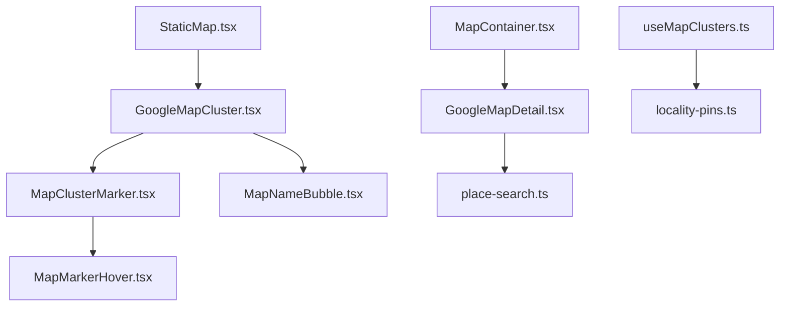
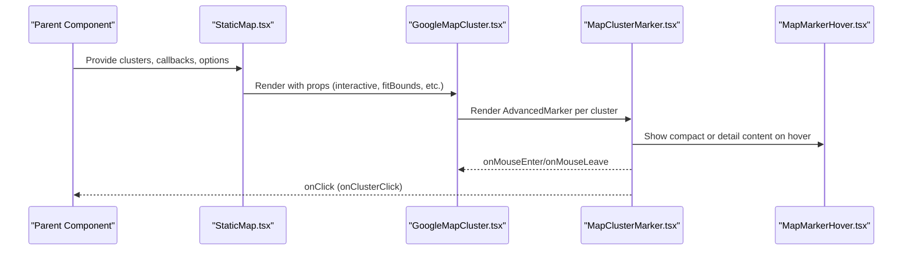
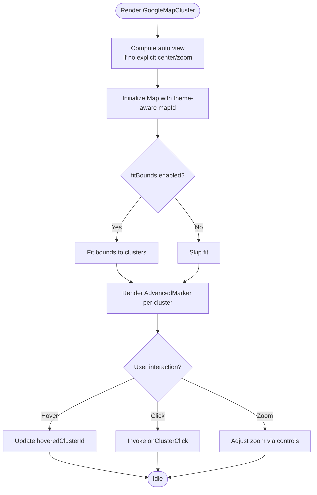
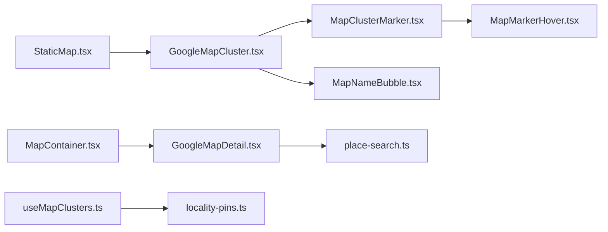

# Interactive Maps

<cite>
**Referenced Files in This Document**
- [GoogleMapCluster.tsx](file://src/components/ui/map/GoogleMapCluster.tsx)
- [StaticMap.tsx](file://src/components/ui/map/StaticMap.tsx)
- [MapContainer.tsx](file://src/components/ui/map/MapContainer.tsx)
- [GoogleMapDetail.tsx](file://src/components/ui/map/GoogleMapDetail.tsx)
- [MapClusterMarker.tsx](file://src/components/ui/map/MapClusterMarker.tsx)
- [MapMarkerHover.tsx](file://src/components/ui/map/MapMarkerHover.tsx)
- [MapNameBubble.tsx](file://src/components/ui/map/MapNameBubble.tsx)
- [useMapClusters.ts](file://src/hooks/useMapClusters.ts)
- [locality-pins.ts](file://src/lib/maps/locality-pins.ts)
- [place-search.ts](file://src/lib/maps/place-search.ts)
- [ThemeProvider.tsx](file://src/components/ThemeProvider.tsx)
</cite>

## Table of Contents
1. Introduction
2. Project Structure
3. Core Components
4. Architecture Overview
5. Detailed Component Analysis
6. Dependency Analysis
7. Performance Considerations
8. Troubleshooting Guide
9. Conclusion

## Introduction
This document explains Argo’s interactive Google Maps implementation with a focus on the GoogleMapCluster component and its ecosystem. It covers map initialization, theme-aware styling (light/dark), interactive controls (zoom, gestures), automatic viewport fitting via MapBoundsController, AdvancedMarker-based custom markers, event handling for cluster interactions, configuration options (center/zoom, fit bounds, interactivity), and integration patterns with application state and data fetching.

## Project Structure
The maps feature is organized into reusable UI components under src/components/ui/map, hooks for data fetching under src/hooks, and shared utilities under src/lib/maps. The primary entry points are:
- StaticMap: lazy-loads and wraps GoogleMapCluster with intersection-based rendering and hover state management.
- GoogleMapCluster: renders the interactive map with clusters, zoom controls, and theme-aware map IDs.
- GoogleMapDetail: a more advanced map supporting polylines, place search, and rich hover cards.
- Supporting components: MapClusterMarker, MapMarkerHover, MapNameBubble.
- Data layer: useMapClusters hook and locality-pins utility to build cluster data from raw locations.

**Diagram sources**
- [StaticMap.tsx:34-93](file://src/components/ui/map/StaticMap.tsx#L34-L93)
- [GoogleMapCluster.tsx:100-134](file://src/components/ui/map/GoogleMapCluster.tsx#L100-L134)
- [MapClusterMarker.tsx:51-108](file://src/components/ui/map/MapClusterMarker.tsx#L51-L108)
- [MapMarkerHover.tsx:42-70](file://src/components/ui/map/MapMarkerHover.tsx#L42-L70)
- [MapNameBubble.tsx:15-23](file://src/components/ui/map/MapNameBubble.tsx#L15-L23)
- [GoogleMapDetail.tsx:341-461](file://src/components/ui/map/GoogleMapDetail.tsx#L341-L461)
- [place-search.ts:1-200](file://src/lib/maps/place-search.ts#L1-L200)
- [useMapClusters.ts:35-60](file://src/hooks/useMapClusters.ts#L35-L60)
- [locality-pins.ts:28-77](file://src/lib/maps/locality-pins.ts#L28-L77)
- [MapContainer.tsx:45-91](file://src/components/ui/map/MapContainer.tsx#L45-L91)

**Section sources**
- [StaticMap.tsx:34-93](file://src/components/ui/map/StaticMap.tsx#L34-L93)
- [GoogleMapCluster.tsx:100-134](file://src/components/ui/map/GoogleMapCluster.tsx#L100-L134)
- [GoogleMapDetail.tsx:341-461](file://src/components/ui/map/GoogleMapDetail.tsx#L341-L461)
- [MapContainer.tsx:45-91](file://src/components/ui/map/MapContainer.tsx#L45-L91)
- [useMapClusters.ts:35-60](file://src/hooks/useMapClusters.ts#L35-L60)
- [locality-pins.ts:28-77](file://src/lib/maps/locality-pins.ts#L28-L77)

## Core Components
- GoogleMapCluster: Wraps APIProvider and renders an interactive Map with theme-aware map IDs, optional zoom controls, gesture handling, and cluster markers. Provides automatic viewport calculation and optional fit-bounds behavior.
- StaticMap: Lazy-loads GoogleMapCluster when visible, manages hover state for clusters, and tracks map load events.
- GoogleMapDetail: Full-featured map with polyline routes, stop pins, place search, and rich hover details.
- MapClusterMarker: Renders the visual marker and hover popup for clusters.
- MapMarkerHover: Lightweight hover badge showing count and label.
- MapNameBubble: Minimal name-only bubble for light-weight hover states.
- useMapClusters: Fetches and builds cluster data by locality grouping.
- locality-pins: Groups raw locations into clusters and computes centroid positions.

Key responsibilities:
- Theme-aware styling: Both GoogleMapCluster and GoogleMapDetail select map IDs based on resolved theme.
- Interactivity: Gesture handling toggled via props; optional zoom controls provided.
- Viewport control: Automatic center/zoom estimation and fit-bounds logic.
- Event handling: Click and hover events propagate to parent components for interaction.

**Section sources**
- [GoogleMapCluster.tsx:13-134](file://src/components/ui/map/GoogleMapCluster.tsx#L13-L134)
- [StaticMap.tsx:39-93](file://src/components/ui/map/StaticMap.tsx#L39-L93)
- [GoogleMapDetail.tsx:289-461](file://src/components/ui/map/GoogleMapDetail.tsx#L289-L461)
- [MapClusterMarker.tsx:51-108](file://src/components/ui/map/MapClusterMarker.tsx#L51-L108)
- [MapMarkerHover.tsx:42-70](file://src/components/ui/map/MapMarkerHover.tsx#L42-L70)
- [MapNameBubble.tsx:15-23](file://src/components/ui/map/MapNameBubble.tsx#L15-L23)
- [useMapClusters.ts:35-60](file://src/hooks/useMapClusters.ts#L35-L60)
- [locality-pins.ts:28-77](file://src/lib/maps/locality-pins.ts#L28-L77)

## Architecture Overview
The architecture separates concerns across layers:
- Presentation: StaticMap and GoogleMapCluster render the map and markers.
- Interaction: Event handlers on markers trigger callbacks passed down from parents.
- Data: useMapClusters fetches raw locations and transforms them into clusters using locality-pins.
- Utilities: place-search supports viewport-based searches in GoogleMapDetail.

**Diagram sources**
- [StaticMap.tsx:39-93](file://src/components/ui/map/StaticMap.tsx#L39-L93)
- [GoogleMapCluster.tsx:100-134](file://src/components/ui/map/GoogleMapCluster.tsx#L100-L134)
- [MapClusterMarker.tsx:51-108](file://src/components/ui/map/MapClusterMarker.tsx#L51-L108)
- [MapMarkerHover.tsx:42-70](file://src/components/ui/map/MapMarkerHover.tsx#L42-L70)

## Detailed Component Analysis

### GoogleMapCluster
Responsibilities:
- Initializes the Google Map with theme-aware map ID selection.
- Computes initial center and zoom based on clusters if not provided.
- Controls gestures via interactive prop.
- Optionally fits viewport to cluster bounds.
- Renders AdvancedMarker instances for each cluster.
- Provides optional zoom controls positioned at top-right.

Key behaviors:
- calculateMapView: Determines center and zoom based on cluster spread.
- MapBoundsController: Automatically centers or fits bounds when clusters change.
- ZoomControls: Custom zoom buttons that adjust map zoom level.

Configuration options:
- clusters: Array of cluster data.
- center?: [lat, lng]: Override default center.
- zoom?: number: Override default zoom.
- onClusterClick?(cluster): Handle cluster click.
- interactive?: boolean: Enable/disable gestures and controls.
- fitBounds?: boolean: Auto-fit viewport to clusters.
- renderDetailContent?(cluster): Render custom detail content for hover.
- showZoomControls?: boolean: Toggle zoom controls visibility.
- hoveredClusterId: string | null: Controlled hover state.
- onHoverChange(id): Update hover state.

**Diagram sources**
- [GoogleMapCluster.tsx:13-134](file://src/components/ui/map/GoogleMapCluster.tsx#L13-L134)

**Section sources**
- [GoogleMapCluster.tsx:13-134](file://src/components/ui/map/GoogleMapCluster.tsx#L13-L134)

### MapBoundsController (in GoogleMapCluster)
Responsibilities:
- Centers map on single cluster with a fixed zoom.
- Fits bounds to all clusters with padding for multiple items.

Behavior:
- Uses google.maps.LatLngBounds to compute extent.
- Applies fitBounds with padding to ensure visibility.

**Section sources**
- [GoogleMapCluster.tsx:47-67](file://src/components/ui/map/GoogleMapCluster.tsx#L47-L67)

### AdvancedMarker Integration and Hover Handling
Responsibilities:
- Each cluster is rendered as an AdvancedMarker with position and event listeners.
- Hover events update hoveredClusterId to control marker emphasis and popup visibility.
- Click events invoke onClusterClick callback.

Marker rendering:
- MapClusterMarker displays a pin icon and hover popup.
- MapMarkerHover shows count and label in compact mode.
- Detail mode can render custom content via renderDetailContent.

**Section sources**
- [GoogleMapCluster.tsx:109-128](file://src/components/ui/map/GoogleMapCluster.tsx#L109-L128)
- [MapClusterMarker.tsx:51-108](file://src/components/ui/map/MapClusterMarker.tsx#L51-L108)
- [MapMarkerHover.tsx:42-70](file://src/components/ui/map/MapMarkerHover.tsx#L42-L70)

### StaticMap Wrapper
Responsibilities:
- Lazy-loads GoogleMapCluster when the container enters the viewport.
- Tracks map load events for analytics.
- Manages hover state for clusters and passes it down.

Props:
- clusters, center, zoom, height, className, onClusterClick, interactive, fitBounds, renderDetailContent, showZoomControls.

**Section sources**
- [StaticMap.tsx:39-93](file://src/components/ui/map/StaticMap.tsx#L39-L93)

### GoogleMapDetail (Advanced Map)
Responsibilities:
- Renders routes via Polyline with theme-aware colors.
- Displays numbered stop pins colored by day palette.
- Supports place search and result markers.
- Provides rich hover details or lightweight name bubbles.

Key features:
- MapBoundsController with animated transitions and single-location zoom.
- Place search controller and runner provider for viewport-based queries.
- Hover variants: card vs name bubble.

**Section sources**
- [GoogleMapDetail.tsx:289-461](file://src/components/ui/map/GoogleMapDetail.tsx#L289-L461)

### Data Layer: useMapClusters and Locality Pins
Responsibilities:
- Fetches raw location data based on source (dashboard, collections, content, itineraries).
- Builds locality pins by grouping entities into regions/countries and computing centroids.
- Returns clusters and entity-to-locality mapping for filtering.

Output:
- clusters: Array of MapClusterData suitable for rendering.
- entityIdsByLocality: Map for filtering related entities.

**Section sources**
- [useMapClusters.ts:35-60](file://src/hooks/useMapClusters.ts#L35-L60)
- [locality-pins.ts:28-77](file://src/lib/maps/locality-pins.ts#L28-L77)

### Theme Integration
- Both GoogleMapCluster and GoogleMapDetail select map IDs based on resolved theme from next-themes.
- Theme provider sets attribute-based theming and defaults.

**Section sources**
- [GoogleMapCluster.tsx:92-97](file://src/components/ui/map/GoogleMapCluster.tsx#L92-L97)
- [GoogleMapDetail.tsx:289-346](file://src/components/ui/map/GoogleMapDetail.tsx#L289-L346)
- [ThemeProvider.tsx:5-14](file://src/components/ThemeProvider.tsx#L5-L14)

## Dependency Analysis

**Diagram sources**
- [StaticMap.tsx:34-93](file://src/components/ui/map/StaticMap.tsx#L34-L93)
- [GoogleMapCluster.tsx:100-134](file://src/components/ui/map/GoogleMapCluster.tsx#L100-L134)
- [MapClusterMarker.tsx:51-108](file://src/components/ui/map/MapClusterMarker.tsx#L51-L108)
- [MapMarkerHover.tsx:42-70](file://src/components/ui/map/MapMarkerHover.tsx#L42-L70)
- [MapNameBubble.tsx:15-23](file://src/components/ui/map/MapNameBubble.tsx#L15-L23)
- [GoogleMapDetail.tsx:341-461](file://src/components/ui/map/GoogleMapDetail.tsx#L341-L461)
- [place-search.ts:1-200](file://src/lib/maps/place-search.ts#L1-L200)
- [useMapClusters.ts:35-60](file://src/hooks/useMapClusters.ts#L35-L60)
- [locality-pins.ts:28-77](file://src/lib/maps/locality-pins.ts#L28-L77)
- [MapContainer.tsx:45-91](file://src/components/ui/map/MapContainer.tsx#L45-L91)

**Section sources**
- [StaticMap.tsx:34-93](file://src/components/ui/map/StaticMap.tsx#L34-L93)
- [GoogleMapCluster.tsx:100-134](file://src/components/ui/map/GoogleMapCluster.tsx#L100-L134)
- [GoogleMapDetail.tsx:341-461](file://src/components/ui/map/GoogleMapDetail.tsx#L341-L461)
- [useMapClusters.ts:35-60](file://src/hooks/useMapClusters.ts#L35-L60)
- [locality-pins.ts:28-77](file://src/lib/maps/locality-pins.ts#L28-L77)
- [MapContainer.tsx:45-91](file://src/components/ui/map/MapContainer.tsx#L45-L91)

## Performance Considerations
- Lazy loading: StaticMap uses intersection observer to defer map rendering until visible, reducing initial bundle and SDK load impact.
- Fit bounds optimization: MapBoundsController avoids unnecessary re-fits by checking cluster length and using efficient bounds computation.
- Gesture handling: Disabling gestures when interactive is false reduces input overhead.
- Memoization: GoogleMapDetail computes stop order mappings and estimates zoom efficiently to avoid recalculations.
- Analytics: Map load tracking helps monitor performance and usage without blocking rendering.

[No sources needed since this section provides general guidance]

## Troubleshooting Guide
Common issues and resolutions:
- Map does not appear: Ensure API key is set and environment variables for map IDs are configured. Verify that the container has a non-zero height.
- No fit bounds applied: Confirm fitBounds is true and clusters array is populated. Check that latitude/longitude values are valid numbers.
- Hover not working: Ensure interactive is true for hover effects and that hover state is managed correctly in parent components.
- Zoom controls not visible: Pass showZoomControls true and interactive true to enable controls.
- Theme mismatch: Verify theme provider is active and resolvedTheme is available; map IDs should switch accordingly.

**Section sources**
- [GoogleMapCluster.tsx:92-134](file://src/components/ui/map/GoogleMapCluster.tsx#L92-L134)
- [StaticMap.tsx:52-93](file://src/components/ui/map/StaticMap.tsx#L52-L93)
- [GoogleMapDetail.tsx:289-346](file://src/components/ui/map/GoogleMapDetail.tsx#L289-L346)
- [ThemeProvider.tsx:5-14](file://src/components/ThemeProvider.tsx#L5-L14)

## Conclusion
Argo’s interactive maps provide a robust, theme-aware, and configurable mapping experience. GoogleMapCluster offers a focused interface for cluster visualization with automatic viewport management and optional interactivity. GoogleMapDetail extends capabilities with route visualization, place search, and rich hover details. The data layer cleanly groups locations into meaningful clusters, enabling scalable rendering and interaction patterns. By leveraging these components, developers can integrate powerful map features while maintaining performance and user experience.

[No sources needed since this section summarizes without analyzing specific files]