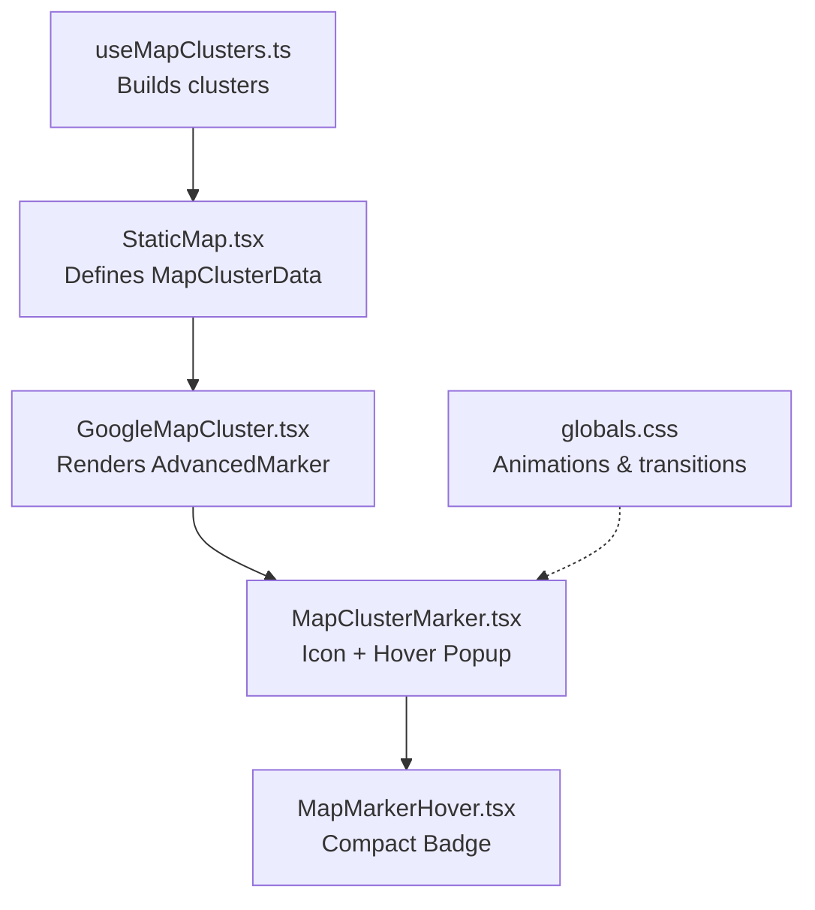
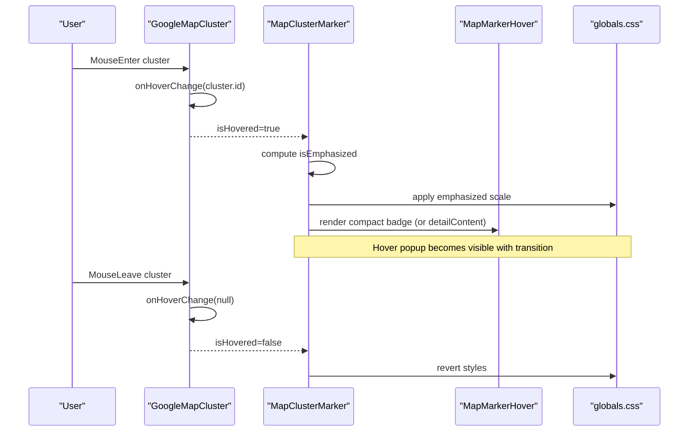
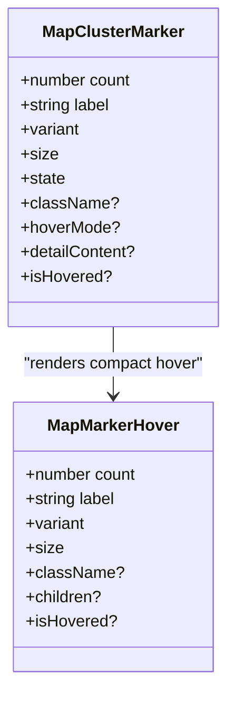
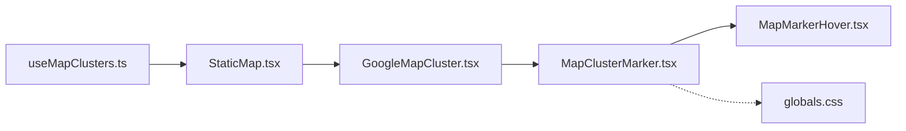
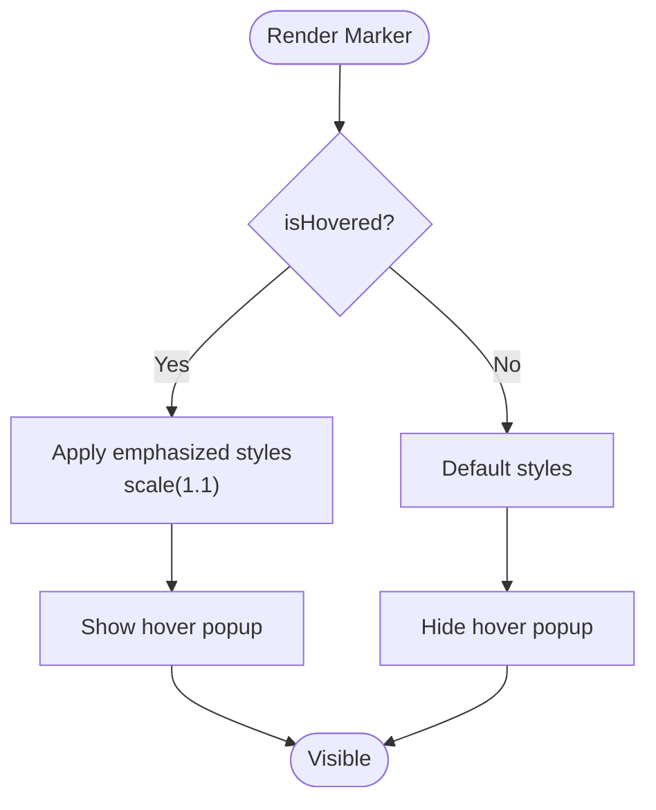

# Cluster Marker Component

<cite>
**Referenced Files in This Document**
- [MapClusterMarker.tsx](file://src/components/ui/map/MapClusterMarker.tsx)
- [MapMarkerHover.tsx](file://src/components/ui/map/MapMarkerHover.tsx)
- [StaticMap.tsx](file://src/components/ui/map/StaticMap.tsx)
- [GoogleMapCluster.tsx](file://src/components/ui/map/GoogleMapCluster.tsx)
- [useMapClusters.ts](file://src/hooks/useMapClusters.ts)
- [globals.css](file://src/app/globals.css)
</cite>

## Table of Contents
1. Introduction
2. Project Structure
3. Core Components
4. Architecture Overview
5. Detailed Component Analysis
6. Dependency Analysis
7. Performance Considerations
8. Troubleshooting Guide
9. Conclusion
10. Appendices

## Introduction
This document provides detailed documentation for the MapClusterMarker component, which renders visual cluster indicators on a map and supports hover interactions to show compact or detailed content. It explains all props, state handling, visual variants, sizing, hover behavior, accessibility considerations, and responsive design patterns used across the map cluster system.

## Project Structure
The cluster marker is part of a small ecosystem:
- MapClusterMarker renders the marker icon and hover popup.
- MapMarkerHover renders the compact hover badge with count and label.
- StaticMap defines the shared data model for clusters and orchestrates rendering.
- GoogleMapCluster integrates with Google Maps and wires hover state to MapClusterMarker.
- useMapClusters fetches and builds cluster data for different app surfaces.
- globals.css provides animations and transitions for hover states.

**Diagram sources**
- [StaticMap.tsx:9-32](file://src/components/ui/map/StaticMap.tsx#L9-L32)
- [GoogleMapCluster.tsx:109-127](file://src/components/ui/map/GoogleMapCluster.tsx#L109-L127)
- [MapClusterMarker.tsx:51-108](file://src/components/ui/map/MapClusterMarker.tsx#L51-L108)
- [MapMarkerHover.tsx:42-71](file://src/components/ui/map/MapMarkerHover.tsx#L42-L71)
- [useMapClusters.ts:35-60](file://src/hooks/useMapClusters.ts#L35-L60)
- [globals.css:1009-1055](file://src/app/globals.css#L1009-L1055)

**Section sources**
- [StaticMap.tsx:9-32](file://src/components/ui/map/StaticMap.tsx#L9-L32)
- [GoogleMapCluster.tsx:109-127](file://src/components/ui/map/GoogleMapCluster.tsx#L109-L127)
- [MapClusterMarker.tsx:51-108](file://src/components/ui/map/MapClusterMarker.tsx#L51-L108)
- [MapMarkerHover.tsx:42-71](file://src/components/ui/map/MapMarkerHover.tsx#L42-L71)
- [useMapClusters.ts:35-60](file://src/hooks/useMapClusters.ts#L35-L60)
- [globals.css:1009-1055](file://src/app/globals.css#L1009-L1055)

## Core Components
- MapClusterMarker: Renders a location pin icon and an animated hover popup above it. Supports variant, size, state, hoverMode, detailContent, and isHovered.
- MapMarkerHover: Renders a compact pill showing count and label with variant-aware text color and size.
- StaticMap: Defines the MapClusterData type (id, count, label, latitude, longitude, variant, size, state, filterValue) and passes hover state down to markers.
- GoogleMapCluster: Wires map-level hover events to per-marker hover state and chooses between compact and detail hover modes based on interactivity.
- useMapClusters: Builds cluster data from various sources and maps them to a consistent variant.

Key behaviors:
- Emphasis: When isHovered is true or state is Hover/Active, the marker scales up slightly via CSS.
- Hover popup: Visible when isHovered; uses compact mode by default or detail mode when interactive.
- Variant and size: Control styling and typography for different cluster types and sizes.

**Section sources**
- [MapClusterMarker.tsx:8-49](file://src/components/ui/map/MapClusterMarker.tsx#L8-L49)
- [MapClusterMarker.tsx:51-108](file://src/components/ui/map/MapClusterMarker.tsx#L51-L108)
- [MapMarkerHover.tsx:7-40](file://src/components/ui/map/MapMarkerHover.tsx#L7-L40)
- [MapMarkerHover.tsx:42-71](file://src/components/ui/map/MapMarkerHover.tsx#L42-L71)
- [StaticMap.tsx:9-32](file://src/components/ui/map/StaticMap.tsx#L9-L32)
- [GoogleMapCluster.tsx:109-127](file://src/components/ui/map/GoogleMapCluster.tsx#L109-L127)
- [useMapClusters.ts:18-23](file://src/hooks/useMapClusters.ts#L18-L23)

## Architecture Overview
The cluster system composes a declarative data model with a map renderer and a reusable marker component. Data flows from hooks into a static container, which dynamically loads the Google Maps implementation and passes cluster data down to markers. Hover state is managed at the map level and propagated to each marker to control visibility and emphasis.

**Diagram sources**
- [GoogleMapCluster.tsx:109-127](file://src/components/ui/map/GoogleMapCluster.tsx#L109-L127)
- [MapClusterMarker.tsx:66-108](file://src/components/ui/map/MapClusterMarker.tsx#L66-L108)
- [MapMarkerHover.tsx:42-71](file://src/components/ui/map/MapMarkerHover.tsx#L42-L71)
- [globals.css:1018-1055](file://src/app/globals.css#L1018-L1055)

## Detailed Component Analysis

### MapClusterMarker
Responsibilities:
- Render a location pin icon with variant, size, and state-driven styling.
- Show an animated hover popup above the marker.
- Support two hover modes:
  - Compact: displays a badge with count and label using MapMarkerHover.
  - Detail: renders custom detailContent passed from the parent.

Props:
- count: number — items in this cluster.
- label: string — text shown in compact hover.
- variant: "by Country" | "by Collection" | "by Location" — affects text color and semantic grouping.
- size: "Small" | "Medium" — controls marker dimensions.
- state: "Default" | "Hover" | "Active" — base state; overridden by isHovered for emphasis.
- className?: string — additional classes.
- hoverMode?: "compact" | "detail" — choose hover display mode.
- detailContent?: ReactNode — full content to render in detail mode.
- isHovered?: boolean — whether the marker is currently hovered.

State and logic:
- isEmphasized = isHovered || state === "Hover" || state === "Active".
- When isHovered is true, the internal state is treated as "Hover" for styling.
- Hover popup visibility toggles via CSS classes controlled by isHovered.

Accessibility:
- The marker icon image has an empty alt attribute; ensure surrounding context provides meaning.
- If adding keyboard focus or actions inside detailContent, provide appropriate roles and labels.

Responsive and motion:
- Transitions are applied only on devices that support hover and fine pointer.
- Reduced motion preference disables transforms and simplifies transitions.

Usage examples (described):
- Customizing appearance: set variant to match cluster type and size to Small or Medium.
- Implementing hover effects: pass isHovered from parent; choose hoverMode="compact" for simple badges or "detail" for rich cards.
- Rendering detailed content: supply detailContent to replace the compact badge.

**Section sources**
- [MapClusterMarker.tsx:8-49](file://src/components/ui/map/MapClusterMarker.tsx#L8-L49)
- [MapClusterMarker.tsx:51-108](file://src/components/ui/map/MapClusterMarker.tsx#L51-L108)
- [globals.css:1018-1055](file://src/app/globals.css#L1018-L1055)

#### Class Diagram

**Diagram sources**
- [MapClusterMarker.tsx:35-49](file://src/components/ui/map/MapClusterMarker.tsx#L35-L49)
- [MapMarkerHover.tsx:28-40](file://src/components/ui/map/MapMarkerHover.tsx#L28-L40)

### MapMarkerHover
Responsibilities:
- Display a compact pill containing a count badge and label.
- Adjust text color based on variant ("by Country" vs others).
- Respect size variants for height.

Props:
- count: number
- label: string
- variant: "by Country" | "by Collection" | "by Location"
- size: "Small" | "Medium"
- className?: string
- children?: ReactNode
- isHovered?: boolean

Behavior:
- Text color switches between foreground and secondary depending on variant.
- Layout is a flex row with a rounded count badge and label text.

**Section sources**
- [MapMarkerHover.tsx:7-40](file://src/components/ui/map/MapMarkerHover.tsx#L7-L40)
- [MapMarkerHover.tsx:42-71](file://src/components/ui/map/MapMarkerHover.tsx#L42-L71)

### StaticMap and Data Model
Responsibilities:
- Define MapClusterData shape used throughout the map system.
- Manage intersection observer to lazy-load the map.
- Track hovered cluster id and pass it down to markers.

Key fields:
- id, count, label, latitude, longitude
- variant: "by Country" | "by Collection" | "by Location"
- size: "Small" | "Medium"
- state: "Default" | "Hover" | "Active"
- filterValue?: string

Integration:
- Passes interactive flag to determine hoverMode for markers.
- Provides renderDetailContent callback to inject custom detail UI.

**Section sources**
- [StaticMap.tsx:9-32](file://src/components/ui/map/StaticMap.tsx#L9-L32)
- [StaticMap.tsx:39-95](file://src/components/ui/map/StaticMap.tsx#L39-L95)

### GoogleMapCluster Integration
Responsibilities:
- Provide API key and theme-based map ID.
- Compute initial view (center/zoom) based on cluster bounds.
- Wire mouse enter/leave to update hoveredClusterId.
- Render MapClusterMarker for each cluster with appropriate props.

Hover flow:
- On mouse enter: set hoveredClusterId to cluster id.
- On mouse leave: reset to null.
- Markers receive isHovered based on equality check.

Interactive mode:
- When interactive is true, hoverMode defaults to "detail", allowing custom detailContent to be rendered.

**Section sources**
- [GoogleMapCluster.tsx:13-45](file://src/components/ui/map/GoogleMapCluster.tsx#L13-L45)
- [GoogleMapCluster.tsx:80-136](file://src/components/ui/map/GoogleMapCluster.tsx#L80-L136)

### useMapClusters Hook
Responsibilities:
- Fetch cluster data for different sources (dashboard, collections, content, itineraries).
- Build locality pins with a consistent variant mapping.
- Return clusters, entityIdsByLocality, and loading state.

Variant mapping:
- All sources map to "by Location" variant by default.

**Section sources**
- [useMapClusters.ts:16-33](file://src/hooks/useMapClusters.ts#L16-L33)
- [useMapClusters.ts:35-60](file://src/hooks/useMapClusters.ts#L35-L60)

## Dependency Analysis

**Diagram sources**
- [useMapClusters.ts:35-60](file://src/hooks/useMapClusters.ts#L35-L60)
- [StaticMap.tsx:39-95](file://src/components/ui/map/StaticMap.tsx#L39-L95)
- [GoogleMapCluster.tsx:109-127](file://src/components/ui/map/GoogleMapCluster.tsx#L109-L127)
- [MapClusterMarker.tsx:51-108](file://src/components/ui/map/MapClusterMarker.tsx#L51-L108)
- [MapMarkerHover.tsx:42-71](file://src/components/ui/map/MapMarkerHover.tsx#L42-L71)
- [globals.css:1009-1055](file://src/app/globals.css#L1009-L1055)

**Section sources**
- [useMapClusters.ts:35-60](file://src/hooks/useMapClusters.ts#L35-L60)
- [StaticMap.tsx:39-95](file://src/components/ui/map/StaticMap.tsx#L39-L95)
- [GoogleMapCluster.tsx:109-127](file://src/components/ui/map/GoogleMapCluster.tsx#L109-L127)
- [MapClusterMarker.tsx:51-108](file://src/components/ui/map/MapClusterMarker.tsx#L51-L108)
- [MapMarkerHover.tsx:42-71](file://src/components/ui/map/MapMarkerHover.tsx#L42-L71)
- [globals.css:1009-1055](file://src/app/globals.css#L1009-L1055)

## Performance Considerations
- Lazy map loading: StaticMap defers loading until the container is in view, reducing initial bundle and network cost.
- Minimal re-renders: Hover state is centralized in the map layer and passed down as booleans to markers.
- CSS transitions: Use hardware-accelerated transforms for smooth hover effects; reduced-motion media queries disable animations for users who prefer it.
- Avoid heavy detailContent: In interactive mode, detailContent can be expensive; consider memoization if rendering complex components.

[No sources needed since this section provides general guidance]

## Troubleshooting Guide
Common issues and resolutions:
- Hover popup not appearing:
  - Ensure isHovered is true and that the hover container classes toggle correctly.
  - Verify that parent mouse events propagate to the marker.
- Incorrect variant styling:
  - Confirm variant values match expected strings and that MapMarkerHover receives the same variant.
- Detail content not rendering:
  - In interactive mode, ensure renderDetailContent is provided and hoverMode resolves to "detail".
- Accessibility concerns:
  - Add meaningful aria-labels to interactive elements within detailContent.
  - Ensure keyboard navigation works if markers become focusable.

**Section sources**
- [MapClusterMarker.tsx:66-108](file://src/components/ui/map/MapClusterMarker.tsx#L66-L108)
- [GoogleMapCluster.tsx:109-127](file://src/components/ui/map/GoogleMapCluster.tsx#L109-L127)
- [globals.css:1018-1055](file://src/app/globals.css#L1018-L1055)

## Conclusion
MapClusterMarker provides a flexible, accessible, and responsive way to visualize clustered locations on a map. By combining variant-driven styling, size options, and hover modes, it supports both compact summaries and rich detail views. Centralized hover management and CSS transitions deliver smooth interactions while respecting user preferences for reduced motion.

[No sources needed since this section summarizes without analyzing specific files]

## Appendices

### Props Reference
- count: number — Items in this cluster.
- label: string — Text displayed in compact hover.
- variant: "by Country" | "by Collection" | "by Location" — Semantic grouping affecting text color and style.
- size: "Small" | "Medium" — Marker dimensions.
- state: "Default" | "Hover" | "Active" — Base state; isHovered overrides to "Hover" for emphasis.
- className?: string — Additional classes.
- hoverMode?: "compact" | "detail" — Choose between compact badge or custom detailContent.
- detailContent?: ReactNode — Full content to render in detail mode.
- isHovered?: boolean — Whether the marker is currently hovered.

**Section sources**
- [MapClusterMarker.tsx:35-49](file://src/components/ui/map/MapClusterMarker.tsx#L35-L49)

### Visual States Flow

**Diagram sources**
- [MapClusterMarker.tsx:66-108](file://src/components/ui/map/MapClusterMarker.tsx#L66-L108)
- [globals.css:1018-1055](file://src/app/globals.css#L1018-L1055)