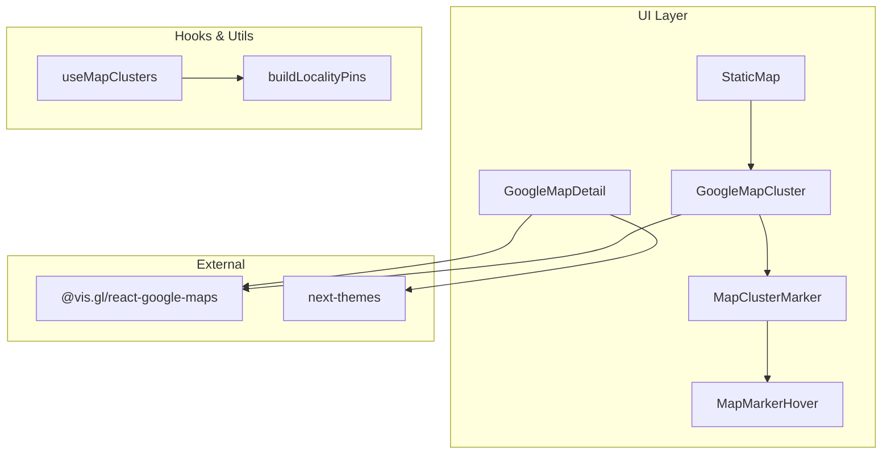
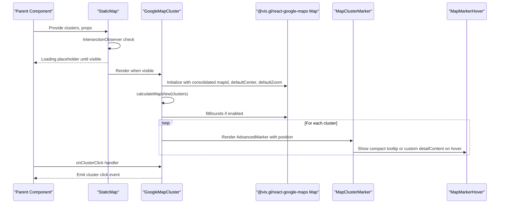
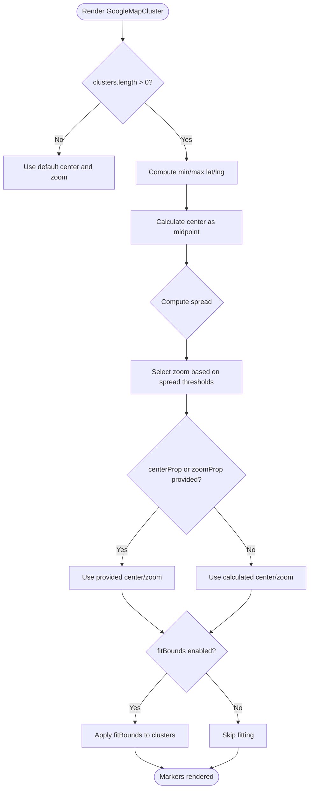
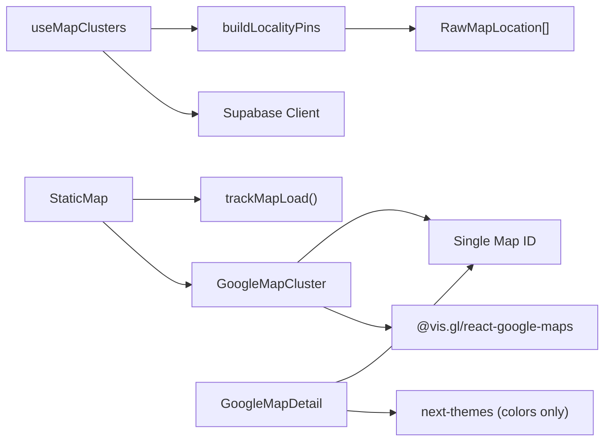

# Google Maps Integration

<cite>
**Referenced Files in This Document**
- [GoogleMapCluster.tsx](file://src/components/ui/map/GoogleMapCluster.tsx)
- [StaticMap.tsx](file://src/components/ui/map/StaticMap.tsx)
- [MapContainer.tsx](file://src/components/ui/map/MapContainer.tsx)
- [MapClusterMarker.tsx](file://src/components/ui/map/MapClusterMarker.tsx)
- [MapMarkerHover.tsx](file://src/components/ui/map/MapMarkerHover.tsx)
- [GoogleMapDetail.tsx](file://src/components/ui/map/GoogleMapDetail.tsx)
- [useMapClusters.ts](file://src/hooks/useMapClusters.ts)
- [locality-pins.ts](file://src/lib/maps/locality-pins.ts)
- [maps.ts](file://src/lib/api/maps.ts)
</cite>

## Update Summary
**Changes Made**
- Updated theme-aware styling section to reflect consolidation of map IDs
- Removed references to separate dark mode map ID configuration
- Updated architecture diagrams to show simplified theme handling
- Revised troubleshooting guide to reflect new single map ID approach

## Table of Contents
1. [Introduction](#introduction)
2. [Project Structure](#project-structure)
3. [Core Components](#core-components)
4. [Architecture Overview](#architecture-overview)
5. [Detailed Component Analysis](#detailed-component-analysis)
6. [Dependency Analysis](#dependency-analysis)
7. [Performance Considerations](#performance-considerations)
8. [Troubleshooting Guide](#troubleshooting-guide)
9. [Conclusion](#conclusion)
10. [Appendices](#appendices)

## Introduction
This document provides comprehensive documentation for the GoogleMapCluster component, which serves as the main container for interactive map clustering using Google Maps via @vis.gl/react-google-maps. It covers configuration options (center coordinates, zoom levels, interactive mode, fit bounds behavior, and custom render functions), integration with Google Maps API, consolidated theme-aware map styling using a single map ID for both light and dark themes, automatic view calculation based on cluster distribution, examples for setup and user interactions, performance considerations for large datasets, and best practices for initialization.

## Project Structure
The map clustering feature is implemented across several components and utilities:
- GoogleMapCluster: Main container that initializes the Google Map, manages view calculations, and renders cluster markers.
- StaticMap: A wrapper that lazily loads GoogleMapCluster and handles intersection-based rendering and hover state.
- MapContainer: A separate map container used for detailed maps; included here to clarify differences from clustering-focused components.
- MapClusterMarker and MapMarkerHover: UI for marker visuals and hover tooltips.
- GoogleMapDetail: Detailed map component with enhanced features like search and polyline support.
- useMapClusters: Hook to fetch and build clusters from data sources.
- locality-pins: Utility to group raw locations into clusters by locality labels.
- maps.ts: Analytics tracking for map usage.

**Diagram sources**
- [GoogleMapCluster.tsx:1-176](file://src/components/ui/map/GoogleMapCluster.tsx#L1-L176)
- [StaticMap.tsx:1-103](file://src/components/ui/map/StaticMap.tsx#L1-L103)
- [GoogleMapDetail.tsx:1-487](file://src/components/ui/map/GoogleMapDetail.tsx#L1-L487)
- [MapClusterMarker.tsx:1-115](file://src/components/ui/map/MapClusterMarker.tsx#L1-L115)
- [MapMarkerHover.tsx:1-78](file://src/components/ui/map/MapMarkerHover.tsx#L1-L78)
- [useMapClusters.ts:1-61](file://src/hooks/useMapClusters.ts#L1-L61)
- [locality-pins.ts:1-78](file://src/lib/maps/locality-pins.ts#L1-L78)

**Section sources**
- [GoogleMapCluster.tsx:1-176](file://src/components/ui/map/GoogleMapCluster.tsx#L1-L176)
- [StaticMap.tsx:1-103](file://src/components/ui/map/StaticMap.tsx#L1-L103)
- [MapContainer.tsx:1-99](file://src/components/ui/map/MapContainer.tsx#L1-L99)

## Core Components
- GoogleMapCluster: Renders a Google Map with cluster markers, supports center/zoom overrides, interactive gestures, fit bounds, custom detail content, optional zoom controls, and hover state management.
- StaticMap: Lazy-loads GoogleMapCluster when visible, tracks map load analytics, and manages hover state for cluster markers.
- GoogleMapDetail: Enhanced map component with search capabilities, polyline support, and detailed location information display.
- MapClusterMarker: Displays a pin icon and hover tooltip or custom detail content based on hover mode.
- MapMarkerHover: Compact tooltip showing count and label.
- useMapClusters: Fetches raw location data and builds clusters grouped by locality labels.
- buildLocalityPins: Groups items by region/country and computes average coordinates and counts.

Key responsibilities:
- View calculation: Automatically compute center and zoom based on cluster spread.
- Fit bounds: Optionally adjust map viewport to include all clusters.
- Consolidated theme styling: Use single map ID for both light and dark themes, eliminating complex theme-based map ID switching.
- Interaction: Optional interactive mode enabling gestures and zoom controls.

**Section sources**
- [GoogleMapCluster.tsx:67-176](file://src/components/ui/map/GoogleMapCluster.tsx#L67-L176)
- [StaticMap.tsx:21-103](file://src/components/ui/map/StaticMap.tsx#L21-L103)
- [GoogleMapDetail.tsx:288-487](file://src/components/ui/map/GoogleMapDetail.tsx#L288-L487)
- [MapClusterMarker.tsx:8-115](file://src/components/ui/map/MapClusterMarker.tsx#L8-L115)
- [MapMarkerHover.tsx:7-78](file://src/components/ui/map/MapMarkerHover.tsx#L7-L78)
- [useMapClusters.ts:16-61](file://src/hooks/useMapClusters.ts#L16-L61)
- [locality-pins.ts:4-78](file://src/lib/maps/locality-pins.ts#L4-L78)

## Architecture Overview
The system composes React components around Google Maps via @vis.gl/react-google-maps. Data flows from hooks and utilities into the map, which renders markers and handles interactions. The architecture now uses a simplified theme approach with a single map ID for consistent styling across light and dark modes.

**Diagram sources**
- [GoogleMapCluster.tsx:67-136](file://src/components/ui/map/GoogleMapCluster.tsx#L67-L136)
- [StaticMap.tsx:39-93](file://src/components/ui/map/StaticMap.tsx#L39-L93)
- [MapClusterMarker.tsx:51-115](file://src/components/ui/map/MapClusterMarker.tsx#L51-L115)
- [MapMarkerHover.tsx:42-78](file://src/components/ui/map/MapMarkerHover.tsx#L42-L78)

## Detailed Component Analysis

### GoogleMapCluster
Responsibilities:
- Wraps the map with APIProvider for Google Maps integration.
- Computes auto view (center and zoom) based on cluster distribution.
- Applies consolidated theme-aware map ID selection using single map ID.
- Renders cluster markers with hover and click handlers.
- Optionally fits bounds to show all clusters.
- Provides optional zoom controls in interactive mode.

Configuration options:
- clusters: Array of cluster data objects including id, count, label, latitude, longitude, variant, size, state, filterValue.
- center: Optional [lat, lng] tuple to override auto-calculated center.
- zoom: Optional number to override auto-calculated zoom.
- onClusterClick: Optional callback invoked when a cluster marker is clicked.
- interactive: Boolean to enable gestures and zoom controls.
- fitBounds: Boolean to automatically fit the map to include all clusters.
- renderDetailContent: Optional function to provide custom detail content for hover in "detail" mode.
- showZoomControls: Boolean to show custom zoom controls (defaults to interactive).
- hoveredClusterId: Controlled state indicating currently hovered cluster id.
- onHoverChange: Callback to update hovered cluster id.

Automatic view calculation:
- If no clusters, returns a default center and low zoom.
- If one cluster, centers on it with moderate zoom.
- Otherwise, calculates bounding box and selects zoom based on geographic spread thresholds.

Fit bounds behavior:
- Uses LatLngBounds to extend over all cluster positions and applies padding.
- Single cluster case sets center and zoom directly.

Consolidated theme styling:
- Uses single map ID (`NEXT_PUBLIC_GOOGLE_MAPS_MAP_ID_LIGHT`) for both light and dark themes, eliminating the need for separate dark mode map ID configuration.
- Simplifies deployment by removing dependency on multiple map IDs.

Interaction handling:
- Markers emit onClick to onClusterClick.
- Markers emit onMouseEnter/onMouseLeave to update hoveredClusterId via onHoverChange.

**Diagram sources**
- [GoogleMapCluster.tsx:11-67](file://src/components/ui/map/GoogleMapCluster.tsx#L11-L67)
- [GoogleMapCluster.tsx:78-136](file://src/components/ui/map/GoogleMapCluster.tsx#L78-L136)

**Section sources**
- [GoogleMapCluster.tsx:67-176](file://src/components/ui/map/GoogleMapCluster.tsx#L67-L176)

### StaticMap
Responsibilities:
- Lazily loads GoogleMapCluster when the container enters the viewport.
- Tracks map load analytics when visible.
- Manages hover state for cluster markers and passes it down.

Props:
- clusters, center, zoom, height, className, onClusterClick, interactive, fitBounds, renderDetailContent, showZoomControls.

Behavior:
- Shows a loading placeholder until visible.
- Dynamically imports GoogleMapCluster to reduce initial bundle cost.
- Delegates hover state to GoogleMapCluster via controlled props.

**Section sources**
- [StaticMap.tsx:21-103](file://src/components/ui/map/StaticMap.tsx#L21-L103)

### GoogleMapDetail
Enhanced map component with additional features:
- Search functionality with place search integration.
- Polyline support for route visualization.
- Detailed location information display with hover popups.
- Theme-aware color styling for visual elements (not map IDs).

Key enhancements:
- Uses `useTheme` hook for color styling decisions (light/dark palette selection).
- Maintains single map ID approach for consistency.
- Provides advanced interaction patterns for location discovery.

**Section sources**
- [GoogleMapDetail.tsx:288-487](file://src/components/ui/map/GoogleMapDetail.tsx#L288-L487)

### MapClusterMarker and MapMarkerHover
Responsibilities:
- Display a pin icon with variant, size, and state styles.
- Show a compact tooltip (count + label) or custom detail content on hover.
- Support emphasis states (hover/active) with visual transitions.

Props:
- count, label, variant, size, state, hoverMode, detailContent, isHovered.

Behavior:
- In compact mode, shows MapMarkerHover above the marker.
- In detail mode, renders provided detailContent.
- Applies CSS classes for visibility transitions on hover.

**Section sources**
- [MapClusterMarker.tsx:8-115](file://src/components/ui/map/MapClusterMarker.tsx#L8-L115)
- [MapMarkerHover.tsx:7-78](file://src/components/ui/map/MapMarkerHover.tsx#L7-L78)

### useMapClusters and buildLocalityPins
Responsibilities:
- Fetch raw location data per source (dashboard, collections, content, itineraries).
- Build clusters grouped by locality labels ("region, country" or "country").
- Compute average coordinates and counts per group.
- Return clusters and entityIdsByLocality mapping for filtering.

Data flow:
- useQuery triggers query function with Supabase client.
- Query returns RawMapLocation[].
- buildLocalityPins groups and aggregates into MapClusterData[].

**Section sources**
- [useMapClusters.ts:16-61](file://src/hooks/useMapClusters.ts#L16-L61)
- [locality-pins.ts:4-78](file://src/lib/maps/locality-pins.ts#L4-L78)

## Dependency Analysis
Component relationships and external dependencies:
- GoogleMapCluster depends on @vis.gl/react-google-maps for Map, AdvancedMarker, MapControl, ControlPosition, useMap, and APIProvider.
- Consolidated theme integration via single map ID eliminates complex theme-based map ID switching.
- StaticMap dynamically imports GoogleMapCluster to optimize loading.
- useMapClusters depends on Supabase client and queries to retrieve raw locations.
- buildLocalityPins transforms raw data into cluster structures consumed by the map.
- GoogleMapDetail uses next-themes for color styling while maintaining single map ID approach.

**Diagram sources**
- [GoogleMapCluster.tsx:1-176](file://src/components/ui/map/GoogleMapCluster.tsx#L1-L176)
- [StaticMap.tsx:34-37](file://src/components/ui/map/StaticMap.tsx#L34-L37)
- [GoogleMapDetail.tsx:5-24](file://src/components/ui/map/GoogleMapDetail.tsx#L5-L24)
- [useMapClusters.ts:1-15](file://src/hooks/useMapClusters.ts#L1-L15)
- [locality-pins.ts:1-3](file://src/lib/maps/locality-pins.ts#L1-L3)
- [maps.ts:11-33](file://src/lib/api/maps.ts#L11-L33)

**Section sources**
- [GoogleMapCluster.tsx:1-176](file://src/components/ui/map/GoogleMapCluster.tsx#L1-L176)
- [StaticMap.tsx:34-37](file://src/components/ui/map/StaticMap.tsx#L34-L37)
- [GoogleMapDetail.tsx:5-24](file://src/components/ui/map/GoogleMapDetail.tsx#L5-L24)
- [useMapClusters.ts:1-15](file://src/hooks/useMapClusters.ts#L1-L15)
- [locality-pins.ts:1-3](file://src/lib/maps/locality-pins.ts#L1-L3)
- [maps.ts:11-33](file://src/lib/api/maps.ts#L11-L33)

## Performance Considerations
- Lazy loading: StaticMap uses dynamic import and intersection observer to defer map initialization until visible, reducing initial bundle and runtime overhead.
- Cluster grouping: buildLocalityPins groups by string keys and computes averages once, minimizing repeated computations during render.
- Fit bounds: fitBounds is applied only when enabled; single-cluster optimization avoids unnecessary bounds computation.
- Interactive mode: Disabling gestures reduces interaction overhead when not needed.
- Analytics: trackMapLoad records usage without blocking UI; errors are caught to prevent failures.
- **Simplified theme handling**: Single map ID approach reduces complexity and potential loading issues associated with multiple map configurations.

Recommendations:
- Use fitBounds sparingly for large datasets; consider precomputing bounds or limiting visible clusters.
- Prefer compact hover mode for better performance with many markers.
- Ensure clusters array is memoized or stable to avoid re-renders.
- Keep cluster data minimal; pass only necessary fields to markers.
- Leverage the simplified single map ID approach for improved reliability and easier deployment.

## Troubleshooting Guide
Common issues and resolutions:
- Map does not appear:
  - Verify environment variables for Google Maps API key and map ID are set.
  - Ensure the container has a defined height; StaticMap uses height prop to size the map.
  - Check that the single map ID environment variable is properly configured.
- Clusters not centered or zoom incorrect:
  - Provide explicit center and zoom props to override auto-calculation.
  - Disable fitBounds if automatic fitting causes unexpected views.
- Interactions not working:
  - Set interactive=true to enable gestures and zoom controls.
  - Confirm onClusterClick and onHoverChange handlers are provided and correctly wired.
- Hover not showing:
  - Ensure hoveredClusterId and onHoverChange are managed in parent state.
  - Check that detailContent is provided when using detail hover mode.
- **Theme-related issues**:
  - The consolidated single map ID approach eliminates previous issues with missing dark mode map IDs.
  - If styling appears incorrect, verify the single map ID is properly configured in your Google Cloud Console.

Analytics and monitoring:
- trackMapLoad is called when the map becomes visible; failures are silently ignored to avoid breaking UI.

**Section sources**
- [GoogleMapCluster.tsx:8-9](file://src/components/ui/map/GoogleMapCluster.tsx#L8-L9)
- [StaticMap.tsx:57-65](file://src/components/ui/map/StaticMap.tsx#L57-L65)
- [maps.ts:11-33](file://src/lib/api/maps.ts#L11-L33)

## Conclusion
GoogleMapCluster provides a robust, theme-consolidated, and configurable interface for displaying clustered map data with Google Maps. The recent improvements simplify theme handling by using a single map ID for both light and dark themes, eliminating complex configuration issues. It supports automatic view calculation, optional fit bounds, interactive gestures, and customizable hover details. Paired with StaticMap's lazy loading and useMapClusters' data processing, it offers an efficient and reliable solution for interactive map clustering in applications.

## Appendices

### Configuration Options Summary
- clusters: Required array of cluster data objects.
- center: Optional [lat, lng] to override auto center.
- zoom: Optional number to override auto zoom.
- onClusterClick: Optional callback for cluster clicks.
- interactive: Boolean to enable gestures and zoom controls.
- fitBounds: Boolean to fit map to cluster bounds.
- renderDetailContent: Optional function to render custom detail content on hover.
- showZoomControls: Boolean to show zoom controls (defaults to interactive).
- hoveredClusterId: Controlled state for hover highlighting.
- onHoverChange: Callback to update hovered cluster id.

**Section sources**
- [GoogleMapCluster.tsx:156-176](file://src/components/ui/map/GoogleMapCluster.tsx#L156-L176)
- [StaticMap.tsx:21-32](file://src/components/ui/map/StaticMap.tsx#L21-L32)

### Example Setup Patterns
- Basic static map with clustering:
  - Provide clusters and let auto view calculate center and zoom.
  - Use StaticMap to lazy-load and manage hover state.
- Interactive map with custom detail content:
  - Set interactive=true and provide renderDetailContent to show rich info on hover.
  - Wire onClusterClick to handle navigation or actions.
- Custom bounds and zoom:
  - Pass center and zoom props to override automatic calculations.
  - Disable fitBounds if you want full control over viewport.
- **Simplified theme configuration**:
  - Configure single map ID environment variable for consistent styling across themes.
  - No need to manage separate dark mode map IDs.

### Data Model: MapClusterData
Fields:
- id: Unique identifier for the cluster.
- count: Number of items in the cluster.
- label: Human-readable label (e.g., "Region, Country").
- latitude: Average latitude for the cluster.
- longitude: Average longitude for the cluster.
- variant: Visual variant ("by Country", "by Collection", "by Location").
- size: Marker size ("Small", "Medium").
- state: Visual state ("Default", "Hover", "Active").
- filterValue: Value used for filtering/grouping.

**Section sources**
- [StaticMap.tsx:9-19](file://src/components/ui/map/StaticMap.tsx#L9-L19)

### Environment Variables
- `NEXT_PUBLIC_GOOGLE_MAPS_API_KEY`: Google Maps API key for authentication.
- `NEXT_PUBLIC_GOOGLE_MAPS_MAP_ID_LIGHT`: Single map ID used for both light and dark themes (replaces separate dark mode map ID).

**Updated** The map integration now uses a consolidated approach with a single map ID for both themes, simplifying configuration and improving reliability.

**Section sources**
- [GoogleMapCluster.tsx:8-9](file://src/components/ui/map/GoogleMapCluster.tsx#L8-L9)
- [GoogleMapDetail.tsx:23-24](file://src/components/ui/map/GoogleMapDetail.tsx#L23-L24)